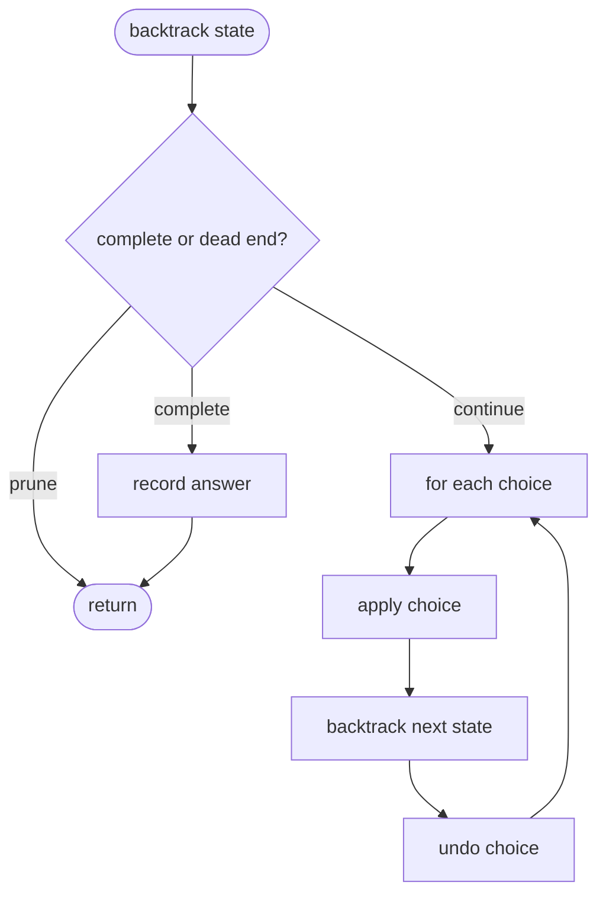

# Backtracking

**Backtracking** is a systematic search over **choices**: try an option, recurse, then **undo** (backtrack) if the partial solution cannot lead to a valid complete answer. It is DFS over a **state space tree** with pruning.

| | |
| --- | --- |
| **What it is** | Choose → explore → unchoose; often expressed as recursion plus explicit undo. |
| **Time** | Exponential in worst case (e.g. O(2ⁿ), O(n!)); pruning cuts branches early. |
| **Space** | O(depth) call stack plus path storage; O(depth) for the current choice path. |
| **When to use** | Generate all valid combinations, permutations, board placements, or path existence with constraints. |

This page is your **ready reference** for the backtracking template, classic patterns (subsets, permutations, combinations), grid path search, and pruning. It builds on [Recursion](../../recursion/index.md) and pairs naturally with [2D grids](../../data-structures/2d-grids/index.md) and [Graphs](../../data-structures/graphs/index.md) DFS. For Big-O notation, see [Complexity analysis](../../complexity/index.md).

[Parent: Algorithms](../index.md)

---

## Practical applications

| Use case | Search space | Backtrack when |
| --- | --- | --- |
| **All subsets of a set** | Include / skip each element | Never (small n) |
| **Permutations** | Pick unused elements in order | Duplicate values pruned |
| **N-Queens** | Place queen per row | Column/diagonal conflict |
| **Word search on board** | Extend path letter by letter | Letter mismatch or reuse |
| **Sudoku / constraint puzzles** | Fill next empty cell | Rule violation |
| **Combination sum** | Add candidates with reuse rules | Sum exceeds target |

---

## The universal template

Every backtracking solution follows the same skeleton:

1. **Base case** — current path is a complete valid answer (record it).
2. **Choices** — list legal next moves from current state.
3. **Choose** — apply one move (push to path, mark visited).
4. **Explore** — recurse.
5. **Unchoose** — undo the move (pop, unmark) before trying the next choice.



```python
def backtrack(state, path, results):
 if is_complete(state):
 results.append(path[:]) # copy
 return
 if should_prune(state):
 return
 for choice in choices(state):
 apply(state, path, choice)
 backtrack(state, path, results)
 undo(state, path, choice)
```

| | |
| --- | --- |
| **Time** | O(branches^depth) without pruning; less with strong prune |
| **Space** | O(depth) recursion + O(output) if storing all answers |

**Critical detail:** append a **copy** of `path` (`path[:]`) to `results`, not the live list that you mutate.

---

## Subsets (include / exclude each element)

Generate all subsets of `nums` — 2ⁿ answers in the worst case.

```python
def subsets(nums):
 out = []

 def dfs(i, path):
 if i == len(nums):
 out.append(path[:])
 return
 dfs(i + 1, path) # exclude nums[i]
 path.append(nums[i])
 dfs(i + 1, path) # include nums[i]
 path.pop()

 dfs(0, [])
 return out
```

| | |
| --- | --- |
| **Time** | O(n · 2ⁿ) including copy cost |
| **Space** | O(n) stack depth |

---

## Permutations

Build orderings; use a `used` array or swap-in-place (Heap's method) to avoid reusing the same index.

```python
def permutations(nums):
 out = []
 used = [False] * len(nums)

 def dfs(path):
 if len(path) == len(nums):
 out.append(path[:])
 return
 for i, x in enumerate(nums):
 if used[i]:
 continue
 used[i] = True
 path.append(x)
 dfs(path)
 path.pop()
 used[i] = False

 dfs([])
 return out
```

| | |
| --- | --- |
| **Time** | O(n · n!) |
| **Space** | O(n) |

**Duplicate handling:** sort `nums` first; skip index `i` when `nums[i] == nums[i-1]` and `i-1` was not used in this branch.

---

## Combinations (choose k from n)

Fix increasing start index so `{1,2}` and `{2,1}` are not both generated.

```python
def combine(n, k):
 out = []

 def dfs(start, path):
 if len(path) == k:
 out.append(path[:])
 return
 need = k - len(path)
 for i in range(start, n - need + 2):
 path.append(i)
 dfs(i + 1, path)
 path.pop()

 dfs(1, [])
 return out
```

---

## Combination sum (reuse allowed)

Sort candidates; prune when running sum exceeds target; optionally skip equal neighbors at the same depth to avoid duplicate combinations.

```python
def combination_sum(candidates, target):
 candidates.sort()
 out = []

 def dfs(start, path, total):
 if total == target:
 out.append(path[:])
 return
 if total > target:
 return
 for i in range(start, len(candidates)):
 x = candidates[i]
 path.append(x)
 dfs(i, path, total + x) # i: reuse same value
 path.pop()

 dfs(0, [], 0)
 return out
```

---

## Grid word search (path with undo)

Letters live on a [2D grid](../../data-structures/2d-grids/index.md). Mark cell visited during recursion, restore after return.

```python
def word_search(board, word):
 rows, cols = len(board), len(board[0])

 def dfs(r, c, k):
 if k == len(word):
 return True
 if not (0 <= r < rows and 0 <= c < cols):
 return False
 if board[r][c] != word[k]:
 return False
 temp = board[r][c]
 board[r][c] = "#" # mark visited
 found = any(
 dfs(r + dr, c + dc, k + 1)
 for dr, dc in ((0, 1), (0, -1), (1, 0), (-1, 0))
 )
 board[r][c] = temp # undo
 return found

 for r in range(rows):
 for c in range(cols):
 if dfs(r, c, 0):
 return True
 return False
```

| | |
| --- | --- |
| **Time** | O(R · C · 4^L) worst case; L = word length |
| **Space** | O(L) recursion depth |

For many words at once, combine with a [Trie](../../data-structures/tries/index.md).

---

## Constraint satisfaction (N-Queens sketch)

Place one queen per row; columns and diagonals tracked in sets for O(1) conflict checks.

```python
def solve_n_queens(n):
 out = []
 cols, diag1, diag2 = set(), set(), set()
 board = [["."] * n for _ in range(n)]

 def dfs(row):
 if row == n:
 out.append(["".join(r) for r in board])
 return
 for col in range(n):
 d1, d2 = row - col, row + col
 if col in cols or d1 in diag1 or d2 in diag2:
 continue
 cols.add(col); diag1.add(d1); diag2.add(d2)
 board[row][col] = "Q"
 dfs(row + 1)
 board[row][col] = "."
 cols.remove(col); diag1.remove(d1); diag2.remove(d2)

 dfs(0)
 return out
```

---

## Backtracking vs other techniques

| Technique | Explores | Keeps partial invalid work? | Typical output |
| --- | --- | --- | --- |
| **Backtracking** | All paths until prune | Briefly, then undoes | All solutions or one |
| **DFS on graph** | Vertices once (with `seen`) | No undo unless path search | Reachability, components |
| **BFS** | Layers by distance | Queue of states | Shortest unweighted path |
| **Dynamic programming** | Overlapping subproblems once | Memo/table | Optimal value or count |
| **Greedy** | One local choice per step | No search tree | One constructed answer |

Use backtracking when you need **all** valid configurations or must **try and revert** choices. Switch to [Dynamic programming](../dynamic-programming/index.md) when subproblems repeat and optimal structure exists.

---

## Pruning strategies

| Strategy | Example |
| --- | --- |
| **Feasibility cut** | Stop when partial sum > target |
| **Ordering** | Sort candidates so large values fail early |
| **Duplicate skip** | Same value at same tree depth |
| **Constraint sets** | `cols`, `diag` for N-Queens |
| **Early success** | Return on first found path if only existence matters |

Strong pruning turns unusable exponential search into something that passes typical test sizes.

---

## Complexity summary

| Pattern | Typical time | Space |
| --- | --- | --- |
| Subsets | O(n · 2ⁿ) | O(n) |
| Permutations | O(n · n!) | O(n) |
| Combinations C(n,k) | O(k · C(n,k)) | O(k) |
| Grid path length L | O(R · C · 4^L) worst | O(L) |
| N-Queens | O(n!) with pruning | O(n) |

Worst cases are pessimistic; **pruning** and **problem structure** matter more in practice than the raw exponent.

---

## Common pitfalls

| Pitfall | Why it hurts | Fix |
| --- | --- | --- |
| Forgetting to undo | Wrong shared state | Always `pop` / unmark after recurse |
| Storing live `path` ref | All results identical | Append `path[:]` |
| No copy on board mark | Cells stay `"#"` | Restore char after DFS |
| Infinite recursion | No progress toward base | Ensure index/row increases |
| Python recursion depth | `RecursionError` on deep paths | Iterative stack or increase limit sparingly |

For very deep search in Python, prefer an **explicit stack** mirroring the recursive template — same choose/undo logic, no call-frame limit.

---

## Related pages

| Page | Relationship |
| --- | --- |
| [Recursion](../../recursion/index.md) | Base case + recursive case; call stack |
| [2D grids](../../data-structures/2d-grids/index.md) | Grid DFS with visit/undo |
| [Graphs](../../data-structures/graphs/index.md) | DFS traversal theory |
| [Tries](../../data-structures/tries/index.md) | Multi-word grid search |
| [Dynamic programming](../dynamic-programming/index.md) | When subproblems overlap — memo instead of re-explore |
| [Complexity analysis](../../complexity/index.md) | Exponential time notation |

---

## Quick reference card

```python
def backtrack(...):
 if done:
 results.append(path[:])
 return
 for choice in choices:
 apply(choice)
 backtrack(...)
 undo(choice)
```

1. **Define state** — what varies between calls (index, row, remaining sum).
2. **Define choices** — legal moves from this state only.
3. **Prune** — return early when impossible.
4. **Undo** — restore state before next sibling choice.

---

## Next steps

1. Code **subsets** and **permutations** from the template without looking.
2. Solve **word search** on a small board; trace mark and undo on paper.
3. Compare with [Dynamic programming](../dynamic-programming/index.md) on **coin change** — when counting ways becomes tabulation instead of full tree search.
4. For shortest path on a grid without trying all paths, use BFS on [2D grids](../../data-structures/2d-grids/index.md) instead of backtracking.
