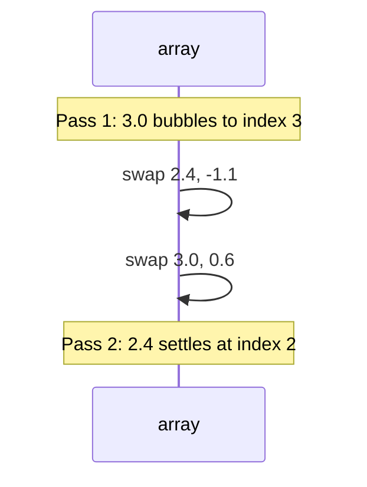

# Bubble sort

A **comparison sort** that repeatedly scans the array, **swapping adjacent** elements that are out of order. After each full pass, the largest unsorted value has "bubbled" to the end of the unsorted region.

| | |
| --- | --- |
| **What it is** | Adjacent pairwise compare-and-swap until a pass makes zero swaps (or you finish a fixed number of passes). |
| **Time** | **Best** O(n) with early-exit flag on already-sorted data; **average** Θ(n²); **worst** Θ(n²). |
| **Space** | O(1) auxiliary—in-place on a mutable sequence. |
| **Stability** | **Stable** if you only swap when `left > right` (never on equal keys). |
| **In-place** | **Yes** (only O(1) extra variables). |
| **When to use** | Teaching, tiny *n*, or detecting "already sorted" with one cheap pass—not production station archives. |

In **daily weather data analysis**, bubble sort is the wrong tool for sorting 50,000 station readings or a multi-year anomaly table—but it is an excellent way to **see** why Θ(n²) hurts: imagine ranking four `DailyReading` rows in one window by `temp_anomaly` by swapping neighbors until the warmest day "bubbles" to the end. You will reach for **`DataFrame.sort_values`** or **`list.sort`** at scale; you study bubble sort to internalize **inversions**, **stability**, and **early exit**.

For Big-O notation, see [Complexity analysis](../../complexity/index.md).

[Parent: Algorithms](../index.md)

---

## How bubble sort fits weather-shaped problems

| Weather task | Bubble-sort view | Reality check |
| --- | --- | --- |
| Rank 4 days in one window by `temp_anomaly` | Few passes, traceable swaps | Fine for learning |
| Sort monthly readings for all stations | Θ(n²) comparisons | Use `sort_values` |
| Detect if ingest timestamps already sorted | One pass, O(n) early exit | OK as a probe, not a full sort library |
| Stable reorder of equal anomaly ties | Stable swaps preserve `reading_id` order among ties | Better algorithms do this faster |

**Use bubble sort** only when *n* is tiny or you are implementing it for pedagogy. **Use pandas / `sorted` / `list.sort`** for season tables, merge keys, and pipeline stages.

---

## Summary properties

| Property | Value |
| --- | --- |
| **Best time** | O(n) — one pass, no swaps (already sorted) |
| **Average time** | Θ(n²) comparisons and swaps |
| **Worst time** | Θ(n²) — reverse-sorted anomaly list |
| **Space** | O(1) auxiliary |
| **Stable** | Yes (swap only on strict inequality) |
| **In-place** | Yes |
| **Adaptive** | Yes (with `swapped` flag) |
| **Comparison-based** | Yes |

---

## How the algorithm works

1. Treat indices `0 .. n-2` as the "unsorted" frontier; index `n-1` is the end of the array.
2. **Pass:** walk `j` from `0` to `end-1`. If `A[j] > A[j+1]`, swap them (for ascending `temp_anomaly`).
3. After one pass, the maximum key in `0..end` sits at `end`.
4. Shrink `end` by 1 and repeat until `end == 0` or a pass performs **no swaps**.
5. Optional optimization: track `last_swap` index to shorten the next pass (Cocktail variant alternates direction—still Θ(n²) worst case).

**Inversions:** each swap fixes one inversion. A reverse-sorted list has Θ(n²) inversions—hence worst case.

```mermaid
flowchart TD
  Start([Start: end = n-1]) --> Pass{end > 0?}
  Pass -->|no| Done([Sorted])
  Pass -->|yes| J[ j = 0, swapped = false ]
  J --> Cmp{ j < end and A[j] > A[j+1]? }
  Cmp -->|yes| Swap[ swap A[j], A[j+1]; swapped = true ]
  Swap --> IncJ[j += 1]
  Cmp -->|no| IncJ
  IncJ --> MoreJ{ j < end? }
  MoreJ -->|yes| Cmp
  MoreJ -->|no| Early{ swapped? }
  Early -->|no| Done
  Early -->|yes| Shrink[end -= 1] --> Pass
```

---

## Pseudocode

```text
BUBBLE_SORT(A):
    n = length(A)
    end = n - 1
    while end > 0:
        swapped = false
        for j = 0 to end - 1:
            if A[j] > A[j+1]:
                swap A[j], A[j+1]
                swapped = true
        if not swapped:
            break
        end = end - 1
```

---

## Python implementation

### Plain list of numbers (temp anomalies)

```python
from __future__ import annotations


def bubble_sort(nums: list[float]) -> None:
    n = len(nums)
    end = n - 1
    while end > 0:
        swapped = False
        for j in range(end):
            if nums[j] > nums[j + 1]:
                nums[j], nums[j + 1] = nums[j + 1], nums[j]
                swapped = True
        if not swapped:
            return
        end -= 1


def bubble_sort_return(nums: list[float]) -> list[float]:
    out = nums.copy()
    bubble_sort(out)
    return out
```

| | |
| --- | --- |
| **Time** | Best O(n), worst/average Θ(n²) |
| **Space** | O(1) in-place; O(n) if copying first |

### `DailyReading` records (station window)

```python
from dataclasses import dataclass


@dataclass(frozen=True, slots=True)
class DailyReading:
    reading_id: int
    station_id: str
    temp_anomaly: float
    summary: str


def bubble_sort_readings(
    readings: list[DailyReading], *, key=lambda r: r.temp_anomaly
) -> None:
    n = len(readings)
    end = n - 1
    while end > 0:
        swapped = False
        for j in range(end):
            if key(readings[j]) > key(readings[j + 1]):
                readings[j], readings[j + 1] = readings[j + 1], readings[j]
                swapped = True
        if not swapped:
            return
        end -= 1
```

---

## Step-by-step trace (small weather dataset)

Sort four `DailyReading` rows by **`temp_anomaly`** ascending (we will show how the largest bubbles right).

| reading_id | station_id | temp_anomaly |
| ---: | --- | ---: |
| 101 | KORD | 2.4 |
| 102 | KORD | -1.1 |
| 103 | KORD | 3.0 |
| 104 | KORD | 0.6 |

Initial: `[2.4, -1.1, 3.0, 0.6]`

**Pass 1** (`end = 3`):

| j | Compare | Action | Array after |
| ---: | --- | --- | --- |
| 0 | 2.4 > -1.1 | swap | `[-1.1, 2.4, 3.0, 0.6]` |
| 1 | 2.4 > 3.0 | no | `[-1.1, 2.4, 3.0, 0.6]` |
| 2 | 3.0 > 0.6 | swap | `[-1.1, 2.4, 0.6, 3.0]` |

3.0 is at index 3 (sorted spot for max).

**Pass 2** (`end = 2`): swaps at j=1 → `[-1.1, 0.6, 2.4, 3.0]`; no swap at j=0.

**Pass 3** (`end = 1`): no swaps → **early exit** (already sorted).

Final order by `temp_anomaly`: reading 102, 104, 101, 103.



---

## Versus `list.sort()`, `sorted()`, and `heapq`

| Tool | When it wins | vs bubble sort |
| --- | --- | --- |
| `readings.sort(key=lambda r: r.temp_anomaly)` | Any real *n* | Timsort: O(n log n), highly optimized C |
| `sorted(readings, key=...)` | New list without mutating | Same asymptotics, allocates |
| `heapq.nsmallest(k, ...)` | Top *k* warmest days only | O(n log k); bubble sort still scans everything |

```python
import heapq

weekly = sorted(window, key=lambda r: r.temp_anomaly, reverse=True)
top10 = heapq.nlargest(10, window, key=lambda r: r.temp_anomaly)
```

Bubble sort teaches **adjacent swaps**; CPython's **Timsort** (used by `list.sort`) exploits runs and merges—never Θ(n²) on typical station tables.

---

## When to use / avoid in weather pipelines

| Scenario | Recommendation |
| --- | --- |
| Multi-year daily observation archive | `df.sort_values("temp_anomaly", ascending=False)` |
| Interactive chart of 12 monthly stations | `sort_values` once, cache |
| Homework / interview "implement sort" | Bubble sort only if specified |
| "Is this ingest batch sorted by `reading_id`?" | Single O(n) scan; bubble sort is overkill |

```python
import pandas as pd

readings = pd.read_parquet("daily_readings.parquet")
readings.sort_values(["station_id", "reading_id"], inplace=True)
```

---

## Master complexity table

| Phase | Best | Average | Worst | Space |
| --- | --- | --- | --- | --- |
| Full sort | O(n) | Θ(n²) | Θ(n²) | O(1) |
| One pass (probe) | O(n) | O(n) | O(n) | O(1) |
| Comparisons | O(n) | Θ(n²) | Θ(n²) | — |
| Swaps | 0 | Θ(n²) | Θ(n²) | — |

---

## Common pitfalls

| Pitfall | Effect | Fix |
| --- | --- | --- |
| Swapping on `>=` | **Unstable**—equal anomalies reorder | Swap only when `>` |
| Forgetting early exit | Slower on nearly sorted | Use `swapped` flag |
| Sorting huge DataFrames with Python loops | Hours of runtime | `sort_values` / Polars |
| Assuming "one pass = sorted" | Only guarantees max at end | Need zero swaps on a full pass |
| Copying inside inner loop | O(n³) behavior | Swap in place |

---

## Related algorithms

| Page | Relationship |
| --- | --- |
| [Insertion sort](../insertion-sort/index.md) | Also Θ(n²) but better on small / nearly sorted |
| [Selection sort](../selection-sort/index.md) | Θ(n²) always; fewer swaps |
| [Shell sort](../shell-sort/index.md) | Gap-based; breaks Θ(n²) wall |
| [Merge sort](../merge-sort/index.md) | Θ(n log n) stable |
| [Complexity analysis](../../complexity/index.md) | Big-O reference |

---

## Quick reference

```python
bubble_sort(anomalies)
bubble_sort_readings(window)
window.sort(key=lambda r: r.temp_anomaly, reverse=True)
```

**Bubble sort:** stable, in-place, adaptive—but **Θ(n²)** average/worst. Learn it for intuition; **never** ship it on full station archives.
