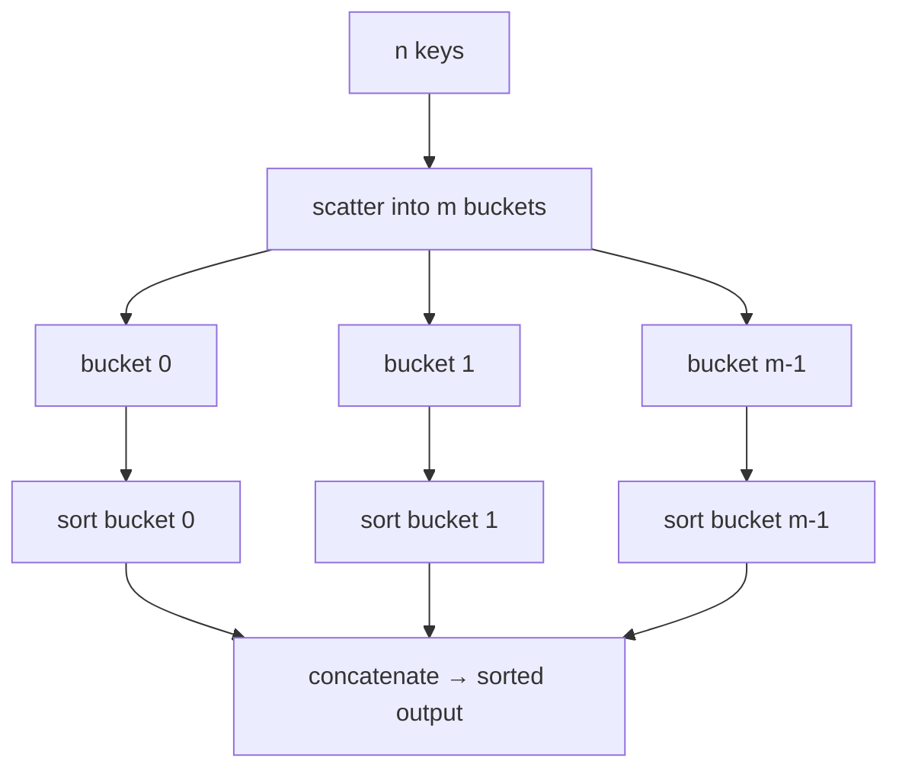
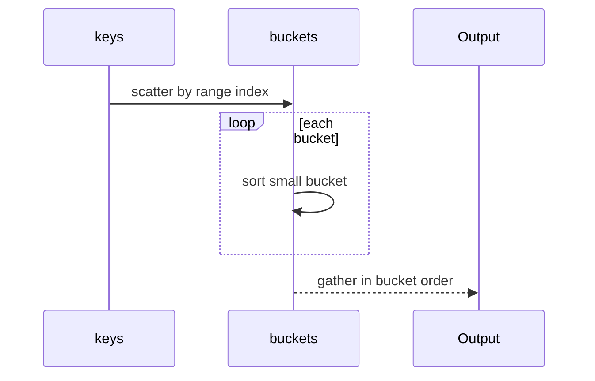
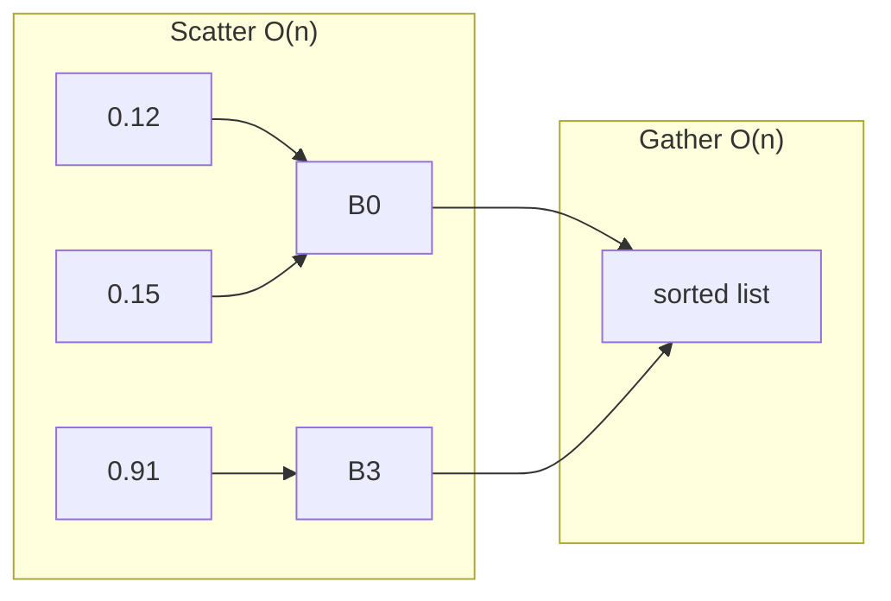
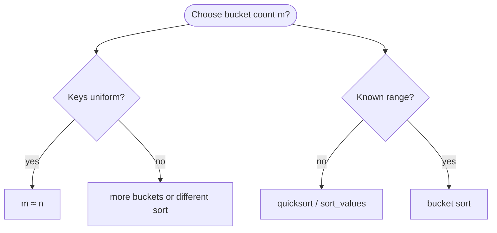
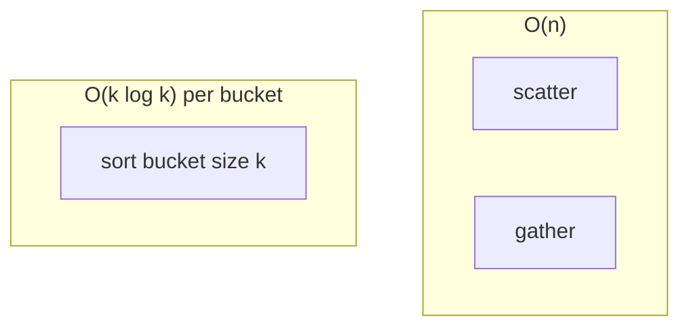
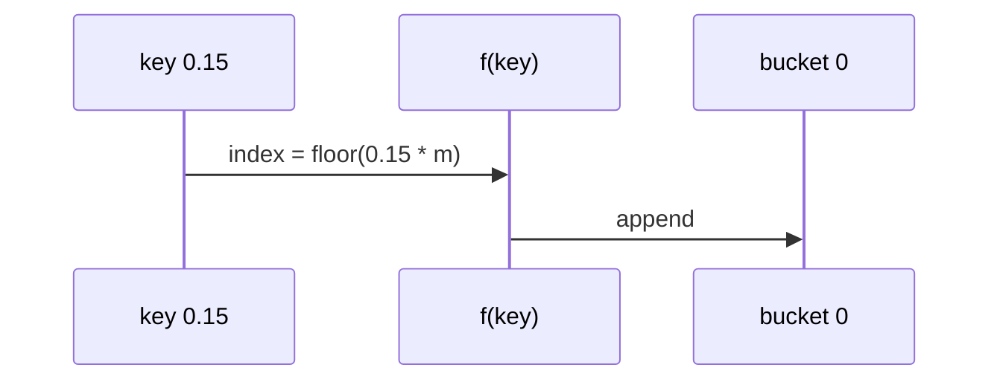
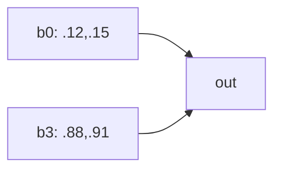
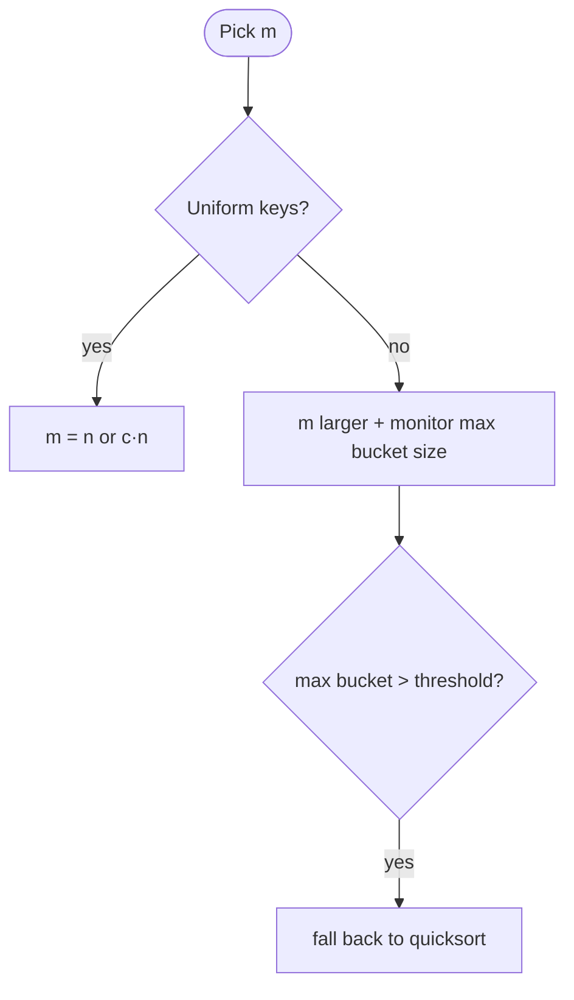
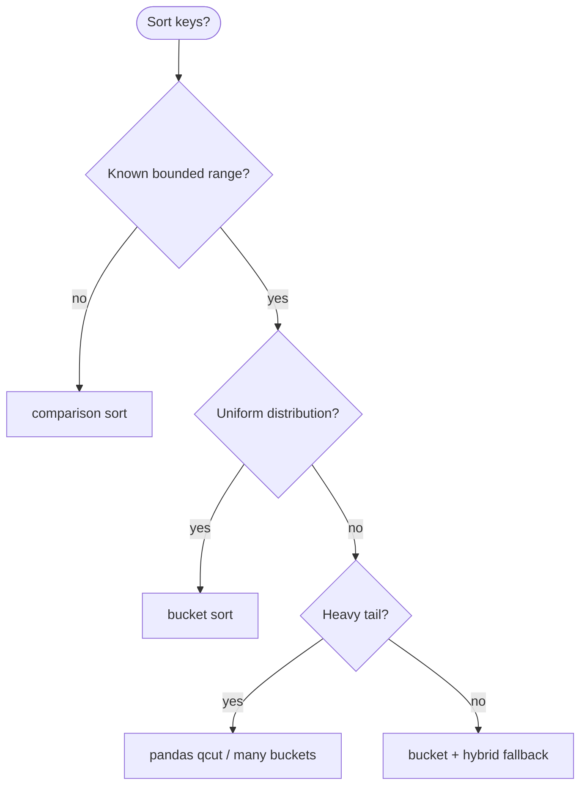

# Bucket sort

A **distribution sort** that maps each key into one of **m buckets** (usually by range), **sorts each bucket** with a simple algorithm (often insertion sort or Python’s `sort`), then **concatenates** buckets in order. When keys are **uniformly spread** across a known range, average time is **Θ(n)**; when keys **cluster**, one bucket can hold all **n** items and performance degrades toward **Θ(n²)**.

| | |
| --- | --- |
| **What it is** | `index = f(key)` → append to `buckets[index]` → sort each bucket → flatten left to right. |
| **Core operations** | Scatter, per-bucket sort, gather—scatter is O(n); inner sort cost depends on bucket sizes. |
| **When to use** | Uniform floats in `[0, 1)`, fixed-width bins on normalized metrics, external sort chunks. |
| **Trade-off** | Needs **extra space** O(n + m); not in-place; worst case Θ(n²) without many buckets. |

In **software and data systems**, bucket sort fits **“sort entries by day-of-year within a time window”** when timestamps spread evenly—you map `t` to bucket `⌊m · (t − t_min) / (t_max − t_min)⌋`. If every entry shares the **same timestamp** (one fat bucket), you fall back to Θ(n²) inner sort. For **archive-scale tables**, use **pandas** `sort_values`; bucket sort teaches **distribution** thinking alongside [Radix sort](../radix-sort/index.md).

This page is your **ready reference**: scatter/gather mechanics, full Python implementations (floats, integers, entries, entities), every creation variant, traces, complexity tables, pitfalls, and application patterns. For Big-O notation, see [Complexity analysis](../../complexity/index.md).

[Parent: Algorithms](../index.md)

---

## Practical applications

| Use case | Bucket key | Uniform when |
| --- | --- | --- |
| **Day-of-year within month** | Ordinal day 1..31 | Spread across the month |
| **Normalized throughput** | `amount / max_amount` in [0,1) | Many distinct amounts |
| **Score (bounded clip)** | Clip to [-7, 7] then bin | Roughly flat histogram |
| **TaskItem ID bins** | 0–99 → 10 buckets | Depends on network |
| **Percentile buckets** | Pre-scaled rank / n | By construction uniform |

**Use `sort_values` or `sorted`** for million-row event tables. **Use bucket sort** when keys are **uniform in a known range** or you are **chunking external sort** on disk.



Throughout this page, **n** = number of keys, **m** = number of buckets, **k** = items in one bucket.

---

## Bucket sort vs comparison sorts vs radix sort

| | **Bucket sort** | [Quicksort](../quicksort/index.md) | [Radix sort](../radix-sort/index.md) | **`sorted()`** |
| --- | --- | --- | --- | --- |
| **Model** | Distribution | Comparison partition | Digit buckets | Timsort comparison |
| **Average time** | Θ(n) uniform | Θ(n log n) | Θ(d · n) | Θ(n log n) |
| **Worst time** | Θ(n²) | Θ(n²) | Θ(d · n) | Θ(n log n) |
| **Space** | O(n + m) | O(log n) stack | O(n + σ) | O(n) |
| **Stable** | Yes* | No | Yes | Yes |
| **Range needed** | Often yes | No | Fixed digit alphabet | No |
| **Good fit** | Normalized timing | General | Fixed-width ints | Default |

*Stable if scatter is FIFO append and inner sort is stable.



---

## Mental model: scatter, sort, gather

1. **Scatter** — O(n): one pass, compute bucket index, append.
2. **Sort buckets** — Σ O(k_i log k_i); if all n in one bucket → O(n log n) or O(n²) with insertion sort.
3. **Gather** — O(n): walk buckets 0..m−1, extend output.

**Uniform assumption:** each bucket gets Θ(n/m) items → inner sort Σ (n/m) log(n/m) ≈ O(n log(n/m)); with m = Θ(n) → **O(n)** average.

| Step | Cost driver |
| --- | --- |
| Scatter | O(n) |
| Sort bucket of size k | O(k log k) comparison; O(k²) insertion worst |
| Gather | O(n) |



---

## Data types for examples

```python
from __future__ import annotations

from dataclasses import dataclass

@dataclass(frozen=True, slots=True)
class LogEntry:
 entry_id: int
 month: int
 sequence_num: float
 score: float
 summary: str

@dataclass(frozen=True, slots=True)
class TaskItem:
 name: str
 service_id: int
 bytes_sent: int
```

---

## Ways to create / invoke bucket sort

### 1. Uniform floats in `[0, 1)` — classic

```python
normalized = [0.12, 0.91, 0.15, 0.88]
sorted_vals = bucket_sort_unit_interval(normalized, m=4)
```

| | |
| --- | --- |
| **Time** | Θ(n) average with m = Θ(n) |
| **Space** | O(n + m) |

### 2. Arbitrary `[min, max]` range

```python
times = [120.5, 3600.0, 900.2, 120.8]
bucket_sort_range(times, m=8)
```

| | |
| --- | --- |
| **Time** | Θ(n) average if spread |
| **Space** | O(n + m) |

### 3. Integer keys 0..max_val with m buckets

```python
service_ids = [12, 87, 12, 45, 9]
bucket_sort_integers(service_ids, max_val=99, m=10)
```

| | |
| --- | --- |
| **Time** | Θ(n + m) average |
| **Space** | O(n + m) |

### 4. Objects with key function (entries by time)

```python
sorted_month = bucket_sort_entries_by_offset(month_readings, m=8)
```

| | |
| --- | --- |
| **Time** | Θ(n) average uniform times |
| **Space** | O(n + m) |

### 5. Fixed bucket count m = n (one item per bucket ideal)

```python
bucket_sort_floats(data, m=len(data))
```

| | |
| --- | --- |
| **Time** | O(n) scatter + O(n) tiny sorts |
| **Space** | O(2n) |

### 6. External sort chunk (conceptual)

Write each bucket to disk file, sort files, k-way merge—bucket sort as **first pass** of external sorting.

| | |
| --- | --- |
| **Time** | O(n) I/O scatter + per-file sort |
| **Space** | O(m) open files |



---

## Reference implementation: full bucket sort family

```python
from __future__ import annotations

from collections import deque
from dataclasses import dataclass
from typing import Callable, TypeVar

T = TypeVar("T")

def bucket_index(value: float, lo: float, hi: float, m: int) -> int:
 span = hi - lo
 if span == 0:
 return 0
 t = (value - lo) / span
 idx = int(t * m)
 if idx >= m:
 idx = m - 1
 if idx < 0:
 idx = 0
 return idx

def bucket_sort_unit_interval(nums: list[float], m: int | None = None) -> list[float]:
 if not nums:
 return []
 if m is None:
 m = max(len(nums), 1)
 buckets: list[list[float]] = [[] for _ in range(m)]
 for x in nums:
 idx = min(int(x * m), m - 1) if x < 1.0 else m - 1
 if idx < 0:
 idx = 0
 buckets[idx].append(x)
 out: list[float] = []
 for b in buckets:
 b.sort()
 out.extend(b)
 return out

def bucket_sort_range_inplace(nums: list[float], m: int) -> None:
 if len(nums) <= 1:
 return
 lo, hi = min(nums), max(nums)
 buckets: list[list[float]] = [[] for _ in range(m)]
 for x in nums:
 buckets[bucket_index(x, lo, hi, m)].append(x)
 nums[:] = [x for b in buckets for x in sorted(b)]

def bucket_sort_stable(nums: list[float], m: int) -> list[float]:
 if not nums:
 return []
 lo, hi = min(nums), max(nums)
 buckets: list[deque[float]] = [deque() for _ in range(m)]
 for x in nums:
 buckets[bucket_index(x, lo, hi, m)].append(x)
 out: list[float] = []
 for b in buckets:
 sorted_chunk = sorted(b)
 out.extend(sorted_chunk)
 return out

def bucket_sort_integers(nums: list[int], max_val: int, m: int) -> list[int]:
 if not nums:
 return []
 buckets: list[list[int]] = [[] for _ in range(m)]
 for x in nums:
 idx = bucket_index(float(x), 0.0, float(max_val), m)
 buckets[idx].append(x)
 return [x for b in buckets for x in sorted(b)]

def bucket_sort_by_key(items: list[T], m: int, key: Callable[[T], float]) -> list[T]:
 if not items:
 return []
 keys = [key(x) for x in items]
 lo, hi = min(keys), max(keys)
 buckets: list[list[T]] = [[] for _ in range(m)]
 for item in items:
 buckets[bucket_index(key(item), lo, hi, m)].append(item)
 out: list[T] = []
 for b in buckets:
 b.sort(key=key)
 out.extend(b)
 return out

@dataclass(frozen=True, slots=True)
class LogEntry:
 entry_id: int
 month: int
 sequence_num: float
 score: float
 summary: str = ""

def bucket_sort_entries_by_offset(readings: list[LogEntry], m: int) -> list[LogEntry]:
 return bucket_sort_by_key(readings, m, key=lambda s: s.sequence_num)

def bucket_sort_insertion_inner(nums: list[float], m: int) -> list[float]:

 def insertion_sort(arr: list[float]) -> None:
 for i in range(1, len(arr)):
 v = arr[i]
 j = i - 1
 while j >= 0 and arr[j] > v:
 arr[j + 1] = arr[j]
 j -= 1
 arr[j + 1] = v

 if not nums:
 return []
 lo, hi = min(nums), max(nums)
 buckets: list[list[float]] = [[] for _ in range(m)]
 for x in nums:
 buckets[bucket_index(x, lo, hi, m)].append(x)
 out: list[float] = []
 for b in buckets:
 insertion_sort(b)
 out.extend(b)
 return out
```

| | |
| --- | --- |
| **Average time** | Θ(n) with uniform spread and m = Θ(n) |
| **Worst time** | Θ(n²) with insertion inner sort, one bucket |
| **Space** | O(n + m) |

---

## All operations / phases (with examples and complexity)



### Scatter — assign keys to buckets

```python
m = 4
buckets: list[list[float]] = [[] for _ in range(m)]
for x in [0.12, 0.91, 0.15, 0.88]:
 idx = min(int(x * m), m - 1)
 buckets[idx].append(x)
```

| | |
| --- | --- |
| **Time** | O(n) |
| **Space** | O(n) stored across buckets |



---

### Inner bucket sort

```python
for b in buckets:
 b.sort()
```

| | |
| --- | --- |
| **Time** | O(k log k) per bucket; Σ k_i = n |
| **Space** | O(1) aux if in-place sort on bucket list |

**Worst case:** k = n → O(n log n) or O(n²) with insertion sort.

---

### Gather — concatenate in bucket order

```python
out: list[float] = []
for b in buckets:
 out.extend(b)
```

| | |
| --- | --- |
| **Time** | O(n) |
| **Space** | O(n) output |

---

### `bucket_sort_unit_interval(nums, m=None)`

```python
sorted_norm = bucket_sort_unit_interval([0.12, 0.91, 0.15, 0.88], m=4)
```

| | |
| --- | --- |
| **Time** | Θ(n) average uniform |
| **Space** | O(n + m) |

**Example:** Normalized **timestamp within batch** after dividing by range length.

---

### `bucket_sort_range_inplace(nums, m)`

| | |
| --- | --- |
| **Time** | Θ(n) average |
| **Space** | O(n + m) bucket lists |

Mutates `nums` via reassignment `nums[:] = ...`.

---

### `bucket_sort_stable(nums, m)`

| | |
| --- | --- |
| **Time** | Same as unstable variant |
| **Space** | O(n + m) |
| **Stability** | Yes — FIFO deque + stable sort |

Use when equal timestamps must keep **entry_id** submission order (sort objects with tie key).

---

### `bucket_sort_entries_by_offset(readings, m)`

```python
month_window = [
 LogEntry(1, 1, 120.0, 0.1, "clear"),
 LogEntry(2, 1, 3600.0, 0.5, "beta"),
 LogEntry(3, 1, 900.0, -0.2, "warning"),
]
ordered = bucket_sort_entries_by_offset(month_window, m=4)
```

| | |
| --- | --- |
| **Time** | Θ(n) average spread |
| **Space** | O(n + m) |

---

### `bucket_sort_by_key(items, m, key=...)`

Generic pattern for **TaskItem** by `bytes_sent`, **LogEntry** by `score`, etc.

| | |
| --- | --- |
| **Time** | Θ(n) average uniform keys |
| **Space** | O(n + m) |

---

## Trace: four normalized day fractions

Keys in `[0, 1)`: `[0.12, 0.91, 0.15, 0.88]`, `m = 4`

| key | `idx = min(int(x*4), 3)` |
| ---: | ---: |
| 0.12 | 0 |
| 0.91 | 3 |
| 0.15 | 0 |
| 0.88 | 3 |

| bucket | contents before sort | after sort |
| ---: | --- | --- |
| 0 | [0.12, 0.15] | [0.12, 0.15] |
| 1 | [] | [] |
| 2 | [] | [] |
| 3 | [0.91, 0.88] | [0.88, 0.91] |

**Output:** `[0.12, 0.15, 0.88, 0.91]`.



---

## Trace: clustered same-timestamp records (worst case)

All records within 0.1 time units—**one bucket** gets all n items.

```python
clustered = [100.0, 100.01, 100.02, 100.03, 100.04]
bucket_sort_range_inplace(clustered, m=8)
```

| | |
| --- | --- |
| **Time** | Θ(n²) possible |
| **Fix** | Increase m; widen range; use comparison sort |

---

## Application patterns with bucket sort

### Sort one time window by day-of-year

```python
def order_time_window(readings: list[LogEntry]) -> list[LogEntry]:
 if len(readings) <= 1:
 return readings[:]
 m = max(len(readings), 4)
 return bucket_sort_entries_by_offset(readings, m=m)
```

| | |
| --- | --- |
| **Time** | Θ(n) average uniform times |
| **Space** | O(n + m) |

For **single time windows** (n < 31), **`sorted(readings, key=...)`** is simpler—bucket sort illustrates **distribution**.

---

### Histogram-equalized score bins (analytics prep)

```python
def score_bins(scores: list[float], m: int = 10) -> list[list[float]]:
 lo, hi = min(scores), max(scores)
 buckets: list[list[float]] = [[] for _ in range(m)]
 for x in scores:
 buckets[bucket_index(x, lo, hi, m)].append(x)
 return buckets
```

| | |
| --- | --- |
| **Time** | O(n) scatter only |
| **Space** | O(n + m) |

Related to **`pd.cut`** / **`pd.qcut`**—bucket sort is the algorithmic scatter step.

---

### TaskItem ID service list sort (integers 0–99)

```python
service_ids = [12, 87, 12, 45, 9, 99]
sorted_ids = bucket_sort_integers(service_ids, max_val=99, m=10)
```

| | |
| --- | --- |
| **Time** | O(n + m) |
| **Space** | O(n + m) |

---

### Stable sort with entry_id tie-break

```python
def stable_entry_sort(readings: list[LogEntry], m: int) -> list[LogEntry]:
 return bucket_sort_by_key(
 readings,
 m,
 key=lambda s: (s.sequence_num, s.entry_id),
 )
```

Use tuple keys so inner `sort` orders ties by `entry_id`.

| | |
| --- | --- |
| **Time** | Θ(n) average on time component |
| **Space** | O(n + m) |

---

## Choosing bucket count m

| m | Effect |
| --- | --- |
| **m = 1** | One bucket → inner sort all n → Θ(n log n) min |
| **m = n** | Ideal uniform → O(1) per bucket average |
| **m = √n** | Middle ground for memory |
| **m too large** | Many empty buckets, O(m) scan on gather |



**Rule:** if max bucket size exceeds threshold (e.g. 32), re-sort that bucket with [Quicksort](../quicksort/index.md) or switch algorithm.

---

## Hybrid bucket + quicksort (worst-case guard)

```python
def hybrid_bucket_sort(nums: list[float], m: int, threshold: int = 32) -> list[float]:
 if not nums:
 return []
 lo, hi = min(nums), max(nums)
 buckets: list[list[float]] = [[] for _ in range(m)]
 for x in nums:
 buckets[bucket_index(x, lo, hi, m)].append(x)
 out: list[float] = []
 for b in buckets:
 if len(b) > threshold:
 from quicksort import quicksort
 quicksort(b)
 else:
 b.sort()
 out.extend(b)
 return out
```

| | |
| --- | --- |
| **Time** | Θ(n) average; O(n log n) worst guarded |
| **Space** | O(n + m) |

---

## Versus `list.sort()`, pandas, and `heapq`

| Task | Tool |
| --- | --- |
| Full archive sort | `df.sort_values("sequence_num")` |
| Uniform unit floats teaching | `bucket_sort_unit_interval` |
| Top-k score | `heapq.nlargest` — not bucket sort |
| Integer digits | [Radix sort](../radix-sort/index.md) |
| General comparison | `sorted()` |

```python
import pandas as pd

df.sort_values(["service_id", "entry_id"])
df["score_bin"] = pd.cut(df["score"], bins=10)
```

**`pd.qcut`** builds **equal-frequency** buckets—analytics twin to choosing m for uniform **rank** keys.

---

## Master complexity table

Let **n** = keys, **m** = buckets, **k_i** = size of bucket i, **k_max** = max bucket size.

| Phase | Best / average | Worst | Space |
| --- | --- | --- | --- |
| Scatter | Θ(n) | Θ(n) | O(n + m) |
| Inner sort (comparison) | Σ O(k_i log k_i) | O(n log n) one bucket | O(1) aux per bucket |
| Inner sort (insertion) | Σ O(k_i²) | O(n²) | O(1) |
| Gather | Θ(n) | Θ(n) | O(n) output |
| **Total** | **Θ(n)** uniform, m=Θ(n) | **Θ(n²)** one bucket + insertion | **O(n + m)** |

| Property | Value |
| --- | --- |
| **Stable** | Yes with FIFO + stable inner sort |
| **In-place** | No (bucket lists) |
| **Adaptive** | Depends on distribution |

---

## When to use / avoid



| Use bucket sort | Avoid bucket sort |
| --- | --- |
| Normalized day-of-year in [0,1) | Arbitrary string names |
| Fixed histogram bins | Need worst-case Θ(n log n) guarantee alone |
| External sort teaching | Single small window—use `sorted` |
| Uniform simulated metrics | Clustered same-timestamp entries without tuning m |

---

## Common pitfalls

| Pitfall | Why it hurts | Fix |
| --- | --- | --- |
| `max == min` | Division by zero | Single bucket + sort; `span or 1.0` |
| Too few buckets | All keys collide | Increase m |
| Too many buckets | O(m) empty scan | Use √n or n |
| Unstable inner sort | Tie order lost | Stable sort or deque FIFO |
| Keys outside [0,1) assumed | Wrong bucket | Clamp or use `bucket_index` |
| Skewed score tail | One fat bucket | Quantile bins, hybrid sort |
| Sorting service names | No numeric range | Comparison sort |

---

## Related pages

| Page | Relationship |
| --- | --- |
| [Radix sort](../radix-sort/index.md) | Digit buckets |
| [Quicksort](../quicksort/index.md) | Hybrid fallback |
| [Radix sort](../radix-sort/index.md) | Counting sort per digit (O(n+k) pass) |
| [Heap sort](../heap-sort/index.md) | Comparison O(n log n) worst |
| [Complexity analysis](../../complexity/index.md) | Big-O reference |

---

## Quick reference card

```python
sorted_norm = bucket_sort_unit_interval(normalized, m=len(normalized))

times = [120.5, 3600.0, 900.2]
bucket_sort_range_inplace(times, m=8)

ordered = bucket_sort_entries_by_offset(month_window, m=8)

sorted_stable = bucket_sort_stable(values, m=16)

df.sort_values("sequence_num")
pd.cut(df["score"], bins=10)
```

**Bucket sort:** **scatter** → **sort buckets** → **gather**—**Θ(n) average** when keys spread evenly; watch **worst-case pile-up** on clustered same-timestamp entries. Pair with [Radix sort](../radix-sort/index.md) for digit models; use **pandas** for event tables.

**Quick checklist**

1. **Full archive sort** — `sort_values`, not buckets.
2. **Normalized month timing** — bucket sort teaching fit.
3. **Check max bucket size** — hybrid fallback if huge.
4. **Equal-frequency bins** — `pd.qcut` in analytics.
5. **Stability on ties** — FIFO buckets + stable inner sort.
