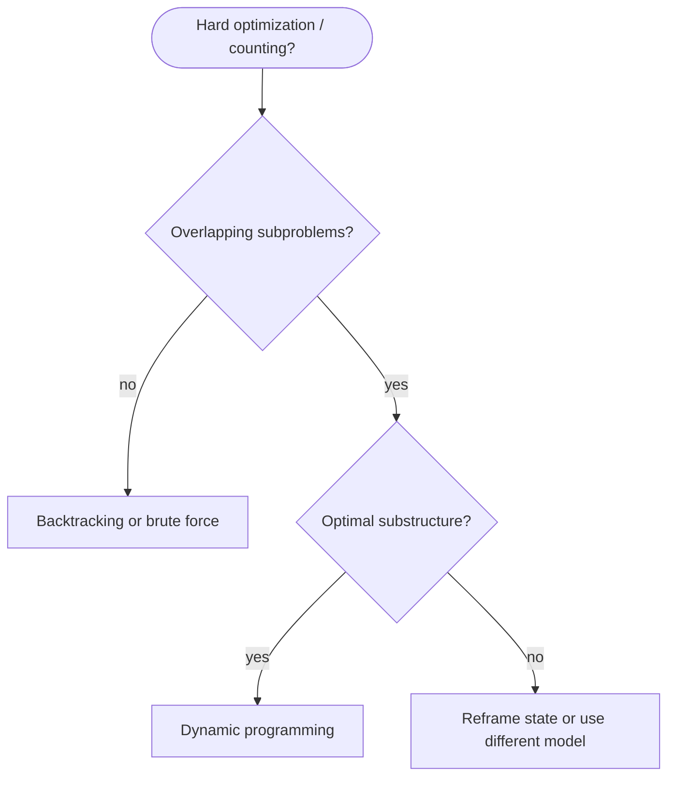

# Dynamic programming

**Dynamic programming (DP)** solves problems by breaking them into **overlapping subproblems**, solving each subproblem once, and **reusing** the result (memoization or tabulation). It applies when the problem has **optimal substructure** and **repeated subproblems**.

| | |
| --- | --- |
| **What it is** | Recurrence + table (or cache) so each sub-state is computed once. |
| **Time** | Usually O(states × work per state); often polynomial where brute force is exponential. |
| **Space** | O(states) for the table; often reducible with rolling variables. |
| **When to use** | Counting ways, min/max cost paths, longest subsequence-style questions with shared subproblems. |

This page is your **ready reference** for recognizing DP, the memo vs tabulation workflow, 1D and 2D patterns, and when to choose DP over greedy or backtracking. For recursion basics, see [Recursion](../../recursion/index.md). For grid indexing, see [2D grids](../../data-structures/2d-grids/index.md). For Big-O notation, see [Complexity analysis](../../complexity/index.md).

[Parent: Algorithms](../index.md)

---

## Practical applications

| Use case | State | Example recurrence |
| --- | --- | --- |
| **Stair climbing** | step index | `dp[i] = dp[i-1] + dp[i-2]` |
| **Rob houses in a row** | house index + rob/skip | max of rob current vs skip |
| **Coin change minimum** | amount remaining | min over `1 + dp[amount - coin]` |
| **Unique paths on grid** | cell `(r,c)` | paths from top-left |
| **Longest common subsequence** | `(i, j)` string indices | match or skip one char |
| **Edit distance** | `(i, j)` prefixes | insert / delete / replace |

---

## When DP applies (checklist)

1. **Optimal substructure** — optimal answer for the whole problem uses optimal answers to subproblems.
2. **Overlapping subproblems** — the same sub-state appears in many branches (unlike pure divide-and-conquer where halves are independent).
3. **Finite state space** — you can name states `(i)`, `(i, j)`, `(i, j, k)` with clear bounds.

If subproblems do **not** overlap, use divide-and-conquer ([merge sort](../merge-sort/index.md)) or direct recursion without a table. If you need **all** combinations without overlap structure, use [Backtracking](../backtracking/index.md).



---

## Two implementation styles

### Top-down (memoization)

Write the natural recurrence recursively; cache results in a dict or `@lru_cache`.

```python
from functools import lru_cache

@lru_cache(maxsize=None)
def climb_stairs(n):
    if n <= 2:
        return n
    return climb_stairs(n - 1) + climb_stairs(n - 2)
```

| | |
| --- | --- |
| **Time** | O(n) states × O(1) work |
| **Space** | O(n) cache + O(n) stack |

### Bottom-up (tabulation)

Fill a table in dependency order (usually increasing index).

```python
def climb_stairs_tab(n):
    if n <= 2:
        return n
    dp = [0] * (n + 1)
    dp[1], dp[2] = 1, 2
    for i in range(3, n + 1):
        dp[i] = dp[i - 1] + dp[i - 2]
    return dp[n]
```

| | |
| --- | --- |
| **Time** | O(n) |
| **Space** | O(n); can compress to O(1) with two variables |

**Pick memo** when state transitions are irregular or sparse. **Pick tabulation** when you need full table order or space optimization by iteration.

---

## The DP workflow

1. **Define state** — what uniquely identifies a subproblem (`i`, `(r,c)`, `(i,j)`).
2. **Write recurrence** — how state relates to smaller states.
3. **Base cases** — smallest states with known answers.
4. **Iteration order** — fill so dependencies are ready (usually forward).
5. **Answer location** — which cell holds the final result (`dp[n]`, `dp[R-1][C-1]`).
6. **Reconstruct path** (optional) — store parent pointers or choices while filling.

---

## 1D DP: climbing stairs

Count ways to reach step `n` taking 1 or 2 steps at a time.

```python
def climb_stairs(n):
    one, two = 1, 1
    for _ in range(n - 1):
        one, two = two, one + two
    return two
```

| | |
| --- | --- |
| **Time** | O(n) |
| **Space** | O(1) |

---

## 1D DP: house robber

Max sum with no two adjacent houses robbed.

```python
def rob(nums):
    prev2 = prev1 = 0
    for x in nums:
        prev2, prev1 = prev1, max(prev1, prev2 + x)
    return prev1
```

State meaning: `prev1` = best including up to previous house; rolling update replaces `dp[i]`.

---

## 1D DP: coin change (minimum coins)

Return fewest coins to make `amount`, or `-1` if impossible.

```python
def coin_change(coins, amount):
    dp = [float("inf")] * (amount + 1)
    dp[0] = 0
    for a in range(1, amount + 1):
        for c in coins:
            if c <= a:
                dp[a] = min(dp[a], dp[a - c] + 1)
    return dp[amount] if dp[amount] != float("inf") else -1
```

| | |
| --- | --- |
| **Time** | O(amount × len(coins)) |
| **Space** | O(amount) |

**Counting ways** (order may or may not matter): use `+=` instead of `min`, initialize `dp[0] = 1`.

---

## 2D grid DP: unique paths

Move only **right** or **down** from top-left to bottom-right.

```python
def unique_paths(rows, cols):
    dp = [[1] * cols for _ in range(rows)]
    for r in range(1, rows):
        for c in range(1, cols):
            dp[r][c] = dp[r - 1][c] + dp[r][c - 1]
    return dp[rows - 1][cols - 1]
```

Recurrence: `dp[r][c] = dp[r-1][c] + dp[r][c-1]` because every path arrives from above or left.

| | |
| --- | --- |
| **Time** | O(R × C) |
| **Space** | O(R × C); one row suffices → O(C) |

See [2D grids](../../data-structures/2d-grids/index.md) for grid indexing and traversal context.

---

## 2D string DP: longest common subsequence

```python
def lcs(a, b):
    m, n = len(a), len(b)
    dp = [[0] * (n + 1) for _ in range(m + 1)]
    for i in range(1, m + 1):
        for j in range(1, n + 1):
            if a[i - 1] == b[j - 1]:
                dp[i][j] = dp[i - 1][j - 1] + 1
            else:
                dp[i][j] = max(dp[i - 1][j], dp[i][j - 1])
    return dp[m][n]
```

| | |
| --- | --- |
| **Time** | O(m · n) |
| **Space** | O(m · n); two-row rolling → O(n) |

---

## 2D string DP: edit distance (Levenshtein)

Minimum insertions, deletions, replacements to transform `a` into `b`.

```python
def edit_distance(a, b):
    m, n = len(a), len(b)
    dp = [[0] * (n + 1) for _ in range(m + 1)]
    for i in range(m + 1):
        dp[i][0] = i
    for j in range(n + 1):
        dp[0][j] = j
    for i in range(1, m + 1):
        for j in range(1, n + 1):
            cost = 0 if a[i - 1] == b[j - 1] else 1
            dp[i][j] = min(
                dp[i - 1][j] + 1,      # delete
                dp[i][j - 1] + 1,      # insert
                dp[i - 1][j - 1] + cost  # replace or match
            )
    return dp[m][n]
```

---

## DP vs greedy vs backtracking

| | DP | Greedy | Backtracking |
| --- | --- | --- | --- |
| **Subproblems** | Overlap; cache them | One local choice | Explore tree |
| **Optimality** | Proven via recurrence | Needs greedy-choice proof | Finds all / one valid |
| **Example** | Min coins | [Activity selection](../greedy/index.md#pattern-1--interval-scheduling-earliest-finish-time) | All permutations |
| **Time** | Polynomial in state count | Often O(n log n) or O(n) | Often exponential |

If a greedy argument is **not** obvious, try DP first for min/max/count problems. See [Greedy](../greedy/index.md) for interval, heap, and sort-and-scan patterns.

---

## Space optimization patterns

| Pattern | When | Trick |
| --- | --- | --- |
| **Rolling 1D** | Only `dp[i-1]` and `dp[i-2]` needed | Two variables |
| **Rolling row** | 2D DP depends on previous row only | Reuse one `dp[c]` row |
| **In-place** | Tabulation over grid itself | Fill grid bottom-up if allowed |

Always verify dependencies before overwriting cells you still need.

---

## Complexity summary

| Problem | States | Time | Space |
| --- | --- | --- | --- |
| Climbing stairs | n | O(n) | O(1) compressed |
| House robber | n | O(n) | O(1) |
| Coin change | amount | O(amount × coins) | O(amount) |
| Unique paths | R × C | O(R × C) | O(C) with one row |
| LCS | m × n | O(m · n) | O(n) with two rows |
| Edit distance | m × n | O(m · n) | O(n) with two rows |

---

## Common pitfalls

| Pitfall | Why it hurts | Fix |
| --- | --- | --- |
| Wrong base cases | Off-by-one in table | Write `dp[0]`, empty prefix explicitly |
| Wrong iteration order | Use values not yet computed | Draw dependency arrows |
| Confusing min vs max vs count | Wrong recurrence operator | Name the question (fewest? most? ways?) |
| Integer overflow | Large counts in other languages | Python ints are fine; watch time limits |
| Reconstructing path without parent | Cannot trace optimal choice | Store `from[i]` or `(prev_i, prev_j)` |
| Using DP when no overlap | Wasted table | Use linear recursion or divide-and-conquer |

---

## Related pages

| Page | Relationship |
| --- | --- |
| [Recursion](../../recursion/index.md) | Top-down DP is memoized recursion |
| [2D grids](../../data-structures/2d-grids/index.md) | Grid DP indexing and path problems |
| [Backtracking](../backtracking/index.md) | Full search when states do not overlap cleanly |
| [Merge sort](../merge-sort/index.md) | Divide-and-conquer without overlapping subproblems |
| [Complexity analysis](../../complexity/index.md) | State-count analysis |

---

## Quick reference card

```python
# 1. define dp[state]
# 2. base cases
# 3. for state in order:
#        dp[state] = aggregate of dp[smaller states]
# 4. return dp[target]

# Memo
@lru_cache(maxsize=None)
def f(state):
    ...

# Tabulation
dp = [0] * (n + 1)
for i in range(1, n + 1):
    dp[i] = ...
```

**Recognition hints:** “minimum/maximum number of…”, “how many ways…”, “longest/shortest sub…”, “with constraints on adjacent elements”, grid paths with only right/down moves.

---

## Next steps

1. Implement **climbing stairs** memo and tabulation; then compress to O(1) space.
2. Implement **coin change** and trace why `dp[0] = 0` is the base for minimum coins.
3. Fill **unique paths** on paper for a 3×3 grid before coding.
4. Attempt **LCS** on two short strings; compare with [Backtracking](../backtracking/index.md) brute force to see overlap.
