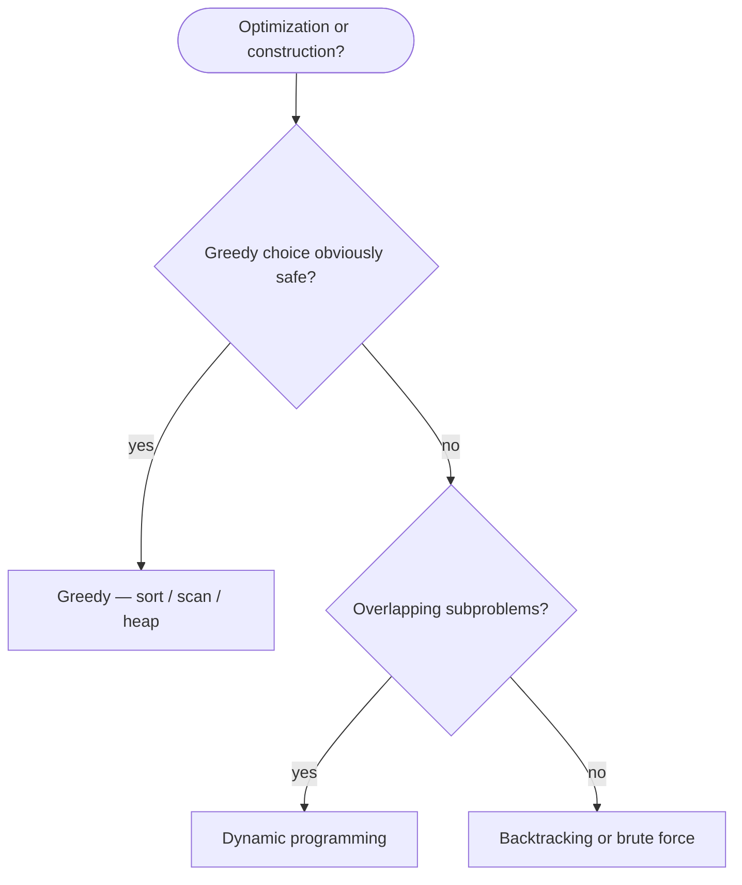

# Greedy

**Greedy algorithms** build a solution step by step, always taking the **locally best** choice that still looks valid, and never revisiting earlier decisions. They are fast and simple when the problem has a **greedy-choice property**: a globally optimal answer can be reached by a sequence of locally optimal picks.

| | |
| --- | --- |
| **What it is** | Sort or scan candidates, repeatedly pick the best feasible next step. |
| **Time** | Often O(n log n) from sorting; O(n) when input is already ordered. |
| **Space** | Usually O(1) extra beyond input; heaps add O(k). |
| **When to use** | Scheduling, interval merging, “take the best available now” problems with a proof (or strong intuition) that local choices compose optimally. |

This page is your **ready reference** for recognizing greedy, classic patterns (intervals, sort-and-scan, heap greedy), when to prefer [Dynamic programming](../dynamic-programming/index.md) or [Backtracking](../backtracking/index.md), and links to graph algorithms that are greedy at heart ([Dijkstra](../../data-structures/graphs/dijkstra/index.md), [Minimum spanning tree](../../data-structures/graphs/minimum-spanning-tree/index.md)). For Big-O notation, see [Complexity analysis](../../complexity/index.md).

[Parent: Algorithms](../index.md)

---

## Practical applications

| Use case | Greedy move | Why it works (sketch) |
| --- | --- | --- |
| **Activity / interval scheduling** | Pick non-overlapping interval that ends earliest | Leaves maximum room for future picks |
| **Merge intervals** | Sort by start; extend or start new merged block | One pass after sort |
| **Minimum arrows to burst balloons** | Sort by end; shoot when current balloon not covered | Same “earliest finish” idea as scheduling |
| **Assign cookies to children** | Sort both; give smallest sufficient cookie | Maximizes leftover capacity for later children |
| **Jump game** | Track farthest reachable index | If you can reach `i`, you can reach anything ≤ farthest |
| **Task scheduler with cooldown** | Max-heap on remaining counts; schedule most frequent first | Reduces idle slots when provable |
| **Huffman-style merging** | Repeatedly merge two smallest frequencies | Classic heap greedy; optimal prefix codes |

---

## When greedy applies (checklist)

1. **Greedy-choice property** — a locally optimal choice can sit inside some globally optimal solution.
2. **Optimal substructure** — after the greedy pick, the rest of the problem is the same type on a smaller instance.
3. **Exchange argument or cut property** — you can swap any non-greedy first step for a greedy one without worsening the answer (proof style in textbooks).

If you cannot justify (1), try [Dynamic programming](../dynamic-programming/index.md). If you need **all** valid configurations, use [Backtracking](../backtracking/index.md).



---

## DP vs greedy vs backtracking

| | DP | Greedy | Backtracking |
| --- | --- | --- | --- |
| **Subproblems** | Overlap; cache them | One local choice per step | Explore search tree |
| **Optimality** | Proven via recurrence | Needs greedy-choice proof | Finds all / one valid |
| **Example** | Min coins (general denominations) | Activity selection | All permutations |
| **Time** | Polynomial in state count | Often O(n log n) or O(n) | Often exponential |
| **Revisits choices?** | Table encodes all options | Never | Undo on dead ends |

**Rule of thumb:** if a greedy argument is **not** obvious, try DP first for min/max/count problems. If greedy fails on small counterexamples (see below), switch to DP.

---

## Pattern 1 — Interval scheduling (earliest finish time)

Sort intervals by **end time**. Greedily take the next interval that does not overlap the last chosen one.

```python
def max_non_overlapping(intervals):
    intervals.sort(key=lambda x: x[1])
    count = 0
    end = float("-inf")
    for start, finish in intervals:
        if start >= end:
            count += 1
            end = finish
    return count
```

| | |
| --- | --- |
| **Time** | O(n log n) sort + O(n) scan |
| **Space** | O(1) beyond input |

*Interview classic: “maximum number of non-overlapping meetings.”*

---

## Pattern 2 — Merge intervals

Sort by **start**. Extend the current merged block if the next interval overlaps; otherwise start a new block.

```python
def merge_intervals(intervals):
    if not intervals:
        return []
    intervals.sort(key=lambda x: x[0])
    merged = [list(intervals[0])]
    for start, end in intervals[1:]:
        if start <= merged[-1][1]:
            merged[-1][1] = max(merged[-1][1], end)
        else:
            merged.append([start, end])
    return merged
```

| | |
| --- | --- |
| **Time** | O(n log n) |
| **Space** | O(n) for output |

---

## Pattern 3 — Sort both sides and scan

Sort children and cookies (or two resource lists). Two pointers: assign the smallest cookie that still satisfies the current child.

```python
def assign_cookies(children, cookies):
    children.sort()
    cookies.sort()
    i = j = satisfied = 0
    while i < len(children) and j < len(cookies):
        if cookies[j] >= children[i]:
            satisfied += 1
            i += 1
        j += 1
    return satisfied
```

| | |
| --- | --- |
| **Time** | O(n log n + m log m) |
| **Space** | O(1) extra |

---

## Pattern 4 — Heap greedy (repeatedly take best available)

Use a **max-heap** or **min-heap** when the best next move depends on dynamic priorities (frequencies, deadlines, smallest merge cost).

```python
import heapq

def huffman_total_cost(freqs):
    heap = list(freqs)
    heapq.heapify(heap)
    total = 0
    while len(heap) > 1:
        a = heapq.heappop(heap)
        b = heapq.heappop(heap)
        cost = a + b
        total += cost
        heapq.heappush(heap, cost)
    return total
```

| | |
| --- | --- |
| **Time** | O(k log k) for k symbols |
| **Space** | O(k) heap |

See [Priority queue](../../data-structures/priority-queue/index.md) and [Min heap](../../data-structures/min-heap/index.md) for heap mechanics.

---

## Pattern 5 — One-pass reachability (jump game)

Track the **farthest index** reachable so far. If current index exceeds farthest, return false; else update farthest with `i + nums[i]`.

```python
def can_jump(nums):
    farthest = 0
    for i, jump in enumerate(nums):
        if i > farthest:
            return False
        farthest = max(farthest, i + jump)
    return True
```

| | |
| --- | --- |
| **Time** | O(n) |
| **Space** | O(1) |

---

## Graph greedy (applied instances)

Several graph algorithms on this site are **proven greedy** algorithms — they belong on graph pages but share the same “take the best safe edge/vertex next” idea:

| Algorithm | Greedy move | Page |
| --- | --- | --- |
| **Dijkstra** | Relax from the closest unsettled vertex | [Dijkstra](../../data-structures/graphs/dijkstra/index.md) |
| **Kruskal MST** | Add lightest edge that does not form a cycle | [Minimum spanning tree](../../data-structures/graphs/minimum-spanning-tree/index.md) |
| **Prim MST** | Grow tree via cheapest edge to an outside vertex | [Minimum spanning tree](../../data-structures/graphs/minimum-spanning-tree/index.md) |

On the Gulf Coast road network: Kruskal picks the **shortest highway segment** that connects two previously disconnected regions — the [cut property](../../data-structures/graphs/graph-theory/index.md#cut-property) is why that works.

---

## When greedy fails (use DP instead)

| Problem | Greedy trap | Correct approach |
| --- | --- | --- |
| **Coin change** (arbitrary denominations) | Largest coin first can overshoot | DP min coins |
| **0/1 knapsack** | Value/weight ratio sort misses combos | DP |
| **Longest increasing subsequence** | Greedy extension is not optimal | DP or patience sorting + binary search |

Always test a **small counterexample** before committing to greedy in an interview.

---

## Common pitfalls

| Pitfall | Why it hurts | Fix |
| --- | --- | --- |
| No proof sketch | Wrong answer on hidden tests | Exchange argument or try DP |
| Wrong sort key | Interval problems need end vs start | Scheduling → sort by **end**; merge → sort by **start** |
| Forgetting feasibility | “Best” pick may be illegal | Check overlap, capacity, or reachability first |
| Using greedy for **all** solutions | Only one construction path | [Backtracking](../backtracking/index.md) |
| Negative weights on graphs | Dijkstra greedy breaks | [Bellman–Ford](../../data-structures/graphs/bellman-ford/index.md) |

---

## Complexity summary

| Pattern | Typical time | Typical space |
| --- | --- | --- |
| Sort + scan | O(n log n) | O(1) or O(n) output |
| Heap greedy | O(n log n) | O(n) heap |
| One-pass | O(n) | O(1) |
| Graph greedy (Dijkstra) | O((V + E) log V) | O(V) |

---

## Related pages

| Page | Relationship |
| --- | --- |
| [Algorithms hub](../index.md) | Full algorithm list and interview order |
| [Dynamic programming](../dynamic-programming/index.md) | When subproblems overlap; greedy fails |
| [Backtracking](../backtracking/index.md) | All solutions; choose/undo search |
| [Dijkstra](../../data-structures/graphs/dijkstra/index.md) | Greedy shortest paths |
| [Minimum spanning tree](../../data-structures/graphs/minimum-spanning-tree/index.md) | Greedy Kruskal / Prim |
| [Priority queue](../../data-structures/priority-queue/index.md) | Heap-driven greedy |
| [Complexity analysis](../../complexity/index.md) | Big-O notation |

---

## Quick reference card

```python
# Interval scheduling: sort by END, take non-overlapping
# Merge intervals: sort by START, extend or append
# Sort + two pointers: both lists sorted, scan
# Heap: heapq.heappush/pop for repeated best choice
# One-pass: track running best (farthest, min end, etc.)

intervals.sort(key=lambda x: x[1])   # scheduling
intervals.sort(key=lambda x: x[0])   # merging
```

**Recognition hints:** “maximum number of non-overlapping…”, “minimum arrows/bullets”, “assign to satisfy…”, “can you reach the end”, “merge overlapping…”, “schedule tasks with cooldown” (often heap), “proof that local choice is safe”.

---

## Next steps

1. Code **activity selection** and **merge intervals**; trace the sort key on paper.
2. Compare **coin change** greedy vs DP on denominations `[1, 3, 4]` for amount 6.
3. Read [Dijkstra](../../data-structures/graphs/dijkstra/index.md) and [MST](../../data-structures/graphs/minimum-spanning-tree/index.md) as graph greedy case studies.
4. When stuck, run the checklist: greedy proof → DP → backtracking.
