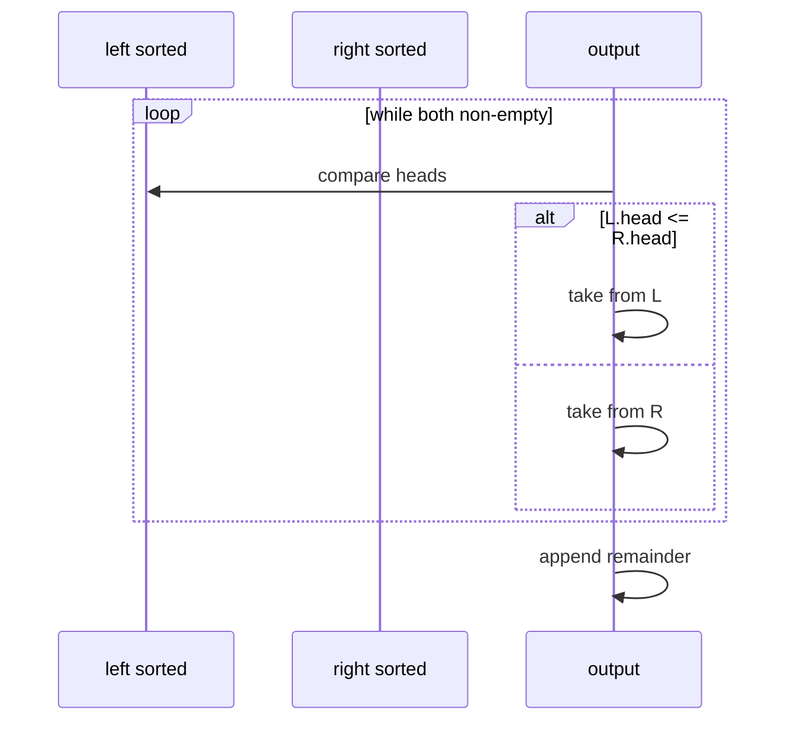

# Merge sort

A **divide-and-conquer** comparison sort: **split** the array in half, **recursively sort** each half, then **merge** two sorted halves into one sorted run. It delivers predictable **Θ(n log n)** time and is **stable** when the merge prefers the left element on ties.

| | |
| --- | --- |
| **What it is** | Recursive halving + linear merge of two sorted sequences. |
| **Time** | **Best, average, worst** Θ(n log n). |
| **Space** | Θ(n) auxiliary for typical array merge (not in-place on arrays). |
| **Stability** | **Stable** if merge takes from left on `<=`. |
| **In-place** | **No** (standard top-down array version). |
| **When to use** | Large *n*, need stable Θ(n log n), external sort, linked-list sort. |

**Practical lens:** merge sort is how you think about **merging two sorted lists** (left partition + right partition) into one ordered run in O(n) per merge level—or sorting 50,000 items by key with guaranteed O(n log n) regardless of pivot luck. Production still uses **Timsort** (`list.sort`), which is merge-inspired.

[Complexity analysis](../../complexity/index.md) · [Parent: Algorithms](../index.md)

---

## Typical scenarios

| Scenario | Merge-sort angle |
| --- | --- |
| Merge two sorted ID lists | Classic O(n) merge pass |
| Stable sort with tied keys | Stable merge preserves prior order |
| Linked list of ordered nodes | Merge sort without random access—O(1) splice |
| In-memory 50k-element array | Use `list.sort`; same asymptotic class |

---

## Summary properties

| Property | Value |
| --- | --- |
| **Best / average / worst time** | Θ(n log n) |
| **Space** | Θ(n) extra buffer (typical) |
| **Stable** | Yes (left-biased merge) |
| **In-place** | No (array version) |
| **Parallelizable** | Yes (sort halves independently) |

---

## How it works

1. **Base:** if `len <= 1`, return.
2. **Divide:** `mid = n // 2`, sort `A[0:mid]` and `A[mid:n]`.
3. **Merge:** two pointers `i`, `j` on left/right; copy smaller to buffer; flush remainder.
4. Copy buffer back to `A`.

```mermaid
flowchart TD
 MS([merge_sort A, lo, hi]) --> Base{hi - lo <= 1?}
 Base -->|yes| Ret([return])
 Base -->|no| Mid[mid = (lo+hi)//2]
 Mid --> L[merge_sort left half]
 L --> R[merge_sort right half]
 R --> M[merge lo..mid with mid..hi]
 M --> Ret
```



---

## Pseudocode

```text
MERGE_SORT(A, lo, hi):
 if hi - lo <= 1:
 return
 mid = (lo + hi) // 2
 MERGE_SORT(A, lo, mid)
 MERGE_SORT(A, mid, hi)
 MERGE(A, lo, mid, hi, buffer)

MERGE(A, lo, mid, hi, B):
 copy A[lo:hi] into B
 i, j, k = lo, mid, lo
 while i < mid and j < hi:
 if B[i] <= B[j]:
 A[k] = B[i]; i += 1
 else:
 A[k] = B[j]; j += 1
 k += 1
 copy rest from B
```

---

## Python implementation

```python
from dataclasses import dataclass


def merge_sort(nums):
 if len(nums) <= 1:
 return nums[:]
 mid = len(nums) // 2
 left = merge_sort(nums[:mid])
 right = merge_sort(nums[mid:])
 return _merge(left, right)


def _merge(left, right):
 out = []
 i = j = 0
 while i < len(left) and j < len(right):
 if left[i] <= right[j]: # <= keeps stability
 out.append(left[i])
 i += 1
 else:
 out.append(right[j])
 j += 1
 out.extend(left[i:])
 out.extend(right[j:])
 return out


def merge_sort_inplace(nums):
 buf = [0.0] * len(nums)
 _ms_inplace(nums, 0, len(nums), buf)


def _ms_inplace(a, lo, hi, buf):
 if hi - lo <= 1:
 return
 mid = (lo + hi) // 2
 _ms_inplace(a, lo, mid, buf)
 _ms_inplace(a, mid, hi, buf)
 buf[lo:hi] = a[lo:hi]
 i, j, k = lo, mid, lo
 while i < mid and j < hi:
 if buf[i] <= buf[j]:
 a[k] = buf[i]
 i += 1
 else:
 a[k] = buf[j]
 j += 1
 k += 1
 while i < mid:
 a[k] = buf[i]
 i += 1
 k += 1
 while j < hi:
 a[k] = buf[j]
 j += 1
 k += 1


@dataclass
class TaskItem:
 task_id: int
 priority: int
 label: str


def merge_sort_items(items):
 if len(items) <= 1:
 return items[:]
 mid = len(items) // 2
 return _merge_items(
 merge_sort_items(items[:mid]),
 merge_sort_items(items[mid:]),
 )


def _merge_items(left, right):
 out = []
 i = j = 0
 while i < len(left) and j < len(right):
 if left[i].task_id <= right[j].task_id:
 out.append(left[i])
 i += 1
 else:
 out.append(right[j])
 j += 1
 out.extend(left[i:])
 out.extend(right[j:])
 return out
```

| | |
| --- | --- |
| **Time** | Θ(n log n) all cases |
| **Space** | Θ(n) for buffer |

---

## Trace: merge two sorted halves

**Left** (task IDs 101–103): `[101, 102, 103]` 
**Right** (task IDs 104–105): `[104, 105]` 
Already sorted halves—one merge pass:

| step | take | output |
| ---: | --- | --- |
| 1 | 101 | `[101]` |
| 2 | 102 | `[101,102]` |
| 3 | 103 | `[101,102,103]` |
| 4 | 104 | `[...,104]` |
| 5 | 105 | `[101..105]` |

Full merge sort on `[32.1, 10.0, 28.4, 10.0]` splits until singletons, then merges with stability on equal `10.0`.

---

## Versus `list.sort()` / `sorted()` / `heapq`

- **CPython Timsort:** hybrid merge + insertion; Θ(n log n) worst; exploits **runs** in real data (e.g. items mostly ordered by key with a few corrections).
- **`sorted()`:** same engine, new list.
- **`heapq`:** partial order for top-*k*; not a substitute for full stable sort.

```python
items.sort(key=lambda t: t.task_id)  # Timsort — use in production
```

---

## When to use / avoid

| Use merge sort | Use `list.sort` / `sorted` |
| --- | --- |
| Teaching divide-and-conquer | Large batch exports |
| Stable sort on linked nodes | Multi-key sorts with `sorted(..., key=...)` |
| External sort (disk chunks) | Anything &gt; few thousand elements in pure Python |

```python
sorted(batch, key=lambda t: (t.priority, t.task_id))  # stable tuple key
```

---

## Master complexity table

| | Best | Average | Worst | Auxiliary space |
| --- | --- | --- | --- | --- |
| Time | Θ(n log n) | Θ(n log n) | Θ(n log n) | — |
| Space | — | — | — | Θ(n) typical |

Recurrence: $T(n) = 2T(n/2) + \Theta(n) \Rightarrow \Theta(n \log n)$.

---

## Pitfalls

| Pitfall | Fix |
| --- | --- |
| Merge with `<` only | Use `<=` on left for stability |
| In-place merge on arrays without care | Use buffer or linked list |
| Deep recursion on huge *n* | Iterative bottom-up merge or `sort` |
| Forgetting copy-back from buffer | Corrupt array |

---

## Related pages

| Page | Note |
| --- | --- |
| [Quicksort](../quicksort/index.md) | In-place, unstable average fast |
| [Heap sort](../heap-sort/index.md) | In-place Θ(n log n), unstable |
| [Doubly linked list](../../data-structures/doubly-linked-list/index.md) | Merge pattern for linked chains |
| [Complexity](../../complexity/index.md) | |

---

## Quick reference

```python
sorted_values = merge_sort(value_list)
merge_sort_inplace(value_list)
merge_sort_items(batch)  # by task_id
items.sort(key=lambda t: t.task_id)  # production
```

**Merge sort:** stable, Θ(n log n) always, Θ(n) extra space—the textbook backbone for **merging sorted sequences**.
