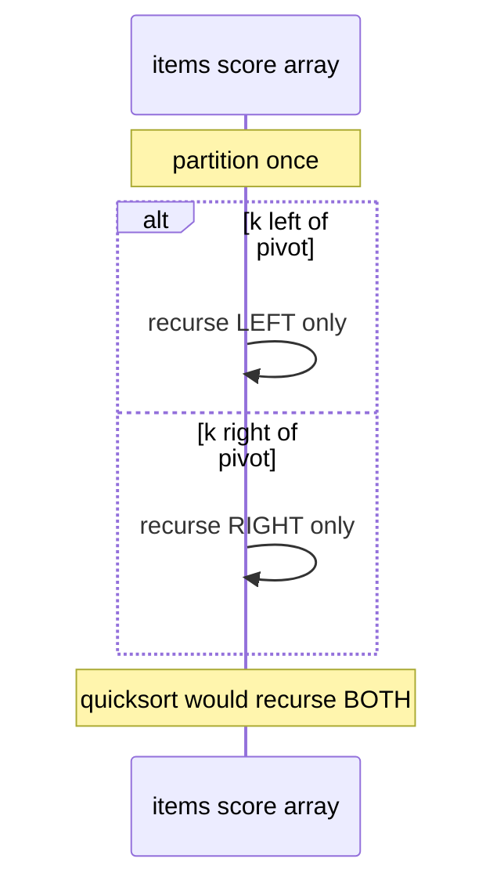
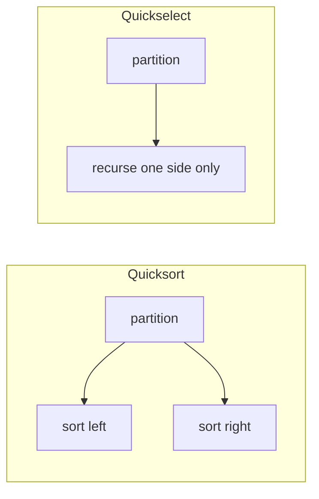
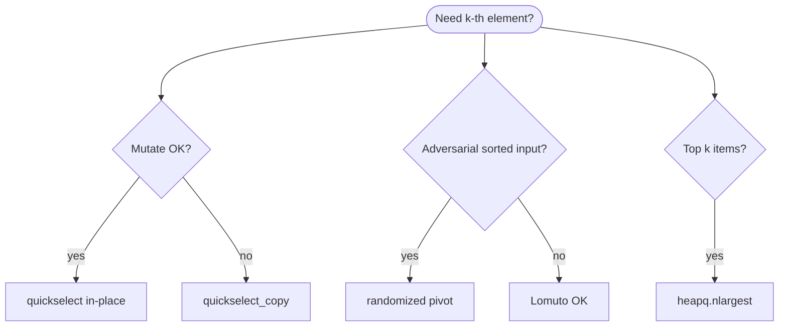
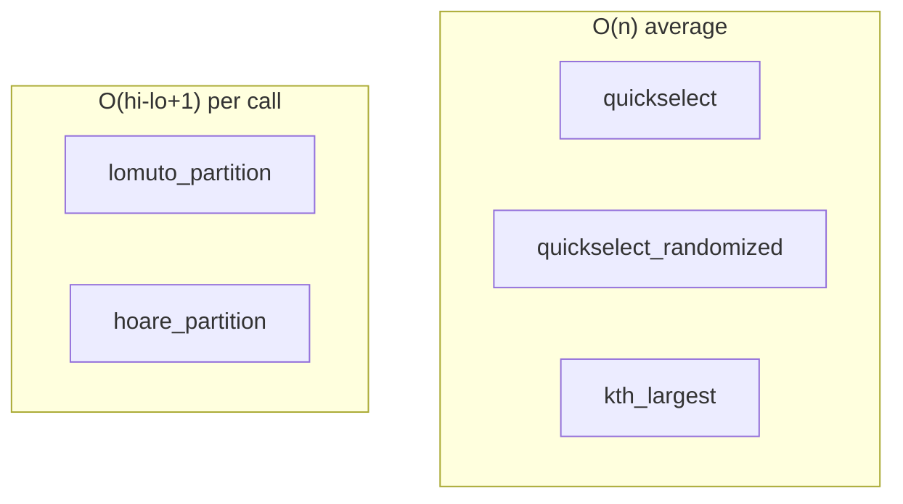
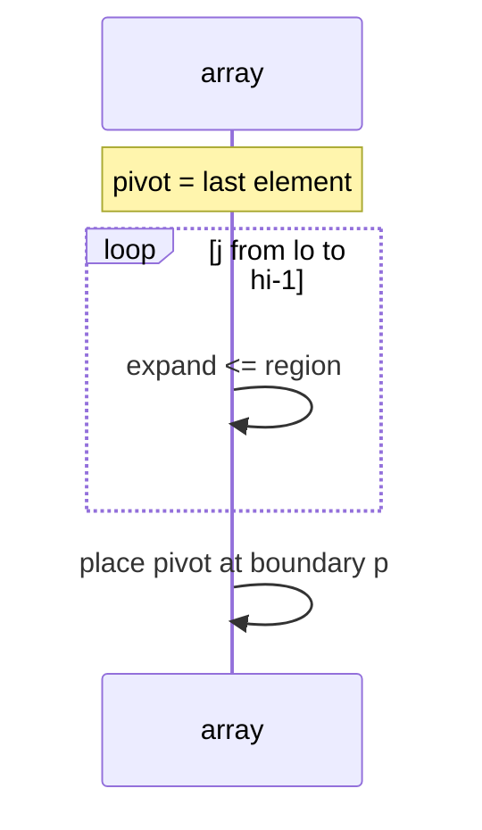
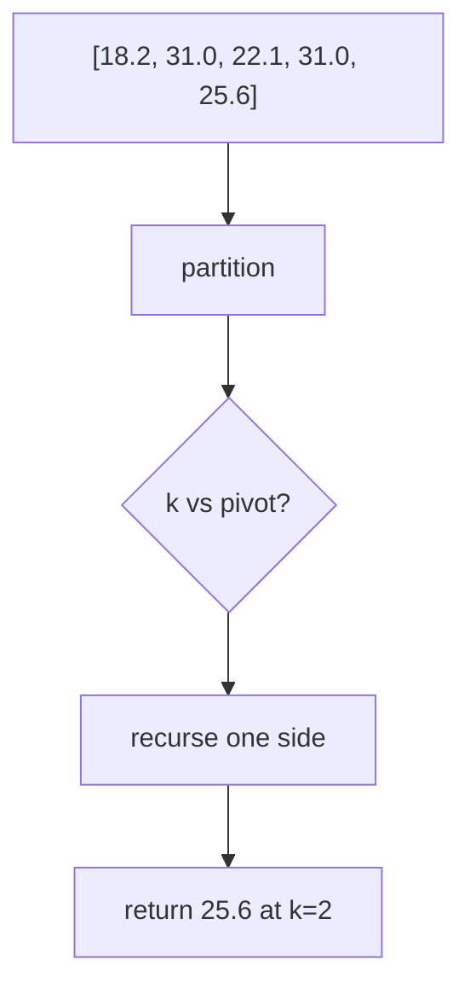
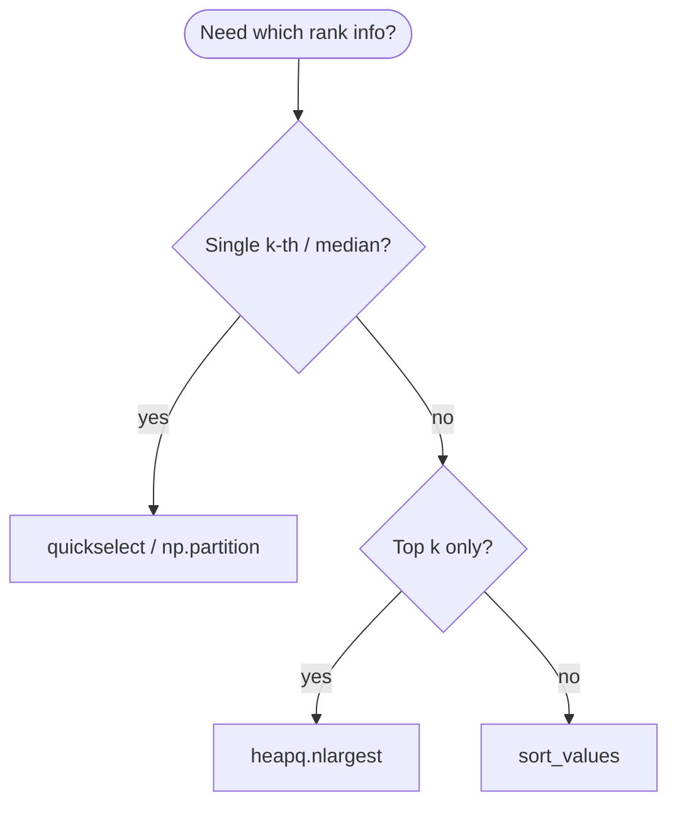

# Quickselect

A **selection algorithm** that finds the **k-th smallest** (or **k-th largest**) element in **Θ(n)** **average** time using **quicksort-style partitioning**—but recurses only into the **half that contains k**. It does **not** fully sort the array.

| | |
| --- | --- |
| **What it is** | Partition around pivot; if pivot index == k, done; else recurse left or right only. |
| **Core operations** | `partition`, recursive or iterative select, optional random pivot—same partition as [Quicksort](../quicksort/index.md). |
| **When to use** | Median score, p-th percentile amount, single order statistic without full sort. |
| **Trade-off** | **Worst** Θ(n²) with bad pivots; mutates array unless copying; not for full leaderboard. |

In **software and data systems**, quickselect answers **one rank question**: “What is the **median** priority score in this batch?” or “Which service has the **3rd-highest** throughput total on the network?”—without sorting 1,500 services. For **top 10 lists**, compare with **`heapq.nlargest`**. For **full table exports**, use **pandas** `quantile` or `sort_values`.

This page is your **ready reference**: Lomuto and Hoare partition, iterative and recursive quickselect, randomized pivots, worked examples, complexity tables, pitfalls, and links to [Quicksort](../quicksort/index.md). For Big-O notation, see [Complexity analysis](../../complexity/index.md).

[Parent: Algorithms](../index.md)

---

## Practical applications

| Use case | k (0-based from smallest) | Operation |
| --- | --- | --- |
| **Median batch score** | `n // 2` | `quickselect(values, k)` |
| **3rd-highest amount** | `n - 3` from smallest | or `n - 1 - 2` for 3rd largest |
| **75th percentile score** | `floor(0.75 * (n-1))` | one select |
| **Lower quartile latency** | `n // 4` | order statistic |
| **Pivot for quicksort** | `n // 2` median-of-three | selection substep |

**Use full sort** when you need **every** rank visible. **Use quickselect** for **one** (or few) order statistics on an in-memory array.

```mermaid
flowchart TD
 QS([quickselect A, lo, hi, k]) --> P[partition → pivot index p]
 P --> EQ{p == k?}
 EQ -->|yes| RET([return A[k]])
 EQ -->|no| BR{k < p?}
 BR -->|yes| L[select lo .. p-1]
 BR -->|no| R[select p+1 .. hi]
```

Throughout this page, **n** = array length, **k** = zero-based rank from **smallest** (0 = minimum).

---

## Quickselect vs quicksort vs heap vs full sort

| | **Quickselect** | [Quicksort](../quicksort/index.md) | **`heapq.nlargest(k)`** | **`sorted()`** |
| --- | --- | --- | --- | --- |
| **Goal** | One k-th element | Full order | Top k | Full order |
| **Average time** | Θ(n) | Θ(n log n) | Θ(n log k) | Θ(n log n) |
| **Worst time** | Θ(n²) | Θ(n²) | Θ(n log k) | Θ(n log n) |
| **Space** | O(1) + stack | O(log n) stack | O(k) | O(n) |
| **Mutates input** | Yes (in-place) | Yes | No | No |
| **Good fit** | Median / one percentile | Full item ranking | Top 10 extremes | Export CSV order |



---

## Mental model: partition + one-sided recursion

**Partition** (Lomuto): choose pivot, rearrange so `A[lo..p-1] ≤ A[p] ≤ A[p+1..hi]`, return `p`.

**Select:** if `k == p`, answer is `A[k]`; elif `k < p`, search left; else search right.

Only **one** recursive call per level → average **Θ(n)** total work (geometric series: n + n/2 + n/4 + …).

| Step | Cost driver |
| --- | --- |
| One partition on segment size s | O(s) |
| Expected depth | O(log n) |
| **Expected total** | **O(n)** |



---

## Data types for examples

```python
from __future__ import annotations
from dataclasses import dataclass

@dataclass(frozen=True, slots=True)
class TaskItem:
    name = ''
    score = 0.0
    region = ''
    bytes_sent = 0

@dataclass(frozen=True, slots=True)
class ServiceMetric:
    service_id = 0
    score = 0.0
    latency_ms = 0.0
```

---

## Ways to invoke quickselect

### 1. In-place k-th smallest on `list[float]`

```python
values = [18.2, 31.0, 22.1, 25.6, 31.0]
kth = quickselect(values, k=2)
```

| | |
| --- | --- |
| **Time** | Θ(n) average |
| **Space** | O(1) |

### 2. Non-destructive copy

```python
kth = quickselect_copy(values, k=2)
```

| | |
| --- | --- |
| **Time** | Θ(n) average |
| **Space** | O(n) copy |

### 3. Randomized pivot (worst-case guard)

```python
kth = quickselect_randomized(values, k=2)
```

| | |
| --- | --- |
| **Time** | Θ(n) expected |
| **Worst** | O(n²) still possible (theoretical) |

### 4. k-th largest via index conversion

```python
def kth_largest(nums, k):
    return quickselect_randomized(nums, len(nums) - k)
```

| | |
| --- | --- |
| **Time** | Θ(n) average |
| **Space** | O(n) if copy |

### 5. Objects with key function

```python
med_item = quickselect_item(items, k=len(items) // 2, key=lambda s: s.score)
```

| | |
| --- | --- |
| **Time** | Θ(n) average |
| **Space** | O(n) copy of list |

### 6. NumPy `partition` (production at scale)

```python
import numpy as np
arr = np.array(score_list)
k = len(arr) // 2
np.partition(arr, k)
med = arr[k]
```

| | |
| --- | --- |
| **Time** | O(n) average at C speed |
| **Space** | O(1) |



---

## Reference implementation: partition + quickselect family

```python
from __future__ import annotations

import random
from dataclasses import dataclass


def lomuto_partition(nums, lo, hi):
 pivot = nums[hi]
 i = lo - 1
 for j in range(lo, hi):
 if nums[j] <= pivot:
 i += 1
 nums[i], nums[j] = nums[j], nums[i]
 nums[i + 1], nums[hi] = nums[hi], nums[i + 1]
 return i + 1

def hoare_partition(nums, lo, hi):
 pivot = nums[(lo + hi) // 2]
 i, j = lo - 1, hi + 1
 while True:
 i += 1
 while nums[i] < pivot:
 i += 1
 j -= 1
 while nums[j] > pivot:
 j -= 1
 if i >= j:
 return j
 nums[i], nums[j] = nums[j], nums[i]

def quickselect(nums, k):
 if not nums:
 raise IndexError("empty array")
 if k < 0 or k >= len(nums):
 raise IndexError("k out of range")
 lo, hi = 0, len(nums) - 1
 while lo < hi:
 p = lomuto_partition(nums, lo, hi)
 if p == k:
 return nums[k]
 if k < p:
 hi = p - 1
 else:
 lo = p + 1
 return nums[lo]

def quickselect_recursive(nums, k):

 def select(lo, hi, k):
 if lo >= hi:
 return nums[lo]
 p = lomuto_partition(nums, lo, hi)
 if p == k:
 return nums[k]
 if k < p:
 return select(lo, p - 1, k)
 return select(p + 1, hi, k)

 return select(0, len(nums) - 1, k)

def quickselect_copy(nums, k):
 return quickselect(nums.copy(), k)

def quickselect_randomized(nums, k):
 arr = nums.copy()
 lo, hi = 0, len(arr) - 1
 while lo < hi:
 pivot_idx = random.randint(lo, hi)
 arr[pivot_idx], arr[hi] = arr[hi], arr[pivot_idx]
 p = lomuto_partition(arr, lo, hi)
 if p == k:
 return arr[k]
 if k < p:
 hi = p - 1
 else:
 lo = p + 1
 return arr[lo]

def quickselect_median_of_three(nums, lo, hi):
 mid = (lo + hi) // 2
 if nums[lo] > nums[mid]:
 nums[lo], nums[mid] = nums[mid], nums[lo]
 if nums[lo] > nums[hi]:
 nums[lo], nums[hi] = nums[hi], nums[lo]
 if nums[mid] > nums[hi]:
 nums[mid], nums[hi] = nums[hi], nums[mid]
 nums[mid], nums[hi] = nums[hi], nums[mid]

def quickselect_m3(nums, k):
 arr = nums.copy()
 lo, hi = 0, len(arr) - 1
 while lo < hi:
 quickselect_median_of_three(arr, lo, hi)
 p = lomuto_partition(arr, lo, hi)
 if p == k:
 return arr[k]
 if k < p:
 hi = p - 1
 else:
 lo = p + 1
 return arr[lo]

def kth_largest(nums, k):
 n = len(nums)
 if k < 1 or k > n:
 raise IndexError("k out of range")
 return quickselect_randomized(nums.copy(), n - k)

def percentile(nums, p):
 if not nums:
 raise ValueError("empty")
 arr = sorted(nums)
 rank = (p / 100.0) * (len(arr) - 1)
 lo = int(rank)
 hi = min(lo + 1, len(arr) - 1)
 frac = rank - lo
 return arr[lo] * (1 - frac) + arr[hi] * frac

def percentile_select(nums, p):
 if not nums:
 raise ValueError("empty")
 k = int((p / 100.0) * (len(nums) - 1))
 return quickselect_randomized(nums, k)

@dataclass(frozen=True, slots=True)
class TaskItem:
 name = ""
 score = 0.0
 region = ""

def quickselect_item(
 items,
 k,
 *,
 key= lambda s: s.score,
):
 arr = items[:]
 lo, hi = 0, len(arr) - 1

 def part(lo, hi):
 pivot = key(arr[hi])
 i = lo - 1
 for j in range(lo, hi):
 if key(arr[j]) <= pivot:
 i += 1
 arr[i], arr[j] = arr[j], arr[i]
 arr[i + 1], arr[hi] = arr[hi], arr[i + 1]
 return i + 1

 while lo < hi:
 p = part(lo, hi)
 if p == k:
 return arr[k]
 if k < p:
 hi = p - 1
 else:
 lo = p + 1
 return arr[lo]
```

| | |
| --- | --- |
| **Average time** | Θ(n) |
| **Worst time** | Θ(n²) |
| **Space** | O(1) iterative; O(log n) recursive stack |

---

## All operations (with examples and complexity)



### `lomuto_partition(nums, lo, hi)`

```python
arr = [18.2, 31.0, 22.1, 25.6]
p = lomuto_partition(arr, 0, len(arr) - 1)
```

| | |
| --- | --- |
| **Time** | O(hi − lo + 1) |
| **Space** | O(1) |

**Example:** Same partition as [Quicksort](../quicksort/index.md)—“items at or below pivot priority score to the left.”



---

### `hoare_partition(nums, lo, hi)`

Fewer swaps on some inputs; pivot not fixed at end.

| | |
| --- | --- |
| **Time** | O(hi − lo + 1) |
| **Space** | O(1) |

Pair with careful quickselect indexing—Lomuto is simpler for teaching.

---

### `quickselect(nums, k)` — iterative

```python
sample_scores = [12.1, 28.4, 15.0, 22.3, 31.2]
median = quickselect(sample_scores, k=len(sample_scores) // 2)
```

| | |
| --- | --- |
| **Time** | Θ(n) average |
| **Space** | O(1) |

**Warning:** mutates `sample_scores` order.

---

### `quickselect_randomized(nums, k)`

```python
third_smallest = quickselect_randomized(values.copy(), k=2)
```

| | |
| --- | --- |
| **Time** | Θ(n) expected |
| **Space** | O(n) copy in snippet |

Random pivot avoids Θ(n²) on **sorted `entry_id`** inputs.

---

### `kth_largest(nums, k)`

```python
best = kth_largest([0.1, 0.9, 0.4, 0.7], k=1)
third = kth_largest(values, k=3)
```

| | |
| --- | --- |
| **Time** | Θ(n) average |
| **Space** | O(n) copy |

Convert rank: k-th largest → select index `n - k` from smallest.

---

### `quickselect_item(items, k, key=score)`

```python
median_item = quickselect_item(items, k=len(items) // 2)
```

| | |
| --- | --- |
| **Time** | Θ(n) average |
| **Space** | O(n) copy |

---

### `percentile_select(nums, p)`

```python
p75_score = percentile_select(score_values, 75.0)
```

| | |
| --- | --- |
| **Time** | Θ(n) average for single rank |
| **Space** | O(n) copy |

For **exact** interpolated percentiles, pandas `quantile` is richer.

---

## Trace: 3rd-highest score (k from smallest)

Five items: `[18.2, 31.0, 22.1, 31.0, 25.6]`

**Want 3rd largest** → 3rd smallest index `k = n - 3 = 2` (0-based from min).

| Rank (desc) | score |
| ---: | ---: |
| 1 | 31.0 |
| 2 | 31.0 |
| **3** | **25.6** |
| 4 | 22.1 |
| 5 | 18.2 |

One partition path might place `22.1` at index 2 before further recursion—final `quickselect(..., k=2)` → **`25.6`** without full sort.



---

## Trace: median of nine scores

`score_values = [-1.2, 0.4, 0.1, 0.9, -0.3, 0.0, 0.5, 0.2, -0.1]`, n=9, `k=4`.

Sorted reference: `[-1.2, -0.3, -0.1, 0.0, 0.1, 0.2, 0.4, 0.5, 0.9]` → median **0.1**.

`quickselect_randomized(score_values, 4)` returns **0.1** after expected O(n) work.

| | |
| --- | --- |
| **Time** | Θ(n) average |
| **vs sort** | Θ(n log n) saved constant factor |

---

## Application patterns with quickselect

### Batch median score among items

```python
def median_score(items):
    values = [s.score for s in items]
    k = len(values) // 2
    return quickselect_randomized(values, k)

def median_service(services):
    return quickselect_item(items, k=len(items) // 2)
```

| | |
| --- | --- |
| **Time** | Θ(n) average |
| **Space** | O(n) |

Compare: `statistics.median(values)` sorts internally in C.

---

### Percentile cutoff for SLA breach (k-th rank)

```python
def percentile_cutoff_score(scores, pct=0.2):
    n = len(scores)
    k = max(0, int((1.0 - pct) * n) - 1)
    return quickselect_randomized(scores, k)
```

| | |
| --- | --- |
| **Time** | Θ(n) average |
| **Space** | O(n) |

---

### Partition step inside quicksort

[Quicksort](../quicksort/index.md) uses the same `partition` but recurses **both** sides—quickselect is the **one-sided** optimization.

```python
def quicksort(nums, lo= 0, hi= None):
 if hi is None:
 hi = len(nums) - 1
 if lo >= hi:
 return
 p = lomuto_partition(nums, lo, hi)
 quicksort(nums, lo, p - 1)
 quicksort(nums, p + 1, hi)
```

| | |
| --- | --- |
| **Time** | Θ(n log n) average full sort |
| **Select vs sort** | Select saves second recursion |

---

### Multiple order statistics

Calling quickselect k times for k different ranks costs O(k · n) average— worse than one sort if k is large.

| k queries | Better tool |
| --- | --- |
| k = 1 | quickselect |
| k small | k × select or size-k heap |
| k ≈ n | full sort once |

```python
import heapq
top10 = heapq.nlargest(10, items, key=lambda s: s.score)
```

---

## Lomuto vs Hoare partition

| | **Lomuto** | **Hoare** |
| --- | --- | --- |
| **Pivot position** | Fixed at `hi` | Middle value, two pointers |
| **Swaps** | Often more | Often fewer |
| **Quickselect indexing** | Simple `p == k` | Careful with bounds |
| **Teaching default** | Default on this page | Advanced variant |

---

## Expected time analysis (sketch)

Recurrence (average, balanced pivot): $T(n) = T(n/2) + \Theta(n) \Rightarrow T(n) = \Theta(n)$.

Worst (pivot always min/max): $T(n) = T(n-1) + \Theta(n) \Rightarrow \Theta(n^2)$.

| Case | Time |
| --- | --- |
| **Best / average** | Θ(n) |
| **Worst** | Θ(n²) |
| **Randomized expected** | Θ(n) |

---

## Versus `list.sort()`, pandas, NumPy, `heapq`

| Task | Tool |
| --- | --- |
| Single median | `statistics.median`, `np.median`, quickselect |
| Top 10 scores | `heapq.nlargest(10, ...)` Θ(n log 10) |
| Full item ranking | `sort`, `df.sort_values` |
| Column percentile | `df["score"].quantile(0.75)` |
| Partial partition | `np.partition` |

```python
import statistics
import pandas as pd
import numpy as np
statistics.median(sample_scores)
df['score'].quantile(0.75)
arr = np.array(sample_scores)
np.partition(arr, k)[k]
```

**NumPy `partition`** is the production vectorized quickselect cousin.

---

## Master complexity table

| Operation | Best / average | Worst | Space |
| --- | --- | --- | --- |
| `lomuto_partition` on s elements | Θ(s) | Θ(s) | O(1) |
| `quickselect` one k | **Θ(n)** | **Θ(n²)** | O(1) iterative |
| `quickselect_recursive` | Θ(n) avg | Θ(n²) | O(log n) stack |
| `quickselect_randomized` | Θ(n) expected | Θ(n²) theoretical | O(n) if copy |
| `kth_largest` | Θ(n) avg | Θ(n²) | O(n) copy |
| Full sort | Θ(n log n) | Θ(n log n) | O(log n) |
| `nlargest(k)` | Θ(n log k) | Θ(n log k) | O(k) |

| Property | Value |
| --- | --- |
| **Stable** | N/A (partial order) |
| **In-place** | Yes (unless copy) |

---

## When to use / avoid



| Use quickselect | Avoid quickselect |
| --- | --- |
| One median / percentile on list | Entire sorted table |
| In-memory items array | Need stable tie order |
| Learning with quicksort | k large order stats → sort once |
| Embedded O(1) space select | Already using pandas column |

---

## Common pitfalls

| Pitfall | Why it hurts | Fix |
| --- | --- | --- |
| Off-by-one on k (largest vs smallest) | Wrong item | `k_largest → n - k` |
| Mutating shared items list | Surprises downstream | `copy()` first |
| Sorted input, bad pivot | Θ(n²) | Randomize or median-of-three |
| Need all top-k | k selects = O(k·n) | `heapq.nlargest` |
| Confusing with partial sort output | Only one index guaranteed | Other positions unsorted |
| Hoare + wrong k logic | Index bugs | Prefer Lomuto for select |
| Empty array | Crash | Guard `if not nums` |

---

## Related pages

| Page | Relationship |
| --- | --- |
| [Quicksort](../quicksort/index.md) | Two-sided recursion |
| [Heap sort](../heap-sort/index.md) | `heapq` for top-k |
| [Selection sort](../selection-sort/index.md) | Θ(n²) repeated min-scan |
| [Max heap](../../data-structures/max-heap/index.md) | Heap selection |
| [Complexity analysis](../../complexity/index.md) | Big-O reference |

---

## Quick reference card

```python
kth = quickselect(score_list, k=2)
kth = quickselect_randomized(score_list, k=2)
best = kth_largest(score_list, k=1)
med = quickselect_randomized(values, k=len(values) // 2)
med_item = quickselect_item(items, k=len(items) // 2)
top5 = heapq.nlargest(5, items, key=lambda s: s.score)
df['score'].median()
np.partition(np.array(values), k)[k]
```

**Quickselect:** average **Θ(n)** for the **k-th order statistic**—in-place **partition** + **one-sided** recursion; pair with **`heapq.nlargest`** for top-k and **`sort_values`** for full leaderboards.

**Quick checklist**

1. **One median / cutoff** — quickselect or `quantile`.
2. **Top 10 extremes** — `nlargest`, not repeated select.
3. **Full table ranks** — sort once.
4. **Copy before select** — partition scrambles order.
5. **Sorted entry_id inputs** — randomize pivot.
