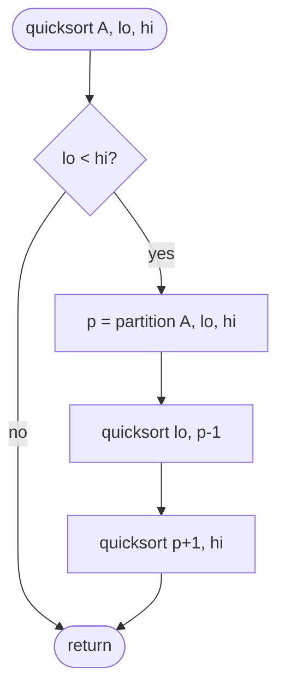
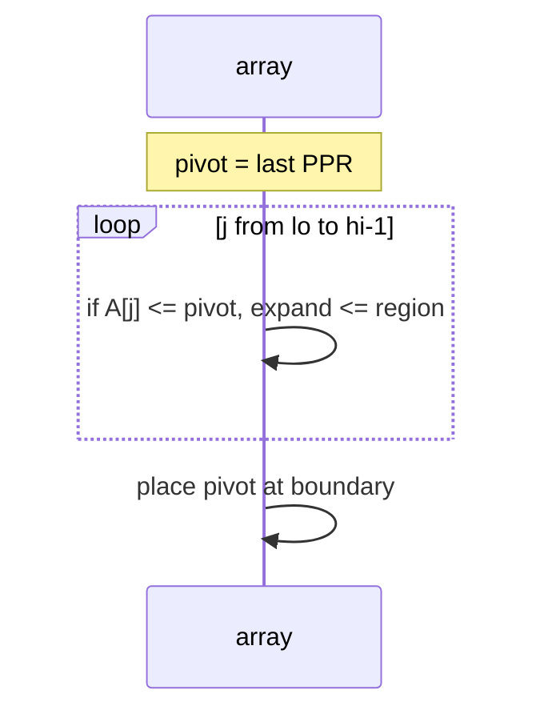

# Quicksort

A **divide-and-conquer** comparison sort: choose a **pivot**, **partition** so keys ≤ pivot sit left and keys &gt; pivot sit right, then recurse on both sides. Average performance is **Θ(n log n)** with low constants; worst case **Θ(n²)** on adversarial or unlucky pivots.

| | |
| --- | --- |
| **What it is** | Partition + two recursive sub-sorts; in-place on arrays with Lomuto or Hoare. |
| **Time** | **Best** Θ(n log n); **average** Θ(n log n); **worst** Θ(n²). |
| **Space** | O(log n) recursion stack average; O(n) worst stack. |
| **Stability** | **Not stable** (partition swaps jump over equals). |
| **In-place** | **Yes** (array partition). |
| **When to use** | General in-memory sort when stability not required; foundation for [Quickselect](../quickselect/index.md). |

**NFL lens:** quicksort is “split the roster around a pivot QB’s PPR—everyone better to the left, everyone worse to the right—then sort each side.” CPython uses **Timsort** for `list.sort`, not pure quicksort, but quicksort still appears in libraries and interviews and powers **order statistics** via partitioning.

[Complexity analysis](../../complexity/index.md) · [Parent: Algorithms](../index.md)

---

## Summary properties

| Property | Value |
| --- | --- |
| **Best time** | Θ(n log n) — balanced partitions |
| **Average time** | Θ(n log n) |
| **Worst time** | Θ(n²) — pivot always min/max |
| **Space** | O(log n) stack typical |
| **Stable** | No |
| **In-place** | Yes |

---

## How it works (Lomuto partition)

1. Pick pivot (often `A[hi]`).
2. `i` tracks boundary of “≤ pivot” region.
3. Scan `j` from `lo` to `hi-1`; if `A[j] ≤ pivot`, swap into `++i` region.
4. Swap pivot to `i+1`; pivot index `p` is final.
5. Recurse on `[lo, p-1]` and `[p+1, hi]`.

**Hoare partition:** two pointers from ends; fewer swaps sometimes; pivot not fixed until end.





---

## Pseudocode (Lomuto)

```text
QUICKSORT(A, lo, hi):
    if lo >= hi:
        return
    p = PARTITION(A, lo, hi)
    QUICKSORT(A, lo, p - 1)
    QUICKSORT(A, p + 1, hi)

PARTITION(A, lo, hi):
    pivot = A[hi]
    i = lo - 1
    for j = lo to hi - 1:
        if A[j] <= pivot:
            i += 1
            swap A[i], A[j]
    swap A[i + 1], A[hi]
    return i + 1
```

---

## Python implementation

```python
from __future__ import annotations

import random
from dataclasses import dataclass


def quicksort(nums: list[float], lo: int = 0, hi: int | None = None) -> None:
    if hi is None:
        hi = len(nums) - 1
    if lo >= hi:
        return
    p = _partition(nums, lo, hi)
    quicksort(nums, lo, p - 1)
    quicksort(nums, p + 1, hi)


def _partition(nums: list[float], lo: int, hi: int) -> int:
    pivot = nums[hi]
    i = lo - 1
    for j in range(lo, hi):
        if nums[j] <= pivot:
            i += 1
            nums[i], nums[j] = nums[j], nums[i]
    nums[i + 1], nums[hi] = nums[hi], nums[i + 1]
    return i + 1


def quicksort_randomized(nums: list[float]) -> None:
    """Shuffle before sort to avoid Θ(n²) on sorted play_id input."""
    random.shuffle(nums)
    quicksort(nums)


@dataclass(frozen=True, slots=True)
class Player:
    name: str
    ppr: float


def quicksort_players(
    players: list[Player], lo: int = 0, hi: int | None = None, *, key=lambda p: p.ppr
) -> None:
    if hi is None:
        hi = len(players) - 1
    if lo >= hi:
        return
    p = _partition_players(players, lo, hi, key=key)
    quicksort_players(players, lo, p - 1, key=key)
    quicksort_players(players, p + 1, hi, key=key)


def _partition_players(players, lo, hi, *, key):
    pivot = key(players[hi])
    i = lo - 1
    for j in range(lo, hi):
        if key(players[j]) <= pivot:
            i += 1
            players[i], players[j] = players[j], players[i]
    players[i + 1], players[hi] = players[hi], players[i + 1]
    return i + 1
```

| | |
| --- | --- |
| **Time** | Avg Θ(n log n), worst Θ(n²) |
| **Space** | O(log n) recursion typical |

**Mitigations:** random pivot, median-of-three, **introsort** (switch to heap sort after depth limit)—what production C++ `std::sort` does.

---

## Trace: partition four PPR values

`[28.4, 22.1, 31.0, 25.6]`, pivot = `25.6` (last)

| j | action | array (conceptual) |
| ---: | --- | --- |
| — | pivot 25.6 | `[28.4, 22.1, 31.0, 25.6]` |
| 0 | 28.4 &gt; pivot | no swap |
| 1 | 22.1 ≤ pivot | swap → `[22.1, 28.4, 31.0, 25.6]` |
| 2 | 31.0 &gt; pivot | no swap |
| end | place pivot | `[22.1, 25.6, 31.0, 28.4]` |

Recurse left `[22.1]`, right sort `[31.0, 28.4]` → full ascending order.

---

## Versus `list.sort()` / `sorted()` / `heapq`

| | Quicksort | `list.sort` (Timsort) |
| --- | --- | --- |
| Worst time | Θ(n²) naive | Θ(n log n) guaranteed |
| Stable | No | Yes |
| In-place | Yes | Yes (with temp merge buffer in worst cases) |
| Cache | Good locality on arrays | Excellent on real data |

```python
# Production
stats.sort(key=lambda r: r["rush_yds"], reverse=True)
```

Use **`heapq.nlargest`** when you only need top 10 rushers, not full order.

---

## When to use / avoid

| Use | Avoid |
| --- | --- |
| Learning partition logic | Stable fantasy ties |
| Quickselect foundation | Adversarial inputs without randomization |
| In-memory when library sort unavailable | Large pandas tables—`sort_values` |

---

## Master complexity table

| | Best | Average | Worst | Space |
| --- | --- | --- | --- | --- |
| Time | Θ(n log n) | Θ(n log n) | Θ(n²) | O(log n)–O(n) stack |
| Comparisons | Θ(n log n) | Θ(n log n) | Θ(n²) | — |

---

## Pitfalls

| Pitfall | Fix |
| --- | --- |
| Sorted `play_id` + last pivot | Random or median-of-three |
| Deep recursion | Iterative stack or introsort |
| Need stable sort | Merge sort / `sort` |
| Equal keys clustered with `>` test | `<=` on left partition for balance |

---

## Related pages

| Page | Note |
| --- | --- |
| [Quickselect](../quickselect/index.md) | One-sided recursion |
| [Merge sort](../merge-sort/index.md) | Stable Θ(n log n) |
| [Heap sort](../heap-sort/index.md) | Θ(n log n) worst in-place |
| [Complexity](../../complexity/index.md) | |

---

## Quick reference

```python
quicksort(ppr_list)
quicksort_randomized(ppr_list)   # avoid sorted worst case
quicksort_players(roster)
roster.sort(key=lambda p: p.ppr) # production
```

**Quicksort:** in-place, fast on average, **unstable**, **Θ(n²) worst**—master partition; ship **Timsort/pandas** for NFL tables.
