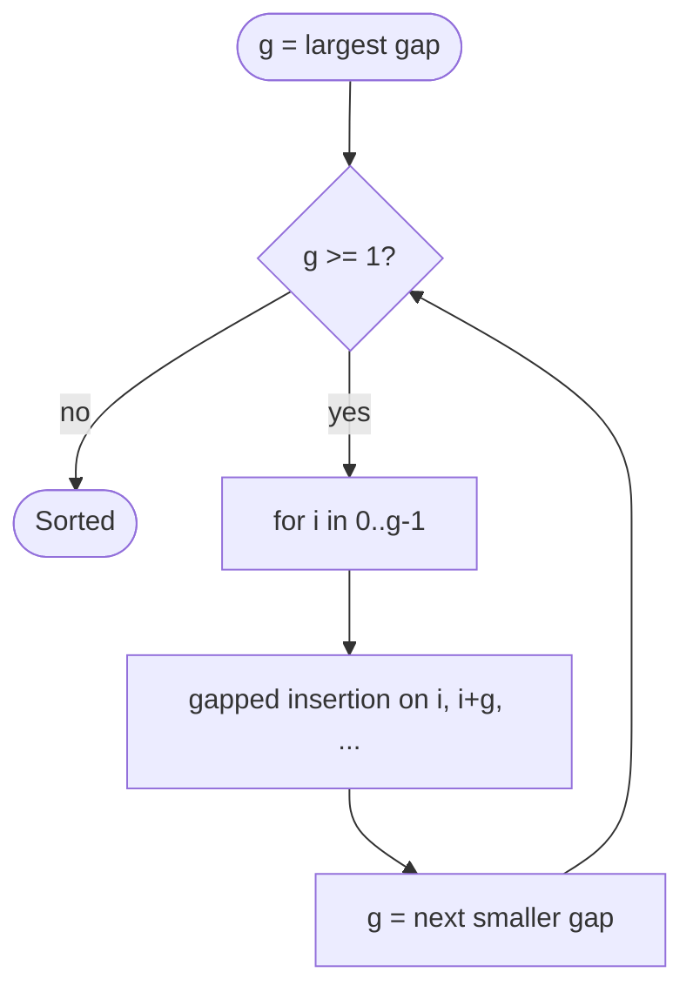

# Shell sort

A generalization of **insertion sort** that sorts elements **far apart** first (large **gaps**), then tightens the gap until **gap = 1** (ordinary insertion sort). It improves on Θ(n²) on many practical inputs while staying in-place.

| | |
| --- | --- |
| **What it is** | For each gap `g` in a decreasing sequence, do insertion sort on each subarray `A[i], A[i+g], A[i+2g], ...`. |
| **Time** | **Worst** O(n²) with poor gaps; **average** depends on gap sequence—often between O(n log n) and O(n⁴/³); **best** O(n log n) with good sequences. |
| **Space** | O(1). |
| **Stability** | **Not stable** (long-gap swaps move equals). |
| **In-place** | **Yes**. |
| **When to use** | Medium *n* in-memory when you want in-place better than insertion; rarely chosen over `list.sort` in Python production pipelines. |

**Intuition:** shell sort is like coarse **pre-ordering** by wide **gaps** (every 7th index) before fine-sorting within each subsequence—early passes move a small value from index 0 near index 30 in one shift when the gap is large.

[Complexity analysis](../../complexity/index.md) · [Parent: Algorithms](../index.md)

---

## Summary properties

| Property | Value |
| --- | --- |
| **Best time** | O(n log n) with optimal gap analysis (theory) |
| **Average time** | ~O(n^1.25)–O(n^1.5) for Sedgewick/Knuth gaps (empirical) |
| **Worst time** | O(n²) with gap 1 only, or bad sequences |
| **Space** | O(1) |
| **Stable** | No |
| **In-place** | Yes |

Common gap sequences:

| Name | Sequence |
| --- | --- |
| Shell (original) | n/2, n/4, …, 1 |
| Knuth | (3^k − 1)/2 …, 1 |
| Sedgewick | 9·4^i − 9·2^i + 1 or 4^i − 3·2^i + 1 |

---

## How it works

1. Choose gaps `g_m > … > g_1 = 1`.
2. For each `g`, for each offset `i` in `0..g-1`, insertion-sort subsequence `A[i], A[i+g], A[i+2g], ...`.
3. When `g = 1`, array is fully sorted.



---

## Pseudocode

```text
SHELL_SORT(A):
 n = length(A)
 g = n // 2
 while g >= 1:
 for i = g to n - 1:
 temp = A[i]
 j = i
 while j >= g and A[j - g] > temp:
 A[j] = A[j - g]
 j -= g
 A[j] = temp
 g = g // 2 # Shell sequence; prefer Knuth/Sedgewick
```

---

## Python implementation

```python
from dataclasses import dataclass


def shell_sort(nums):
 n = len(nums)
 g = n // 2
 while g > 0:
 for i in range(g, n):
 temp = nums[i]
 j = i
 while j >= g and nums[j - g] > temp:
 nums[j] = nums[j - g]
 j -= g
 nums[j] = temp
 g //= 2


def knuth_gaps(n):
 gaps= []
 k = 1
 while (3**k - 1) // 2 < n:
 gaps.append((3**k - 1) // 2)
 k += 1
 return list(reversed(gaps)) or [1]


def shell_sort_knuth(nums):
 for g in knuth_gaps(len(nums)):
 for i in range(g, len(nums)):
 temp = nums[i]
 j = i
 while j >= g and nums[j - g] > temp:
 nums[j] = nums[j - g]
 j -= g
 nums[j] = temp


@dataclass(frozen=True, slots=True)
class TaskItem:
 task_id = 0
 priority = 0
 label = ""


def shell_sort_items(
 items, *, key=lambda t: t.priority
):
 n = len(items)
 for g in knuth_gaps(n):
 for i in range(g, n):
 current = items[i]
 k = key(current)
 j = i
 while j >= g and key(items[j - g]) > k:
 items[j] = items[j - g]
 j -= g
 items[j] = current
```

---

## Trace: values with gap 2 then 1

`[7, 2, 5, 1]` (four integers)

**g = 2:** subarrays indices `(0,2)` and `(1,3)`

- Sort `(7, 5)` → `(5, 7)`
- Sort `(2, 1)` → `(1, 2)`
→ `[5, 1, 7, 2]`

**g = 1:** insertion sort → `[1, 2, 5, 7]`

---

## Versus `list.sort()` / `sorted()` / `heapq`

- **`list.sort`:** Always prefer for large tables—Timsort with Θ(n log n) worst guarantee and stability.
- **Shell sort:** Historical / educational bridge between insertion and O(n log n).
- **`heapq`:** Partial selection, not gap-based full sort.

---

## When to use / avoid

| Use | Avoid |
| --- | --- |
| Algorithms course | Production `list.sort` at scale |
| Embedded systems lore | Stable tie-breaking |
| Compare gap sequences in homework | Large in-memory tables |

```python
tasks.sort(key=lambda t: t.priority)
```

---

## Master complexity table

| Gap sequence | Worst | Typical empirical |
| --- | --- | --- |
| Shell n/2 | O(n²) | OK on random |
| Knuth | O(n^3/2) worst (bound) | ~O(n^4/3)–O(n^3/2) |
| Sedgewick | O(n^4/3) conjectured | Fast in practice |

| | Space |
| --- | --- |
| All variants | O(1) |

---

## Pitfalls

| Pitfall | Fix |
| --- | --- |
| Assuming stable | Document unstable |
| gap = 0 loop | Stop when g == 0 |
| Only Shell n/2 on large n | Try Knuth/Sedgewick |

---

## Related pages

| Page | Note |
| --- | --- |
| [Insertion sort](../insertion-sort/index.md) | gap = 1 case |
| [Quicksort](../quicksort/index.md) | Faster typical in-place |
| [Complexity](../../complexity/index.md) | |

---

## Quick reference

```python
shell_sort(values)
shell_sort_knuth(values)
shell_sort_items(batch)
batch.sort(key=lambda t: t.priority)
```

**Shell sort:** in-place gap insertion—faster than bare insertion on medium *n*, **unstable**, still beat by **`list.sort`** for large datasets at scale.
