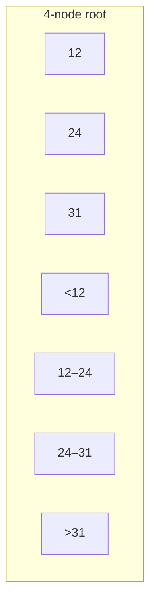
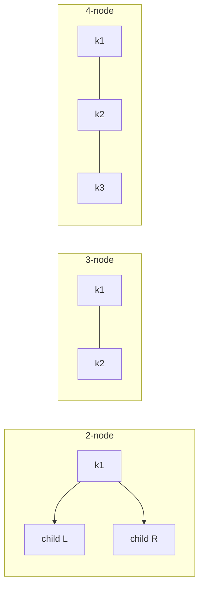
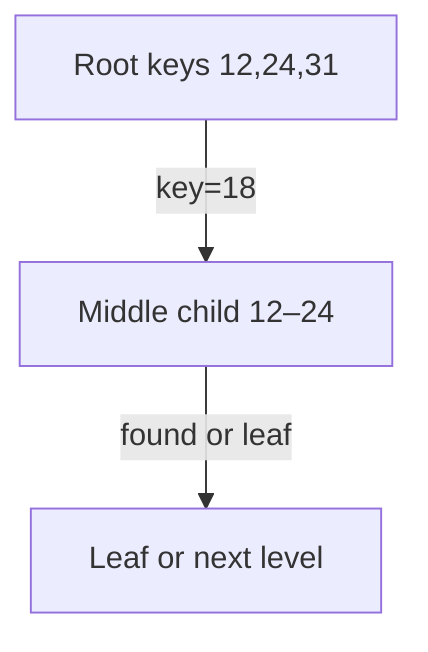
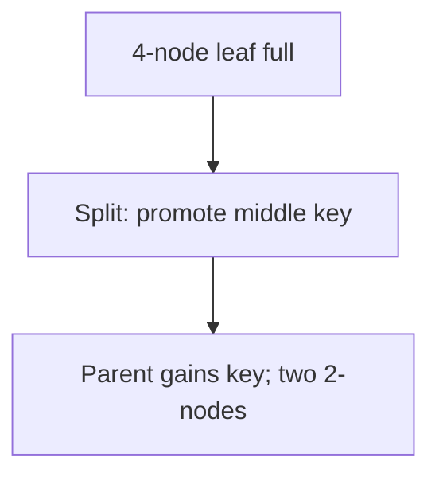
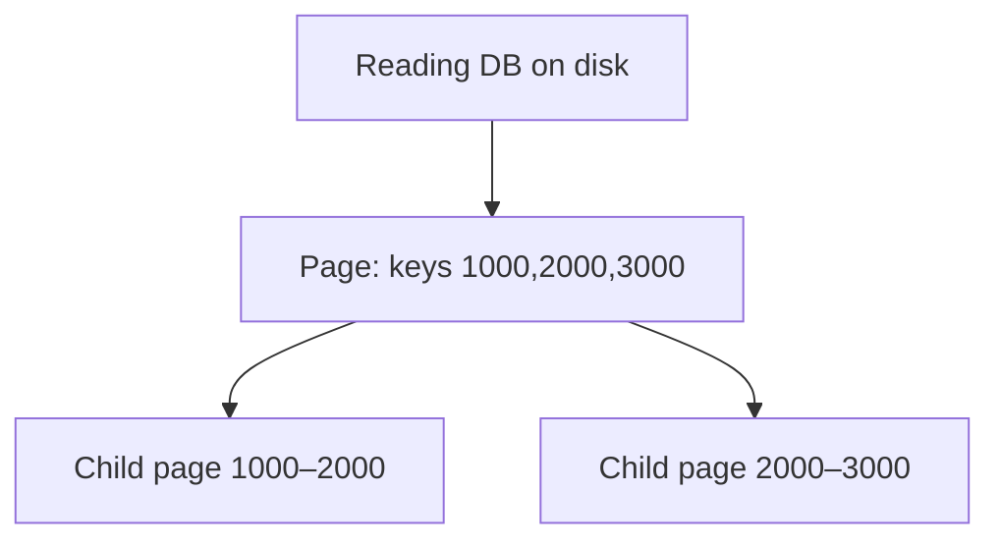
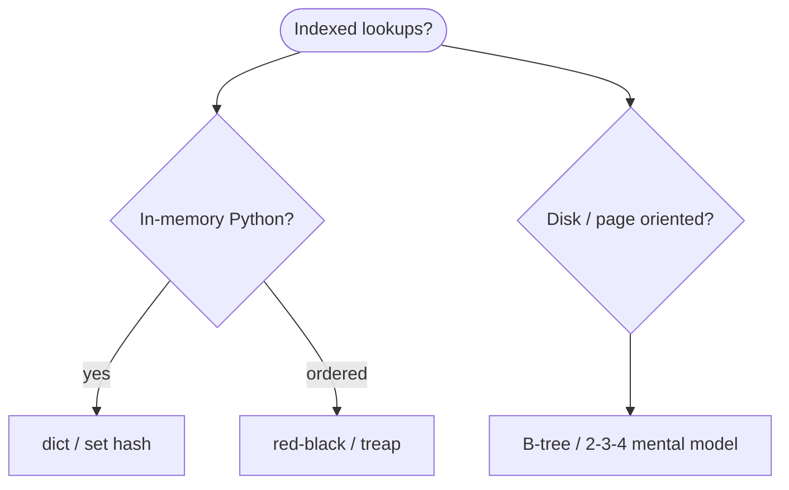

# 2-3-4 tree

A **2-3-4 tree** is a **B-tree of order 4**: every **internal** node has **2, 3, or 4 children** and **1, 2, or 3 keys** separating child ranges. All **leaves** sit at the **same depth**—the tree stays **perfectly balanced** without rotations in the red–black sense (splits and merges on nodes instead).

| | |
| --- | --- |
| **What it is** | Search tree where nodes are 2-node, 3-node, or 4-node by key count; 4-node splits upward on insert. |
| **Core operations** | Search, insert, delete in O(log n); height is O(log n) with base 4. |
| **When to use** | Pedagogy, **disk/page-oriented** indexes, understanding red–black **isomorphism**. |
| **Trade-off** | More complex node cases than BST; excellent **cache/page** fit (many keys per node). |

In **daily weather data analysis**, treat a 2-3-4 tree as the conceptual model behind a **reading database index**: each **page** (disk block) holds up to **3 keys** and **4 child pointers**, like looking up `reading_id` in a multi-year archive without scanning every daily row. You will query real data with **SQL / Parquet / pandas**—this structure explains **why indexes are shallow and wide**.

This page is your **ready reference**: node types, search/insert/delete, Python teaching implementation, Mermaid node diagrams, daily weather **reading DB** examples, and **time and space complexity**. For Big-O notation, see [Complexity analysis](../../complexity/index.md).

[Parent: Data structures](../index.md)

---

## How 2-3-4 trees fit daily weather analysis

| Weather analysis idea | 2-3-4 view | Why it maps |
| --- | --- | --- |
| **Daily reading index** | Keys = `reading_id`; 3 keys per page | Fewer pointer hops than binary tree |
| **Archive file on SSD** | Wide nodes = one read fetches many keys | B-tree family matches storage |
| **Anomaly bucket ranges** | 3 separators partition anomaly tiers | Range search by branching |
| **Red–black mental model** | 2-3-4 node ↔ black node clusters | Interview bridge |
| **Guaranteed balance** | All leaves same depth | No skewed “sorted insert” BST |



Throughout: **n** = number of keys stored, **h** = tree height = O(log₄ n) = O(log n).

---

## Node types (2-node, 3-node, 4-node)

| Node type | Keys | Children | Weather page analogy |
| --- | --- | --- | --- |
| **2-node** | 1 | 2 | Thin page after splits |
| **3-node** | 2 | 3 | Medium index block |
| **4-node** | 3 | 4 | Full page—split on next insert |



| | |
| --- | --- |
| **Invariant** | Keys in node are sorted; child i holds keys between separator i−1 and i |
| **Leaves** | Same depth; insert only splits leaves upward |

---

## 2-3-4 vs BST vs red–black vs B-tree

| | **2-3-4** | [BST](../binary-search-tree/index.md) | [Red–black](../red-black-tree/index.md) | B-tree (order m) |
| --- | --- | --- | --- | --- |
| **Keys per node** | 1–3 | 1 | 1 | up to m−1 |
| **Balance** | Perfect leaf depth | Can skew | station rules | Generalization |
| **Height** | O(log n) base 4 | O(n) worst | O(log n) | O(log_m n) |
| **Disk fit** | Excellent pedagogy | Poor (many hops) | Used in RAM libs | Database standard |
| **Weather reading index** | Teaching model | Not used at scale | `dict`/`set` RAM | Production DB |

---

## Search

Compare `reading_id` against 1–3 keys in the node; descend the correct child; repeat until leaf or hit.

```python
def search_234(node, key):
    if node is None:
        return False
    i = 0
    while i < len(node.keys) and key > node.keys[i]:
        i += 1
    if i < len(node.keys) and key == node.keys[i]:
        return True
    if node.is_leaf:
        return False
    return search_234(node.children[i], key)
```

| | |
| --- | --- |
| **Time** | O(h) = O(log n); at most 3 comparisons + 1 child per level |
| **Space** | O(1) iterative; O(h) recursive |



---

## Insert (top-down split on the way down)

**Strategy:** If a child is a **4-node**, **split it** before descending (pre-split) so you never insert into a full 4-node leaf without parent room.

**Split 4-node** with keys `[a,b,c]` at middle `b`:

- Promote `b` to parent
- Left child gets keys `< b`, right child gets keys `> b`

| Step | Time | Space |
| --- | --- | --- |
| Walk down, split 4-nodes on path | O(h) | O(1) |
| Insert into 2- or 3-node leaf | O(1) at leaf |
| Root split grows height | O(1) rare |



---

## Ways to create a 2-3-4 tree

### 1. Empty tree

```python
root = None
```

| | O(1) |

### 2. Empty `Tree234` wrapper

```python
class Tree234:
    def __init__(self) -> None:
        self.root = None
```

### 3. Insert keys one by one from unsorted readings

```python
t = Tree234()
for reading_id in [105, 42, 9001, 17, 88]:
    t.insert(reading_id)
```

| | |
| --- | --- |
| **Time** | O(k log k) for k inserts |
| **Space** | O(k) |

### 4. Sorted reading ids (still balanced)

Unlike BST, sorted insert does **not** degenerate height—splits keep leaves level.

---

## Reference implementation (teaching)

```python
from __future__ import annotations

from dataclasses import dataclass, field
from typing import Any


@dataclass
class Node234:
    keys: list[Any] = field(default_factory=list)
    children: list[Node234 | None] = field(default_factory=list)
    is_leaf: bool = True

    def is_4node(self) -> bool:
        return len(self.keys) == 3


class Tree234:
    def __init__(self) -> None:
        self.root: Node234 | None = None

    def search(self, key: Any) -> bool:
        return self._search(self.root, key)

    def _search(self, node: Node234 | None, key: Any) -> bool:
        if node is None:
            return False
        i = 0
        while i < len(node.keys) and key > node.keys[i]:
            i += 1
        if i < len(node.keys) and key == node.keys[i]:
            return True
        if node.is_leaf:
            return False
        return self._search(node.children[i], key)

    def insert(self, key: Any) -> None:
        if self.root is None:
            self.root = Node234(keys=[key], is_leaf=True)
            return
        if self.root.is_4node():
            old = self.root
            self.root = Node234(is_leaf=False)
            self.root.children = [old, None]
            self._split_child(self.root, 0)
        self._insert_nonfull(self.root, key)

    def _insert_nonfull(self, node: Node234, key: Any) -> None:
        i = len(node.keys) - 1
        if node.is_leaf:
            node.keys.append(key)
            while i >= 0 and node.keys[i] > key:
                node.keys[i + 1] = node.keys[i]
                i -= 1
            node.keys[i + 1] = key
            return
        while i >= 0 and key < node.keys[i]:
            i -= 1
        i += 1
        if node.children[i].is_4node():
            self._split_child(node, i)
            if key > node.keys[i]:
                i += 1
        self._insert_nonfull(node.children[i], key)

    def _split_child(self, parent: Node234, idx: int) -> None:
        full = parent.children[idx]
        assert full is not None and len(full.keys) == 3
        mid = full.keys[1]
        right = Node234(
            keys=[full.keys[2]],
            children=full.children[2:] if not full.is_leaf else [],
            is_leaf=full.is_leaf,
        )
        full.keys = [full.keys[0]]
        if not full.is_leaf:
            full.children = full.children[:2]
        parent.keys.insert(idx, mid)
        parent.children.insert(idx + 1, right)
        if not parent.children:
            parent.is_leaf = False

    def inorder(self) -> list[Any]:
        out: list[Any] = []
        self._inorder(self.root, out)
        return out

    def _inorder(self, node: Node234 | None, out: list[Any]) -> None:
        if node is None:
            return
        for i in range(len(node.keys)):
            if not node.is_leaf:
                self._inorder(node.children[i], out)
            out.append(node.keys[i])
        if not node.is_leaf and node.children:
            self._inorder(node.children[len(node.keys)], out)
```

| | |
| --- | --- |
| **Time** | insert/search O(log n) |
| **Space** | Θ(n) keys + child pointers |

---

## Delete (outline)

Deletion in 2-3-4 trees is **more intricate** than insert (borrow/merge from siblings). Production code often **defers** to red–black encoding.

| Case | Action | Time |
| --- | --- | --- |
| Key in leaf 2/3-node | Remove key | O(h) |
| Key in internal node | Replace with predecessor/successor from leaf | O(h) |
| Underflow in child | Borrow or merge with sibling | O(h) |

**Weather teaching note:** reading DB indexes **rarely delete** historical daily rows; inserts dominate—same as many append-heavy logs.

---

## Daily weather application: reading database index analogy

Imagine a **multi-year reading table** keyed by `reading_id`:

| DB concept | 2-3-4 concept |
| --- | --- |
| **Page / block** | Node (up to 3 keys) |
| **Pointer to child page** | Child link |
| **Index height** | O(log₄ n) page reads |
| **Range scan** | In-order leaf walk |

```python
reading_index = Tree234()
for row in ingest_readings_csv():
    reading_index.insert(row["reading_id"])

assert reading_index.search(4128791)
ordered_ids = reading_index.inorder()
```

| | |
| --- | --- |
| **Time** | O(log n) lookup per reading |
| **Space** | O(n) index entries |



---

## Relation to red–black trees

Every **2-3-4 tree** corresponds to a **red–black tree** with the same keys (cluster 2/3/4-nodes into black nodes with red children). That is why **Java TreeMap** and **C++ map** are red–black but textbooks teach **2-3-4** first for B-tree intuition.

| 2-3-4 | Red–black sketch |
| --- | --- |
| 2-node | Black node |
| 3-node | Black with one red child |
| 4-node | Black with two red children (split before insert) |

---

## Master complexity table

| Operation | Time | Space (aux) |
| --- | --- | --- |
| Search | O(log n) | O(1) |
| Insert | O(log n) | O(1) |
| Delete | O(log n) | O(1) |
| In-order traverse | O(n) | O(h) stack |
| Tree storage | — | O(n) |

**Height bound:** h ≤ log₂(n+1) in many texts; with branching factor 4, h ≤ ⌈log₄((n+1)/3)⌉ + 1 — still Θ(log n).

---

## When to pick which structure (weather context)



| Scenario | Best tool |
| --- | --- |
| In-memory station lookup | `dict` |
| Learn DB index pages | 2-3-4 tree |
| Production SQL readings | Database B-tree (implementation detail) |
| Interview balance proof | 2-3-4 → red–black |

---

## Common pitfalls

| Pitfall | Why it hurts | Fix |
| --- | --- | --- |
| Forgetting to split 4-node on way down | Overflow leaf | Top-down pre-split |
| Treating as BST single key node only | Wrong structure | Up to 3 keys |
| Implementing delete casually | Broken invariants | Follow borrow/merge rules or skip in labs |
| Using for 50k-row RAM table | `dict` faster | Right tool for RAM |
| Confusing with binary trie | Different structure | See [tries](../tries/index.md) |

---

## Related pages

| Page | Relationship |
| --- | --- |
| [Red–black tree](../red-black-tree/index.md) | Isomorphic encoding |
| [Binary search tree](../binary-search-tree/index.md) | Degenerate 1-key-per-node case |
| [Treaps](../treaps/index.md) | RAM randomized alternative |
| [Hash table](../hash-table/index.md) | O(1) average RAM index |
| [Complexity analysis](../../complexity/index.md) | Big-O reference |

---

## Quick reference card

```python
t = Tree234()
t.insert(reading_id)
t.search(reading_id)
t.inorder()
```

Use a **2-3-4 tree** to understand **wide, shallow indexes** on weather-scale reading data—use **`dict`** and **real databases** when you ship queries.
