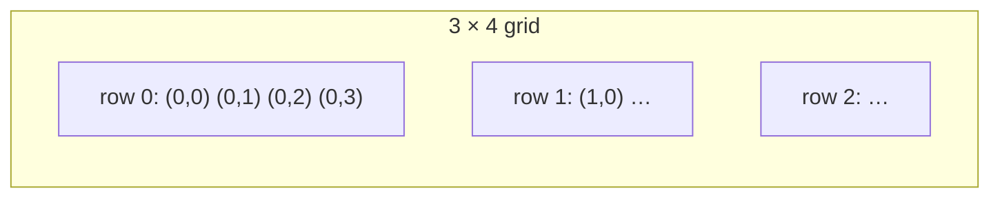
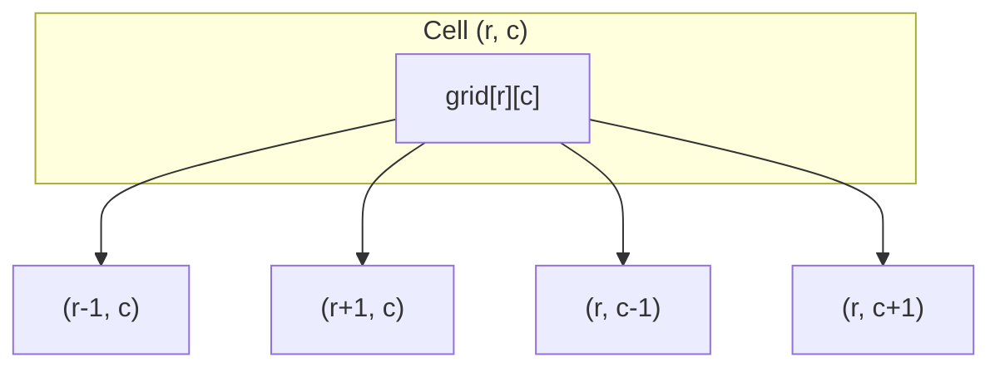

# 2D grids

A **2D grid** (matrix) is a rectangular table of values indexed by **row** and **column**. In Python you usually represent it as a **list of lists**: `grid[r][c]` is row `r`, column `c`.

| | |
| --- | --- |
| **What it is** | `rows × cols` cells; each cell holds a value (int, char, bool, object reference). |
| **Core operations** | Index read/write, row/column scan, neighbor access, full-grid traversal. |
| **When to use** | Image/board problems, spreadsheets, game boards, implicit graphs (cells = vertices). |
| **Trade-off** | O(1) random access per cell; full scan is O(rows × cols). |

This page is your **ready reference** for Python grids: safe creation, indexing, traversal patterns (including spiral and rotation), in-place tricks, and **grid-as-graph** DFS/BFS templates. For general graph theory and adjacency-list BFS/DFS, see [Graphs](../graphs/index.md). For Big-O notation, see [Complexity analysis](../../complexity/index.md).

[Parent: Data structures](../index.md)

---

## Practical applications

| Use case | Grid model | Typical pattern |
| --- | --- | --- |
| **Game board** | Cells = tiles; values = empty, wall, player | DFS/BFS reachability |
| **Spreadsheet / heatmap** | Rows × columns of numbers | Row/column aggregates, DP |
| **Image rotation** | Square `n × n` pixel matrix | Transpose + reverse |
| **Flood fill / islands** | `0` = water, `1` = land | Connected-component DFS |
| **Word search** | Letters in cells | DFS + backtracking |

Throughout: **R** = number of rows, **C** = number of columns, **N** = R × C cells.

---

## Creating grids in Python

### Safe empty grid (no aliasing)

The `[[]] * n` idiom shares one inner list across rows. Always use a list comprehension for independent rows — see also [Array-based lists](../array-based-lists/index.md).

```python
rows, cols = 3, 4
grid = [[0] * cols for _ in range(rows)]
grid[0][0] = 1
assert grid[1][0] == 0
```

| | |
| --- | --- |
| **Time** | O(R × C) to allocate |
| **Space** | O(R × C) |

### From existing data

```python
grid = [
 [1, 2, 3],
 [4, 5, 6],
]
rows, cols = len(grid), len(grid[0])
```

### Boolean / visited overlay

```python
visited = [[False] * cols for _ in range(rows)]
```

Use a `set` of `(r, c)` tuples when you only visit a sparse subset.

---

## Indexing and bounds

```python
def in_bounds(r, c, rows, cols):
    return 0 <= r < rows and 0 <= c < cols
```

| Access | Meaning | Time |
| --- | --- | --- |
| `grid[r][c]` | Row `r`, column `c` | O(1) |
| `grid[r]` | Entire row (a list) | O(1) to get reference |
| `len(grid)`, `len(grid[0])` | Rows and columns | O(1) |

**Convention:** `r` increases downward, `c` increases rightward (like reading order).



---

## Four-direction neighbors

Most grid graph problems use **orthogonal** moves (up, down, left, right):

```python
DIRS_4 = ((0, 1), (0, -1), (1, 0), (-1, 0))

def neighbors4(r, c, rows, cols):
 for dr, dc in DIRS_4:
 nr, nc = r + dr, c + dc
 if 0 <= nr < rows and 0 <= nc < cols:
 yield nr, nc
```

For **8-direction** (including diagonals), add `(-1,-1), (-1,1), (1,-1), (1,1)`.

| | |
| --- | --- |
| **Time per cell** | O(1) to O(4) or O(8) neighbor checks |
| **Full grid BFS/DFS** | O(R × C) |

---

## Traversal patterns

### Row-major scan (read every cell once)

```python
for r in range(rows):
    for c in range(cols):
        process(grid[r][c])
```

| | |
| --- | --- |
| **Time** | O(R × C) |
| **Space** | O(1) extra |

### Column-major scan

```python
for c in range(cols):
    for r in range(rows):
        process(grid[r][c])
```

### Spiral order (boundary shrinking)

Track `top`, `bottom`, `left`, `right`. Walk each side, then shrink the box.

```python
def spiral_order(grid):
    """
    Returns a list of the elements in the grid traversed in spiral order.

    Args:
        grid (List[List[Any]]): The 2D grid to traverse.

    Returns:
        List[Any]: Elements of grid in spiral order.
    """
    if not grid or not grid[0]:
        return []
    
    rows, cols = len(grid), len(grid[0])
    top, bottom, left, right = 0, rows - 1, 0, cols - 1
    out = []
    
    while top <= bottom and left <= right:
        # Traverse from left to right along the top row
        for c in range(left, right + 1):
            out.append(grid[top][c])
        top += 1

        # Traverse from top to bottom along the right column
        for r in range(top, bottom + 1):
            out.append(grid[r][right])
        right -= 1

        # Traverse from right to left along the bottom row, if still in bounds
        if top <= bottom:
            for c in range(right, left - 1, -1):
                out.append(grid[bottom][c])
            bottom -= 1

        # Traverse from bottom to top along the left column, if still in bounds
        if left <= right:
            for r in range(bottom, top - 1, -1):
                out.append(grid[r][left])
            left += 1

    return out
```

| | |
| --- | --- |
| **Time** | O(R × C) |
| **Space** | O(1) excluding output |

### Transpose (square or rectangular)

Swap `grid[r][c]` with `grid[c][r]` after building transposed dimensions for rectangular grids:

```python
def transpose(grid):
 return [list(row) for row in zip(*grid)]
```

### Rotate 90° clockwise (square, in-place)

1. Transpose the matrix.
2. Reverse each row.

```python
def rotate_90_clockwise(grid):
 n = len(grid)
 for r in range(n):
 for c in range(r + 1, n):
 grid[r][c], grid[c][r] = grid[c][r], grid[r][c]
 for row in grid:
 row.reverse()
```

| | |
| --- | --- |
| **Time** | O(n²) for n × n |
| **Space** | O(1) in-place |

---

## In-place modification tricks

### Mark visited by mutating the grid

When input values allow it (e.g. `'0'`/`'1'`, or negative sentinel), flip a cell to avoid a separate `visited` structure:

```python
def dfs_mark(grid, r, c):
 rows, cols = len(grid), len(grid[0])
 if not (0 <= r < rows and 0 <= c < cols) or grid[r][c] != "1":
 return
 grid[r][c] = "0" # visited / sunk
 for nr, nc in ((r + 1, c), (r - 1, c), (r, c + 1), (r, c - 1)):
 dfs_mark(grid, nr, nc)
```

### Use first row/column as flags

For “zero entire row/column” problems, store which rows/cols need clearing in row 0 and column 0 before applying updates — O(1) extra space beyond the grid.

---

## Grid as an implicit graph

Each cell `(r, c)` is a **vertex**. An edge exists to each in-bounds orthogonal neighbor. No adjacency list is required — neighbors are computed on the fly.



This is the same **BFS/DFS** idea as on [Graphs](../graphs/index.md), with **V = R × C** and **E ≈ 4V** for a full grid.

### DFS template (connected component)

```python
def count_components(grid):
 rows, cols = len(grid), len(grid[0])
 seen = set()

 def dfs(r, c):
 seen.add((r, c))
 for dr, dc in ((0, 1), (0, -1), (1, 0), (-1, 0)):
 nr, nc = r + dr, c + dc
 if 0 <= nr < rows and 0 <= nc < cols and (nr, nc) not in seen and grid[nr][nc] == "1":
 dfs(nr, nc)

 count = 0
 for r in range(rows):
 for c in range(cols):
 if grid[r][c] == "1" and (r, c) not in seen:
 dfs(r, c)
 count += 1
 return count
```

Recursive DFS matches [Recursion](../../recursion/index.md) and [Backtracking](../../algorithms/backtracking/index.md) when you must **undo** choices (e.g. word paths).

### BFS template (shortest steps on unweighted grid)

Use a [Deque](../dequeue-deque/index.md) for O(1) pops from the front:

```python
from collections import deque

def grid_bfs(grid, start, is_goal):
 rows, cols = len(grid), len(grid[0])
 sr, sc = start
 q = deque([(sr, sc, 0)])
 seen = {(sr, sc)}
 while q:
 r, c, dist = q.popleft()
 if is_goal(r, c):
 return dist
 for dr, dc in ((0, 1), (0, -1), (1, 0), (-1, 0)):
 nr, nc = r + dr, c + dc
 if 0 <= nr < rows and 0 <= nc < cols and (nr, nc) not in seen:
 seen.add((nr, nc))
 q.append((nr, nc, dist + 1))
 return -1
```

| | BFS on grid | DFS on grid |
| --- | --- | --- |
| **Time** | O(R × C) | O(R × C) |
| **Space** | O(R × C) queue + seen | O(R × C) stack/recursion + seen |
| **Best for** | Fewest steps / layers | Flood fill, exhaust paths with backtrack |

### Multi-source BFS

Seed the queue with **all** starting cells at distance 0 (e.g. every ocean-border cell), then run normal BFS — useful for “cells reachable from multiple sources.”

---

## Grid dynamic programming

When paths move only **right** and **down**, fill a DP table row by row:

```python
def unique_paths(rows, cols):
 dp = [[1] * cols for _ in range(rows)]
 for r in range(1, rows):
 for c in range(1, cols):
 dp[r][c] = dp[r - 1][c] + dp[r][c - 1]
 return dp[rows - 1][cols - 1]
```

See [Dynamic programming](../../algorithms/dynamic-programming/index.md) for recurrence design and space optimization.

---

## Complexity summary

| Operation / algorithm | Time | Space |
| --- | --- | --- |
| Allocate R × C grid | O(R × C) | O(R × C) |
| Read/write one cell | O(1) | O(1) |
| Full scan | O(R × C) | O(1) extra |
| BFS / DFS entire grid | O(R × C) | O(R × C) seen + frontier |
| Spiral / rotate n × n | O(n²) | O(1) in-place rotate |
| 2D DP fill | O(R × C) | O(R × C) table (often compressible) |

---

## Common pitfalls

| Pitfall | Why it hurts | Fix |
| --- | --- | --- |
| `[[0]*cols]*rows` | All rows alias same list | List comprehension per row |
| Row/column count mismatch | Jagged rows break `len(grid[0])` | Validate rectangular input |
| Off-by-one bounds | IndexError or silent skip | `0 <= r < rows` (not `<= rows`) |
| DFS without visited | Infinite loops on cycles | `seen` set or in-place mark |
| Confusing `(r,c)` vs `(x,y)` | Wrong neighbor direction | Pick one convention and stick to it |
| BFS with `list.pop(0)` | O(n) per pop | Use `collections.deque` |

---

## Related pages

| Page | Relationship |
| --- | --- |
| [Array-based lists](../array-based-lists/index.md) | 1D dynamic arrays; safe nested list creation |
| [Graphs](../graphs/index.md) | General BFS/DFS, adjacency representations |
| [Deque](../dequeue-deque/index.md) | BFS queue on grids |
| [Backtracking](../../algorithms/backtracking/index.md) | Path search with undo (word search, mazes) |
| [Dynamic programming](../../algorithms/dynamic-programming/index.md) | Grid DP, path counts, table filling |
| [Recursion](../../recursion/index.md) | Recursive DFS on cells |
| [Tries](../tries/index.md) | Prefix search combined with grid DFS |
| [Complexity analysis](../../complexity/index.md) | O(R × C) notation |

---

## Quick reference card

```python
rows, cols = len(grid), len(grid[0])
grid = [[0] * cols for _ in range(rows)]

DIRS_4 = ((0, 1), (0, -1), (1, 0), (-1, 0))
for r in range(rows):
 for c in range(cols):
 ...

# BFS: deque + seen set
# DFS: stack or recursion + seen / in-place mark
# Spiral: top, bottom, left, right boundaries
# Rotate 90° CW: transpose + reverse each row
```

Use a **2D grid** when the input is literally a board or matrix, or when modeling **spatial adjacency**. Use a general [Graph](../graphs/index.md) when vertices are arbitrary entities (users, services, states) not laid out in rows and columns.

---

## Next steps

1. Implement **count connected components** (`"1"`/`"0"`) with DFS and a `seen` set.
2. Implement **spiral order** and **rotate 90°** on paper before coding.
3. Read [Backtracking](../../algorithms/backtracking/index.md) for search that must **undo** cell choices.
4. Read [Dynamic programming](../../algorithms/dynamic-programming/index.md) for **unique paths** and other tabular recurrences.
