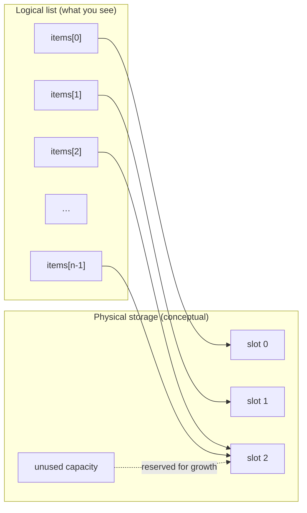
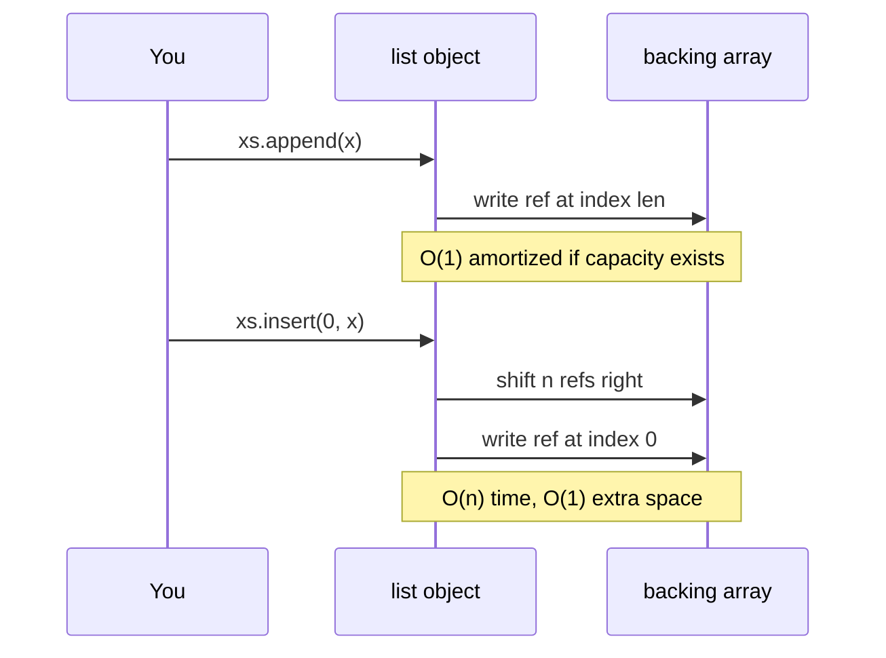
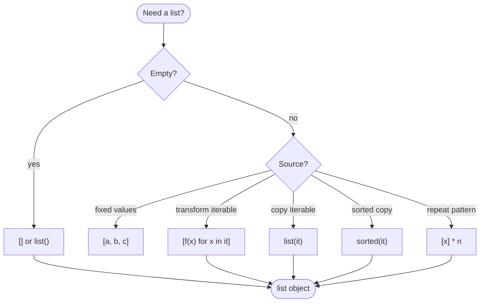
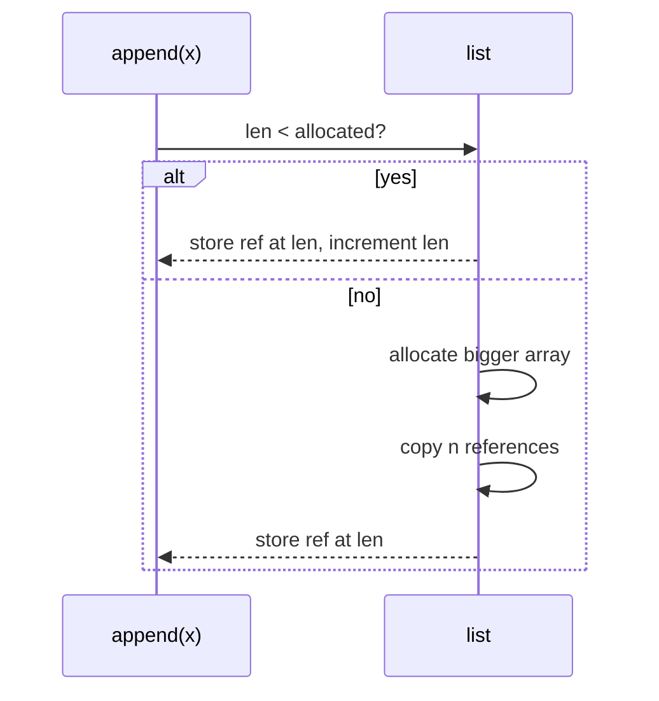
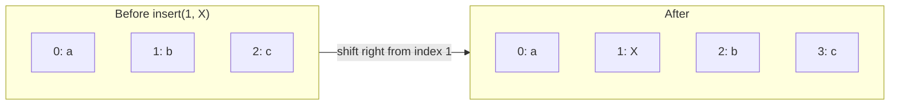
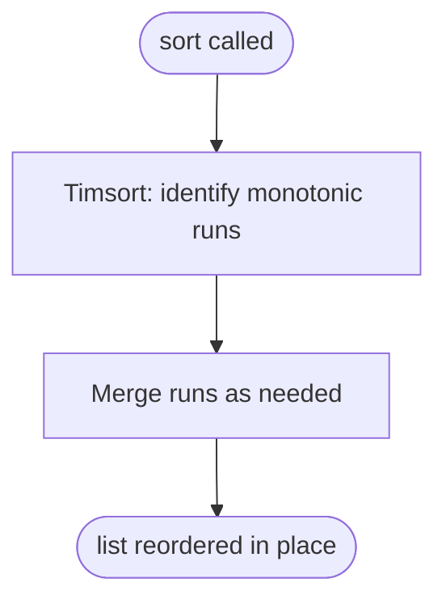
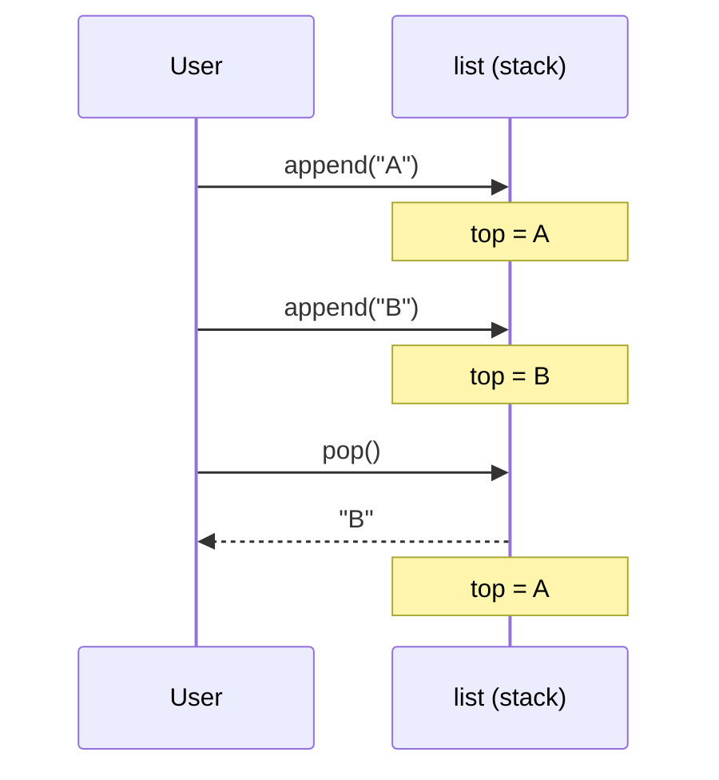
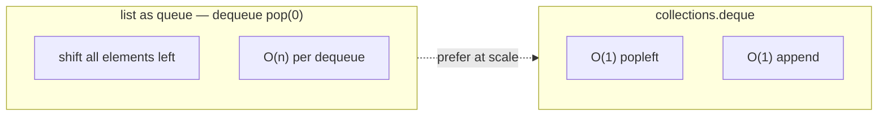

# Array-based lists

A list implemented with a **contiguous** block of memory (array), sometimes resized to grow or shrink. In Python, the built-in **`list`** is exactly this idea made practical: a **dynamic array** of object references that grows and shrinks as you use it.

| | |
| --- | --- |
| **What it is** | Elements are stored in index order in an array; the logical “list” is that sequence (static size or dynamic reallocation). |
| **Core operations** | O(1) access by index; append or insert may cost if resize or shift is needed. |
| **When to use** | You need fast random access, cache-friendly storage, and a well-understood list API. |
| **Trade-off** | Middle insert/delete may shift many elements; growth strategy affects amortized cost. |

This page is your **ready reference** for Python’s `list`: how it behaves under the hood, every common way to create one, every mutating and non-mutating operation, and the **time and space complexity** you should carry into interviews and design discussions. For notation (O, Ω, Θ, amortized), see [Complexity analysis](../../complexity/index.md).

[Parent: Data structures](../index.md)

---

## How Python’s `list` relates to an array-based list

You do not manage raw memory in Python. Instead, CPython stores a `list` as:

1. A **pointer array** (contiguous block of references to Python objects).
2. A **length** — how many slots are in use.
3. An **allocated capacity** — how many slots exist before the next resize.

When you `append`, Python usually writes into the next free slot in O(1) time. When the array is full, CPython allocates a **larger** array (historically over-allocating so future appends stay cheap), copies references over, and frees the old block. That occasional copy is why we say append is **amortized O(1)**, not worst-case O(1) every single time.



**Takeaway:** Random access by index is O(1) because the interpreter jumps straight to slot `i`. Inserting or deleting away from the end may move many references—that is the classic array-based trade-off.

---

## Mental model: three kinds of costs

| Kind | What you pay for | Typical `list` examples |
| --- | --- | --- |
| **Index / read** | One pointer hop | `xs[i]`, `xs[-1]` |
| **End growth** | One write, sometimes a full copy | `append`, `pop()` from end |
| **Middle change** | Shift references left or right | `insert`, `pop(i)`, `del xs[i]` |



Throughout this page, **n** means `len(xs)` unless stated otherwise. **k** means the size of another iterable you pass in.

---

## Ways to create a list

### 1. Empty list literal

The most common idiom for “I will fill this later.”

```python
xs= []
assert xs == []
```

| | |
| --- | --- |
| **Time** | O(1) |
| **Space** | O(1) auxiliary (empty list object; tiny initial over-allocation may exist in CPython) |

### 2. List literal with elements

```python
colors = ["red", "green", "blue"]
matrix = [[1, 2], [3, 4]]
```

| | |
| --- | --- |
| **Time** | O(n) for *n* elements (each element is stored) |
| **Space** | O(n) for the list and the references; objects themselves are separate |

### 3. `list()` constructor — no argument

Equivalent to `[]`; useful if the name `list` was shadowed.

```python
xs = list()
assert xs == []
```

| | |
| --- | --- |
| **Time** | O(1) |
| **Space** | O(1) auxiliary |

### 4. `list(iterable)` — copy from any iterable

Materializes every element into a new mutable sequence.

```python
from_chars = list("hi")
from_tuple = list((1, 2, 3))
from_range = list(range(4))
from_set = list({3, 1, 2})
from_dict = list({"a": 1, "b": 2})
from_keys = list({"a": 1}.keys())
from_values = list({"a": 1}.values())
from_items = list({"a": 1}.items())
```

| | |
| --- | --- |
| **Time** | O(k) where *k* is length of the iterable |
| **Space** | O(k) for the new list (references); does not duplicate immutable small ints interned by CPython, but still stores *k* references |

### 5. List comprehension

Compact loop that **builds** a list in one expression.

```python
squares = [x * x for x in range(6)]
evens = [x for x in range(10) if x % 2 == 0]
pairs = [(i, c) for i, c in enumerate("abc")]
```

| | |
| --- | --- |
| **Time** | O(k) output size; work per element is whatever the expression and filter cost |
| **Space** | O(k) for the result; temporaries from the expression may add constant or linear overhead per step |

Nested comprehensions read **left to right** like nested `for` loops:

```python
matrix = [[1, 2, 3], [4, 5, 6]]
flat = [cell for row in matrix for cell in row]
flat_alt = []
for row in matrix:
 for cell in row:
 flat_alt.append(cell)
```

### 6. Generator expression + `list()`

Lazy generator evaluated only when `list()` consumes it.

```python
big = list(x * x for x in range(1_000_000))
```

| | |
| --- | --- |
| **Time** | O(k) |
| **Space** | O(k) for final list; generator itself was O(1) while idle |

### 7. Replication (`*`)

```python
zeros = [0] * 5
rows = [[0] * 3] * 2
```

| | |
| --- | --- |
| **Time** | O(n) for length *n*; for nested lists, outer length only — inner list may be aliased |
| **Space** | O(n) references; aliasing can surprise you on mutation |

**Safe 2D grid:**

```python
grid = [[0] * 3 for _ in range(2)]
grid[0][0] = 1
assert grid[1][0] == 0
```

### 8. Unpacking into a new list

```python
head, *middle, tail = [1, 2, 3, 4, 5]
rest = [*range(3), *"ab", 99]
```

| | |
| --- | --- |
| **Time** | O(n) to traverse sources |
| **Space** | O(n) for the new list |

### 9. `sorted(iterable)` — new sorted list

Does not mutate the source; returns a **new** list.

```python
xs = [3, 1, 4]
ys = sorted(xs)
assert ys == [1, 3, 4] and xs == [3, 1, 4]
```

| | |
| --- | --- |
| **Time** | O(k log k) comparisons for *k* items (Timsort) |
| **Space** | O(k) for the new list |

### 10. Other helpers that return lists

```python
import copy

original = [[1], [2]]
shallow = copy.copy(original)
deep = copy.deepcopy(original)

reversed_list = list(reversed([1, 2, 3]))
```

| Operation | Time | Space |
| --- | --- | --- |
| `copy.copy(list)` | O(n) shallow | O(n) new outer list |
| `copy.deepcopy(list)` | O(n) plus size of nested graph | O(n) duplicated structure |
| `list(reversed(xs))` | O(n) | O(n) |

### Creation cheat sheet



---

## Indexing, slicing, and membership

### Indexing `xs[i]` and `xs[i] = value`

Valid indices: `0` … `len(xs)-1`, or negative from the end (`-1` is last).

```python
xs = [10, 20, 30, 40]
assert xs[0] == 10
assert xs[-1] == 40
xs[1] = 99
assert xs == [10, 99, 30, 40]
```

| | |
| --- | --- |
| **Time** | O(1) read or write |
| **Space** | O(1) auxiliary |

### Slicing `xs[start:stop:step]`

Creates a **new** list (shallow copy of the slice range).

```python
xs = [0, 1, 2, 3, 4, 5]
assert xs[1:4] == [1, 2, 3]
assert xs[:3] == [0, 1, 2]
assert xs[::2] == [0, 2, 4]
assert xs[::-1] == [5, 4, 3, 2, 1, 0]
```

| | |
| --- | --- |
| **Time** | O(k) where *k* is slice length |
| **Space** | O(k) for the new list |

### Slice assignment `xs[i:j] = iterable`

Can grow or shrink the list; may shift tail elements.

```python
xs = [1, 2, 3, 4, 5]
xs[1:4] = [20, 30]
assert xs == [1, 20, 30, 5]

xs[1:1] = [9, 8]
assert xs == [1, 9, 8, 20, 30, 5]

del xs[2:4]
assert xs == [1, 9, 30, 5]
```

| | |
| --- | --- |
| **Time** | O(n) in general (shifting + inserting *m* new items) |
| **Space** | O(1) auxiliary beyond stored elements |

### Membership `x in xs`

```python
xs = [1, 2, 3]
assert 2 in xs
assert 9 not in xs
```

| | |
| --- | --- |
| **Time** | O(n) linear scan |
| **Space** | O(1) |

### Concatenation and repetition

```python
a = [1, 2]
b = [3, 4]
assert a + b == [1, 2, 3, 4]
assert a * 3 == [1, 2, 1, 2, 1, 2]
```

| Operation | Time | Space |
| --- | --- | --- |
| `a + b` | O(len(a) + len(b)) | O(len(a) + len(b)) new list |
| `a * k` | O(len(a) · k) | O(len(a) · k) new list |

### Iteration

```python
total = 0
for x in xs:
 total += x
```

| | |
| --- | --- |
| **Time** | O(n) |
| **Space** | O(1) auxiliary |

---

## All `list` methods (mutating and querying)

Python lists expose **eleven** methods on the type. They always mutate **in place** except where the method only reads (`count`, `index`). None of the mutating methods return `self`; they return `None` (a common beginner trap).

```mermaid
flowchart TB
 subgraph mutate["Mutate in place"]
 append
 extend
 insert
 remove
 pop
 clear
 sort
 reverse
 end
 subgraph query["Read-only on self"]
 count
 index
 end
 subgraph copy["Shallow copy"]
 copy["copy()"]
 end
```

### `append(x)` — add one element at the end

```python
xs = [1, 2]
xs.append(3)
assert xs == [1, 2, 3]

xs.append([4, 5])
assert xs == [1, 2, 3, [4, 5]]
```

| | |
| --- | --- |
| **Time** | **Amortized** O(1); **worst** O(n) when resize copies all references |
| **Space** | O(1) auxiliary per call |



### `extend(iterable)` — add many elements at the end

Like repeated `append`, but implemented in C for speed.

```python
xs = [1, 2]
xs.extend([3, 4])
xs.extend((5, 6))
xs.extend("ab")
assert xs == [1, 2, 3, 4, 5, 6, "a", "b"]
```

| | |
| --- | --- |
| **Time** | O(k) for iterable length *k* (plus possible resize) |
| **Space** | O(1) auxiliary beyond new references |

**`append` vs `extend`:**

```python
a = [1, 2]
a.append([3, 4])
b = [1, 2]
b.extend([3, 4])
```

### `insert(i, x)` — insert before index `i`

Negative `i` counts from the end; out-of-range `i` clamps to ends.

```python
xs = [10, 30]
xs.insert(1, 20)
xs.insert(0, 5)
xs.insert(len(xs), 99)
```

| | |
| --- | --- |
| **Time** | O(n) — shift up to *n* references |
| **Space** | O(1) auxiliary |



### `remove(x)` — delete first equal element

Uses equality (`==`), not identity. Raises `ValueError` if missing.

```python
xs = [1, 2, 3, 2]
xs.remove(2)
assert xs == [1, 3, 2]
```

| | |
| --- | --- |
| **Time** | O(n) — scan plus shift |
| **Space** | O(1) |

### `pop([i])` — remove and return item

Default `i=-1` (last item); `pop(0)` is expensive on a list.

```python
xs = [10, 20, 30]
last = xs.pop()
assert last == 30 and xs == [10, 20]

first = xs.pop(0)
assert first == 10 and xs == [20]
```

| | |
| --- | --- |
| **Time** | O(1) for `pop()` at end; O(n) for `pop(0)` or middle index |
| **Space** | O(1) |

### `clear()` — remove all elements

```python
xs = [1, 2, 3]
xs.clear()
assert xs == []
```

| | |
| --- | --- |
| **Time** | O(n) — drops references so objects may be freed |
| **Space** | O(1) auxiliary |

Equivalent to `del xs[:]` but reads more clearly as “empty this list.”

### `index(x, start=0, stop=len)` — find first index

Raises `ValueError` if not found in the searched range.

```python
xs = [10, 20, 30, 20]
assert xs.index(20) == 1
assert xs.index(20, 2) == 3
```

| | |
| --- | --- |
| **Time** | O(n) |
| **Space** | O(1) |

### `count(x)` — count equal elements

```python
xs = [1, 2, 2, 3, 2]
assert xs.count(2) == 3
assert xs.count(9) == 0
```

| | |
| --- | --- |
| **Time** | O(n) |
| **Space** | O(1) |

### `sort(*, key=None, reverse=False)` — stable in-place sort

Mutates the list; returns `None`. Uses **Timsort** (efficient on partially ordered data).

```python
nums = [3, 1, 4, 1, 5]
nums.sort()
assert nums == [1, 1, 3, 4, 5]

words = ["banana", "pie", "Washington", "book"]
words.sort(key=str.lower)
assert words == ["banana", "book", "pie", "Washington"]

pairs = [(2, "b"), (1, "a"), (1, "c")]
pairs.sort(key=lambda t: (t[0], t[1]))
assert pairs == [(1, "a"), (1, "c"), (2, "b")]
```

| | |
| --- | --- |
| **Time** | O(n log n) comparisons in worst and average cases; best case can be O(n) on already-sorted data |
| **Space** | O(n) auxiliary in CPython’s Timsort merge pattern (not an in-place Θ(1) memory sort) |



**`sort` vs `sorted`:**

| | `list.sort()` | `sorted(list)` |
| --- | --- | --- |
| Returns | `None` | new `list` |
| Original | mutated | unchanged |
| Use when | you own the list and do not need the old order | you need a sorted copy |

### `reverse()` — reverse in place

```python
xs = [1, 2, 3]
xs.reverse()
assert xs == [3, 2, 1]
```

| | |
| --- | --- |
| **Time** | O(n) |
| **Space** | O(1) auxiliary |

Prefer `reversed(xs)` when you need an iterator without mutating.

### `copy()` — shallow copy

```python
xs = [1, [2, 3]]
ys = xs.copy()
assert ys == xs
ys.append(4)
assert xs == [1, [2, 3]]
ys[1].append(99)
assert xs[1] == [2, 3, 99]
```

| | |
| --- | --- |
| **Time** | O(n) |
| **Space** | O(n) for the new outer list |

Slice `xs[:]` or `list(xs)` behave similarly for shallow copies.

---

## `del` on lists

`del` is a statement, not a method, but it is part of everyday list work.

```python
xs = [0, 1, 2, 3, 4, 5]
del xs[0]
del xs[2:4]
del xs[:]
```

| Operation | Time | Space |
| --- | --- | --- |
| `del xs[i]` | O(n) | O(1) |
| `del xs[i:j]` | O(n) | O(1) |
| `del xs[:]` | O(n) | O(1) |
| `del name` | O(1) — unbinds variable only | O(1) |

---

## Built-in functions that take lists

| Function | Role | Time | Space |
| --- | --- | --- | --- |
| `len(xs)` | number of elements | O(1) | O(1) |
| `min(xs)` / `max(xs)` | extremum | O(n) | O(1) |
| `sum(xs, start=0)` | numeric total | O(n) | O(1) |
| `any(xs)` / `all(xs)` | short-circuit logic | O(n) worst case | O(1) |
| `sorted(xs, ...)` | new sorted list | O(n log n) | O(n) |
| `reversed(xs)` | iterator | O(1) to create | O(1) |
| `list(reversed(xs))` | materialized reverse | O(n) | O(n) |
| `enumerate(xs)` | index-value pairs | O(1) per step | O(1) |
| `zip(xs, ys, ...)` | parallel tuple stream | O(1) per step | O(1) |

```python
nums = [3, 1, 4, 1, 5]
assert len(nums) == 5
assert min(nums) == 1
assert max(nums) == 5
assert sum(nums) == 14
assert any(x > 4 for x in nums)
assert all(x > 0 for x in nums)

for i, value in enumerate(["a", "b"]):
 pass
```

---

## Using a list as a stack (LIFO)

**Push** with `append`; **pop** from the end with `pop()`.

```python
stack= []
stack.append("first")
stack.append("second")
top = stack.pop()
assert top == "second" and stack == ["first"]
```

| Operation | Time | Space |
| --- | --- | --- |
| push `append` | amortized O(1) | O(1) |
| pop `pop()` | O(1) | O(1) |



---

## Using a list as a queue (FIFO) — know the cost

**Enqueue** at end with `append` is fine. **Dequeue** from front with `pop(0)` is **O(n)** because every remaining element shifts down.

```python
q= []
q.append(1)
q.append(2)
front = q.pop(0)
```

For production FIFO queues, use `collections.deque` (O(1) at both ends). See [Dequeue (deque)](../dequeue-deque/index.md).



---

## Master complexity table

Let **n** = `len(xs)`, **k** = length of another iterable, **i** = index.

| Operation | Time | Space (auxiliary) | Notes |
| --- | --- | --- | --- |
| `[]`, `list()` | O(1) | O(1) | |
| `[...]`, `list(it)` | O(n) or O(k) | O(n) or O(k) | |
| `xs[i]` get/set | O(1) | O(1) | |
| `xs[i:j]` slice | O(j-i) | O(j-i) | new list |
| `x in xs` | O(n) | O(1) | |
| `+`, `*` | O(output) | O(output) | new list |
| `append` | amortized O(1) | O(1) | worst O(n) resize |
| `extend` | O(k) | O(1) | |
| `insert` | O(n) | O(1) | |
| `remove` | O(n) | O(1) | |
| `pop()` | O(1) | O(1) | end |
| `pop(0)`, `pop(i)` | O(n) | O(1) | |
| `clear`, `del xs[:]` | O(n) | O(1) | |
| `index`, `count` | O(n) | O(1) | |
| `sort` | O(n log n) | O(n) | Timsort |
| `reverse` | O(n) | O(1) | |
| `copy`, `[:]` | O(n) | O(n) | shallow |
| `sorted(xs)` | O(n log n) | O(n) | new list |
| `list comprehension` | O(output) | O(output) | |
| `for x in xs` | O(n) | O(1) | |

---

## Patterns you will use constantly

### Build a list in a loop vs comprehension

```python
result = []
for x in range(5):
 if x % 2 == 0:
 result.append(x * 10)

result2 = [x * 10 for x in range(5) if x % 2 == 0]
assert result == result2 == [0, 20, 40]
```

### Filter while copying

```python
nums = [1, 2, 3, 4, 5]
evens = [x for x in nums if x % 2 == 0]
nums[:] = [x for x in nums if x % 2 == 0]
```

| Pattern | Time | Space |
| --- | --- | --- |
| new list comprehension | O(n) | O(n) output |
| in-place `nums[:]=...` | O(n) | O(n) temporary if RHS is new list |

### Deduplicate while preserving order

```python
def unique_keep_order(items):
 seen = set()
 out = []
 for x in items:
 if x not in seen:
 seen.add(x)
 out.append(x)
 return out
```

| | |
| --- | --- |
| **Time** | O(n) average with hashable items |
| **Space** | O(n) for `seen` and output |

### Binary search needs a sorted sequence

Lists do not stay sorted unless you sort them. After `sort()` or if you know order:

```python
import bisect

xs = [1, 3, 5, 7]
i = bisect.bisect_left(xs, 5)
assert i == 2
```

| | |
| --- | --- |
| **Time** | O(log n) search; insert with `bisect.insort` is O(n) due to shifting |
| **Space** | O(1) for search |

---

## Common pitfalls (and what to do instead)

| Pitfall | Why it hurts | Better approach |
| --- | --- | --- |
| `xs = xs.sort()` | `sort` returns `None` | `xs.sort()` alone, or `xs = sorted(xs)` |
| `[[0]*n]*m` | shared inner lists | `[[0]*n for _ in range(m)]` |
| `pop(0)` in a tight loop | O(n²) total | `collections.deque` |
| Huge `insert(0, x)` loop | O(n²) | append + reverse, or deque |
| Aliasing via shallow copy | mutating inner object affects both | `copy.deepcopy` when needed |
| Using `list` as set | `in` is O(n) | `set` for membership |

---

## How this fits the rest of the guide

- **Abstract dynamic array** — this page; Python’s `list` is the concrete instance.
- **Linked list** — O(1) head insert, O(n) index access; opposite trade-offs. See [Linked list](../linked-list/index.md).
- **Stack / queue ADTs** — [Stacks](../stacks/index.md), [Queue](../queue/index.md), [Deque](../dequeue-deque/index.md).
- **Complexity notation** — [Complexity analysis](../../complexity/index.md).

Official reference: [Built-in Types — list](https://docs.python.org/3/library/stdtypes.html#list) and [Tutorial — More on Lists](https://docs.python.org/3/tutorial/datastructures.html#more-on-lists).

---

## Quick reference card

```python
xs= []
xs = list(iterable)
xs = [f(x) for x in iterable if cond]

xs.append(x); xs.extend(it); xs.pop()

xs.insert(i, x); xs.remove(x); del xs[i]

xs.sort(key=None, reverse=False); xs.reverse()
ys = sorted(xs)

i = xs.index(x); c = xs.count(x)

ys = xs.copy()
```

Keep this page open when you implement algorithms: choose operations that match the complexity you can afford, and reach for `deque`, `set`, or `bisect` when the list alone is the wrong tool.
