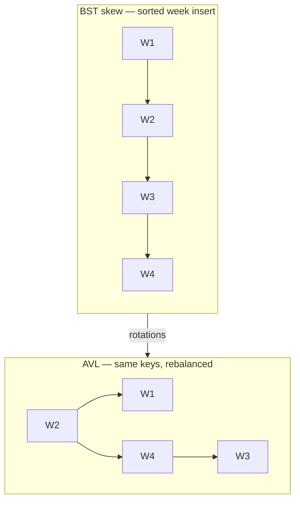
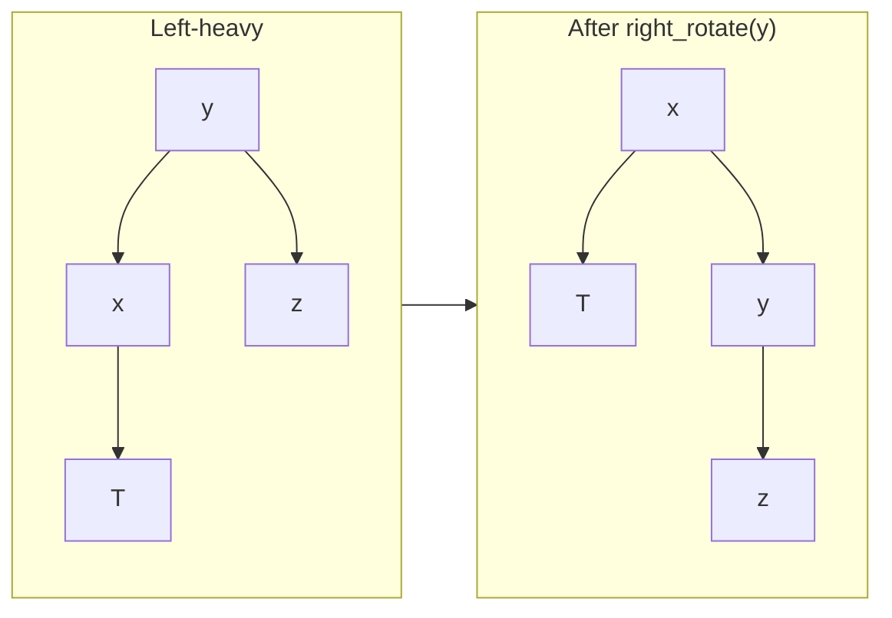
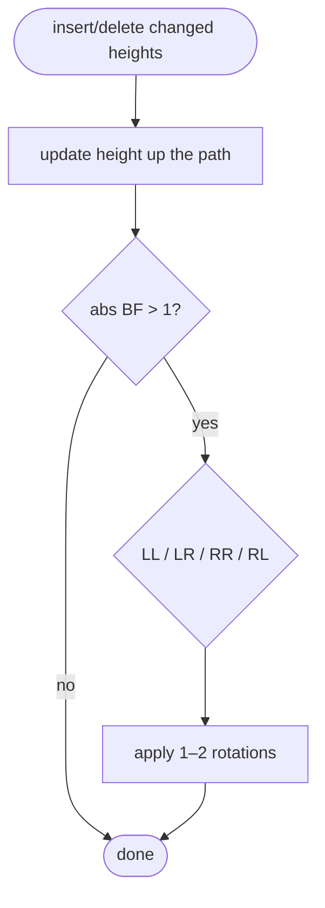
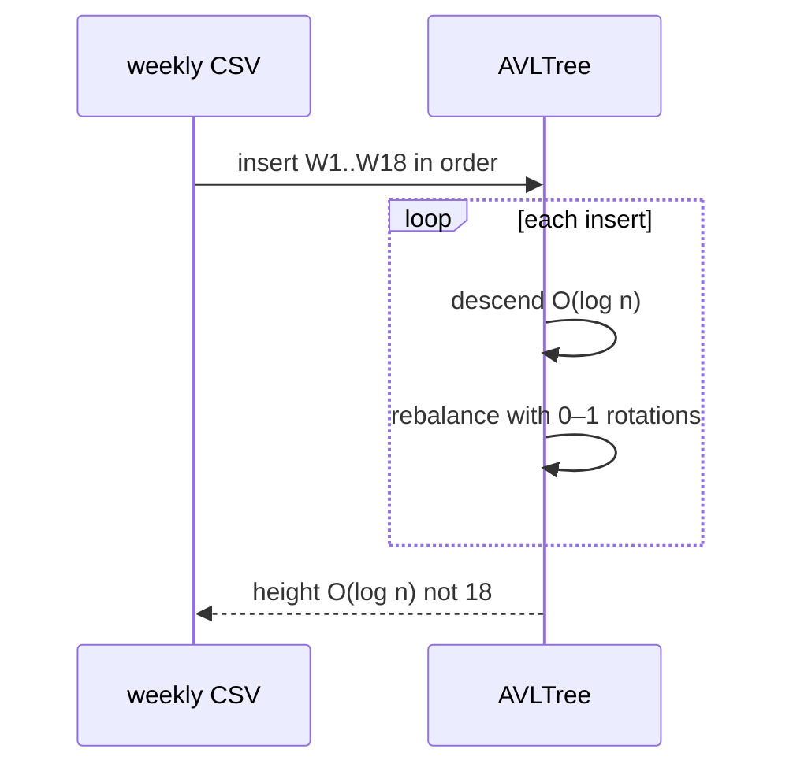
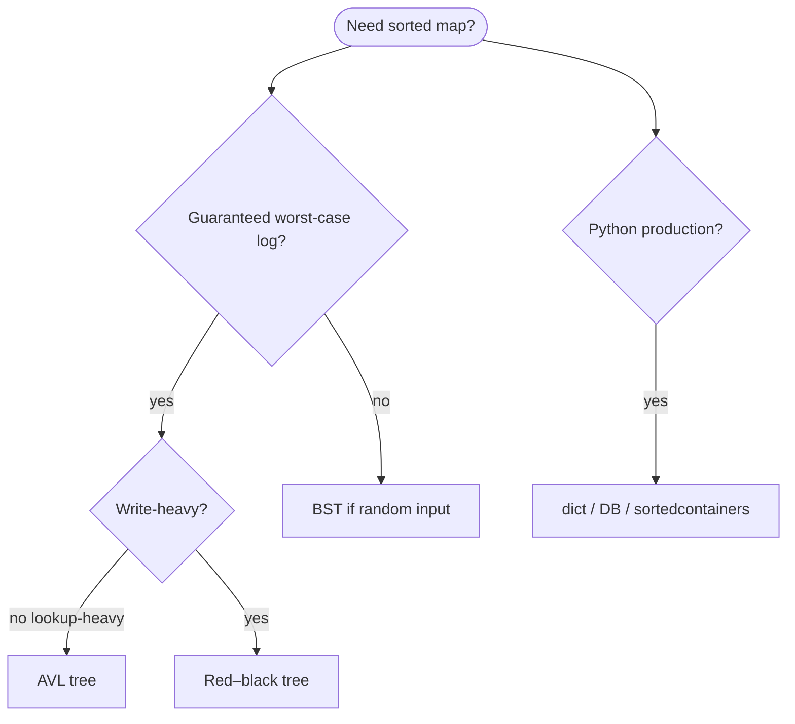

# AVL tree

A **self-balancing binary search tree** where the **height difference** (balance factor) between left and right subtrees is at most **1** at every node. After each insert or delete, **rotations** restore that invariant so height stays **O(log n)**—guaranteed fast lookup even when NFL stats arrive **sorted by week** or **player ID**.

| | |
| --- | --- |
| **What it is** | A [BST](../binary-search-tree/index.md) plus balance factors in {−1, 0, +1} and single/double rotations on violation. |
| **Core operations** | Same as BST—`search`, `insert`, `delete`, traversals—with **O(log n)** worst case. |
| **Balance factor** | `height(left) − height(right)`; must be −1, 0, or +1. |
| **When to use** | Teaching strict balancing; guaranteed log height when plain BST would skew. |
| **Trade-off** | More bookkeeping and rotations than [red–black](../red-black-tree/index.md); stricter balance → slightly fewer compares on lookup, more work on write. |

In **NFL data analysis**, an AVL tree models a **live stat board** that stays balanced as you ingest `(week, player_id, yards)` in **chronological or alphabetical order**—the case that breaks a plain BST. Use it to understand **rotations** before [red–black trees](../red-black-tree/index.md) (used in many language runtimes). For production Python, you still reach for **`dict`**, **pandas**, or **`sortedcontainers`**; AVL is for **learning and interviews**.

This page is your **ready reference**: balance factors, rotations, full Python implementation, NFL examples, and complexity per operation. For Big-O notation, see [Complexity analysis](../../complexity/index.md).

[Parent: Data structures](../index.md)

---

## How an AVL tree fits NFL-shaped problems

| NFL idea | AVL view | Why balance matters |
| --- | --- | --- |
| **Weekly yards feed** | Insert `(week, yards, player)` in week order | Plain BST becomes a chain; AVL stays log |
| **Injury list by priority + id** | Ordered key; frequent insert/remove | O(log n) guaranteed each update |
| **Season-long fantasy rank** | Inorder = sorted; height log | Predictable latency on gameday |
| **Merge two team rosters** | Inorder merge of two AVLs | O(n + m) walk if both balanced |

**Use pandas** for batch season stats. **Use AVL** when you implement **ordered maps** yourself or need to **explain rotations** on a whiteboard.



Throughout this page, **n** = nodes, **h** = O(log n) guaranteed.

---

## AVL vs BST vs red–black vs Python

| | **AVL** | [BST](../binary-search-tree/index.md) | [Red–black](../red-black-tree/index.md) | **`dict`** |
| --- | --- | --- | --- | --- |
| **Search** | O(log n) | O(h) | O(log n) | O(1) avg |
| **Insert/delete** | O(log n), more rotations | O(h) | O(log n), fewer rotations | O(1) avg |
| **Balance** | Stricter (BF ∈ {−1,0,1}) | None | Relaxed via color rules | N/A |
| **Lookup-heavy** | Slightly favored | Skew risk | Industry default for maps | Hash, unordered |
| **NFL teaching** | Rotation drills | Baseline invariant | “Why not RB in Python dict” | `player_id` lookup |

!!! note "Python `dict` uses hashing, not AVL"
    CPython **`dict`** is a **hash table** (open addressing with perturbation). It does **not** keep keys in sorted order by comparison. For sorted maps in Python ecosystems, see **`sortedcontainers`**, **`bisect`** on a list, or databases with indexes.

---

## Node definition

Store **key**, **height** (or balance factor), **left**, **right**.

```python
from __future__ import annotations

from dataclasses import dataclass
from typing import Any, Iterator


@dataclass(frozen=True, order=True)
class WeekStat:
    week: int
    player_id: str
    yards: int = 0


@dataclass
class AVLNode:
    key: Any
    height: int = 1
    left: AVLNode | None = None
    right: AVLNode | None = None
```

| | |
| --- | --- |
| **Time** | O(1) per node |
| **Space** | O(1) per node (+ height int) |

---

## Rotations (the core mechanic)

### Right rotation (fix left-heavy)

When left subtree is too tall (**LL** or **LR** case after rebalance at child).



```python
def _height(node: AVLNode | None) -> int:
    return 0 if node is None else node.height


def _update_height(node: AVLNode) -> None:
    node.height = 1 + max(_height(node.left), _height(node.right))


def _balance_factor(node: AVLNode) -> int:
    return _height(node.left) - _height(node.right)


def _right_rotate(y: AVLNode) -> AVLNode:
    x = y.left
    assert x is not None
    t2 = x.right
    x.right = y
    y.left = t2
    _update_height(y)
    _update_height(x)
    return x


def _left_rotate(x: AVLNode) -> AVLNode:
    y = x.right
    assert y is not None
    t2 = y.left
    y.left = x
    x.right = t2
    _update_height(x)
    _update_height(y)
    return y
```

| | |
| --- | --- |
| **Time** | O(1) per rotation |
| **Space** | O(1) |

### Rebalance after insert/delete

Four cases from balance factor at node **z**:

| Case | Shape | Fix |
| --- | --- | --- |
| **LL** | BF(z) = +2, BF(left) ≥ 0 | Right rotate z |
| **LR** | BF(z) = +2, BF(left) < 0 | Left rotate left child, then right rotate z |
| **RR** | BF(z) = −2, BF(right) ≤ 0 | Left rotate z |
| **RL** | BF(z) = −2, BF(right) > 0 | Right rotate right child, then left rotate z |



```python
def _rebalance(node: AVLNode) -> AVLNode:
    _update_height(node)
    bf = _balance_factor(node)
    if bf > 1:
        assert node.left is not None
        if _balance_factor(node.left) < 0:
            node.left = _left_rotate(node.left)
        return _right_rotate(node)
    if bf < -1:
        assert node.right is not None
        if _balance_factor(node.right) > 0:
            node.right = _right_rotate(node.right)
        return _left_rotate(node)
    return node
```

| | |
| --- | --- |
| **Time** | O(1) at each level; O(log n) along path |
| **Space** | O(1) |

---

## Ways to create an AVL tree

### 1. Empty tree

```python
class AVLTree:
    def __init__(self) -> None:
        self.root: AVLNode | None = None
        self._size = 0

tree = AVLTree()
```

| | |
| --- | --- |
| **Time** | O(1) |
| **Space** | O(1) |

### 2. Insert sorted weeks — stays O(log n) per insert

Unlike plain BST, inserting weeks 1…18 in order keeps height logarithmic.

```python
tree = AVLTree()
for w in range(1, 19):
    tree.insert(WeekStat(w, f"P{w}", w * 10))
assert tree.height() <= 6  # ~ log2(18)
```

| | |
| --- | --- |
| **Time** | O(n log n) total |
| **Space** | O(n) |

---

## Full implementation: `AVLTree`

```python
class AVLTree:
    def __init__(self) -> None:
        self.root: AVLNode | None = None
        self._size = 0

    def __len__(self) -> int:
        return self._size

    def is_empty(self) -> bool:
        return self.root is None

    def height(self) -> int:
        return _height(self.root)

    def search(self, key: Any) -> AVLNode | None:
        cur = self.root
        while cur is not None:
            if key == cur.key:
                return cur
            cur = cur.left if key < cur.key else cur.right
        return None

    def contains(self, key: Any) -> bool:
        return self.search(key) is not None

    def insert(self, key: Any) -> None:
        self.insert_strict(key)

    def insert_strict(self, key: Any) -> bool:
        """Insert only if key absent; return whether inserted."""
        before = self._size
        self.root = self._insert_rec_strict(self.root, key)
        return self._size > before

    def _insert_rec_strict(self, node: AVLNode | None, key: Any) -> AVLNode:
        if node is None:
            self._size += 1
            return AVLNode(key)
        if key < node.key:
            node.left = self._insert_rec_strict(node.left, key)
        elif key > node.key:
            node.right = self._insert_rec_strict(node.right, key)
        return _rebalance(node)

    def delete(self, key: Any) -> bool:
        self.root, deleted = self._delete_rec(self.root, key)
        if deleted:
            self._size -= 1
        return deleted

    def _delete_rec(
        self, node: AVLNode | None, key: Any
    ) -> tuple[AVLNode | None, bool]:
        if node is None:
            return None, False
        if key < node.key:
            node.left, deleted = self._delete_rec(node.left, key)
        elif key > node.key:
            node.right, deleted = self._delete_rec(node.right, key)
        else:
            if node.left is None:
                return node.right, True
            if node.right is None:
                return node.left, True
            succ = self._min_node(node.right)
            node.key = succ.key
            node.right, _ = self._delete_rec(node.right, succ.key)
            deleted = True
        if node is None:
            return None, deleted
        return _rebalance(node), deleted

    def _min_node(self, node: AVLNode) -> AVLNode:
        while node.left is not None:
            node = node.left
        return node

    def inorder(self) -> list[Any]:
        out: list[Any] = []
        self._inorder_rec(self.root, out)
        return out

    def _inorder_rec(self, node: AVLNode | None, out: list[Any]) -> None:
        if node is None:
            return
        self._inorder_rec(node.left, out)
        out.append(node.key)
        self._inorder_rec(node.right, out)

    def inorder_iter(self) -> Iterator[Any]:
        stack: list[AVLNode] = []
        cur = self.root
        while stack or cur is not None:
            while cur is not None:
                stack.append(cur)
                cur = cur.left
            cur = stack.pop()
            yield cur.key
            cur = cur.right
```

| | |
| --- | --- |
| **Insert/delete path** | O(log n) |
| **Space** | O(n) tree + O(log n) stack |

---

## Operations with NFL examples

### Insert weekly stats in sorted order

```python
tree = AVLTree()
for week in range(1, 19):
    tree.insert_strict(WeekStat(week, "QB01", week * 25))
assert len(tree) == 18
assert tree.height() <= 6
ordered_weeks = [k.week for k in tree.inorder()]
assert ordered_weeks == list(range(1, 19))
```

| | |
| --- | --- |
| **Time** | O(log n) per insert |
| **Space** | O(1) aux per level |



---

### Search / delete — drop player week after trade

```python
tree = AVLTree()
for w in [3, 1, 4, 2, 5]:
    tree.insert_strict(WeekStat(w, "RB07", w * 40))

assert tree.contains(WeekStat(4, "RB07"))
tree.delete(WeekStat(4, "RB07"))
assert not tree.contains(WeekStat(4, "RB07"))
assert [k.week for k in tree.inorder()] == [1, 2, 3, 5]
```

| | |
| --- | --- |
| **Time** | O(log n) |
| **Space** | O(log n) recursion |

---

### Inorder — chronological week report

Same as BST: **inorder** yields sorted keys.

```python
tree = AVLTree()
stats = [WeekStat(5, "A", 90), WeekStat(2, "B", 110), WeekStat(8, "C", 70)]
for s in stats:
    tree.insert_strict(s)
for s in tree.inorder_iter():
    print(f"Week {s.week}: {s.yards} yards")
```

| | |
| --- | --- |
| **Time** | O(n) |
| **Space** | O(h) = O(log n) stack |

---

## NFL application: balanced live yards index

```python
class WeeklyYardsIndex:
    def __init__(self) -> None:
        self._tree = AVLTree()

    def record(self, week: int, player_id: str, yards: int) -> None:
        self._tree.insert_strict(WeekStat(week, player_id, yards))

    def weeks_for_player(self, player_id: str) -> list[WeekStat]:
        return [k for k in self._tree.inorder() if k.player_id == player_id]

    def report_through_week(self, max_week: int) -> list[WeekStat]:
        return [k for k in self._tree.inorder() if k.week <= max_week]


idx = WeeklyYardsIndex()
for w in range(1, 11):
    idx.record(w, "WR10", w * 8)
through = idx.report_through_week(5)
assert len(through) == 5
assert idx._tree.height() <= 5
```

| Operation | Time | Space |
| --- | --- | --- |
| `record` | O(log n) | O(1) |
| `report_through_week` | O(n) scan | O(output) |

---

## AVL vs red–black (when teaching)

| | **AVL** | **Red–black** |
| --- | --- | --- |
| Balance | Stricter | Looser |
| Rotations on insert | Often more | Often fewer |
| Lookup | Fewer compares (shorter) | Slightly more |
| Typical use | Databases (some), teaching | `std::map`, Java `TreeMap` |
| NFL analogy | Precise injury priority queue with strict fairness | High-volume schedule index |

---

## Master complexity table

| Operation | Time | Space (aux) | Notes |
| --- | --- | --- | --- |
| Create empty | O(1) | O(1) | |
| Search | O(log n) | O(1) | |
| Insert | O(log n) | O(log n) stack | ≤ 2 rotations |
| Delete | O(log n) | O(log n) stack | |
| Inorder | O(n) | O(log n) | |
| Height query | O(1) cached at root | O(1) | |
| Rotations | O(1) each | O(1) | |
| Storage | — | O(n) | |

---

## When to pick which structure



---

## Common pitfalls

| Pitfall | Why it hurts | Fix |
| --- | --- | --- |
| Forgetting `_update_height` before BF | Wrong rotation case | Update bottom-up after child change |
| Wrong rotation order in LR/RL | Still unbalanced | Rotate **child** first, then **parent** |
| Using height 0 vs −1 for empty | Off-by-one BF | Be consistent with `_height(None)` |
| Duplicate key policy unclear | Silent skip vs overwrite | Document `insert_strict` |
| Expecting AVL in `dict` | Wrong mental model | Hash table; see [hash table](../hash-table/index.md) |

---

## Related pages

| Page | Relationship |
| --- | --- |
| [Binary search tree](../binary-search-tree/index.md) | Base invariant without balance |
| [Red–black tree](../red-black-tree/index.md) | Looser balance; library maps |
| [2-3-4 tree](../2-3-4-tree/index.md) | B-tree family; LLRB isomorphism |
| [Complexity analysis](../../complexity/index.md) | Big-O |
| [Data structures hub](../index.md) | Index |

---

## Quick reference card

```python
tree = AVLTree()
tree.insert_strict(WeekStat(3, "QB01", 280))
tree.search(WeekStat(3, "QB01"))
tree.delete(WeekStat(3, "QB01"))
list(tree.inorder_iter())  # sorted by week, player_id
tree.height()              # O(log n) guaranteed
# Rotations: _right_rotate, _left_rotate, _rebalance on BF ∉ {−1,0,1}
```

An **AVL tree** is a **BST with strict height balance**—master **rotations** here, then compare with **[red–black](../red-black-tree/index.md)** for the trade-offs real map implementations make.
