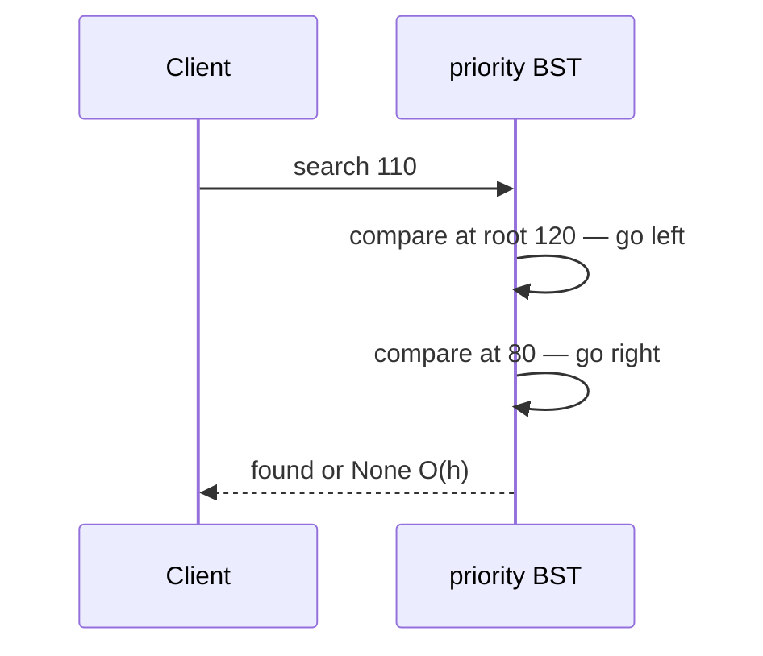
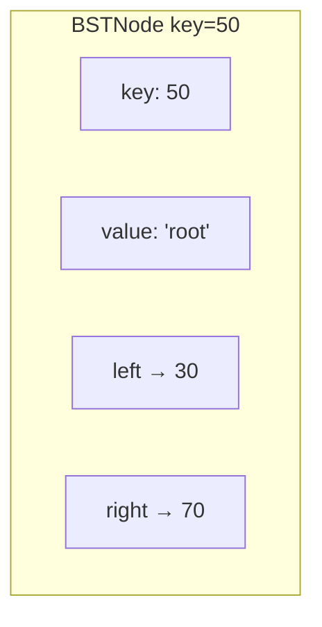
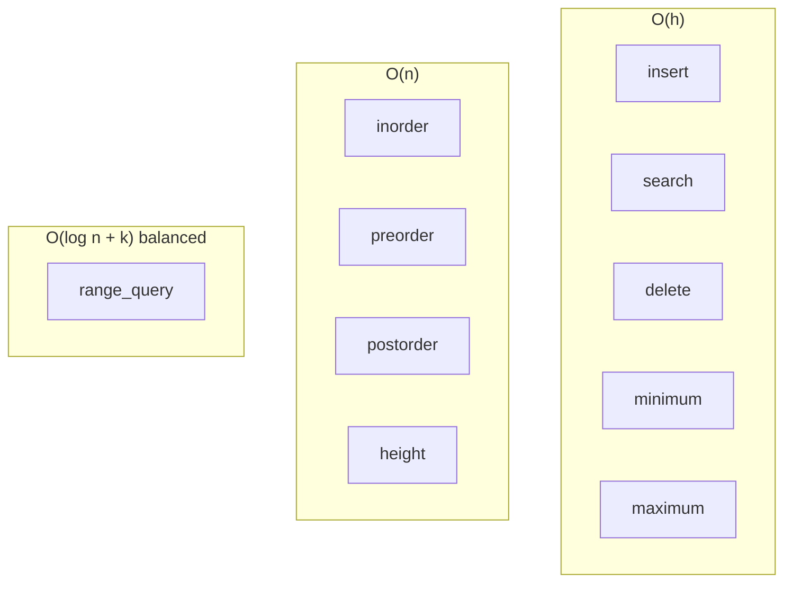
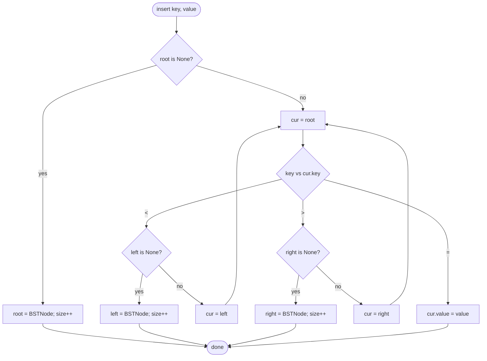
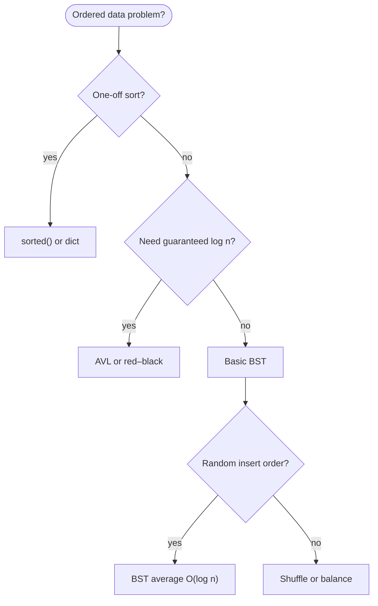

# Binary search tree

A **binary search tree** (BST) is a tree where each node holds one **key**, everything in the **left** subtree is smaller, and everything in the **right** subtree is bigger. That ordering lets you find, add, or remove items by halving the search space at each step—like flipping to the right half of a phone book.

| | |
| --- | --- |
| **What it is** | Each node stores a key (and optional value); left child keys are smaller, right child keys are larger. |
| **Core operations** | Insert, search, delete, sorted walk (inorder), min/max, range query. |
| **When to use** | Online sorted data: scoreboards, schedulers, symbol tables, anything needing “next bigger” or “all in a range”. |
| **Trade-off** | Simple to code, but unbalanced insert order can make the tree tall and slow—see [AVL](../avl-tree/index.md) and [red–black](../red-black-tree/index.md) trees for self-balancing variants. |

BSTs are a stepping stone for ordered maps and interview tree problems. For one-off bulk sorting, Python’s `sorted()` or a database index is usually simpler.

This page is your **ready reference**: the canonical [`BST` implementation](../examples/trees/bst/bst.py), every operation with step-by-step walkthroughs, complexity tables, pitfalls, and when `dict` beats BST. For Big-O notation, see [Complexity analysis](../../complexity/index.md).

[Parent: Data structures](../index.md)

---

## BST vs other options

| | **Simple BST** | [AVL tree](../avl-tree/index.md) | [Red–black tree](../red-black-tree/index.md) | **`dict` / `set`** | **`sorted()` / SQL** |
| --- | --- | --- | --- | --- | --- |
| **Search** | O(h) | O(log n) | O(log n) | O(1) avg | O(log n) on sorted list |
| **Insert** | O(h) | O(log n) | O(log n) | O(1) avg | O(n) to resort |
| **Sorted walk** | Yes (inorder) | Yes | Yes | No | Already sorted |
| **Best fit** | Learning, small online data | Large changing sorted data | Library-grade maps | Exact ID lookup | One-off sort |

!!! note "Python `dict` is not a BST"
    Built-in **dict** and **set** use hash tables. Lookup is fast, but keys are not kept in sort order. Since Python 3.7, dicts remember insertion order—not numeric or lexicographic order.



**n** = number of nodes. **h** = tree height (longest root-to-leaf path in edges).

---

## What a BST node stores

Each node holds a sortable **key**, an optional **value** payload, and links to left and right children.

```python
class BSTNode:
    def __init__(self, key, value, left=None, right=None):
        self.key = key
        self.value = value
        self.left = left
        self.right = right
```

| Field | Role |
| --- | --- |
| `key` | Sort key used for comparisons and tree placement |
| `value` | Payload returned by `search` (record label, object reference, etc.) |
| `left` | Subtree of keys **strictly less** than this node’s key |
| `right` | Subtree of keys **strictly greater** than this node’s key |



Duplicate keys: this implementation **updates `value`** on re-insert rather than storing two nodes with the same key.

---

## Ways to create a BST in Python

### 1. Empty `BST` class

```python
class BST:
    def __init__(self):
        self.root = None
        self._size = 0

tree = BST()
assert tree.is_empty()
```

| | |
| --- | --- |
| **Time** | O(1) |
| **Space** | O(1) |

### 2. Insert keys one at a time

Insert order shapes the tree. Random order tends toward balance; sorted order produces a stick.

```python
tree = BST()
for key in [50, 30, 70, 20, 40]:
    tree.insert(key, f"node-{key}")
```

| | |
| --- | --- |
| **Time** | O(n h) total; O(h) per insert |
| **Space** | O(n) nodes |

### 3. Build from a list helper

```python
tree = BST()
tree.from_list([50, 30, 70, 20, 40])  # each element is both key and value
```

### 4. Sorted insert (worst case height)

```python
tree = BST()
for i in range(10):
    tree.insert(i * 10, i * 10)
# height == 9 — a linked-list-shaped tree
```

Shuffle keys before bulk insert if you want average O(log n) height without a balancing tree.

---

## Reference implementation: `BST` with full API

Canonical source: [`examples/trees/bst/bst.py`](../examples/trees/bst/bst.py).

Re-inserting an existing key updates `value` without changing `_size`.

```python
class BSTNode:
    def __init__(self, key, value, left=None, right=None):
        self.key = key
        self.value = value
        self.left = left
        self.right = right


class BST:
    def __init__(self):
        self.root = None
        self._size = 0

    def __len__(self):
        return self._size

    def __iter__(self):
        return self.inorder_iter()

    def __str__(self):
        return str(self.to_list())

    def __repr__(self):
        return f"BST({self.to_list()})"

    def __eq__(self, other):
        return self.to_list() == other.to_list()

    def __ne__(self, other):
        return self.to_list() != other.to_list()

    def __lt__(self, other):
        return self.to_list() < other.to_list()

    def __gt__(self, other):
        return self.to_list() > other.to_list()

    def __le__(self, other):
        return self.to_list() <= other.to_list()

    def __ge__(self, other):
        return self.to_list() >= other.to_list()

    def __hash__(self):
        return hash(tuple(self.to_list()))

    def is_empty(self):
        return self.root is None

    def insert(self, key, value):
        if self.root is None:
            self.root = BSTNode(key, value)
            self._size += 1
            return
        cur = self.root
        while cur is not None:
            if key < cur.key:
                if cur.left is None:
                    cur.left = BSTNode(key, value)
                    self._size += 1
                    return
                cur = cur.left
            elif key > cur.key:
                if cur.right is None:
                    cur.right = BSTNode(key, value)
                    self._size += 1
                    return
                cur = cur.right
            else:
                cur.value = value
                return

    def search(self, key):
        cur = self.root
        while cur is not None:
            if key == cur.key:
                return cur
            cur = cur.left if key < cur.key else cur.right
        return None

    def contains(self, key):
        return self.search(key) is not None

    def delete(self, key):
        self.root, deleted = self._delete_rec(self.root, key)
        if deleted:
            self._size -= 1
        return deleted

    def _delete_rec(self, node, key):
        if node is None:
            return None, False
        if key < node.key:
            node.left, deleted = self._delete_rec(node.left, key)
            return node, deleted
        if key > node.key:
            node.right, deleted = self._delete_rec(node.right, key)
            return node, deleted
        if node.left is None:
            return node.right, True
        if node.right is None:
            return node.left, True
        succ = self._min_node(node.right)
        node.key = succ.key
        node.value = succ.value
        node.right, _ = self._delete_rec(node.right, succ.key)
        return node, True

    def clear(self):
        self.root = None
        self._size = 0

    def _min_node(self, node):
        while node is not None and node.left is not None:
            node = node.left
        return node

    def _max_node(self, node):
        while node is not None and node.right is not None:
            node = node.right
        return node

    def minimum(self):
        if self.root is None:
            return None
        return self._min_node(self.root)

    def maximum(self):
        if self.root is None:
            return None
        return self._max_node(self.root)

    def inorder(self):
        out = []
        self._inorder_rec(self.root, out)
        return out

    def _inorder_rec(self, node, out):
        if node is None:
            return
        self._inorder_rec(node.left, out)
        out.append(node.key)
        self._inorder_rec(node.right, out)

    def preorder(self):
        out = []
        self._preorder_rec(self.root, out)
        return out

    def _preorder_rec(self, node, out):
        if node is None:
            return
        out.append(node.key)
        self._preorder_rec(node.left, out)
        self._preorder_rec(node.right, out)

    def postorder(self):
        out = []
        self._postorder_rec(self.root, out)
        return out

    def _postorder_rec(self, node, out):
        if node is None:
            return
        self._postorder_rec(node.left, out)
        self._postorder_rec(node.right, out)
        out.append(node.key)

    def inorder_iter(self):
        stack = []
        cur = self.root
        while stack or cur is not None:
            while cur is not None:
                stack.append(cur)
                cur = cur.left
            cur = stack.pop()
            yield cur.key
            cur = cur.right

    def preorder_iter(self):
        if self.root is None:
            return
        stack = [self.root]
        while stack:
            node = stack.pop()
            yield node.key
            if node.right is not None:
                stack.append(node.right)
            if node.left is not None:
                stack.append(node.left)

    def level_order(self):
        if self.root is None:
            return
        queue = [self.root]
        while queue:
            node = queue.pop(0)
            yield node.key
            if node.left is not None:
                queue.append(node.left)
            if node.right is not None:
                queue.append(node.right)

    def level_order_iter(self):
        return self.level_order()

    def height(self):
        if self.root is None:
            return -1
        return self._height_rec(self.root)

    def _height_rec(self, node):
        if node is None:
            return -1
        return 1 + max(
            self._height_rec(node.left),
            self._height_rec(node.right),
        )

    def range_query(self, lo, hi):
        out = []
        self._range_query_rec(self.root, lo, hi, out)
        return out

    def _range_query_rec(self, node, lo, hi, out):
        if node is None:
            return
        if lo < node.key:
            self._range_query_rec(node.left, lo, hi, out)
        if lo <= node.key <= hi:
            out.append(node.key)
        if hi > node.key:
            self._range_query_rec(node.right, lo, hi, out)

    def to_list(self):
        return self.inorder()

    def from_list(self, lst):
        for key in lst:
            self.insert(key, key)
```

---

## All operations (with examples and complexity)

The walkthrough tree below is built by inserting keys **50, 30, 70, 20, 40** (values are `"v{key}"` for clarity):

```text
        50
       /  \
     30    70
    /  \
  20   40
```



---

### `is_empty()` / `clear()` / `len(tree)`

Quick state checks and reset.

```python
tree = BST()
assert tree.is_empty()
tree.insert(50, "root")
assert len(tree) == 1
tree.clear()
assert tree.is_empty() and len(tree) == 0
```

#### Implementation (step by step)

```python
def is_empty(self):
    return self.root is None          # 1. no root means empty tree

def clear(self):
    self.root = None                  # 1. drop all nodes (GC reclaims)
    self._size = 0                    # 2. reset count

def __len__(self):
    return self._size                   # 1. O(1) cached size
```

| Step | What happens |
| --- | --- |
| **`is_empty`** | Returns `True` when `root is None`; no traversal needed. |
| **`clear`** | Sets `root = None` and `_size = 0`; Python garbage-collects orphaned nodes. |
| **`__len__`** | Returns cached `_size`, updated on successful insert/delete only. |

| | |
| --- | --- |
| **Time** | O(1) each |
| **Space** | O(1) |

---

### `insert(key, value)`

Adds a new `(key, value)` pair or **updates `value`** when `key` already exists. Walks from `root` comparing keys; creates a new leaf when the correct child slot is empty.

```python
tree = BST()
tree.insert(50, "alpha")
tree.insert(30, "beta")
tree.insert(50, "updated")   # same key — value overwritten, len stays 1
assert len(tree) == 2
```

#### Implementation (step by step)

```python
def insert(self, key, value):
    if self.root is None:                    # 1. first node becomes root
        self.root = BSTNode(key, value)
        self._size += 1
        return
    cur = self.root
    while cur is not None:                   # 2. iterative descent
        if key < cur.key:
            if cur.left is None:             # 3a. attach left leaf
                cur.left = BSTNode(key, value)
                self._size += 1
                return
            cur = cur.left
        elif key > cur.key:
            if cur.right is None:            # 3b. attach right leaf
                cur.right = BSTNode(key, value)
                self._size += 1
                return
            cur = cur.right
        else:
            cur.value = value                # 4. duplicate key — update only
            return
```

| Step | What happens |
| --- | --- |
| **1. Empty tree** | When `root is None`, create the first node and increment `_size`. |
| **2. Compare at `cur`** | If `key < cur.key`, go left; if `key > cur.key`, go right; if equal, jump to step 4. |
| **3. Attach leaf** | When the needed child pointer is `None`, create `BSTNode(key, value)` there and increment `_size`. |
| **4. Duplicate key** | Overwrite `cur.value`; `_size` unchanged. |

#### Walkthrough: inserting 50, 30, 70, 20, 40

| Insert | Compare path | Action | `_size` |
| --- | --- | --- | --- |
| **50** | *(empty)* | New root | 1 |
| **30** | 30 < 50 | Attach as left child of 50 | 2 |
| **70** | 70 > 50 | Attach as right child of 50 | 3 |
| **20** | 20 < 50 → left; 20 < 30 | Attach as left child of 30 | 4 |
| **40** | 40 < 50 → left; 40 > 30 | Attach as right child of 30 | 5 |

```text
After all five inserts:
        50
       /  \
     30    70
    /  \
  20   40
```

#### Walkthrough: re-inserting key 50

| Step | `cur.key` | Compare | Action |
| --- | --- | --- | --- |
| Start | 50 | 50 == 50 | `cur.value = "updated"`; return |
| `_size` | — | — | Stays 5 |

| | |
| --- | --- |
| **Time** | O(h) — one comparison per level |
| **Space** | O(1) — iterative, no recursion stack |



---

### `search(key)`

Returns the **`BSTNode`** with matching `key`, or `None` if absent. Uses the BST ordering: go left when the search key is smaller, right when larger.

```python
tree = BST()
for k in [50, 30, 70, 20, 40]:
    tree.insert(k, f"v{k}")

node = tree.search(40)
assert node is not None and node.value == "v40"
assert tree.search(99) is None
```

#### Implementation (step by step)

```python
def search(self, key):
    cur = self.root                       # 1. start at root
    while cur is not None:                # 2. walk until match or fall off
        if key == cur.key:
            return cur                    # 3. found — return whole node
        cur = cur.left if key < cur.key else cur.right  # 4. one step down
    return None                           # 5. empty child link — missing
```

| Step | What happens |
| --- | --- |
| **1. Start at root** | Every search begins at `self.root`. |
| **2. Loop while node exists** | Stop when `cur` becomes `None` (key not in tree). |
| **3. Exact match** | Return the node so callers can read both `key` and `value`. |
| **4. Step down** | `key < cur.key` → left; otherwise → right (covers `key > cur.key`). |
| **5. Miss** | Fell off the tree; return `None`. |

#### Walkthrough: `search(40)` on the example tree

| Step | `cur.key` | Compare | Next |
| --- | --- | --- | --- |
| 1 | 50 | 40 < 50 | go left → 30 |
| 2 | 30 | 40 > 30 | go right → 40 |
| 3 | 40 | 40 == 40 | **return node** (`value="v40"`) |

#### Walkthrough: `search(25)` (missing)

| Step | `cur.key` | Compare | Next |
| --- | --- | --- | --- |
| 1 | 50 | 25 < 50 | go left → 30 |
| 2 | 30 | 25 < 30 | go left → 20 |
| 3 | 20 | 25 > 20 | go right → `None` |
| 4 | — | — | **return `None`** |

| | |
| --- | --- |
| **Time** | O(h) |
| **Space** | O(1) |

---

### `contains(key)`

Membership test: `True` when `search` finds a node, `False` otherwise.

```python
tree = BST()
tree.insert(50, "a")
tree.insert(30, "b")

assert tree.contains(30) is True
assert tree.contains(99) is False
```

#### Implementation (step by step)

```python
def contains(self, key):
    return self.search(key) is not None   # 1. delegate to search
```

| Step | What happens |
| --- | --- |
| **1. Delegate** | Reuses `search`; converts node-or-`None` to boolean. |

| | |
| --- | --- |
| **Time** | O(h) |
| **Space** | O(1) |

---

### `_min_node(node)` / `_max_node(node)`

Private helpers that walk to the **leftmost** or **rightmost** node in a subtree.

```python
tree = BST()
tree.from_list([50, 30, 70, 20, 40])

assert tree._min_node(tree.root).key == 20
assert tree._max_node(tree.root).key == 70
```

#### Implementation (step by step)

```python
def _min_node(self, node):
    while node is not None and node.left is not None:  # 1. keep going left
        node = node.left
    return node                                        # 2. leftmost node

def _max_node(self, node):
    while node is not None and node.right is not None:  # 1. keep going right
        node = node.right
    return node                                           # 2. rightmost node
```

| Step | What happens |
| --- | --- |
| **1. Walk** | In a BST, the minimum of a subtree is always the leftmost node; maximum is rightmost. |
| **2. Return** | Stops when the next child in that direction is `None`. |

#### Walkthrough: `_min_node(root)` on example tree

| Step | `node.key` | `node.left` | Action |
| --- | --- | --- | --- |
| 1 | 50 | 30 | go left |
| 2 | 30 | 20 | go left |
| 3 | 20 | `None` | **return node 20** |

| | |
| --- | --- |
| **Time** | O(h) |
| **Space** | O(1) |

---

### `minimum()` / `maximum()`

Return the node with the smallest or largest key in the **whole tree**, or `None` when empty.

```python
tree = BST()
tree.from_list([50, 30, 70, 20, 40])

assert tree.minimum().key == 20
assert tree.maximum().key == 70

empty = BST()
assert empty.minimum() is None
```

#### Implementation (step by step)

```python
def minimum(self):
    if self.root is None:                 # 1. empty guard
        return None
    return self._min_node(self.root)      # 2. min of entire tree

def maximum(self):
    if self.root is None:
        return None
    return self._max_node(self.root)      # 2. max of entire tree
```

| Step | What happens |
| --- | --- |
| **1. Empty guard** | Return `None` when there is no root. |
| **2. Delegate** | Call `_min_node` / `_max_node` starting from `root`. |

| | |
| --- | --- |
| **Time** | O(h) |
| **Space** | O(1) |

---

### `delete(key)` / `_delete_rec(node, key)`

Removes the node with `key` if present. Returns `True` when a node was removed, `False` when the key was missing. Handles three structural cases: **leaf**, **one child**, **two children** (replace with inorder successor).

```python
tree = BST()
tree.from_list([50, 30, 70, 20, 40, 60, 80])

tree.delete(20)   # leaf
tree.delete(30)   # one child (40 promoted)
tree.delete(50)   # two children (successor from right subtree)
```

#### Implementation (step by step)

`_delete_rec` returns `(new_subtree_root, deleted_flag)` so callers can re-link children and know whether `_size` should decrease.

```python
def delete(self, key):
    self.root, deleted = self._delete_rec(self.root, key)  # 1. re-link root
    if deleted:
        self._size -= 1                                    # 2. update count
    return deleted

def _delete_rec(self, node, key):
    if node is None:
        return None, False                                 # 1. key not here
    if key < node.key:
        node.left, deleted = self._delete_rec(node.left, key)
        return node, deleted                               # 2. recurse left
    if key > node.key:
        node.right, deleted = self._delete_rec(node.right, key)
        return node, deleted                               # 3. recurse right
    # 4. target node found — three cases:
    if node.left is None:
        return node.right, True                            # 4a. zero/one child (right)
    if node.right is None:
        return node.left, True                             # 4b. one child (left)
    succ = self._min_node(node.right)                      # 4c. two children
    node.key = succ.key                                    # copy successor data
    node.value = succ.value
    node.right, _ = self._delete_rec(node.right, succ.key) # remove successor
    return node, True
```

| Step | What happens |
| --- | --- |
| **1. Base: `node is None`** | Key not found in this branch; return `(None, False)`. |
| **2–3. Recurse** | Search left or right subtree; reassign `node.left` / `node.right` with the returned root. |
| **4a. No left child** | Promote `node.right` (may be `None` for a leaf). |
| **4b. No right child** | Promote `node.left`. |
| **4c. Two children** | Copy key/value from **inorder successor** (`_min_node` of right subtree), then delete successor key from right subtree. |
| **5. Outer `delete`** | When `deleted` is `True`, decrement `_size`. |

#### Walkthrough: delete **20** (leaf)

Tree before: example tree with 20 as left child of 30.

| Phase | Action |
| --- | --- |
| Descend | 20 < 50 → left; 20 < 30 → left; reach node 20 |
| Found | `node.left is None` and `node.right is None` → return `(None, True)` |
| Unwind | Node 30’s left becomes `None`; node 30 kept |
| Result | 20 gone; `_size` 5 → 4 |

```text
        50                 50
       /  \               /  \
     30    70    →     30    70
    /  \               \
  20   40               40
```

#### Walkthrough: delete **30** (one child)

Start from the tree **after** deleting 20 — node 30 has only a right child (40):

```text
        50
       /  \
     30    70
      \
       40
```

| Phase | Action |
| --- | --- |
| Descend | 30 < 50 → left; reach node 30 |
| Found | `node.left is None` → case 4a: return `(node.right, True)` = node 40 |
| Unwind | Node 50’s left pointer becomes 40 |
| Result | 40 replaces 30; `_size` 4 → 3 |

```text
        50                 50
       /  \               /  \
     30    70    →     40    70
      \
       40
```

#### Walkthrough: delete **50** (two children)

```text
        50
       /  \
     40    70
          /  \
        60    80
```

| Phase | Action |
| --- | --- |
| Found at 50 | Both children exist |
| Successor | `_min_node(70)` → node **60** |
| Copy | `50.key = 60`, `50.value = succ.value` |
| Remove 60 | `_delete_rec(70-subtree, 60)` deletes leaf/single successor |
| Result | Node at root position keeps structurally as 50’s node object but holds key **60** |

The **inorder successor** (smallest key in the right subtree) is always greater than all left keys and can replace the deleted node without breaking BST order.

| Case | What happens |
| --- | --- |
| **Leaf** | Drop node; parent link set to `None` |
| **One child** | Promote the sole child |
| **Two children** | Copy successor key/value; delete successor node |

| | |
| --- | --- |
| **Time** | O(h) |
| **Space** | O(h) recursion stack |

---

### `inorder()` / `_inorder_rec(node, out)`

Returns all keys in **sorted ascending order** (left → node → right).

```python
tree = BST()
tree.from_list([50, 30, 70, 20, 40])
assert tree.inorder() == [20, 30, 40, 50, 70]
```

#### Implementation (step by step)

```python
def inorder(self):
    out = []
    self._inorder_rec(self.root, out)     # 1. fill list via helper
    return out

def _inorder_rec(self, node, out):
    if node is None:
        return                            # 1. base case
    self._inorder_rec(node.left, out)    # 2. all smaller keys first
    out.append(node.key)                  # 3. this node
    self._inorder_rec(node.right, out)    # 4. all larger keys
```

| Step | What happens |
| --- | --- |
| **1. Base** | Empty subtree contributes nothing. |
| **2. Left** | Recurse left first — yields smaller keys. |
| **3. Visit** | Append current key. |
| **4. Right** | Recurse right — yields larger keys. |

#### Walkthrough: inorder on example tree

| Visit order | `node.key` | `out` after step |
| --- | --- | --- |
| left of 50 → 30 → 20 | 20 | `[20]` |
| back to 30 | 30 | `[20, 30]` |
| right of 30 | 40 | `[20, 30, 40]` |
| back to 50 | 50 | `[20, 30, 40, 50]` |
| right of 50 | 70 | `[20, 30, 40, 50, 70]` |

| | |
| --- | --- |
| **Time** | O(n) |
| **Space** | O(h) recursion stack |

---

### `preorder()` / `_preorder_rec(node, out)`

Visits **root → left → right**. Useful for copying tree structure or prefix-style serialization.

```python
tree = BST()
tree.from_list([50, 30, 70, 20, 40])
assert tree.preorder() == [50, 30, 20, 40, 70]
```

#### Implementation (step by step)

```python
def _preorder_rec(self, node, out):
    if node is None:
        return
    out.append(node.key)                  # 1. visit root first
    self._preorder_rec(node.left, out)    # 2. then left subtree
    self._preorder_rec(node.right, out)   # 3. then right subtree
```

| Step | What happens |
| --- | --- |
| **1. Visit** | Record current node before children. |
| **2–3. Subtrees** | Left subtree entirely, then right. |

#### Walkthrough: preorder on example tree

| Order | Key appended |
| --- | --- |
| 1 | 50 (root) |
| 2 | 30 (left of 50) |
| 3 | 20 (left of 30) |
| 4 | 40 (right of 30) |
| 5 | 70 (right of 50) |

Result: `[50, 30, 20, 40, 70]`

| | |
| --- | --- |
| **Time** | O(n) |
| **Space** | O(h) |

---

### `postorder()` / `_postorder_rec(node, out)`

Visits **left → right → root**. Useful when children must be processed before their parent (e.g. bottom-up deletion).

```python
tree = BST()
tree.from_list([50, 30, 70, 20, 40])
assert tree.postorder() == [20, 40, 30, 70, 50]
```

#### Implementation (step by step)

```python
def _postorder_rec(self, node, out):
    if node is None:
        return
    self._postorder_rec(node.left, out)   # 1. left subtree
    self._postorder_rec(node.right, out)  # 2. right subtree
    out.append(node.key)                  # 3. visit root last
```

#### Walkthrough: postorder on example tree

| Order | Key appended |
| --- | --- |
| 1–2 | 20, 40 (subtree of 30) |
| 3 | 30 |
| 4 | 70 |
| 5 | 50 |

Result: `[20, 40, 30, 70, 50]`

| | |
| --- | --- |
| **Time** | O(n) |
| **Space** | O(h) |

---

### `inorder_iter()`

Yields keys in sorted order **without recursion**, using an explicit stack—same order as `inorder()`.

```python
tree = BST()
tree.from_list([50, 30, 70, 20, 40])
assert list(tree.inorder_iter()) == [20, 30, 40, 50, 70]
```

Also powers `for key in tree:` via `__iter__`.

#### Implementation (step by step)

```python
def inorder_iter(self):
    stack = []
    cur = self.root
    while stack or cur is not None:
        while cur is not None:            # 1. push left spine
            stack.append(cur)
            cur = cur.left
        cur = stack.pop()                 # 2. visit leftmost unvisited
        yield cur.key                     # 3. emit key
        cur = cur.right                   # 4. turn to right subtree
```

| Step | What happens |
| --- | --- |
| **1. Left spine** | Push nodes while going left; deepest left ends up on top of stack. |
| **2. Pop** | Next inorder node is stack top. |
| **3. Yield** | Emit its key. |
| **4. Right turn** | Treat right child as new subtree; repeat. |

#### Walkthrough: first three yields on example tree

| Action | `stack` (bottom→top) | `cur` after | Yield |
| --- | --- | --- | --- |
| Push 50, 30, 20 | [50, 30, 20] | `None` | — |
| Pop 20 | [50, 30] | 20 | **20** |
| `cur = 20.right` (`None`) | [50, 30] | `None` | — |
| Pop 30 | [50] | 30 | **30** |
| `cur = 40`; push 40 | [50, 40] | `None` | — |
| Pop 40 | [50] | 40 | **40** |

| | |
| --- | --- |
| **Time** | O(n) amortized — each node pushed/popped once |
| **Space** | O(h) stack |

---

### `preorder_iter()`

Non-recursive preorder using a stack. **Right child is pushed before left** so left is popped first (LIFO).

```python
tree = BST()
tree.from_list([50, 30, 70, 20, 40])
assert list(tree.preorder_iter()) == [50, 30, 20, 40, 70]
```

#### Implementation (step by step)

```python
def preorder_iter(self):
    if self.root is None:
        return
    stack = [self.root]
    while stack:
        node = stack.pop()                # 1. visit top
        yield node.key
        if node.right is not None:        # 2. push right first
            stack.append(node.right)
        if node.left is not None:         # 3. push left second (processed first)
            stack.append(node.left)
```

| Step | What happens |
| --- | --- |
| **1. Pop** | Current node is stack top. |
| **2–3. Push children** | Right before left so left is popped next. |

| | |
| --- | --- |
| **Time** | O(n) |
| **Space** | O(h) |

---

### `level_order()` / `level_order_iter()`

Breadth-first traversal: yield keys row by row from root downward. Uses a FIFO queue (`list` with `pop(0)`).

```python
tree = BST()
tree.from_list([50, 30, 70, 20, 40, 60, 80])
assert list(tree.level_order()) == [50, 30, 70, 20, 40, 60, 80]
```

#### Implementation (step by step)

```python
def level_order(self):
    if self.root is None:
        return
    queue = [self.root]                   # 1. start with root
    while queue:
        node = queue.pop(0)               # 2. dequeue front (oldest level)
        yield node.key
        if node.left is not None:         # 3. enqueue children left then right
            queue.append(node.left)
        if node.right is not None:
            queue.append(node.right)
```

| Step | What happens |
| --- | --- |
| **1. Init queue** | Root is level 0. |
| **2. Dequeue** | Process nodes in arrival order = level order. |
| **3. Enqueue children** | Left then right appended to back of queue. |

#### Walkthrough: level order on fuller tree

Insert 50, 30, 70, 20, 40, 60, 80:

```text
        50
       /  \
     30    70
    /  \   /  \
  20   40 60  80
```

| Dequeue | Yield | Queue after enqueue |
| --- | --- | --- |
| 50 | 50 | [30, 70] |
| 30 | 30 | [70, 20, 40] |
| 70 | 70 | [20, 40, 60, 80] |
| 20 | 20 | [40, 60, 80] |
| 40 | 40 | [60, 80] |
| 60 | 60 | [80] |
| 80 | 80 | [] |

`level_order_iter` is an alias returning the same generator.

| | |
| --- | --- |
| **Time** | O(n) |
| **Space** | O(w) where w = max level width |

---

### `height()` / `_height_rec(node)`

Returns the number of **edges** on the longest root-to-leaf path. Empty tree returns **-1**; single node returns **0**.

```python
tree = BST()
assert tree.height() == -1
tree.from_list([50, 30, 70, 20, 40])
assert tree.height() == 2

stick = BST()
for i in range(10):
    stick.insert(i, i)
assert stick.height() == 9   # sorted insert — tall tree
```

#### Implementation (step by step)

```python
def height(self):
    if self.root is None:
        return -1                         # 1. empty convention
    return self._height_rec(self.root)

def _height_rec(self, node):
    if node is None:
        return -1                         # 1. empty subtree base
    return 1 + max(                        # 2. one edge + taller child
        self._height_rec(node.left),
        self._height_rec(node.right),
    )
```

| Step | What happens |
| --- | --- |
| **1. Base -1** | Empty subtree height is -1 so a leaf computes `1 + max(-1,-1) = 0`. |
| **2. Recurse** | Height = 1 + max(left height, right height). |

#### Walkthrough: height on example tree

| Node | left h | right h | node h |
| --- | --- | --- | --- |
| 20 | -1 | -1 | 0 |
| 40 | -1 | -1 | 0 |
| 30 | 0 | 0 | 1 |
| 70 | -1 | -1 | 0 |
| 50 | 1 | 0 | **2** |

| | |
| --- | --- |
| **Time** | O(n) |
| **Space** | O(h) |

---

### `range_query(lo, hi)` / `_range_query_rec(node, lo, hi, out)`

Returns keys in the **closed interval** `[lo, hi]` in sorted order, skipping whole subtrees when the BST ordering proves they cannot contribute.

```python
tree = BST()
tree.from_list([80, 95, 110, 130])
band = tree.range_query(90, 120)
assert band == [95, 110]
```

#### Implementation (step by step)

```python
def _range_query_rec(self, node, lo, hi, out):
    if node is None:
        return
    if lo < node.key:                     # 1. left may have keys in range
        self._range_query_rec(node.left, lo, hi, out)
    if lo <= node.key <= hi:              # 2. include current key
        out.append(node.key)
    if hi > node.key:                     # 3. right may have keys in range
        self._range_query_rec(node.right, lo, hi, out)
```

| Step | What happens |
| --- | --- |
| **1. Go left** | When `lo < node.key`, left subtree may contain keys ≥ lo. |
| **2. Include** | When current key lies in `[lo, hi]`, append it. |
| **3. Go right** | When `hi > node.key`, right subtree may contain keys ≤ hi. |

#### Walkthrough: `range_query(25, 55)` on example tree

Keys in tree: 20, 30, 40, 50, 70.

| Visit `node.key` | Left recurse? | Include? | Right recurse? |
| --- | --- | --- | --- |
| 50 | yes (25 < 50) | yes | yes (55 > 50) |
| 30 | yes | yes | yes |
| 20 | no (25 < 20 false) | no | no |
| 40 | no | yes | no |
| 70 | yes | no | no |

Result: `[30, 40, 50]` — 20 excluded (< lo), 70 excluded (> hi).

| | |
| --- | --- |
| **Time** | O(log n + k) when balanced; O(n) worst case |
| **Space** | O(h) stack + O(k) output |

---

### `to_list()` / `from_list(lst)`

Convenience helpers: `to_list()` is sorted keys via inorder; `from_list` inserts each element as both key and value.

```python
tree = BST()
tree.from_list([50, 30, 70])
assert tree.to_list() == [30, 50, 70]
```

#### Implementation (step by step)

```python
def to_list(self):
    return self.inorder()                 # 1. sorted key list

def from_list(self, lst):
    for key in lst:                       # 1. bulk insert
        self.insert(key, key)             # 2. key doubles as value
```

| | |
| --- | --- |
| **`to_list` time** | O(n) |
| **`from_list` time** | O(n h) |
| **Space** | O(n) for output list |

---

### Comparison and string dunder methods

`__eq__`, ordering operators, `__hash__`, `__str__`, and `__repr__` compare or display the **inorder key list**.

```python
a = BST()
b = BST()
a.from_list([3, 1, 2])
b.from_list([1, 2, 3])
assert a == b                    # same sorted keys
assert str(a) == "[1, 2, 3]"
assert repr(a) == "BST([1, 2, 3])"
```

#### Implementation (step by step)

```python
def __eq__(self, other):
    return self.to_list() == other.to_list()

def __hash__(self):
    return hash(tuple(self.to_list()))    # hashable when used in sets/dicts
```

| Method | Behavior |
| --- | --- |
| `__iter__` | Delegates to `inorder_iter()` — sorted iteration |
| `__str__` / `__repr__` | String form of sorted key list |
| `__eq__`, `__lt__`, … | Lexicographic compare on sorted key lists |
| `__hash__` | Hash of tuple of inorder keys |

| | |
| --- | --- |
| **Time** | O(n) — must traverse for comparison/hash |
| **Space** | O(n) temporary list |

---

## Common patterns with BSTs

### Live score index

Use **priority as key** and store record metadata in `value`.

```python
class ScoreIndex:
    def __init__(self):
        self._tree = BST()

    def upsert(self, record_id, label, priority):
        self._tree.insert(priority, {"id": record_id, "label": label})

    def range_report(self, lo, hi):
        keys = self._tree.range_query(lo, hi)
        return [self._tree.search(k).value for k in keys]

    def print_ranked(self):
        for key in self._tree.inorder_iter():
            payload = self._tree.search(key).value
            print(f"{payload['id']}: priority {key} — {payload['label']}")


index = ScoreIndex()
index.upsert("rec01", "alpha", 85)
index.upsert("rec02", "beta", 120)
mid = index.range_report(80, 100)
assert len(mid) == 1
```

| Operation | Time | Notes |
| --- | --- | --- |
| Upsert | O(h) | Single insert; update-by-delete if key changes |
| Range report | O(log n + k) | k matches in balanced tree |
| Print ranked | O(n) | Inorder walk |

### Task scheduler by timestamp

```python
schedule = BST()
schedule.insert(1200, "compile")
schedule.insert(1500, "deploy")
schedule.insert(1200, "link")   # overwrites value at same timestamp

at_noon = schedule.range_query(1200, 1200)
assert at_noon == [1200]
```

| Operation | Time |
| --- | --- |
| Insert task | O(h) |
| Tasks at time T | O(log n + k) |

---

## Complexity cheat sheet

Let **n** = nodes, **h** = height, **k** = range result count.

| Operation | Time | Extra space |
| --- | --- | --- |
| `is_empty` / `clear` / `len` | O(1) | O(1) |
| `insert` | O(h) | O(1) |
| `search` / `contains` | O(h) | O(1) |
| `delete` | O(h) | O(h) stack |
| `minimum` / `maximum` | O(h) | O(1) |
| `inorder` / traversals | O(n) | O(h) |
| `inorder_iter` | O(n) | O(h) |
| `level_order` | O(n) | O(w) queue width |
| `height` | O(n) | O(h) |
| `range_query` | O(log n + k)* | O(k) |
| Total storage | — | O(n) |

*Balanced tree; degenerate stick is O(n + k).

---

## Python stdlib: what to use instead

| Need | Tool |
| --- | --- |
| Exact ID lookup | `dict[key]` |
| Sort once, search many | `sorted()` + `bisect` |
| Sorted multiset at scale | `sortedcontainers.SortedList` |
| Always O(log n) ordered map | AVL / red–black / `sortedcontainers` |

```python
rows = [{"id": "rec01", "priority": 95}, {"id": "rec02", "priority": 110}]
top = sorted(r for r in rows if 90 <= r["priority"] <= 120, key=lambda r: r["priority"])
```

**Rule of thumb:** Implement `BST` for learning and interviews. For production ordered maps on large data, prefer library balanced trees or the database.

---

## When BST vs dict vs sorted list



| Pitfall | Fix |
| --- | --- |
| Sorted insert order | Shuffles keys or use AVL/red–black |
| Duplicate keys | This BST overwrites `value`; use composite keys if you need multiples |
| Assuming `dict` is sorted | Sort keys explicitly: `sorted(d)` |
| Two-child delete bugs | Copy inorder successor, then delete successor key |
| Off-by-one ranges | `range_query` is inclusive on both ends |

---

## `BST` method checklist

| Method | Time | Returns |
| --- | --- | --- |
| `insert` | O(h) | None |
| `search` | O(h) | `BSTNode` or None |
| `contains` | O(h) | bool |
| `delete` | O(h) | bool |
| `minimum` / `maximum` | O(h) | `BSTNode` or None |
| `inorder` / `preorder` / `postorder` | O(n) | list of keys |
| `inorder_iter` | O(n) | generator |
| `preorder_iter` | O(n) | generator |
| `level_order` | O(n) | generator |
| `height` | O(n) | int (edges; -1 if empty) |
| `range_query` | O(log n + k)* | list of keys |
| `to_list` | O(n) | sorted keys |
| `from_list` | O(n h) | None |
| `clear` | O(1) | None |
| `len` / `is_empty` | O(1) | count / bool |

---

## More reading

| Topic | Why |
| --- | --- |
| [AVL tree](../avl-tree/index.md) | Strict balance guarantees |
| [Red–black tree](../red-black-tree/index.md) | Used in many language runtimes |
| [Max heap](../max-heap/index.md) | Only need the maximum |
| [Complexity analysis](../../complexity/index.md) | Big-O basics |
| [Data structures hub](../index.md) | Full catalog |

---

## Quick reference card

```python
from bst import BST

tree = BST()
tree.insert(120, "alpha")
tree.search(120)           # BSTNode
tree.contains(120)         # True
tree.delete(120)           # True if removed

list(tree.inorder_iter())  # sorted keys
tree.minimum()
tree.maximum()
tree.range_query(90, 120)
len(tree)
tree.height()
```

Use a **binary search tree** when you need sorted order with online insert, search, delete, and range walks. When worst-case height must stay logarithmic, move to [AVL](../avl-tree/index.md) or [red–black](../red-black-tree/index.md) trees.
