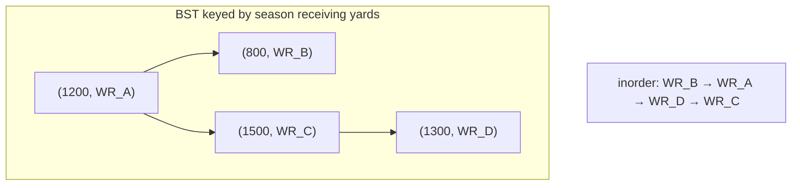
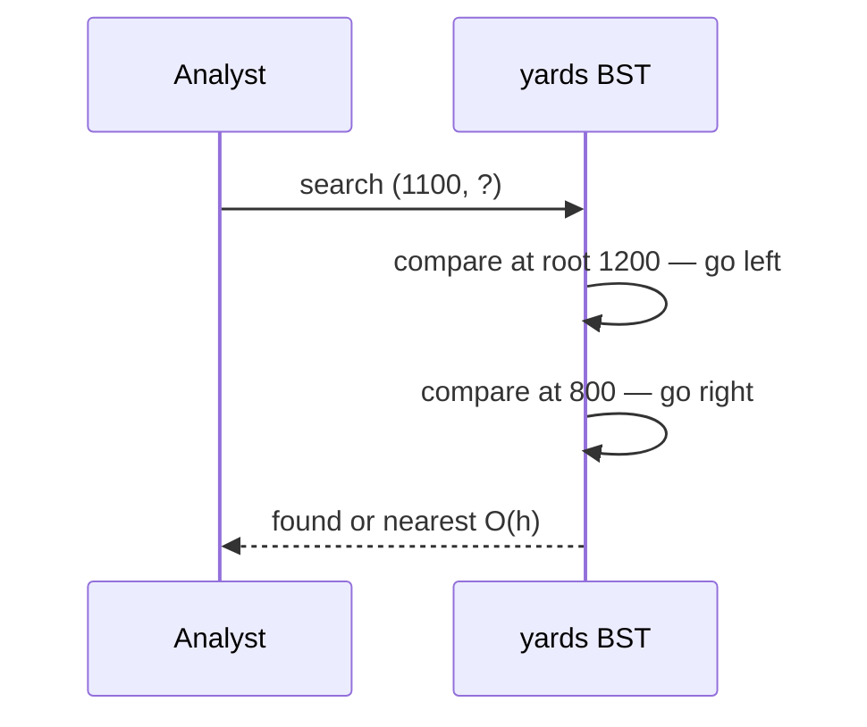
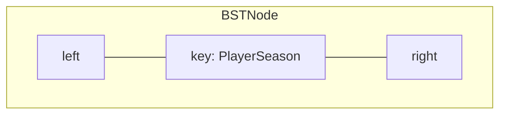
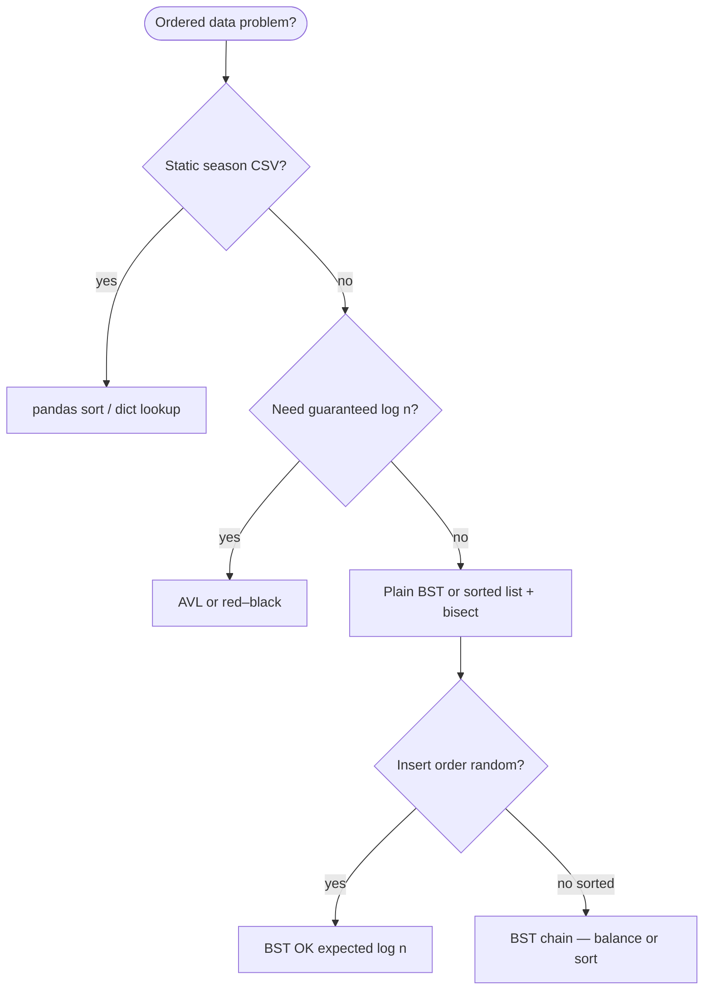

# Binary search tree

A **binary tree** where, for every node, all keys in the **left** subtree are **strictly smaller** and all keys in the **right** subtree are **strictly greater**. That ordering lets you **search**, **insert**, and **delete** by walking one branch at each level—like a filing cabinet sorted by player name or week number.

| | |
| --- | --- |
| **What it is** | A rooted binary tree with the BST invariant: `left.key < node.key < right.key` at every node. |
| **Core operations** | `search`, `insert`, `delete`, traversals (`inorder` yields sorted keys). |
| **Height matters** | Time is O(h) where **h** = height. Balanced tree: h = O(log n). Sorted input: h = O(n). |
| **When to use** | Ordered lookup, range queries, and sorted iteration when you control shape or will upgrade to AVL/red–black. |
| **Trade-off** | Simple and teachable; **unbalanced** input degrades to linked-list speed. |

In **NFL data analysis**, a BST is the right mental model for **ranking and range queries on ordered stats**: store `(season_yards, player_id)` pairs, walk left/right to find a yardage threshold, or run **inorder traversal** to print the receiving leaderboard in ascending order. For a full season table you will still use **pandas** or **`sorted()`**—implement a BST to learn the invariant, to support **range scans** (all WRs between 800–1200 yards), and as the foundation for [AVL](../avl-tree/index.md) and [red–black](../red-black-tree/index.md) trees.

This page is your **ready reference**: structure, a complete Python implementation, every way to create it, every method with NFL-flavored examples, and **time and space complexity** on each operation. For Big-O notation, see [Complexity analysis](../../complexity/index.md).

[Parent: Data structures](../index.md)

---

## How a BST fits NFL-shaped problems

| NFL idea | BST view | Why ordering helps |
| --- | --- | --- |
| **Receiving yards leaderboard** | Key = `(yards, player_id)`; inorder = ascending rank | O(n) sorted walk without separate sort step |
| **Find player at yardage cutoff** | Search for `(900, ?)` or nearest neighbor | O(h) descent vs O(n) linear scan |
| **Week schedule lookup** | Key = `(week, game_id)` | Range query: all games in weeks 5–8 |
| **Fantasy points threshold** | Insert weekly scores; query “who beat 20?” | Left = below, right = above |
| **Play-by-play time index** | Key = `(game_clock_seconds, play_id)` | Ordered replay scrubber on one drive |

**Use pandas / `dict` / `sorted()`** when you load 20,000 rows once and filter in vectorized code. **Use a BST** when the problem is **incremental ordered inserts**, **online** nearest/range queries on a **moderate** *n*, or when you are **learning balancing** on top of this base.



Throughout this page, **n** is the number of nodes. **h** is tree height.

---

## BST vs balanced trees vs Python builtins

| | **BST (this page)** | [AVL tree](../avl-tree/index.md) | [Red–black tree](../red-black-tree/index.md) | **`dict` / `set`** | **`sorted()` / pandas** |
| --- | --- | --- | --- | --- | --- |
| **Search** | O(h) | O(log n) guaranteed | O(log n) guaranteed | O(1) avg hash | O(log n) if sorted list + bisect |
| **Insert** | O(h) | O(log n) + rotations | O(log n) + recolor/rotate | O(1) avg | O(n) resort or O(log n) bisect insert |
| **Sorted iteration** | O(n) inorder | O(n) inorder | O(n) inorder | O(n) arbitrary order | O(n) already sorted |
| **Ordering** | Total order on keys | Same | Same | Keys hashable; **not** sorted | Sort any column |
| **NFL fit** | Teach ordered search | Guaranteed log for live feed | Library map theory | `player_id → stats` lookup | Season tables, EPA ranks |

!!! note "Python `dict` is not a BST"
    CPython **`dict`** and **`set`** use **hash tables**, not binary search trees. Average O(1) lookup by key; **no** in-order traversal of keys by value order unless you sort separately. Ordered **insertion** since 3.7 is by **insertion order**, not by key comparison.



---

## Node definition

Each node stores a **key** (comparable tuple or dataclass) and **left** / **right** child pointers.

```python
from __future__ import annotations

from dataclasses import dataclass
from typing import Any, Iterator


@dataclass(frozen=True, order=True)
class PlayerSeason:
    """Sort key: yards first, then player_id tie-break."""
    yards: int
    player_id: str
    name: str = ""


@dataclass
class BSTNode:
    key: Any
    left: BSTNode | None = None
    right: BSTNode | None = None
    # Optional payload separate from sort key
    payload: Any = None
```

| | |
| --- | --- |
| **Time** | O(1) to construct one node |
| **Space** | O(1) per node (key + two refs + header) |



---

## Ways to create a binary search tree

### 1. Empty tree — root is `None`

```python
root: BSTNode | None = None
```

| | |
| --- | --- |
| **Time** | O(1) |
| **Space** | O(1) |

### 2. Empty `BinarySearchTree` wrapper

```python
class BinarySearchTree:
    def __init__(self) -> None:
        self.root: BSTNode | None = None
        self._size = 0

tree = BinarySearchTree()
assert tree.is_empty()
```

| | |
| --- | --- |
| **Time** | O(1) |
| **Space** | O(1) |

### 3. Single-node tree

```python
root = BSTNode(PlayerSeason(1200, "WR01", "Alpha"))
```

| | |
| --- | --- |
| **Time** | O(1) |
| **Space** | O(1) |

### 4. Build from iterable — repeated insert

Preserves **BST shape** depends on **insert order**—same keys, different order → different shape.

```python
def insert_bst(root: BSTNode | None, key: Any) -> BSTNode:
    if root is None:
        return BSTNode(key)
    if key < root.key:
        root.left = insert_bst(root.left, key)
    elif key > root.key:
        root.right = insert_bst(root.right, key)
    return root

players = [
    PlayerSeason(1200, "WR01"),
    PlayerSeason(800, "WR02"),
    PlayerSeason(1500, "WR03"),
]
root = None
for p in players:
    root = insert_bst(root, p)
```

| | |
| --- | --- |
| **Time** | O(n · h) — O(n log n) if balanced, O(n²) if sorted input |
| **Space** | O(n) nodes + O(h) recursion stack |

### 5. Build from **sorted** list — degenerates to a chain

Inserting strictly increasing `(yards, id)` mimics **sorted season CSV** row-by-row: every insert goes right → **h = n**.

```python
sorted_yards = [PlayerSeason(y, f"P{y}") for y in range(100, 2000, 100)]
root = None
for p in sorted_yards:
    root = insert_bst(root, p)
# height ≈ n — why we balance in AVL / red–black
```

| | |
| --- | --- |
| **Time** | O(n²) |
| **Space** | O(n) |

### 6. Random shuffle before insert — expected O(log n) height

```python
import random

shuffled = players[:]
random.shuffle(shuffled)
root = None
for p in shuffled:
    root = insert_bst(root, p)
```

| | |
| --- | --- |
| **Time** | O(n log n) expected |
| **Space** | O(n) |

---

## Full implementation: `BinarySearchTree`

The class below implements **search**, **insert**, **delete**, **min/max**, **inorder/preorder/postorder**, **size**, **height**, and **range query**—enough for NFL leaderboard drills and interview follow-ups.

```python
class BinarySearchTree:
    def __init__(self) -> None:
        self.root: BSTNode | None = None
        self._size = 0

    def is_empty(self) -> bool:
        return self.root is None

    def __len__(self) -> int:
        return self._size

    # --- search ---

    def search(self, key: Any) -> BSTNode | None:
        cur = self.root
        while cur is not None:
            if key == cur.key:
                return cur
            cur = cur.left if key < cur.key else cur.right
        return None

    def contains(self, key: Any) -> bool:
        return self.search(key) is not None

    # --- insert ---

    def insert(self, key: Any, payload: Any = None) -> None:
        if self.root is None:
            self.root = BSTNode(key, payload=payload)
            self._size += 1
            return
        cur = self.root
        while True:
            if key < cur.key:
                if cur.left is None:
                    cur.left = BSTNode(key, payload=payload)
                    self._size += 1
                    return
                cur = cur.left
            elif key > cur.key:
                if cur.right is None:
                    cur.right = BSTNode(key, payload=payload)
                    self._size += 1
                    return
                cur = cur.right
            else:
                cur.payload = payload  # update duplicate key
                return

    # --- delete ---

    def delete(self, key: Any) -> bool:
        self.root, deleted = self._delete_rec(self.root, key)
        if deleted:
            self._size -= 1
        return deleted

    def _delete_rec(
        self, node: BSTNode | None, key: Any
    ) -> tuple[BSTNode | None, bool]:
        if node is None:
            return None, False
        if key < node.key:
            node.left, deleted = self._delete_rec(node.left, key)
            return node, deleted
        if key > node.key:
            node.right, deleted = self._delete_rec(node.right, key)
            return node, deleted
        # found node
        if node.left is None:
            return node.right, True
        if node.right is None:
            return node.left, True
        # two children: inorder successor (min in right subtree)
        succ = self._min_node(node.right)
        node.key = succ.key
        node.payload = succ.payload
        node.right, _ = self._delete_rec(node.right, succ.key)
        return node, True

    def _min_node(self, node: BSTNode) -> BSTNode:
        while node.left is not None:
            node = node.left
        return node

    # --- min / max ---

    def minimum(self) -> Any | None:
        if self.root is None:
            return None
        return self._min_node(self.root).key

    def maximum(self) -> Any | None:
        if self.root is None:
            return None
        cur = self.root
        while cur.right is not None:
            cur = cur.right
        return cur.key

    # --- traversals ---

    def inorder(self) -> list[Any]:
        out: list[Any] = []
        self._inorder_rec(self.root, out)
        return out

    def _inorder_rec(self, node: BSTNode | None, out: list[Any]) -> None:
        if node is None:
            return
        self._inorder_rec(node.left, out)
        out.append(node.key)
        self._inorder_rec(node.right, out)

    def inorder_iter(self) -> Iterator[Any]:
        stack: list[BSTNode] = []
        cur = self.root
        while stack or cur is not None:
            while cur is not None:
                stack.append(cur)
                cur = cur.left
            cur = stack.pop()
            yield cur.key
            cur = cur.right

    def preorder(self) -> list[Any]:
        out: list[Any] = []
        self._preorder_rec(self.root, out)
        return out

    def _preorder_rec(self, node: BSTNode | None, out: list[Any]) -> None:
        if node is None:
            return
        out.append(node.key)
        self._preorder_rec(node.left, out)
        self._preorder_rec(node.right, out)

    def postorder(self) -> list[Any]:
        out: list[Any] = []
        self._postorder_rec(self.root, out)
        return out

    def _postorder_rec(self, node: BSTNode | None, out: list[Any]) -> None:
        if node is None:
            return
        self._postorder_rec(node.left, out)
        self._postorder_rec(node.right, out)
        out.append(node.key)

    # --- metrics ---

    def height(self) -> int:
        return self._height_rec(self.root)

    def _height_rec(self, node: BSTNode | None) -> int:
        if node is None:
            return -1
        return 1 + max(self._height_rec(node.left), self._height_rec(node.right))

    # --- range query [lo, hi] inclusive on keys ---

    def range_query(self, lo: Any, hi: Any) -> list[Any]:
        out: list[Any] = []
        self._range_rec(self.root, lo, hi, out)
        return out

    def _range_rec(
        self, node: BSTNode | None, lo: Any, hi: Any, out: list[Any]
    ) -> None:
        if node is None:
            return
        if lo < node.key:
            self._range_rec(node.left, lo, hi, out)
        if lo <= node.key <= hi:
            out.append(node.key)
        if hi > node.key:
            self._range_rec(node.right, lo, hi, out)
```

| | |
| --- | --- |
| **Time to construct class** | O(1) |
| **Space** | O(n) for tree storage |

---

## Operations reference (with NFL examples)

### `search` / `contains` — find a player by `(yards, id)`

```python
tree = BinarySearchTree()
tree.insert(PlayerSeason(1200, "WR01", "Alpha"))
tree.insert(PlayerSeason(800, "WR02", "Beta"))

node = tree.search(PlayerSeason(800, "WR02"))
assert node is not None and node.key.name == "Beta"
assert tree.contains(PlayerSeason(999, "X")) is False
```

| | |
| --- | --- |
| **Time** | O(h) |
| **Space** | O(1) iterative; O(h) recursive variant |


---

### `insert` — add weekly stat line

```python
tree = BinarySearchTree()
for yards, pid, name in [(1100, "WR01", "A"), (950, "WR02", "B"), (1300, "WR03", "C")]:
    tree.insert(PlayerSeason(yards, pid, name))
assert len(tree) == 3
```

| | |
| --- | --- |
| **Time** | O(h) |
| **Space** | O(1) iterative; O(h) if recursive |

---

### `delete` — remove traded player from active roster tree

Three cases: **no left child**, **no right child**, **two children** (replace with inorder successor from right subtree).

```python
tree = BinarySearchTree()
for p in [
    PlayerSeason(1200, "WR01"),
    PlayerSeason(800, "WR02"),
    PlayerSeason(1500, "WR03"),
    PlayerSeason(1300, "WR04"),
]:
    tree.insert(p)

tree.delete(PlayerSeason(1200, "WR01"))  # two-child case at root
assert tree.search(PlayerSeason(1200, "WR01")) is None
assert len(tree) == 3
ordered = tree.inorder()
assert ordered == sorted(ordered)
```

| Case | Action |
| --- | --- |
| Leaf | Unlink node |
| One child | Splice child up |
| Two children | Copy successor key; delete successor |

| | |
| --- | --- |
| **Time** | O(h) |
| **Space** | O(h) recursion stack |


---

### `inorder` — sorted receiving leaderboard

**Inorder** (left → node → right) visits keys in **ascending** order—the BST’s superpower for “print everyone sorted by yards.”

```python
tree = BinarySearchTree()
stats = [(1050, "WR01"), (890, "WR02"), (1400, "WR03"), (1100, "WR04")]
for y, pid in stats:
    tree.insert(PlayerSeason(y, pid))

leaderboard = [k.yards for k in tree.inorder()]
assert leaderboard == [890, 1050, 1100, 1400]
```

| | |
| --- | --- |
| **Time** | O(n) |
| **Space** | O(n) output; O(h) stack for `inorder_iter` |


---

### `minimum` / `maximum` — floor / ceiling of yardage

```python
tree = BinarySearchTree()
for y in [900, 1200, 1500]:
    tree.insert(PlayerSeason(y, f"P{y}"))
assert tree.minimum().yards == 900
assert tree.maximum().yards == 1500
```

| | |
| --- | --- |
| **Time** | O(h) |
| **Space** | O(1) |

---

### `range_query` — WRs with 900–1200 yards

```python
tree = BinarySearchTree()
for y, pid in [(800, "a"), (950, "b"), (1100, "c"), (1300, "d")]:
    tree.insert(PlayerSeason(y, pid))

band = tree.range_query(PlayerSeason(900, ""), PlayerSeason(1200, "zzz"))
yards = [k.yards for k in band]
assert yards == [950, 1100]
```

| | |
| --- | --- |
| **Time** | O(n) worst case (visit all); O(log n + k) typical for k results in balanced tree |
| **Space** | O(k) output + O(h) stack |

---

### `height` — detect degenerate “sorted insert” chain

```python
tree = BinarySearchTree()
for y in range(10):
    tree.insert(PlayerSeason(y, f"P{y}"))
assert tree.height() == 9  # chain — need AVL/RB
```

| | |
| --- | --- |
| **Time** | O(n) |
| **Space** | O(h) recursion |

---

## NFL application: live receiving leaderboard

```python
class ReceivingLeaderboard:
    """Incremental BST of season receiving yards."""

    def __init__(self) -> None:
        self._tree = BinarySearchTree()

    def add_game(self, player_id: str, name: str, game_yards: int) -> None:
        node = self._tree.search(PlayerSeason(0, player_id))
        if node is None:
            self._tree.insert(PlayerSeason(game_yards, player_id, name))
        else:
            old = node.key
            self._tree.delete(old)
            self._tree.insert(
                PlayerSeason(old.yards + game_yards, player_id, name or old.name)
            )

    def top_report(self, min_yards: int, max_yards: int) -> list[PlayerSeason]:
        return self._tree.range_query(
            PlayerSeason(min_yards, ""),
            PlayerSeason(max_yards, "\uffff"),
        )

    def print_standings(self) -> None:
        for key in self._tree.inorder_iter():
            print(f"{key.player_id}: {key.yards} yds — {key.name}")


board = ReceivingLeaderboard()
board.add_game("WR01", "Alpha", 85)
board.add_game("WR02", "Beta", 120)
board.add_game("WR01", "Alpha", 40)
mid = board.top_report(100, 200)
assert len(mid) == 2
```

| Operation | Time | Space |
| --- | --- | --- |
| `add_game` | O(h) search + delete + insert | O(1) aux |
| `top_report` | O(n) worst; O(log n + k) balanced | O(k) |
| `print_standings` | O(n) | O(h) stack |

---

## NFL application: schedule by `(week, game_id)`

```python
@dataclass(frozen=True, order=True)
class GameSlot:
    week: int
    game_id: str
    matchup: str = ""


schedule = BinarySearchTree()
schedule.insert(GameSlot(1, "G001", "KC @ BAL"))
schedule.insert(GameSlot(1, "G002", "SF @ PIT"))
schedule.insert(GameSlot(5, "G041", "BUF @ NYJ"))

week1 = schedule.range_query(GameSlot(1, ""), GameSlot(1, "\uffff"))
assert len(week1) == 2
```

| Operation | Time | Notes |
| --- | --- | --- |
| Insert game | O(h) | |
| Games in week *w* | O(log n + k) balanced | k = games that week |

---

## Python stdlib: what to use instead

| Need | Stdlib / ecosystem | vs hand-rolled BST |
| --- | --- | --- |
| Key → stats lookup | `dict[str, dict]` | O(1) avg; no sorted walk |
| Sort once, query many | `sorted(rows, key=...)` + bisect | Simpler for static season CSV |
| Ordered multiset | `sortedcontainers.SortedList` (third party) | Production-grade balanced structure |
| Unique sorted keys | `set` + `sorted()` | Not incremental O(log n) unless bisect on list |

```python
# Typical NFL notebook — not a BST, but what you ship
import pandas as pd

df = pd.read_csv("receiving_2024.csv")
top = df[(df["yards"] >= 900) & (df["yards"] <= 1200)].sort_values("yards")
```

**Rule of thumb:** implement **`BinarySearchTree`** to learn and interview; use **pandas / dict / sorted list** for real season pipelines unless you need **online** ordered structure semantics.

---

## Master complexity table

Let **n** = `len(tree)`, **h** = height.

| Operation | Time | Space (auxiliary) | Notes |
| --- | --- | --- | --- |
| Create empty | O(1) | O(1) | |
| Build from *n* inserts | O(n · h) | O(n) | O(n log n) if balanced |
| `search` / `contains` | O(h) | O(1) | |
| `insert` | O(h) | O(1) | |
| `delete` | O(h) | O(h) | recursive |
| `minimum` / `maximum` | O(h) | O(1) | |
| `inorder` / traversals | O(n) | O(h) stack | |
| `height` | O(n) | O(h) | |
| `range_query` | O(n) worst | O(k) output | O(log n + k) balanced |
| Storage | — | O(n) nodes | |

**Balanced vs skewed:** h = O(log n) random/balanced; h = O(n) sorted inserts.

---

## When to pick which structure (NFL context)



| Scenario | Best tool |
| --- | --- |
| One-time EPA leaderboard | pandas `sort_values` |
| Live incremental yards + sorted walk | BST → upgrade to AVL |
| Player ID → game log | `dict`, not BST |
| Week range on schedule | BST range query or SQL `WHERE week BETWEEN` |
| Interview “implement map” | BST / red–black discussion |

---

## Common pitfalls

| Pitfall | Why it hurts | Fix |
| --- | --- | --- |
| Sorted insert order | O(n) height, O(n) search | Shuffle, AVL, or sort-then-build |
| Duplicate keys undefined | Second insert may noop or overwrite | Document policy; use `(yards, player_id)` tuple |
| Confusing `dict` with BST | Expect sorted keys from `{}` | Sort keys explicitly or use BST/SortedList |
| Delete two-child bug | Orphan subtree or broken order | Copy **successor** from right, not predecessor only |
| Range query wrong bounds | Miss edge keys | Use inclusive `lo <= key <= hi` and prune correctly |
| Storing entire DataFrame in nodes | Memory blowup | Index by key; payload = id or small record |

---

## Related pages

| Page | Relationship |
| --- | --- |
| [AVL tree](../avl-tree/index.md) | Strict balance; rotations on insert/delete |
| [Red–black tree](../red-black-tree/index.md) | Relaxed balance; C++ `map` model |
| [Max heap](../max-heap/index.md) | Partial order for “top k” only |
| [Array-based lists](../array-based-lists/index.md) | Sorted list + bisect alternative |
| [Complexity analysis](../../complexity/index.md) | Big-O reference |
| [Data structures hub](../index.md) | All structures |

---

## Quick reference card

```python
# create
tree = BinarySearchTree()
tree.insert(PlayerSeason(1200, "WR01", "Alpha"))

# O(h) lookup / mutate
tree.search(PlayerSeason(1200, "WR01"))
tree.contains(key)
tree.delete(key)
tree.insert(key)

# O(n) sorted walk
list(tree.inorder_iter())
tree.minimum()
tree.maximum()

# range: yards in [900, 1200]
tree.range_query(PlayerSeason(900, ""), PlayerSeason(1200, "\uffff"))

# metrics
len(tree)
tree.height()  # watch for n-1 chain on sorted input
```

Use a **binary search tree** when you need **ordered keys** with **search, insert, delete, and inorder iteration**—then move to **[AVL](../avl-tree/index.md)** or **[red–black](../red-black-tree/index.md)** when **worst-case O(log n)** must be guaranteed for live NFL feeds and large *n*.
