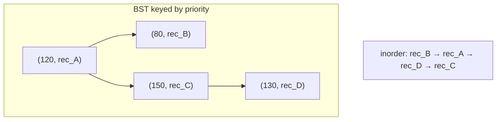
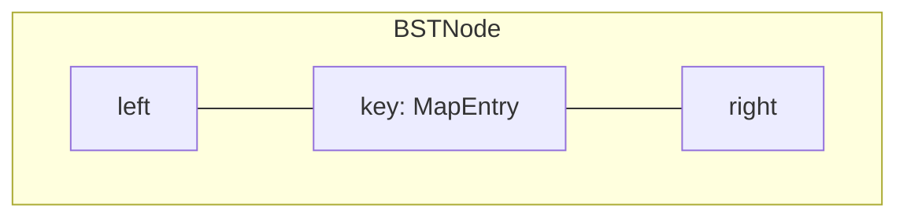
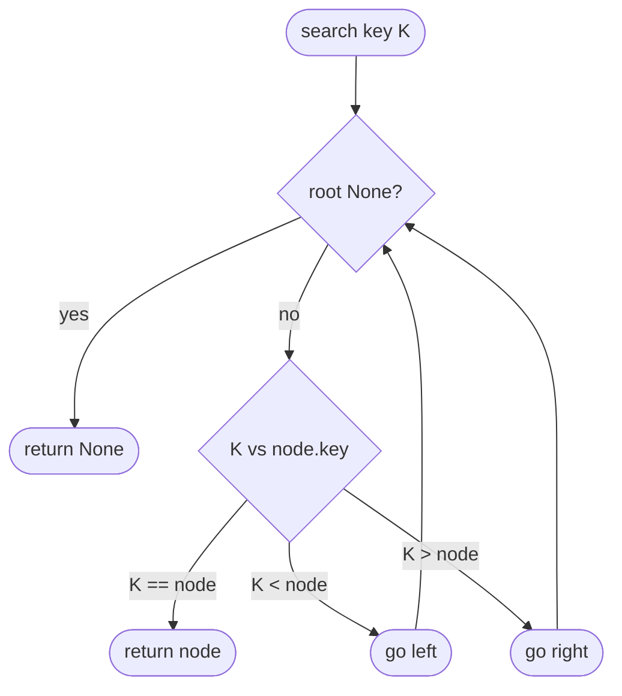
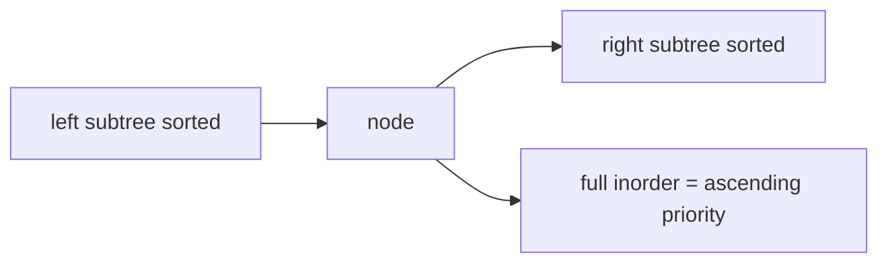
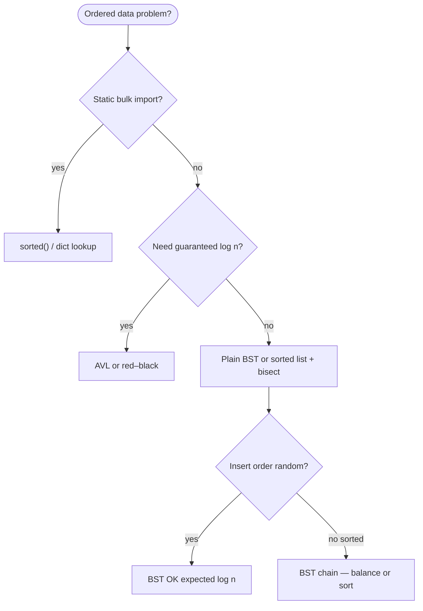

# Binary search tree

A **binary tree** where, for every node, all keys in the **left** subtree are **strictly smaller** and all keys in the **right** subtree are **strictly greater**. That ordering lets you **search**, **insert**, and **delete** by walking one branch at each level—like a filing cabinet sorted by key or timestamp.

| | |
| --- | --- |
| **What it is** | A rooted binary tree with the BST invariant: `left.key < node.key < right.key` at every node. |
| **Core operations** | `search`, `insert`, `delete`, traversals (`inorder` yields sorted keys). |
| **Height matters** | Time is O(h) where **h** = height. Balanced tree: h = O(log n). Sorted input: h = O(n). |
| **When to use** | Ordered lookup, range queries, and sorted iteration when you control shape or will upgrade to AVL/red–black. |
| **Trade-off** | Simple and teachable; **unbalanced** input degrades to linked-list speed. |

A BST is the right mental model for **ordered maps**—**symbol tables**, **indexes**, and **schedulers** where keys have a total order: store `(priority, record_id)` pairs, walk left/right to find a cutoff, or run **inorder traversal** to list entries in ascending key order. For a large static dataset you will still use **`sorted()`** or a database index—implement a BST to learn the invariant, to support **range scans** (all records between two key bounds), and as the foundation for [AVL](../avl-tree/index.md) and [red–black](../red-black-tree/index.md) trees.

This page is your **ready reference**: structure, a complete Python implementation, every way to create it, every method with ordered-map examples, and **time and space complexity** on each operation. For Big-O notation, see [Complexity analysis](../../complexity/index.md).

[Parent: Data structures](../index.md)

---

## How a BST fits ordered-map problems

| Use case | BST view | Why ordering helps |
| --- | --- | --- |
| **Symbol table** | Key = `(name, scope_id)`; inorder = lexicographic walk | O(n) sorted walk without separate sort step |
| **Score index** | Key = `(priority, record_id)`; inorder = ascending rank | O(n) sorted walk without separate sort step |
| **Find cutoff entry** | Search for `(90, ?)` or nearest neighbor | O(h) descent vs O(n) linear scan |
| **Scheduler lookup** | Key = `(timestamp, task_id)` | Range query: all tasks in a time window |
| **Threshold filter** | Insert scored records; query "who exceeded priority 200?" | Left = below, right = above |
| **Event log index** | Key = `(sequence, record_id)` | Ordered replay of append-only log |

**Use `dict` / `sorted()`** when you load a large table once and filter in bulk. **Use a BST** when the problem is **incremental ordered inserts**, **online** nearest/range queries on a **moderate** *n*, or when you are **learning balancing** on top of this base.



Throughout this page, **n** is the number of nodes. **h** is tree height.

---

## BST vs balanced trees vs Python builtins

| | **BST (this page)** | [AVL tree](../avl-tree/index.md) | [Red–black tree](../red-black-tree/index.md) | **`dict` / `set`** | **`sorted()` / SQL** |
| --- | --- | --- | --- | --- | --- |
| **Search** | O(h) | O(log n) guaranteed | O(log n) guaranteed | O(1) avg hash | O(log n) if sorted list + bisect |
| **Insert** | O(h) | O(log n) + rotations | O(log n) + recolor/rotate | O(1) avg | O(n) resort or O(log n) bisect insert |
| **Sorted iteration** | O(n) inorder | O(n) inorder | O(n) inorder | O(n) arbitrary order | O(n) already sorted |
| **Ordering** | Total order on keys | Same | Same | Keys hashable; **not** sorted | Sort any column |
| **Typical fit** | Teach ordered search | Guaranteed log for live feed | Library map theory | `id → record` lookup | Bulk tables, one-shot sorts |

!!! note "Python `dict` is not a BST"
 CPython **`dict`** and **`set`** use **hash tables**, not binary search trees. Average O(1) lookup by key; **no** in-order traversal of keys by value order unless you sort separately. Ordered **insertion** since 3.7 is by **insertion order**, not by key comparison.


---

## Node definition

Each node stores a **key** (comparable tuple or dataclass) and **left** / **right** child pointers.

```python
from dataclasses import dataclass


@dataclass(frozen=True, order=True)
class MapEntry:
 priority = 0
 record_id = ""
 label= ""


@dataclass
class BSTNode:
 key = None
 left= None
 right= None
 payload= None
```

| | |
| --- | --- |
| **Time** | O(1) to construct one node |
| **Space** | O(1) per node (key + two refs + header) |



---

## Ways to create a binary search tree

### 1. Empty tree — root is `None`

```python
root= None
```

| | |
| --- | --- |
| **Time** | O(1) |
| **Space** | O(1) |

### 2. Empty `BinarySearchTree` wrapper

```python
class BinarySearchTree:
 def __init__(self):
 self.root= None
 self._size = 0

tree = BinarySearchTree()
assert tree.is_empty()
```

| | |
| --- | --- |
| **Time** | O(1) |
| **Space** | O(1) |

### 3. Single-node tree

```python
root = BSTNode(MapEntry(120, "rec01", "high priority"))
```

| | |
| --- | --- |
| **Time** | O(1) |
| **Space** | O(1) |

### 4. Build from iterable — repeated insert

Preserves **BST shape** depends on **insert order**—same keys, different order → different shape.

```python
def insert_bst(root, key):
 if root is None:
 return BSTNode(key)
 if key < root.key:
 root.left = insert_bst(root.left, key)
 elif key > root.key:
 root.right = insert_bst(root.right, key)
 return root

entries = [
 MapEntry(120, "rec01"),
 MapEntry(80, "rec02"),
 MapEntry(150, "rec03"),
]
root = None
for entry in entries:
 root = insert_bst(root, entry)
```

| | |
| --- | --- |
| **Time** | O(n · h) — O(n log n) if balanced, O(n²) if sorted input |
| **Space** | O(n) nodes + O(h) recursion stack |

### 5. Build from **sorted** list — degenerates to a chain

Inserting strictly increasing `(priority, id)` mimics **sorted bulk import** row-by-row: every insert goes right → **h = n**.

```python
sorted_keys = [MapEntry(a, f"rec{a}") for a in range(10, 200, 10)]
root = None
for entry in sorted_keys:
 root = insert_bst(root, entry)
```

| | |
| --- | --- |
| **Time** | O(n²) |
| **Space** | O(n) |

### 6. Random shuffle before insert — expected O(log n) height

```python
import random

shuffled = entries[:]
random.shuffle(shuffled)
root = None
for r in shuffled:
 root = insert_bst(root, r)
```

| | |
| --- | --- |
| **Time** | O(n log n) expected |
| **Space** | O(n) |

---

## Full implementation: `BinarySearchTree`

The class below implements **search**, **insert**, **delete**, **min/max**, **inorder/preorder/postorder**, **size**, **height**, and **range query**—enough for ordered-map drills and interview follow-ups.

```python
class BinarySearchTree:
 def __init__(self):
 self.root= None
 self._size = 0

 def is_empty(self):
 return self.root is None

 def __len__(self):
 return self._size

 def search(self, key):
 cur = self.root
 while cur is not None:
 if key == cur.key:
 return cur
 cur = cur.left if key < cur.key else cur.right
 return None

 def contains(self, key):
 return self.search(key) is not None

 def insert(self, key, payload=None):
 if self.root is None:
 self.root = BSTNode(key, payload=payload)
 self._size += 1
 return
 cur = self.root
 while True:
 if key < cur.key:
 if cur.left is None:
 cur.left = BSTNode(key, payload=payload)
 self._size += 1
 return
 cur = cur.left
 elif key > cur.key:
 if cur.right is None:
 cur.right = BSTNode(key, payload=payload)
 self._size += 1
 return
 cur = cur.right
 else:
 cur.payload = payload
 return

 def delete(self, key):
 self.root, deleted = self._delete_rec(self.root, key)
 if deleted:
 self._size -= 1
 return deleted

 def _delete_rec(self, node, key):
 if node is None:
 return None, False
 if key < node.key:
 node.left, deleted = self._delete_rec(node.left, key)
 return node, deleted
 if key > node.key:
 node.right, deleted = self._delete_rec(node.right, key)
 return node, deleted
 if node.left is None:
 return node.right, True
 if node.right is None:
 return node.left, True
 succ = self._min_node(node.right)
 node.key = succ.key
 node.payload = succ.payload
 node.right, _ = self._delete_rec(node.right, succ.key)
 return node, True

 def _min_node(self, node):
 while node.left is not None:
 node = node.left
 return node

 def minimum(self):
 if self.root is None:
 return None
 return self._min_node(self.root).key

 def maximum(self):
 if self.root is None:
 return None
 cur = self.root
 while cur.right is not None:
 cur = cur.right
 return cur.key

 def inorder(self):
 out= []
 self._inorder_rec(self.root, out)
 return out

 def _inorder_rec(self, node, out):
 if node is None:
 return
 self._inorder_rec(node.left, out)
 out.append(node.key)
 self._inorder_rec(node.right, out)

 def inorder_iter(self):
 stack= []
 cur = self.root
 while stack or cur is not None:
 while cur is not None:
 stack.append(cur)
 cur = cur.left
 cur = stack.pop()
 yield cur.key
 cur = cur.right

 def preorder(self):
 out= []
 self._preorder_rec(self.root, out)
 return out

 def _preorder_rec(self, node, out):
 if node is None:
 return
 out.append(node.key)
 self._preorder_rec(node.left, out)
 self._preorder_rec(node.right, out)

 def postorder(self):
 out= []
 self._postorder_rec(self.root, out)
 return out

 def _postorder_rec(self, node, out):
 if node is None:
 return
 self._postorder_rec(node.left, out)
 self._postorder_rec(node.right, out)
 out.append(node.key)

 def height(self):
 return self._height_rec(self.root)

 def _height_rec(self, node):
 if node is None:
 return -1
 return 1 + max(self._height_rec(node.left), self._height_rec(node.right))

 def range_query(self, lo, hi):
 out= []
 self._range_rec(self.root, lo, hi, out)
 return out

 def _range_rec(self, node, lo, hi, out):
 if node is None:
 return
 if lo < node.key:
 self._range_rec(node.left, lo, hi, out)
 if lo <= node.key <= hi:
 out.append(node.key)
 if hi > node.key:
 self._range_rec(node.right, lo, hi, out)
```

| | |
| --- | --- |
| **Time to construct class** | O(1) |
| **Space** | O(n) for tree storage |

---

## Operations reference (with ordered-map examples)

### `search` / `contains` — find a record by `(priority, id)`

```python
tree = BinarySearchTree()
tree.insert(MapEntry(120, "rec01", "alpha"))
tree.insert(MapEntry(80, "rec02", "beta"))

node = tree.search(MapEntry(80, "rec02"))
assert node is not None and node.key.label == "beta"
assert tree.contains(MapEntry(999, "X")) is False
```

| | |
| --- | --- |
| **Time** | O(h) |
| **Space** | O(1) iterative; O(h) recursive variant |



---

### `insert` — add symbol-table entry

```python
tree = BinarySearchTree()
for priority, rid, label in [(110, "rec01", "A"), (95, "rec02", "B"), (130, "rec03", "C")]:
 tree.insert(MapEntry(priority, rid, label))
assert len(tree) == 3
```

| | |
| --- | --- |
| **Time** | O(h) |
| **Space** | O(1) iterative; O(h) if recursive |

---

### `delete` — remove retired entry from active index

Three cases: **no left child**, **no right child**, **two children** (replace with inorder successor from right subtree).

```python
tree = BinarySearchTree()
for entry in [
 MapEntry(120, "rec01"),
 MapEntry(80, "rec02"),
 MapEntry(150, "rec03"),
 MapEntry(130, "rec04"),
]:
 tree.insert(entry)

tree.delete(MapEntry(120, "rec01"))
assert tree.search(MapEntry(120, "rec01")) is None
assert len(tree) == 3
ordered = tree.inorder()
assert ordered == sorted(ordered)
```

| Case | Action |
| --- | --- |
| Leaf | Unlink node |
| One child | Splice child up |
| Two children | Copy successor key; delete successor |

| | |
| --- | --- |
| **Time** | O(h) |
| **Space** | O(h) recursion stack |


---

### `inorder` — sorted index walk

**Inorder** (left → node → right) visits keys in **ascending** order—the BST's superpower for "print every entry sorted by priority."

```python
tree = BinarySearchTree()
stats = [(105, "rec01"), (89, "rec02"), (140, "rec03"), (110, "rec04")]
for priority, rid in stats:
 tree.insert(MapEntry(priority, rid))

ordered = [k.priority for k in tree.inorder()]
assert ordered == [89, 105, 110, 140]
```

| | |
| --- | --- |
| **Time** | O(n) |
| **Space** | O(n) output; O(h) stack for `inorder_iter` |



---

### `minimum` / `maximum` — floor / ceiling of priority

```python
tree = BinarySearchTree()
for p in [90, 120, 150]:
 tree.insert(MapEntry(p, f"rec{p}"))
assert tree.minimum().priority == 90
assert tree.maximum().priority == 150
```

| | |
| --- | --- |
| **Time** | O(h) |
| **Space** | O(1) |

---

### `range_query` — entries with priority 90–120

```python
tree = BinarySearchTree()
for priority, rid in [(80, "a"), (95, "b"), (110, "c"), (130, "d")]:
 tree.insert(MapEntry(priority, rid))

band = tree.range_query(MapEntry(90, ""), MapEntry(120, "zzz"))
priorities = [k.priority for k in band]
assert priorities == [95, 110]
```

| | |
| --- | --- |
| **Time** | O(n) worst case (visit all); O(log n + k) typical for k results in balanced tree |
| **Space** | O(k) output + O(h) stack |

---

### `height` — detect degenerate "sorted insert" chain

```python
tree = BinarySearchTree()
for i in range(10):
 tree.insert(MapEntry(i * 10, f"rec{i}"))
assert tree.height() == 9
```

| | |
| --- | --- |
| **Time** | O(n) |
| **Space** | O(h) recursion |

---

## Application: live score index

```python
class ScoreIndex:
 def __init__(self):
 self._tree = BinarySearchTree()

 def upsert(self, record_id, label, priority):
 node = self._tree.search(MapEntry(0, record_id))
 if node is None:
 self._tree.insert(MapEntry(priority, record_id, label))
 else:
 old = node.key
 self._tree.delete(old)
 self._tree.insert(
 MapEntry(old.priority + priority, record_id, label or old.label)
 )

 def range_report(self, min_priority, max_priority):
 return self._tree.range_query(
 MapEntry(min_priority, ""),
 MapEntry(max_priority, "\uffff"),
 )

 def print_ranked(self):
 for key in self._tree.inorder_iter():
 print(f"{key.record_id}: priority {key.priority} — {key.label}")


index = ScoreIndex()
index.upsert("rec01", "alpha", 85)
index.upsert("rec02", "beta", 120)
index.upsert("rec01", "alpha", 40)
mid = index.range_report(100, 200)
assert len(mid) == 2
```

| Operation | Time | Space |
| --- | --- | --- |
| `upsert` | O(h) search + delete + insert | O(1) aux |
| `range_report` | O(n) worst; O(log n + k) balanced | O(k) |
| `print_ranked` | O(n) | O(h) stack |

---

## Application: scheduler by `(timestamp, task_id)`

```python
@dataclass(frozen=True, order=True)
class ScheduleSlot:
 timestamp = 0
 task_id = ""
 label= ""


schedule = BinarySearchTree()
schedule.insert(ScheduleSlot(1200, "task01", "compile"))
schedule.insert(ScheduleSlot(1200, "task02", "link"))
schedule.insert(ScheduleSlot(1500, "task41", "deploy"))

at_1200 = schedule.range_query(ScheduleSlot(1200, ""), ScheduleSlot(1200, "\uffff"))
assert len(at_1200) == 2
```

| Operation | Time | Notes |
| --- | --- | --- |
| Insert task | O(h) | |
| Tasks at time *t* | O(log n + k) balanced | k = tasks at that timestamp |

---

## Python stdlib: what to use instead

| Need | Stdlib / ecosystem | vs hand-rolled BST |
| --- | --- | --- |
| Key → record lookup | `dict[str, dict]` | O(1) avg; no sorted walk |
| Sort once, query many | `sorted(rows, key=...)` + bisect | Simpler for static bulk import |
| Ordered multiset | `sortedcontainers.SortedList` (third party) | Production-grade balanced structure |
| Unique sorted keys | `set` + `sorted()` | Not incremental O(log n) unless bisect on list |

```python
rows = [{"id": "rec01", "priority": 95}, {"id": "rec02", "priority": 110}]
top = sorted(r for r in rows if 90 <= r["priority"] <= 120, key=lambda r: r["priority"])
```

**Rule of thumb:** implement **`BinarySearchTree`** to learn and interview; use **`dict` / sorted list** for bulk static data unless you need **online** ordered structure semantics.

---

## Master complexity table

Let **n** = `len(tree)`, **h** = height.

| Operation | Time | Space (auxiliary) | Notes |
| --- | --- | --- | --- |
| Create empty | O(1) | O(1) | |
| Build from *n* inserts | O(n · h) | O(n) | O(n log n) if balanced |
| `search` / `contains` | O(h) | O(1) | |
| `insert` | O(h) | O(1) | |
| `delete` | O(h) | O(h) | recursive |
| `minimum` / `maximum` | O(h) | O(1) | |
| `inorder` / traversals | O(n) | O(h) stack | |
| `height` | O(n) | O(h) | |
| `range_query` | O(n) worst | O(k) output | O(log n + k) balanced |
| Storage | — | O(n) nodes | |

**Balanced vs skewed:** h = O(log n) random/balanced; h = O(n) sorted inserts.

---

## When to pick which structure (ordered-map context)



| Scenario | Best tool |
| --- | --- |
| One-time bulk sort | `sorted()` or SQL `ORDER BY` |
| Live incremental index + sorted walk | BST → upgrade to AVL |
| Record ID → payload | `dict`, not BST |
| Time range on scheduler | BST range query or SQL `WHERE ts BETWEEN` |
| Interview "implement map" | BST / red–black discussion |

---

## Common pitfalls

| Pitfall | Why it hurts | Fix |
| --- | --- | --- |
| Sorted insert order | O(n) height, O(n) search | Shuffle, AVL, or sort-then-build |
| Duplicate keys undefined | Second insert may noop or overwrite | Document policy; use `(priority, record_id)` tuple |
| Confusing `dict` with BST | Expect sorted keys from `{}` | Sort keys explicitly or use BST/SortedList |
| Delete two-child bug | Orphan subtree or broken order | Copy **successor** from right, not predecessor only |
| Range query wrong bounds | Miss edge keys | Use inclusive `lo <= key <= hi` and prune correctly |
| Storing entire DataFrame in nodes | Memory blowup | Index by key; payload = id or small record |

---

## Related pages

| Page | Relationship |
| --- | --- |
| [AVL tree](../avl-tree/index.md) | Strict balance; rotations on insert/delete |
| [Red–black tree](../red-black-tree/index.md) | Relaxed balance; C++ `map` model |
| [Max heap](../max-heap/index.md) | Partial order for "top k" only |
| [Array-based lists](../array-based-lists/index.md) | Sorted list + bisect alternative |
| [Complexity analysis](../../complexity/index.md) | Big-O reference |
| [Data structures hub](../index.md) | All structures |

---

## Quick reference card

```python
tree = BinarySearchTree()
tree.insert(MapEntry(120, "rec01", "alpha"))

tree.search(MapEntry(120, "rec01"))
tree.contains(key)
tree.delete(key)
tree.insert(key)

list(tree.inorder_iter())
tree.minimum()
tree.maximum()

tree.range_query(MapEntry(90, ""), MapEntry(120, "\uffff"))

len(tree)
tree.height()
```

Use a **binary search tree** when you need **ordered keys** with **search, insert, delete, and inorder iteration**—then move to **[AVL](../avl-tree/index.md)** or **[red–black](../red-black-tree/index.md)** when **worst-case O(log n)** must be guaranteed for live indexes and large *n*.
