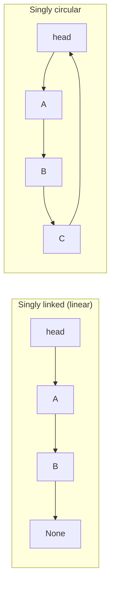
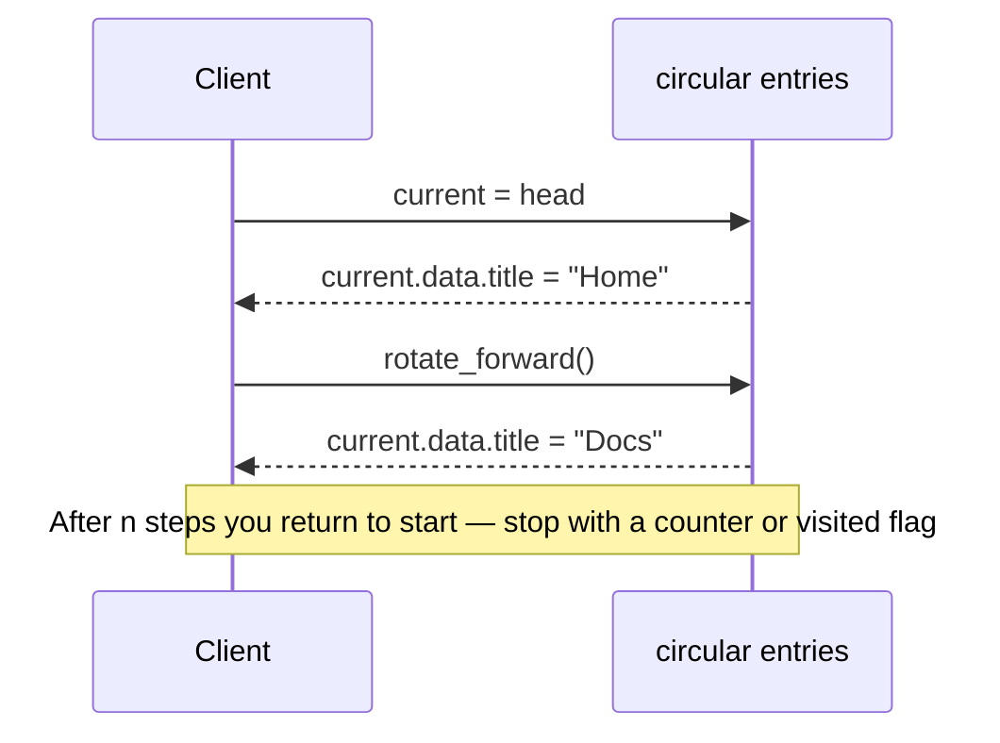
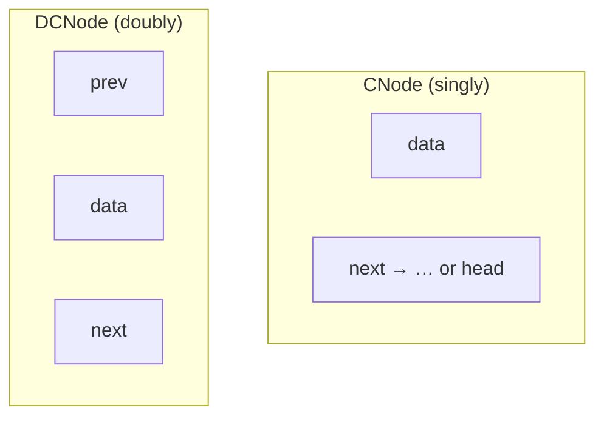
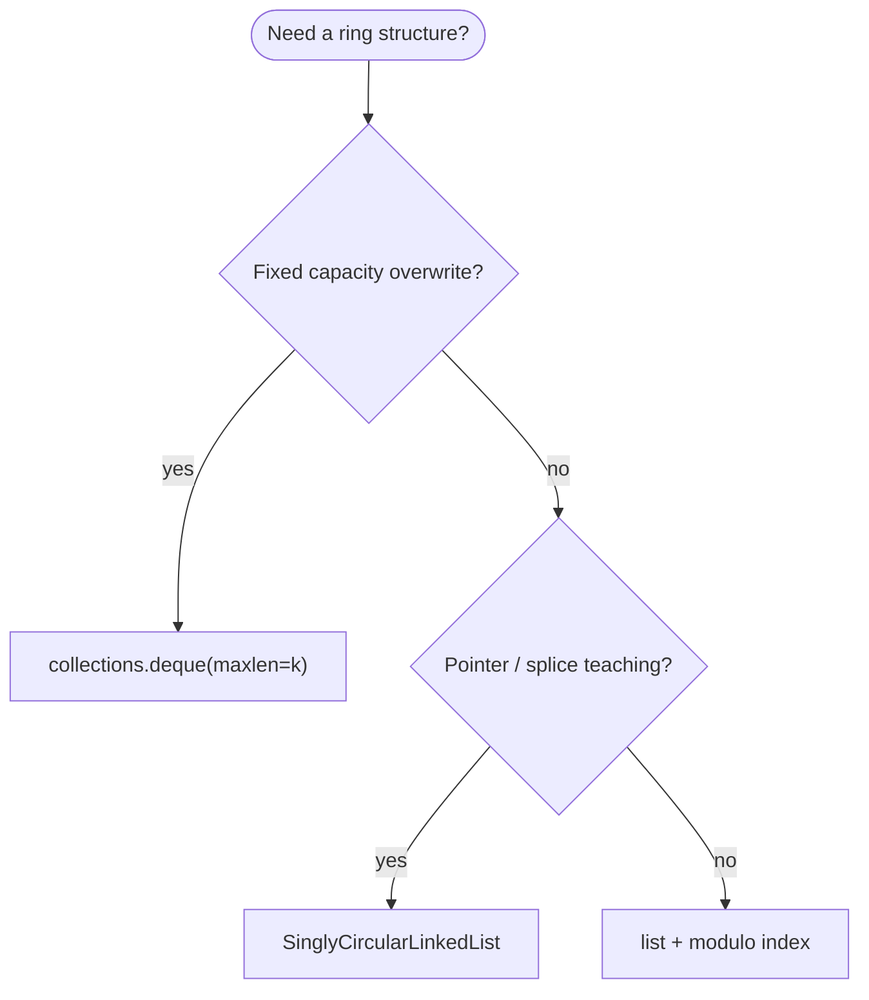
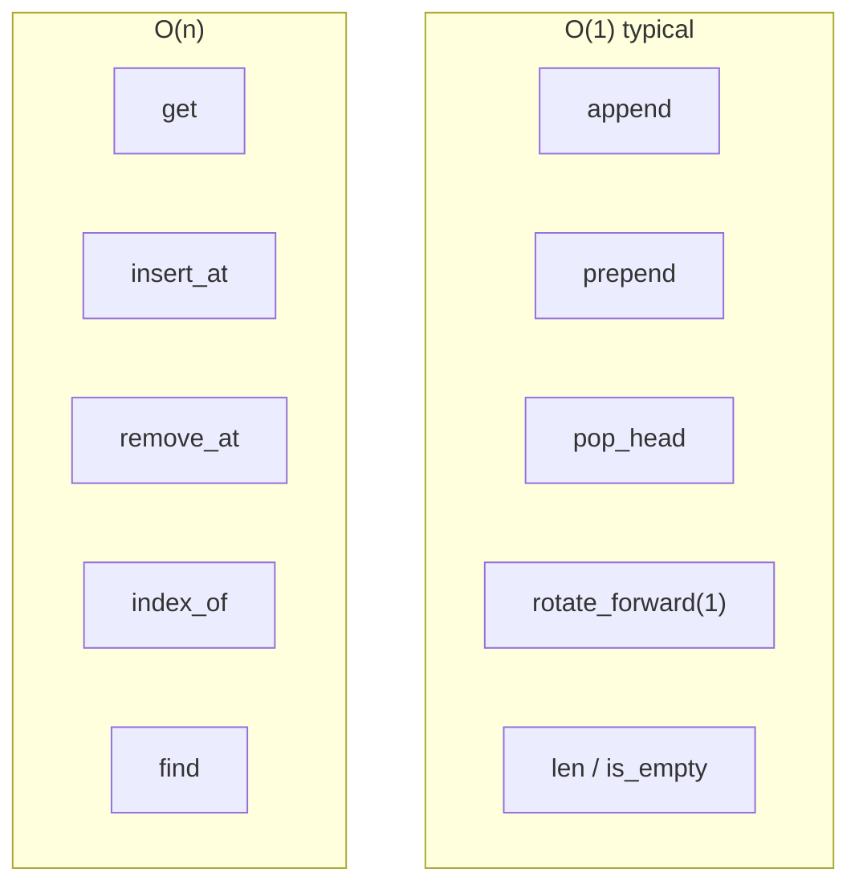
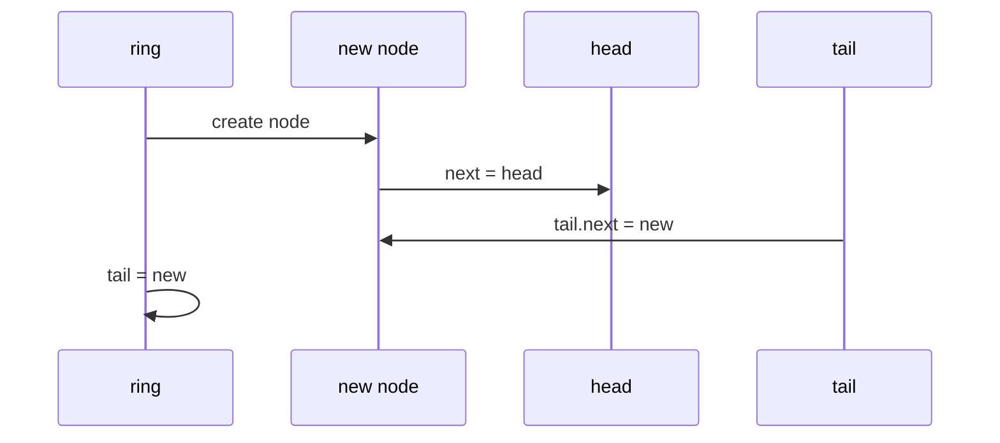
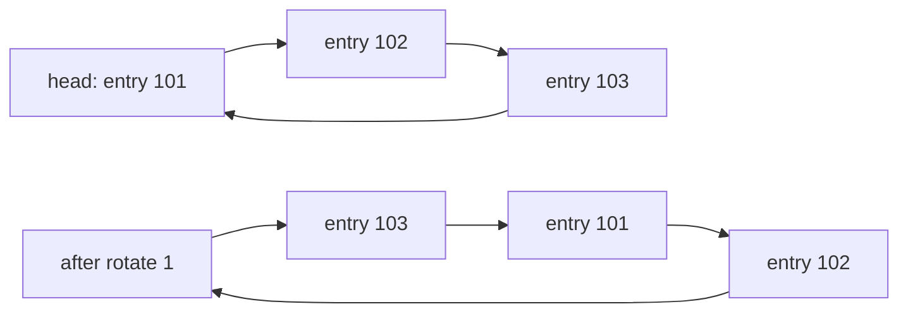
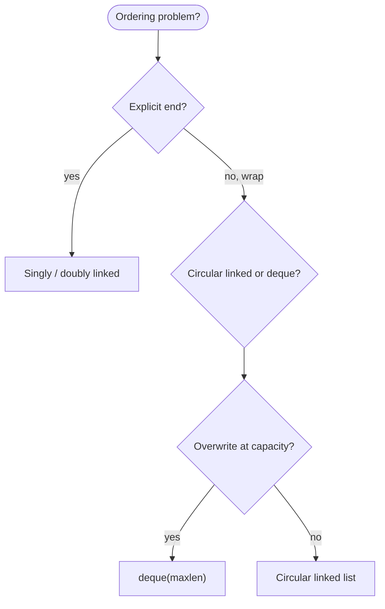

# Circularly linked list

A linked list where the **last node's `next` points back to the first**—there is no `None` at the "end" in the forward direction. The structure is a **ring**: one pointer walk eventually returns to where you started. That closed loop shows up when you **rotate through a fixed window** (tracks in a playlist, workers in a pool, slots in a round-robin buffer) without a natural end.

| | |
| --- | --- |
| **What it is** | A chain that closes on itself: singly circular (`last.next → head`) or doubly circular (`head.prev → tail` and `tail.next → head`). |
| **Core operations** | Rotate the “current” pointer, iterate with a stop at `head`, insert/delete with careful predecessor logic. |
| **When to use** | Round-robin worker order, bounded play-history ring buffers, playlist carousel iteration, or any cycle where you advance a cursor without reallocating. |
| **Trade-off** | Easy to loop forever if you forget a stop condition; no O(1) random access by index; extra pointer discipline vs a Python `list` modulo index. |

A circular list is a natural model for **repeating cycles with no true end**: rotating through **tracks in a playlist carousel**, stepping **workers** in a fixed order in a round-robin pool, or a **fixed-size ring buffer** of the last *k* playlist slots where the oldest entry is overwritten when the ring wraps. You still store full libraries in a **`list`** or database—the ring is for **bounded, repeating** order on small *n*.

This page is your **ready reference**: singly and doubly circular variants, every way to create them in Python, a complete implementation, operation-by-operation examples with **time and space complexity**, and when to prefer stdlib tools. For Big-O notation and problem-scale *n*, see [Complexity analysis](../../complexity/index.md).

[Parent: Data structures](../index.md)

---

## How a circular list differs from linear linked lists

| | **Singly circular** | [Singly linked](../linked-list/index.md) | [Doubly circular](../doubly-linked-list/index.md) + ring |
| --- | --- | --- | --- |
| **End of chain** | `tail.next == head` | `tail.next == None` | `tail.next == head`, `head.prev == tail` |
| **Empty list** | `head is None` | `head is None` | `head is None` |
| **Traverse all *n*** | Stop when back at start | Stop at `None` | Stop when back at start; can walk backward |
| **Rotate “current”** | O(1) advance `cur = cur.next` | N/A (linear end) | O(1) forward or backward |
| **Delete tail (singly)** | O(n) — need predecessor | O(n) | O(1) with `prev` |
| **Typical fit** | Round-robin worker cursor, ring of buffer slots | Drive chain with clear end | Bidirectional history scrubber on a loop |



Throughout this page, **n** is the number of nodes in the ring (e.g. items in one buffer, slots in a rotation, or buffer capacity). **i** is a zero-based index from an arbitrary start (usually `head`). In production apps, **n** per ring is often small (one bounded buffer, one dashboard session) while total table rows in an archive live in tables.

---

## Practical applications: what a circular list models

| Application idea | Circular view | Typical *n* |
| --- | --- | --- |
| **Playlist rotation carousel** | Each node = track label; advance `current` each step | 12 |
| **Round-robin worker rotation** | Fixed order of workers in a pool; wrap after last | 4–20 |
| **Play-history ring buffer** | Fixed *k* slots; overwrite oldest track on wrap | *k* = 10–100 |
| **Browser history carousel** | Cycle items in one buffer; no "end" in UI | items in buffer |
| **Scheduler tick** | Advance pointer through time windows | slots per cycle |

**Reach for `list` + modulo** (`tracks[i % len(tracks)]`) when you only need index math on a static table. **Reach for a circular linked list** when the ADT is **cursor + splice** (insert after current, rotate, delete current) or you are learning pointer cycles. **Reach for `collections.deque(maxlen=k)`** when you need a production ring buffer without hand-rolled nodes.

```python
from dataclasses import dataclass


@dataclass
class PlaylistTrack:
    track_id: int
    disc: int
    duration_ms: float
    title: str
```

---

## Mental model: head, tail, and the closing link

**Singly circular (non-empty):**

- `head` — entry point (convention; any node can serve as “head”).
- `tail` — last node in insertion order; **`tail.next is head`**.
- **Empty:** `head is None` (and usually `tail is None`).

**Doubly circular (non-empty):**

- `head.prev is tail` and `tail.next is head`.
- **Empty:** `head is None`.



| Kind | What you pay for | Circular examples | Application example |
| --- | --- | --- | --- |
| **Rotate cursor** | O(1) one `next` hop | `rotate_forward()` | Next item in dashboard carousel |
| **Traverse all** | O(n) with stop at head | `__iter__` | List all items in one buffer once |
| **Insert after cursor** | O(1) if you hold cursor | splice | Insert corrected entry after current item |
| **Find by value** | O(n) worst case | `index_of` | Locate `PlaylistTrack(102, …)` in ring |

---

## Node definitions

### Singly circular node

```python
from __future__ import annotations

from dataclasses import dataclass
from typing import Any, Iterable, Iterator


@dataclass
class CNode:
    data: Any
    next: CNode | None = None
```

| | |
| --- | --- |
| **Time** | O(1) to construct |
| **Space** | O(1) per node |

### Doubly circular node

```python
@dataclass
class DCNode:
    data: Any
    prev: DCNode | None = None
    next: DCNode | None = None
```

| | |
| --- | --- |
| **Time** | O(1) to construct |
| **Space** | O(1) per node (two links) |



---

## Ways to create a circularly linked list

### 1. Empty list

```python
head: CNode | None = None
tail: CNode | None = None
```

| | |
| --- | --- |
| **Time** | O(1) |
| **Space** | O(1) |

### 2. Empty `SinglyCircularLinkedList` wrapper

```python
class SinglyCircularLinkedList:
    def __init__(self) -> None:
        self.head: CNode | None = None
        self.tail: CNode | None = None
        self._size = 0

ring = SinglyCircularLinkedList()
assert ring.is_empty()
```

| | |
| --- | --- |
| **Time** | O(1) |
| **Space** | O(1) |

### 3. Single-node ring (degenerate circle)

```python
node = CNode(PlaylistTrack(101, 2, 0.4, "Home"))
node.next = node
head = tail = node
```

| | |
| --- | --- |
| **Time** | O(1) |
| **Space** | O(1) |

### 4. Build from iterable — append at tail, close ring

Preserves input order; after the loop, `tail.next = head`.

```python
def ring_from_iterable(items: Iterable[Any]) -> SinglyCircularLinkedList:
    ring = SinglyCircularLinkedList()
    for item in items:
        ring.append(item)
    return ring

sample_tracks = [
    PlaylistTrack(101, 2, 0.4, "Home"),
    PlaylistTrack(102, 2, -1.2, "Docs"),
    PlaylistTrack(103, 2, 0.1, "Settings"),
    PlaylistTrack(104, 2, 0.2, "About"),
]
rotation = ring_from_iterable(sample_tracks)
```

| | |
| --- | --- |
| **Time** | O(k) for *k* items |
| **Space** | O(k) nodes |

### 5. Build by linking last to first manually

```python
nodes = [CNode(r) for r in sample_tracks]
for i in range(len(nodes) - 1):
    nodes[i].next = nodes[i + 1]
nodes[-1].next = nodes[0]
head, tail = nodes[0], nodes[-1]
```

| | |
| --- | --- |
| **Time** | O(k) |
| **Space** | O(k) |

### 6. `collections.deque` as a practical ring buffer

Not a linked list, but the practical stdlib tool for fixed windows:

```python
from collections import deque

recent_plays: deque[str] = deque(maxlen=10)
recent_plays.append("Home")
recent_plays.append("Docs")
```

| | |
| --- | --- |
| **Time** | O(1) append |
| **Space** | O(maxlen) |

### 7. Python `list` + modulo index (static rotation table)

```python
tracks = ["Home", "Docs", "Settings", "About"]
i = 0
current = tracks[i % len(tracks)]
i += 1
```

| | |
| --- | --- |
| **Time** | O(1) index |
| **Space** | O(n) array |



---

## Reference implementation: `SinglyCircularLinkedList`

Complete class with head, tail, cached size, and safe iteration.

```python
class SinglyCircularLinkedList:
    def __init__(self, items: Iterable[Any] | None = None) -> None:
        self.head: CNode | None = None
        self.tail: CNode | None = None
        self._size = 0
        if items is not None:
            self.extend(items)

    def _close_ring(self) -> None:
        if self.tail is not None and self.head is not None:
            self.tail.next = self.head

    def is_empty(self) -> bool:
        return self._size == 0

    def __len__(self) -> int:
        return self._size

    def append(self, data: Any) -> None:
        node = CNode(data)
        if self.head is None:
            self.head = self.tail = node
            node.next = node
        else:
            assert self.tail is not None
            node.next = self.head
            self.tail.next = node
            self.tail = node
        self._size += 1

    def prepend(self, data: Any) -> None:
        node = CNode(data)
        if self.head is None:
            self.head = self.tail = node
            node.next = node
        else:
            assert self.tail is not None
            node.next = self.head
            self.tail.next = node
            self.head = node
        self._size += 1

    def insert_after(self, pivot_data: Any, data: Any) -> None:
        pivot = self._find_node(pivot_data)
        if pivot is None:
            raise ValueError(f"{pivot_data!r} not in ring")
        node = CNode(data, next=pivot.next)
        pivot.next = node
        if pivot is self.tail:
            self.tail = node
        self._size += 1

    def insert_at(self, index: int, data: Any) -> None:
        if index < 0 or index > self._size:
            raise IndexError("index out of range")
        if index == 0:
            self.prepend(data)
            return
        prev = self._node_at(index - 1)
        node = CNode(data, next=prev.next)
        prev.next = node
        if prev is self.tail:
            self.tail = node
        self._size += 1

    def remove_first(self, data: Any) -> bool:
        if self.head is None:
            return False
        if self._size == 1 and self.head.data == data:
            self.clear()
            return True
        if self.head.data == data:
            assert self.tail is not None
            self.head = self.head.next
            self.tail.next = self.head
            self._size -= 1
            return True
        cur = self.head
        for _ in range(self._size - 1):
            assert cur.next is not None
            nxt = cur.next
            if nxt.data == data:
                cur.next = nxt.next
                if nxt is self.tail:
                    self.tail = cur
                self._size -= 1
                return True
            cur = nxt
        return False

    def remove_at(self, index: int) -> Any:
        if index < 0 or index >= self._size:
            raise IndexError("index out of range")
        if self._size == 1:
            data = self.head.data
            self.clear()
            return data
        if index == 0:
            return self.pop_head()
        prev = self._node_at(index - 1)
        assert prev.next is not None
        victim = prev.next
        data = victim.data
        prev.next = victim.next
        if victim is self.tail:
            self.tail = prev
        self._size -= 1
        return data

    def pop_head(self) -> Any:
        if self.head is None:
            raise IndexError("pop from empty ring")
        data = self.head.data
        if self._size == 1:
            self.clear()
            return data
        assert self.tail is not None
        self.head = self.head.next
        self.tail.next = self.head
        self._size -= 1
        return data

    def get(self, index: int) -> Any:
        return self._node_at(index).data

    def set(self, index: int, data: Any) -> None:
        self._node_at(index).data = data

    def index_of(self, data: Any) -> int:
        for i, item in enumerate(self):
            if item == data:
                return i
        raise ValueError(f"{data!r} not in ring")

    def contains(self, data: Any) -> bool:
        return self._find_node(data) is not None

    def clear(self) -> None:
        self.head = self.tail = None
        self._size = 0

    def rotate_forward(self, steps: int = 1) -> None:
        if self.head is None or steps == 0:
            return
        steps %= self._size
        for _ in range(steps):
            assert self.head is not None
            self.head = self.head.next
            self.tail = self.tail.next if self.tail else None

    def rotate_backward(self, steps: int = 1) -> None:
        if self.head is None:
            return
        self.rotate_forward(self._size - (steps % self._size))

    def to_list(self) -> list[Any]:
        return list(self)

    def extend(self, items: Iterable[Any]) -> None:
        for item in items:
            self.append(item)

    def __iter__(self) -> Iterator[Any]:
        if self.head is None:
            return
        cur = self.head
        for _ in range(self._size):
            yield cur.data
            assert cur.next is not None
            cur = cur.next

    def _node_at(self, index: int) -> CNode:
        if index < 0 or index >= self._size:
            raise IndexError("index out of range")
        cur = self.head
        for _ in range(index):
            assert cur is not None and cur.next is not None
            cur = cur.next
        assert cur is not None
        return cur

    def _find_node(self, data: Any) -> CNode | None:
        cur = self.head
        for _ in range(self._size):
            if cur is None:
                break
            if cur.data == data:
                return cur
            assert cur.next is not None
            cur = cur.next
        return None
```

**Note:** `_find_node` in the listing walks from `head`; for clarity in teaching docs the walk matches `__iter__`. Optimize hot paths by fusing search with one pass.

---

## All operations (examples + complexity)



### `is_empty()` / `len(ring)`

```python
ring = SinglyCircularLinkedList()
assert ring.is_empty()
ring.append(PlaylistTrack(101, 2, 0.4, "Home"))
assert len(ring) == 1
```

| | |
| --- | --- |
| **Time** | O(1) with cached `_size` |
| **Space** | O(1) |

---

### `append(data)` — add after current tail, close ring

```python
ring = SinglyCircularLinkedList()
ring.append(PlaylistTrack(101, 2, 0.4, "Home"))
ring.append(PlaylistTrack(102, 2, -1.2, "Docs"))
assert len(ring) == 2
assert ring.tail.next is ring.head
```

| | |
| --- | --- |
| **Time** | O(1) |
| **Space** | O(1) one node |



---

### `prepend(data)` — insert before head

```python
ring = SinglyCircularLinkedList([PlaylistTrack(102, 2, -1.2, "Docs")])
ring.prepend(PlaylistTrack(101, 2, 0.4, "Home"))
assert ring.get(0).track_id == 101
```

| | |
| --- | --- |
| **Time** | O(1) |
| **Space** | O(1) |

---

### `insert_after(pivot_data, data)` — splice after a known value

**Application use:** Insert a **reordered track** after a specific playlist item in a rotation sketch.

```python
ring = SinglyCircularLinkedList([
    PlaylistTrack(101, 2, 0.4, "Home"),
    PlaylistTrack(103, 2, 0.1, "Settings"),
])
ring.insert_after(
    PlaylistTrack(101, 2, 0.4, "Home"),
    PlaylistTrack(102, 2, -1.2, "Docs"),
)
```

| | |
| --- | --- |
| **Time** | O(n) find pivot + O(1) splice |
| **Space** | O(1) |

---

### `insert_at(index, data)`

Index `0` → `prepend`; otherwise walk to predecessor.

| | |
| --- | --- |
| **Time** | O(n) |
| **Space** | O(1) |

---

### `get(index)` / `set(index, data)`

| | |
| --- | --- |
| **Time** | O(n) worst case |
| **Space** | O(1) |

---

### `pop_head()` / `remove_at(index)` / `remove_first(value)`

Always repair `tail.next = head` after head changes.

```python
ring = SinglyCircularLinkedList(["A", "B", "C"])
assert ring.pop_head() == "A"
assert len(ring) == 2
```

| Operation | **Time** | **Space** |
| --- | --- | --- |
| `pop_head` | O(1) | O(1) |
| `remove_at` | O(n) | O(1) |
| `remove_first` | O(n) | O(1) |

---

### `rotate_forward(steps)` / `rotate_backward(steps)`

**Application use:** Advance **current item on a carousel** without rebuilding the list.

```python
ring = SinglyCircularLinkedList([
    PlaylistTrack(101, 2, 0.4, "Home"),
    PlaylistTrack(102, 2, -1.2, "Docs"),
    PlaylistTrack(103, 2, 0.1, "Settings"),
])
ring.rotate_forward(1)
assert ring.get(0).track_id == 102
ring.rotate_forward(3)
assert ring.get(0).track_id == 101
```

| | |
| --- | --- |
| **Time** | O(steps) singly; O(1) for one step |
| **Space** | O(1) |



---

### `contains` / `index_of`

| | |
| --- | --- |
| **Time** | O(n) — at most one lap |
| **Space** | O(1) |

---

### `clear()` / `extend` / `to_list` / iteration

```python
for entry in ring:
    print(entry.title)
```

| | |
| --- | --- |
| **Time** | O(n) full traverse |
| **Space** | O(n) for `to_list` output |

**Critical:** Never `while cur: cur = cur.next` without counting—on a ring you loop forever.

---

## Doubly circular linked list (sketch)

When you need **O(1) step backward**, use `prev`:

```python
class DoublyCircularLinkedList:
    def __init__(self) -> None:
        self.head: DCNode | None = None
        self._size = 0

    def append(self, data: Any) -> None:
        node = DCNode(data)
        if self.head is None:
            node.next = node.prev = node
            self.head = node
        else:
            tail = self.head.prev
            assert tail is not None
            node.next = self.head
            node.prev = tail
            tail.next = node
            self.head.prev = node
        self._size += 1

    def rotate_backward(self, steps: int = 1) -> None:
        if self.head is None:
            return
        steps %= self._size
        for _ in range(steps):
            self.head = self.head.prev
```

| Operation (doubly circular) | **Time** | **Space** |
| --- | --- | --- |
| `append` / `prepend` | O(1) | O(1) |
| `rotate_backward(1)` | O(1) | O(1) |
| `remove node with ref` | O(1) | O(1) |
| `index_of` | O(n) | O(1) |

See [Doubly linked list](../doubly-linked-list/index.md) for full doubly linked operations; add `tail.next = head` and `head.prev = tail` when closing the ring.

---

## Master complexity table

Let **n** = `len(ring)`.

| Operation | Time | Space (auxiliary) | Notes |
| --- | --- | --- | --- |
| Create empty | O(1) | O(1) | |
| Build from *k* items | O(k) | O(k) | tail append + close |
| `append` / `prepend` | O(1) | O(1) | maintain `tail.next → head` |
| `insert_after` (known pivot node) | O(1) | O(1) | O(n) if search by value |
| `insert_at(i)` | O(n) | O(1) | |
| `get` / `set` at *i* | O(n) | O(1) | |
| `pop_head` | O(1) | O(1) | |
| `remove_at` / `remove_first` | O(n) | O(1) | |
| `rotate_forward(1)` | O(1) | O(1) | move head pointer |
| `rotate_forward(k)` | O(k) | O(1) | |
| `contains` / `index_of` | O(n) | O(1) | one lap max |
| Traverse / `to_list` | O(n) | O(n) output | must use counter |
| Doubly `rotate_backward(1)` | O(1) | O(1) | needs `prev` |

**Storage:** Θ(n) nodes; singly circular pays one `next` per node; doubly pays `next` + `prev`.

---

## Classic patterns

### Floyd cycle detection (linear list vs ring)

On a **circular** structure, every traverse must stop after **n** steps. Floyd’s algorithm applies when a **broken** linear list accidentally points backward and forms a hidden cycle.

```python
def has_cycle_floyd(head: CNode | None) -> bool:
    slow = fast = head
    while fast is not None and fast.next is not None:
        slow = slow.next
        fast = fast.next.next
        if slow is fast:
            return True
    return False
```

| | |
| --- | --- |
| **Time** | O(n) |
| **Space** | O(1) |

### Round-robin fair scheduler

```python
def next_entry(ring: SinglyCircularLinkedList) -> PlaylistTrack:
    entry = ring.pop_head()
    ring.append(entry)
    return entry
```

Rotating by moving head to tail after serving is O(1) per tick—fair round-robin over workers or items in a small buffer.

| | |
| --- | --- |
| **Time** | O(1) per tick |
| **Space** | O(1) |

### Ring buffer vs circular linked list

| Need | Structure |
| --- | --- |
| Overwrite oldest at fixed capacity | `deque(maxlen=k)` or array + write index |
| Variable-size ring with splices | Circular linked list |
| Index `i % n` on static table | `list` |

---

## Python stdlib: what to use instead

| Need | Prefer | Why |
| --- | --- | --- |
| Fixed play-history window | `collections.deque(maxlen=k)` | C-speed, no pointer bugs |
| Rotate static playlist order | `list` + `% len` | Simple, cache-friendly |
| Round-robin without splices | `itertools.cycle` on a tuple | O(1) per yield, read-only |
| Large persistent archive | pandas / `list` | Not a ring |
| Learning pointer cycles | `SinglyCircularLinkedList` | Interview / ADT clarity |

```python
from itertools import cycle

tracks = ("Home", "Docs", "Settings", "About")
rot = cycle(tracks)
next(rot)
next(rot)
```

---

## Circular vs linear — decision flow



---

## Common pitfalls

| Pitfall | Why it hurts | Better approach |
| --- | --- | --- |
| Infinite `while cur = cur.next` | Never terminates on ring | Loop `for _ in range(len(ring))` or use `__iter__` |
| Forgetting `tail.next = head` after edit | Ring breaks | Centralize `_close_ring()` |
| Single-node ring not self-linked | `tail.next` is None | On first insert: `node.next = node` |
| Using circular list for full archive | O(n) per lookup | `dict` / DataFrame |
| `rotate_backward` on singly list | Needs O(n) workaround | Doubly circular or forward `n-1` steps |
| Confusing `itertools.cycle` with mutable ring | `cycle` does not splice | Custom class for insert/delete |
| Deep copy of nodes | Shared `data` objects | `copy.deepcopy` if needed |

---

## Related structures in this guide

| Structure | Relationship |
| --- | --- |
| [Linked list](../linked-list/index.md) | Linear chain; open end |
| [Doubly linked list](../doubly-linked-list/index.md) | `prev` + optional ring close |
| [Queue](../queue/index.md) | FIFO; not cyclic |
| [Dequeue (deque)](../dequeue-deque/index.md) | Practical ring buffer |
| [Array-based lists](../array-based-lists/index.md) | `i % n` rotation on arrays |

---

## Quick reference card

```python
ring = SinglyCircularLinkedList([
    PlaylistTrack(101, 2, 0.4, "Home"),
    PlaylistTrack(102, 2, -1.2, "Docs"),
])

ring.append(PlaylistTrack(103, 2, 0.1, "Settings"))
ring.prepend(PlaylistTrack(100, 2, 0.0, "backfill"))

ring.rotate_forward(1)

ring.index_of(PlaylistTrack(102, 2, -1.2, "Docs"))
ring.get(2)

tracks = ring.to_list()

for r in ring:
    ...
```

Use a **circularly linked list** when the problem is literally a **cycle**: round-robin, rotating cursor, or variable-size ring with pointer splices. Use **`deque(maxlen=k)`**, **`itertools.cycle`**, or **`list` + modulo** for most production apps where the ring is just “wrap the index.”

**Structure selection checklist**

1. **Default** — Static playlist in a `list`; rotation via index math or `cycle`.
2. **Bounded play-history window** — `deque(maxlen=k)` for last *k* rotation entries.
3. **Custom history chain with splices** — Circular linked list (small *n*).
4. **Traverse** — Always bound steps to `len(ring)`; never unbounded `next` walk.
