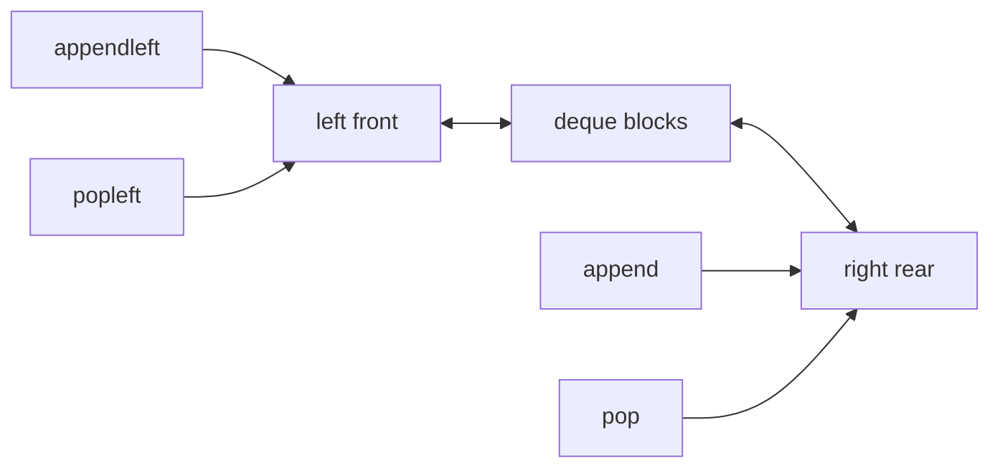
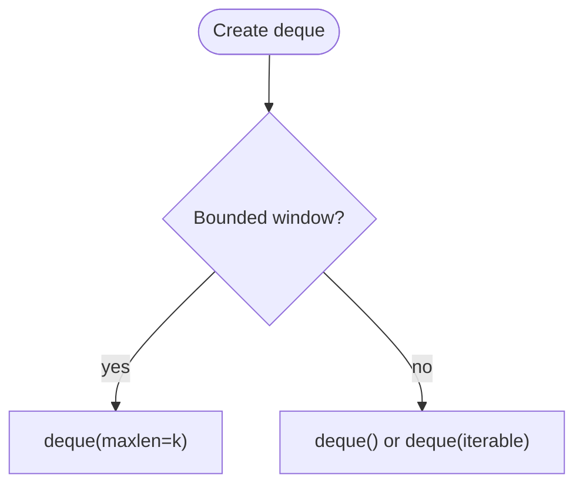
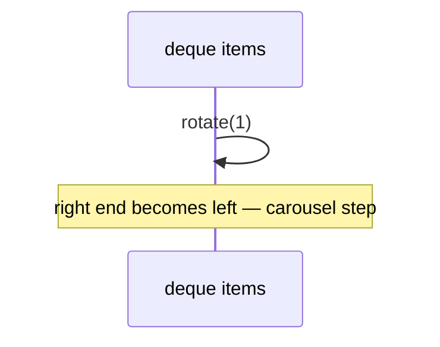
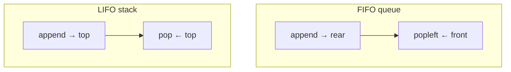
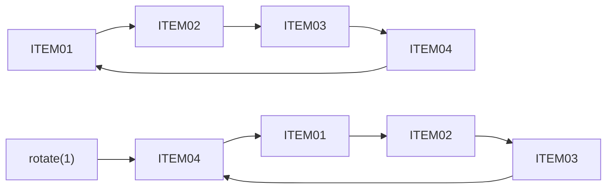

# Dequeue (deque)

A **double-ended queue** (“deck”): insert and remove at **both** front and back in O(1) time with a high-quality implementation. It generalizes both a [stack](../stacks/index.md) (LIFO at one end) and a [queue](../queue/index.md) (FIFO when you use opposite ends consistently).

| | |
| --- | --- |
| **What it is** | Push/pop at left and right; in Python, `collections.deque` is the standard realization. |
| **Core operations** | `append`, `appendleft`, `pop`, `popleft`, plus `extend`, `rotate`, `maxlen`. |
| **When to use** | Sliding metric windows, palindrome checks, BFS with push-front, steal-from-both-ends algorithms, bounded live buffers. |
| **Note** | Pronounced “deck.” Not the verb *dequeue* alone—that usually means remove from a [queue](../queue/index.md). |

In **stream processing and task pipelines**, `deque` is the workhorse for **bounded memory**: last *k* samples in a sliding window, rolling sums over fixed windows, a **queue** of export jobs at the back while high-priority backfills `appendleft`, or rotating a small list of **dashboard items**. You get O(1) at both ends without implementing a [doubly linked list](../doubly-linked-list/index.md) in pure Python.

This page is your **ready reference**: full `collections.deque` API with application examples, hand-rolled deque ADT, complexity on every operation, and when deque beats `list`. For Big-O notation, see [Complexity analysis](../../complexity/index.md).

[Parent: Data structures](../index.md)

---

## Deque vs list vs linked structures

| | **`collections.deque`** | **Python `list`** | **Doubly linked list** |
| --- | --- | --- | --- |
| **Append left/right** | O(1) | O(1) right; **O(n) left** `insert(0)` | O(1) with pointers |
| **Pop left/right** | O(1) | O(1) right; **O(n) left** `pop(0)` | O(1) |
| **Index `d[i]`** | O(n) | O(1) | O(n) |
| **Slice** | No | Yes | No |
| **maxlen ring** | Built-in | Manual | Manual |
| **Typical fit** | Live windows, FIFO | Column access, stats | Teaching / interviews |



Throughout this page, **n** is `len(d)`.

---

## Application patterns: what a deque models

| Use case | Deque pattern | API sketch |
| --- | --- | --- |
| **Last 10 samples** | `deque(maxlen=10)` | auto-drop oldest on `append` |
| **FIFO task queue** | `append` + `popleft` | [Queue](../queue/index.md) |
| **Undo at stack end** | `append` + `pop` | [Stack](../stacks/index.md) |
| **Insert urgent backfill front** | `appendleft` | priority front without full heap |
| **Rotate item list** | `rotate(1)` | dashboard carousel |
| **Palindrome token sequence** | pop both ends | `"a-b-b-a"` style checks |

```python
from collections import deque
from dataclasses import dataclass

@dataclass(frozen=True)
class DataRecord:
 record_id = 0
 value = 0.0
 label = ""

@dataclass(frozen=True)
class NamedItem:
 item_id = ""
 name = ""
```

---

## Ways to create a deque in Python

### 1. Empty `deque`

```python
from collections import deque

d= deque()
```

| | |
| --- | --- |
| **Time** | O(1) |
| **Space** | O(1) empty |

### 2. From iterable (records in chronological order)

```python
d = deque([
 DataRecord(1, 0.1, "sample_a"),
 DataRecord(2, 0.8, "sample_b"),
])
```

| | |
| --- | --- |
| **Time** | O(k) for k items |
| **Space** | O(k) |

### 3. Bounded `maxlen` — ring buffer

```python
window_last_5= deque(maxlen=5)
for value in [0.1, -0.3, 0.9, 0.2, 1.1, 0.0]:
 window_last_5.append(value)
```

| | |
| --- | --- |
| **Time** | O(1) per `append` (drops left when full) |
| **Space** | O(maxlen) |

### 4. With `maxlen=0` or invalid — avoid

`maxlen` must be `None` or positive; use `maxlen=None` for unbounded.

### 5. Copy constructor

```python
d2 = deque(d, maxlen=10)
```

| | |
| --- | --- |
| **Time** | O(n) |
| **Space** | O(n) |

### 6. Hand-rolled `Deque` ADT (teaching)

See [Reference implementation](#reference-implementation-dequeadt) — wraps `collections.deque`.



---

## `collections.deque` — full API reference

Official docs: [collections.deque](https://docs.python.org/3/library/collections.html#collections.deque).

### Adding elements

| Method | Side | Time | Example |
| --- | --- | --- | --- |
| `append(x)` | right | O(1) | New record enters processing queue |
| `appendleft(x)` | left | O(1) | Urgent backfill inserted at front |
| `extend(iterable)` | right | O(k) | Bulk enqueue k records |
| `extendleft(iterable)` | left | O(k) | Note: reverses order of iterable |

```python
jobs= deque()
jobs.append("export_node01_metrics")
jobs.appendleft("backfill_4021_now")
jobs.extend(["export_node02", "export_node03"])
```

```python
d = deque()
d.extendleft([1, 2, 3])
list(d)
```

| `extendleft` | **Time** | **Space** |
| --- | --- | --- |
| k items | O(k) | O(1) aux |

---

### Removing elements

| Method | Side | Time | Raises if empty |
| --- | --- | --- | --- |
| `pop()` | right | O(1) | `IndexError` |
| `popleft()` | left | O(1) | `IndexError` |
| `clear()` | all | O(n) | — |

```python
job = jobs.popleft()
last = jobs.pop()
```

| | |
| --- | --- |
| **Time** | O(1) per pop |
| **Space** | O(1) |

---

### Inspecting without removal

```python
d = deque([DataRecord(1, 0.0, "idle"), DataRecord(2, 0.1, "busy")])
assert d[0].record_id == 1
assert d[-1].record_id == 2
len(d)
```

| `d[i]` | **Time** | Notes |
| --- | --- | --- |
| index access | O(n) | both ends faster in C implementation but still linear in theory for middle |

Use `d[0]` and `d[-1]` for peek front/rear in O(1) in practice for ends.

---

### Rotation

```python
items= deque(["ITEM01", "ITEM02", "ITEM03", "ITEM04"])
items.rotate(1)
items.rotate(-1)
```

| `rotate(k)` | **Time** | **Space** |
| --- | --- | --- |
| | O(k) or O(min(k, n-k)) in CPython | O(1) |

**Example:** Rotate **featured items** in a sidebar without rebuilding the list.



---

### `maxlen` behavior

When full, `append` drops left; `appendleft` drops right.

```python
window= deque(maxlen=3)
window.append(1.0)
window.append(2.0)
window.append(3.0)
window.append(4.0)
list(window)
```

| | |
| --- | --- |
| **Time** | O(1) |
| **Space** | O(maxlen) |

**Example:** Rolling **metric values** or throughput rate for the last *k* samples in a bounded window.

---

### Thread safety

`deque` is **not** fully thread-safe for all compound operations, but:

- `append` and `popleft` are atomic in CPython due to GIL for single-bytecode ops.
- For producer/consumer across threads, prefer `queue.Queue`.

| Scenario | Recommendation |
| --- | --- |
| Single-threaded ETL | `deque` |
| Multi-thread workers | `queue.Queue` |

---

### Iteration and copying

```python
for record in d:
 ...
reversed_d = deque(reversed(d))
d_copy = deque(d)
```

| Operation | **Time** | **Space** |
| --- | --- | --- |
| iterate | O(n) | O(1) |
| `deque(reversed(d))` | O(n) | O(n) |

---

### `remove(value)` and `count(value)`

```python
d.remove(DataRecord(2, 0.1, "busy"))
d.count(DataRecord(2, 0.1, "busy"))
```

| | |
| --- | --- |
| **Time** | O(n) |
| **Space** | O(1) |

Equality must match; frozen `DataRecord` dataclasses work if same fields.

---

## Reference implementation: `DequeADT`

Wrapper documenting both-end semantics for learners.

```python

from collections import deque

class DequeADT:
 def __init__(self, items= None, maxlen= None):
 self._d= deque(items, maxlen=maxlen)

 def __len__(self):
 return len(self._d)

 def is_empty(self):
 return len(self._d) == 0

 def push_back(self, item):
 self._d.append(item)

 def push_front(self, item):
 self._d.appendleft(item)

 def pop_back(self):
 if not self._d:
 raise IndexError("pop from empty deque")
 return self._d.pop()

 def pop_front(self):
 if not self._d:
 raise IndexError("popleft from empty deque")
 return self._d.popleft()

 def peek_back(self):
 if not self._d:
 raise IndexError("peek back empty")
 return self._d[-1]

 def peek_front(self):
 if not self._d:
 raise IndexError("peek front empty")
 return self._d[0]

 def rotate(self, n= 1):
 self._d.rotate(n)

 def clear(self):
 self._d.clear()

 def __iter__(self):
 yield from self._d

 def to_list(self):
 return list(self._d)
```

---

## Map deque methods to stack and queue

| ADT | Push | Pop | Peek |
| --- | --- | --- | --- |
| Stack (top = right) | `append` | `pop` | `d[-1]` |
| Queue (FIFO) | `append` | `popleft` | `d[0]` |
| Stack (top = left) | `appendleft` | `popleft` | `d[0]` |

Pick one convention per module and document it.



---

## Application patterns with deque

### Rolling score window (maxlen)

```python
def rolling_mean(scores, k):
 window= deque(maxlen=k)
 means= []
 for x in scores:
 window.append(x)
 means.append(sum(window) / len(window))
 return means
```

| | |
| --- | --- |
| **Time** | O(n · k) naive sum; O(n) with running sum |
| **Space** | O(k) |

### BFS with deque (grid or graph)

```python
def bfs_zero(grid, start):
 rows, cols = len(grid), len(grid[0])
 q= deque([start])
 grid[start[0]][start[1]] = 1
 dist = 0
 while q:
 for _ in range(len(q)):
 r, c = q.popleft()
 if grid[r][c] == 9:
 return dist
 for dr, dc in ((0, 1), (0, -1), (1, 0), (-1, 0)):
 nr, nc = r + dr, c + dc
 if 0 <= nr < rows and 0 <= nc < cols and grid[nr][nc] == 0:
 grid[nr][nc] = 1
 q.append((nr, nc))
 dist += 1
 return -1
```

| | |
| --- | --- |
| **Time** | O(rows · cols) |
| **Space** | O(frontier) |

### Palindrome token sequence (both ends)

```python
def is_palindrome_tokens(tokens):
 while len(tokens) > 1:
 if tokens.popleft() != tokens.pop():
 return False
 return True

d = deque(["a", "b", "b", "a"])
assert is_palindrome_tokens(d)
```

| | |
| --- | --- |
| **Time** | O(n) |
| **Space** | O(1) extra |

### Monotonic deque — sliding window maximum score

```python
def sliding_max(scores, k):
 dq= deque()
 out= []
 for i, x in enumerate(scores):
 while dq and scores[dq[-1]] <= x:
 dq.pop()
 dq.append(i)
 if dq[0] <= i - k:
 dq.popleft()
 if i >= k - 1:
 out.append(scores[dq[0]])
 return out
```

| | |
| --- | --- |
| **Time** | O(n) |
| **Space** | O(k) |

---

## Master complexity table

| Operation | Time | Space (aux) |
| --- | --- | --- |
| `append` / `appendleft` | O(1) | O(1) |
| `pop` / `popleft` | O(1) | O(1) |
| `extend` / `extendleft` | O(k) | O(1) |
| `rotate(k)` | O(k)* | O(1) |
| `maxlen` append | O(1) | O(1) |
| `d[i]` middle | O(n) | O(1) |
| `d[0]`, `d[-1]` | O(1) | O(1) |
| `remove` / `count` | O(n) | O(1) |
| iterate | O(n) | O(1) |
| copy `deque(d)` | O(n) | O(n) |

**Storage:** Θ(n) or Θ(maxlen) when bounded.

---

## Python stdlib vs custom doubly linked list

| Need | Use |
| --- | --- |
| Production application scripts | `collections.deque` |
| Interview “implement deque” | Doubly linked nodes + head/tail |
| Random access by index in hot loop | `list` |
| Sorted archive table | pandas |

---

## When to use deque vs list vs queue.Queue


| Pitfall | Fix |
| --- | --- |
| `insert(0)` on list | `appendleft` on deque |
| `pop(0)` on list | `popleft` |
| `extendleft` order surprise | Remember reversal |
| Huge `rotate(n)` | `n %= len(d)` mentally |
| Storing archive in deque | Use DataFrame; deque for windows |

---

## Worked example: replay buffer

Model the last **20** records of a stream with automatic eviction:

```python
from collections import deque

replay_buffer= deque(maxlen=20)

def on_new_record(record):
 replay_buffer.append(record)

def last_k_values(k):
 return [r.value for r in list(replay_buffer)[-k:]]
```

| Step | `len` | Oldest retained |
| --- | --- | --- |
| append 21st record | 20 | 2nd record dropped |


---

## `DequeADT` — full method map

| Method | `deque` equivalent | Time |
| --- | --- | --- |
| `push_back` | `append` | O(1) |
| `push_front` | `appendleft` | O(1) |
| `pop_back` | `pop` | O(1) |
| `pop_front` | `popleft` | O(1) |
| `peek_back` | `[-1]` | O(1) |
| `peek_front` | `[0]` | O(1) |
| `rotate` | `rotate` | O(k) |
| `clear` | `clear` | O(n) drop refs |
| `to_list` | `list(d)` | O(n) |

---

## Chaining two bounded windows

Label window plus value window:

```python
tags= deque(maxlen=50)
values= deque(maxlen=50)

def ingest(record):
 tags.append("active" if record.value > 0.5 else "idle")
 values.append(record.value)

def active_rate():
 if not tags:
 return 0.0
 return sum(1 for t in tags if t == "active") / len(tags)
```

| | |
| --- | --- |
| **Time** | O(maxlen) per rate call if recomputed |
| **Space** | O(maxlen) each |

Maintain running counts if you need O(1) rate after each ingest.

---

## `extend` vs loop `append`

```python
d= deque()
d.extend(records_from_batch)
for r in records_from_batch:
 d.append(r)
```

| | |
| --- | --- |
| **Time** | O(k) |
| **Space** | O(1) aux |

---

## Internal model (CPython, conceptual)

`collections.deque` uses a **block array of pointers**—not a pure linked list in Python space. That is why both ends are O(1) with good constants and why **middle index** is still slow.

| Structure | Implementation level | Both-end O(1) |
| --- | --- | --- |
| `list` | contiguous dynamic array | No (left) |
| `deque` | block deque in C | Yes |
| hand-rolled doubly linked | Python objects | Yes, slower constants |

---

## Export job deque with `maxlen` on pending

Cap pending jobs so a slow renderer does not exhaust RAM:

```python
from dataclasses import dataclass
from collections import deque

@dataclass(frozen=True)
class RenderJob:
 target_id = ""
 batch = 0
 chart = ""

pending= deque(maxlen=100)
pending.append(RenderJob("node05", 2024, "latency_chart"))
```

| Policy | Behavior |
| --- | --- |
| Drop oldest | `maxlen` deque |
| Block producer | `Queue(maxsize=100)` |
| Unbounded | Risk OOM |

---

## Side-by-side: `list` vs `deque` for stream ingest

| Action | `list` | `deque` |
| --- | --- | --- |
| Add newest record at end | `append` O(1) | `append` O(1) |
| Process oldest first | `pop(0)` **O(n)** | `popleft` O(1) |
| Insert urgent at front | `insert(0, x)` **O(n)** | `appendleft` O(1) |
| Index `records[i]` in loop | O(1) | O(n) at ends only fast |
| Slice `records[10:20]` | Yes | No slice on deque |

```python
def drain_list_bad(q):
 while q:
 process(q.pop(0))

def drain_deque_good(q):
 while q:
 process(q.popleft())
```

---

## `rotate` and carousel rotation (detailed)

```python
item_rotation= deque(
 ["ITEM01", "ITEM02", "ITEM03", "ITEM04"]
)
item_rotation.rotate(1)
item_rotation.rotate(-1)
```

| `rotate(n)` | Effect |
| --- | --- |
| `n > 0` | Right rotation: tail moves toward head |
| `n < 0` | Left rotation |
| `n == 0` | No-op |

For **n** items, `rotate(k)` is O(k); use `k %= len(d)` mentally when k can be huge.



---

## Combining stack and queue on one deque

Document your convention in module docstring:

```python
history= deque()
history.append(edit)
history.pop()

fifo= deque()
fifo.append(record)
fifo.popleft()
```

Mixing both patterns on the **same** deque without discipline causes subtle bugs.

---

## `__getitem__` and slicing limitations

```python
d = deque([DataRecord(i, 0.0, "idle") for i in range(5)])
assert d[0].record_id == 0
assert d[-1].record_id == 4
middle = list(d)[1:3]
```

| Access | Time |
| --- | --- |
| `d[0]`, `d[-1]` | O(1) at ends in practice |
| `d[i]` middle | O(n) |
| slice | Not supported — materialize `list(d)` |

For replay UIs that need **random access** to record index *i* in a buffer, keep a **`list`** alongside a `deque` window, or use only `list` for the full batch.

---

## Official documentation

Python’s deque is documented in the standard library: [collections.deque](https://docs.python.org/3/library/collections.html#collections.deque). Prefer that page for edge cases (thread safety notes, version changes) alongside this guide’s application-oriented patterns.

| Doc topic | Why read it |
| --- | --- |
| `maxlen` | Exact drop behavior on both ends |
| `rotate` | Sign of *n* and empty deque |
| Thread safety | Which ops are atomic under GIL |

---

## Related structures in this guide

| Structure | Link |
| --- | --- |
| [Queue](../queue/index.md) | FIFO via `append` + `popleft` |
| [Stacks](../stacks/index.md) | LIFO via `append` + `pop` |
| [Doubly linked list](../doubly-linked-list/index.md) | Conceptual basis for deque |
| [Circularly linked list](../circularly-linked-list/index.md) | Ring buffers |

---

## Quick reference card

```python
from collections import deque

q= deque()
q.append(record)
p = q.popleft()

w= deque(maxlen=10)
w.append(record.value)

d = deque(["ITEM01", "ITEM02"])
d.appendleft("ITEM03")
d.rotate(1)

st= deque()
st.append(record)
st.pop()
```

Use **`collections.deque`** whenever you need **O(1) at both ends**—queues, stacks, rolling sliding windows, rotations, and BFS. Avoid **`list.pop(0)`** and **`list.insert(0, ...)`** in performance-sensitive ingest paths.

**Application checklist**

1. **Rolling metrics** — `deque(maxlen=k)`.
2. **FIFO queue** — `append` + `popleft`.
3. **Urgent front insert** — `appendleft` once, not `list.insert(0)`.
4. **Carousel** — `rotate` on small item deques.
