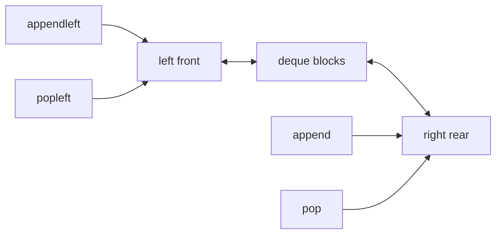
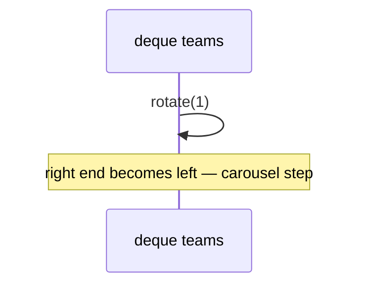
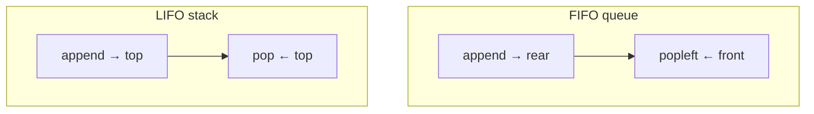
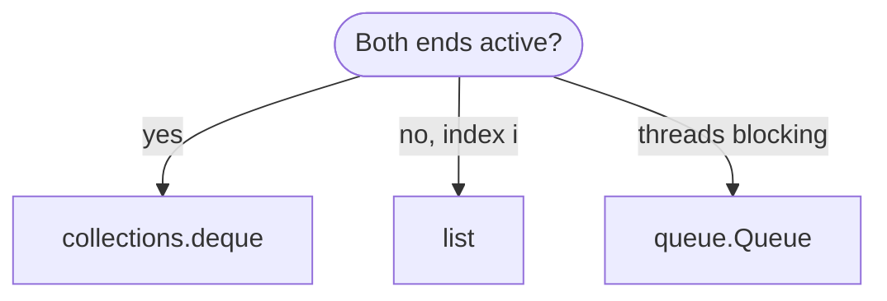
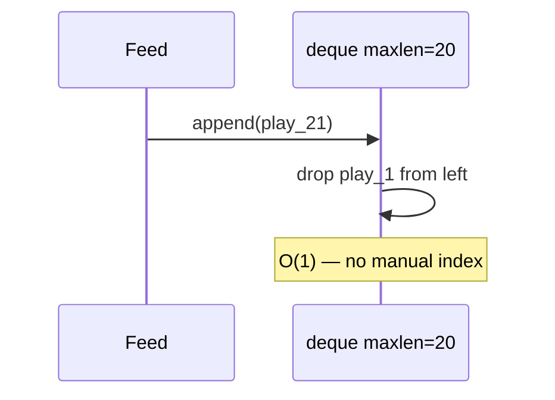
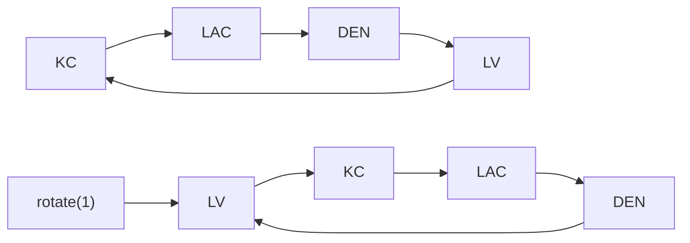

# Dequeue (deque)

A **double-ended queue** (“deck”): insert and remove at **both** front and back in O(1) time with a high-quality implementation. It generalizes both a [stack](../stacks/index.md) (LIFO at one end) and a [queue](../queue/index.md) (FIFO when you use opposite ends consistently).

| | |
| --- | --- |
| **What it is** | Push/pop at left and right; in Python, `collections.deque` is the standard realization. |
| **Core operations** | `append`, `appendleft`, `pop`, `popleft`, plus `extend`, `rotate`, `maxlen`. |
| **When to use** | Sliding EPA windows, palindrome checks, BFS with push-front, steal-from-both-ends algorithms, bounded live buffers. |
| **Note** | Pronounced “deck.” Not the verb *dequeue* alone—that usually means remove from a [queue](../queue/index.md). |

In **NFL data analysis**, `deque` is the workhorse for **bounded memory**: last *k* plays’ EPA values, rolling success-rate windows, a **queue** of export jobs at the back while high-priority replays `appendleft`, or rotating a small list of **bye-week candidates**. You get O(1) at both ends without implementing a [doubly linked list](../doubly-linked-list/index.md) in pure Python.

This page is your **ready reference**: full `collections.deque` API with NFL examples, hand-rolled deque ADT, complexity on every operation, and when deque beats `list`. For Big-O notation, see [Complexity analysis](../../complexity/index.md).

[Parent: Data structures](../index.md)

---

## Deque vs list vs linked structures

| | **`collections.deque`** | **Python `list`** | **Doubly linked list** |
| --- | --- | --- | --- |
| **Append left/right** | O(1) | O(1) right; **O(n) left** `insert(0)` | O(1) with pointers |
| **Pop left/right** | O(1) | O(1) right; **O(n) left** `pop(0)` | O(1) |
| **Index `d[i]`** | O(n) | O(1) | O(n) |
| **Slice** | No | Yes | No |
| **maxlen ring** | Built-in | Manual | Manual |
| **NFL default** | Live windows, FIFO | Column access, stats | Teaching / interviews |



Throughout this page, **n** is `len(d)`.

---

## NFL data analysis: what a deque models

| NFL idea | Deque pattern | API sketch |
| --- | --- | --- |
| **Last 10 plays EPA** | `deque(maxlen=10)` | auto-drop oldest on `append` |
| **FIFO play queue** | `append` + `popleft` | [Queue](../queue/index.md) |
| **Undo at stack end** | `append` + `pop` | [Stack](../stacks/index.md) |
| **Insert urgent replay front** | `appendleft` | priority front without full heap |
| **Rotate starting team list** | `rotate(1)` | bye-week UI carousel |
| **Palindrome drive sequence** | pop both ends | `"1-2-3-2-1"` style checks |

```python
from collections import deque
from dataclasses import dataclass


@dataclass(frozen=True)
class Play:
    play_id: int
    epa: float
    description: str


@dataclass(frozen=True)
class Team:
    abbr: str
    name: str
```

---

## Ways to create a deque in Python

### 1. Empty `deque`

```python
from collections import deque

d: deque[Play] = deque()
```

| | |
| --- | --- |
| **Time** | O(1) |
| **Space** | O(1) empty |

### 2. From iterable (plays in drive order)

```python
d = deque([
    Play(1, 0.1, "rush"),
    Play(2, 0.8, "pass"),
])
```

| | |
| --- | --- |
| **Time** | O(k) for k items |
| **Space** | O(k) |

### 3. Bounded `maxlen` — ring buffer

```python
epa_last_5: deque[float] = deque(maxlen=5)
for epa in [0.1, -0.3, 0.9, 0.2, 1.1, 0.0]:
    epa_last_5.append(epa)
# keeps last 5 only: [-0.3, 0.9, 0.2, 1.1, 0.0]
```

| | |
| --- | --- |
| **Time** | O(1) per `append` (drops left when full) |
| **Space** | O(maxlen) |

### 4. With `maxlen=0` or invalid — avoid

`maxlen` must be `None` or positive; use `maxlen=None` for unbounded.

### 5. Copy constructor

```python
d2 = deque(d, maxlen=10)
```

| | |
| --- | --- |
| **Time** | O(n) |
| **Space** | O(n) |

### 6. Hand-rolled `Deque` ADT (teaching)

See [Reference implementation](#reference-implementation-dequeadt) — wraps `collections.deque`.


---

## `collections.deque` — full API reference

Official docs: [collections.deque](https://docs.python.org/3/library/collections.html#collections.deque).

### Adding elements

| Method | Side | Time | NFL example |
| --- | --- | --- | --- |
| `append(x)` | right | O(1) | New play enters processing queue |
| `appendleft(x)` | left | O(1) | Urgent replay inserted at front |
| `extend(iterable)` | right | O(k) | Bulk enqueue k plays |
| `extendleft(iterable)` | left | O(k) | Note: reverses order of iterable |

```python
jobs: deque[str] = deque()
jobs.append("export_KC_epa")
jobs.appendleft("replay_4021_now")
jobs.extend(["export_BUF", "export_SF"])
```

```python
# extendleft reverses — [1,2,3] ends up as 3,2,1 on the left
d = deque()
d.extendleft([1, 2, 3])
list(d)  # [3, 2, 1]
```

| `extendleft` | **Time** | **Space** |
| --- | --- | --- |
| k items | O(k) | O(1) aux |

---

### Removing elements

| Method | Side | Time | Raises if empty |
| --- | --- | --- | --- |
| `pop()` | right | O(1) | `IndexError` |
| `popleft()` | left | O(1) | `IndexError` |
| `clear()` | all | O(n) | — |

```python
play = jobs.popleft()
last = jobs.pop()
```

| | |
| --- | --- |
| **Time** | O(1) per pop |
| **Space** | O(1) |

---

### Inspecting without removal

```python
d = deque([Play(1, 0.0, "a"), Play(2, 0.1, "b")])
assert d[0].play_id == 1
assert d[-1].play_id == 2
len(d)
```

| `d[i]` | **Time** | Notes |
| --- | --- | --- |
| index access | O(n) | both ends faster in C implementation but still linear in theory for middle |

Use `d[0]` and `d[-1]` for peek front/rear in O(1) in practice for ends.

---

### Rotation

```python
teams: deque[str] = deque(["KC", "BUF", "SF", "PHI"])
teams.rotate(1)   # PHI moves to front (right shift)
teams.rotate(-1)  # KC moves to back (left shift)
```

| `rotate(k)` | **Time** | **Space** |
| --- | --- | --- |
| | O(k) or O(min(k, n-k)) in CPython | O(1) |

**NFL:** Rotate **featured team** in a sidebar without rebuilding the list.



---

### `maxlen` behavior

When full, `append` drops left; `appendleft` drops right.

```python
window: deque[float] = deque(maxlen=3)
window.append(1.0)
window.append(2.0)
window.append(3.0)
window.append(4.0)
list(window)  # [2.0, 3.0, 4.0]
```

| | |
| --- | --- |
| **Time** | O(1) |
| **Space** | O(maxlen) |

**NFL:** Rolling **EPA** or success rate for the last *k* snaps in a drive.

---

### Thread safety

`deque` is **not** fully thread-safe for all compound operations, but:

- `append` and `popleft` are atomic in CPython due to GIL for single-bytecode ops.
- For producer/consumer across threads, prefer `queue.Queue`.

| Scenario | Recommendation |
| --- | --- |
| Single-threaded ETL | `deque` |
| Multi-thread workers | `queue.Queue` |

---

### Iteration and copying

```python
for play in d:
    ...
reversed_d = deque(reversed(d))
d_copy = deque(d)
```

| Operation | **Time** | **Space** |
| --- | --- | --- |
| iterate | O(n) | O(1) |
| `deque(reversed(d))` | O(n) | O(n) |

---

### `remove(value)` and `count(value)`

```python
d.remove(Play(2, 0.1, "b"))  # removes first match — O(n)
d.count(Play(2, 0.1, "b"))
```

| | |
| --- | --- |
| **Time** | O(n) |
| **Space** | O(1) |

Equality must match; frozen `Play` dataclasses work if same fields.

---

## Reference implementation: `DequeADT`

Wrapper documenting both-end semantics for learners.

```python
from __future__ import annotations

from collections import deque
from typing import Any, Iterable, Iterator


class DequeADT:
    """Double-ended queue — wraps collections.deque."""

    def __init__(self, items: Iterable[Any] | None = None, maxlen: int | None = None) -> None:
        self._d: deque[Any] = deque(items, maxlen=maxlen)

    def __len__(self) -> int:
        return len(self._d)

    def is_empty(self) -> bool:
        return len(self._d) == 0

    def push_back(self, item: Any) -> None:
        self._d.append(item)

    def push_front(self, item: Any) -> None:
        self._d.appendleft(item)

    def pop_back(self) -> Any:
        if not self._d:
            raise IndexError("pop from empty deque")
        return self._d.pop()

    def pop_front(self) -> Any:
        if not self._d:
            raise IndexError("popleft from empty deque")
        return self._d.popleft()

    def peek_back(self) -> Any:
        if not self._d:
            raise IndexError("peek back empty")
        return self._d[-1]

    def peek_front(self) -> Any:
        if not self._d:
            raise IndexError("peek front empty")
        return self._d[0]

    def rotate(self, n: int = 1) -> None:
        self._d.rotate(n)

    def clear(self) -> None:
        self._d.clear()

    def __iter__(self) -> Iterator[Any]:
        yield from self._d

    def to_list(self) -> list[Any]:
        return list(self._d)
```

---

## Map deque methods to stack and queue

| ADT | Push | Pop | Peek |
| --- | --- | --- | --- |
| Stack (top = right) | `append` | `pop` | `d[-1]` |
| Queue (FIFO) | `append` | `popleft` | `d[0]` |
| Stack (top = left) | `appendleft` | `popleft` | `d[0]` |

Pick one convention per module and document it.



---

## NFL patterns with deque

### Rolling EPA window (maxlen)

```python
def rolling_mean(epas: Iterable[float], k: int) -> list[float]:
    window: deque[float] = deque(maxlen=k)
    means: list[float] = []
    for x in epas:
        window.append(x)
        means.append(sum(window) / len(window))
    return means
```

| | |
| --- | --- |
| **Time** | O(n · k) naive sum; O(n) with running sum |
| **Space** | O(k) |

### BFS with deque (grid or graph)

```python
def bfs_zero(grid: list[list[int]], start: tuple[int, int]) -> int:
    rows, cols = len(grid), len(grid[0])
    q: deque[tuple[int, int]] = deque([start])
    grid[start[0]][start[1]] = 1
    dist = 0
    while q:
        for _ in range(len(q)):
            r, c = q.popleft()
            if grid[r][c] == 9:  # end zone marker
                return dist
            for dr, dc in ((0, 1), (0, -1), (1, 0), (-1, 0)):
                nr, nc = r + dr, c + dc
                if 0 <= nr < rows and 0 <= nc < cols and grid[nr][nc] == 0:
                    grid[nr][nc] = 1
                    q.append((nr, nc))
        dist += 1
    return -1
```

| | |
| --- | --- |
| **Time** | O(rows · cols) |
| **Space** | O(frontier) |

### Palindrome drive types (both ends)

```python
def is_palindrome_drive(types: deque[str]) -> bool:
    while len(types) > 1:
        if types.popleft() != types.pop():
            return False
    return True

d = deque(["run", "pass", "pass", "run"])
assert is_palindrome_drive(d)
```

| | |
| --- | --- |
| **Time** | O(n) |
| **Space** | O(1) extra |

### Monotonic deque — sliding window maximum EPA

```python
def sliding_max(epas: list[float], k: int) -> list[float]:
    dq: deque[int] = deque()  # indices, decreasing epas
    out: list[float] = []
    for i, x in enumerate(epas):
        while dq and epas[dq[-1]] <= x:
            dq.pop()
        dq.append(i)
        if dq[0] <= i - k:
            dq.popleft()
        if i >= k - 1:
            out.append(epas[dq[0]])
    return out
```

| | |
| --- | --- |
| **Time** | O(n) |
| **Space** | O(k) |

---

## Master complexity table

| Operation | Time | Space (aux) |
| --- | --- | --- |
| `append` / `appendleft` | O(1) | O(1) |
| `pop` / `popleft` | O(1) | O(1) |
| `extend` / `extendleft` | O(k) | O(1) |
| `rotate(k)` | O(k)* | O(1) |
| `maxlen` append | O(1) | O(1) |
| `d[i]` middle | O(n) | O(1) |
| `d[0]`, `d[-1]` | O(1) | O(1) |
| `remove` / `count` | O(n) | O(1) |
| iterate | O(n) | O(1) |
| copy `deque(d)` | O(n) | O(n) |

**Storage:** Θ(n) or Θ(maxlen) when bounded.

---

## Python stdlib vs custom doubly linked list

| Need | Use |
| --- | --- |
| Production NFL scripts | `collections.deque` |
| Interview “implement deque” | Doubly linked nodes + head/tail |
| Random access by index in hot loop | `list` |
| Sorted season table | pandas |

---

## When to use deque vs list vs queue.Queue



| Pitfall | Fix |
| --- | --- |
| `insert(0)` on list | `appendleft` on deque |
| `pop(0)` on list | `popleft` |
| `extendleft` order surprise | Remember reversal |
| Huge `rotate(n)` | `n %= len(d)` mentally |
| Storing season in deque | Use DataFrame; deque for windows |

---

## Worked example: drive replay buffer

Model the last **20** plays of a drive with automatic eviction:

```python
from collections import deque

drive_replay: deque[Play] = deque(maxlen=20)

def on_new_snap(play: Play) -> None:
    drive_replay.append(play)

def last_k_epa(k: int) -> list[float]:
    return [p.epa for p in list(drive_replay)[-k:]]
```

| Step | `len` | Oldest retained |
| --- | --- | --- |
| append 21st play | 20 | 2nd play dropped |



---

## `DequeADT` — full method map

| Method | `deque` equivalent | Time |
| --- | --- | --- |
| `push_back` | `append` | O(1) |
| `push_front` | `appendleft` | O(1) |
| `pop_back` | `pop` | O(1) |
| `pop_front` | `popleft` | O(1) |
| `peek_back` | `[-1]` | O(1) |
| `peek_front` | `[0]` | O(1) |
| `rotate` | `rotate` | O(k) |
| `clear` | `clear` | O(n) drop refs |
| `to_list` | `list(d)` | O(n) |

---

## Chaining two bounded windows

Success-rate window (pass vs run) plus EPA window:

```python
play_types: deque[str] = deque(maxlen=50)
epas: deque[float] = deque(maxlen=50)

def ingest(play: Play) -> None:
    play_types.append("pass" if "pass" in play.description.lower() else "run")
    epas.append(play.epa)

def pass_rate() -> float:
    if not play_types:
        return 0.0
    return sum(1 for t in play_types if t == "pass") / len(play_types)
```

| | |
| --- | --- |
| **Time** | O(maxlen) per rate call if recomputed |
| **Space** | O(maxlen) each |

Maintain running counts if you need O(1) rate after each ingest.

---

## `extend` vs loop `append`

```python
d: deque[Play] = deque()
d.extend(plays_from_drive)  # O(k) one call
# equivalent to:
for p in plays_from_drive:
    d.append(p)
```

| | |
| --- | --- |
| **Time** | O(k) |
| **Space** | O(1) aux |

---

## Internal model (CPython, conceptual)

`collections.deque` uses a **block array of pointers**—not a pure linked list in Python space. That is why both ends are O(1) with good constants and why **middle index** is still slow.

| Structure | Implementation level | Both-end O(1) |
| --- | --- | --- |
| `list` | contiguous dynamic array | No (left) |
| `deque` | block deque in C | Yes |
| hand-rolled doubly linked | Python objects | Yes, slower constants |

---

## NFL export job deque with `maxlen` on pending

Cap pending charts so a slow renderer does not exhaust RAM:

```python
pending: deque[ExportJob] = deque(maxlen=100)
pending.append(ExportJob("DET", 2024, "rush_epa"))
# 101st append drops oldest job — document policy for dropped jobs
```

| Policy | Behavior |
| --- | --- |
| Drop oldest | `maxlen` deque |
| Block producer | `Queue(maxsize=100)` |
| Unbounded | Risk OOM |

---

## Side-by-side: `list` vs `deque` for NFL ingest

| Action | `list` | `deque` |
| --- | --- | --- |
| Add newest play at end | `append` O(1) | `append` O(1) |
| Process oldest first | `pop(0)` **O(n)** | `popleft` O(1) |
| Insert urgent at front | `insert(0, x)` **O(n)** | `appendleft` O(1) |
| Index `plays[i]` in loop | O(1) | O(n) at ends only fast |
| Slice `plays[10:20]` | Yes | No slice on deque |

```python
# Same logical FIFO — different costs
def drain_list_bad(q: list[Play]) -> None:
    while q:
        process(q.pop(0))

def drain_deque_good(q: deque[Play]) -> None:
    while q:
        process(q.popleft())
```

---

## `rotate` and bye-week carousel (detailed)

```python
bye_rotation: deque[str] = deque(
    ["KC", "LAC", "DEN", "LV"]  # AFC West toy order
)
bye_rotation.rotate(1)   # LV now at front for display
bye_rotation.rotate(-1)  # undo one step
```

| `rotate(n)` | Effect |
| --- | --- |
| `n > 0` | Right rotation: tail moves toward head |
| `n < 0` | Left rotation |
| `n == 0` | No-op |

For **n** teams, `rotate(k)` is O(k); use `k %= len(d)` mentally when k can be huge.



---

## Combining stack and queue on one deque

Document your convention in module docstring:

```python
# stack_top = right end
history: deque[TagEdit] = deque()
history.append(edit)       # push
history.pop()              # pop stack

# fifo_queue: left = front, right = rear
fifo: deque[Play] = deque()
fifo.append(play)          # enqueue
fifo.popleft()             # dequeue
```

Mixing both patterns on the **same** deque without discipline causes subtle bugs.

---

## `__getitem__` and slicing limitations

```python
d = deque([Play(i, 0.0, "x") for i in range(5)])
assert d[0].play_id == 0
assert d[-1].play_id == 4
# d[1:3]  # TypeError: sequence index must be integer
middle = list(d)[1:3]  # O(n) copy if slice needed
```

| Access | Time |
| --- | --- |
| `d[0]`, `d[-1]` | O(1) at ends in practice |
| `d[i]` middle | O(n) |
| slice | Not supported — materialize `list(d)` |

For NFL replay UIs that need **random access** to snap index *i* in a drive, keep a **`list`** alongside a `deque` window, or use only `list` for the drive.

---

## Official documentation

Python’s deque is documented in the standard library: [collections.deque](https://docs.python.org/3/library/collections.html#collections.deque). Prefer that page for edge cases (thread safety notes, version changes) alongside this guide’s NFL-oriented patterns.

| Doc topic | Why read it |
| --- | --- |
| `maxlen` | Exact drop behavior on both ends |
| `rotate` | Sign of *n* and empty deque |
| Thread safety | Which ops are atomic under GIL |

---

## Related structures in this guide

| Structure | Link |
| --- | --- |
| [Queue](../queue/index.md) | FIFO via `append` + `popleft` |
| [Stacks](../stacks/index.md) | LIFO via `append` + `pop` |
| [Doubly linked list](../doubly-linked-list/index.md) | Conceptual basis for deque |
| [Circularly linked list](../circularly-linked-list/index.md) | Ring buffers |

---

## Quick reference card

```python
from collections import deque

# Unbounded FIFO
q: deque[Play] = deque()
q.append(play)
p = q.popleft()

# Bounded EPA window
w: deque[float] = deque(maxlen=10)
w.append(play.epa)

# Both ends
d = deque(["KC", "BUF"])
d.appendleft("PHI")
d.rotate(1)

# Stack at right
st: deque[Play] = deque()
st.append(play)
st.pop()
```

Use **`collections.deque`** whenever you need **O(1) at both ends**—queues, stacks, rolling NFL windows, rotations, and BFS. Avoid **`list.pop(0)`** and **`list.insert(0, ...)`** in performance-sensitive ingest paths.

**NFL pipeline checklist**

1. **Rolling metrics** — `deque(maxlen=k)`.
2. **Play queue** — `append` + `popleft`.
3. **Urgent front insert** — `appendleft` once, not `list.insert(0)`.
4. **Carousel** — `rotate` on small team deques.
