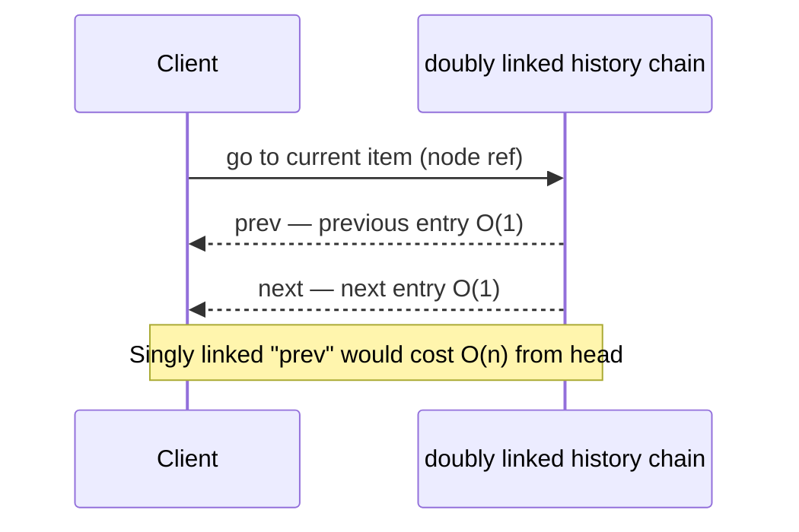
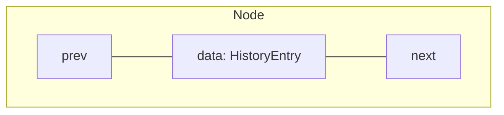
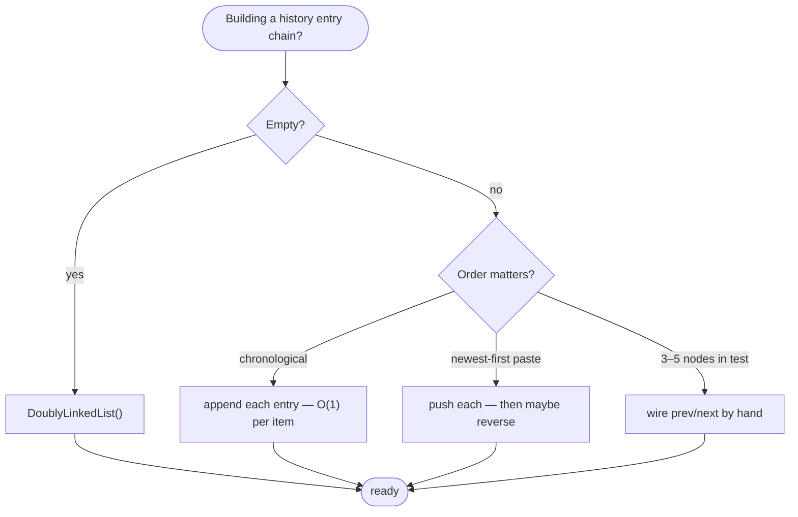
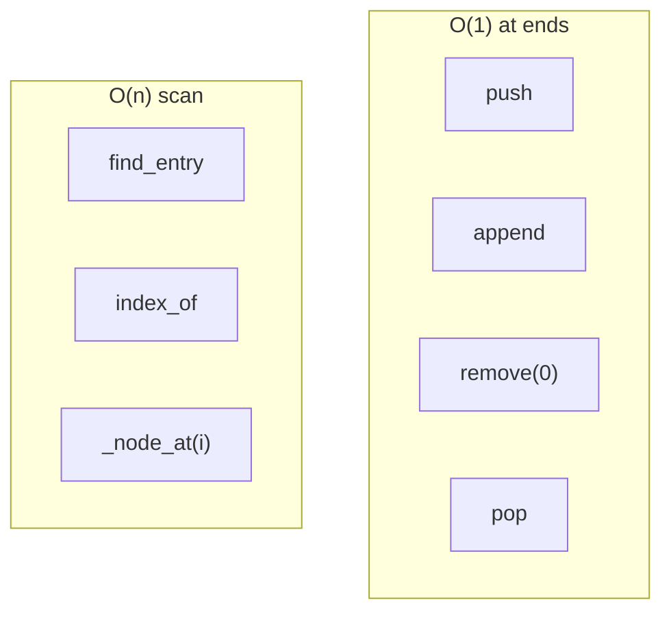
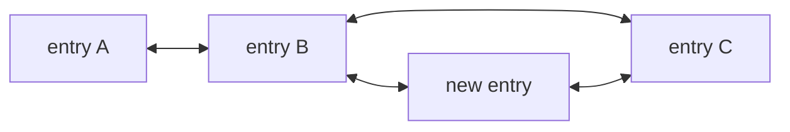
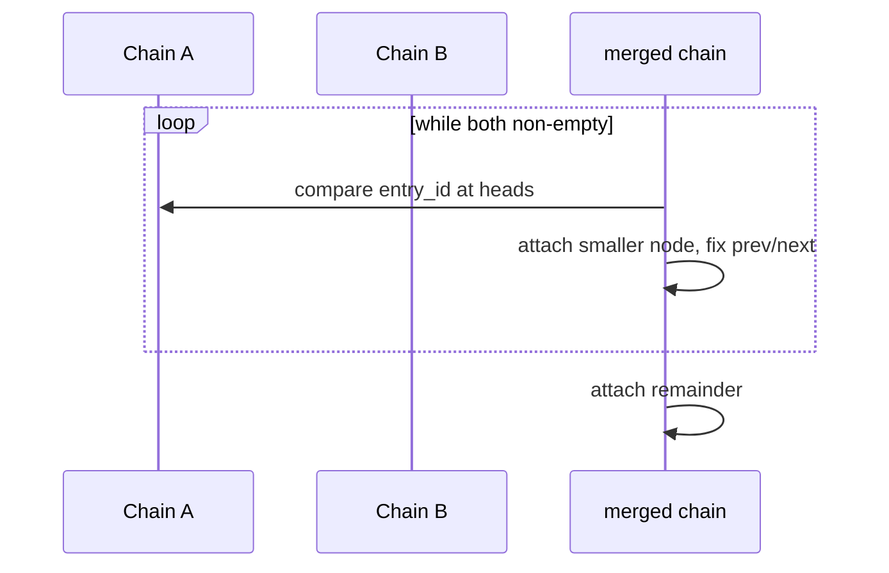
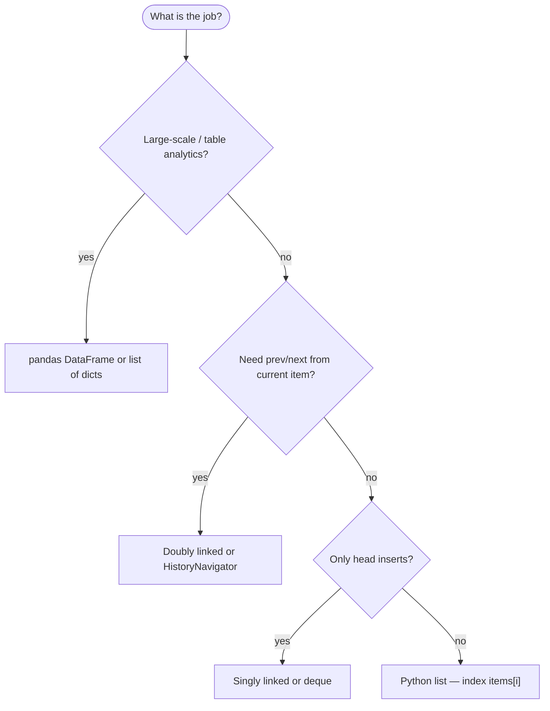

# Doubly linked list

A linear collection where **each node** points to both the **next** and **previous** item. You can walk forward from the **head** or backward from the **tail** without rescanning from the front.

| | |
| --- | --- |
| **What it is** | Nodes in a chain: each holds data, a `next` link, and a `prev` link. `head` and `tail` bound the sequence. |
| **Core operations** | O(1) insert/delete at head or tail when you hold the list object; O(1) rewire when you already hold a node reference (manual pointer update). |
| **When to use** | Frequent adds/removes at **both** ends, bidirectional traversal, or algorithms that need the predecessor without a separate scan. |
| **Trade-off** | Two pointers per node (more memory than singly linked); still no O(1) random access by index. |

This page is your **ready reference**: structure, a complete Python implementation, every way to create it, every method with worked examples, and **time and space complexity** on each operation. For Big-O notation, see [Complexity analysis](../../complexity/index.md).

## Practical applications: what a doubly linked list models

| Application idea | Doubly linked view | Why `prev` helps |
| --- | --- | --- |
| **Ordered entry chain** | Head = oldest item in buffer; tail = latest | Walk backward from the current page to see the prior history entry |
| **Browser history scrubber** | Current node = page on screen; `next` / `prev` = step forward/back | No full rescan from head for "previous page" |
| **Recent history buffer** | Fixed window of last *k* entries; drop oldest from head while appending newest at tail | O(1) at both ends |
| **Merge two sorted history chains** | Two visit logs, each sorted by `tab_id` then `entry_id` | Splice mid-chain without rebuilding `prev`—each node already links both ways |
| **Undo stack on text editor** | Remove "current" edit and restore neighbor links | O(1) removal with node reference |

**Use a Python `list` or DataFrame** when you filter 50,000 table rows, compute large aggregate queries, or need `items[i]` in a tight loop. **Use a doubly linked list (or `collections.deque`)** when the problem is a **mutable ordered chain** with heavy **both-end** or **bidirectional** traffic on a **small** *n* (one bounded buffer, one session chunk, one browser session).


Throughout this page, **n** is the number of nodes (e.g. pages in one browser session). **i** is a zero-based index.

---

## Doubly linked vs singly linked vs Python `list`

| | **Doubly linked** | [Singly linked](../linked-list/index.md) | [Python `list`](../array-based-lists/index.md) |
| --- | --- | --- | --- |
| **Pointers per node** | `next` + `prev` | `next` only | None (array of refs) |
| **`pop()` (tail)** | O(1) with `tail` | O(n) — must find predecessor | O(1) amortized |
| **Delete node you hold** | O(1) rewire | O(n) unless copy-value hack | O(n) shift |
| **Access by index `i`** | O(n) forward walk from head | O(n) from head only | O(1) |
| **Memory** | Highest per element | Medium | Compact + cache-friendly |
| **Typical fit** | Bidirectional history UI, both-end window | Undo/redo batches, merge sorted chains | Full in-memory table |



---

## Node definition

Every node stores **data** (e.g. a browser history entry), **next**, and **prev**.

```python
from dataclasses import dataclass


@dataclass
class HistoryEntry:
    entry_id: int
    tab_id: int
    duration_ms: int
    title: str


class Node:
    def __init__(self, data):
        self.data = data
        self.next = None
        self.prev = None
```

| | |
| --- | --- |
| **Time** | O(1) to construct one node |
| **Space** | O(1) per node (data + two references + CPython object header) |



---

## Ways to create a doubly linked list

### 1. Empty list — `head` and `tail` are `None`

```python
head = None
tail = None
```

| | |
| --- | --- |
| **Time** | O(1) |
| **Space** | O(1) |

### 2. Empty `DoublyLinkedList` wrapper

```python
class DoublyLinkedList:
    def __init__(self):
        self.head = None
        self.tail = None
        self.size = 0

history = DoublyLinkedList()
assert history.is_empty()
```

| | |
| --- | --- |
| **Time** | O(1) |
| **Space** | O(1) |

### 3. Single-node list

```python
node = Node(HistoryEntry(101, 2, 120, "Home"))
head = tail = node
```

| | |
| --- | --- |
| **Time** | O(1) |
| **Space** | O(1) one node |

### 4. Build from iterable — append at tail (chronological item order)

Preserves visit order (oldest → newest): page 101 → 102 → 103.

```python
def from_iterable_tail(items):
    head = tail = None
    for item in items:
        node = Node(item)
        if head is None:
            head = tail = node
        else:
            node.prev = tail
            assert tail is not None
            tail.next = node
            tail = node
    return head, tail

entries = [
    HistoryEntry(101, 2, 120, "Home"),
    HistoryEntry(102, 2, 340, "Docs"),
    HistoryEntry(103, 2, 90, "Settings"),
]
head, tail = from_iterable_tail(entries)
```

| | |
| --- | --- |
| **Time** | O(k) for *k* entries |
| **Space** | O(k) nodes |

### 5. Build from iterable — push at head (reversed order)

Useful when pages arrive **newest-first** (bulk paste of a redo stack) and you want oldest at head after a later `reverse`, or when you intentionally want reverse chronological storage.

```python
def from_iterable_head(items):
    head = None
    for item in items:
        node = Node(item)
        node.next = head
        if head is not None:
            head.prev = node
        head = node
    return head
```

| | |
| --- | --- |
| **Time** | O(k) |
| **Space** | O(k) |

### 6. Build with `append` (recommended)

```python
history = DoublyLinkedList()
for entry in [
    HistoryEntry(101, 2, 120, "Home"),
    HistoryEntry(102, 2, 340, "Docs"),
]:
    history.append(entry)
```

| | |
| --- | --- |
| **Time** | O(k) with tail-tracked `append` |
| **Space** | O(k) |

### 7. Manual wiring (tests, diagrams, interviews)

```python
n1 = Node(HistoryEntry(101, 2, 120, "Home"))
n2 = Node(HistoryEntry(102, 2, 340, "Docs"))
n3 = Node(HistoryEntry(103, 2, 90, "Settings"))
n1.next = n2
n2.prev = n1
n2.next = n3
n3.prev = n2
head, tail = n1, n3
```

| | |
| --- | --- |
| **Time** | O(k) |
| **Space** | O(k) |

### 8. From an existing Python `list` of history entries

```python
entries_list = [
    HistoryEntry(201, 1, 200, "About"),
    HistoryEntry(202, 1, 110, "Profile"),
]
history = DoublyLinkedList()
history.extend(entries_list)
```

| | |
| --- | --- |
| **Time** | O(k) |
| **Space** | O(k) nodes plus O(k) temporary if you keep both structures |

### Creation cheat sheet



---

## Reference implementation

All method sections below use this class. It keeps **`head`**, **`tail`**, and **`size`** so `len`, both-end ops, and index walks stay cheap to reason about. Dunder methods (`__len__`, `__getitem__`, `__iter__`, `__str__`, `__repr__`) delegate to the helpers below. **`push`**, **`insert`**, **`set`**, **`reverse`**, **`clear`**, **`extend`**, **`sort`**, **`trim_front`**, and **`trim_back`** return **`self`** for chaining. Head removal uses private **`_pop_head()`**; **`remove(0)`** calls it. **`pop()`** always removes the **tail**. Index walks go through **`_node_at(index)`**.

```python
class Node:
    def __init__(self, data):
        self.data = data
        self.next = None
        self.prev = None

class DoublyLinkedList:
    def __init__(self):
        self.head = None
        self.tail = None
        self.size = 0

    def __str__(self):
        return f"DoublyLinkedList({self.to_list()})"

    def __repr__(self):
        return f"DoublyLinkedList({self.to_list()})"

    def __len__(self):
        return self.size

    def __getitem__(self, index):
        return self.get(index)

    def __iter__(self):
        current = self.head
        while current is not None:
            yield current.data
            current = current.next

    def is_empty(self):
        return self.head is None

    def push(self, data):
        node = Node(data)
        if self.is_empty():
            self.head = node
            self.tail = node
        else:
            node.next = self.head
            self.head.prev = node
            self.head = node
        self.size += 1
        return self

    def append(self, data):
        node = Node(data)
        if self.is_empty():
            self.head = node
            self.tail = node
        else:
            node.prev = self.tail
            self.tail.next = node
            self.tail = node
        self.size += 1

    def insert(self, index, data):
        if index < 0 or index > self.size:
            raise IndexError("index out of bounds")
        if index == 0:
            self.push(data)
            return self

        node = Node(data)
        prev = self._node_at(index - 1)
        node.next = prev.next
        prev.next.prev = node
        node.prev = prev
        prev.next = node
        self.size += 1
        return self

    def pop(self):
        if self.is_empty():
            raise IndexError("pop from empty list")
        data = self.tail.data
        if self.head.next is None:
            self.head = None
            self.tail = None
        else:
            self.tail = self.tail.prev
            self.tail.next = None
        self.size -= 1
        return data

    def _pop_head(self):
        if self.is_empty():
            raise IndexError("pop from empty list")
        data = self.head.data
        if self.head.next is None:
            self.head = None
            self.tail = None
        else:
            self.head = self.head.next
            self.head.prev = None
        self.size -= 1
        return data

    def remove(self, index):
        if index < 0 or index >= self.size:
            raise IndexError("index out of bounds")
        if index == 0:
            return self._pop_head()
        if index == self.size - 1:
            return self.pop()
        prev = self._node_at(index - 1)
        cur = prev.next
        prev.next = cur.next
        cur.next.prev = prev
        self.size -= 1
        return cur.data

    def get(self, index):
        return self._node_at(index).data

    def set(self, index, data):
        self._node_at(index).data = data
        return self

    def _node_at(self, index):
        if index < 0 or index >= self.size:
            raise IndexError("index out of bounds")
        current = self.head
        for _ in range(index):
            current = current.next
        return current

    def index_of(self, data):
        current = self.head
        for i in range(self.size):
            if current.data == data:
                return i
            current = current.next
        return -1

    def contains(self, data):
        return self.index_of(data) != -1

    def reverse(self):
        if self.is_empty():
            raise IndexError("reverse empty list")
        current = self.head
        while current is not None:
            current.next, current.prev = current.prev, current.next
            current = current.prev
        self.head, self.tail = self.tail, self.head
        return self

    def to_list(self):
        if self.is_empty():
            return []
        current = self.head
        out = []
        while current is not None:
            out.append(current.data)
            current = current.next
        return out

    def clear(self):
        self.head = None
        self.tail = None
        self.size = 0
        return self

    def extend(self, items):
        if isinstance(items, DoublyLinkedList):

            if items.is_empty():
                return self
            if self.is_empty():

                self.head = items.head
                self.tail = items.tail
                self.size = items.size
            else:

                self.tail.next = items.head
                items.head.prev = self.tail
                self.tail = items.tail
                self.size += items.size
            return self
        else:

            for item in items:
                self.append(item)
            return self


    def sort(self):
        if self.size < 2:
            return self
        values = self.to_list()
        values.sort()
        self.clear()
        for value in values:
            self.append(value)
        return self

    def copy(self):
        out = DoublyLinkedList()
        for item in self:
            out.append(item)
        return out

    def trim_front(self, count):
        for _ in range(count):
            if self.is_empty():
                break
            self.remove(0)
        return self

    def trim_back(self, keep):
        while self.size > keep:
            self.pop()
        return self

    def latest(self):
        if self.is_empty():
            return None
        return self.tail.data

    def oldest_in_buffer(self):
        if self.is_empty():
            return None
        return self.head.data

    def current(self):
        if self.is_empty():
            return None
        return self.head.data

    def find_entry(self, entry_id):
        current = self.head
        while current is not None:
            data = current.data
            if hasattr(data, "entry_id"):
                if data.entry_id == entry_id:
                    return data
            elif data == entry_id:
                return data
            current = current.next
        return None

    def walk_forward_from(self, node):
        if node is None:
            return []
        out = []
        current = node
        while current is not None:
            out.append(current.data)
            current = current.next
        return out

    def walk_backward_from(self, node):
        if node is None:
            return []
        out = []
        current = node
        while current is not None:
            out.append(current.data)
            current = current.prev
        return out
```

---

## All operations (examples + complexity)



Helper used in several examples:

```python
def make_history_chain(entries):
    history = DoublyLinkedList()
    for entry in entries:
        history.append(entry)
    return history
```

### `is_empty()` / `len(history)` / `history[i]`

**`is_empty()`** checks `head is None`. **`__len__`** returns cached **`size`**. Bracket access **`history[i]`** delegates to **`get(i)`** and returns **data** (not a node).

```python
history = DoublyLinkedList()
assert history.is_empty()
assert len(history) == 0

history.append(HistoryEntry(101, 2, 120, "Home"))
assert len(history) == 1
assert history[0].entry_id == 101
```

| | |
| --- | --- |
| **Time** | O(1) with cached `size` |
| **Space** | O(1) |

---

### `push(data)` — new entry before the oldest item

Create a node, wire `next`/`prev` to the current head (or set both `head` and `tail` when empty), increment `size`, and return **`self`**.

Example: push a **backfilled visit** so it becomes the oldest page in the undo chain.

```python
history = make_history_chain([HistoryEntry(102, 2, 340, "Docs")])
history.push(HistoryEntry(101, 2, 120, "Home"))
assert history.get(0).entry_id == 101
```

| | |
| --- | --- |
| **Time** | O(1) |
| **Space** | O(1) one new node |

```mermaid
sequenceDiagram
  participant D as history
  participant New as new entry node
  participant Old as old head
  D->>New: create node; New.next = head
  New->>Old: Old.prev = New
  D->>D: head = New
```

---

### `append(data)` — next page in the chain

Create a node, link it after `tail` (or set both `head` and `tail` when empty), and increment `size`. Does not return `self`.

```python
history = DoublyLinkedList()
history.append(HistoryEntry(101, 2, 120, "Home"))
history.append(HistoryEntry(102, 2, 340, "Docs"))
assert list(history)[-1].title == "Docs"
```

| | |
| --- | --- |
| **Time** | O(1) with `tail` |
| **Space** | O(1) |

---

### `insert(index, data)` — insert a page mid-chain

Valid indices are `0 … size` (inclusive upper bound). Index **`0`** delegates to **`push(data)`**. Otherwise **`_node_at(index - 1)`** finds the predecessor, splices the new node between it and its successor, increments `size`, and returns **`self`**.

Insert a **restored undo step** before the page currently at index 2.

```python
history = make_history_chain([
    HistoryEntry(101, 2, 120, "Home"),
    HistoryEntry(102, 2, 340, "Docs"),
    HistoryEntry(104, 2, 150, "About"),
])
history.insert(2, HistoryEntry(103, 2, 210, "Settings (restored)"))
ids = [s.entry_id for s in history]
assert ids == [101, 102, 103, 104]
```

| | |
| --- | --- |
| **Time** | O(n) — `_node_at(index)` plus O(1) rewire |
| **Space** | O(1) |



---

### `get(index)` / `set(index, data)` — access by position

Both use **`_node_at(index)`**, which walks forward from the head and raises **`IndexError("index out of bounds")`** when **`index < 0`** or **`index >= size`**. **`set`** mutates **`node.data`** in place and returns **`self`**.

```python
history = make_history_chain([HistoryEntry(i, 1, 0, f"page {i}") for i in range(10)])
assert history.get(0).entry_id == 0
assert history.get(9).entry_id == 9
history.set(5, HistoryEntry(99, 1, 0, "replaced"))
assert history.get(5).entry_id == 99
```

| | |
| --- | --- |
| **Time** | O(i) ≤ O(n) |
| **Space** | O(1) |

For thousands of table rows, store an index in a **`dict[entry_id, HistoryEntry]`** beside the chain—not `get(i)` in a hot loop.

---

### `remove(0)` — drop the oldest item from the window

Head removal is handled by `remove(0)` (internally `_pop_head`).

```python
history = make_history_chain([
    HistoryEntry(101, 2, 120, "Home"),
    HistoryEntry(102, 2, 340, "Docs"),
])
old_first = history.remove(0)
assert old_first.entry_id == 101
assert history.get(0).entry_id == 102
```

| | |
| --- | --- |
| **Time** | O(1) |
| **Space** | O(1) |

---

### `pop()` — remove the latest entry (e.g. undo last edit)

Removes the **tail** node, returns its **data**, and decrements **`size`**. On a one-node list, sets both **`head`** and **`tail`** to **`None`**. Singly linked lists need an O(n) scan for the predecessor; **doubly linked does not**.

```python
history = make_history_chain([
    HistoryEntry(101, 2, 120, "Home"),
    HistoryEntry(102, 2, 340, "Docs"),
])
last = history.pop()
assert last.entry_id == 102
assert len(history) == 1
```

| | |
| --- | --- |
| **Time** | O(1) |
| **Space** | O(1) |

```mermaid
sequenceDiagram
  participant D as history
  D->>D: read tail.data
  D->>D: tail = tail.prev; tail.next = None
  Note over D: Singly linked would walk n-1 steps
```

---

### `remove(index)` — delete by position

Returns the removed **data**. Index **`0`** calls **`_pop_head()`**; index **`size - 1`** delegates to **`pop()`**; otherwise rewire through the predecessor at **`index - 1`**. All three paths update `size` and fix `prev`/`next`.

```python
history = make_history_chain([
    HistoryEntry(101, 2, 120, "Home"),
    HistoryEntry(102, 2, 340, "Docs"),
    HistoryEntry(103, 2, 90, "Settings"),
])
assert history.remove(1).entry_id == 102
assert [s.entry_id for s in history] == [101, 103]
```

| | |
| --- | --- |
| **Time** | O(1) at index `0` or `size - 1`; O(n) mid-list — walk to index, then O(1) rewire |
| **Space** | O(1) |

---

### `find_entry(entry_id)` / `index_of` / `contains`

`find_entry` returns the **data** (not the node). It matches objects with a `entry_id` attribute or raw values.

```python
history = make_history_chain([
    HistoryEntry(101, 2, 120, "Home"),
    HistoryEntry(102, 2, 340, "Docs"),
])
entry = history.find_entry(102)
assert entry is not None and entry.title == "Docs"
assert history.contains(HistoryEntry(101, 2, 120, "Home"))
assert history.index_of(HistoryEntry(102, 2, 340, "Docs")) == 1
assert history.index_of(HistoryEntry(999, 1, 0, "missing")) == -1
```

| | |
| --- | --- |
| **Time** | O(n) |
| **Space** | O(1) |

---

### Bidirectional iteration — `__iter__`, `walk_forward_from`, `walk_backward_from`

Forward iteration uses **`__iter__`** (yields each node's **data** from head to tail). **`walk_forward_from(node)`** and **`walk_backward_from(node)`** take a **`Node`** reference (e.g. `history.head` or `history.tail`), follow `next` or `prev`, and return a **Python list of data**—not an iterator.

```python
history = make_history_chain([
    HistoryEntry(101, 2, 120, "Home"),
    HistoryEntry(102, 2, 340, "Docs"),
    HistoryEntry(103, 2, 90, "Settings"),
])

forward_dwell = [s.duration_ms for s in history]
backward_dwell = [s.duration_ms for s in history.walk_backward_from(history.tail)]
assert forward_dwell == [120, 340, 90]
assert backward_dwell == [90, 340, 120]
```

| | |
| --- | --- |
| **Time** | O(n) |
| **Space** | O(1) auxiliary (not counting result lists) |

| | |
| --- | --- |
| **`walk_forward_from(node)`** | O(k) forward from a known node |
| **`walk_backward_from(node)`** | O(k) backward from a known node |

---

### `clear()` — reset text editor

Sets **`head`**, **`tail`**, and **`size`** back to empty state. Returns **`self`**.

```python
history = make_history_chain([HistoryEntry(101, 2, 120, "Home")])
history.clear()
assert history.is_empty()
```

| | |
| --- | --- |
| **Time** | O(1) to drop head/tail |
| **Space** | O(1) |

---

### `copy()` — duplicate chain for a redo branch

Shallow copy: new nodes, **same** `HistoryEntry` objects.

```python
original = make_history_chain([HistoryEntry(101, 2, 120, "Home")])
branch = original.copy()
branch.append(HistoryEntry(999, 2, 0, "Redo branch"))
assert len(original) == 1 and len(branch) == 2
assert branch.head is not original.head
```

| | |
| --- | --- |
| **Time** | O(n) |
| **Space** | O(n) |

---

### `reverse()` — flip chronological order in place

Swaps each node's `next` and `prev`, then swaps `head` and `tail`. Raises **`IndexError("reverse empty list")`** on an empty list. Returns **`self`**.

Useful after **push-heavy** paste to get chronological visit order.

```python
history = DoublyLinkedList()
for pid in [103, 102, 101]:
    history.push(HistoryEntry(pid, 2, 0, "x"))
history.reverse()
assert [s.entry_id for s in history] == [101, 102, 103]
```

| | |
| --- | --- |
| **Time** | O(n) |
| **Space** | O(1) |

---

### `sort()` — order entries by comparable data

Exports values with **`to_list()`**, sorts in place with Python's **`list.sort()`** (data must be mutually comparable), clears the chain, and rebuilds with **`append`**. No-op when **`size < 2`**. Returns **`self`**.

```python
history = make_history_chain([
    HistoryEntry(103, 2, 0, "c"),
    HistoryEntry(101, 2, 0, "a"),
    HistoryEntry(102, 2, 0, "b"),
])
history.sort()
assert [s.entry_id for s in history] == [101, 102, 103]
```

| | |
| --- | --- |
| **Time** | O(n log n) — Python `list.sort` on exported values |
| **Space** | O(n) temporary list |

---

### `extend(iterable)` / `to_list()`

When **`items`** is another **`DoublyLinkedList`**: empty source is a no-op; if **`self`** is empty, adopt the other chain's **`head`**, **`tail`**, and **`size`**; otherwise splice at the tail in O(1). Any other iterable appends one item at a time. Returns **`self`**. **`to_list()`** walks head→tail and returns a Python list of data.

```python
history = make_history_chain([HistoryEntry(101, 2, 120, "Home")])
history.extend([HistoryEntry(102, 2, 340, "Docs"), HistoryEntry(103, 2, 90, "Settings")])
rows = history.to_list()
assert len(rows) == 3
```

| Operation | Time | Space |
| --- | --- | --- |
| `extend` (another `DoublyLinkedList`) | O(1) splice | O(1) |
| `extend` (generic iterable) | O(k) | O(1) aux per append |
| `to_list` | O(n) | O(n) |

---

### `trim_front(count)` / `trim_back(keep)` — window helpers

**`trim_front(count)`** loops up to **count** times, calling **`remove(0)`** until empty. **`trim_back(keep)`** loops **`pop()`** while **`size > keep`**. Both return **`self`**.

```python
history = make_history_chain([HistoryEntry(i, 1, 0, f"page {i}") for i in range(10)])
history.trim_front(5)
assert len(history) == 5
assert history.get(0).entry_id == 5

history2 = make_history_chain([HistoryEntry(i, 1, 0, f"page {i}") for i in range(10)])
history2.trim_back(5)
assert len(history2) == 5
assert history2.get(4).entry_id == 4
```

| Operation | Time | Space |
| --- | --- | --- |
| `trim_front(count)` | O(count) | O(1) |
| `trim_back(keep)` | O(n − keep) | O(1) |

---

### `latest()` / `oldest_in_buffer()` / `current()`

**`latest()`** returns **`tail.data`**; **`oldest_in_buffer()`** and **`current()`** both return **`head.data`**. Each returns **`None`** when the list is empty. These are fixed head/tail accessors—not a movable cursor (see **`HistoryNavigator`** below for prev/next scrubbing).

```python
history = make_history_chain([HistoryEntry(101, 2, 120, "a"), HistoryEntry(102, 2, 340, "b")])
assert history.latest().entry_id == 102
assert history.oldest_in_buffer().entry_id == 101
assert history.current().entry_id == 101
```

| | |
| --- | --- |
| **Time** | O(1) |
| **Space** | O(1) |

---

## Application: recent history buffer

```python
class RecentHistory:
    def __init__(self, max_entries=5):
        self._chain = DoublyLinkedList()
        self._max = max_entries

    def push(self, entry):
        self._chain.append(entry)
        while self._chain.size > self._max:
            self._chain.remove(0)

    def latest(self):
        return self._chain.latest()

    def oldest_in_buffer(self):
        return self._chain.oldest_in_buffer()


recent_buffer = RecentHistory(max_entries=3)
for rid in range(10):
    recent_buffer.push(HistoryEntry(rid, 1, 0, f"page {rid}"))
assert recent_buffer.latest().entry_id == 9
assert recent_buffer.oldest_in_buffer().entry_id == 7
```

| Operation | Time | Space |
| --- | --- | --- |
| `push` | O(1) append + O(1) per excess head removal | O(k) stored |

---

## Application: history navigator (prev / next)

```python
class HistoryNavigator:
    def __init__(self, history):
        self._history = history
        self._current = history.head

    def current(self):
        return None if self._current is None else self._current.data

    def next_entry(self):
        if self._current is None or self._current.next is None:
            return None
        self._current = self._current.next
        return self._current.data

    def prev_entry(self):
        if self._current is None or self._current.prev is None:
            return None
        self._current = self._current.prev
        return self._current.data


history = make_history_chain([
    HistoryEntry(101, 2, 120, "Home"),
    HistoryEntry(102, 2, 340, "Docs"),
    HistoryEntry(103, 2, 90, "Settings"),
])
nav = HistoryNavigator(history)
assert nav.current().entry_id == 101
assert nav.next_entry().entry_id == 102
assert nav.prev_entry().entry_id == 101
```

| Step | Time | Space |
| --- | --- | --- |
| `next_entry` / `prev_entry` | O(1) | O(1) |
| Jump to arbitrary `entry_id` | O(n) search first | O(1) after found |

---

## Low-level patterns

### Dummy head and tail sentinels

Simplify deletion near ends when you do not keep a full `DoublyLinkedList` class.

```python
def remove_draft_entries(head):
    dummy = Node(HistoryEntry(0, 0, 0, "sentinel"))
    dummy.next = head
    if head is not None:
        head.prev = dummy
    cur = dummy
    while cur.next is not None:
        if cur.next.data.title == "":
            nxt = cur.next.next
            if nxt is not None:
                nxt.prev = cur
            cur.next = nxt
        else:
            cur = cur.next
    out = dummy.next
    if out is not None:
        out.prev = None
    return out
```

| | |
| --- | --- |
| **Time** | O(n) |
| **Space** | O(1) extra for dummy |

### Merge two sorted entry chains by `entry_id`

Same pointer technique as singly linked merge; doubly linked lets you splice without rebuilding `prev` if you assign both links.

```python
def merge_by_entry_id(a, b):
    dummy = Node(HistoryEntry(0, 0, 0, ""))
    tail = dummy
    while a is not None and b is not None:
        if a.data.entry_id <= b.data.entry_id:
            tail.next = a
            a.prev = tail
            a = a.next
        else:
            tail.next = b
            b.prev = tail
            b = b.next
        tail = tail.next
    rest = a if a is not None else b
    if rest is not None:
        tail.next = rest
        rest.prev = tail
    out = dummy.next
    if out is not None:
        out.prev = None
    return out
```

| | |
| --- | --- |
| **Time** | O(n + m) |
| **Space** | O(1) auxiliary |



---

## Python stdlib: `collections.deque`

CPython's `deque` is implemented as a **block doubly linked list** at C level—not the same as your `Node` class, but the same **complexity story** for ends.

```python
from collections import deque

recent = deque(maxlen=5)
recent.append(HistoryEntry(101, 2, 120, "Home"))
recent.appendleft(HistoryEntry(100, 2, 0, "backfill"))
assert len(recent) <= 5
```

| Operation | `deque` (amortized) | Your `DoublyLinkedList` |
| --- | --- | --- |
| `append` / `appendleft` | O(1) | `append` / `push` O(1) |
| `pop` / `popleft` | O(1) | `pop` / `remove(0)` O(1) |
| Indexing `dq[i]` | O(n) | O(n) via `get` / `__getitem__` |
| Custom `HistoryEntry` + `find_entry` | Use your class | Use your class |

**Rule of thumb:** ship **`deque`** in production production apps; implement **`DoublyLinkedList`** to learn and to pass interviews.

---

## Master complexity table

Let **n** = `len(history)`, **i** = index.

| Operation | Time | Space (auxiliary) | Notes |
| --- | --- | --- | --- |
| Create empty | O(1) | O(1) | |
| Build from *k* items | O(k) | O(k) nodes | tail `append` |
| `push` / `append` | O(1) | O(1) | |
| `insert(i)` | O(n) | O(1) | find + splice |
| `get` / `set` at *i* | O(i) | O(1) | forward walk from head |
| `remove(0)` / `pop()` | O(1) | O(1) | |
| `remove(i)` mid-list | O(n) | O(1) | ends delegate to `_pop_head` / `pop` |
| `find_entry` / `contains` | O(n) | O(1) | |
| `latest` / `oldest_in_buffer` / `current` | O(1) | O(1) | `None` if empty |
| `walk_forward_from` / `walk_backward_from` | O(k) | O(k) | returns list of data |
| `len` (cached) | O(1) | O(1) | |
| Forward `__iter__` | O(n) | O(1) | yields data, head → tail |
| `clear` | O(1) | O(1) | |
| `copy` | O(n) | O(n) | |
| `reverse` in place | O(n) | O(1) | raises on empty list |
| `sort` | O(n log n) | O(n) | export, sort, rebuild |
| `extend` | O(k) | O(1) per item | O(1) splice for another DLL |
| `to_list` | O(n) | O(n) | |
| `trim_front(count)` | O(count) | O(1) | repeated `remove(0)` |
| `trim_back(keep)` | O(n − keep) | O(1) | repeated `pop()` |

**Total storage:** Θ(n) nodes, each with `data`, `prev`, `next`.

---

## When to pick which structure



| Scenario | Best tool |
| --- | --- |
| Large aggregate queries | pandas, not linked list |
| Bounded buffer, history prev/next | Doubly linked or `deque` + index |
| Last 5 pages in history scrubber | `deque(maxlen=5)` or `remove(0)` loop |
| Merge sorted entry-id streams (exercise) | Doubly or singly linked merge |
| Random access `items[412]` in loop | `list` |

---

## Common pitfalls

| Pitfall | Why it hurts | Fix |
| --- | --- | --- |
| Confusing `pop()` with `remove(0)` | `pop()` drops the **tail**; `remove(0)` drops the **head** | Use `remove(0)` for oldest-in-window; `pop()` for latest |
| Calling `reverse()` on empty list | Raises `IndexError` | Guard with `is_empty()` first |
| Forgetting to update `prev` on splice | Broken backward walk | Always set both `prev` and `next` |
| Losing `head` / `tail` after delete | Orphan chain | Branch on whether node is head or tail |
| Storing full archive in DLL | O(n) lookups, huge memory | DataFrame + optional small DLL per window |
| Expecting `find_entry` to return a node | API returns data | Use `history.head` / `_node_at` when you need the node |
| Shallow copy shares `HistoryEntry` | Mutate one branch, affects other | `copy.deepcopy` if needed |
| Using DLL for `items[i]` hot loop | O(n) per access | `list` or columnar store |

---

## Related pages

| Page | Relationship |
| --- | --- |
| [Singly linked list](../linked-list/index.md) | One pointer; O(n) `pop_tail` |
| [Circularly linked list](../circularly-linked-list/index.md) | Ring of nodes; round-robin |
| [Array-based lists](../array-based-lists/index.md) | Python `list` for tabular data |
| [Deque](../dequeue-deque/index.md) | Production O(1) both ends |
| [Complexity analysis](../../complexity/index.md) | Big-O reference |

---

## Quick reference card

```python
history = DoublyLinkedList()
for r in [entry1, entry2]:
    history.append(r)

history.push(entry)
history.append(entry)
history.remove(0)
history.pop()
history.get(i)
history[i]
history.insert(i, entry)
history.remove(i)
history.find_entry(entry_id)


for r in history: ...
history.walk_forward_from(history.head)
history.walk_backward_from(history.tail)


history.trim_front(3)
history.trim_back(5)
history.latest()
history.oldest_in_buffer()
```

Use a **doubly linked list** when the problem is an **ordered chain** and you need **both ends** or **backward steps** without rescanning from the head—then reach for **`deque`** when you ship real production tooling.
