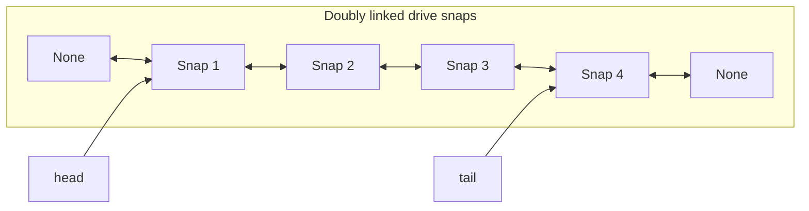
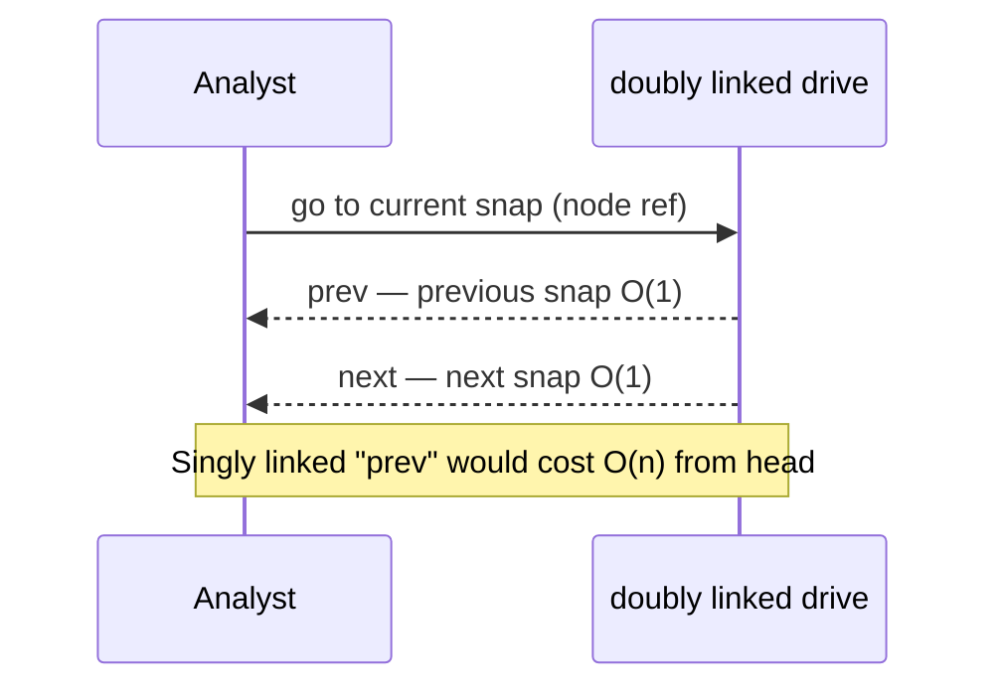
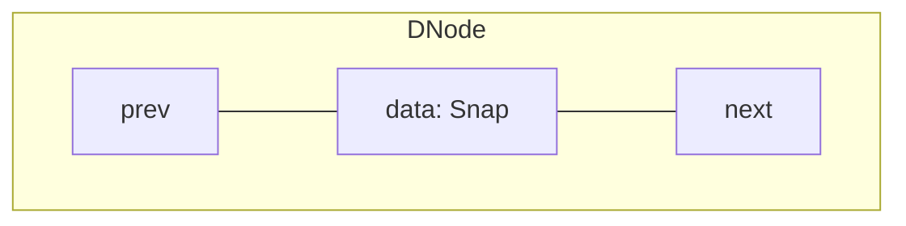
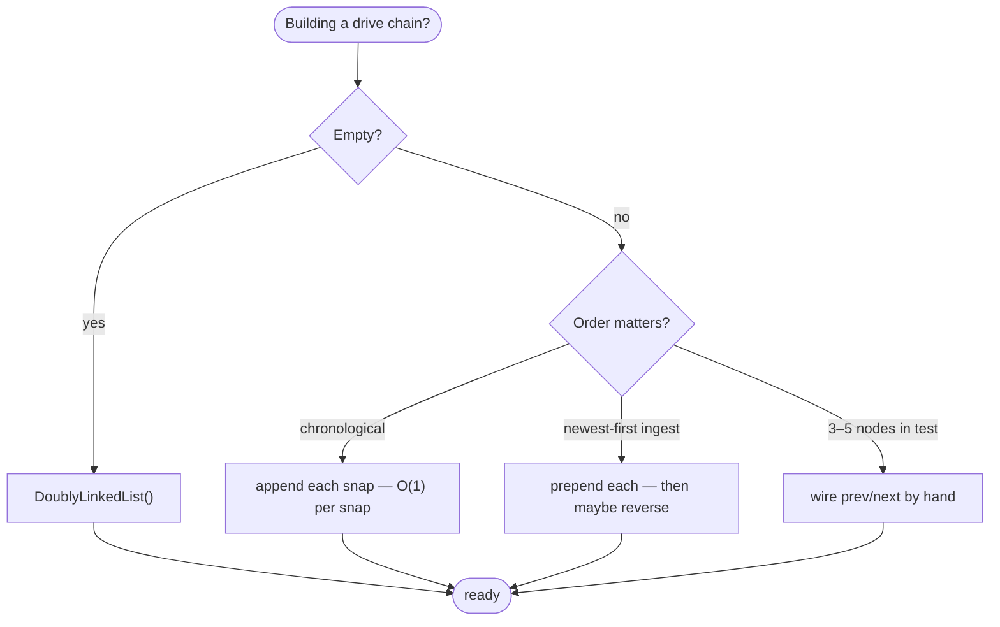
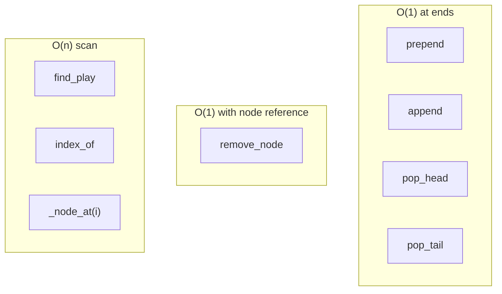
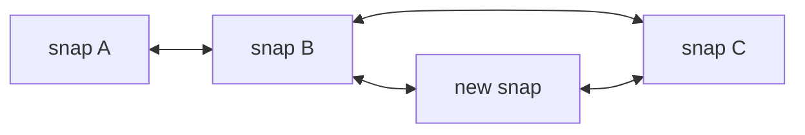
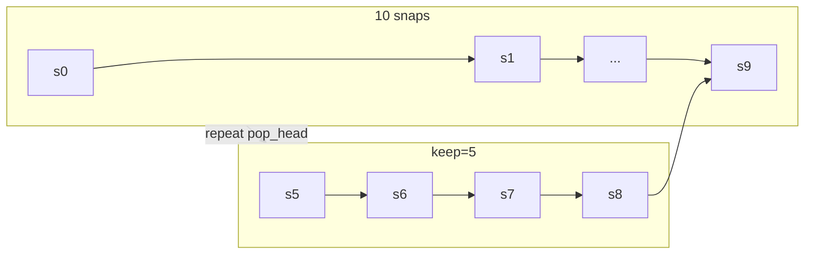
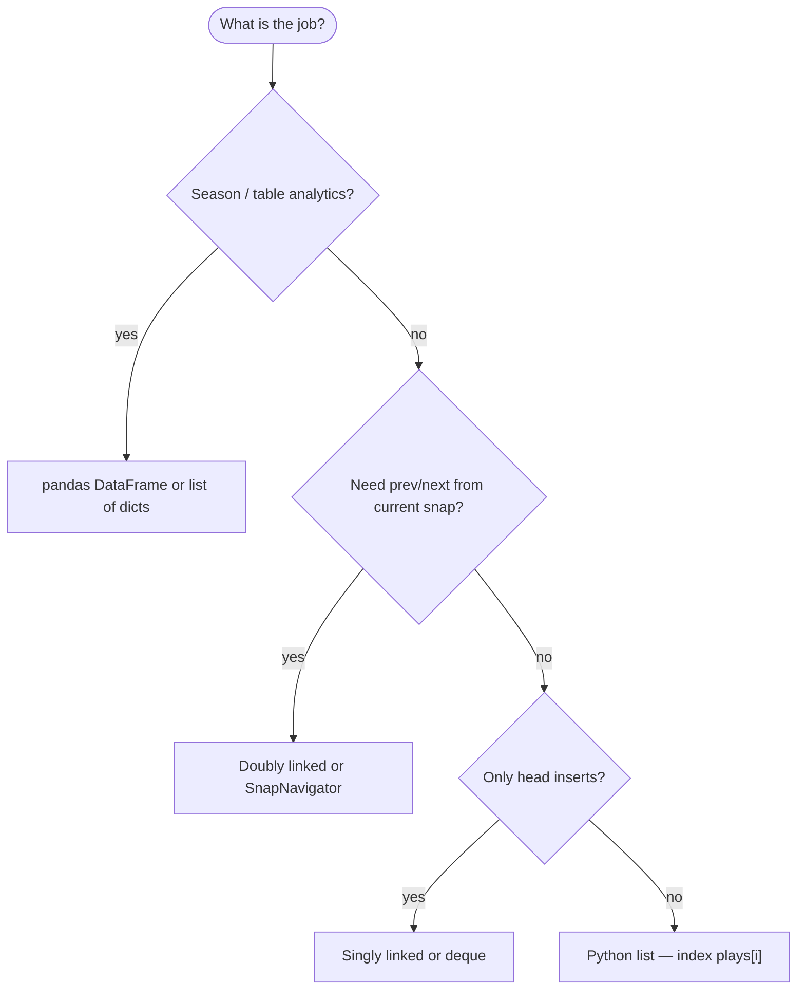

# Doubly linked list

A linear collection where **each node** points to both the **next** and **previous** item. You can walk forward from the **head** or backward from the **tail** without rescanning from the front.

| | |
| --- | --- |
| **What it is** | Nodes in a chain: each holds data, a `next` link, and a `prev` link. `head` and `tail` bound the sequence. |
| **Core operations** | O(1) insert/delete at head or tail when you hold the list object; O(1) delete when you already hold a reference to the node (after O(n) search if you only have the value). |
| **When to use** | Frequent adds/removes at **both** ends, bidirectional traversal, or algorithms that need the predecessor without a separate scan. |
| **Trade-off** | Two pointers per node (more memory than singly linked); still no O(1) random access by index. |

In **NFL data analysis**, a doubly linked list is a strong mental model for **bidirectional timelines**: scrubbing a drive snap-by-snap forward and backward, maintaining a **recent-plays window** with fast trim from either end, or building a **play navigator** where “previous snap” and “next snap” are O(1) once you are on a node. You will still store season-scale play-by-play in **pandas** or Python **`list`**—this structure is for **ordered chains** where both directions and both ends matter.

This page is your **ready reference**: structure, a complete Python implementation, every way to create it, every method with NFL-flavored examples, and **time and space complexity** on each operation. For Big-O notation, see [Complexity analysis](../../complexity/index.md).

[Parent: Data structures](../index.md)

---

## How a doubly linked list fits NFL-shaped problems

| NFL idea | Doubly linked view | Why `prev` helps |
| --- | --- | --- |
| **Drive snap chain** | Head = first snap of drive; tail = last | Walk backward from a sack to see the previous down |
| **Film-room scrubber** | Current node = snap on screen; `next` / `prev` = step forward/back | No full rescan from head for “previous play” |
| **Recent plays buffer** | Fixed window of last *k* plays; drop oldest from head while appending newest at tail | O(1) at both ends |
| **Merge two sorted play streams** | Two chains sorted by `(game_id, play_id)` | Same merge as singly linked; doubly linked helps if you splice mid-chain |
| **Undo stack on drive builder** | Remove “current” play and restore neighbor links | O(1) removal with node reference |

**Use a Python `list` or DataFrame** when you filter 50,000 plays, compute season EPA leaders, or need `plays[i]` in a tight loop. **Use a doubly linked list (or `collections.deque`)** when the problem is a **mutable ordered chain** with heavy **both-end** or **bidirectional** traffic on a **small** *n* (one drive, one game chunk, one UI session).



Throughout this page, **n** is the number of nodes (e.g. snaps in one drive). **i** is a zero-based index.

---

## Doubly linked vs singly linked vs Python `list`

| | **Doubly linked** | [Singly linked](../linked-list/index.md) | [Python `list`](../array-based-lists/index.md) |
| --- | --- | --- | --- |
| **Pointers per node** | `next` + `prev` | `next` only | None (array of refs) |
| **`pop_tail`** | O(1) with `tail` | O(n) — must find predecessor | O(1) amortized |
| **Delete node you hold** | O(1) rewire | O(n) unless copy-value hack | O(n) shift |
| **Access by index `i`** | O(n) forward or backward from nearer end | O(n) from head only | O(1) |
| **Memory** | Highest per element | Medium | Compact + cache-friendly |
| **NFL fit** | Bidirectional drive UI, both-end window | Head-heavy live buffer, merge drills | Full play-by-play table |



---

## Node definition

Every node stores **data** (e.g. a snap record), **next**, and **prev**.

```python
from __future__ import annotations

from dataclasses import dataclass
from typing import Any


@dataclass
class Snap:
    """Minimal snap for examples on this page."""
    play_id: int
    quarter: int
    epa: float
    description: str


@dataclass
class DNode:
    """Doubly linked node."""
    data: Any
    prev: DNode | None = None
    next: DNode | None = None
```

| | |
| --- | --- |
| **Time** | O(1) to construct one node |
| **Space** | O(1) per node (data + two references + CPython object header) |



---

## Ways to create a doubly linked list

### 1. Empty list — `head` and `tail` are `None`

```python
head: DNode | None = None
tail: DNode | None = None
```

| | |
| --- | --- |
| **Time** | O(1) |
| **Space** | O(1) |

### 2. Empty `DoublyLinkedList` wrapper

```python
class DoublyLinkedList:
    def __init__(self) -> None:
        self.head: DNode | None = None
        self.tail: DNode | None = None
        self._size = 0

drive = DoublyLinkedList()
assert drive.is_empty()
```

| | |
| --- | --- |
| **Time** | O(1) |
| **Space** | O(1) |

### 3. Single-node list

```python
node = DNode(Snap(101, 2, 0.4, "1st & 10 pass complete"))
head = tail = node
```

| | |
| --- | --- |
| **Time** | O(1) |
| **Space** | O(1) one node |

### 4. Build from iterable — append at tail (chronological drive order)

Preserves CSV / API order: play 101 → 102 → 103.

```python
def from_iterable_tail(items) -> tuple[DNode | None, DNode | None]:
    head = tail = None
    for item in items:
        node = DNode(item)
        if head is None:
            head = tail = node
        else:
            node.prev = tail
            assert tail is not None
            tail.next = node
            tail = node
    return head, tail

snaps = [
    Snap(101, 2, 0.4, "pass"),
    Snap(102, 2, -1.2, "sack"),
    Snap(103, 2, 0.1, "checkdown"),
]
head, tail = from_iterable_tail(snaps)
```

| | |
| --- | --- |
| **Time** | O(k) for *k* snaps |
| **Space** | O(k) nodes |

### 5. Build from iterable — prepend at head (reversed order)

Useful when data arrives **newest-first** (live feed) and you want oldest at head after a later `reverse`, or when you intentionally want reverse chronological storage.

```python
def from_iterable_head(items) -> DNode | None:
    head = None
    for item in items:
        node = DNode(item, next=head)
        if head is not None:
            head.prev = node
        head = node
    return head
```

| | |
| --- | --- |
| **Time** | O(k) |
| **Space** | O(k) |

### 6. Constructor with iterable (recommended)

```python
drive = DoublyLinkedList([
    Snap(101, 2, 0.4, "pass"),
    Snap(102, 2, -1.2, "sack"),
])
```

| | |
| --- | --- |
| **Time** | O(k) with tail-tracked `append` |
| **Space** | O(k) |

### 7. Manual wiring (tests, diagrams, interviews)

```python
n1 = DNode(Snap(101, 2, 0.4, "pass"))
n2 = DNode(Snap(102, 2, -1.2, "sack"))
n3 = DNode(Snap(103, 2, 0.1, "checkdown"))
n1.next = n2
n2.prev = n1
n2.next = n3
n3.prev = n2
head, tail = n1, n3
```

| | |
| --- | --- |
| **Time** | O(k) |
| **Space** | O(k) |

### 8. From an existing Python `list` of snaps

```python
plays_list = [
    Snap(201, 1, 0.2, "rush"),
    Snap(202, 1, 1.1, "TD pass"),
]
drive = DoublyLinkedList(plays_list)
```

| | |
| --- | --- |
| **Time** | O(k) |
| **Space** | O(k) nodes plus O(k) temporary if you keep both structures |

### Creation cheat sheet



---

## Reference implementation

All method sections below use this class. It keeps **`head`**, **`tail`**, and **`_size`** so `len`, both-end ops, and “which direction to walk” stay cheap to reason about.

```python
from __future__ import annotations

from dataclasses import dataclass
from typing import Any, Iterable, Iterator


@dataclass
class Snap:
    play_id: int
    quarter: int
    epa: float
    description: str


@dataclass
class DNode:
    data: Any
    prev: DNode | None = None
    next: DNode | None = None


class DoublyLinkedList:
    """Doubly linked list with head, tail, and cached length."""

    def __init__(self, items: Iterable[Any] | None = None) -> None:
        self.head: DNode | None = None
        self.tail: DNode | None = None
        self._size = 0
        if items is not None:
            for item in items:
                self.append(item)

    def __len__(self) -> int:
        return self._size

    def __iter__(self) -> Iterator[Any]:
        cur = self.head
        while cur is not None:
            yield cur.data
            cur = cur.next

    def __reversed__(self) -> Iterator[Any]:
        cur = self.tail
        while cur is not None:
            yield cur.data
            cur = cur.prev

    def __repr__(self) -> str:
        return f"DoublyLinkedList({list(self)})"

    def is_empty(self) -> bool:
        return self._size == 0

    def _link_before_tail(self, node: DNode) -> None:
        """Attach node just before current tail (tail must exist)."""
        assert self.tail is not None
        node.prev = self.tail.prev
        node.next = self.tail
        if self.tail.prev is not None:
            self.tail.prev.next = node
        else:
            self.head = node
        self.tail.prev = node

    def prepend(self, data: Any) -> DNode:
        node = DNode(data, next=self.head)
        if self.head is not None:
            self.head.prev = node
        else:
            self.tail = node
        self.head = node
        self._size += 1
        return node

    def append(self, data: Any) -> DNode:
        node = DNode(data, prev=self.tail)
        if self.tail is not None:
            self.tail.next = node
        else:
            self.head = node
        self.tail = node
        self._size += 1
        return node

    def insert(self, index: int, data: Any) -> DNode:
        if index < 0 or index > self._size:
            raise IndexError("index out of range")
        if index == 0:
            return self.prepend(data)
        if index == self._size:
            return self.append(data)
        anchor = self._node_at(index)
        node = DNode(data, prev=anchor.prev, next=anchor)
        assert anchor.prev is not None
        anchor.prev.next = node
        anchor.prev = node
        self._size += 1
        return node

    def pop_head(self) -> Any:
        if self.head is None:
            raise IndexError("pop from empty list")
        data = self.head.data
        self.head = self.head.next
        if self.head is not None:
            self.head.prev = None
        else:
            self.tail = None
        self._size -= 1
        return data

    def pop_tail(self) -> Any:
        if self.tail is None:
            raise IndexError("pop from empty list")
        data = self.tail.data
        self.tail = self.tail.prev
        if self.tail is not None:
            self.tail.next = None
        else:
            self.head = None
        self._size -= 1
        return data

    def remove_node(self, node: DNode) -> Any:
        """O(1) removal when you already hold the node reference."""
        if node.prev is not None:
            node.prev.next = node.next
        else:
            self.head = node.next
        if node.next is not None:
            node.next.prev = node.prev
        else:
            self.tail = node.prev
        self._size -= 1
        return node.data

    def remove_at(self, index: int) -> Any:
        return self.remove_node(self._node_at(index))

    def remove_first(self, data: Any) -> bool:
        cur = self.head
        while cur is not None:
            if cur.data == data:
                self.remove_node(cur)
                return True
            cur = cur.next
        return False

    def get(self, index: int) -> Any:
        return self._node_at(index).data

    def set(self, index: int, data: Any) -> None:
        self._node_at(index).data = data

    def index_of(self, data: Any) -> int:
        i = 0
        cur = self.head
        while cur is not None:
            if cur.data == data:
                return i
            cur = cur.next
            i += 1
        raise ValueError(f"{data!r} not in list")

    def contains(self, data: Any) -> bool:
        cur = self.head
        while cur is not None:
            if cur.data == data:
                return True
            cur = cur.next
        return False

    def find_play(self, play_id: int) -> DNode | None:
        """NFL helper: first snap with matching play_id."""
        cur = self.head
        while cur is not None:
            if isinstance(cur.data, Snap) and cur.data.play_id == play_id:
                return cur
            cur = cur.next
        return None

    def clear(self) -> None:
        self.head = self.tail = None
        self._size = 0

    def copy(self) -> DoublyLinkedList:
        out = DoublyLinkedList()
        for item in self:
            out.append(item)
        return out

    def reverse(self) -> None:
        cur = self.head
        while cur is not None:
            cur.prev, cur.next = cur.next, cur.prev
            cur = cur.prev  # old next; after swap, prev holds forward link
        self.head, self.tail = self.tail, self.head

    def extend(self, items: Iterable[Any]) -> None:
        for item in items:
            self.append(item)

    def to_list(self) -> list[Any]:
        return list(self)

    def trim_front(self, keep: int) -> None:
        """Keep only the last `keep` snaps (recent-plays window)."""
        while self._size > keep:
            self.pop_head()

    def _node_at(self, index: int) -> DNode:
        if index < 0 or index >= self._size:
            raise IndexError("index out of range")
        if index <= self._size // 2:
            cur = self.head
            for _ in range(index):
                assert cur is not None
                cur = cur.next
        else:
            cur = self.tail
            for _ in range(self._size - 1 - index):
                assert cur is not None
                cur = cur.prev
        assert cur is not None
        return cur
```

---

## All operations (NFL examples + complexity)



### `is_empty()` / `len(drive)`

```python
drive = DoublyLinkedList()
assert drive.is_empty()
assert len(drive) == 0

drive.append(Snap(101, 2, 0.4, "pass"))
assert len(drive) == 1
```

| | |
| --- | --- |
| **Time** | O(1) with cached `_size` |
| **Space** | O(1) |

---

### `prepend(data)` — new snap before the opening play

Example: prepend a **penalty snap** reclassified as the first event in a corrected drive chain.

```python
drive = DoublyLinkedList([
    Snap(102, 2, -1.2, "sack"),
])
drive.prepend(Snap(101, 2, 0.4, "pass"))
assert drive.get(0).play_id == 101
```

| | |
| --- | --- |
| **Time** | O(1) |
| **Space** | O(1) one new node |

```mermaid
sequenceDiagram
  participant D as drive
  participant New as new snap node
  participant Old as old head
  D->>New: create node; New.next = head
  New->>Old: Old.prev = New
  D->>D: head = New
```

---

### `append(data)` — next snap in the drive

```python
drive = DoublyLinkedList()
drive.append(Snap(101, 2, 0.4, "pass"))
drive.append(Snap(102, 2, -1.2, "sack"))
assert list(drive)[-1].description == "sack"
```

| | |
| --- | --- |
| **Time** | O(1) with `tail` |
| **Space** | O(1) |

---

### `insert(index, data)` — insert a snap mid-drive

Insert **onside kick recovery** before the snap currently at index 2.

```python
drive = DoublyLinkedList([
    Snap(101, 2, 0.4, "pass"),
    Snap(102, 2, -1.2, "sack"),
    Snap(104, 2, 0.1, "checkdown"),
])
drive.insert(2, Snap(103, 2, 2.1, "fumble recovery"))
ids = [s.play_id for s in drive]
assert ids == [101, 102, 103, 104]
```

| | |
| --- | --- |
| **Time** | O(n) — `_node_at(index)` plus O(1) rewire |
| **Space** | O(1) |



---

### `get(index)` / `set(index, data)` — access by position

Index access is still a walk—but from the **nearer end** (implementation uses `_node_at`).

```python
drive = DoublyLinkedList([Snap(i, 1, 0.0, f"p{i}") for i in range(10)])
assert drive.get(0).play_id == 0
assert drive.get(9).play_id == 9
drive.set(5, Snap(99, 1, 0.0, "replaced"))
assert drive.get(5).play_id == 99
```

| | |
| --- | --- |
| **Time** | O(min(i, n − 1 − i)) ≤ O(n) |
| **Space** | O(1) |

For thousands of plays, store an index in a **`dict[play_id, Snap]`** beside the chain—not `get(i)` in a hot loop.

---

### `pop_head()` — drop the opening snap from the window

```python
drive = DoublyLinkedList([
    Snap(101, 2, 0.4, "pass"),
    Snap(102, 2, -1.2, "sack"),
])
old_first = drive.pop_head()
assert old_first.play_id == 101
assert drive.get(0).play_id == 102
```

| | |
| --- | --- |
| **Time** | O(1) |
| **Space** | O(1) |

---

### `pop_tail()` — remove the last snap (e.g. undo last tag)

Singly linked lists need an O(n) scan for the predecessor; **doubly linked does not**.

```python
drive = DoublyLinkedList([
    Snap(101, 2, 0.4, "pass"),
    Snap(102, 2, -1.2, "sack"),
])
last = drive.pop_tail()
assert last.play_id == 102
assert len(drive) == 1
```

| | |
| --- | --- |
| **Time** | O(1) |
| **Space** | O(1) |

```mermaid
sequenceDiagram
  participant D as drive
  D->>D: read tail.data
  D->>D: tail = tail.prev; tail.next = None
  Note over D: Singly linked would walk n-1 steps
```

---

### `remove_node(node)` — O(1) delete when you have the node

You already found the snap node (e.g. from `find_play`). Remove it without scanning for the predecessor.

```python
drive = DoublyLinkedList([
    Snap(101, 2, 0.4, "pass"),
    Snap(102, 2, -1.2, "sack"),
    Snap(103, 2, 0.1, "checkdown"),
])
node = drive.find_play(102)
assert node is not None
drive.remove_node(node)
assert [s.play_id for s in drive] == [101, 103]
```

| | |
| --- | --- |
| **Time** | O(1) for removal; O(n) if you still need `find_play` first |
| **Space** | O(1) |

This is the main reason doubly linked lists exist in textbooks and film-room UI sketches.

---

### `remove_at(index)` / `remove_first(data)`

```python
drive = DoublyLinkedList([
    Snap(101, 2, 0.4, "pass"),
    Snap(102, 2, -1.2, "sack"),
])
drive.remove_at(0)
assert drive.get(0).play_id == 102

drive2 = DoublyLinkedList([Snap(101, 2, 0.4, "a"), Snap(101, 2, 0.0, "b")])
drive2.remove_first(Snap(101, 2, 0.4, "a"))  # uses == on dataclass fields
```

| Operation | Time | Space |
| --- | --- | --- |
| `remove_at(i)` | O(n) | O(1) |
| `remove_first(value)` | O(n) | O(1) |

---

### `find_play(play_id)` / `index_of` / `contains`

```python
drive = DoublyLinkedList([
    Snap(101, 2, 0.4, "pass"),
    Snap(102, 2, -1.2, "sack"),
])
node = drive.find_play(102)
assert node is not None and node.data.description == "sack"
assert drive.contains(Snap(101, 2, 0.4, "pass"))
```

| | |
| --- | --- |
| **Time** | O(n) |
| **Space** | O(1) |

---

### Bidirectional iteration — `for` forward and `reversed(drive)`

```python
drive = DoublyLinkedList([
    Snap(101, 2, 0.4, "pass"),
    Snap(102, 2, -1.2, "sack"),
    Snap(103, 2, 0.1, "checkdown"),
])

forward_epa = [s.epa for s in drive]
backward_epa = [s.epa for s in reversed(drive)]
assert forward_epa == [0.4, -1.2, 0.1]
assert backward_epa == [0.1, -1.2, 0.4]
```

| | |
| --- | --- |
| **Time** | O(n) |
| **Space** | O(1) auxiliary (not counting result lists) |

Walk backward from a **known node** without `reversed()`:

```python
def walk_backward_from(node: DNode | None) -> list[Snap]:
    out = []
    cur = node
    while cur is not None:
        out.append(cur.data)
        cur = cur.prev
    return out
```

| | |
| --- | --- |
| **Time** | O(k) for *k* steps backward |
| **Space** | O(k) if materialized |

---

### `clear()` — reset drive builder

```python
drive = DoublyLinkedList([Snap(101, 2, 0.4, "pass")])
drive.clear()
assert drive.is_empty()
```

| | |
| --- | --- |
| **Time** | O(1) to drop head/tail |
| **Space** | O(1) |

---

### `copy()` — duplicate chain for what-if branch

Shallow copy: new nodes, **same** `Snap` objects.

```python
original = DoublyLinkedList([Snap(101, 2, 0.4, "pass")])
branch = original.copy()
branch.append(Snap(999, 2, 0.0, "hypothetical"))
assert len(original) == 1 and len(branch) == 2
```

| | |
| --- | --- |
| **Time** | O(n) |
| **Space** | O(n) |

---

### `reverse()` — flip drive order in place

Useful after **prepend-heavy** ingest to get chronological order.

```python
drive = DoublyLinkedList()
for pid in [103, 102, 101]:  # newest first
    drive.prepend(Snap(pid, 2, 0.0, "x"))
drive.reverse()
assert [s.play_id for s in drive] == [101, 102, 103]
```

| | |
| --- | --- |
| **Time** | O(n) |
| **Space** | O(1) |

---

### `extend(iterable)` / `to_list()`

```python
drive = DoublyLinkedList([Snap(101, 2, 0.4, "pass")])
drive.extend([Snap(102, 2, -1.2, "sack"), Snap(103, 2, 0.1, "checkdown")])
rows = drive.to_list()  # export to pandas: pd.DataFrame([s.__dict__ for s in rows])
assert len(rows) == 3
```

| Operation | Time | Space |
| --- | --- | --- |
| `extend` | O(k) | O(1) aux per append |
| `to_list` | O(n) | O(n) |

---

### `trim_front(keep)` — recent-plays window

Keep only the last **5** snaps in a live dashboard buffer.

```python
drive = DoublyLinkedList(Snap(i, 1, 0.0, f"p{i}") for i in range(10))
drive.trim_front(5)
assert len(drive) == 5
assert drive.get(0).play_id == 5
assert drive.get(4).play_id == 9
```

| | |
| --- | --- |
| **Time** | O(n) worst case when shrinking from many to `keep` |
| **Space** | O(1) |



---

## NFL application: recent plays buffer

```python
class RecentPlays:
    """Last k snaps using a doubly linked list."""

    def __init__(self, max_snaps: int = 5) -> None:
        self._chain = DoublyLinkedList()
        self._max = max_snaps

    def push(self, snap: Snap) -> None:
        self._chain.append(snap)
        self._chain.trim_front(self._max)

    def latest(self) -> Snap | None:
        if self._chain.is_empty():
            return None
        return self._chain.get(len(self._chain) - 1)

    def oldest_in_window(self) -> Snap | None:
        if self._chain.is_empty():
            return None
        return self._chain.get(0)


feed = RecentPlays(max_snaps=3)
for pid in range(10):
    feed.push(Snap(pid, 1, 0.0, f"play {pid}"))
assert feed.latest().play_id == 9
assert feed.oldest_in_window().play_id == 7
```

| Operation | Time | Space |
| --- | --- | --- |
| `push` | O(1) append + O(1) amortized trim per excess | O(k) stored |

---

## NFL application: snap navigator (prev / next)

```python
class SnapNavigator:
    """Bidirectional scrubber over one drive chain."""

    def __init__(self, drive: DoublyLinkedList) -> None:
        self._drive = drive
        self._current: DNode | None = drive.head

    def current(self) -> Snap | None:
        return None if self._current is None else self._current.data

    def next_snap(self) -> Snap | None:
        if self._current is None or self._current.next is None:
            return None
        self._current = self._current.next
        return self._current.data

    def prev_snap(self) -> Snap | None:
        if self._current is None or self._current.prev is None:
            return None
        self._current = self._current.prev
        return self._current.data


drive = DoublyLinkedList([
    Snap(101, 2, 0.4, "pass"),
    Snap(102, 2, -1.2, "sack"),
    Snap(103, 2, 0.1, "checkdown"),
])
nav = SnapNavigator(drive)
assert nav.current().play_id == 101
assert nav.next_snap().play_id == 102
assert nav.prev_snap().play_id == 101
```

| Step | Time | Space |
| --- | --- | --- |
| `next_snap` / `prev_snap` | O(1) | O(1) |
| Jump to arbitrary `play_id` | O(n) search first | O(1) after found |

---

## Low-level patterns

### Dummy head and tail sentinels

Simplify deletion near ends when you do not keep a full `DoublyLinkedList` class.

```python
def remove_snaps_with_negative_epa(head: DNode | None) -> DNode | None:
    dummy = DNode(Snap(0, 0, 0.0, "sentinel"))
    dummy.next = head
    if head is not None:
        head.prev = dummy
    cur = dummy
    while cur.next is not None:
        if cur.next.data.epa < 0:
            nxt = cur.next.next
            if nxt is not None:
                nxt.prev = cur
            cur.next = nxt
        else:
            cur = cur.next
    out = dummy.next
    if out is not None:
        out.prev = None
    return out
```

| | |
| --- | --- |
| **Time** | O(n) |
| **Space** | O(1) extra for dummy |

### Merge two sorted drive chains by `play_id`

Same pointer technique as singly linked merge; doubly linked lets you splice without rebuilding `prev` if you assign both links.

```python
def merge_by_play_id(a: DNode | None, b: DNode | None) -> DNode | None:
    dummy = DNode(Snap(0, 0, 0.0, ""))
    tail = dummy
    while a is not None and b is not None:
        if a.data.play_id <= b.data.play_id:
            tail.next = a
            a.prev = tail
            a = a.next
        else:
            tail.next = b
            b.prev = tail
            b = b.next
        tail = tail.next
    rest = a if a is not None else b
    if rest is not None:
        tail.next = rest
        rest.prev = tail
    out = dummy.next
    if out is not None:
        out.prev = None
    return out
```

| | |
| --- | --- |
| **Time** | O(n + m) |
| **Space** | O(1) auxiliary |


---

## Python stdlib: `collections.deque`

CPython’s `deque` is implemented as a **block doubly linked list** at C level—not the same as your `DNode` class, but the same **complexity story** for ends.

```python
from collections import deque

recent: deque[Snap] = deque(maxlen=5)
recent.append(Snap(101, 2, 0.4, "pass"))
recent.appendleft(Snap(100, 2, 0.0, "penalty"))
assert len(recent) <= 5
```

| Operation | `deque` (amortized) | Your `DoublyLinkedList` |
| --- | --- | --- |
| `append` / `appendleft` | O(1) | O(1) |
| `pop` / `popleft` | O(1) | O(1) |
| Indexing `dq[i]` | O(n) | O(n) |
| Custom `Snap` nodes + `find_play` | Use your class | Use your class |

**Rule of thumb:** ship **`deque`** in production NFL tools; implement **`DoublyLinkedList`** to learn and to pass interviews.

---

## Master complexity table

Let **n** = `len(drive)`, **i** = index.

| Operation | Time | Space (auxiliary) | Notes |
| --- | --- | --- | --- |
| Create empty | O(1) | O(1) | |
| Build from *k* items | O(k) | O(k) nodes | tail `append` |
| `prepend` / `append` | O(1) | O(1) | |
| `insert(i)` | O(n) | O(1) | find + splice |
| `get` / `set` at *i* | O(min(i, n−1−i)) | O(1) | two-ended walk |
| `pop_head` / `pop_tail` | O(1) | O(1) | |
| `remove_node` | O(1) | O(1) | need node ref |
| `remove_at` / `remove_first` | O(n) | O(1) | |
| `find_play` / `contains` | O(n) | O(1) | |
| `len` (cached) | O(1) | O(1) | |
| Forward / reverse iter | O(n) | O(1) | |
| `clear` | O(1) | O(1) | |
| `copy` | O(n) | O(n) | |
| `reverse` in place | O(n) | O(1) | |
| `extend` | O(k) | O(1) per item | |
| `to_list` | O(n) | O(n) | |
| `trim_front(keep)` | O(n − keep) | O(1) | repeated `pop_head` |

**Total storage:** Θ(n) nodes, each with `data`, `prev`, `next`.

---

## When to pick which structure (NFL context)



| Scenario | Best tool |
| --- | --- |
| Season EPA leaderboard | pandas, not linked list |
| One drive, film-room prev/next | Doubly linked or `deque` + index |
| Live “last 5 plays” ticker | `deque(maxlen=5)` or `trim_front` |
| Merge sorted play-id streams (exercise) | Doubly or singly linked merge |
| Random access `plays[412]` in loop | `list` |

---

## Common pitfalls

| Pitfall | Why it hurts | Fix |
| --- | --- | --- |
| Forgetting to update `prev` on splice | Broken backward walk | Always set both `prev` and `next` |
| Losing `head` / `tail` after delete | Orphan chain | Branch on whether node is head or tail |
| Storing season in DLL | O(n) lookups, huge memory | DataFrame + optional small DLL per drive |
| `remove_node` without owning node | Must search O(n) first | Return node from `find_play` |
| Shallow copy shares `Snap` | Mutate one branch, affects other | `copy.deepcopy` if needed |
| Using DLL for `plays[i]` hot loop | O(n) per access | `list` or columnar store |

---

## Related pages

| Page | Relationship |
| --- | --- |
| [Singly linked list](../linked-list/index.md) | One pointer; O(n) `pop_tail` |
| [Circularly linked list](../circularly-linked-list/index.md) | Ring of nodes; round-robin |
| [Array-based lists](../array-based-lists/index.md) | Python `list` for play tables |
| [Deque](../dequeue-deque/index.md) | Production O(1) both ends |
| [Complexity analysis](../../complexity/index.md) | Big-O reference |

---

## Quick reference card

```python
# create
drive = DoublyLinkedList()
drive = DoublyLinkedList([snap1, snap2])

# O(1) ends
drive.prepend(snap)
drive.append(snap)
drive.pop_head()
drive.pop_tail()          # doubly linked: O(1); singly: O(n)

# O(1) with node from find_play
node = drive.find_play(102)
if node:
    drive.remove_node(node)

# O(n) index / search
drive.get(i)
drive.insert(i, snap)
drive.find_play(play_id)

# both directions
for s in drive: ...
for s in reversed(drive): ...

# window
drive.trim_front(5)
```

Use a **doubly linked list** when the problem is an **ordered chain** and you need **both ends** or **backward steps** without rescanning from the head—then reach for **`deque`** when you ship real NFL tooling.
