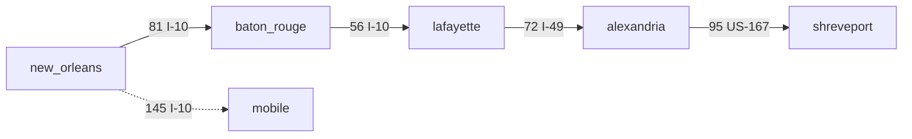
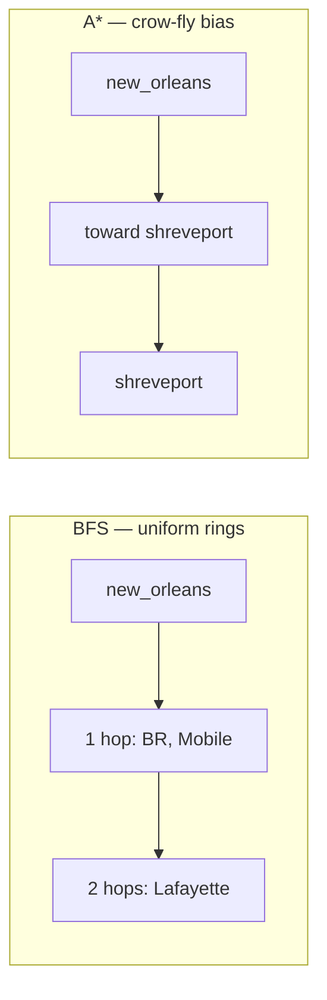

# A* search

**A\*** (A-star) is [best-first](../graph-theory/index.md#best-first-search) graph search that finds a **[shortest path](../graph-theory/index.md#shortest-path)** from a **start** to a **goal** when you have a useful [heuristic](../graph-theory/index.md#heuristic) estimate of remaining cost. It combines **exact cost so far** with **estimated cost to go**—most famously in **GPS navigation** and **downtown street grids** where geometry suggests a cheap lower bound.

| | |
| --- | --- |
| **What it is** | Priority search with $f(n) = g(n) + h(n)$; $g$ = cost from start, $h$ = heuristic to goal. |
| **Core requirement** | [Admissible](../graph-theory/index.md#admissible-heuristic) heuristic: $h(n) \leq$ true remaining cost (never overestimate). |
| **When to use** | GPS routing between cities, downtown block grids, robotics with Manhattan/Euclidean distance. |
| **Time** | Depends on heuristic: $O(V \log V)$ typical with a binary heap; best case far fewer expansions than Dijkstra. |
| **Space** | $O(V)$ for `g`, parent, open heap, and [closed set](../graph-theory/index.md#closed-set). |

On the **Gulf Coast interstate network**, cities are vertices and highway segments carry mile weights. A GPS app routing from `new_orleans` to `shreveport` uses **crow-fly (straight-line) miles** to the goal as **h**—admissible because no road is shorter than the straight line. A\* expands fewer cities than uninformed [Dijkstra](../dijkstra/index.md) when the heuristic points toward the destination.

For **last-mile routing**, the same algorithm runs on a **downtown New Orleans street grid**: intersections are cells, `#` blocks a block, `.` is drivable. [Manhattan distance](../graph-theory/index.md#manhattan-distance) is the standard admissible heuristic on 4-direction grids ([2D grids](../../2d-grids/index.md)).

This page is a **ready reference**: $f = g + h$, admissible heuristics, open/closed sets, Mermaid flow, GPS and grid examples, contrast with BFS/Dijkstra, complexity, pitfalls, practical use cases, and related links. For general graph search, see [Graphs](../index.md). For the priority-queue open set, see [Priority Queue](../../priority-queue/index.md). For Big-O notation, see [Complexity analysis](../../../complexity/index.md).

[Parent: Graphs](../index.md)

---

Throughout: **V** = vertices expanded, **E** = edges relaxed; on an **R × C** grid, **V ≤ R × C**.

---

## Idea

A\* is [goal-directed search](../graph-theory/index.md#goal-directed-search)—**Dijkstra biased toward the goal**. Maintain:

1. **`g(n)`** — best known cost from **start** to vertex **n** (same role as Dijkstra's `dist`).
2. **`h(n)`** — **heuristic** estimate of remaining cost from **n** to **goal** (must be **admissible**: never overestimate true cost).
3. **`f(n) = g(n) + h(n)`** — priority key for the [open set](../graph-theory/index.md#open-set) (min-heap).

Two sets:

| Set | Role |
| --- | --- |
| **Open set** | Frontier vertices queued by **f**; pop the smallest **f** next |
| **Closed set** | Vertices already expanded with best **g** settled |

Start with `g(start) = 0`, push `(f, start)` where `f = h(start)`, then repeat: **pop** min **f**, **goal test**, **relax neighbors** (update `g` and `parent` when a cheaper path is found, push with new **f**). Correctness when **h** is admissible: the first time the goal is popped, the path is optimal.

```mermaid
flowchart TD
  START["Push start city; g=0, f=h(start)"] --> POP["Pop min f from open set"]
  POP --> GOAL{vertex == goal?}
  GOAL -->|yes| PATH["Reconstruct route via parent"]
  GOAL -->|no| CLOSED["Add to closed set"]
  CLOSED --> EXP["For each highway neighbor"]
  EXP --> CALC["tentative_g = g + segment_miles"]
  CALC --> BETTER{tentative_g < g(neighbor)?}
  BETTER -->|yes| UPDATE["Set parent; push (g+h, neighbor)"]
  BETTER -->|no| EXP
  UPDATE --> POP
```

*GPS expansion: the open set always prefers cities that look cheapest overall (miles driven + crow-fly miles remaining).*

---

## Admissible heuristics

A heuristic **h** is **admissible** if it **never overestimates** the true shortest remaining cost to the goal.

| Heuristic | Formula | Admissible when |
| --- | --- | --- |
| **Crow-fly (Euclidean)** | $\sqrt{(lat − glat)^2 + (lon − glon)^2}$ in miles | Road miles ≥ straight-line miles per segment |
| **Manhattan** | $\|r − gr| + |c − gc|$ | Downtown 4-direction grid, cost ≥ 1 per block |
| **Euclidean (grid)** | $\sqrt{(r − gr)^2 + (c − gc)^2}$ | Any move cost ≥ straight-line distance per step |
| **Zero** | h = 0 everywhere | Always (reduces to [Dijkstra](../dijkstra/index.md)) |
| **Diagonal (octile)** | $\max(Δr, Δc)$ or weighted diagonal | 8-direction with correct weights |

On the **Gulf Coast network**, crow-fly miles from `lafayette` to `shreveport` underestimate the true I-49 → US-167 drive—roads bend and cannot beat a straight line. That makes crow-fly **h** admissible for mile-weighted routing.

**[Consistent](../graph-theory/index.md#consistent-heuristic)** (monotone) heuristics satisfy **h(n) ≤ cost(n, n′) + h(n′)**; consistency implies admissibility and avoids re-expanding vertices in standard formulations.

---

## GPS A* on the Gulf Coast network

Vertices are **cities**; edges are **highway segments** with mile weights. The heuristic is **crow-fly miles** from each city to the goal—computed from fixed coordinates (a simplified map projection).

```python
import heapq
import math

INF = float("inf")

# Fictitious coordinates for crow-fly heuristic (not for navigation!)
CITY_COORDS = {
    "new_orleans": (29.95, -90.07),
    "baton_rouge": (30.45, -91.14),
    "lafayette": (30.22, -92.02),
    "alexandria": (31.31, -92.44),
    "shreveport": (32.53, -93.75),
    "mobile": (30.69, -88.04),
}

MILES_PER_DEG = 69.0  # rough flat-earth scale for teaching examples


def crow_fly_miles(city, goal):
    lat1, lon1 = CITY_COORDS[city]
    lat2, lon2 = CITY_COORDS[goal]
    dlat = (lat2 - lat1) * MILES_PER_DEG
    dlon = (lon2 - lon1) * MILES_PER_DEG * math.cos(math.radians(lat1))
    return math.hypot(dlat, dlon)


def build_gulf_coast_adj():
    """Undirected highway mesh — mile weights are fictitious."""
    edges = [
        ("new_orleans", "baton_rouge", 81),   # I-10
        ("baton_rouge", "lafayette", 56),     # I-10
        ("lafayette", "alexandria", 72),      # I-49
        ("alexandria", "shreveport", 95),     # US-167
        ("new_orleans", "mobile", 145),       # I-10
    ]
    adj = {city: [] for city in CITY_COORDS}
    for u, v, w in edges:
        adj[u].append((v, w))
        adj[v].append((u, w))
    return adj


def astar_roads(adj, start, goal):
    """
    A* on city graph with crow-fly heuristic.
    returns: (path, total_miles) or ([], inf) if unreachable
    """
    if start not in adj or goal not in adj:
        return [], INF

    g_score = {start: 0.0}
    parent = {}
    open_heap = []
    counter = 0
    heapq.heappush(open_heap, (crow_fly_miles(start, goal), counter, start))
    counter += 1
    closed = set()

    while open_heap:
        f, _, city = heapq.heappop(open_heap)
        if city in closed:
            continue
        if city == goal:
            path = [city]
            while city in parent:
                city = parent[city]
                path.append(city)
            path.reverse()
            return path, g_score[goal]

        closed.add(city)
        for neighbor, miles in adj.get(city, []):
            tentative = g_score[city] + miles
            if tentative < g_score.get(neighbor, INF):
                g_score[neighbor] = tentative
                parent[neighbor] = city
                h = crow_fly_miles(neighbor, goal)
                heapq.heappush(open_heap, (tentative + h, counter, neighbor))
                counter += 1

    return [], INF


if __name__ == "__main__":
    adj = build_gulf_coast_adj()
    path, miles = astar_roads(adj, "new_orleans", "shreveport")
    assert path == [
        "new_orleans", "baton_rouge", "lafayette", "alexandria", "shreveport"
    ]
    assert miles == 81 + 56 + 72 + 95  # 304 mi via I-10 / I-49 / US-167

    path2, miles2 = astar_roads(adj, "mobile", "alexandria")
    assert path2 == ["mobile", "new_orleans", "baton_rouge", "lafayette", "alexandria"]
    assert miles2 == 145 + 81 + 56 + 72  # 354 mi

    print("new_orleans → shreveport:", miles, "mi via", " → ".join(path))
    print("mobile → alexandria:", miles2, "mi via", " → ".join(path2))
```

| | |
| --- | --- |
| **Time** | O(V log V) with binary heap |
| **Space** | O(V) for g scores, parent map, open/closed structures |

Crow-fly **h** guides expansion **northwest** from `new_orleans` toward `shreveport` instead of exploring `mobile` unless the start city requires it. Tie-break on equal **f** with a monotonic counter (as above) for stable heap ordering—same pattern as [Priority Queue](../../priority-queue/index.md).



*A\* route new_orleans → shreveport: 304 mi along the interstate chain; crow-fly h prunes the Mobile branch early when Shreveport is the goal.*

---

## Downtown grid A* with Manhattan distance

Implicit graph: each **intersection** **(r, c)** in downtown New Orleans is a vertex; edges connect [4-direction neighbors](../../2d-grids/index.md#four-direction-neighbors). Closed blocks (`#`) block moves.

```python
import heapq

DIRS_4 = ((0, 1), (0, -1), (1, 0), (-1, 0))
INF = float("inf")


def manhattan(r, c, gr, gc):
    return abs(r - gr) + abs(c - gc)


def astar_grid(grid, start, goal):
    """
    grid: list of lists; '#' = blocked block, '.' = open street
    start, goal: (row, col) intersections
    returns: list of (r, c) from start to goal, or [] if no path
    """
    rows, cols = len(grid), len(grid[0])
    sr, sc = start
    gr, gc = goal

    if grid[sr][sc] == "#" or grid[gr][gc] == "#":
        return []

    g_score = {(sr, sc): 0}
    parent = {}
    open_heap = []
    counter = 0
    heapq.heappush(open_heap, (manhattan(sr, sc, gr, gc), counter, (sr, sc)))
    counter += 1
    closed = set()

    while open_heap:
        f, _, (r, c) = heapq.heappop(open_heap)
        if (r, c) in closed:
            continue
        if (r, c) == (gr, gc):
            path = [(r, c)]
            while (r, c) in parent:
                r, c = parent[(r, c)]
                path.append((r, c))
            path.reverse()
            return path

        closed.add((r, c))
        for dr, dc in DIRS_4:
            nr, nc = r + dr, c + dc
            if not (0 <= nr < rows and 0 <= nc < cols):
                continue
            if grid[nr][nc] == "#":
                continue
            tentative = g_score[(r, c)] + 1
            if tentative < g_score.get((nr, nc), INF):
                g_score[(nr, nc)] = tentative
                parent[(nr, nc)] = (r, c)
                h = manhattan(nr, nc, gr, gc)
                heapq.heappush(open_heap, (tentative + h, counter, (nr, nc)))
                counter += 1

    return []


def build_downtown_grid():
    """Simplified French Quarter / CBD blocks — # = construction closure."""
    return [
        list("....."),
        list(".###."),
        list(".#.#."),
        list("....."),
    ]


if __name__ == "__main__":
    streets = build_downtown_grid()
    path = astar_grid(streets, (0, 0), (3, 4))
    assert path[0] == (0, 0)
    assert path[-1] == (3, 4)
    for r, c in path:
        assert streets[r][c] != "#"
    assert len(path) == 8  # optimal on 4-direction unit grid

    assert astar_grid(streets, (0, 0), (1, 1)) == []  # goal inside closed block
    print("downtown route length:", len(path), "blocks")
    print("intersections:", " → ".join(f"({r},{c})" for r, c in path))
```

| | |
| --- | --- |
| **Time** | O(V log V) with binary heap; V ≤ R × C |
| **Space** | O(V) for g scores, parent map, open/closed structures |

---

## A* vs BFS vs Dijkstra

| | **BFS** | **[Dijkstra](../dijkstra/index.md)** | **A\*** |
| --- | --- | --- | --- |
| **Cost model** | Unweighted (each edge = 1) | Non-negative weights | Non-negative + heuristic |
| **Priority key** | Layer order (FIFO) | **g** only | **g + h** |
| **Needs heuristic** | No | No | Yes (meaningful speedup) |
| **Optimal?** | Yes (unweighted) | Yes | Yes if **h** admissible |
| **Typical road use** | Fewest highway hops | Shortest miles to all cities | GPS: one origin → one destination |
| **Explored vertices** | Full reachable frontier | All cities by increasing **g** | Often fewer—guided toward goal |
| **Time (grid)** | O(R × C) | O(R × C log(R × C)) | O(V log V), V often ≪ R × C |



**BFS** counts **highway segments** when every link costs 1 hop. **Dijkstra** finds **shortest miles** to every city but radiates in all directions. **A\*** adds crow-fly **h** so expansion prefers cities that look closer to the destination—valuable on large road networks and downtown grids alike.

---

## Complexity

Runtime depends heavily on the **heuristic quality** and **graph shape**. With an **admissible** heuristic, A\* is **complete** and **optimal**; with **h = 0** it matches [Dijkstra](../dijkstra/index.md) behavior.

| Phase | Time | Space |
| --- | --- | --- |
| Initialize open set | O(1) | O(1) |
| Each heap pop / push | O(log V) | — |
| Each neighbor relax | O(log V) push (amortized) | — |
| **Typical total** | O(V log V) with binary heap | O(V) |
| **Best case** (perfect h) | O(L log L) — L = path length | O(L) |
| **Worst case** (h = 0) | Same as Dijkstra: O(V log V) | O(V) |

| Heuristic quality | Expansion behavior |
| --- | --- |
| **Strong** (crow-fly on open highway mesh) | Explores a narrow corridor toward goal |
| **Strong** (Manhattan on downtown grid) | Explores a corridor of blocks toward goal |
| **Weak** (h = 0) | Explores all reachable vertices like Dijkstra |
| **Inadmissible** | May return **suboptimal** route—do not use for GPS |

On an **R × C** downtown grid with Manhattan **h**, **V** is often **O(path length × branching)** rather than **O(R × C)** in practice, though worst case remains **O(R × C log(R × C))**.

---

## Practical use cases

### GPS navigation (interstate routing)

Navigation apps route from one **city** to another on a highway graph. Edge weights are **drive miles** or **minutes**; **h** is **crow-fly miles** to the destination (always ≤ road distance). A\* expands fewer intersections than Dijkstra when the goal is known.

```python
def gps_route(adj, origin_city, dest_city):
    path, miles = astar_roads(adj, origin_city, dest_city)
    return path, miles  # empty path → no connected highway route
```

| | |
| --- | --- |
| **Time** | O(V log V); V ≪ full network when h is good |
| **Space** | O(V) |

### Delivery truck downtown (street grid)

A **delivery truck** crossing downtown New Orleans uses the same A\* loop on a **block grid**: `#` marks a closed street (construction, parade route), `.` is open. Manhattan **h** shrinks explored intersections versus BFS on a multi-square CBD map—same code as the grid example above.

```python
def downtown_delivery(street_grid, depot_intersection, dropoff_intersection):
    path = astar_grid(street_grid, depot_intersection, dropoff_intersection)
    return path
```

| Step | Action |
| --- | --- |
| Rasterize downtown blocks | `#` closed, `.` drivable |
| Pick start / goal intersections | Depot curb, delivery dock |
| Rebuild on closure change | Re-run when parade or construction updates the grid |

Game NPC pathfinding uses the same grid machinery; for interstate trips, prefer the GPS city-graph version above.

**Rule of thumb:** use A\* for **one start → one goal** on road networks or downtown grids with a **proven admissible h**; fall back to [Dijkstra](../dijkstra/index.md) when no reliable heuristic exists (e.g. toll-only cost with no geographic estimate).

---

## Weighted terrain variant

When street types have different move costs—**highway = 1**, **gravel county road = 3**—keep **g** as sum of segment costs. Use a heuristic that **underestimates** those costs: Manhattan × **minimum** road cost.

```python
def astar_weighted(grid, cost_map, start, goal):
    min_cost = min(cost_map.values())
    gr, gc = goal

    def h(r, c):
        return manhattan(r, c, gr, gc) * min_cost

    # Same loop as astar_grid, but step cost = cost_map[grid[nr][nc]]
    ...
```

| Road type | Cost | Heuristic note |
| --- | --- | --- |
| **Highway / paved** | 1 | min_cost = 1 → standard Manhattan h |
| **Gravel county road** | 3 | h = Manhattan × 1 still admissible (underestimates gravel legs) |

| | |
| --- | --- |
| **Time** | O(V log V) |
| **Requirement** | h must stay admissible under weighted moves |

---

## Common pitfalls

| Pitfall | Why it hurts | Fix |
| --- | --- | --- |
| **Inadmissible** heuristic (overestimate crow-fly) | Suboptimal routes | Roads ≥ straight line; Manhattan on 4-grid |
| **Ties on equal f** | Unstable heap order; slower or odd paths | Tie-break with counter or prefer larger h (closer to goal) |
| Forgetting **closed** set | Re-expands cities; slower | Skip pop if already in closed |
| Stale heap entries | Duplicate pops | Skip when popped **g** > best known **g** |
| Using A* for **negative** weights | Wrong optimality | [Bellman–Ford](../bellman-ford/index.md) for toll rebates |
| **8-direction** grid with Manhattan h | h may overestimate diagonals | Octile or Euclidean heuristic |
| No **parent** map | Finds goal but no route | Store `parent[neighbor] = current` |
| **h = 0** on huge networks | Same cost as Dijkstra | Use crow-fly or Manhattan heuristic |

---

## Related pages

| Page | Relationship |
| --- | --- |
| [Graphs](../index.md) | BFS, Dijkstra, Gulf Coast highway graph |
| [Dijkstra](../dijkstra/index.md) | Same relax logic without heuristic; h = 0 case |
| [2D grids](../../2d-grids/index.md) | Downtown neighbor templates, grid-as-graph |
| [Graph theory](../graph-theory/index.md) | Shortest-path definitions, heuristic search |
| [Priority Queue](../../priority-queue/index.md) | Open-set min-heap and tie-breaking |
| [Bellman–Ford](../bellman-ford/index.md) | Negative weights—not A* territory |
| [Complexity analysis](../../../complexity/index.md) | O(V log V) notation |

---

## Quick reference

```python
f = g_score + crow_fly_miles(city, goal)   # GPS on Gulf Coast network
heapq.heappush(open_heap, (f, tie_break, city))

f = g_score + manhattan(r, c, goal)      # downtown New Orleans grid
path = astar_grid(street_grid, start, goal)
```

Use **A\*** for **single start–goal** routing on **highway graphs or downtown grids** when an **admissible heuristic** points toward the target. Use **BFS** for unweighted hop count; use **[Dijkstra](../dijkstra/index.md)** for weighted graphs without a goal bias; use **[Floyd–Warshall](../floyd-warshall/index.md)** when you need **all pairs** of city distances.
