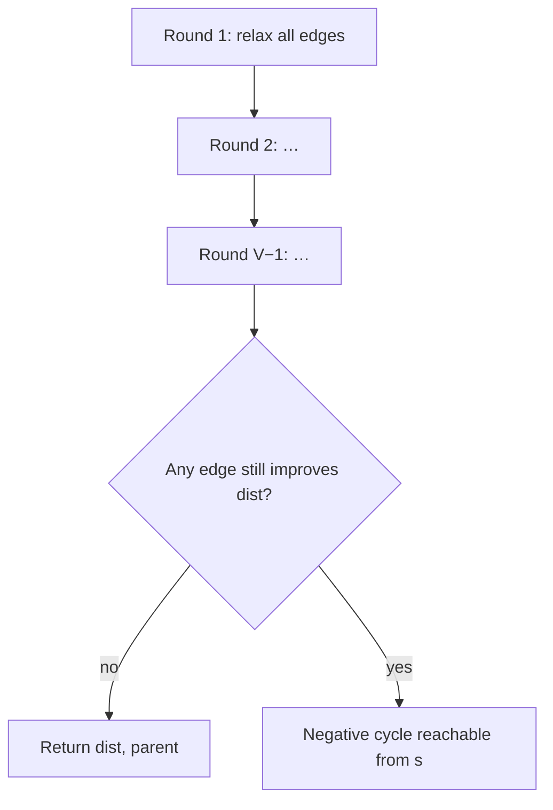

# Bellman–Ford algorithm

The **Bellman–Ford algorithm** computes **[single-source shortest paths](../graph-theory/index.md#single-source-shortest-paths)** in a graph that may include **negative edge weights**. It [relaxes](../graph-theory/index.md#edge-relaxation) **every [edge](../graph-theory/index.md#edge)** up to **V − 1** times, then runs one more pass to **detect [negative cycles](../graph-theory/index.md#negative-cycle)** (reachable loops whose total weight is $< 0$).

| | |
| --- | --- |
| **What it is** | Dynamic programming over edge lists: repeatedly improve `dist[v]` with `dist[u] + w(u, v)`. |
| **Input** | Directed graph (undirected modeled as two directed edges), edge list with weights, source $s$. |
| **Output** | Distance map `dist[v]`; parent map for paths; or **error** if a negative cycle is reachable from $s$. |
| **When to use** | Negative link costs, arbitrage checks, legacy tables with credits, sparse graphs where $O(VE)$ is acceptable. |
| **Time** | $O(VE)$ — V−1 rounds × E relaxations per round. |
| **Space** | $O(V)$ for `dist` and `parent`. |

In **application code**, Bellman–Ford answers questions [Dijkstra](../dijkstra/index.md) cannot: *from New Orleans, some highway segments carry **EZ-Pass toll rebates**. Is there a well-defined cheapest route to Shreveport—or a **rebate loop** you could drive forever?* For **non-negative drive time or toll cost** alone, prefer [Dijkstra](../dijkstra/index.md) at $O((V + E) \log V)$. For **unweighted hop count**, use BFS on the [Graphs hub](../index.md).

> **Learning fiction.** Negative edge weights here model **promotional toll credits**—not real physics. No interstate segment actually pays you to drive it; rebates are a teaching metaphor for signed costs and arbitrage detection.

This page is a **ready reference**: the relaxation idea with Mermaid, runnable Python with **path reconstruction** and **cycle detection**, complexity, pitfalls, a **Gulf Coast interstate** motif with fictional rebates, and comparison tables. For Big-O notation, see [Complexity analysis](../../../complexity/index.md).

---

Throughout: **V** = \|vertices\|, **E** = \|edges\|.

---

## Idea

Initialize `dist[s] = 0`, all other `dist[v] = ∞`, and `parent[s] = None`.

Repeat **V − 1 times**:

- For each directed edge $(u, v, w)$, if `dist[u] + w < dist[v]`, set `dist[v] = dist[u] + w` and `parent[v] = u`.

After V − 1 rounds, [shortest paths](../graph-theory/index.md#shortest-path) are settled **if no [negative cycle](../graph-theory/index.md#negative-cycle) is reachable** (standard proof: simple shortest path has at most V − 1 edges).

**One more full pass** over edges: if any relaxation still succeeds, a **negative cycle** exists.



*Unlike [Dijkstra](../dijkstra/index.md), there is no [priority queue](../../priority-queue/index.md)—every round scans the full edge list.*

---

## Reference implementation

Standalone **edge-list** API (works even when vertices are not all present in an adjacency dict). Includes **path reconstruction** and **negative-cycle detection**.

```python
class BellmanFordError(ValueError):
    """Raised when a negative cycle is reachable from the source."""


def bellman_ford(vertices, edges, src):
    """
    edges: list of (u, v, weight) directed triples
    Returns (dist, parent) or raises BellmanFordError.
    """
    dist = {v: float("inf") for v in vertices}
    parent = {v: None for v in vertices}
    if src not in dist:
        dist[src] = 0.0
        parent[src] = None
    else:
        dist[src] = 0.0

    n = len(vertices)
    for _ in range(n - 1):
        updated = False
        for u, v, w in edges:
            du = dist.get(u, float("inf"))
            if du == float("inf"):
                continue
            nd = du + w
            if nd < dist.get(v, float("inf")):
                dist[v] = nd
                parent[v] = u
                updated = True
        if not updated:
            break

    for u, v, w in edges:
        du = dist.get(u, float("inf"))
        if du == float("inf"):
            continue
        if du + w < dist.get(v, float("inf")):
            raise BellmanFordError(
                f"negative cycle reachable from {src!r} (edge {u!r} → {v!r})"
            )

    return dist, parent


def reconstruct_path(parent, src, dst):
    if dst not in parent or parent.get(dst) is None and dst != src:
        if dst != src:
            return []
    path = []
    cur = dst
    seen = set()
    while cur is not None:
        if cur in seen:
            return []  # defensive: cycle in parent chain
        seen.add(cur)
        path.append(cur)
        cur = parent.get(cur)
    path.reverse()
    return path if path and path[0] == src else []


def edges_from_weighted_graph(wg):
    out = []
    for u, nbrs in wg.adj.items():
        for v, w in nbrs:
            out.append((u, v, w))
    return out


class WeightedGraph:
    def __init__(self, directed=True):
        self.directed = directed
        self.adj = {}

    def add_edge(self, u, v, weight=1.0):
        self.adj.setdefault(u, []).append((v, weight))
        if not self.directed:
            self.adj.setdefault(v, []).append((u, weight))
        else:
            self.adj.setdefault(v, [])

    def vertices(self):
        verts = set(self.adj.keys())
        for u in self.adj:
            for v, _ in self.adj[u]:
                verts.add(v)
        return sorted(verts)


if __name__ == "__main__":
    # Gulf Coast interstate network — weights in minutes or toll dollars.
    # Negative weights = fictional EZ-Pass promotional credits (not real rebates).
    wg = WeightedGraph(directed=True)
    wg.add_edge("new_orleans", "baton_rouge", 80.0)
    wg.add_edge("baton_rouge", "lafayette", 60.0)
    wg.add_edge("new_orleans", "lafayette", 150.0)
    wg.add_edge("lafayette", "new_orleans", -200.0)  # rebate loop — arbitrage cycle

    verts = wg.vertices()
    edges = edges_from_weighted_graph(wg)

    try:
        bellman_ford(verts, edges, "new_orleans")
        raise SystemExit("expected negative cycle")
    except BellmanFordError as exc:
        assert "negative cycle" in str(exc)

    # Acyclic graph with one negative edge (no cycle)
    wg2 = WeightedGraph(directed=True)
    wg2.add_edge("mobile", "new_orleans", -5.0)       # EZ-Pass signup credit at Mobile
    wg2.add_edge("new_orleans", "baton_rouge", 80.0)
    wg2.add_edge("baton_rouge", "lafayette", 60.0)
    wg2.add_edge("lafayette", "alexandria", 120.0)
    wg2.add_edge("alexandria", "shreveport", 180.0)
    wg2.add_edge("new_orleans", "lafayette", 150.0)   # direct I-10 bypass

    verts2 = wg2.vertices()
    edges2 = edges_from_weighted_graph(wg2)
    dist, parent = bellman_ford(verts2, edges2, "mobile")
    assert dist["new_orleans"] == -5.0
    assert dist["baton_rouge"] == 75.0
    assert dist["lafayette"] == 135.0
    assert dist["shreveport"] == 435.0

    path = reconstruct_path(parent, "mobile", "shreveport")
    assert path == [
        "mobile", "new_orleans", "baton_rouge", "lafayette", "alexandria", "shreveport"
    ]

    print("dist from mobile:", {k: round(v, 1) for k, v in sorted(dist.items())})
    print("mobile → shreveport:", " → ".join(path))
```

| | |
| --- | --- |
| **Time** | $O(VE)$ worst case; early exit when a round makes no updates |
| **Space** | $O(V)$ |

---

## Path reconstruction (parent map)

Same **parent walk** as [Dijkstra](../dijkstra/index.md): after `bellman_ford` succeeds, follow `parent[dst]` back to `src`.

| Step | Meaning |
| --- | --- |
| Relax `(u, v, w)` | If improved, `parent[v] = u` |
| V − 1 rounds | Guarantees shortest simple path when no negative cycle |
| Final scan | Any improvement ⇒ negative cycle |


*Effective cost mobile → shreveport = $-5 + 80 + 60 + 120 + 180 = 435$ — a single **negative edge** (EZ-Pass credit at Mobile) is legal; a **cycle** with net $< 0$ is not.*

---

## Complexity

| Phase | Time | Space |
| --- | --- | --- |
| Initialize `dist`, `parent` | $O(V)$ | $O(V)$ |
| V − 1 relaxation rounds | $O(VE)$ | $O(1)$ extra |
| Negative-cycle check | $O(E)$ | $O(1)$ |
| Path reconstruction | $O(L)$ | $O(L)$ output |
| **Total** | $O(VE)$ | $O(V)$ |

| Variant | Time | Notes |
| --- | --- | --- |
| Standard Bellman–Ford | $O(VE)$ | This page |
| Early termination | $O(kE)$ best | $k$ rounds until no change |
| [Dijkstra](../dijkstra/index.md) + binary heap | $O((V + E) \log V)$ | Non-negative weights only |
| BFS | $O(V + E)$ | Unweighted only |

---

## Bellman–Ford vs Dijkstra vs BFS

| | **BFS** | **[Dijkstra](../dijkstra/index.md)** | **Bellman–Ford** |
| --- | --- | --- | --- |
| **Edge weights** | Implicit 1 | $\geq 0$ | Any real weights |
| **Negative edges** | N/A (same as weight 1) | **Invalid** — wrong answer | Supported |
| **Negative cycle detection** | No | No | **Yes** (extra pass) |
| **Time** | $O(V + E)$ | $O((V + E) \log V)$ | $O(VE)$ |
| **Data structure** | [Queue](../../queue/index.md) | [Min heap / PQ](../../priority-queue/index.md) | Edge list only |
| **Typical Gulf Coast motif** | Hop count between cities | Drive time / toll routing | Rebates + arbitrage audit |

---

## When to pick Bellman–Ford over Dijkstra

| Situation | Pick |
| --- | --- |
| All edge weights $\geq 0$ (drive minutes, toll dollars) | [Dijkstra](../dijkstra/index.md) — faster |
| Some edges may be negative, graph is a [DAG](../graph-theory/index.md#dag) | One topological pass also works; Bellman–Ford is simpler to code |
| Must detect **arbitrage / rebate loop** | Bellman–Ford |
| $|V| \approx 10^4$, $|E| \approx 10^5$, non-negative | Dijkstra — $O(E \log V)$ scales better |
| Small $|V|$, dense $|E| \approx V^2$, negative weights | Bellman–Ford may be acceptable |
| Need **all-pairs** shortest paths (small V) | Floyd–Warshall $O(V^3)$ — out of scope here |

**Rule of thumb:** default to **Dijkstra** for production drive-time or toll graphs with no credits; reach for **Bellman–Ford** when the model includes **EZ-Pass rebates, promotional credits, or currency** and you must prove **no negative cycle** exists.

---

## Practical use case: EZ-Pass rebates on Gulf Coast interstates

Suppose a toll authority runs a **temporary EZ-Pass credit** on one direction of a segment (negative weight). Before publishing updated route guidance, verify the promotion cannot create a **rebate arbitrage loop**—a cycle where driving around and returning nets savings forever (fictitious; real toll systems forbid this).

```python
def audit_road_network(wg, origin):
    verts = wg.vertices()
    edges = edges_from_weighted_graph(wg)
    try:
        dist, parent = bellman_ford(verts, edges, origin)
    except BellmanFordError as exc:
        return {"ok": False, "error": str(exc)}
    return {
        "ok": True,
        "dist": dist,
        "sample_path": reconstruct_path(parent, origin, "shreveport"),
    }


wg = WeightedGraph(directed=True)
wg.add_edge("new_orleans", "baton_rouge", 80.0)
wg.add_edge("baton_rouge", "lafayette", 60.0)
wg.add_edge("lafayette", "alexandria", 120.0)
wg.add_edge("alexandria", "shreveport", 180.0)
report = audit_road_network(wg, "new_orleans")
assert report["ok"] is True
```

| Check | Bellman–Ford result |
| --- | --- |
| Acyclic rebates | `ok: True`, finite `dist` |
| Rebate completes a negative loop | `BellmanFordError` — block promotion rollout |
| Same graph, non-negative only | Prefer [Dijkstra](../dijkstra/index.md) for speed |

---

## Common pitfalls

| Pitfall | Why it hurts | Fix |
| --- | --- | --- |
| Running [Dijkstra](../dijkstra/index.md) with negative edges | Incorrect distances | Bellman–Ford or reweight |
| Fewer than V − 1 rounds | Paths using $\geq V$ edges missed | Always run full V − 1 (or prove early stop safe) |
| Skipping cycle-detection pass | Silent infinite improvement | Final relax scan |
| Undirected edge stored once | Must relax both directions | Two directed edges or halve logic |
| `dist[u] = inf` still relaxed | Skip when `du == inf` | Guard before `du + w` |
| Confusing negative **edge** vs **cycle** | Single −5 credit is OK; −5 rebate loop is not | Run round V |

---

## Related pages

| Page | Relationship |
| --- | --- |
| [Graphs hub](../index.md) | Representations, BFS/DFS, `WeightedGraph` sketch |
| [Dijkstra](../dijkstra/index.md) | Non-negative fast path; min-[Priority queue](../../priority-queue/index.md) |
| [Priority queue](../../priority-queue/index.md) | Not used by Bellman–Ford; contrast with Dijkstra |
| [Min heap](../../min-heap/index.md) | Dijkstra frontier; Bellman–Ford uses edge scans |
| [Queue](../../queue/index.md) | BFS for unweighted shortest hops |
| [Complexity analysis](../../../complexity/index.md) | $O(VE)$ notation |

---

## Quick reference

```python
dist, parent = bellman_ford(vertices, edges, src)
path = reconstruct_path(parent, src, dst)
# Raises BellmanFordError if negative cycle reachable from src
```

Use **Bellman–Ford** when weights may be **negative** or you must **detect negative cycles**. Use [Dijkstra](../dijkstra/index.md) when weights are **non-negative** and $O((V + E) \log V)$ matters—typical **Gulf Coast drive time** without promotional toll credits.
