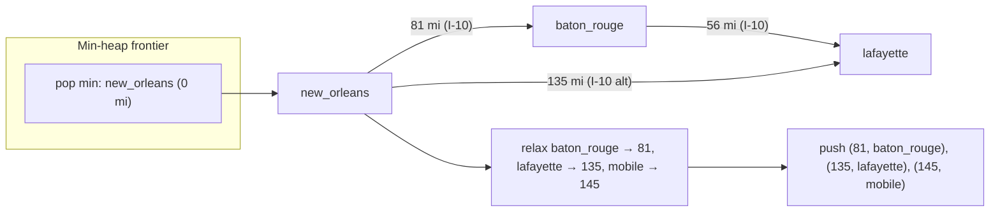
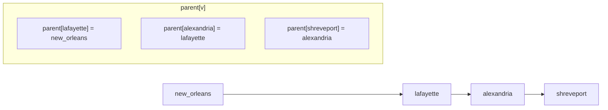

# Dijkstra's algorithm

**Dijkstra's algorithm** finds **[single-source shortest paths](../graph-theory/index.md#single-source-shortest-paths)** to all reachable **[vertices](../graph-theory/index.md#vertex)** in a **weighted graph with [non-negative edge weights](../graph-theory/index.md#non-negative-weights)**. It repeatedly expands the vertex with the **smallest tentative distance**—exactly the job of a **min-[priority queue](../../priority-queue/index.md)** ([Min heap](../../min-heap/index.md)).

| | |
| --- | --- |
| **What it is** | Greedy [single-source shortest path](../graph-theory/index.md#single-source-shortest-paths): [relax](../graph-theory/index.md#edge-relaxation) [edges](../graph-theory/index.md#edge) from the closest unvisited vertex until the [priority queue](../../priority-queue/index.md) is empty. |
| **Input** | Directed or undirected graph, weights $\geq 0$, source vertex $s$. |
| **Output** | Distance map `dist[v]` = minimum cost $s \to v$; optional parent map for path reconstruction. |
| **When to use** | Road mileage routing, map distance, network cost, any **non-negative** weighted [shortest path](../graph-theory/index.md#shortest-path). |
| **Time** | $O((V + E) \log V)$ with a binary min-heap (`heapq`). |
| **Space** | $O(V)$ for `dist`, parent, and heap frontier. |

In **application code**, Dijkstra answers **“what is the shortest drive from New Orleans to every other Gulf Coast city?”** when segment miles are always $\geq 0$. You will still store the road network in **config or a database**—the algorithm runs on an in-memory adjacency list built from that data. For unweighted hop count, use BFS on the [Graphs hub](../index.md); for **negative edge weights**, use [Bellman–Ford](../bellman-ford/index.md).

This page is a **ready reference**: the greedy idea with Mermaid, a complete Python implementation with **path reconstruction**, complexity, pitfalls, a Gulf Coast interstate example, and links to related structures. For Big-O notation, see [Complexity analysis](../../../complexity/index.md).

---

Throughout: **V** = \|vertices\|, **E** = \|edges\|, **deg(v)** = degree of vertex v.

---

## Idea

Maintain two maps:

1. **`dist[v]`** — best known cost from source to $v$ (tentative until popped).
2. **`parent[v]`** — predecessor on that best path (for reconstruction).

Start with `dist[src] = 0` and push `(0, src)` onto a **min-heap**. Repeatedly **pop** the vertex $u$ with smallest `dist[u]`, **relax** each outgoing edge $(u, v, w)$: if `dist[u] + w < dist[v]`, update `dist[v]` and `parent[v] = u`, then push `(dist[v], v)`.

**Greedy correctness** relies on **non-negative weights**: once $u$ is popped, no later path can improve `dist[u]`.



*Gulf Coast motif: expand from New Orleans first; I-10 to Baton Rouge at 81 mi is settled before considering longer multi-hop paths through other corridors.*

---

## WeightedGraph + Dijkstra with path reconstruction

Extends the [Graphs hub](../index.md) `WeightedGraph` with **`parent`** tracking and **`shortest_path(src, dst)`**.

```python
import heapq


class WeightedGraph:
    def __init__(self, directed=True):
        self.directed = directed
        self.adj = {}

    def add_edge(self, u, v, weight=1.0):
        self.adj.setdefault(u, []).append((v, weight))
        if not self.directed:
            self.adj.setdefault(v, []).append((u, weight))
        else:
            self.adj.setdefault(v, [])

    def vertices(self):
        seen = set(self.adj.keys())
        for u in self.adj:
            for v, _ in self.adj[u]:
                seen.add(v)
        return list(seen)

    def dijkstra(self, src):
        """Return (dist, parent) from src to all reachable vertices."""
        dist = {src: 0.0}
        parent = {src: None}
        pq = [(0.0, src)]

        while pq:
            d, u = heapq.heappop(pq)
            if d > dist.get(u, float("inf")):
                continue
            for v, w in self.adj.get(u, []):
                nd = d + w
                if nd < dist.get(v, float("inf")):
                    dist[v] = nd
                    parent[v] = u
                    heapq.heappush(pq, (nd, v))

        return dist, parent

    def reconstruct_path(self, parent, src, dst):
        if dst not in parent and dst != src:
            return []
        path = []
        cur = dst
        while cur is not None:
            path.append(cur)
            cur = parent.get(cur)
        path.reverse()
        if path and path[0] == src:
            return path
        return []

    def shortest_path(self, src, dst):
        dist, parent = self.dijkstra(src)
        total = dist.get(dst, float("inf"))
        path = self.reconstruct_path(parent, src, dst)
        return total, path


def build_gulf_coast_network():
    """Fictitious Gulf Coast interstate miles (undirected)."""
    wg = WeightedGraph(directed=False)
    wg.add_edge("new_orleans", "baton_rouge", 81.0)   # I-10
    wg.add_edge("baton_rouge", "lafayette", 56.0)    # I-10
    wg.add_edge("lafayette", "alexandria", 72.0)     # I-49
    wg.add_edge("alexandria", "shreveport", 95.0)    # US-167
    wg.add_edge("new_orleans", "mobile", 145.0)      # I-10
    wg.add_edge("new_orleans", "lafayette", 135.0)   # I-10 longer route
    return wg


if __name__ == "__main__":
    roads = build_gulf_coast_network()
    dist, parent = roads.dijkstra("new_orleans")
    assert dist["baton_rouge"] == 81.0
    assert dist["lafayette"] == 135.0  # direct beats new_orleans → baton_rouge → lafayette (137 mi)
    assert dist["shreveport"] == 302.0  # 135 + 72 + 95 via lafayette and alexandria

    total, path = roads.shortest_path("new_orleans", "shreveport")
    assert total == 302.0
    assert path == ["new_orleans", "lafayette", "alexandria", "shreveport"]

    total2, path2 = roads.shortest_path("new_orleans", "mobile")
    assert total2 == 145.0
    assert path2 == ["new_orleans", "mobile"]

    print("dist from new_orleans:", {k: round(v, 1) for k, v in sorted(dist.items())})
    print("new_orleans → shreveport:", total, "mi via", " → ".join(path))
```

| | |
| --- | --- |
| **Time** | $O((V + E) \log V)$ — each edge relaxed at most once per improvement; heap push/pop $O(\log V)$ |
| **Space** | $O(V)$ |

**Note:** The min-heap here uses **lazy deletion** (skip stale entries when `d > dist[u]`). That matches Python `heapq` usage in the [Priority queue](../../priority-queue/index.md) reference and avoids an indexed decrease-key map for teaching clarity.

---

## Path reconstruction (parent map)

After `dijkstra(src)` returns `(dist, parent)`:

```python
def path_from_parent(parent, src, dst):
    if dst not in parent:
        return []  # unreachable
    out = []
    cur = dst
    while cur is not None:
        out.append(cur)
        cur = parent.get(cur)
    out.reverse()
    return out if out and out[0] == src else []


dist, parent = roads.dijkstra("new_orleans")
route = path_from_parent(parent, "new_orleans", "shreveport")
# route == ["new_orleans", "lafayette", "alexandria", "shreveport"]
```

| Step | Meaning |
| --- | --- |
| `parent[v] = u` | Best path to $v$ goes through $u$ |
| Walk `dst → src` via `parent` | Reverse to get forward route |
| Missing `dst` in `parent` | $dst$ unreachable from source |



---

## Complexity

| Phase | Time | Space |
| --- | --- | --- |
| Initialize `dist`, `parent`, heap | $O(1)$ | $O(V)$ |
| Each heap pop | $O(\log V)$ | — |
| Each edge relaxation | $O(\log V)$ push (amortized) | — |
| **Total** | $O((V + E) \log V)$ binary heap | $O(V)$ |
| Path reconstruction | $O(L)$ path length | $O(L)$ output |

| Implementation | Extract-min | Total time |
| --- | --- | --- |
| Binary heap (`heapq`, lazy) | $O(\log V)$ | $O((V + E) \log V)$ |
| Indexed min-heap (decrease-key) | $O(\log V)$ | $O((V + E) \log V)$ — fewer pushes |
| Array scan (no heap) | $O(V)$ | $O(V^2)$ — small dense graphs only |
| Fibonacci heap (theory) | $O(1)$ amortized decrease | $O(E + V \log V)$ |

---

## Dijkstra vs BFS vs Bellman–Ford

| | **BFS** | **Dijkstra** | **[Bellman–Ford](../bellman-ford/index.md)** |
| --- | --- | --- | --- |
| **Edge weights** | Unweighted (cost 1) | Non-negative | Any (detects negative cycles) |
| **[Single-source shortest path](../graph-theory/index.md#single-source-shortest-paths)** | Yes (min hops) | Yes (min cost) | Yes |
| **Time** | $O(V + E)$ | $O((V + E) \log V)$ | $O(VE)$ |
| **Priority queue** | FIFO [Queue](../../queue/index.md) | Min [Priority queue](../../priority-queue/index.md) | None (V−1 rounds) |
| **Typical use** | Social hop count | Road miles / drive time | Currency arbitrage, legacy cost tables |

---

## Practical use case: shortest route from New Orleans

Transportation planners model **cities as vertices** and **interstate segments as weighted undirected edges** (drive miles). A routing dashboard asks: *from New Orleans, what is the shortest path to every other city on the Gulf Coast network?*

```python
def route_report(wg, origin):
    dist, parent = wg.dijkstra(origin)
    rows = []
    for city in sorted(dist):
        if city == origin:
            continue
        _, path = wg.shortest_path(origin, city)
        rows.append((city, dist[city], " → ".join(path)))
    return rows


roads = build_gulf_coast_network()
for city, miles, route in route_report(roads, "new_orleans"):
    print(f"{city:14s}  {miles:5.1f} mi  {route}")
```

| City | Miles | Route |
| --- | --- | --- |
| baton_rouge | 81.0 mi | new_orleans → baton_rouge |
| lafayette | 135.0 mi | new_orleans → lafayette |
| alexandria | 207.0 mi | new_orleans → lafayette → alexandria |
| shreveport | 302.0 mi | new_orleans → lafayette → alexandria → shreveport |
| mobile | 145.0 mi | new_orleans → mobile |

**Rule of thumb:** ingest edges from your road-network service, run Dijkstra once per origin city you care about, cache `dist` until the graph changes.

---

## Common pitfalls

| Pitfall | Why it hurts | Fix |
| --- | --- | --- |
| **Negative edge weight** | Greedy pop is no longer optimal; wrong distances | [Bellman–Ford](../bellman-ford/index.md) |
| **Using BFS on weighted graph** | Ignores cheaper multi-hop routes | Dijkstra or Bellman–Ford |
| **No parent map** | You have distance but not the route | Track `parent[v] = u` on relax |
| **Stale heap entries** | Same vertex pushed many times | Skip when `d > dist[u]` |
| **Missing vertices** | Isolated nodes absent from `adj` | Call `add_edge` or seed all keys |
| **Undirected double relax** | Usually fine; watch duplicate edges in `adj` | Store each undirected edge once |

---

## Related pages

| Page | Relationship |
| --- | --- |
| [Graphs hub](../index.md) | `WeightedGraph`, BFS/DFS, representations |
| [Bellman–Ford](../bellman-ford/index.md) | Negative weights and cycle detection |
| [Priority queue](../../priority-queue/index.md) | Min-PQ drives Dijkstra; indexed decrease-key |
| [Min heap](../../min-heap/index.md) | `heapq` / sift-up frontier semantics |
| [Queue](../../queue/index.md) | BFS for unweighted shortest hops |
| [Complexity analysis](../../../complexity/index.md) | $O((V + E) \log V)$ notation |

---

## Quick reference

```python
dist, parent = wg.dijkstra("new_orleans")
total, path = wg.shortest_path("new_orleans", "shreveport")
# Requires non-negative weights; min-heap via heapq
```

Use **Dijkstra** when edges have **non-negative cost** and you need **single-source shortest paths**—road mileage, drive minutes, or network tariff. Reach for [Bellman–Ford](../bellman-ford/index.md) when weights can be negative or you must detect **negative cycles**.
