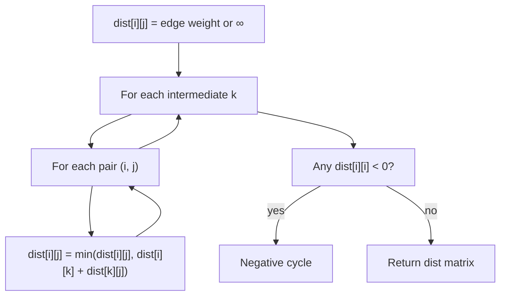
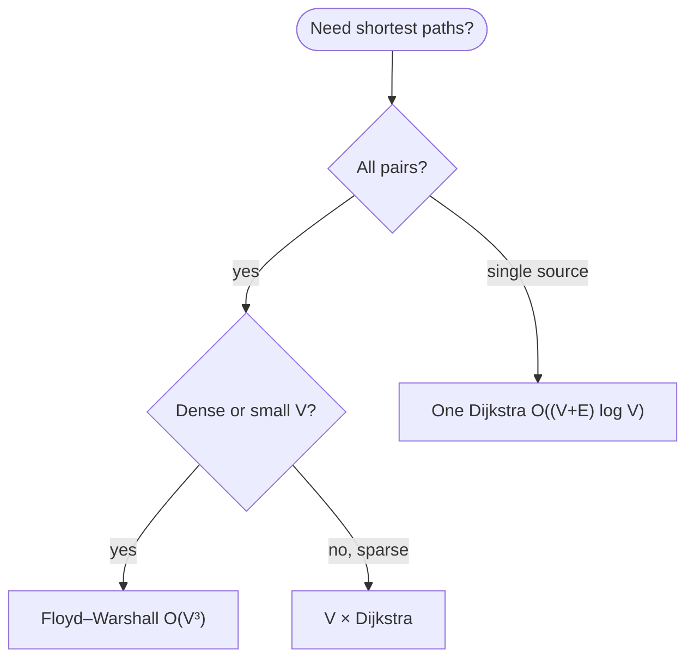

# Floyd–Warshall

**Floyd–Warshall** computes [all-pairs shortest paths](../graph-theory/index.md#all-pairs-shortest-paths) in a weighted graph. It is [dynamic programming](../../../algorithms/dynamic-programming/index.md) on a **V × V distance matrix**: try each vertex **k** as an intermediate hop and [relax](../graph-theory/index.md#edge-relaxation) all pairs **(i, j)**.

| | |
| --- | --- |
| **What it is** | All-pairs shortest paths (APSP) via DP; handles negative edge weights (no [negative cycles](../graph-theory/index.md#negative-cycle)). |
| **Core idea** | `dist[i][j] = min(dist[i][j], dist[i][k] + dist[k][j])` for each intermediate k. |
| **When to use** | [Dense](../graph-theory/index.md#degree-and-density) graphs, need **full distance table**, small V, or repeated pair queries after one preprocessing pass. |
| **Trade-off** | O(V³) time and O(V²) space—simple but heavy when V is large or the graph is sparse. |

In **routing dashboards**, you often need *drive miles from every Gulf Coast city to every other city*—not just one origin. Floyd–Warshall fills an entire **V × V table** in one run. For a **single source**, Dijkstra on an adjacency list is usually better ([Dijkstra](../dijkstra/index.md)).

This page is a **ready reference**: DP recurrence, Mermaid flow, Python implementation, negative-cycle detection, comparison to repeated Dijkstra, pitfalls, and related links. For Big-O notation, see [Complexity analysis](../../../complexity/index.md).

[Parent: Graphs](../index.md)

---

Throughout: **V** = \|vertices\|, **E** = \|edges\|.

---

## Floyd–Warshall at a glance

| Property | Detail |
| --- | --- |
| **Input** | Directed or undirected graph as V × V weight matrix (use ∞ for no edge) |
| **Output** | `dist[i][j]` = shortest path weight from i to j |
| **Negative edges** | Allowed if no [negative cycle](../graph-theory/index.md#negative-cycle) reachable |
| **Negative cycle** | Detect when `dist[i][i] < 0` after DP |
| **Path reconstruction** | Optional `next[i][j]` matrix updated alongside distances |



*Three nested loops: outer index k is the "via" vertex; inner loops try all source–destination pairs.*

---

## DP recurrence

Let **D^k[i][j]** be the shortest path from **i** to **j** using only intermediate vertices from **{0, …, k−1}**.

$$
D^0[i][j] = w(i, j) \text{ or } \infty
$$

$$
D^{k+1}[i][j] = \min\bigl(D^k[i][j],\; D^k[i][k] + D^k[k][j]\bigr)
$$

After **k = V**, **D^V[i][j]** is the shortest path length (or **∞** if unreachable).

| Concept | Meaning |
| --- | --- |
| **Base case** | Direct edge i → j, or ∞ |
| **Transition** | Route through k or keep best known |
| **Order of k** | Any vertex order works; index by id consistently |
| **Undirected graph** | Mirror weights: `w[j][i] = w[i][j]` |

---

## Reference implementation

```python
INF = float("inf")


def floyd_warshall(dist):
    """
    dist: V × V list of lists; dist[i][j] = weight or INF
    returns: (dist, has_negative_cycle)
    Mutates dist in place.
    """
    n = len(dist)
    for k in range(n):
        for i in range(n):
            dik = dist[i][k]
            if dik == INF:
                continue
            for j in range(n):
                alt = dik + dist[k][j]
                if alt < dist[i][j]:
                    dist[i][j] = alt

    for i in range(n):
        if dist[i][i] < 0:
            return dist, True
    return dist, False


def build_dist_matrix(vertices, edges, directed=True):
    """vertices: ordered list; edges: (u_idx, v_idx, weight)."""
    n = len(vertices)
    dist = [[INF] * n for _ in range(n)]
    for i in range(n):
        dist[i][i] = 0
    for u, v, w in edges:
        if w < dist[u][v]:
            dist[u][v] = w
        if not directed and w < dist[v][u]:
            dist[v][u] = w
    return dist


# Gulf Coast interstate network (indices 0..5)
names = [
    "new_orleans", "baton_rouge", "lafayette",
    "alexandria", "shreveport", "mobile",
]
edges = [
    (0, 1, 81),   # I-10
    (1, 2, 56),   # I-10
    (2, 3, 72),   # I-49
    (3, 4, 95),   # US-167
    (0, 5, 145),  # I-10
    (0, 2, 135),  # I-10 longer route
]
dist = build_dist_matrix(names, edges, directed=False)
dist, neg_cycle = floyd_warshall(dist)
# dist[0][4] == 302 via lafayette and alexandria (135 + 72 + 95),
# cheaper than new_orleans → baton_rouge → lafayette → alexandria → shreveport (304 mi)
miles_new_orleans_to_shreveport = dist[0][4]
```

| | |
| --- | --- |
| **Time** | O(V³) — three nested loops |
| **Space** | O(V²) for distance matrix (input + output) |

---

## Path reconstruction (optional)

Track **next[i][j]** = first step from **i** toward **j** on a shortest path. Initialize `next[i][j] = j` when an edge exists.

```python
def floyd_warshall_with_next(dist, next_):
    n = len(dist)
    for k in range(n):
        for i in range(n):
            if dist[i][k] == INF:
                continue
            for j in range(n):
                alt = dist[i][k] + dist[k][j]
                if alt < dist[i][j]:
                    dist[i][j] = alt
                    next_[i][j] = next_[i][k]

    for i in range(n):
        if dist[i][i] < 0:
            return True
    return False


def reconstruct_path(next_, i, j):
    if next_[i][j] is None:
        return []
    path = [i]
    while i != j:
        i = next_[i][j]
        path.append(i)
    return path
```

| | |
| --- | --- |
| **Time** | Still O(V³) |
| **Space** | O(V²) for `next` matrix |

---

## Negative cycle detection

After the triple loop, if **dist[i][i] < 0** for any **i**, a **negative cycle** exists that includes vertex **i**. Shortest-path distances are undefined in that case.

| Signal | Meaning |
| --- | --- |
| `dist[i][i] < 0` after FW | Negative cycle reachable from i |
| `dist[i][j] = -∞` (theory) | Often propagated in extended algorithms |
| **Fix in apps** | Remove cycle edge, reweight, or report error |

```python
def has_negative_cycle(dist):
    n = len(dist)
    return any(dist[i][i] < 0 for i in range(n))
```

Bellman–Ford from each source also detects negative cycles but costs O(V²E)—Floyd–Warshall is simpler when you already need the full matrix.

---

## Floyd–Warshall vs repeated Dijkstra

| | **Floyd–Warshall** | **V × Dijkstra** |
| --- | --- | --- |
| **Time** | O(V³) | O(V · (V + E) log V) with binary heap |
| **Space** | O(V²) matrix | O(V) per run + O(V + E) graph |
| **Negative edges** | Yes (no negative cycle) | No (non-negative weights only) |
| **Best when** | Dense graph, small V, need all pairs | Sparse graph, large V, few sources |
| **Implementation** | Three loops, no heap | Adjacency list + [priority queue](../../priority-queue/index.md) |



**Rule of thumb:** if **V ≤ 400** and you need the full table, Floyd–Warshall is often fine. If **E << V²** and you only need a few sources, run Dijkstra per source instead.

---

## Application: routing dashboard — all-pairs distance matrix

Transportation planners export a **full mileage matrix** for corridor planning: every Gulf Coast city pair in one table for heatmaps and drive-time estimates.

```python
def distance_matrix(city_names, segments):
    idx = {name: i for i, name in enumerate(city_names)}
    edges = [(idx[u], idx[v], w) for u, v, w in segments]
    dist = build_dist_matrix(city_names, edges, directed=False)
    dist, neg = floyd_warshall(dist)
    if neg:
        raise ValueError("negative cycle in road network")
    return {city_names[i]: {city_names[j]: dist[i][j] for j in range(len(city_names))}
            for i in range(len(city_names))}


cities = [
    "new_orleans", "baton_rouge", "lafayette",
    "alexandria", "shreveport", "mobile",
]
segments = [
    ("new_orleans", "baton_rouge", 81),
    ("baton_rouge", "lafayette", 56),
    ("lafayette", "alexandria", 72),
    ("alexandria", "shreveport", 95),
    ("new_orleans", "mobile", 145),
    ("new_orleans", "lafayette", 135),
]
matrix = distance_matrix(cities, segments)
# matrix["new_orleans"]["shreveport"] == 302
# matrix["new_orleans"]["lafayette"] == 135 (direct beats via baton_rouge at 137)
```

| | |
| --- | --- |
| **Time** | O(V³) per snapshot |
| **Space** | O(V²) |

---

## Common pitfalls

| Pitfall | Why it hurts | Fix |
| --- | --- | --- |
| Using **∞ + weight** without guard | `INF - x` or bad relaxations | Skip when `dist[i][k] == INF` |
| **Off-by-one** vertex indexing | Wrong cell in matrix | Map names → indices once; keep order fixed |
| Floyd–Warshall on **large V** (10⁴+) | O(V³) explodes | Sparse graph + Dijkstra per source |
| Ignoring **negative cycles** | Garbage distances | Check diagonal `dist[i][i] < 0` |
| Storing only **upper triangle** for undirected | Reconstruction bugs | Mirror or read both (i,j) and (j,i) |
| Confusing with **Warshall** (transitive closure) | Uses `or` / `min` on booleans vs weights | Transitive closure: `reach[i][j] |= reach[i][k] & reach[k][j]` |

---

## Related pages

| Page | Relationship |
| --- | --- |
| [Graphs](../index.md) | Adjacency matrix, Dijkstra, representations |
| [Priority queue](../../priority-queue/index.md) | Dijkstra alternative for sparse APSP |
| [2D grids](../../2d-grids/index.md) | Grid DP is different (often single-source BFS) |
| [Complexity analysis](../../../complexity/index.md) | O(V³) notation |

---

## Quick reference card

```python
dist = build_dist_matrix(vertices, edges)
dist, neg = floyd_warshall(dist)
if neg:
    raise ValueError("negative cycle")

# dist[i][j] = shortest weight from vertex i to j
```

Use **Floyd–Warshall** when you need a **complete distance table** and **V is modest** or the graph is **dense**. Use **repeated Dijkstra** when the graph is **sparse** and **V is large**. Check the **diagonal** for **negative cycles** before trusting the matrix.
