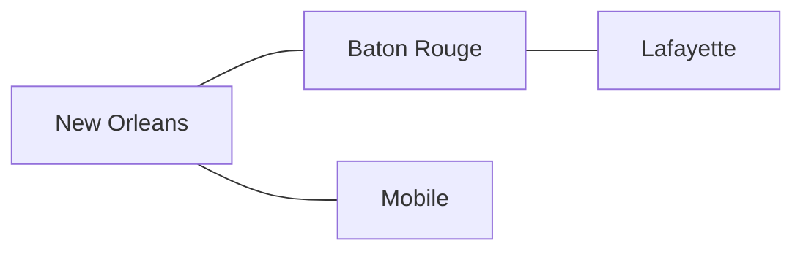
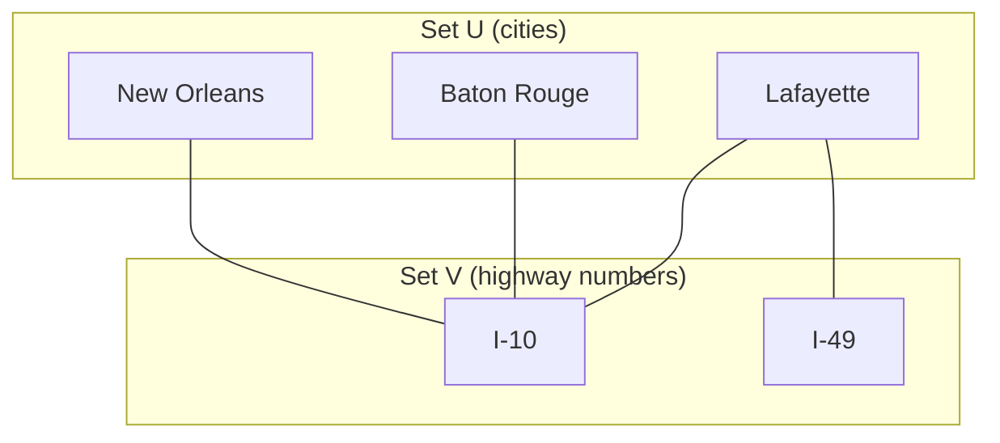
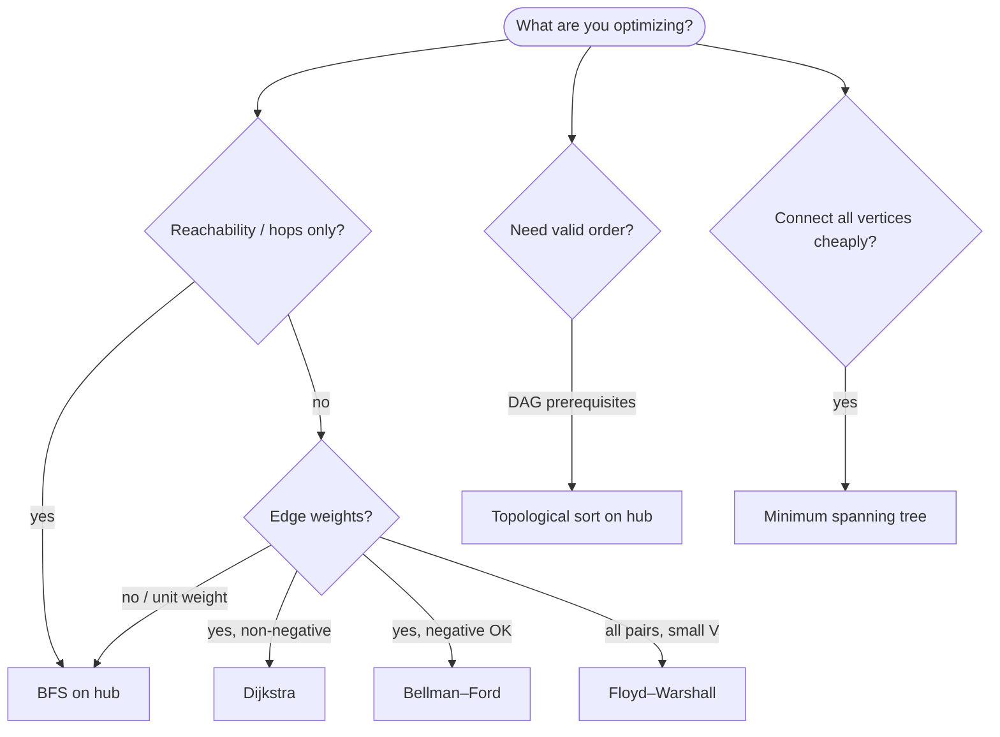

# Graph theory — terminology reference

**Graph theory** is the vocabulary of graphs: vertices, edges, paths, cycles, connectivity, and the names algorithms assume you already know. This page is a **30,000-foot jargon hub** — plain-language definitions, small examples on the **Gulf Coast interstate road network** (New Orleans, Baton Rouge, Lafayette, Alexandria, Shreveport, Mobile), and pointers to where algorithms live in this repo.

| | |
| --- | --- |
| **What this page is** | A ready reference for graph terminology and “which algorithm when?” |
| **What this page is not** | A proof-heavy math course — no theorems, no formal induction |
| **Prerequisites** | Skim [Graphs](../index.md) for representations and Python code |
| **Notation** | **V** = \|vertices\|, **E** = \|edges\|, **deg(v)** = degree of vertex v |

When you hit an unfamiliar term in Dijkstra notes, a LeetCode problem, or a NetworkX docstring, start here. When you need runnable Python and complexity tables, go to the [Graphs hub](../index.md) and the algorithm subpages linked below.

---

## Core terminology

### Graph building blocks

| Term | Also called | Plain meaning | Tiny example |
| --- | --- | --- | --- |
| **Vertex** | Node, point | One entity in the graph | City: `new_orleans`, `baton_rouge`, `lafayette` |
| **Edge** | Arc, link, connection | A relationship between two vertices | `(new_orleans, baton_rouge, 81)` — I-10 segment in miles |
| **Graph** | Network | The whole structure G = (V, E) | Gulf Coast interstate map, pipeline DAG, grid maze |
| **Adjacent** | Neighbors | Two vertices joined by an edge | `new_orleans` and `baton_rouge` share I-10 |
| **Incident** | — | An edge touches a vertex | Edge `(baton_rouge, lafayette, 56)` is incident to both cities |
| **Neighbor** | Adjacent vertex | Any vertex reachable in one hop from v | Neighbors of `baton_rouge`: `{new_orleans, lafayette}` |
| **Adjacency** | — | Whether an edge exists between u and v | `M[u][v] = 1` or `v in adj[u]` |
| **Adjacency list** | — | Map each vertex → list of neighbors | `{new_orleans: [baton_rouge, mobile], baton_rouge: [new_orleans, lafayette]}` |
| **Adjacency matrix** | — | V×V table; entry (u,v) marks an edge | O(1) edge lookup, O(V²) space |
| **Edge list** | — | Flat list of edges | `[(new_orleans, baton_rouge, 81), …]` — compact for Kruskal MST |

*Undirected Gulf Coast network: `baton_rouge` is adjacent to `new_orleans` (I-10, 81 mi) and `lafayette` (I-10, 56 mi).*

### Vertex

A **vertex** (node, point) is one entity in the graph — see the [Graph building blocks](#graph-building-blocks) table above.

### Edge

An **edge** (arc, link) connects two vertices, optionally with a weight — see the [Graph building blocks](#graph-building-blocks) table above.

---

### Direction and weight

| Term | Plain meaning | Example |
| --- | --- | --- |
| **Undirected graph** | Edges work both ways; `(u,v)` = `(v,u)` | I-10 between `new_orleans` and `baton_rouge` — drivable both directions |
| **Directed graph** | Digraph; edges have a direction | One-way frontage road or permit-only construction lane |
| **Weighted graph** | Each edge carries a number (cost, distance, capacity) | Miles, drive minutes, or toll dollars on a highway segment |
| **Unweighted graph** | Every edge counts as cost 1 | Fewest highway **hops** between cities |
| **Simple graph** | No self-loops, at most one edge per vertex pair | One I-10 link per city pair — most algorithm texts assume this |
| **Multigraph** | Parallel edges between the same pair allowed | I-10 **and** US-90 both connect `new_orleans` ↔ `baton_rouge` |
| **Self-loop** | Edge from a vertex to itself | City “stay local” detour back to same interchange |
| **Mixed graph** | Some directed, some undirected edges | Rare in coding problems; check problem statement |

### Edge direction

**Edge direction** decides whether `(u, v)` implies `(v, u)`. **[Undirected](#undirected-graph)** graphs treat both orientations the same; **[directed](#directed-graph)** graphs store one-way arcs — see the [Direction and weight](#direction-and-weight) table above.

### Undirected graph

An **undirected graph** has symmetric edges — `(u, v)` equals `(v, u)` — typical for two-way highways on the Gulf Coast map; see the [Direction and weight](#direction-and-weight) table above.

### Directed graph

A **directed graph** (digraph) has one-way edges — construction-phase order and one-way ramps are common examples; see the [Direction and weight](#direction-and-weight) table above.

### Weighted graph

A **weighted graph** labels each edge with a number (cost, distance, capacity); shortest-path and MST algorithms consume those values — see the [Direction and weight](#direction-and-weight) table above.

### Unweighted graph

An **unweighted graph** treats every edge as cost **1** — hop count and reachability questions use BFS; see the [Direction and weight](#direction-and-weight) table above.

### Weight

**Weight** (edge weight) is the numeric label on an edge — optional in many models; when omitted the graph is [unweighted](#unweighted-graph).

| Term | Directed? | Weight? | See also |
| --- | --- | --- | --- |
| **DAG** | Yes | Optional | [Structural concepts](#structural-concepts) below |
| **Bipartite graph** | Usually undirected between two sets | Optional | Two-colorable; no within-set edges |
| **Complete graph Kₙ** | Either | Optional | Every pair of vertices is connected |

### Non-negative weights

**Non-negative edge weights** mean every segment cost is $\geq 0$ (miles, minutes, tolls) — [Dijkstra](../dijkstra/index.md) and [Prim](../minimum-spanning-tree/index.md) assume this. Graphs with negative edges (fictional toll rebates) need [Bellman–Ford](../bellman-ford/index.md) or [Floyd–Warshall](../floyd-warshall/index.md); see [Direction and weight](#direction-and-weight) above.

---

### Degree and density

| Term | Undirected meaning | Directed meaning |
| --- | --- | --- |
| **Degree deg(v)** | Number of edges touching v | Often split into in/out (below) |
| **In-degree** | N/A (use degree) | Edges pointing **into** v |
| **Out-degree** | N/A | Edges pointing **out of** v |
| **Leaf** | Vertex of degree 1 (in trees) | Vertex with out-degree 0 (in rooted trees) |
| **Sparse graph** | E ≪ V² — few edges | Gulf Coast map — six cities, five highway segments |
| **Dense graph** | E ≈ V² — many edges | Every city pair linked by a direct route (hypothetical mesh) |

**Handy identity (undirected, simple):** sum of all degrees = 2E — each highway segment contributes 2 to the total. On the Gulf Coast map, **deg(baton_rouge) = 2** (I-10 to New Orleans and Lafayette).

---

## Structural concepts

These words sound interchangeable in conversation but mean different things in textbooks and on exams.

### Walks, paths, trails, cycles

| Term | Repeats vertices? | Repeats edges? | Plain meaning |
| --- | --- | --- | --- |
| **Walk** | Yes | Yes | Any drive sequence through connected cities |
| **Trail** | Yes | No | No highway segment used twice |
| **Path** | No (except start=end for a cycle) | No | No city visited twice |
| **Cycle** | Start = end, length ≥ 1 | No | Closed drive route — loop back to start |
| **Simple cycle** | No internal repeats | No | The usual “cycle” in algorithm problems |
| **Acyclic** | — | — | No drive loops (or no directed construction loops) |
| **Connected (undirected)** | — | — | Drive route exists between every pair of cities |
| **Strongly connected (directed)** | — | — | Directed path both ways between every pair |
| **Weakly connected (directed)** | — | — | Connected if you ignore arrow direction |
| **Connected component** | — | — | Maximal set of cities all reachable by driving |
| **Bridge** | — | — | Highway segment whose closure splits the map into unreachable regions |
| **Articulation point** | — | — | City whose closure (all incident highways shut) disconnects the map |

*Illustrative directed segments: cycle BR→LAF→ALEX→BR plus a tail to Shreveport. A **path** BR→LAF→ALEX→SHV has no repeated cities. A **walk** could be BR→LAF→ALEX→BR→LAF→ALEX→SHV (revisits allowed).*

### Acyclic

**Acyclic** means the graph contains **no cycles** — for directed graphs, no directed cycles (a [DAG](#dag)); trees and forests are acyclic undirected shapes; see [Walks, paths, trails, cycles](#walks-paths-trails-cycles) above.

### Global shape

**Global shape** covers structure beyond direction and weight — whether [cycles](#walks-paths-trails-cycles) exist, whether vertices split into [two partitions (bipartite)](#bipartite), or whether the graph forms a [DAG](#dag); see [Special graph shapes](#special-graph-shapes) below.

### Connected component

A **connected component** is a maximal set of cities all reachable from each other by driving — on the canonical Gulf Coast map, `{new_orleans, baton_rouge, lafayette, alexandria, shreveport, mobile}` is one component; see [Walks, paths, trails, cycles](#walks-paths-trails-cycles) above.

### Shortest path

A **shortest path** is a minimum-mile (or minimum-hop) drive between two cities with no repeated cities on the route — weighted algorithms [relax](#edge-relaxation) edges until distances settle.

---

### Special graph shapes

| Term | Definition (plain) | Typical use |
| --- | --- | --- |
| **Tree** | Connected acyclic undirected graph; \|E\| = \|V\| − 1 | Gulf Coast backbone without loops — five segments, six cities |
| **Forest** | Collection of trees — acyclic, possibly disconnected | Mainland cities plus an isolated island with no bridge |
| **Rooted tree** | Tree with one vertex marked root; parent/child direction | DOM, parse trees, [Binary search trees](../../binary-search-trees/index.md) |
| **DAG** | Directed acyclic graph — no directed cycles | Highway **construction phases** — grading before paving (not a drive route) |
| **Topological order** | Linear ordering where every edge goes forward | Valid phase order: survey → grade → pave → stripe |
| **Bipartite** | Vertices split into two sets; edges only cross sets | Cities ↔ highway numbers (I-10, I-49, US-167) |
| **Two-colorable** | Vertices can be painted with 2 colors, no same-color edge | Equivalent to bipartite (for simple undirected graphs) |
| **Clique** | Set of vertices all pairwise adjacent | Every city pair linked by a direct highway (dense mesh) |
| **Matching** | Set of edges, no shared endpoints | Assign each city one primary outbound corridor |
| **Perfect matching** | Every vertex in the matching | Every city matched to exactly one partner |
| **Spanning tree** | Tree touching all vertices of a connected graph | Minimum highway set linking all six Gulf Coast cities |
| **Minimum spanning tree (MST)** | Spanning tree with minimum total edge weight | Cheapest mile-total network — see [Minimum spanning tree](../minimum-spanning-tree/index.md) |

*Bipartite: edges link cities to highway numbers — never city-to-city or highway-to-highway.*

### DAG

A **DAG** (directed acyclic graph) has directed edges and **no directed cycles** — construction phase order (survey before paving) is the classic example here, not a driving loop; see [Special graph shapes](#special-graph-shapes) table above.

### Bipartite

A **bipartite graph** splits vertices into two disjoint sets with edges only crossing between sets — cities linked to highway numbers (I-10 serves New Orleans and Baton Rouge) is the Gulf Coast pattern; see [Special graph shapes](#special-graph-shapes) table above.

### Spanning tree

A **spanning tree** is a **tree** that includes every city of a connected map—**V − 1** highway segments and **no drive loops**. A **minimum spanning tree (MST)** picks those segments with minimum total miles (or tolls); see [Minimum spanning tree](../minimum-spanning-tree/index.md).

### Cut property

For any partition of cities into two non-empty sets, the **lightest highway crossing the cut** belongs to some MST. **Kruskal** and **Prim** add only **cut-safe** segments—see [Minimum spanning tree](../minimum-spanning-tree/index.md).

---

## Search and algorithm vocabulary

Weighted shortest-path and heuristic search pages reuse the same verbs. This section defines **algorithm terms** — not graph *shape* words like tree or sparse (see [Degree and density](#degree-and-density) and [Special graph shapes](#special-graph-shapes) above).

| Term | Definition | See also |
| --- | --- | --- |
| **Heuristic** | Estimate **h(n)** of remaining miles from city **n** to a goal city (crow-fly distance); guides which vertex to expand next | [Admissible heuristic](#admissible-heuristic), [A*](../a-star/index.md) |
| **Admissible heuristic** | **h(n)** never **overestimates** true remaining cost — required for A* optimality | [Consistent heuristic](#consistent-heuristic), [A*](../a-star/index.md) |
| **Consistent heuristic** | **h(n) ≤ cost(n, n′) + h(n′)** for every edge; monotone — implies admissible | [Admissible heuristic](#admissible-heuristic) |
| **Goal-directed search** | Search biased toward a **known goal** (not “explore everything from s”) | [Best-first search](#best-first-search), [A*](../a-star/index.md) |
| **Best-first search** | Always expand the frontier vertex that looks **most promising** next (by **f**, **g**, or **h**) | [Open set](#open-set), [A*](../a-star/index.md) |
| **Edge relaxation** | Try to improve **dist[v]** via **dist[u] + w(u, v)**; core step in Dijkstra, Bellman–Ford, Floyd–Warshall | [Tentative distance](#tentative-distance), [Dijkstra](../dijkstra/index.md) |
| **Single-source shortest paths** | One source **s** → best cost to **every** reachable vertex | [Dijkstra](../dijkstra/index.md), [Bellman–Ford](../bellman-ford/index.md) |
| **All-pairs shortest paths** | Best cost for **every ordered pair** (u, v) — full **V × V** distance table | [Floyd–Warshall](../floyd-warshall/index.md) |
| **Negative cycle** | Directed cycle whose **total edge weight < 0** (e.g. fictional toll rebates); shortest paths undefined if reachable | [Bellman–Ford](../bellman-ford/index.md), [Floyd–Warshall](../floyd-warshall/index.md) |
| **Open set** | Vertices **queued** for expansion (often a min-heap by priority) | [Closed set](#closed-set), [Frontier](#frontier) |
| **Closed set** | Vertices **already expanded** with best cost settled (A*) or visited | [Open set](#open-set) |
| **Tentative distance** | Best-known cost so far — **not final** until the vertex is popped or settled | [Edge relaxation](#edge-relaxation), [Dijkstra](../dijkstra/index.md) |
| **Frontier** | Boundary between **explored** and **unexplored** vertices — BFS queue, Dijkstra heap, A* open set | [Open set](#open-set), [Graphs hub — BFS](../index.md#bfs--breadth-first-search) |

### Heuristic

A **heuristic** is a function **h(n)** that guesses remaining miles from city **n** to the goal — typically straight-line (crow-fly) distance on a road map. It does not need to be exact — only **admissible** (never too high) for optimal A* paths.

### Admissible heuristic

**Admissible** means **h(n) ≤** the true cheapest remaining cost to the goal. Straight-line (**crow-fly**) miles from `lafayette` to `shreveport` is admissible for road routing because driving cannot be shorter than the geodesic distance.

### Consistent heuristic

A **consistent** (monotone) heuristic satisfies **h(n) ≤ cost(n, n′) + h(n′)** along every edge. Consistency implies admissibility and avoids re-expanding settled cells in standard A* formulations.

### Goal-directed search

**Goal-directed** search knows the **target city** up front and steers expansion toward it — unlike single-source Dijkstra from `new_orleans`, which radiates cost rings in all directions. [A*](../a-star/index.md) is the classic example.

### Best-first search

**Best-first** search always picks the frontier item that looks best under a priority key — **f = g + h** in A*, **g** alone in Dijkstra, FIFO layer order in BFS. The priority rule defines the flavor.

### Edge relaxation

To **relax** edge **(u, v, w)** means: if **dist[u] + w** improves **dist[v]**, update **dist[v]** and record **parent[v] = u**. One relaxation per edge visit; Dijkstra and Bellman–Ford differ in *when* and *how often* they relax.

### Single-source shortest paths

**Single-source** means one start city **s** (e.g. `new_orleans`) and you want minimum cost **s → v** for all reachable cities **v**. Output is a distance map (and optional parent map for routes). Contrast with [all-pairs](#all-pairs-shortest-paths).

### All-pairs shortest paths

**All-pairs** (APSP) fills a full **V × V** table: shortest cost from every **i** to every **j**. [Floyd–Warshall](../floyd-warshall/index.md) does this in one O(V³) pass; repeated Dijkstra works when the graph is sparse and **V** is large.

### Negative cycle

A **negative cycle** is a directed cycle whose edge weights sum to **less than zero** — for example a loop of fictional toll rebates. If such a cycle is reachable from the source, “shortest path” is undefined — you could loop forever and decrease total cost. Bellman–Ford and Floyd–Warshall detect this.

### Open set

The **open set** holds vertices **not yet expanded** but already discovered — typically a min-heap keyed by **f** or **dist**. In A*, pop the smallest **f** next.

### Closed set

The **closed set** holds vertices **already expanded** with best cost confirmed (A*) or marked visited. Skip re-processing a cell when it is already closed.

### Manhattan distance

On a grid with **4-direction** moves and unit step cost, **Manhattan distance** is $|Δrow| + |Δcol|$ — the minimum steps in an empty grid. It is an [admissible heuristic](#admissible-heuristic) for [A*](../a-star/index.md) on such grids (walls can only increase true cost).

### Tentative distance

A **tentative distance** is the best cost found **so far** — e.g. Dijkstra’s **dist[v]** before **v** is popped. Non-negative weights guarantee the first pop of **v** is final.

### Frontier

The **frontier** is the cut between explored and unexplored territory: BFS’s next layer, Dijkstra’s min-heap, Prim’s cheapest outgoing edge, A*’s open set. Memory often scales with frontier width.

---

## Algorithm decision guide

Use this table to pick an approach, then follow the link for implementation detail in this repo.

| Your question | Graph type | Start here | Notes |
| --- | --- | --- | --- |
| Reachable from s? Fewest hops? | Unweighted, any direction | [Graphs hub — BFS](../index.md#bfs--breadth-first-search) | BFS gives shortest hop count |
| Explore all vertices / detect cycles | Any | [Graphs hub — DFS](../index.md#dfs--depth-first-search) | DFS for backtracking, components |
| Valid build order / prerequisites | DAG | [Graphs hub — topological sort](../index.md#topological-sort-dag--prerequisite-pipeline-drill) | Construction phases; cycle = impossible schedule |
| Shortest path, non-negative weights | Weighted | [Dijkstra](../dijkstra/index.md) | Needs priority queue / min-heap |
| Shortest path, negative weights allowed | Weighted | [Bellman–Ford](../bellman-ford/index.md) | Fictional toll rebates; detects negative cycles |
| All-pairs shortest paths | Weighted, small V | [Floyd–Warshall](../floyd-warshall/index.md) | O(V³); simple to code |
| Shortest path with heuristic (maps, games) | Weighted + estimate h(v) | [A*](../a-star/index.md) | Crow-fly miles to goal city |
| Cheapest network connecting all nodes | Undirected, weighted | [Minimum spanning tree](../minimum-spanning-tree/index.md) | Link all six Gulf Coast cities cheaply |
| Same connected component? | Undirected | [Graphs hub — `connected_components`](../index.md#connected_components--isolated-network-islands) | Cities reachable by driving |
| Is graph bipartite? | Undirected | BFS/DFS two-coloring | Cities vs highway numbers; odd cycle ⇒ not bipartite |

---

## External resources

Curated links verified at time of writing. Use them for video walkthroughs, interactive demos, and authoritative definitions — not as a substitute for the Python examples on the [Graphs hub](../index.md).

### Video lectures

| Resource | Type | Why it's useful |
| --- | --- | --- |
| [MIT 6.006 — BFS (Erik Demaine)](https://www.youtube.com/watch?v=s-CYnVz-uh4) | YouTube lecture | Rigorous intro to graph representation, BFS, and shortest paths on unweighted graphs |
| [MIT 6.006 — DFS & topological sort](https://www.youtube.com/watch?v=AfSk24UTFS8) | YouTube lecture | DFS, cycle detection, and topological ordering with clear edge-classification intuition |
| [William Fiset — Graph theory algorithms (series intro)](https://www.youtube.com/watch?v=DgXR2OWQnLc) | YouTube playlist intro | CS-focused series: representations, BFS/DFS, shortest paths, flows — links to full [playlist](https://www.youtube.com/playlist?list=PLDV1Zeh2NRsDGO4--qE8yH72HFL1Km93P) |
| [Abdul Bari — Graph traversals (BFS & DFS)](https://www.youtube.com/watch?v=pcKY4hjDrxk) | YouTube lecture | Step-by-step traversal on a drawn graph; great if you learn visually |
| [NeetCode — Top 5 graph algorithms for interviews](https://www.youtube.com/watch?v=utDu3Q7Flrw) | YouTube overview | Compact map of DFS, BFS, Union-Find, topo sort, and Dijkstra for coding interviews |

### Documentation and tutorials

| Resource | Type | Why it's useful |
| --- | --- | --- |
| [CP-Algorithms — main index](https://cp-algorithms.com/index.html) | Algorithm reference | Community-maintained articles on BFS, shortest paths, MST, flows — with complexity and code |
| [CP-Algorithms — breadth-first search](https://cp-algorithms.com/graph/breadth-first-search.html) | Algorithm article | Fire-spreading BFS model; path restoration; connected components |
| [VisuAlgo — DFS & BFS](https://visualgo.net/en/dfsbfs) | Interactive visualization | Step through traversals, bipartite check, and topo sort on custom graphs |
| [VisuAlgo — single-source shortest paths](https://visualgo.net/en/sssp) | Interactive visualization | Compare Dijkstra, Bellman–Ford, BFS, and DAG DP side by side |
| [NetworkX tutorial](https://networkx.org/documentation/stable/tutorial.html) | Python library docs | Production graph API in Python — create graphs, inspect degree, run algorithms |
| [Princeton Algorithms — Chapter 4: Graphs](https://algs4.cs.princeton.edu/40graphs/) | Textbook site | Sedgewick & Wayne: undirected, directed, MST, shortest paths — industry-standard structure |
| [Wikipedia — Graph theory](https://en.wikipedia.org/wiki/Graph_theory) | Encyclopedia overview | Broad survey of graph types, history, and subfields |
| [Wikipedia — Glossary of graph theory](https://en.wikipedia.org/wiki/Glossary_of_graph_theory) | Terminology index | Alphabetical lookup when a paper or problem uses unfamiliar jargon |

---

## Related pages

| Page | Relationship |
| --- | --- |
| [Graphs hub](../index.md) | Representations, Python `Graph` class, BFS/DFS/topo, complexity |
| [Dijkstra](../dijkstra/index.md) | Non-negative weighted shortest paths |
| [Bellman–Ford](../bellman-ford/index.md) | Shortest paths with negative edges; negative-cycle detection |
| [Floyd–Warshall](../floyd-warshall/index.md) | All-pairs shortest paths |
| [A*](../a-star/index.md) | Heuristic shortest-path search |
| [Minimum spanning tree](../minimum-spanning-tree/index.md) | Kruskal, Prim, cheapest connected backbone |
| [Priority queue](../../priority-queue/index.md) | Dijkstra and A* frontier |
| [Min heap](../../min-heap/index.md) | Heap backing for priority queues |
| [2D grids](../../2d-grids/index.md) | Grid-as-graph BFS/DFS patterns |
| [Complexity analysis](../../../complexity/index.md) | O(V + E) and related notation |

---

## Quick glossary (one-liners)

| Term | One line |
| --- | --- |
| **Vertex / edge** | Cities and the highway segments between them |
| **Degree** | How many highway segments touch a city |
| **Path** | Drive route with no repeated cities |
| **Cycle** | Drive loop that returns to the start city |
| **DAG** | Directed graph with no cycles (e.g. construction phases) |
| **Component** | Maximal set of cities reachable by driving |
| **Bipartite** | Cities on one side, highway numbers on the other |
| **MST** | Cheapest highway set linking every city |
| **Matching** | Pair up vertices/edges without sharing endpoints |
| **Relax** | Try **dist[u] + w** to improve **dist[v]** |
| **Single-source** | One start → all reachable distances |
| **All-pairs** | Every (u, v) distance in a table |
| **Heuristic** | Crow-fly miles to goal city |
| **Negative cycle** | Toll-rebate loop with total weight less than 0 — paths undefined |

Keep this page open while reading algorithm subpages — when a proof says “simple path,” “relax this edge,” or “admissible heuristic,” jump to [Search and algorithm vocabulary](#search-and-algorithm-vocabulary) or the shape definitions above.
