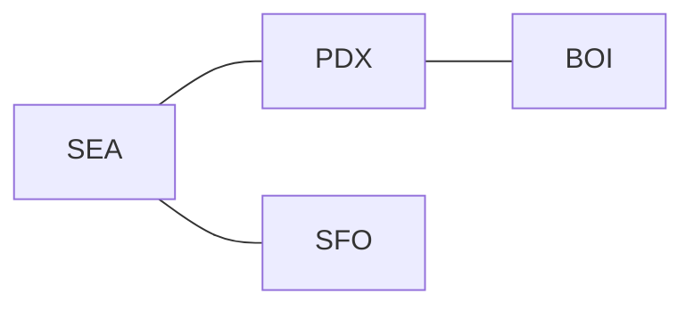
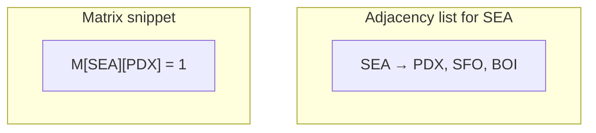
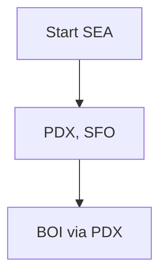
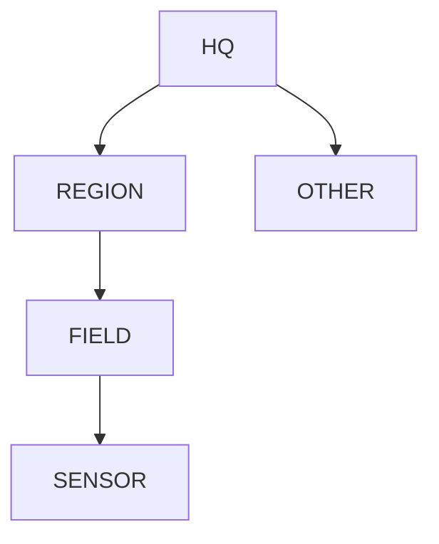
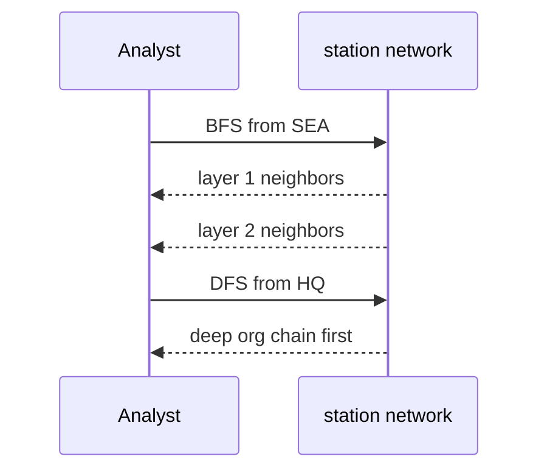
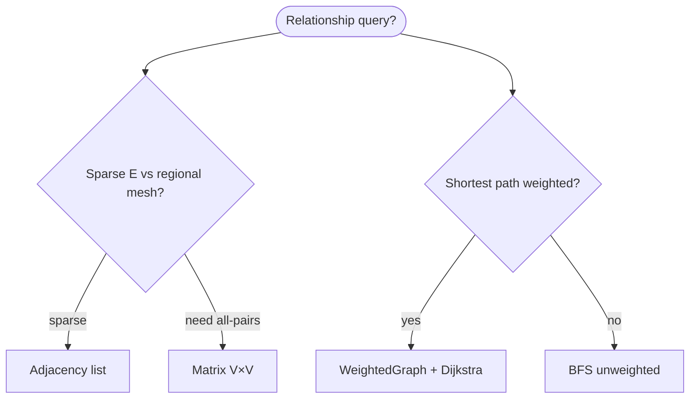

# Graphs

A **graph** is a set of **vertices** (nodes) and **edges** (links). Edges may be **directed** or **undirected**, **weighted** or **unweighted**. Graphs model **relationships**, **dependencies**, **routes**, and **state machines**—not just “maps.”

| | |
| --- | --- |
| **What it is** | G = (V, E); vertices are entities, edges are connections with optional weight. |
| **Representations** | Adjacency list (sparse), adjacency matrix (dense), edge list (compact storage). |
| **Core algorithms** | BFS, DFS, topological sort, shortest paths, minimum spanning tree, connected components. |
| **When to use** | Station networks, pipeline dependencies, travel between observatories, forecast state transitions. |

In **daily weather data analysis**, graphs appear as **station relationship networks** (who shares a mesonet link), **climate-region connectivity**, **office reporting lines**, and **pipeline state transitions** (raw → QC → derived). You will still aggregate stats in **pandas**—graphs excel when the question is **reachability**, **shortest path**, or **connectivity**.

This page is your **ready reference**: representations, a complete Python adjacency-list implementation, traversals with Mermaid, every common operation with daily weather examples, and **time and space complexity**. For Big-O notation, see [Complexity analysis](../../complexity/index.md).

[Parent: Data structures](../index.md)

---

## How graphs fit daily weather analysis

| Weather idea | Graph model | Typical algorithm |
| --- | --- | --- |
| **Mesonet links** | Vertices = stations; edge = shared data feed | Degree count, neighbor lists |
| **Office hierarchy** | Directed tree | DFS, topological order |
| **Travel: SEA → PDX** | Weighted cities | Dijkstra / A* |
| **Pattern similarity chain** | Directed edges “next likely regime” | BFS layers |
| **Climate-region connectivity** | Undirected stations in same region component | Union-Find / DFS |
| **Correlated station pairs** | Undirected unweighted | Set of edges |



Throughout: **V** = \|vertices\|, **E** = \|edges\|, **deg(v)** = degree of vertex v.

---

## Graph types

| Type | Edge direction | Weight | Weather example |
| --- | --- | --- | --- |
| Undirected | Both ways | Optional | Mutual mesonet neighbor |
| Directed | One way | Optional | Office → field station |
| Weighted | Either | On edge | Miles between observatories |
| Unweighted | Either | 1 | Linked in same ingest batch |
| Acyclic DAG | Directed, no cycles | — | Pipeline prerequisite tree |
| Bipartite | Two partitions | — | Stations vs observation events |

---

## Representations compared

| Representation | Space | Edge query (u,v)? | Neighbors of u | Best when |
| --- | --- | --- | --- | --- |
| **Adjacency list** | O(V + E) | O(deg(u)) scan | O(deg(u)) | Sparse station networks |
| **Adjacency matrix** | O(V²) | O(1) | O(V) | Dense tiny V (regional mesh still OK) |
| **Edge list** | O(E) | O(E) | O(E) | Kruskal MST, storage |



---

## Ways to create a graph

### 1. Empty adjacency-list graph

```python
graph = {}
```

### 2. Empty `Graph` class

```python
class Graph:
    def __init__(self, directed=False):
        self.directed = directed
        self.adj = {}
```

### 3. From edge list — mesonet links

```python
edges = [
    ("SEA", "PDX"),
    ("PDX", "BOI"),
    ("SEA", "SFO"),
]
g = Graph.from_edges(edges, directed=False)
```

| | |
| --- | --- |
| **Time** | O(E) |
| **Space** | O(V + E) |

### 4. From adjacency dict

```python
g = Graph.from_adjacency({
    "SEA": ["PDX", "SFO"],
    "PDX": ["SEA"],
    "SFO": ["SEA"],
})
```

### 5. Weighted edges

```python
wg = WeightedGraph()
wg.add_edge("SEA", "PDX", weight=175)
```

---

## Reference implementation (adjacency list)

```python
from collections import deque
from dataclasses import dataclass


@dataclass
class Edge:
    u: str
    v: str
    weight: float = 1.0


class Graph:
    def __init__(self, directed=False):
        self.directed = directed
        self.adj = {}

    @classmethod
    def from_edges(cls, edges, directed=False):
        g = cls(directed=directed)
        for u, v in edges:
            g.add_edge(u, v)
        return g

    @classmethod
    def from_adjacency(cls, adj, directed=False):
        g = cls(directed=directed)
        g.adj = {u: list(neighbors) for u, neighbors in adj.items()}
        for u in adj:
            g.adj.setdefault(u, [])
            for v in adj[u]:
                g.adj.setdefault(v, [])
        return g

    def add_vertex(self, v):
        self.adj.setdefault(v, [])

    def add_edge(self, u, v):
        self.add_vertex(u)
        self.add_vertex(v)
        self.adj[u].append(v)
        if not self.directed:
            self.adj[v].append(u)
        else:
            self.adj.setdefault(v, [])

    def neighbors(self, v):
        return self.adj.get(v, [])

    def vertices(self):
        return list(self.adj.keys())

    def edges_undirected_count(self):
        return sum(len(nbs) for nbs in self.adj.values()) // (
            1 if self.directed else 2
        )

    def bfs(self, start):
        order = []
        seen = {start}
        q = deque([start])
        while q:
            v = q.popleft()
            order.append(v)
            for w in self.neighbors(v):
                if w not in seen:
                    seen.add(w)
                    q.append(w)
        return order

    def dfs(self, start):
        order = []
        seen = set()

        def visit(v):
            seen.add(v)
            order.append(v)
            for w in self.neighbors(v):
                if w not in seen:
                    visit(w)

        visit(start)
        return order

    def connected_components(self):
        seen = set()
        comps = []
        for v in self.vertices():
            if v in seen:
                continue
            comp = self.bfs(v)
            comps.append(comp)
            seen.update(comp)
        return comps

    def has_path(self, src, dst):
        return dst in set(self.bfs(src))


class WeightedGraph:
    def __init__(self, directed=False):
        self.directed = directed
        self.adj = {}

    def add_edge(self, u, v, weight=1.0):
        self.adj.setdefault(u, []).append((v, weight))
        if not self.directed:
            self.adj.setdefault(v, []).append((u, weight))
        else:
            self.adj.setdefault(v, [])

    def dijkstra(self, src):
        import heapq

        dist = {src: 0.0}
        pq = [(0.0, src)]
        while pq:
            d, u = heapq.heappop(pq)
            if d > dist.get(u, float("inf")):
                continue
            for v, w in self.adj.get(u, []):
                nd = d + w
                if nd < dist.get(v, float("inf")):
                    dist[v] = nd
                    heapq.heappush(pq, (nd, v))
        return dist
```

| | |
| --- | --- |
| **Space** | O(V + E) adjacency lists |

---

## BFS — breadth-first search

**Idea:** Explore layer by layer—first all neighbors one hop away, then two, etc.



```python
network = Graph.from_edges([("SEA", "PDX"), ("PDX", "BOI"), ("SEA", "SFO")])
order = network.bfs("SEA")
```

| | |
| --- | --- |
| **Time** | O(V + E) |
| **Space** | O(V) queue + seen |

**Weather use:** fewest **hops** in a mesonet graph; dashboard “stations within 2 degrees of SEA.”

---

## DFS — depth-first search

**Idea:** Go deep along one branch before backtracking.



```python
org_tree = Graph(directed=True)
org_tree.add_edge("HQ", "REGION")
org_tree.add_edge("REGION", "FIELD")
order = org_tree.dfs("HQ")
```

| | |
| --- | --- |
| **Time** | O(V + E) |
| **Space** | O(V) stack (recursion or explicit) |

**Weather use:** detect cycles in dependency graph; enumerate office subtree.

---

## Traversal comparison

| | BFS | DFS |
| --- | --- | --- |
| **Structure** | Queue | Stack / recursion |
| **Shortest unweighted path** | Yes | No |
| **Memory on wide graph** | Can be large frontier | Linear path depth |
| **Weather metaphor** | Ripple through mesonet | Drill into one branch |



---

## All operations (weather examples + complexity)

### `add_vertex` / `add_edge`

```python
g = Graph()
g.add_edge("SEA", "PDX")
```

| | |
| --- | --- |
| **Time** | O(1) amortized append |
| **Space** | O(1) new edge storage |

### `neighbors(v)` — neighbors of SEA

| | |
| --- | --- |
| **Time** | O(deg(v)) |
| **Space** | O(1) to return list ref |

### `bfs` / `dfs`

See above.

### `connected_components` — isolated network islands

```python
comps = network.connected_components()
```

| | |
| --- | --- |
| **Time** | O(V + E) |
| **Space** | O(V) |

### `has_path` — can we reach PDX from SEA?

| | |
| --- | --- |
| **Time** | O(V + E) |
| **Space** | O(V) |

### Dijkstra — weighted travel

```python
dist = wg.dijkstra("SEA")
miles_to_pdx = dist.get("PDX", float("inf"))
```

| | |
| --- | --- |
| **Time** | O((V + E) log V) with binary heap |
| **Space** | O(V) |

---

## Weather application: station relationship graph

Vertices = stations; undirected edge if they share a mesonet link in the catalog.

```python
def build_network_graph(links):
    g = Graph(directed=False)
    for row in links:
        g.add_edge(row["station_a"], row["station_b"])
    return g

g = build_network_graph(mesonet_rows)
sea_neighbors = g.neighbors("SEA")
```

| | |
| --- | --- |
| **Time** | O(links) |
| **Space** | O(V + E) |

---

## Weather application: pipeline state machine (directed)

Vertices = `(stage, bucket)`; edge = allowed transition after QC step.

```python
pipeline = Graph(directed=True)
pipeline.add_edge(("raw", "ok"), ("qc", "pending"))
pipeline.add_edge(("qc", "pending"), ("derived", "ready"))
path_exists = pipeline.has_path(("raw", "ok"), ("derived", "ready"))
```

---

## Topological sort (DAG) — prerequisite pipeline drill

When edges mean “stage A before stage B” in a teaching DAG:

```python
def topological_sort(g):
    indeg = {v: 0 for v in g.vertices()}
    for u in g.vertices():
        for w in g.neighbors(u):
            indeg[w] = indeg.get(w, 0) + 1
    q = deque([v for v, d in indeg.items() if d == 0])
    order = []
    while q:
        v = q.popleft()
        order.append(v)
        for w in g.neighbors(v):
            indeg[w] -= 1
            if indeg[w] == 0:
                q.append(w)
    if len(order) != len(indeg):
        raise ValueError("cycle in graph")
    return order
```

| | |
| --- | --- |
| **Time** | O(V + E) |
| **Space** | O(V) |

---

## Python stdlib and ecosystem

| Tool | Role |
| --- | --- |
| `dict` + `list` | DIY adjacency list (this page) |
| `collections.deque` | BFS queue |
| `heapq` | Dijkstra priority queue |
| **networkx** (optional) | `pip install networkx` — production graph algos |

```python
import networkx as nx

G = nx.Graph()
G.add_edge("SEA", "PDX")
nx.shortest_path(G, "SEA", "BOI")
```

**Rule of thumb:** learn with **`Graph` class** above; use **networkx** for centrality, community detection, and large weather-network studies.

---

## Master complexity table

| Operation / algorithm | Time | Space |
| --- | --- | --- |
| Store graph (adj list) | O(V + E) | O(V + E) |
| Add edge | O(1) amortized | O(1) |
| List neighbors | O(deg(v)) | O(1) |
| BFS / DFS from one start | O(V + E) | O(V) |
| All components | O(V + E) | O(V) |
| Dijkstra | O((V+E) log V) | O(V) |
| Topological sort | O(V + E) | O(V) |
| Adjacency matrix check edge | O(1) | O(V²) storage |

---

## When to pick which representation (weather context)



| Scenario | Best tool |
| --- | --- |
| Regional mesonet edges | Adjacency list |
| All-pairs small region | V×V matrix OK |
| Office tree | Directed DFS |
| Observatory miles | Weighted + Dijkstra |

---

## Common pitfalls

| Pitfall | Why it hurts | Fix |
| --- | --- | --- |
| Double-counting undirected edges | Wrong E | Store once or halve count |
| BFS for weighted shortest | Wrong answer | Dijkstra |
| DFS stack overflow on huge V | Recursion limit | Iterative DFS |
| Directed vs undirected mix | Wrong neighbors | Flag `directed` |
| Ignoring disconnected start | BFS misses vertices | Loop all components |

---

## Related pages

| Page | Relationship |
| --- | --- |
| [Sets](../sets/index.md) | Vertices only, no edges |
| [Honorable mention ADT](../honorable-mention-adt/index.md) | Union-Find for connectivity |
| [Queue](../queue/index.md) | BFS queue |
| [Priority queue](../priority-queue/index.md) | Dijkstra heap |
| [Complexity analysis](../../complexity/index.md) | O(V + E) notation |

---

## Quick reference card

```python
g = Graph()
g = Graph.from_edges([("SEA", "PDX")], directed=False)

g.add_edge(u, v)
g.neighbors(v)
g.bfs(start)
g.dfs(start)
g.connected_components()
g.has_path(src, dst)

wg = WeightedGraph()
wg.add_edge(u, v, weight=1.0)
wg.dijkstra(src)
```

Use a **graph** when weather questions are about **connections and paths**, not column means—use **pandas** for aggregations, **graphs** for topology.

**Weather pipeline checklist**

1. **Default** — Tabular readings in pandas; aggregates via `groupby`.
2. **Reachability / hops** — Adjacency list + BFS on station mesh.
3. **Weighted routes** — `WeightedGraph` + Dijkstra for miles or latency.
4. **Pipeline order** — DAG + topological sort for stage dependencies.
5. **Large networks** — Learn with `Graph` class; ship **networkx** for production metrics.
