# Graphs

A **graph** is a set of **[vertices](graph-theory/index.md#vertex)** (nodes) and **[edges](graph-theory/index.md#edge)** (links). Edges may be **directed** or **undirected**, **weighted** or **unweighted**. Graphs model **routes**, **dependencies**, **relationships**, and **state machines**—not just tabular records.

| | |
| --- | --- |
| **What it is** | G = (V, E); vertices are entities (cities, intersections), edges are connections with optional weight. |
| **Representations** | Adjacency list (sparse roadmap), adjacency matrix (dense), edge list (compact storage). |
| **Core algorithms** | BFS, DFS, topological sort (this page); weighted paths and MST on [child pages](#sections-in-this-repo) |
| **When to use** | Road routing, reachability, fewest-segment paths, connectivity checks before building a navigation feature. |

In **application code**, graphs appear as **highway networks**, **street grids**, **service dependency [DAGs](graph-theory/index.md#dag)**, and **pipeline state transitions**. You will still aggregate stats in **SQL** or **pandas**—graphs excel when the question is **reachability**, **[shortest path](graph-theory/index.md#shortest-path)**, or **connectivity**.

For graph terminology, see [Graph theory](graph-theory/index.md).

This page is a **ready reference**: representations, a complete Python adjacency-list implementation, traversals with Mermaid, every common operation with practical examples, and **time and space complexity**. Weighted shortest paths, A*, minimum spanning trees, and graph-theory drills live on **child pages** linked below. For Big-O notation, see [Complexity analysis](../../complexity/index.md).

[Parent: Data structures](../index.md)

---

### Running example — Gulf Coast interstate network

Throughout this page, a **fictional US Gulf Coast road network** is the primary metaphor:

| Concept | Road meaning |
| --- | --- |
| **Vertex** | City (key in code, display name in prose) |
| **Edge** | Highway segment between two cities |
| **Undirected** | Two-way interstate — drive either direction |
| **Weighted** | Miles, drive minutes, or toll dollars (stated per example) |
| **Unweighted** | Fewest highway **segments** (BFS hop count) |

| City key | Display |
| --- | --- |
| `new_orleans` | New Orleans |
| `baton_rouge` | Baton Rouge |
| `lafayette` | Lafayette |
| `alexandria` | Alexandria |
| `shreveport` | Shreveport |
| `mobile` | Mobile |

| Edge | Highway | Miles (fictitious) |
| --- | --- | --- |
| new_orleans ↔ baton_rouge | I-10 | 81 |
| baton_rouge ↔ lafayette | I-10 | 56 |
| lafayette ↔ alexandria | I-49 | 72 |
| alexandria ↔ shreveport | US-167 | 95 |
| new_orleans ↔ mobile | I-10 | 145 |

---

## Sections in this repo

| Section | Focus | Page |
| --- | --- | --- |
| **Graphs (this page)** | Representations, BFS/DFS, topological sort, `Graph` / `WeightedGraph` skeleton | [Graphs](index.md) |
| **Graph theory** | Classic definitions, theorems, and problem patterns | [Graph theory](graph-theory/index.md) |
| **Dijkstra** | [Single-source](graph-theory/index.md#single-source-shortest-paths) shortest paths; [non-negative edge weights](graph-theory/index.md#non-negative-weights); [priority queue](../priority-queue/index.md) | [Dijkstra](dijkstra/index.md) |
| **Bellman–Ford** | [Single-source](graph-theory/index.md#single-source-shortest-paths) with negative weights; [negative-cycle](graph-theory/index.md#negative-cycle) detection | [Bellman–Ford](bellman-ford/index.md) |
| **Floyd–Warshall** | All-pairs shortest paths; dense or small **V** | [Floyd–Warshall](floyd-warshall/index.md) |
| **A\*** | [Goal-directed search](graph-theory/index.md#goal-directed-search) with an [admissible heuristic](graph-theory/index.md#admissible-heuristic) | [A*](a-star/index.md) |
| **Minimum spanning tree** | Kruskal and Prim on connected undirected weighted graphs | [Minimum spanning tree](minimum-spanning-tree/index.md) |

---

## Algorithm picker — shortest paths and MST

Use **BFS on this page** for unweighted hop count (fewest highway segments). For weighted or global queries, open the matching child page.

| Problem | Constraints | Pick | Page |
| --- | --- | --- | --- |
| Shortest path, **unweighted** | Each edge cost = 1 hop | **BFS** | [BFS on this page](#bfs--breadth-first-search) |
| Shortest path, **single-source** | Non-negative edge weights | **Dijkstra** | [Dijkstra](dijkstra/index.md) |
| Shortest path, **single-source** | Negative weights allowed | **Bellman–Ford** | [Bellman–Ford](bellman-ford/index.md) |
| Shortest path, **all-pairs** | Need every (u, v) distance | **Floyd–Warshall** | [Floyd–Warshall](floyd-warshall/index.md) |
| Path search with **[heuristic](graph-theory/index.md#heuristic)** | Known goal; [admissible](graph-theory/index.md#admissible-heuristic) **h(v)** | **A\*** | [A*](a-star/index.md) |
| **Minimum spanning tree** | Connected undirected weighted graph | **Kruskal** or **Prim** | [Minimum spanning tree](minimum-spanning-tree/index.md) |

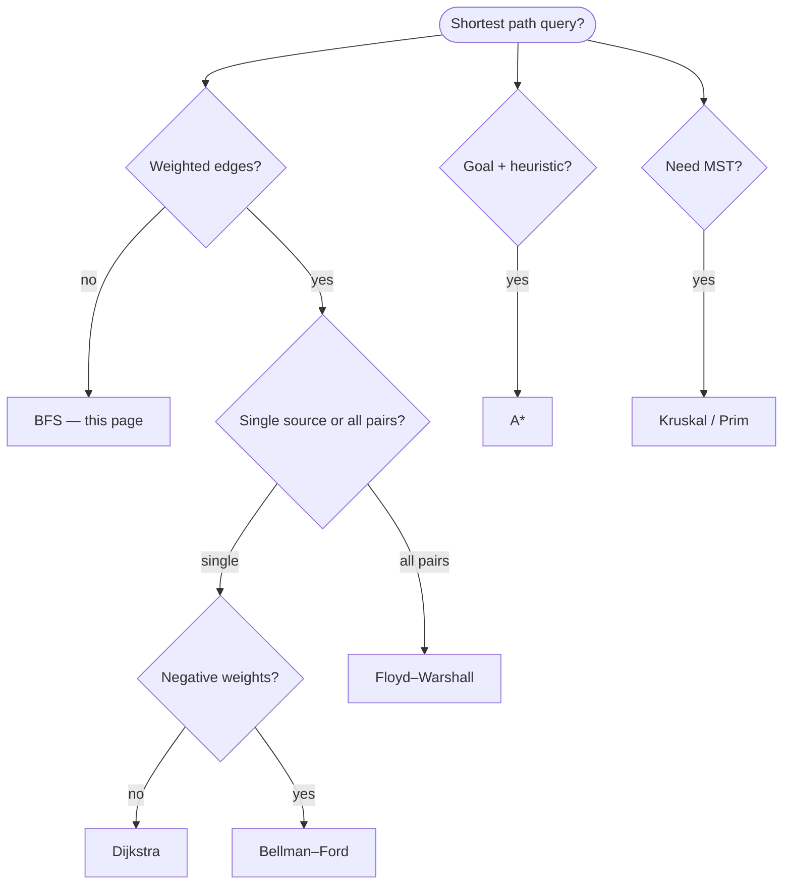

---

Throughout: **V** = \|vertices\|, **E** = \|edges\|, **deg(v)** = degree of vertex v.

---

## Graph types

Graphs differ by **[edge direction](graph-theory/index.md#edge-direction)** (can you traverse both ways?), **[weight](graph-theory/index.md#weight)** (does each edge carry a cost or capacity?), and **[global shape](graph-theory/index.md#global-shape)** (cycles allowed? two partitions?). Many real models combine properties—the Gulf Coast network is **[undirected](graph-theory/index.md#undirected-graph)** and **[weighted](graph-theory/index.md#weighted-graph)** (miles on each segment); a construction schedule is **[directed](graph-theory/index.md#directed-graph)**, **[unweighted](graph-theory/index.md#unweighted-graph)**, and **[acyclic](graph-theory/index.md#acyclic)**.

| Type | [Edge direction](graph-theory/index.md#edge-direction) | [Weight](graph-theory/index.md#weight) | Example |
| --- | --- | --- | --- |
| [Undirected](graph-theory/index.md#undirected-graph) | Both ways | Optional | Two-way interstate between cities |
| [Directed](graph-theory/index.md#directed-graph) | One way | Optional | One-way detour during lane closure |
| [Weighted](graph-theory/index.md#weighted-graph) | Either | On edge | Miles on I-10 between Baton Rouge and Lafayette |
| [Unweighted](graph-theory/index.md#unweighted-graph) | Either | Implicitly 1 | Fewest highway segments (hop count) |
| [Acyclic](graph-theory/index.md#acyclic) ([DAG](graph-theory/index.md#dag)) | Directed, no cycles | Optional | Highway construction phases (sidebar below) |
| [Bipartite](graph-theory/index.md#bipartite) | Edges cross two sets | Optional | Cities ↔ highway numbers (sidebar below) |

---

### Undirected

An **[undirected](graph-theory/index.md#undirected-graph)** graph models **two-way** travel: if **I-10** connects New Orleans and Baton Rouge, you can drive east or west on that segment. Store one edge `(new_orleans, baton_rouge)` and treat it as traversable from either city. Degree counts neighboring cities; BFS/DFS do not need to reverse edges.

| Key point | Detail |
| --- | --- |
| **[Edge direction](graph-theory/index.md#edge-direction)** | Symmetric — `(u, v)` equals `(v, u)` |
| **[Weight](graph-theory/index.md#weight)** | Optional (miles, minutes); often omitted for hop count |
| **Typical use** | Interstate corridors, mutual reachability |
| **Algorithms** | Connected components, BFS shortest hop count |

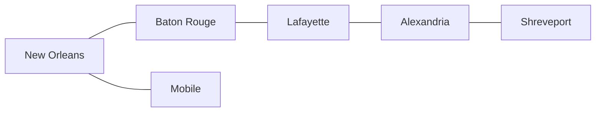

*Two-way Gulf Coast corridor: I-10 and I-49 segments work in both directions — every edge is drivable from either endpoint.*

---

### Directed

A **[directed](graph-theory/index.md#directed-graph)** graph models **one-way** travel: during a lane closure, a detour might allow `(baton_rouge, lafayette)` but not the reverse until the westbound lane reopens. The edge `(baton_rouge, lafayette)` does not imply `(lafayette, baton_rouge)`. Out-degree counts outbound highways; in-degree counts inbound routes.

| Key point | Detail |
| --- | --- |
| **[Edge direction](graph-theory/index.md#edge-direction)** | Asymmetric — `(u, v)` ≠ `(v, u)` unless both are stored |
| **[Weight](graph-theory/index.md#weight)** | Optional (e.g. toll dollars on a one-way ramp) |
| **Typical use** | Detours, one-way frontage roads, turn restrictions |
| **Algorithms** | Topological sort, cycle detection, reachability |

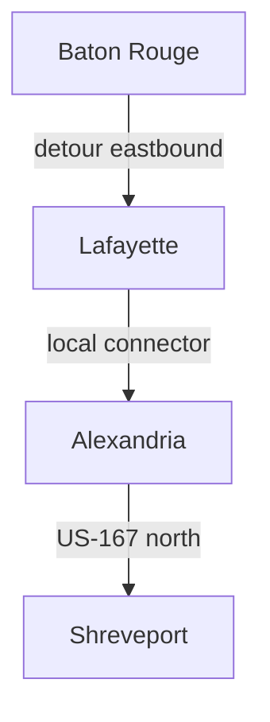

*One-way detour chain: you can follow each arrow forward; you cannot reverse an edge unless a separate return route is added.*

---

### Weighted

When edges carry **miles**, **drive minutes**, or **toll dollars**, the graph is **[weighted](graph-theory/index.md#weighted-graph)**. Shortest-path algorithms (Dijkstra, Bellman–Ford) use those numbers; unweighted BFS is no longer enough if you need minimum total cost. Weights can appear on directed or undirected edges.

| Key point | Detail |
| --- | --- |
| **[Edge direction](graph-theory/index.md#edge-direction)** | [Directed](graph-theory/index.md#directed-graph) or [undirected](graph-theory/index.md#undirected-graph) (independent of weight) |
| **[Weight](graph-theory/index.md#weight)** | Numeric label on each edge (miles, minutes, toll $) |
| **Typical use** | Mileage routing, ETA planning, toll minimization |
| **Algorithms** | Dijkstra, Bellman–Ford, minimum spanning tree |

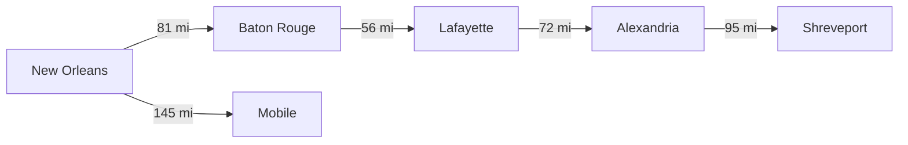

*Miles on I-10 and I-49: New Orleans → Shreveport via Baton Rouge and Lafayette (81 + 56 + 72 + 95 = 304 mi) beats any shortcut that skips the main corridor.*

---

### Unweighted

Treat every edge as cost **1** (one highway segment, one hop). You omit weight fields entirely — an **[unweighted](graph-theory/index.md#unweighted-graph)** graph. **Reachability** and **fewest-segment** shortest paths use BFS. “In the same [connected component](graph-theory/index.md#connected-component)” means there is a path of unweighted edges between two cities.

| Key point | Detail |
| --- | --- |
| **[Edge direction](graph-theory/index.md#edge-direction)** | Either; BFS assumes unweighted hops |
| **[Weight](graph-theory/index.md#weight)** | Implicit 1 for every edge |
| **Typical use** | “How many interchanges between two cities?”, fewest segments |
| **Algorithms** | BFS (shortest hop count), DFS (explore component) |

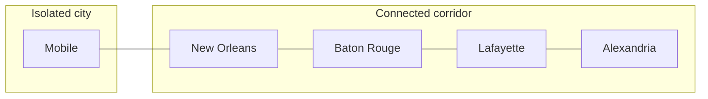

*Hop count: New Orleans reaches Baton Rouge and Mobile in 1 segment, Lafayette in 2, Alexandria in 3, Shreveport in 4 — BFS finds the fewest segments.*

---

### Acyclic (DAG)

!!! note "Sidebar — construction schedule, not the drive graph"

    A **[directed acyclic graph (DAG)](graph-theory/index.md#dag)** here models **highway construction phases**, not everyday driving. Phases must finish in order — survey before grade before pave before open — with **no cycles** (you cannot pave before survey). This is separate from the undirected interstate network above.

| Key point | Detail |
| --- | --- |
| **[Edge direction](graph-theory/index.md#edge-direction)** | Directed only |
| **[Weight](graph-theory/index.md#weight)** | Optional (e.g. days per phase) |
| **Shape** | No directed cycles — [acyclic](graph-theory/index.md#acyclic) |
| **Algorithms** | Topological sort, longest path in DAG, critical path |

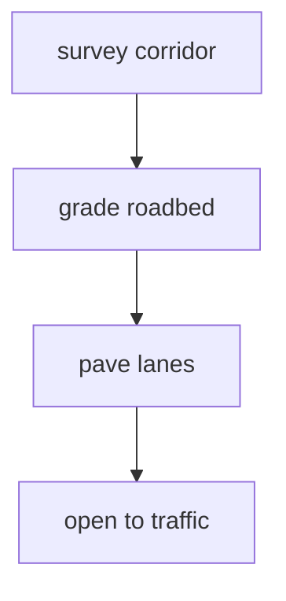

*I-49 extension phases: every edge is a “must finish before” rule; there is no loop back to an earlier stage.*

---

### Bipartite

!!! note "Sidebar — cities and highway numbers"

    A **[bipartite](graph-theory/index.md#bipartite)** graph splits vertices into **two disjoint sets**; every edge connects one city to one highway number — never city-to-city or highway-to-highway in this layout.

| Key point | Detail |
| --- | --- |
| **[Edge direction](graph-theory/index.md#edge-direction)** | Usually modeled [undirected](graph-theory/index.md#undirected-graph) between partitions |
| **[Weight](graph-theory/index.md#weight)** | Optional (e.g. segment length on that highway) |
| **Structure** | Two color classes; edges only cross classes — [bipartite](graph-theory/index.md#bipartite) |
| **Algorithms** | BFS two-coloring, Hopcroft–Karp matching |

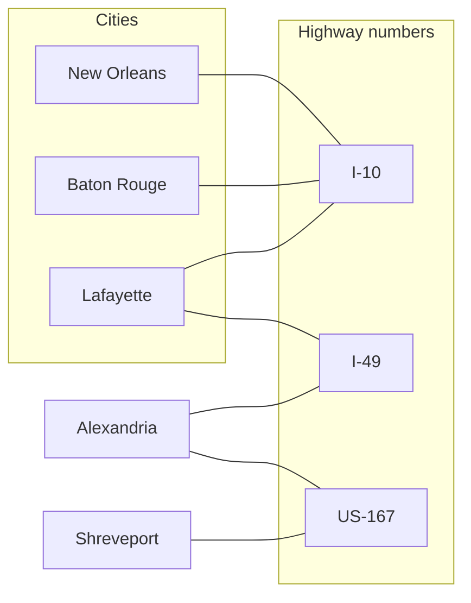

*Cities ↔ highway numbers: New Orleans and Baton Rouge both touch I-10; Lafayette touches I-10 and I-49 — edges never connect city-to-city or highway-to-highway.*

---

## Representations compared

Think of each representation as a different way to store the **same roadmap**:

| Representation | Space | Edge query (u,v)? | Neighbors of u | Best when |
| --- | --- | --- | --- | --- |
| **Adjacency list** | O(V + E) | O(deg(u)) scan | O(deg(u)) | Sparse highway network (most road graphs) |
| **Adjacency matrix** | O(V²) | O(1) | O(V) | Dense tiny V (small metro mesh) |
| **Edge list** | O(E) | O(E) | O(E) | Kruskal MST, compact storage |

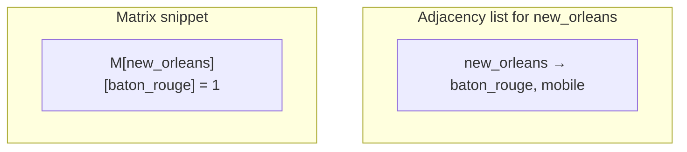

---

## Ways to create a graph

### 1. Empty adjacency-list graph

```python
graph = {}
```

### 2. Empty `Graph` class

```python
class Graph:
    def __init__(self, directed=False):
        self.directed = directed
        self.adj = {}
```

### 3. From edge list — Gulf Coast segments

```python
# Each tuple is a two-way interstate segment (undirected).
edges = [
    ("new_orleans", "baton_rouge"),
    ("baton_rouge", "lafayette"),
    ("lafayette", "alexandria"),
    ("alexandria", "shreveport"),
    ("new_orleans", "mobile"),
]
g = Graph.from_edges(edges, directed=False)
```

|           |               |
|-----------|---------------|
| **Time**  | O(E)          |
| **Space** | O(V + E)      |

### 4. From adjacency dict

```python
g = Graph.from_adjacency({
    "new_orleans": ["baton_rouge", "mobile"],
    "baton_rouge": ["new_orleans", "lafayette"],
    "lafayette": ["baton_rouge", "alexandria"],
    "alexandria": ["lafayette", "shreveport"],
})
```

### 5. Weighted edges

```python
# Weight = miles on the segment (fictitious).
wg = WeightedGraph()
wg.add_edge("new_orleans", "baton_rouge", weight=81)    # I-10
wg.add_edge("baton_rouge", "lafayette", weight=56)    # I-10
wg.add_edge("lafayette", "alexandria", weight=72)       # I-49
wg.add_edge("alexandria", "shreveport", weight=95)    # US-167
wg.add_edge("new_orleans", "mobile", weight=145)        # I-10
```

---

## Reference implementation (adjacency list)

```python
from collections import deque
from dataclasses import dataclass

@dataclass
class Edge:
    u: str = ""
    v: str = ""
    weight: float = 1.0

class Graph:
    def __init__(self, directed=False):
        self.directed = directed
        self.adj = {}

    @classmethod
    def from_edges(cls, edges, directed=False):
        g = cls(directed=directed)
        for u, v in edges:
            g.add_edge(u, v)
        return g

    @classmethod
    def from_adjacency(cls, adj, directed=False):
        g = cls(directed=directed)
        g.adj = {u: list(neighbors) for u, neighbors in adj.items()}
        for u in adj:
            g.adj.setdefault(u, [])
            for v in adj[u]:
                g.adj.setdefault(v, [])
        return g

    def add_vertex(self, v):
        self.adj.setdefault(v, [])

    def add_edge(self, u, v):
        self.add_vertex(u)
        self.add_vertex(v)
        self.adj[u].append(v)
        if not self.directed:
            self.adj[v].append(u)
        else:
            self.adj.setdefault(v, [])

    def neighbors(self, v):
        return self.adj.get(v, [])

    def vertices(self):
        return list(self.adj.keys())

    def edges_undirected_count(self):
        return sum(len(nbs) for nbs in self.adj.values()) // (
            1 if self.directed else 2
        )

    def bfs(self, start):
        order = []
        seen = {start}
        q = deque([start])
        while q:
            v = q.popleft()
            order.append(v)
            for w in self.neighbors(v):
                if w not in seen:
                    seen.add(w)
                    q.append(w)
        return order

    def dfs(self, start):
        order = []
        seen = set()

        def visit(v):
            seen.add(v)
            order.append(v)
            for w in self.neighbors(v):
                if w not in seen:
                    visit(w)
        visit(start)
        return order

    def connected_components(self):
        seen = set()
        comps = []
        for v in self.vertices():
            if v in seen:
                continue
            comp = self.bfs(v)
            comps.append(comp)
            seen.update(comp)
        return comps

    def has_path(self, src, dst):
        return dst in set(self.bfs(src))

class WeightedGraph:
    """Adjacency list with (neighbor, weight) pairs; add algorithms on child pages."""

    def __init__(self, directed=False):
        self.directed = directed
        self.adj = {}

    def add_edge(self, u, v, weight=1.0):
        self.adj.setdefault(u, []).append((v, weight))
        if not self.directed:
            self.adj.setdefault(v, []).append((u, weight))
        else:
            self.adj.setdefault(v, [])

    def neighbors_weighted(self, u):
        return self.adj.get(u, [])
```

Full **Dijkstra**, **Bellman–Ford**, and other weighted routines are on the dedicated algorithm pages—see [Dijkstra](dijkstra/index.md) for a complete single-source implementation with a [priority queue](../priority-queue/index.md).

|           |                          |
|-----------|--------------------------|
| **Space** | O(V + E) adjacency lists |

---

## BFS — breadth-first search

**Idea:** Ripple outward from a start city — first all neighbors one segment away, then two, etc.

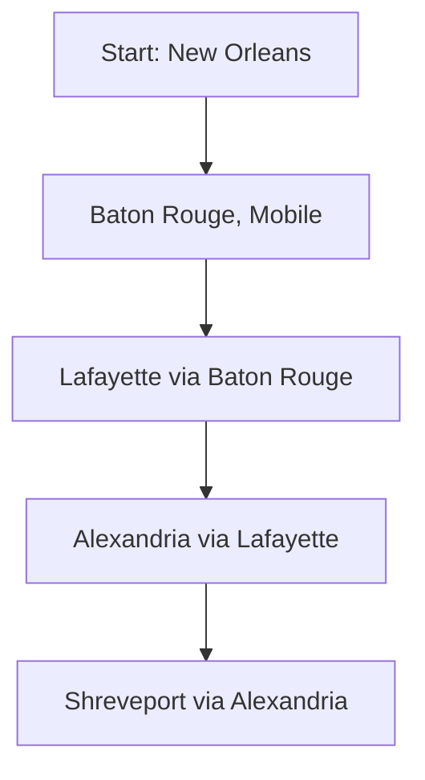

```python
# Gulf Coast corridor — unweighted hop count.
network = Graph.from_edges([
    ("new_orleans", "baton_rouge"),
    ("baton_rouge", "lafayette"),
    ("lafayette", "alexandria"),
    ("alexandria", "shreveport"),
    ("new_orleans", "mobile"),
])
order = network.bfs("new_orleans")
# ['new_orleans', 'baton_rouge', 'mobile', 'lafayette', 'alexandria', 'shreveport']
```

|           |                       |
|-----------|-----------------------|
| **Time**  | O(V + E)              |
| **Space** | O(V) queue + seen     |

**Use case:** fewest **highway segments** from New Orleans to Alexandria; navigation “cities within 2 hops of `new_orleans`.”

---

## DFS — depth-first search

**Idea:** Follow one highway deep before backtracking — drive Baton Rouge → Lafayette → Alexandria before revisiting Mobile from New Orleans.

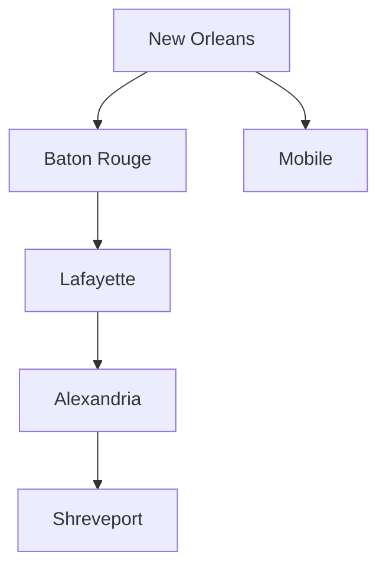

```python
corridor = Graph.from_edges([
    ("new_orleans", "baton_rouge"),
    ("baton_rouge", "lafayette"),
    ("lafayette", "alexandria"),
    ("alexandria", "shreveport"),
    ("new_orleans", "mobile"),
])
order = corridor.dfs("new_orleans")
# Deep along I-10 toward Alexandria before backtracking to Mobile
```

|           |                                   |
|-----------|-----------------------------------|
| **Time**  | O(V + E)                          |
| **Space** | O(V) stack (recursion or explicit)|

**Use case:** enumerate all cities reachable along one branch; detect cycles in a detour graph.

---

## Implicit graphs: grids

When input is a **downtown street grid**, each intersection `(r, c)` is a vertex and edges connect **in-bounds orthogonal neighbors** (north/south/east/west blocks). You do not build an adjacency list — neighbors are computed with direction deltas.

|                | Grid as graph      | Explicit [Graph](#ways-to-create-a-graph) |
|----------------|-------------------|-------------------------------------------|
| **Vertices**   | R × C intersections | Named cities (road network)             |
| **Edges**      | Up to 4 per cell  | Stored in adj list                        |
| **BFS/DFS cost**| O(R × C)         | O(V + E)                                  |

```python
DIRS_4 = ((0, 1), (0, -1), (1, 0), (-1, 0))  # E, W, S, N blocks

def grid_neighbors(r, c, rows, cols):
    for dr, dc in DIRS_4:
        nr, nc = r + dr, c + dc
        if 0 <= nr < rows and 0 <= nc < cols:
            yield nr, nc
```

The BFS and DFS sections above apply directly: replace vertex IDs with `(r, c)` pairs and iterate `grid_neighbors`. For full templates (spiral traversal, rotation, multi-source BFS, visit/undo), see [2D grids](../2d-grids/index.md). For path search that must **undo** cell choices, see [Backtracking](../../algorithms/backtracking/index.md).

|           |                                 |
|-----------|---------------------------------|
| **Time**  | O(R × C) full-grid traversal    |
| **Space** | O(R × C) for `seen` or BFS queue|

---

## Traversal comparison

|                           | BFS             | DFS                  |
|---------------------------|-----------------|----------------------|
| **Structure**             | Queue           | Stack / recursion    |
| **Shortest unweighted path** | Yes          | No                   |
| **Memory on wide graph**  | Can be large frontier | Linear path depth |
| **Analogy**               | Ripple outward from start city | Follow one highway deep, then backtrack |

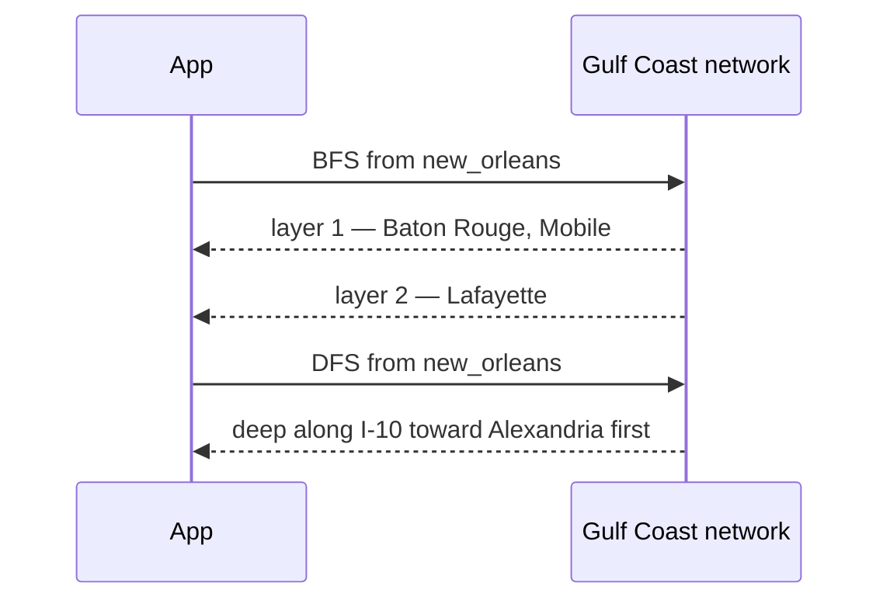

---

## All operations (practical examples + complexity)

### `add_vertex` / `add_edge`

```python
g = Graph()
g.add_edge("new_orleans", "baton_rouge")  # I-10 segment
```

|           |                     |
|-----------|---------------------|
| **Time**  | O(1) amortized append |
| **Space** | O(1) new edge storage|

### `neighbors(v)` — highways from New Orleans

|           |                        |
|-----------|------------------------|
| **Time**  | O(deg(v))              |
| **Space** | O(1) to return list ref|

### `bfs` / `dfs`

See above.

### `connected_components` — isolated road regions

```python
comps = network.connected_components()
# Cities that share no path form separate components.
```

|           |            |
|-----------|------------|
| **Time**  | O(V + E)   |
| **Space** | O(V)       |

### `has_path` — can we reach Shreveport from Mobile?

```python
reachable = network.has_path("mobile", "shreveport")
```

|           |            |
|-----------|------------|
| **Time**  | O(V + E)   |
| **Space** | O(V)       |

### Weighted shortest paths — see child pages

| Algorithm | When | Time (typical) | Page |
| --- | --- | --- | --- |
| **Dijkstra** | Single-source; non-negative weights | O((V + E) log V) with binary heap | [Dijkstra](dijkstra/index.md) |
| **Bellman–Ford** | Single-source; negative edges OK | O(V · E) | [Bellman–Ford](bellman-ford/index.md) |
| **Floyd–Warshall** | All-pairs distances | O(V³) | [Floyd–Warshall](floyd-warshall/index.md) |
| **A\*** | Goal-directed with heuristic | Depends on **h**; often beats Dijkstra on maps | [A*](a-star/index.md) |

Use **`WeightedGraph`** above for storage; implement **`dijkstra(src)`** on the [Dijkstra](dijkstra/index.md) page.

---

## Topological sort (DAG) — construction phase ordering

When edges mean “phase A before phase B” in a **highway construction** DAG (not the drive graph):

```python
def topological_sort(g):
    indeg = {v: 0 for v in g.vertices()}
    for u in g.vertices():
        for w in g.neighbors(u):
            indeg[w] = indeg.get(w, 0) + 1
    q = deque([v for v, d in indeg.items() if d == 0])
    order = []
    while q:
        v = q.popleft()
        order.append(v)
        for w in g.neighbors(v):
            indeg[w] -= 1
            if indeg[w] == 0:
                q.append(w)
    if len(order) != len(indeg):
        raise ValueError("cycle in graph")
    return order

# Construction phases for an I-49 extension (directed DAG).
construction = Graph(directed=True)
construction.add_edge("survey", "grade")
construction.add_edge("grade", "pave")
construction.add_edge("pave", "open")
phase_order = topological_sort(construction)
# ['survey', 'grade', 'pave', 'open']
```

|           |            |
|-----------|------------|
| **Time**  | O(V + E)   |
| **Space** | O(V)       |

---

## Python stdlib and ecosystem

| Tool                      | Role                                      |
|---------------------------|-------------------------------------------|
| `dict` + `list`           | DIY adjacency list (this page)            |
| `collections.deque`       | BFS queue                                 |
| `heapq`                   | [Dijkstra](dijkstra/index.md) priority queue |
| **networkx** (optional)   | `pip install networkx` — production graph algos |

```python
import networkx as nx

G = nx.Graph()
G.add_edge("new_orleans", "baton_rouge", weight=81)
nx.shortest_path(G, "new_orleans", "alexandria", weight="weight")
```

**Rule of thumb:** learn with **`Graph` class** above; use **networkx** for centrality, community detection, and large network studies.

---

## Master complexity table

| Operation / algorithm        | Time                   | Space           |
|-----------------------------|------------------------|-----------------|
| Store graph (adj list)      | O(V + E)               | O(V + E)        |
| Add edge                    | O(1) amortized         | O(1)            |
| List neighbors              | O(deg(v))              | O(1)            |
| BFS / DFS from one start    | O(V + E)               | O(V)            |
| All components              | O(V + E)               | O(V)            |
| Dijkstra ([subpage](dijkstra/index.md)) | O((V+E) log V) | O(V)            |
| Bellman–Ford ([subpage](bellman-ford/index.md)) | O(V · E) | O(V)     |
| Floyd–Warshall ([subpage](floyd-warshall/index.md)) | O(V³) | O(V²)  |
| MST Kruskal/Prim ([subpage](minimum-spanning-tree/index.md)) | O(E log E) / O(E log V) | O(V) |
| Topological sort            | O(V + E)               | O(V)            |
| Adjacency matrix check edge | O(1)                   | O(V²) storage   |

---

## When to pick which representation (practical context)

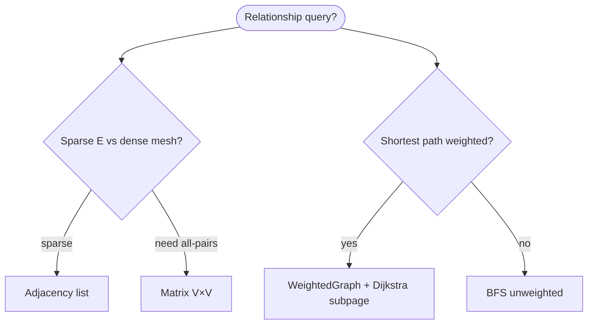

| Scenario                  | Best tool            |
|---------------------------|---------------------|
| Sparse highway network    | Adjacency list      |
| All-pairs small metro     | V×V matrix OK       |
| One-way detour routing    | Directed DFS        |
| Mileage between cities    | [Dijkstra](dijkstra/index.md) on `WeightedGraph` |
| Negative-cost edges       | [Bellman–Ford](bellman-ford/index.md) |
| All-pairs routing table   | [Floyd–Warshall](floyd-warshall/index.md) |
| Map routing with heuristic| [A*](a-star/index.md) |
| Backbone cable / fiber    | [Minimum spanning tree](minimum-spanning-tree/index.md) |

---

## Common pitfalls

| Pitfall                       | Why it hurts           | Fix                  |
|-------------------------------|------------------------|----------------------|
| Double-counting undirected edges | Wrong E             | Store once or halve count |
| BFS for weighted shortest      | Wrong answer           | [Dijkstra](dijkstra/index.md) |
| Dijkstra with negative weights | Wrong answer / stuck   | [Bellman–Ford](bellman-ford/index.md) |
| DFS stack overflow on huge V   | Recursion limit        | Iterative DFS        |
| Directed vs undirected mix     | Wrong neighbors        | Flag `directed`      |
| Ignoring disconnected start    | BFS misses vertices    | Loop all components  |

---

## Also applies to — other domains

The same graph machinery works outside road networks. Two common patterns:

| Domain | Vertices | Edges |
| --- | --- | --- |
| **Social graph** | Users | Mutual connection (undirected) |
| **Pipeline state machine** | `(stage, status)` tuples | Allowed transition after a step completes (directed) |

```python
def build_social_graph(links):
    g = Graph(directed=False)
    for row in links:
        g.add_edge(row["user_a"], row["user_b"])
    return g

pipeline = Graph(directed=True)
pipeline.add_edge(("pending", "ok"), ("running", "active"))
pipeline.add_edge(("running", "active"), ("done", "success"))
path_exists = pipeline.has_path(("pending", "ok"), ("done", "success"))
```

---

## Related pages

| Page | Relationship |
| --- | --- |
| [Dijkstra](dijkstra/index.md) | Single-source shortest paths; non-negative weights |
| [Bellman–Ford](bellman-ford/index.md) | Negative edges; cycle detection |
| [Floyd–Warshall](floyd-warshall/index.md) | All-pairs shortest paths |
| [A*](a-star/index.md) | Heuristic goal-directed search |
| [Minimum spanning tree](minimum-spanning-tree/index.md) | Kruskal and Prim |
| [Graph theory](graph-theory/index.md) | Definitions and classic problems |
| [2D grids](../2d-grids/index.md) | Grid-as-graph BFS/DFS templates |
| [Sets](../sets/index.md) | Vertices only, no edges |
| [Honorable mention ADT](../honorable-mention-adt/index.md) | Union-Find for connectivity and Kruskal |
| [Queue](../queue/index.md) | BFS queue |
| [Priority queue](../priority-queue/index.md) | Dijkstra and A* heaps |
| [Backtracking](../../algorithms/backtracking/index.md) | Grid path search with undo |
| [Complexity analysis](../../complexity/index.md) | O(V + E) notation |

---

## Quick reference card

```python
g = Graph()
g = Graph.from_edges([("new_orleans", "baton_rouge")], directed=False)

g.add_edge(u, v)
g.neighbors(v)
g.bfs(start)
g.dfs(start)
g.connected_components()
g.has_path(src, dst)

wg = WeightedGraph()
wg.add_edge("new_orleans", "baton_rouge", weight=81)  # miles
# wg.dijkstra(src)  → see dijkstra/index.md
```

Use a **graph** when questions are about **connections and paths**, not aggregate statistics—use **SQL** or **pandas** for summaries, **graphs** for topology.

**Implementation checklist**

1. **Default** — Tabular records in SQL or pandas; aggregates via `groupby`.
2. **Reachability / hops** — Adjacency list + BFS on the Gulf Coast network (or any sparse graph).
3. **Weighted routes** — `WeightedGraph` + [Dijkstra](dijkstra/index.md) (or [Bellman–Ford](bellman-ford/index.md) if edges can be negative).
4. **Construction order** — DAG + topological sort for highway build phases.
5. **Large networks** — Learn with `Graph` class; ship **networkx** for production metrics.
