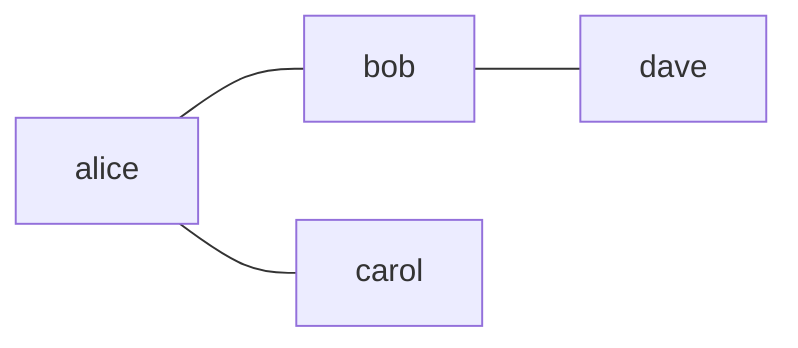
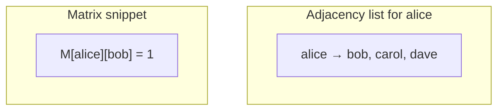
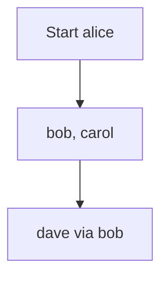
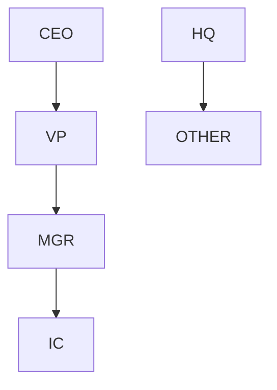
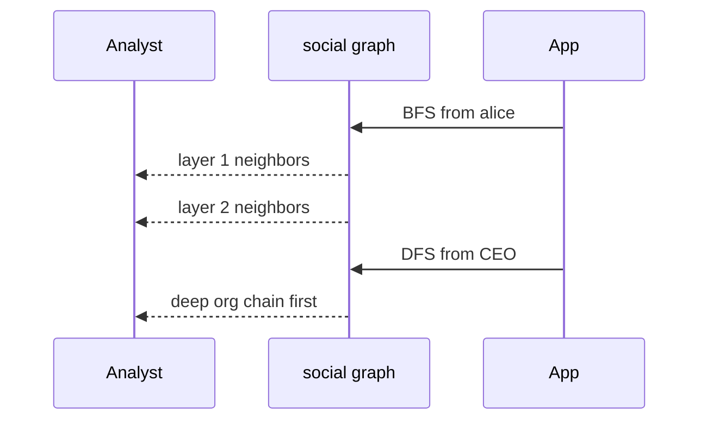
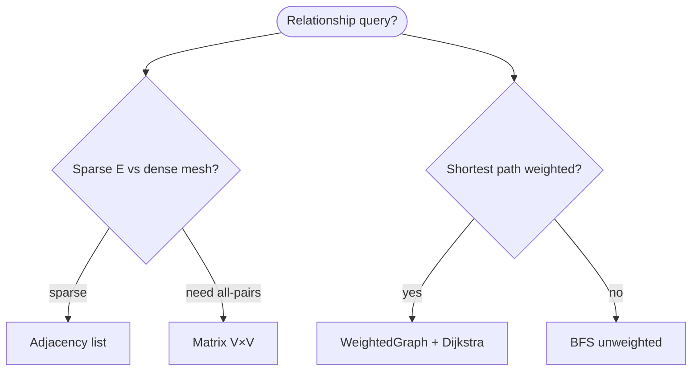

# Graphs

A **graph** is a set of **vertices** (nodes) and **edges** (links). Edges may be **directed** or **undirected**, **weighted** or **unweighted**. Graphs model **relationships**, **dependencies**, **routes**, and **state machines**—not just “maps.”

| | |
| --- | --- |
| **What it is** | G = (V, E); vertices are entities, edges are connections with optional weight. |
| **Representations** | Adjacency list (sparse), adjacency matrix (dense), edge list (compact storage). |
| **Core algorithms** | BFS, DFS, topological sort, shortest paths, minimum spanning tree, connected components. |
| **When to use** | Social graphs, service dependencies, URL routing, CDN topology, job pipeline state machines. |

In **application code**, graphs appear as **social follow networks**, **microservice dependency DAGs**, **org reporting lines**, and **pipeline state transitions** (pending → running → done). You will still aggregate stats in **SQL** or **pandas**—graphs excel when the question is **reachability**, **shortest path**, or **connectivity**.

This page is your **ready reference**: representations, a complete Python adjacency-list implementation, traversals with Mermaid, every common operation with practical examples, and **time and space complexity**. For Big-O notation, see [Complexity analysis](../../complexity/index.md).

[Parent: Data structures](../index.md)

---

## Practical applications

| Use case | Graph model | Typical algorithm |
| --- | --- | --- |
| **Social follows** | Vertices = users; edge = follows | Degree count, neighbor lists |
| **Org hierarchy** | Directed tree | DFS, topological order |
| **Route: NYC → LAX** | Weighted cities | Dijkstra / A* |
| **State machine** | Directed edges "next allowed state" | BFS layers |
| **Connected components** | Undirected users in same cluster | Union-Find / DFS |
| **Mutual connections** | Undirected unweighted | Set of edges |



Throughout: **V** = \|vertices\|, **E** = \|edges\|, **deg(v)** = degree of vertex v.

---

## Graph types

| Type | Edge direction | Weight | Example |
| --- | --- | --- | --- |
| Undirected | Both ways | Optional | Mutual social connection |
| Directed | One way | Optional | Manager → report |
| Weighted | Either | On edge | Latency between datacenters |
| Unweighted | Either | 1 | Linked in same ingest batch |
| Acyclic DAG | Directed, no cycles | — | Pipeline prerequisite tree |
| Bipartite | Two partitions | — | Users vs events |

---

## Representations compared

| Representation | Space | Edge query (u,v)? | Neighbors of u | Best when |
| --- | --- | --- | --- | --- |
| **Adjacency list** | O(V + E) | O(deg(u)) scan | O(deg(u)) | Sparse social networks |
| **Adjacency matrix** | O(V²) | O(1) | O(V) | Dense tiny V (small cluster mesh) |
| **Edge list** | O(E) | O(E) | O(E) | Kruskal MST, storage |



---

## Ways to create a graph

### 1. Empty adjacency-list graph

```python
graph = {}
```

### 2. Empty `Graph` class

```python
class Graph:
 def __init__(self, directed=False):
 self.directed = directed
 self.adj = {}
```

### 3. From edge list — social follows

```python
edges = [
 ("alice", "bob"),
 ("bob", "dave"),
 ("alice", "carol"),
]
g = Graph.from_edges(edges, directed=False)
```

| | |
| --- | --- |
| **Time** | O(E) |
| **Space** | O(V + E) |

### 4. From adjacency dict

```python
g = Graph.from_adjacency({
 "alice": ["bob", "carol"],
 "bob": ["alice"],
 "carol": ["alice"],
})
```

### 5. Weighted edges

```python
wg = WeightedGraph()
wg.add_edge("nyc", "lax", weight=175)
```

---

## Reference implementation (adjacency list)

```python
from collections import deque
from dataclasses import dataclass


@dataclass
class Edge:
 u: str
 v: str
 weight: float = 1.0


class Graph:
 def __init__(self, directed=False):
 self.directed = directed
 self.adj = {}

 @classmethod
 def from_edges(cls, edges, directed=False):
 g = cls(directed=directed)
 for u, v in edges:
 g.add_edge(u, v)
 return g

 @classmethod
 def from_adjacency(cls, adj, directed=False):
 g = cls(directed=directed)
 g.adj = {u: list(neighbors) for u, neighbors in adj.items()}
 for u in adj:
 g.adj.setdefault(u, [])
 for v in adj[u]:
 g.adj.setdefault(v, [])
 return g

 def add_vertex(self, v):
 self.adj.setdefault(v, [])

 def add_edge(self, u, v):
 self.add_vertex(u)
 self.add_vertex(v)
 self.adj[u].append(v)
 if not self.directed:
 self.adj[v].append(u)
 else:
 self.adj.setdefault(v, [])

 def neighbors(self, v):
 return self.adj.get(v, [])

 def vertices(self):
 return list(self.adj.keys())

 def edges_undirected_count(self):
 return sum(len(nbs) for nbs in self.adj.values()) // (
 1 if self.directed else 2
 )

 def bfs(self, start):
 order = []
 seen = {start}
 q = deque([start])
 while q:
 v = q.popleft()
 order.append(v)
 for w in self.neighbors(v):
 if w not in seen:
 seen.add(w)
 q.append(w)
 return order

 def dfs(self, start):
 order = []
 seen = set()

 def visit(v):
 seen.add(v)
 order.append(v)
 for w in self.neighbors(v):
 if w not in seen:
 visit(w)

 visit(start)
 return order

 def connected_components(self):
 seen = set()
 comps = []
 for v in self.vertices():
 if v in seen:
 continue
 comp = self.bfs(v)
 comps.append(comp)
 seen.update(comp)
 return comps

 def has_path(self, src, dst):
 return dst in set(self.bfs(src))


class WeightedGraph:
 def __init__(self, directed=False):
 self.directed = directed
 self.adj = {}

 def add_edge(self, u, v, weight=1.0):
 self.adj.setdefault(u, []).append((v, weight))
 if not self.directed:
 self.adj.setdefault(v, []).append((u, weight))
 else:
 self.adj.setdefault(v, [])

 def dijkstra(self, src):
 import heapq

 dist = {src: 0.0}
 pq = [(0.0, src)]
 while pq:
 d, u = heapq.heappop(pq)
 if d > dist.get(u, float("inf")):
 continue
 for v, w in self.adj.get(u, []):
 nd = d + w
 if nd < dist.get(v, float("inf")):
 dist[v] = nd
 heapq.heappush(pq, (nd, v))
 return dist
```

| | |
| --- | --- |
| **Space** | O(V + E) adjacency lists |

---

## BFS — breadth-first search

**Idea:** Explore layer by layer—first all neighbors one hop away, then two, etc.



```python
network = Graph.from_edges([("alice", "bob"), ("bob", "dave"), ("alice", "carol")])
order = network.bfs("alice")
```

| | |
| --- | --- |
| **Time** | O(V + E) |
| **Space** | O(V) queue + seen |

**Use case:** fewest **hops** in a social graph; dashboard "users within 2 degrees of alice."

---

## DFS — depth-first search

**Idea:** Go deep along one branch before backtracking.



```python
org_tree = Graph(directed=True)
org_tree.add_edge("CEO", "VP")
org_tree.add_edge("VP", "MGR")
order = org_tree.dfs("CEO")
```

| | |
| --- | --- |
| **Time** | O(V + E) |
| **Space** | O(V) stack (recursion or explicit) |

**Use case:** detect cycles in dependency graph; enumerate office subtree.

---

## Traversal comparison

| | BFS | DFS |
| --- | --- | --- |
| **Structure** | Queue | Stack / recursion |
| **Shortest unweighted path** | Yes | No |
| **Memory on wide graph** | Can be large frontier | Linear path depth |
| **Analogy** | Ripple through social network | Drill into one branch |



---

## All operations (practical examples + complexity)

### `add_vertex` / `add_edge`

```python
g = Graph()
g.add_edge("alice", "bob")
```

| | |
| --- | --- |
| **Time** | O(1) amortized append |
| **Space** | O(1) new edge storage |

### `neighbors(v)` — neighbors of alice

| | |
| --- | --- |
| **Time** | O(deg(v)) |
| **Space** | O(1) to return list ref |

### `bfs` / `dfs`

See above.

### `connected_components` — isolated network islands

```python
comps = network.connected_components()
```

| | |
| --- | --- |
| **Time** | O(V + E) |
| **Space** | O(V) |

### `has_path` — can we reach dave from alice?

| | |
| --- | --- |
| **Time** | O(V + E) |
| **Space** | O(V) |

### Dijkstra — weighted travel

```python
dist = wg.dijkstra("nyc")
latency_to_lax = dist.get("lax", float("inf"))
```

| | |
| --- | --- |
| **Time** | O((V + E) log V) with binary heap |
| **Space** | O(V) |

---

## Application: social relationship graph

Vertices = users; undirected edge if they are mutual connections.

```python
def build_social_graph(links):
    g = Graph(directed=False)
    for row in links:
        g.add_edge(row["user_a"], row["user_b"])
    return g

g = build_social_graph(connection_rows)
alice_neighbors = g.neighbors("alice")
```

| | |
| --- | --- |
| **Time** | O(links) |
| **Space** | O(V + E) |

---

## Application: pipeline state machine (directed)

Vertices = `(stage, status)`; edge = allowed transition after a step completes.

```python
pipeline = Graph(directed=True)
pipeline.add_edge(("pending", "ok"), ("running", "active"))
pipeline.add_edge(("running", "active"), ("done", "success"))
path_exists = pipeline.has_path(("pending", "ok"), ("done", "success"))
```

---

## Topological sort (DAG) — prerequisite pipeline drill

When edges mean “stage A before stage B” in a teaching DAG:

```python
def topological_sort(g):
 indeg = {v: 0 for v in g.vertices()}
 for u in g.vertices():
 for w in g.neighbors(u):
 indeg[w] = indeg.get(w, 0) + 1
 q = deque([v for v, d in indeg.items() if d == 0])
 order = []
 while q:
 v = q.popleft()
 order.append(v)
 for w in g.neighbors(v):
 indeg[w] -= 1
 if indeg[w] == 0:
 q.append(w)
 if len(order) != len(indeg):
 raise ValueError("cycle in graph")
 return order
```

| | |
| --- | --- |
| **Time** | O(V + E) |
| **Space** | O(V) |

---

## Python stdlib and ecosystem

| Tool | Role |
| --- | --- |
| `dict` + `list` | DIY adjacency list (this page) |
| `collections.deque` | BFS queue |
| `heapq` | Dijkstra priority queue |
| **networkx** (optional) | `pip install networkx` — production graph algos |

```python
import networkx as nx

G = nx.Graph()
G.add_edge("alice", "bob")
nx.shortest_path(G, "alice", "dave")
```

**Rule of thumb:** learn with **`Graph` class** above; use **networkx** for centrality, community detection, and large network studies.

---

## Master complexity table

| Operation / algorithm | Time | Space |
| --- | --- | --- |
| Store graph (adj list) | O(V + E) | O(V + E) |
| Add edge | O(1) amortized | O(1) |
| List neighbors | O(deg(v)) | O(1) |
| BFS / DFS from one start | O(V + E) | O(V) |
| All components | O(V + E) | O(V) |
| Dijkstra | O((V+E) log V) | O(V) |
| Topological sort | O(V + E) | O(V) |
| Adjacency matrix check edge | O(1) | O(V²) storage |

---

## When to pick which representation (practical context)



| Scenario | Best tool |
| --- | --- |
| Sparse social edges | Adjacency list |
| All-pairs small cluster | V×V matrix OK |
| Org tree | Directed DFS |
| Datacenter latency | Weighted + Dijkstra |

---

## Common pitfalls

| Pitfall | Why it hurts | Fix |
| --- | --- | --- |
| Double-counting undirected edges | Wrong E | Store once or halve count |
| BFS for weighted shortest | Wrong answer | Dijkstra |
| DFS stack overflow on huge V | Recursion limit | Iterative DFS |
| Directed vs undirected mix | Wrong neighbors | Flag `directed` |
| Ignoring disconnected start | BFS misses vertices | Loop all components |

---

## Related pages

| Page | Relationship |
| --- | --- |
| [Sets](../sets/index.md) | Vertices only, no edges |
| [Honorable mention ADT](../honorable-mention-adt/index.md) | Union-Find for connectivity |
| [Queue](../queue/index.md) | BFS queue |
| [Priority queue](../priority-queue/index.md) | Dijkstra heap |
| [Complexity analysis](../../complexity/index.md) | O(V + E) notation |

---

## Quick reference card

```python
g = Graph()
g = Graph.from_edges([("alice", "bob")], directed=False)

g.add_edge(u, v)
g.neighbors(v)
g.bfs(start)
g.dfs(start)
g.connected_components()
g.has_path(src, dst)

wg = WeightedGraph()
wg.add_edge(u, v, weight=1.0)
wg.dijkstra(src)
```

Use a **graph** when questions are about **connections and paths**, not column means—use **SQL** or **pandas** for aggregations, **graphs** for topology.

**Implementation checklist**

1. **Default** — Tabular records in SQL or pandas; aggregates via `groupby`.
2. **Reachability / hops** — Adjacency list + BFS on social or CDN mesh.
3. **Weighted routes** — `WeightedGraph` + Dijkstra for latency or distance.
4. **Pipeline order** — DAG + topological sort for build dependencies.
5. **Large networks** — Learn with `Graph` class; ship **networkx** for production metrics.
