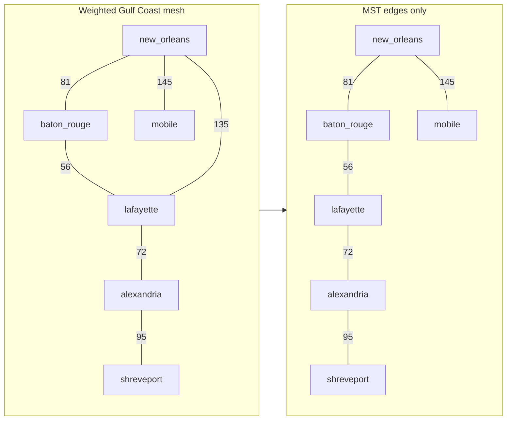
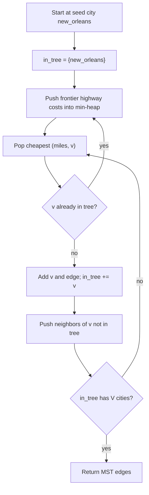
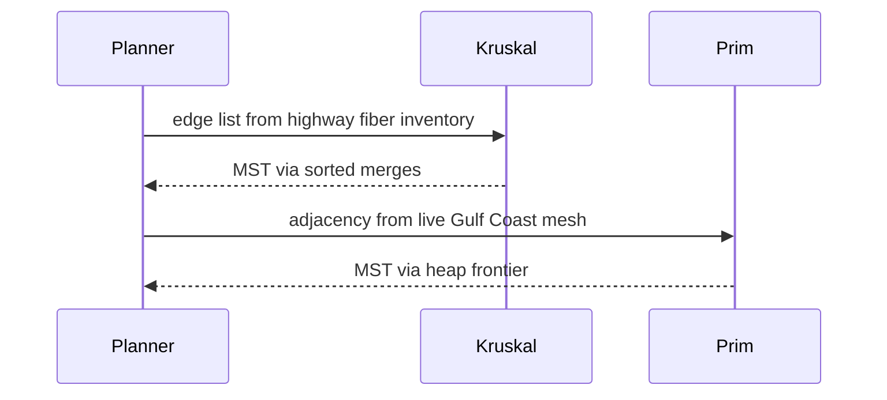

# Minimum spanning tree

A **minimum spanning tree (MST)** of a **connected, undirected, weighted** graph is a [spanning tree](../graph-theory/index.md#spanning-tree) with **minimum total edge weight**. It has exactly **V − 1** edges and **no [cycles](../graph-theory/index.md#walks-paths-trails-cycles)**. MST answers: *what is the cheapest way to connect every Gulf Coast city into one network?*

| | |
| --- | --- |
| **What it is** | Subgraph that spans all vertices, is acyclic, and minimizes sum of edge weights. |
| **Core algorithms** | **[Kruskal](#kruskal--sort-edges-union-components)** (sort edges + [Union-Find](../../honorable-mention-adt/index.md)); **[Prim](#prim--grow-tree-from-a-seed-vertex)** (grow tree with [min-priority queue](../../priority-queue/index.md)). |
| **When to use** | Fiber along highway ROW, emergency relief road backbone, power-line planning between cities. |
| **Trade-off** | Kruskal favors **sparse** edge lists; Prim favors **dense** adjacency lists or matrix-like graphs. |

In **infrastructure planning**, vertices are **cities** and edge weights are **highway miles** or **cable cost per mile**. The MST is the cheapest set of links that keeps every city reachable—often a starting point before adding redundant paths for storm resilience.

This page is a **ready reference**: Kruskal and Prim on one page, comparison table, Python implementations, complexity, pitfalls, and links to supporting ADTs. For graph representations and traversals, see [Graphs](../index.md). For Big-O notation, see [Complexity analysis](../../../complexity/index.md).

[Parent: Graphs](../index.md)

---

Throughout: **V** = \|vertices\|, **E** = \|edges\|.

---

## MST at a glance

| Property | Detail |
| --- | --- |
| **Input** | Connected undirected graph with non-negative edge weights |
| **Output** | V − 1 edges, total weight minimized |
| **Unique?** | Yes if all weights distinct; ties may yield multiple valid MSTs |
| **Disconnected graph** | No single MST—compute MST per connected component |



*Gulf Coast mesh: MST keeps the five cheapest backbone links (total **449 mi**) and drops the expensive `new_orleans` ↔ `lafayette` bypass (**135 mi**) because I-10 through `baton_rouge` already connects them at lower cost (**81 + 56 = 137 mi** is served by two MST edges totaling 137).*

---

## Cut property (highway intuition)

The [cut property](../graph-theory/index.md#cut-property) is why greedy MST algorithms work: for any partition of cities into two sets, the **lightest edge crossing the cut** belongs to some MST.

**Example cut:** `{new_orleans, mobile, baton_rouge}` | `{lafayette, alexandria, shreveport}`.

| Crossing edge | Highway | Miles |
| --- | --- | --- |
| `baton_rouge` ↔ `lafayette` | I-10 | **56** ← lightest |
| `lafayette` ↔ `alexandria` | I-49 | 72 |
| `new_orleans` ↔ `lafayette` | I-10 bypass | 135 |

The cheapest connector is **baton_rouge ↔ lafayette (56 mi)**—Kruskal and Prim both prefer it when merging the western chain with the eastern cluster. Physically: if you must build one new highway link across that regional divide, run fiber along the shortest ROW segment.

---

## Kruskal — sort edges, union components

**Idea:** By the [cut property](../graph-theory/index.md#cut-property), process edges from **lightest to heaviest**. Add an edge if its endpoints are in **different [connected components](../graph-theory/index.md#connected-component)** (merge with [Union-Find](../../honorable-mention-adt/index.md)). Stop when you have **V − 1** edges.

```mermaid
flowchart TD
  S["Sort all highway segments by miles"] --> L["Lightest edge (u, v, w)"]
  L --> Q{find(u) ≠ find(v)?}
  Q -->|yes| ADD["Add edge; union(u, v)"]
  Q -->|no| SKIP["Skip — would form cycle"]
  ADD --> N{Have V − 1 edges?}
  SKIP --> N
  N -->|no| L
  N -->|yes| DONE["Return MST edge set"]
```

Kruskal naturally uses an **edge list** representation ([Graphs — edge list](../index.md#representations-compared)). Connectivity checks use [Union-Find (disjoint set)](../../honorable-mention-adt/index.md#union-find-disjoint-set).

```python
def kruskal(vertices, edges):
    """
    vertices: iterable of hashable city keys
    edges: list of (u, v, weight) for undirected graph
    returns: (mst_edges, total_weight)
    """
    parent = {v: v for v in vertices}
    rank = {v: 0 for v in vertices}

    def find(x):
        while parent[x] != x:
            parent[x] = parent[parent[x]]
            x = parent[x]
        return x

    def union(a, b):
        ra, rb = find(a), find(b)
        if ra == rb:
            return False
        if rank[ra] < rank[rb]:
            ra, rb = rb, ra
        parent[rb] = ra
        if rank[ra] == rank[rb]:
            rank[ra] += 1
        return True

    sorted_edges = sorted(edges, key=lambda e: e[2])
    mst = []
    total = 0.0
    for u, v, w in sorted_edges:
        if union(u, v):
            mst.append((u, v, w))
            total += w
            if len(mst) == len(vertices) - 1:
                break
    if len(mst) != len(vertices) - 1:
        raise ValueError("graph is disconnected")
    return mst, total


# Gulf Coast fiber-along-ROW example (miles fictitious)
cities = [
    "new_orleans", "baton_rouge", "lafayette",
    "alexandria", "shreveport", "mobile",
]
highway_links = [
    ("baton_rouge", "lafayette", 56),       # I-10
    ("lafayette", "alexandria", 72),        # I-49
    ("new_orleans", "baton_rouge", 81),     # I-10
    ("alexandria", "shreveport", 95),       # US-167
    ("new_orleans", "lafayette", 135),      # I-10 bypass — cycle-forming chord
    ("new_orleans", "mobile", 145),         # I-10
]
mst_edges, cost = kruskal(cities, highway_links)
# MST: BR–LAF (56), LAF–ALEX (72), NO–BR (81), ALEX–SHV (95), NO–MOB (145) → total 449 mi
# Dropped: NO–LAF bypass (135) — cheaper to reach Lafayette via Baton Rouge
```

| | |
| --- | --- |
| **Time** | O(E log E) — dominated by sorting edges; unions are O(E α(V)) |
| **Space** | O(V) for Union-Find parent/rank arrays |

---

## Prim — grow tree from a seed vertex

**Idea:** Start at any city. Repeatedly add the **cheapest edge** that connects the growing **tree** to a **city outside** the tree. A **min-priority queue** keyed by tentative connection cost drives the greedy choice—same heap pattern as Dijkstra ([Priority queue](../../priority-queue/index.md)).



```python
import heapq


def prim(adj, start):
    """
    adj: dict mapping city -> list of (neighbor, weight)
    start: any city in the connected component
    returns: (mst_edges, total_weight)
    """
    in_tree = {start}
    mst = []
    total = 0.0
    pq = []
    for v, w in adj.get(start, []):
        heapq.heappush(pq, (w, start, v))

    while pq and len(in_tree) < len(adj):
        w, u, v = heapq.heappop(pq)
        if v in in_tree:
            continue
        in_tree.add(v)
        mst.append((u, v, w))
        total += w
        for nb, nw in adj.get(v, []):
            if nb not in in_tree:
                heapq.heappush(pq, (nw, v, nb))

    if len(in_tree) != len(adj):
        raise ValueError("graph is disconnected")
    return mst, total


adj = {
    "new_orleans": [
        ("baton_rouge", 81), ("mobile", 145), ("lafayette", 135),
    ],
    "baton_rouge": [
        ("new_orleans", 81), ("lafayette", 56),
    ],
    "lafayette": [
        ("baton_rouge", 56), ("alexandria", 72), ("new_orleans", 135),
    ],
    "alexandria": [
        ("lafayette", 72), ("shreveport", 95),
    ],
    "shreveport": [("alexandria", 95)],
    "mobile": [("new_orleans", 145)],
}
mst_edges, cost = prim(adj, "new_orleans")
# Same MST as Kruskal: total 449 mi
```

| | |
| --- | --- |
| **Time** | O(E log V) with binary heap — each edge may be pushed once |
| **Space** | O(V) for `in_tree` + O(E) worst-case heap size |

With a **Fibonacci heap** and decrease-key, Prim reaches O(E + V log V); binary `heapq` is the usual Python choice.

---

## Kruskal vs Prim

| | **Kruskal** | **Prim** |
| --- | --- | --- |
| **Strategy** | Global: lightest highway that does not cycle | Local: cheapest edge from tree to outside |
| **Best representation** | Edge list (fiber inventory CSV) | Adjacency list (live road mesh) |
| **Priority structure** | Sort edges; Union-Find for components | Min-heap on frontier costs |
| **Time (binary heap)** | O(E log E) | O(E log V) |
| **Extra space** | O(V) Union-Find | O(V) + heap |
| **Parallel-friendly** | Sort + union steps partition well | Grows one frontier; harder to parallelize |
| **Typical fit** | Sparse statewide link inventory | Dense city-to-city mesh graph |



When **E ≈ V** (sparse), Kruskal's O(E log E) and Prim's O(E log V) are close. When **E is large** relative to V, Prim's O(E log V) can beat Kruskal's O(E log E). When the input is already an **edge list** from a DOT cable survey, Kruskal is simpler to implement.

---

## Complexity summary

| Algorithm | Time | Space | Notes |
| --- | --- | --- |
| **Kruskal** | O(E log E) | O(V) | Sort dominates; α(V) unions |
| **Prim (binary heap)** | O(E log V) | O(V + E) | Lazy heap entries like Dijkstra |
| **Prim (Fibonacci heap)** | O(E + V log V) | O(V + E) | Theoretical; rare in app code |
| **Borůvka** (variant) | O(E log V) | O(V) | Parallel MST; not covered here |

---

## Application: Gulf Coast fiber backbone

Vertices = **cities**; edge weight = **miles of cable** along existing highway right-of-way (ROW). Planners use MST to estimate **minimum backbone cost** before adding redundant links for hurricane resilience.

```python
def plan_fiber_backbone(highway_inventory_rows):
    vertices = set()
    edges = []
    for row in highway_inventory_rows:
        u, v, miles = row["city_a"], row["city_b"], float(row["miles"])
        vertices.add(u)
        vertices.add(v)
        edges.append((u, v, miles))
    return kruskal(vertices, edges)
```

| | |
| --- | --- |
| **Time** | O(E log E) per planning run |
| **Space** | O(V) |

The MST is a **lower bound** on connectivity cost—not the final design. Production networks add **redundant paths** (alternate I-10 / I-12 corridors) outside MST scope. Emergency relief road planning uses the same math: minimum miles of new connector pavement to reach every isolated parish seat.

---

## Common pitfalls

| Pitfall | Why it hurts | Fix |
| --- | --- | --- |
| Running MST on **disconnected** graph | Fewer than V − 1 edges; silent partial tree | Check `len(mst) == V - 1` or run per component |
| **Directed** edges treated as undirected | Wrong weights / missing reverse arcs | Undirected MST only; symmetrize or use different problem |
| **Negative weights** | Standard greedy proofs break | Shift weights or use other models; MST assumes non-negative |
| Prim without **lazy pop** check | Stale heap entries add wrong edges | Skip if neighbor already in tree |
| Kruskal without **path compression** | Slower finds on deep chains | Path compression + union by rank ([Union-Find](../../honorable-mention-adt/index.md)) |
| Expecting MST to encode **redundancy** | Tree has no alternate routes | Add k-edge connectivity or Steiner tree problems separately |

---

## Related pages

| Page | Relationship |
| --- | --- |
| [Graphs](../index.md) | Representations, weighted graphs, Dijkstra |
| [Union-Find](../../honorable-mention-adt/index.md) | Kruskal connectivity merges |
| [Priority queue](../../priority-queue/index.md) | Prim min-heap frontier |
| [Min heap](../../min-heap/index.md) | Heap mechanics behind `heapq` |
| [2D grids](../../2d-grids/index.md) | Grid graphs rarely need MST; explicit city graphs do |
| [Complexity analysis](../../../complexity/index.md) | O(E log E) notation |

---

## Quick reference card

```python
# Kruskal — edge list + Union-Find
mst, total = kruskal(cities, highway_links)

# Prim — adjacency list + min-heap
mst, total = prim(adj, "new_orleans")
```

Use **Kruskal** when the input is a **flat highway link inventory** and you want simple merging. Use **Prim** when the graph is already an **adjacency list** and you are growing from a **known seed city**. Both return the same **total weight** when the MST is unique.
