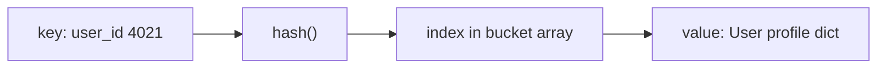
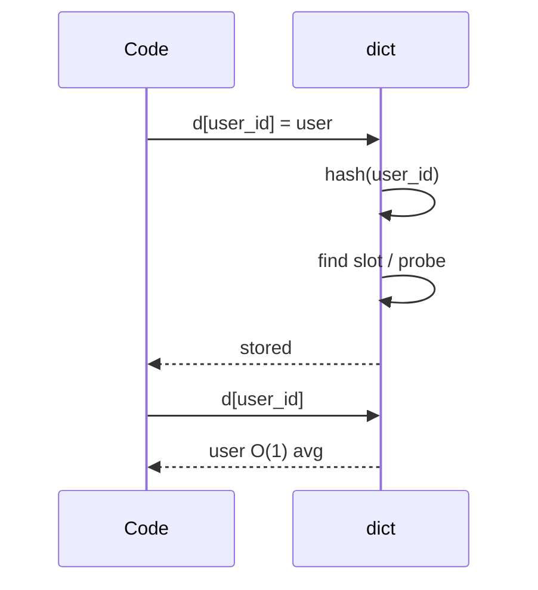
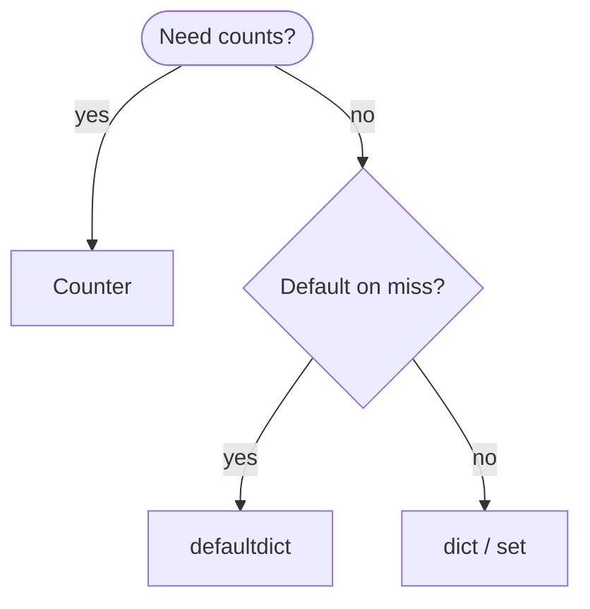
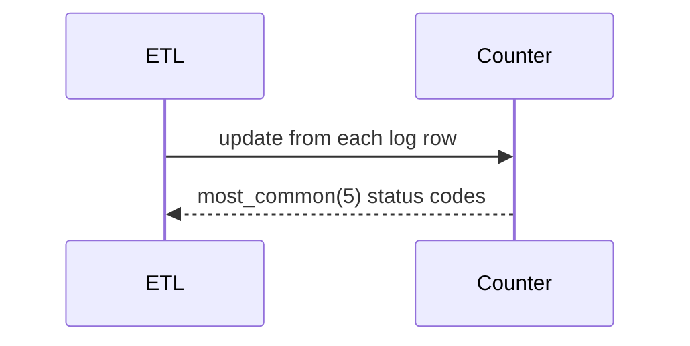
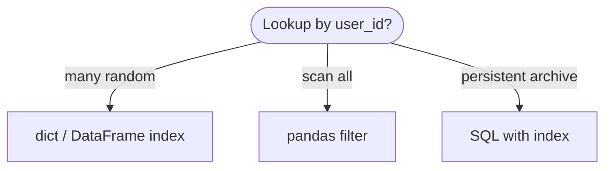
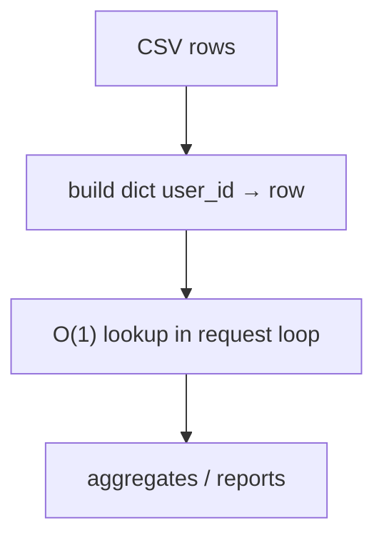

# Hash table

A **key → value** map implemented by hashing keys into **bucket indices**, with a **collision policy** when two keys land in the same slot. Average-case lookup, insert, and delete are **O(1)**; Python's `dict` and `set` are highly optimized hash tables in C.

| | |
| --- | --- |
| **What it is** | `hash(key) % buckets` picks a slot; collisions resolved by open addressing or chaining (CPython dict uses open addressing). |
| **Core operations** | `get`, `set`, `delete`, membership; iteration over keys (insertion-ordered in dict 3.7+). |
| **When to use** | Key-value caches, session stores, deduplication, counting event types, grouping records by id. |
| **Trade-off** | Keys must be hashable; worst-case O(n) if all keys collide; no cheap "sorted by key" without extra structure. |

In **application code**, hash tables are the **default index layer**: map **`user_id` → profile dict**, **`session_id` → state**, route slugs, HTTP status **`Counter`** tallies, and **`defaultdict`** group-by aggregations. You rarely implement a hash table from scratch in production—you **use `dict` / `set` / `Counter` / `defaultdict`** and understand collisions, load factor, and hashability so debug sessions make sense.

This page is your **ready reference**: Python built-ins, a teaching implementation, collision concepts, every common operation with practical examples, and **time and space complexity**. For Big-O notation, see [Complexity analysis](../../complexity/index.md).

[Parent: Data structures](../index.md)

---

## Hash table vs list vs tree

| | **`dict` / `set`** | **`list` scan** | **BST / `sorted`** |
| --- | --- | --- | --- |
| **Find by key** | O(1) average | O(n) | O(log n) |
| **Insert** | O(1) average | O(1) append; find O(n) | O(log n) |
| **Ordered by key** | Insertion order only (dict) | Index order | Sorted order |
| **Typical use** | `users[user_id]` | scan all records | sorted leaderboard tree |



Throughout this page, **n** is the number of entries; **m** is bucket count (implementation detail in CPython).

---

## Common applications: what a hash table models

| Application | Map type | Example key |
| --- | --- | --- |
| **User by id** | `dict[int, User]` | `user_id` |
| **Slug → title** | `dict[str, str]` | `"getting-started"` |
| **Route metadata** | `dict[str, dict]` | `"/api/v1/users"` |
| **Unique ids seen** | `set[str]` | `session_id` |
| **Count by status code** | `Counter[str]` | `"404"` |
| **Sum per category** | `defaultdict(float)` | `category_id` |

```python
from collections import Counter, defaultdict
from dataclasses import dataclass


@dataclass(frozen=True)
class User:
 user_id: int
 username: str
 email: str
 role: str


@dataclass(frozen=True)
class Route:
 path: str
 handler: str
 methods: tuple[str, ...]
```

---

## Mental model: hash, bucket, collision

1. **`hash(key)`** → integer (must be stable for lifetime of key in table).
2. **Bucket index** = `hash % m` (conceptually).
3. **Collision** — two keys want the same bucket; probe other slots or chain a list.



| Concept | Meaning | Practical impact |
| --- | --- | --- |
| **Hashable key** | Immutable or defines `__hash__` | Use `int`, `str`, `tuple` of immutables |
| **Load factor** | n/m; resize when too full | CPython resizes dict automatically |
| **Collision** | Same bucket | Still O(1) average with good hash |

---

## Ways to create a hash table in Python

### 1. Empty `dict`

```python
users_by_id: dict[int, User] = {}
```

| | |
| --- | --- |
| **Time** | O(1) |
| **Space** | O(1) empty overhead |

### 2. Dict literal / comprehension

```python
slug_title = {"intro": "Introduction", "api": "API Reference", "faq": "FAQ"}

users = {
 u.user_id: u
 for u in load_users_from_csv("users.csv")
}
```

| | |
| --- | --- |
| **Time** | O(n) for n records |
| **Space** | O(n) |

### 3. `dict()` constructor

```python
d = dict([("alice", 3), ("bob", 2)])
d2 = dict(zip(user_ids, usernames))
```

| | |
| --- | --- |
| **Time** | O(n) |
| **Space** | O(n) |

### 4. Empty `set`

```python
seen_sessions: set[str] = set()
```

| | |
| --- | --- |
| **Time** | O(1) |
| **Space** | O(1) |

### 5. `defaultdict` — missing keys get default

```python
score_by_category: defaultdict[float] = defaultdict(float)
score_by_category["electronics"] += 1.2
```

| | |
| --- | --- |
| **Time** | O(1) average per update |
| **Space** | O(keys) |

### 6. `Counter` — multiset counts

```python
status_counts = Counter(["404", "404", "200", "500", "404"])
assert status_counts["404"] == 3
```

| | |
| --- | --- |
| **Time** | O(k) build for k labels |
| **Space** | O(unique) |

### 7. Build index from list of rows (manual)

```python
def index_users(rows: list[dict]) -> dict[int, dict]:
 return {row["user_id"]: row for row in rows}
```

| | |
| --- | --- |
| **Time** | O(n) |
| **Space** | O(n) |

### 8. Teaching: `SeparateChainingHashTable`

See [Reference implementation](#reference-implementation-separatechaininghashtable) below.



---

## Hashability rules (Python)

| Hashable | Not hashable (default) |
| --- | --- |
| `int`, `float`, `str`, `bytes` | `list`, `dict`, `set` |
| `tuple` of hashables | mutable custom objects unless `__hash__` defined |
| `frozenset` | `bytearray` |

**Rule:** Use `user_id: int` or `(tenant_id, user_id)` tuple as key—not a mutable row `dict` as key.

```python
key = (row["tenant_id"], row["user_id"])
index[key] = row
```

---

## Collisions (conceptual)

**Separate chaining:** each bucket is a list of `(key, value)` pairs.

**Open addressing:** on collision, probe `i+1`, `i+2`, … (CPython dict uses a variant).

```python
def toy_hash(key: str, m: int) -> int:
 return sum(ord(c) for c in key) % m
```

| Case | Time |
| --- | --- |
| Average insert/lookup | O(1) |
| Worst all collide | O(n) |

You will not tune CPython's table in a typical ETL job; trust `dict` unless profiling shows pathological keys.

---

## Reference implementation: `SeparateChainingHashTable`

Simplified teaching class (not production).

```python
from __future__ import annotations

from typing import Any, Hashable, Iterator


class SeparateChainingHashTable:
 def __init__(self, capacity: int = 8) -> None:
 self._capacity = max(4, capacity)
 self._buckets: list[list[tuple[Hashable, Any]]] = [[] for _ in range(self._capacity)]
 self._size = 0

 def _index(self, key: Hashable) -> int:
 return hash(key) % self._capacity

 def __len__(self) -> int:
 return self._size

 def __contains__(self, key: Hashable) -> bool:
 return self.get(key, _missing := object()) is not _missing

 def get(self, key: Hashable, default: Any = None) -> Any:
 bucket = self._buckets[self._index(key)]
 for k, v in bucket:
 if k == key:
 return v
 return default

 def set(self, key: Hashable, value: Any) -> None:
 i = self._index(key)
 bucket = self._buckets[i]
 for j, (k, _) in enumerate(bucket):
 if k == key:
 bucket[j] = (key, value)
 return
 bucket.append((key, value))
 self._size += 1
 if self._size > self._capacity * 2:
 self._resize(self._capacity * 2)

 def delete(self, key: Hashable) -> bool:
 i = self._index(key)
 bucket = self._buckets[i]
 for j, (k, _) in enumerate(bucket):
 if k == key:
 bucket.pop(j)
 self._size -= 1
 return True
 return False

 def keys(self) -> Iterator[Hashable]:
 for bucket in self._buckets:
 for k, _ in bucket:
 yield k

 def _resize(self, new_cap: int) -> None:
 old_items = [(k, v) for b in self._buckets for k, v in b]
 self._capacity = new_cap
 self._buckets = [[] for _ in range(self._capacity)]
 self._size = 0
 for k, v in old_items:
 self.set(k, v)
```

| Operation | Average | Worst |
| --- | --- | --- |
| `get` / `set` / `delete` | O(1) | O(n) |
| `_resize` | O(n) | O(n) |

---

## `dict` operations (with examples and complexity)

### `d[key] = value` / `setdefault`

```python
users: dict[int, User] = {}
users[4021] = User(4021, "alice", "alice@example.com", "admin")

meta = users.setdefault(4021, default_user)
```

| | |
| --- | --- |
| **Time** | O(1) average |
| **Space** | O(1) auxiliary |

---

### `d[key]` / `get`

```python
u = users[4021]
u2 = users.get(9999)
u3 = users.get(9999, default_user)
```

| | |
| --- | --- |
| **Time** | O(1) average |
| **Space** | O(1) |

---

### `del d[key]` / `pop`

```python
del users[4021]
removed = users.pop(4022, None)
```

| | |
| --- | --- |
| **Time** | O(1) average |
| **Space** | O(1) |

---

### `key in d` / `len(d)`

```python
if 4021 in users:
 ...
```

| | |
| --- | --- |
| **Time** | O(1) average |
| **Space** | O(1) |

---

### Iteration: `keys`, `values`, `items`

```python
for user_id, user in users.items():
 admin_count += 1 if user.role == "admin" else 0
```

| | |
| --- | --- |
| **Time** | O(n) full scan |
| **Space** | O(1) iterator |

**Scale note:** Full scan is fine for **in-memory batches**; for millions of rows use **pandas** vectorization or a database index, not Python loops over giant dicts if avoidable.

---

### `update`, merge `|` (3.9+)

```python
users.update({5001: user_a, 5002: user_b})
merged = users_a | users_b
```

| | |
| --- | --- |
| **Time** | O(k) for k new keys |
| **Space** | O(k) |

---

### `dict comprehension` — rebuild index

```python
admins_only = {uid: u for uid, u in users.items() if u.role == "admin"}
```

| | |
| --- | --- |
| **Time** | O(n) |
| **Space** | O(output) |

---

## `set` operations

```python
seen: set[str] = set()
seen.add("sess-abc123")
if "sess-def456" in seen:
 ...
union = seen | other
```

| Operation | Average time |
| --- | --- |
| `add` / `remove` / `in` | O(1) |
| `union` / `intersection` | O(len) |

**Use case:** Deduplicate session ids or unique visitor tokens in a log batch.

---

## `Counter` and `defaultdict` patterns

### Status code frequency

```python
statuses = Counter(row["status"] for row in log_rows)
top3 = statuses.most_common(3)
```

| | |
| --- | --- |
| **Time** | O(n) over rows |
| **Space** | O(unique status codes) |

### Score by category without KeyError

```python
score_by_category: defaultdict[float] = defaultdict(float)
for user in users.values():
 score_by_category[user.role] += 1.0
```

| | |
| --- | --- |
| **Time** | O(n) |
| **Space** | O(categories) |

### `Counter` arithmetic

```python
january = Counter({"404": 20, "200": 30})
february = Counter({"404": 18, "200": 35})
diff = january - february
```

| | |
| --- | --- |
| **Time** | O(keys) |
| **Space** | O(keys) |



---

## Building indexes from CSV

```python
import csv

def load_user_index(path: str) -> dict[int, dict]:
 index: dict[int, dict] = {}
 with open(path, newline="") as f:
 for row in csv.DictReader(f):
 uid = int(row["user_id"])
 index[uid] = row
 return index

row = index[4021]
```

| Phase | Time |
| --- | --- |
| Build index | O(n) |
| Per lookup | O(1) average |

---

## Master complexity table

| Operation | `dict`/`set` avg | Worst | Notes |
| --- | --- | --- | --- |
| `__getitem__` / `__setitem__` | O(1) | O(n) | rare bad hashes |
| `in` | O(1) | O(n) | |
| `del` | O(1) | O(n) | |
| iterate all | O(n) | O(n) | |
| build from n rows | O(n) | O(n) | |
| `Counter` update | O(1) per | O(n) worst | |
| resize (internal) | O(n) | O(n) | amortized |

**Space:** Θ(n) entries plus table overhead.

---

## Python stdlib: what to use

| Need | Type |
| --- | --- |
| Key → value | `dict` |
| Unique keys | `set` |
| Counting | `Counter` |
| Group then aggregate | `defaultdict(list)` + append |
| Ordered by sorted key | `sorted(d)` keys or BST — not hash |
| Disk-scale archive | **pandas** + index, or parquet |

```python
import pandas as pd

users_df = pd.read_parquet("users.parquet")
users_df.set_index("user_id", inplace=True)
row = users_df.loc[4021]
```

---

## When dict vs list vs database



| Pitfall | Fix |
| --- | --- |
| Mutable dict as key | Use tuple of ids |
| Assuming sorted keys | `sorted(d)` explicitly |
| Giant dict in tight loop | Vectorize with numpy/pandas |
| `defaultdict` memory | `dict.get` if sparse |
| Rebuilding index every row | Build once per file load |

---

## `frozenset` — hashable set keys

Use when you need a **set as dict key** (e.g. grouping permission bundles):

```python
perms = frozenset({"read", "write", "admin"})
role_score: dict[frozenset[str], float] = {}
role_score[perms] = 12.4
```

| | |
| --- | --- |
| **Time** | O(1) average lookup |
| **Space** | O(n) for frozenset of n permission strings |

---

## `functools.lru_cache` — memoize expensive lookups

Hash table caches **function arguments** → return values:

```python
from functools import lru_cache

@lru_cache(maxsize=4096)
def profile_for_user(user_id: int) -> dict:
 return load_profile(user_id)
```

| | |
| --- | --- |
| **Time** | O(1) on cache hit |
| **Space** | O(maxsize) entries |

Keys must be **hashable**—use `str`, `int`, not mutable `dict`.

---

## `defaultdict(list)` — group records by category

```python
by_category: defaultdict[list[dict]] = defaultdict(list)
for row in log_rows:
 by_category[row["category"]].append(row)
```

| | |
| --- | --- |
| **Time** | O(n) build |
| **Space** | O(n) rows stored |

Same pattern as `pandas.groupby` on a smaller scale in pure Python.

---

## `dict` methods reference (extended)

| Method | Time avg | Example |
| --- | --- | --- |
| `keys()` | O(1) view | iterate user ids |
| `values()` | O(1) view | all User objects |
| `items()` | O(1) view | id + user pairs |
| `get(k, default)` | O(1) | safe lookup missing user |
| `setdefault(k, v)` | O(1) | init cache bucket |
| `pop(k)` | O(1) | remove stale cache entry |
| `popitem()` | O(1) | LIFO eviction policy |
| `clear()` | O(1) | reset session cache |
| `copy()` | O(n) | shallow fork index |
| `fromkeys(keys, v)` | O(n) | init all routes to None |
| `dict \| dict` (3.9+) | O(n) | merge indexes |



---

## Open addressing vs chaining (teaching)

| Policy | Idea | Python |
| --- | --- | --- |
| **Separate chaining** | Bucket → list of pairs | Teaching `SeparateChainingHashTable` |
| **Open addressing** | Probe on collision | CPython `dict` (perturbed probing) |

You cannot switch CPython's policy; understanding collisions explains rare worst-case slowdowns when many keys share hash patterns.

---

## Custom `@dataclass(frozen=True)` as dict key

```python
@dataclass(frozen=True)
class SessionKey:
 tenant_id: str
 user_id: int

index: dict[SessionKey, User] = {}
index[SessionKey("acme", 4021)] = user
```

| | |
| --- | --- |
| **Time** | O(1) average |
| **Space** | O(1) per key object |

Frozen dataclasses generate `__hash__` automatically when `eq=True`.

---

## `Counter` — advanced aggregation

```python
from collections import Counter

month_status = Counter(
 (row["month"], row["status"])
 for row in log_rows
)

latency_weights = Counter()
for row in log_rows:
 latency_weights[row["status"]] += float(row["latency_ms"])
```

| Operation | Time |
| --- | --- |
| `update` | O(k) |
| `most_common(n)` | O(n log n) or O(n) depending on size |
| `elements()` | O(total count) |

---

## When pandas replaces dict

| n (rows) | Recommendation |
| --- | --- |
| < 10⁴ in memory script | `dict` index fine |
| 10⁵–10⁶ archive | `DataFrame` + `set_index` |
| Repeated SQL filters | database with B-tree index |

```python
user_index = {int(r["user_id"]): r for r in rows}

import pandas as pd
archive = pd.read_parquet("users.parquet")
user = archive.loc[4021]
```

---

## Set algebra for tag logic

```python
beta_users = {"u-101", "u-102", "u-103"}
premium_users = {"u-102", "u-201", "u-202"}

both_tiers = beta_users & premium_users
either = beta_users | premium_users
beta_only = beta_users - premium_users
symmetric = beta_users ^ premium_users
```

| Operation | Time avg |
| --- | --- |
| `&` `\|` `-` `^` | O(len(smaller)) roughly |

**Use case:** Users in multiple feature-flag groups, or unique to one tier.

---

## Inverting index: category → list of user_ids

```python
category_users: defaultdict[list[int]] = defaultdict(list)
for uid, user in users_by_id.items():
 category_users[user.role].append(uid)
```

| Build | Lookup users for category |
| --- | --- |
| O(n) | O(1) get list + O(k) scan k users |

Pair with [Tries](../tries/index.md) when the UI searches **product names** or **URL prefixes**; use **dict** when the key is already `user_id`.

---

## Load factor and resize (intuition)

When a CPython `dict` grows past ~2/3 full, it **resizes** to a larger table—occasional O(n) rehash, **amortized O(1)** insert. You see a one-time hitch when a dict jumps from thousands to millions of keys; pre-size with comprehension from known CSV row count if profiling shows resize spikes.

```python
n_users = 10_000
users_by_id = {int(r["user_id"]): r for r in rows}
```

---

## Related structures in this guide

| Structure | Link |
| --- | --- |
| [Sets](../sets/index.md) | Set ADT focus |
| [Tries](../tries/index.md) | Prefix keys, not hash |
| [Binary search tree](../binary-search-tree/index.md) | Ordered map O(log n) |
| [Array-based lists](../array-based-lists/index.md) | Sequential storage |

---

## Quick reference card

```python
from collections import Counter, defaultdict

users: dict[int, User] = {u.user_id: u for u in load()}
u = users[4021]

seen: set[str] = set()
seen.add(session_id)

cnt = Counter(row["status"] for row in rows)

score_by_category: defaultdict[float] = defaultdict(float)
score_by_category[category_id] += score
```

Use **`dict` / `set` / `Counter` / `defaultdict`** for virtually all hash-table needs in Python. Implement chaining only to **learn** collisions; ship production code with **`dict`** and **database or DataFrame indexes**.

**Implementation checklist**

1. **Load once** — Build `user_id → row` map per batch or file.
2. **Keys** — `int`, `str`, `(tenant_id, user_id)` tuples.
3. **Counts** — `Counter` on categorical columns (status, event type).
4. **Aggregates** — `defaultdict` or `groupby` for per-category sums.
5. **Scale** — Move heavy loops to pandas or SQL when n > ~10⁵ in pure Python.
