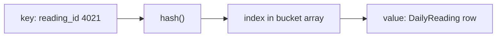
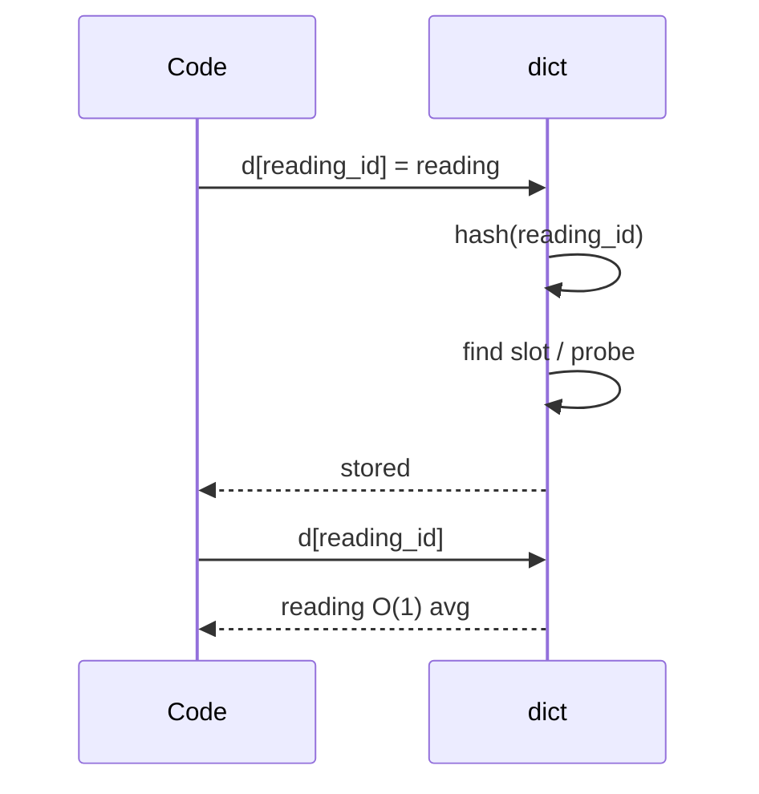
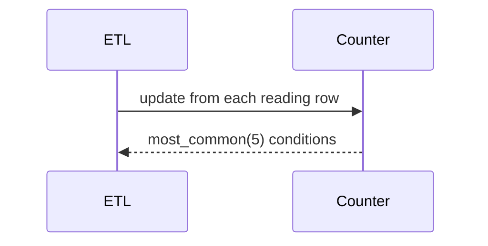
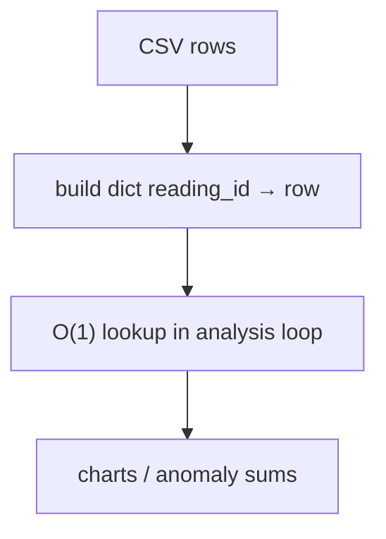

# Hash table

A **key → value** map implemented by hashing keys into **bucket indices**, with a **collision policy** when two keys land in the same slot. Average-case lookup, insert, and delete are **O(1)**; Python's `dict` and `set` are highly optimized hash tables in C.

| | |
| --- | --- |
| **What it is** | `hash(key) % buckets` picks a slot; collisions resolved by open addressing or chaining (CPython dict uses open addressing). |
| **Core operations** | `get`, `set`, `delete`, membership; iteration over keys (insertion-ordered in dict 3.7+). |
| **When to use** | Reading lookups by `reading_id`, station metadata, counting conditions, caches, deduplication, grouping. |
| **Trade-off** | Keys must be hashable; worst-case O(n) if all keys collide; no cheap "sorted by key" without extra structure. |

In **daily weather data analysis**, hash tables are the **default index layer**: map **`reading_id` → row dict**, **`station_id` → name**, climate-zone abbreviations, monthly **`Counter`** of conditions, and **`defaultdict`** aggregations. You rarely implement a hash table from scratch in production—you **use `dict` / `set` / `Counter` / `defaultdict`** and understand collisions, load factor, and hashability so debug sessions make sense.

This page is your **ready reference**: Python built-ins, a teaching implementation, collision concepts, every common operation with weather examples, and **time and space complexity**. For Big-O notation, see [Complexity analysis](../../complexity/index.md).

[Parent: Data structures](../index.md)

---

## Hash table vs list vs tree

| | **`dict` / `set`** | **`list` scan** | **BST / `sorted`** |
| --- | --- | --- | --- |
| **Find by key** | O(1) average | O(n) | O(log n) |
| **Insert** | O(1) average | O(1) append; find O(n) | O(log n) |
| **Ordered by key** | Insertion order only (dict) | Index order | Sorted order |
| **Weather** | `readings[reading_id]` | scan all readings | seasonal leaders tree |



Throughout this page, **n** is the number of entries; **m** is bucket count (implementation detail in CPython).

---

## Daily weather analysis: what a hash table models

| Weather idea | Map type | Example key |
| --- | --- | --- |
| **Reading by id** | `dict[int, DailyReading]` | `reading_id` |
| **Station name by id** | `dict[str, str]` | `"SEA-01"` |
| **Station meta / elevation** | `dict[str, dict]` | `"DEN"` |
| **Unique stations seen** | `set[str]` | `station_id` |
| **Count days by condition** | `Counter[str]` | `"partly cloudy"` |
| **Anomaly sum per station** | `defaultdict(float)` | `station_id` |

```python
from collections import Counter, defaultdict
from dataclasses import dataclass


@dataclass(frozen=True)
class DailyReading:
    reading_id: int
    month: int
    station_id: str
    temp_anomaly: float
    summary: str


@dataclass(frozen=True)
class Station:
    station_id: str
    name: str
    climate_zone: str
```

---

## Mental model: hash, bucket, collision

1. **`hash(key)`** → integer (must be stable for lifetime of key in table).
2. **Bucket index** = `hash % m` (conceptually).
3. **Collision** — two keys want the same bucket; probe other slots or chain a list.



| Concept | Meaning | Weather impact |
| --- | --- | --- |
| **Hashable key** | Immutable or defines `__hash__` | Use `int`, `str`, `tuple` of immutables |
| **Load factor** | n/m; resize when too full | CPython resizes dict automatically |
| **Collision** | Same bucket | Still O(1) average with good hash |

---

## Ways to create a hash table in Python

### 1. Empty `dict`

```python
readings_by_id: dict[int, DailyReading] = {}
```

| | |
| --- | --- |
| **Time** | O(1) |
| **Space** | O(1) empty overhead |

### 2. Dict literal / comprehension

```python
station_abbr = {"SEA": "Seattle", "DEN": "Denver", "PHX": "Phoenix"}

readings = {
    r.reading_id: r
    for r in load_readings_from_csv("january.csv")
}
```

| | |
| --- | --- |
| **Time** | O(n) for n readings |
| **Space** | O(n) |

### 3. `dict()` constructor

```python
d = dict([("SEA", 3), ("DEN", 2)])
d2 = dict(zip(station_ids, station_names))
```

| | |
| --- | --- |
| **Time** | O(n) |
| **Space** | O(n) |

### 4. Empty `set`

```python
seen_stations: set[str] = set()
```

| | |
| --- | --- |
| **Time** | O(1) |
| **Space** | O(1) |

### 5. `defaultdict` — missing keys get default

```python
anomaly_by_station: defaultdict[float] = defaultdict(float)
anomaly_by_station["SEA-01"] += 1.2
```

| | |
| --- | --- |
| **Time** | O(1) average per update |
| **Space** | O(keys) |

### 6. `Counter` — multiset counts

```python
condition_counts = Counter(["rain", "rain", "snow", "clear", "rain"])
assert condition_counts["rain"] == 3
```

| | |
| --- | --- |
| **Time** | O(k) build for k labels |
| **Space** | O(unique) |

### 7. Build index from list of rows (manual)

```python
def index_readings(rows: list[dict]) -> dict[int, dict]:
    return {row["reading_id"]: row for row in rows}
```

| | |
| --- | --- |
| **Time** | O(n) |
| **Space** | O(n) |

### 8. Teaching: `SeparateChainingHashTable`

See [Reference implementation](#reference-implementation-separatechaininghashtable) below.


---

## Hashability rules (Python)

| Hashable | Not hashable (default) |
| --- | --- |
| `int`, `float`, `str`, `bytes` | `list`, `dict`, `set` |
| `tuple` of hashables | mutable custom objects unless `__hash__` defined |
| `frozenset` | `bytearray` |

**Weather:** Use `reading_id: int` or `(station_id, reading_id)` tuple as key—not a mutable row `dict` as key.

```python
key = (row["station_id"], row["reading_id"])
index[key] = row
```

---

## Collisions (conceptual)

**Separate chaining:** each bucket is a list of `(key, value)` pairs.

**Open addressing:** on collision, probe `i+1`, `i+2`, … (CPython dict uses a variant).

```python
def toy_hash(key: str, m: int) -> int:
    return sum(ord(c) for c in key) % m
```

| Case | Time |
| --- | --- |
| Average insert/lookup | O(1) |
| Worst all collide | O(n) |

You will not tune CPython's table in weather ETL; trust `dict` unless profiling shows pathological keys.

---

## Reference implementation: `SeparateChainingHashTable`

Simplified teaching class (not production).

```python
from __future__ import annotations

from typing import Any, Hashable, Iterator


class SeparateChainingHashTable:
    def __init__(self, capacity: int = 8) -> None:
        self._capacity = max(4, capacity)
        self._buckets: list[list[tuple[Hashable, Any]]] = [[] for _ in range(self._capacity)]
        self._size = 0

    def _index(self, key: Hashable) -> int:
        return hash(key) % self._capacity

    def __len__(self) -> int:
        return self._size

    def __contains__(self, key: Hashable) -> bool:
        return self.get(key, _missing := object()) is not _missing

    def get(self, key: Hashable, default: Any = None) -> Any:
        bucket = self._buckets[self._index(key)]
        for k, v in bucket:
            if k == key:
                return v
        return default

    def set(self, key: Hashable, value: Any) -> None:
        i = self._index(key)
        bucket = self._buckets[i]
        for j, (k, _) in enumerate(bucket):
            if k == key:
                bucket[j] = (key, value)
                return
        bucket.append((key, value))
        self._size += 1
        if self._size > self._capacity * 2:
            self._resize(self._capacity * 2)

    def delete(self, key: Hashable) -> bool:
        i = self._index(key)
        bucket = self._buckets[i]
        for j, (k, _) in enumerate(bucket):
            if k == key:
                bucket.pop(j)
                self._size -= 1
                return True
        return False

    def keys(self) -> Iterator[Hashable]:
        for bucket in self._buckets:
            for k, _ in bucket:
                yield k

    def _resize(self, new_cap: int) -> None:
        old_items = [(k, v) for b in self._buckets for k, v in b]
        self._capacity = new_cap
        self._buckets = [[] for _ in range(self._capacity)]
        self._size = 0
        for k, v in old_items:
            self.set(k, v)
```

| Operation | Average | Worst |
| --- | --- | --- |
| `get` / `set` / `delete` | O(1) | O(n) |
| `_resize` | O(n) | O(n) |

---

## `dict` operations (with weather examples and complexity)

### `d[key] = value` / `setdefault`

```python
readings: dict[int, DailyReading] = {}
readings[4021] = DailyReading(4021, 1, "SEA-01", 0.5, "partly cloudy")

meta = readings.setdefault(4021, default_reading)
```

| | |
| --- | --- |
| **Time** | O(1) average |
| **Space** | O(1) auxiliary |

---

### `d[key]` / `get`

```python
r = readings[4021]
r2 = readings.get(9999)
r3 = readings.get(9999, default_reading)
```

| | |
| --- | --- |
| **Time** | O(1) average |
| **Space** | O(1) |

---

### `del d[key]` / `pop`

```python
del readings[4021]
removed = readings.pop(4022, None)
```

| | |
| --- | --- |
| **Time** | O(1) average |
| **Space** | O(1) |

---

### `key in d` / `len(d)`

```python
if 4021 in readings:
    ...
```

| | |
| --- | --- |
| **Time** | O(1) average |
| **Space** | O(1) |

---

### Iteration: `keys`, `values`, `items`

```python
for reading_id, reading in readings.items():
    total_anomaly += reading.temp_anomaly
```

| | |
| --- | --- |
| **Time** | O(n) full scan |
| **Space** | O(1) iterator |

**Weather:** Full scan is fine for **one month's readings**; for multi-year scale use **pandas** vectorization, not Python loops over giant dicts if avoidable.

---

### `update`, merge `|` (3.9+)

```python
readings.update({5001: reading_a, 5002: reading_b})
merged = readings_a | readings_b
```

| | |
| --- | --- |
| **Time** | O(k) for k new keys |
| **Space** | O(k) |

---

### `dict comprehension` — rebuild index

```python
sea_only = {rid: r for rid, r in readings.items() if r.station_id == "SEA-01"}
```

| | |
| --- | --- |
| **Time** | O(n) |
| **Space** | O(output) |

---

## `set` operations

```python
seen: set[str] = set()
seen.add("SEA-01")
if "DEN-02" in seen:
    ...
union = seen | other
```

| Operation | Average time |
| --- | --- |
| `add` / `remove` / `in` | O(1) |
| `union` / `intersection` | O(len) |

**Weather:** Unique stations that reported precipitation in a month.

---

## `Counter` and `defaultdict` patterns

### Condition frequency

```python
conditions = Counter(row["summary"] for row in reading_rows)
top3 = conditions.most_common(3)
```

| | |
| --- | --- |
| **Time** | O(n) over rows |
| **Space** | O(unique conditions) |

### Anomaly by station without KeyError

```python
station_anomaly: defaultdict[float] = defaultdict(float)
for reading in readings.values():
    station_anomaly[reading.station_id] += reading.temp_anomaly
```

| | |
| --- | --- |
| **Time** | O(n) |
| **Space** | O(stations) |

### `Counter` arithmetic

```python
january = Counter({"rain": 20, "clear": 30})
february = Counter({"rain": 18, "clear": 35})
diff = january - february
```

| | |
| --- | --- |
| **Time** | O(keys) |
| **Space** | O(keys) |



---

## Building weather indexes from CSV

```python
import csv

def load_reading_index(path: str) -> dict[int, dict]:
    index: dict[int, dict] = {}
    with open(path, newline="") as f:
        for row in csv.DictReader(f):
            rid = int(row["reading_id"])
            index[rid] = row
    return index

row = index[4021]
```

| Phase | Time |
| --- | --- |
| Build index | O(n) |
| Per lookup | O(1) average |

---

## Master complexity table

| Operation | `dict`/`set` avg | Worst | Notes |
| --- | --- | --- | --- |
| `__getitem__` / `__setitem__` | O(1) | O(n) | rare bad hashes |
| `in` | O(1) | O(n) | |
| `del` | O(1) | O(n) | |
| iterate all | O(n) | O(n) | |
| build from n rows | O(n) | O(n) | |
| `Counter` update | O(1) per | O(n) worst | |
| resize (internal) | O(n) | O(n) | amortized |

**Space:** Θ(n) entries plus table overhead.

---

## Python stdlib: what to use

| Need | Type |
| --- | --- |
| Key → value | `dict` |
| Unique keys | `set` |
| Counting | `Counter` |
| Group then aggregate | `defaultdict(list)` + append |
| Ordered by sorted key | `sorted(d)` keys or BST — not hash |
| Disk-scale archive | **pandas** + index, or parquet |

```python
import pandas as pd

observations = pd.read_parquet("readings.parquet")
observations.set_index("reading_id", inplace=True)
row = observations.loc[4021]
```

---

## When dict vs list vs database


| Pitfall | Fix |
| --- | --- |
| Mutable dict as key | Use tuple of ids |
| Assuming sorted keys | `sorted(d)` explicitly |
| Giant dict in tight loop | Vectorize with numpy/pandas |
| `defaultdict` memory | `dict.get` if sparse |
| Rebuilding index every row | Build once per file load |

---

## `frozenset` — hashable set keys

Use when you need a **set as dict key** (e.g. grouping station clusters):

```python
cluster = frozenset({"SEA-01", "SEA-02", "SEA-03"})
cluster_anomaly: dict[frozenset[str], float] = {}
cluster_anomaly[cluster] = 12.4
```

| | |
| --- | --- |
| **Time** | O(1) average lookup |
| **Space** | O(n) for frozenset of n station ids |

---

## `functools.lru_cache` — memoize expensive weather queries

Hash table caches **function arguments** → return values:

```python
from functools import lru_cache

@lru_cache(maxsize=4096)
def anomaly_for_station_year(station_id: str, year: int) -> float:
    return load_and_sum(station_id, year)
```

| | |
| --- | --- |
| **Time** | O(1) on cache hit |
| **Space** | O(maxsize) entries |

Keys must be **hashable**—use `str`, `int`, not mutable `dict`.

---

## `defaultdict(list)` — group readings by month

```python
by_month: defaultdict[list[dict]] = defaultdict(list)
for row in reading_rows:
    by_month[row["month"]].append(row)
```

| | |
| --- | --- |
| **Time** | O(n) build |
| **Space** | O(n) rows stored |

Same pattern as `pandas.groupby` on a smaller scale in pure Python.

---

## `dict` methods reference (extended)

| Method | Time avg | Weather example |
| --- | --- | --- |
| `keys()` | O(1) view | iterate reading ids |
| `values()` | O(1) view | all DailyReading objects |
| `items()` | O(1) view | id + reading pairs |
| `get(k, default)` | O(1) | safe lookup missing reading |
| `setdefault(k, v)` | O(1) | init station bucket |
| `pop(k)` | O(1) | remove stale cache |
| `popitem()` | O(1) | LIFO eviction policy |
| `clear()` | O(1) | reset month cache |
| `copy()` | O(n) | shallow fork index |
| `fromkeys(keys, v)` | O(n) | init all stations to 0 |
| `dict \| dict` (3.9+) | O(n) | merge indexes |



---

## Open addressing vs chaining (teaching)

| Policy | Idea | Python |
| --- | --- | --- |
| **Separate chaining** | Bucket → list of pairs | Teaching `SeparateChainingHashTable` |
| **Open addressing** | Probe on collision | CPython `dict` (perturbed probing) |

You cannot switch CPython's policy; understanding collisions explains rare worst-case slowdowns when many keys share hash patterns.

---

## Custom `@dataclass(frozen=True)` as dict key

```python
@dataclass(frozen=True)
class ReadingKey:
    station_id: str
    reading_id: int

index: dict[ReadingKey, DailyReading] = {}
index[ReadingKey("SEA-01", 4021)] = reading
```

| | |
| --- | --- |
| **Time** | O(1) average |
| **Space** | O(1) per key object |

Frozen dataclasses generate `__hash__` automatically when `eq=True`.

---

## `Counter` — advanced weather stats

```python
from collections import Counter

month_condition = Counter(
    (row["month"], row["summary"])
    for row in reading_rows
)

anomaly_weights = Counter()
for row in reading_rows:
    anomaly_weights[row["summary"]] += float(row["temp_anomaly"])
```

| Operation | Time |
| --- | --- |
| `update` | O(k) |
| `most_common(n)` | O(n log n) or O(n) depending on size |
| `elements()` | O(total count) |

---

## When pandas replaces dict

| n (rows) | Recommendation |
| --- | --- |
| < 10⁴ in memory script | `dict` index fine |
| 10⁵–10⁶ archive | `DataFrame` + `set_index` |
| Repeated SQL filters | database with B-tree index |

```python
month_readings = {int(r["reading_id"]): r for r in rows}

import pandas as pd
archive = pd.read_parquet("readings.parquet")
reading = archive.loc[4021]
```

---

## Set algebra for station logic

```python
pacific_stations = {"SEA-01", "SEA-02", "PDX-01"}
mountain_stations = {"SEA-02", "DEN-01", "DEN-02"}

both_regions = pacific_stations & mountain_stations
either = pacific_stations | mountain_stations
pacific_only = pacific_stations - mountain_stations
symmetric = pacific_stations ^ mountain_stations
```

| Operation | Time avg |
| --- | --- |
| `&` `\|` `-` `^` | O(len(smaller)) roughly |

**Weather:** Stations that appear in multiple climate-zone groupings, or unique to one region.

---

## Inverting index: station → list of reading_ids

```python
station_readings: defaultdict[list[int]] = defaultdict(list)
for rid, reading in readings_by_id.items():
    station_readings[reading.station_id].append(rid)
```

| Build | Lookup readings for station |
| --- | --- |
| O(n) | O(1) get list + O(k) scan k readings |

Pair with [Tries](../tries/index.md) when the UI searches **station names**; use **dict** when the key is already `station_id`.

---

## Load factor and resize (intuition)

When a CPython `dict` grows past ~2/3 full, it **resizes** to a larger table—occasional O(n) rehash, **amortized O(1)** insert. You see a one-time hitch when a dict jumps from thousands to millions of reading keys; pre-size with comprehension from known CSV row count if profiling shows resize spikes.

```python
n_readings = 365
readings_by_id = {int(r["reading_id"]): r for r in rows}
```

---

## Related structures in this guide

| Structure | Link |
| --- | --- |
| [Sets](../sets/index.md) | Set ADT focus |
| [Tries](../tries/index.md) | Prefix keys, not hash |
| [Binary search tree](../binary-search-tree/index.md) | Ordered map O(log n) |
| [Array-based lists](../array-based-lists/index.md) | Sequential storage |

---

## Quick reference card

```python
from collections import Counter, defaultdict

readings: dict[int, DailyReading] = {r.reading_id: r for r in load()}
r = readings[4021]

seen: set[str] = set()
seen.add(station_id)

cnt = Counter(row["summary"] for row in rows)

station_anomaly: defaultdict[float] = defaultdict(float)
station_anomaly[station_id] += temp_anomaly
```

Use **`dict` / `set` / `Counter` / `defaultdict`** for virtually all weather hash-table needs in Python. Implement chaining only to **learn** collisions; ship production code with **`dict`** and **pandas indexes**.

**Weather pipeline checklist**

1. **Load once** — Build `reading_id → row` map per month or archive file.
2. **Keys** — `int`, `str`, `(station_id, reading_id)` tuples.
3. **Counts** — `Counter` on categorical columns (summary, condition).
4. **Aggregates** — `defaultdict` or `groupby` for anomaly sums.
5. **Scale** — Move heavy loops to pandas when n > ~10⁵ in pure Python.
