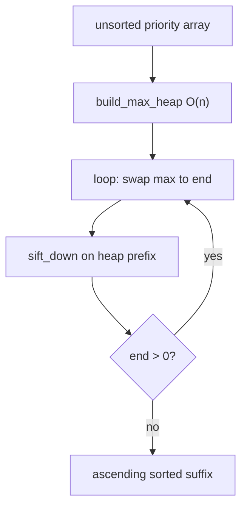
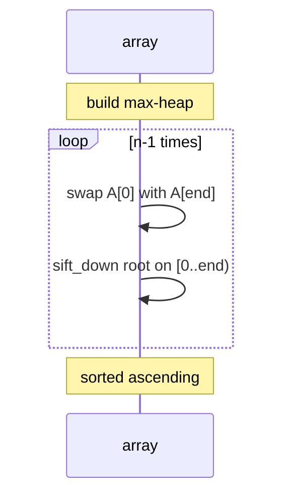
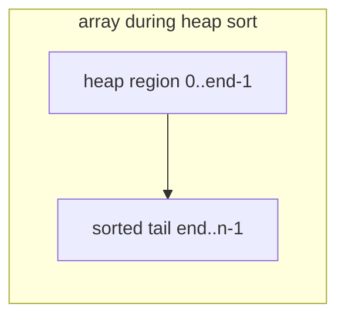
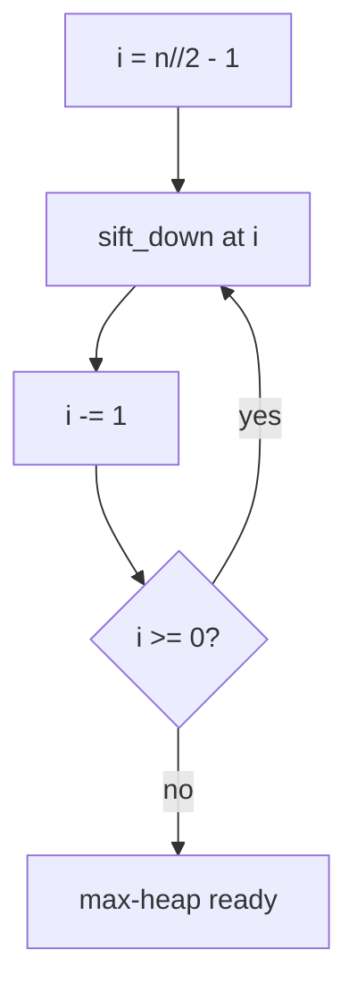
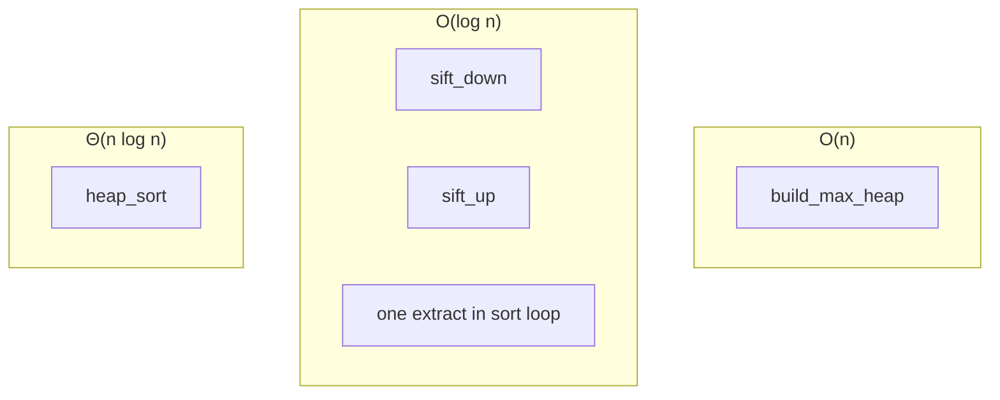
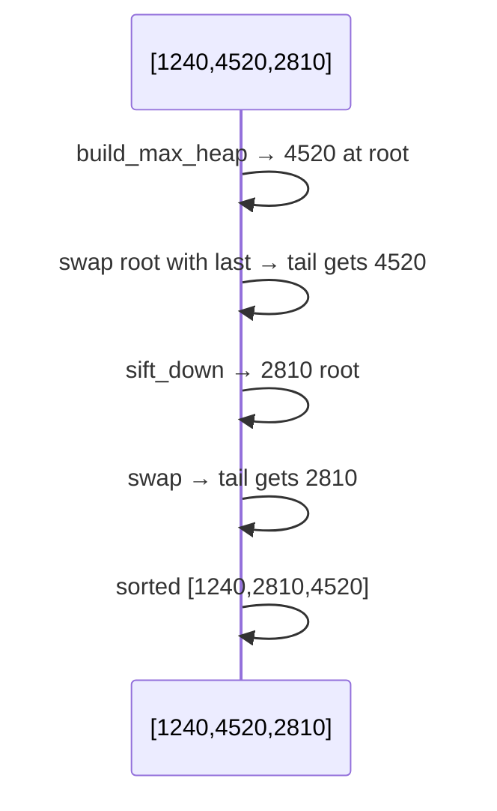

# Heap sort

A **comparison sort** that treats the input array as a **binary max-heap**, then repeatedly **extracts the maximum** to the end of the array and **sifts down** the reduced heap. It runs in **Θ(n log n)** worst case with **O(1)** extra space beyond the array.

| | |
| --- | --- |
| **What it is** | `build_max_heap` in O(n), then (n−1) × (swap root with end + `sift_down`). |
| **Core operations** | `sift_up`, `sift_down`, `heapify`, extract-max loop—same machinery as [Max heap](../max-heap/index.md). |
| **When to use** | Guaranteed in-place O(n log n), teaching heap property, embedded memory limits. |
| **Trade-off** | **Not stable**—equal priority values may reorder; constants slower than Timsort in Python. |

Heap sort is the **batch ranking** view of a [priority queue](../priority-queue/index.md): imagine a **max-heap of pending jobs by priority**—each step moves the highest priority to the “sorted so far” suffix at the array tail until every item is ordered. For **“top 5 only”**, use **`heapq.nlargest`** instead of sorting the full batch. For **large datasets in production**, use **`list.sort`** or **`sorted`**.

This page is your **ready reference**: heap layout in an array, full Python heap-sort and heap helpers, every phase with scheduler examples, complexity tables, and links to the algorithm-focused companion page. For Big-O notation, see [Complexity analysis](../../complexity/index.md).

**Algorithm walkthrough (sorting focus):** [Heap sort (algorithms)](../../algorithms/heap-sort/index.md) — same sort, less structure detail.

[Parent: Data structures](../index.md)

---

## How heap sort fits systems work

| Use case | Heap sort view | Note |
| --- | --- | --- |
| **Rank all jobs by priority** | Ascending sort via max-heap extract | Full order, not just top-k |
| **Sort event deadlines in-place** | Mutate list on embedded device | O(1) extra space |
| **Worst-case guarantee** | Θ(n log n) unlike quicksort | Predictable for adversarial inputs |
| **Teaching heaps + sort together** | Same `sift_down` as [Max heap](../max-heap/index.md) | One mental model |

**Use `list.sort` / `sorted`** in production code. **Use heap sort** to learn **in-place** guaranteed O(n log n) and to connect **heap ADT** → **sorted output**.



Throughout this page, **n** is array length.

---

## Heap sort vs merge sort vs quicksort vs `list.sort`

| | **Heap sort** | [Merge sort](../../algorithms/merge-sort/index.md) | [Quicksort](../../algorithms/quicksort/index.md) | **`list.sort`** |
| --- | --- | --- | --- | --- |
| **Worst time** | Θ(n log n) | Θ(n log n) | Θ(n²) | Θ(n log n) |
| **Extra space** | O(1) | O(n) | O(log n) stack | O(n) worst |
| **Stable** | No | Yes | No | Yes (Timsort) |
| **In-place** | Yes | No | Yes | Yes |
| **Typical Python choice** | Teach / embed | Big merges | Rare in Python | **Use this** |



---

## Mental model: array as heap during sort

During sorting, split the array mentally:

- **`[0 .. heap_end)`** — max-heap region (unsorted prefix).
- **`[heap_end .. n)`** — sorted ascending tail (extracted maxima).

Initially `heap_end = n`. Each iteration decrements `heap_end` after placing next largest at `heap_end`.

| Index | Role during sort |
| --- | --- |
| `0` | Current max of unsorted prefix |
| `heap_end - 1` | Last heap slot before extract |
| `n - 1` | Final position of global max |

Parent/child formulas match [Max heap](../max-heap/index.md): parent `(i-1)//2`, left `2*i+1`, right `2*i+2`.



---

## Example data types

```python
from dataclasses import dataclass


@dataclass
class Task:
 task_id: int
 priority: float
 label: str


@dataclass
class TimedEvent:
 name: str
 deadline_ms: int
 label: str
```

---

## Ways to run heap sort

### 1. In-place on `list` of floats — canonical

```python
deadlines = [1240, 4520, 2810, 560, 3100]
heap_sort(deadlines)
# [5.6, 12.4, 28.1, 31.0, 45.2]
```

| | |
| --- | --- |
| **Time** | Θ(n log n) |
| **Space** | O(1) |

### 2. Non-destructive copy

```python
sorted_deadlines = heap_sort_copy([4520, 1240, 2810])
```

| | |
| --- | --- |
| **Time** | Θ(n log n) |
| **Space** | O(n) copy |

### 3. Sort tasks by key via index heap

Avoid moving fat objects—heap indices, permute at end (see full implementation).

| | |
| --- | --- |
| **Time** | Θ(n log n) |
| **Space** | O(n) index array |

### 4. `heapq` equivalent (min-heap drain)

```python
import heapq

def heap_sort_via_heapq(nums):
 h = nums[:]
 heapq.heapify(h)
 return [heapq.heappop(h) for _ in range(len(h))]
```

| | |
| --- | --- |
| **Time** | O(n log n) |
| **Space** | O(n) output list |

Produces **ascending** order (min-heap). Max-heap sort moves max to **end** in-place—same final order, different mechanics.

### 5. Build heap only — partial structure

```python
build_max_heap(priorities)
```

| | |
| --- | --- |
| **Time** | O(n) |
| **Space** | O(1) |

Useful when you only need **next max** once ([Priority queue](../priority-queue/index.md)).


---

## Reference implementation: heap helpers + sort

```python
from dataclasses import dataclass


def sift_down(nums, i, heap_size):
 while True:
 largest = i
 left = 2 * i + 1
 right = 2 * i + 2
 if left < heap_size and nums[left] > nums[largest]:
 largest = left
 if right < heap_size and nums[right] > nums[largest]:
 largest = right
 if largest == i:
 break
 nums[i], nums[largest] = nums[largest], nums[i]
 i = largest


def sift_up(nums, i):
 while i > 0:
 p = (i - 1) // 2
 if nums[p] >= nums[i]:
 break
 nums[p], nums[i] = nums[i], nums[p]
 i = p


def build_max_heap(nums):
 n = len(nums)
 for i in range(n // 2 - 1, -1, -1):
 sift_down(nums, i, n)


def heap_push(nums, key):
 nums.append(key)
 sift_up(nums, len(nums) - 1)


def heap_pop_max(nums):
 if not nums:
 raise IndexError("pop from empty heap")
 root = nums[0]
 last = nums.pop()
 if nums:
 nums[0] = last
 sift_down(nums, 0, len(nums))
 return root


def heap_sort(nums):
 build_max_heap(nums)
 for end in range(len(nums) - 1, 0, -1):
 nums[0], nums[end] = nums[end], nums[0]
 sift_down(nums, 0, end)


def heap_sort_copy(nums):
 arr = nums[:]
 heap_sort(arr)
 return arr


def heap_sort_key(items, *, key):
 n = len(items)
 idx = list(range(n))

 def sift_idx(i, size):
 while True:
 largest = i
 l, r = 2 * i + 1, 2 * i + 2
 if l < size and key(items[idx[l]]) > key(items[idx[largest]]):
 largest = l
 if r < size and key(items[idx[r]]) > key(items[idx[largest]]):
 largest = r
 if largest == i:
 break
 idx[i], idx[largest] = idx[largest], idx[i]
 i = largest

 for i in range(n // 2 - 1, -1, -1):
 sift_idx(i, n)
 for end in range(n - 1, 0, -1):
 idx[0], idx[end] = idx[end], idx[0]
 sift_idx(0, end)
 items[:] = [items[i] for i in idx]


@dataclass
class TimedEvent:
 name: str
 deadline_ms: int


def heap_sort_events(events):
 heap_sort_key(events, key=lambda e: e.deadline_ms)
```

| | |
| --- | --- |
| **Time** | Θ(n log n) all cases |
| **Space** | O(1) for float sort; O(n) index array for key sort |

---

## Phase 1: `build_max_heap` — O(n)

Floyd: sift-down from last parent `⌊n/2⌋ − 1` down to `0`.

```python
priorities = [4, -12, 8, 1, 9]
build_max_heap(priorities)
# heap property restored; e.g. max 9 at index 0 (exact layout varies)
```

| | |
| --- | --- |
| **Time** | O(n) |
| **Space** | O(1) |



**Why not O(n log n)?** Most nodes are shallow; aggregate sift work is linear.

---

## Phase 2: extract-max loop — (n−1) × O(log n)

```python
def trace_heap_sort(nums):
 build_max_heap(nums)
 snapshots = [nums[:]]
 for end in range(len(nums) - 1, 0, -1):
 nums[0], nums[end] = nums[end], nums[0]
 sift_down(nums, 0, end)
 snapshots.append(nums[:])
 return snapshots
```

| | |
| --- | --- |
| **Time** | Θ(n log n) total |
| **Space** | O(1) per step |

Each swap places **current max** at position `end`; heap shrinks to `[0, end)`.

---

## All operations / phases (with examples and complexity)



### `sift_down(A, i, heap_size)`

Repair max-heap after root becomes smaller (extract step) or during `heapify`.

```python
arr = [1, 3, 2, 7, 5, 4]
sift_down(arr, 0, len(arr))
```

| | |
| --- | --- |
| **Time** | O(log n) |
| **Space** | O(1) |

---

### `sift_up(A, i)`

Used in online heap insert; heap sort build uses sift-down only.

| | |
| --- | --- |
| **Time** | O(log n) |
| **Space** | O(1) |

---

### `build_max_heap(A)`

| | |
| --- | --- |
| **Time** | O(n) |
| **Space** | O(1) |

---

### `heap_sort(A)` — full ascending sort

```python
job_priorities = [12, 44, 31, 8, 55]
heap_sort(job_priorities)
# [8, 12, 31, 44, 55]
```

| | |
| --- | --- |
| **Time** | Θ(n log n) best, average, worst |
| **Space** | O(1) |

**Scheduler use:** Sort a batch of job priorities before dispatch—small *n*, any sort works; heap sort teaches **in-place guarantee**.

---

### `heap_sort_key(events, key=deadline_ms)`

| | |
| --- | --- |
| **Time** | Θ(n log n) |
| **Space** | O(n) index list |

---

### `heap_pop_max` / repeated pop — equivalent drain

n pops from a max-heap also cost O(n log n)—same as heap sort without in-place tail placement trick.

| | |
| --- | --- |
| **Time** | O(n log n) total |
| **Space** | O(1) if in-place |

---

## Trace: three deadline values

Input: `[1240, 4520, 2810]`

**After `build_max_heap`:** array might be `[4520, 1240, 2810]` (max 4520 at root).

| step | action | heap prefix | sorted tail |
| ---: | --- | --- | --- |
| 1 | swap 4520 ↔ 2810, sift | `[2810, 1240]` | `[..., 4520]` |
| 2 | swap 2810 ↔ 1240, sift | `[1240]` | `[1240, 2810, 4520]` |

Final: `[1240, 2810, 4520]` ascending.



---

## Scheduler and timer patterns

### Sort tasks for priority dispatch

```python
def sorted_tasks_by_priority(tasks):
 arr = tasks[:]
 heap_sort_key(arr, key=lambda t: t.priority)
 return arr
```

| | |
| --- | --- |
| **Time** | Θ(n log n) |
| **Space** | O(n) copy if preserving original |

---

### In-place sort on constrained device

```python
timer_deadlines = [1720, 3150, 2400, 1080, 2830]
heap_sort(timer_deadlines)
```

| | |
| --- | --- |
| **Time** | Θ(n log n) |
| **Space** | O(1) |

---

### Top-k only — do **not** full heap sort

```python
import heapq

top5 = heapq.nlargest(5, tasks, key=lambda t: t.priority)
```

| | |
| --- | --- |
| **Time** | O(n log k) |
| **Space** | O(k) |

---

## Stability and equal keys

Heap sort is **not stable**: equal priority values may swap relative order during sift.

| Need stable sort | Use |
| --- | --- |
| Preserve submission order on ties | [Merge sort](../../algorithms/merge-sort/index.md) or `list.sort` |
| Tie-break explicitly | Sort by `(priority, task_id)` tuple key |

```python
tasks.sort(key=lambda t: (t.priority, t.task_id))
```

---

## Master complexity table

| Phase / operation | Time | Space (auxiliary) |
| --- | --- | --- |
| `sift_down` | O(log n) | O(1) |
| `sift_up` | O(log n) | O(1) |
| `build_max_heap` | O(n) | O(1) |
| One extract in sort loop | O(log n) | O(1) |
| **`heap_sort` full** | **Θ(n log n)** | **O(1)** |
| `heap_sort_key` | Θ(n log n) | O(n) indices |
| n × `heap_pop_max` | Θ(n log n) | O(1) |

**Storage:** in-place—Θ(n) array only.

---

## Python stdlib: what to use instead

| Need | API |
| --- | --- |
| General sort | `list.sort`, `sorted` (Timsort) |
| Top-k | `heapq.nlargest`, `heapq.nsmallest` |
| Min-heapify | `heapq.heapify` |
| Object list by key | `list.sort(key=...)` |

```python
events.sort(key=lambda e: e.deadline_ms)
```

---

## When to use / avoid

```mermaid
flowchart TD
 Q([Sort how many?])
 Q --> ALL{Full batch?}
 ALL -->|yes| LSORT["list.sort / sorted"]
 ALL -->|no| K{Top k only?}
 K -->|yes| NL["nlargest"]
 K -->|no| W{Worst-case O(n log n) in-place?}
 W -->|yes| HS["heap sort"]
 W -->|no| LS["list.sort"]
```

| Use heap sort | Avoid heap sort |
| --- | --- |
| Teach heap + guaranteed worst case | Need stable tie order |
| Memory-tight in-place | Large database exports |
| Interview implementation | Production one-liner sorts |

---

## Common pitfalls

| Pitfall | Why it hurts | Fix |
| --- | --- | --- |
| Wrong `heap_size` in sift | Corrupts tail | Pass current `end`, not `n` |
| Min-heap vs max-heap confusion | Sort direction wrong | Max-heap + swap to end → ascending |
| Expecting stability | Tie order changes | Merge sort or tuple key |
| Full sort for top-5 | Wastes O(n log n) | `nlargest` |
| Off-by-one last parent | Skip nodes in heapify | Start at `n//2 - 1` |
| Using heap sort on huge batches | Slow constants | `list.sort` |

---

## Related pages

| Page | Relationship |
| --- | --- |
| [Heap sort (algorithms)](../../algorithms/heap-sort/index.md) | Algorithm-first companion |
| [Max heap](../max-heap/index.md) | Same sift machinery |
| [Priority queue](../priority-queue/index.md) | Repeated extract ADT |
| [Quicksort](../../algorithms/quicksort/index.md) | In-place, Θ(n²) worst |
| [Merge sort](../../algorithms/merge-sort/index.md) | Stable Θ(n log n) |
| [Complexity analysis](../../complexity/index.md) | Big-O reference |

---

## Quick reference card

```python
# in-place ascending
nums = [12.4, 45.2, 28.1, 5.6]
heap_sort(nums)

# non-destructive
sorted_nums = heap_sort_copy(nums)

# objects by key
heap_sort_events(events)

# phases only
build_max_heap(priorities)
heap_pop_max(priorities)

# production
events.sort(key=lambda e: e.deadline_ms)
heapq.nlargest(10, tasks, key=lambda t: t.priority)
```

**Heap sort:** build a **max-heap** in **O(n)**, then **(n−1) extracts** with **sift_down**—**Θ(n log n)** worst case, **O(1)** extra space, **unstable**. Pair with [Max heap](../max-heap/index.md) for structure; see [Heap sort (algorithms)](../../algorithms/heap-sort/index.md) for the sorting narrative.

**Scheduler checklist**

1. **Large batch exports** — `list.sort`, not heap sort.
2. **Top-k highlights** — `heapq.nlargest`.
3. **Learn heaps** — `build_max_heap` then extract loop on this page.
4. **Stable ties** — merge sort or explicit secondary key.
5. **In-place guarantee** — heap sort vs quicksort worst case.
