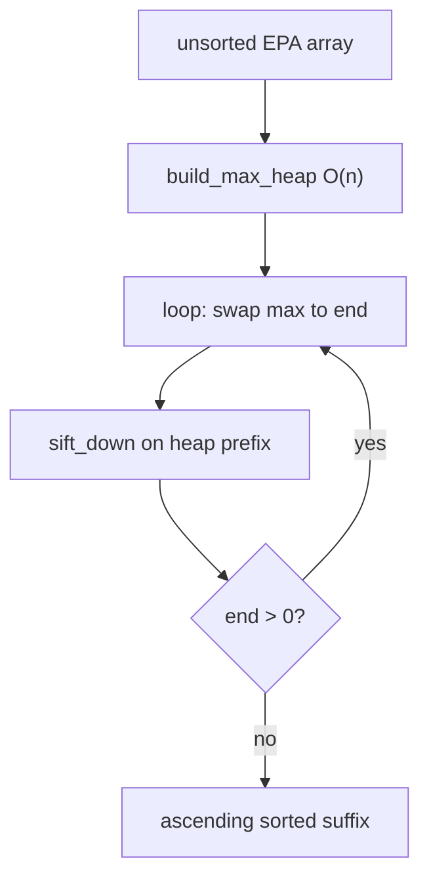
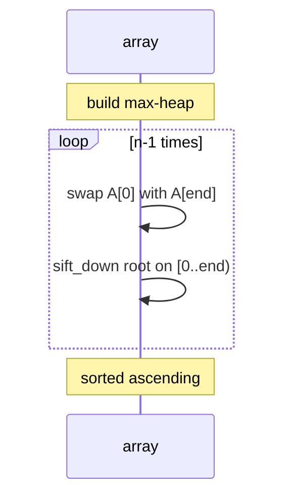
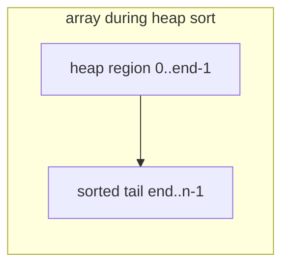
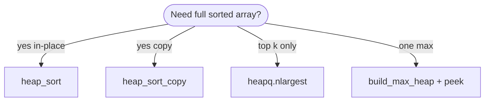
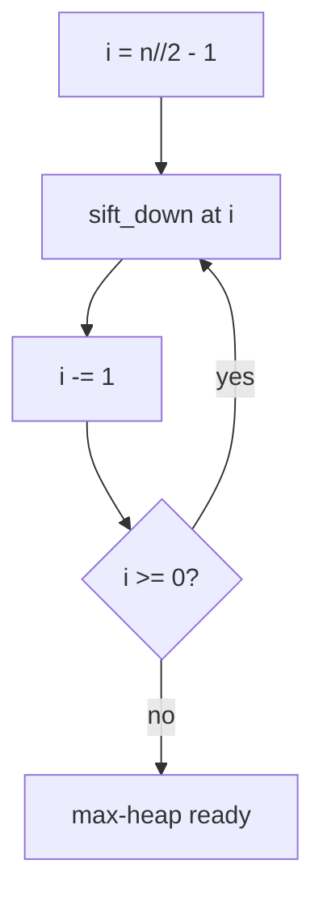
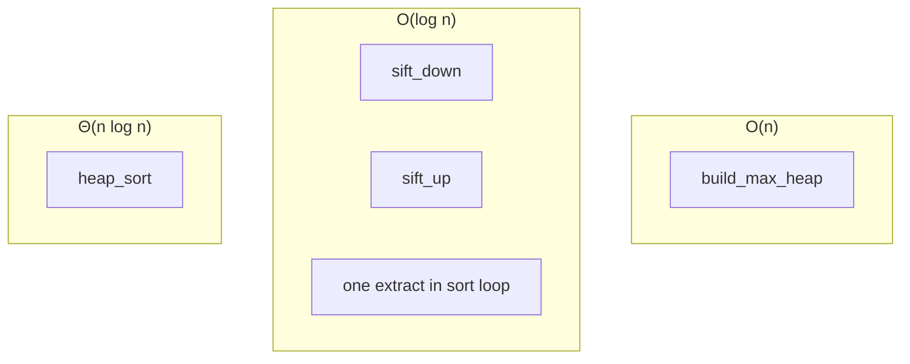
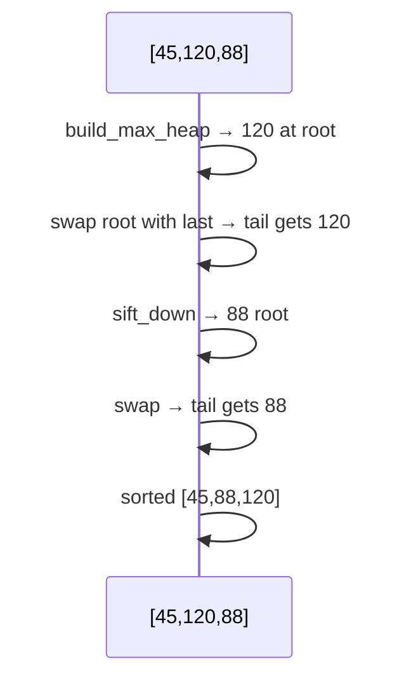

# Heap sort

A **comparison sort** that treats the input array as a **binary max-heap**, then repeatedly **extracts the maximum** to the end of the array and **sifts down** the reduced heap. It runs in **Θ(n log n)** worst case with **O(1)** extra space beyond the array.

| | |
| --- | --- |
| **What it is** | `build_max_heap` in O(n), then (n−1) × (swap root with end + `sift_down`). |
| **Core operations** | `sift_up`, `sift_down`, `heapify`, extract-max loop—same machinery as [Max heap](../max-heap/index.md). |
| **When to use** | Guaranteed in-place O(n log n), teaching heap property, embedded memory limits. |
| **Trade-off** | **Not stable**—equal PPR players may reorder; constants slower than Timsort in Python. |

In **NFL data analysis**, heap sort is the **batch ranking** view of a [priority queue](../priority-queue/index.md): imagine a **max-heap of pending red-zone plays by EPA**—each step moves the best play to the “sorted so far” suffix at the array tail until every snap is ordered. For **“top 5 plays only”**, use **`heapq.nlargest`** instead of sorting the full drive. For **million-row season tables**, use **pandas** `sort_values`.

This page is your **ready reference**: heap layout in an array, full Python heap-sort and heap helpers, every phase with NFL examples, complexity tables, and links to the algorithm-focused companion page. For Big-O notation, see [Complexity analysis](../../complexity/index.md).

**Algorithm walkthrough (sorting focus):** [Heap sort (algorithms)](../../algorithms/heap-sort/index.md) — same sort, less structure detail.

[Parent: Data structures](../index.md)

---

## How heap sort fits NFL-shaped problems

| NFL idea | Heap sort view | Note |
| --- | --- | --- |
| **Rank all drive snaps by EPA** | Ascending sort via max-heap extract | Full order, not just top-k |
| **Sort roster by rush yards in-place** | Mutate list on embedded device | O(1) extra space |
| **Worst-case guarantee** | Θ(n log n) unlike quicksort | Predictable for adversarial inputs |
| **Teaching heaps + sort together** | Same `sift_down` as [Max heap](../max-heap/index.md) | One mental model |

**Use `list.sort` / `sort_values`** in production notebooks. **Use heap sort** to learn **in-place** guaranteed O(n log n) and to connect **heap ADT** → **sorted output**.



Throughout this page, **n** is array length.

---

## Heap sort vs merge sort vs quicksort vs `list.sort`

| | **Heap sort** | [Merge sort](../../algorithms/merge-sort/index.md) | [Quicksort](../../algorithms/quicksort/index.md) | **`list.sort`** |
| --- | --- | --- | --- | --- |
| **Worst time** | Θ(n log n) | Θ(n log n) | Θ(n²) | Θ(n log n) |
| **Extra space** | O(1) | O(n) | O(log n) stack | O(n) worst |
| **Stable** | No | Yes | No | Yes (Timsort) |
| **In-place** | Yes | No | Yes | Yes |
| **NFL default** | Teach / embed | Big merges | Rare in Python | **Use this** |



---

## Mental model: array as heap during sort

During sorting, split the array mentally:

- **`[0 .. heap_end)`** — max-heap region (unsorted prefix).
- **`[heap_end .. n)`** — sorted ascending tail (extracted maxima).

Initially `heap_end = n`. Each iteration decrements `heap_end` after placing next largest at `heap_end`.

| Index | Role during sort |
| --- | --- |
| `0` | Current max of unsorted prefix |
| `heap_end - 1` | Last heap slot before extract |
| `n - 1` | Final position of global max |

Parent/child formulas match [Max heap](../max-heap/index.md): parent `(i-1)//2`, left `2*i+1`, right `2*i+2`.



---

## NFL data types for examples

```python
from __future__ import annotations

from dataclasses import dataclass


@dataclass(frozen=True, slots=True)
class Snap:
    play_id: int
    quarter: int
    epa: float
    description: str


@dataclass(frozen=True, slots=True)
class Player:
    name: str
    rush_yds: int
    team: str
```

---

## Ways to run heap sort

### 1. In-place on `list[float]` — canonical

```python
yards = [45, 120, 88, 22, 95]
heap_sort(yards)
# [22, 45, 88, 95, 120]
```

| | |
| --- | --- |
| **Time** | Θ(n log n) |
| **Space** | O(1) |

### 2. Non-destructive copy

```python
sorted_yards = heap_sort_copy([45, 120, 88])
```

| | |
| --- | --- |
| **Time** | Θ(n log n) |
| **Space** | O(n) copy |

### 3. Sort players by key via index heap

Avoid moving fat objects—heap indices, permute at end (see full implementation).

| | |
| --- | --- |
| **Time** | Θ(n log n) |
| **Space** | O(n) index array |

### 4. `heapq` equivalent (min-heap drain)

```python
import heapq

def heap_sort_via_heapq(nums: list[float]) -> list[float]:
    h = nums[:]
    heapq.heapify(h)
    return [heapq.heappop(h) for _ in range(len(h))]
```

| | |
| --- | --- |
| **Time** | O(n log n) |
| **Space** | O(n) output list |

Produces **ascending** order (min-heap). Max-heap sort moves max to **end** in-place—same final order, different mechanics.

### 5. Build heap only — partial structure

```python
build_max_heap(epas)  # O(n) — not fully sorted yet
```

| | |
| --- | --- |
| **Time** | O(n) |
| **Space** | O(1) |

Useful when you only need **next max** once ([Priority queue](../priority-queue/index.md)).



---

## Reference implementation: heap helpers + sort

```python
from __future__ import annotations

from dataclasses import dataclass
from typing import Callable, TypeVar

T = TypeVar("T")


def sift_down(nums: list[float], i: int, heap_size: int) -> None:
    """Max-heap sift-down on nums[0:heap_size)."""
    while True:
        largest = i
        left = 2 * i + 1
        right = 2 * i + 2
        if left < heap_size and nums[left] > nums[largest]:
            largest = left
        if right < heap_size and nums[right] > nums[largest]:
            largest = right
        if largest == i:
            break
        nums[i], nums[largest] = nums[largest], nums[i]
        i = largest


def sift_up(nums: list[float], i: int) -> None:
    while i > 0:
        p = (i - 1) // 2
        if nums[p] >= nums[i]:
            break
        nums[p], nums[i] = nums[i], nums[p]
        i = p


def build_max_heap(nums: list[float]) -> None:
    n = len(nums)
    for i in range(n // 2 - 1, -1, -1):
        sift_down(nums, i, n)


def heap_push(nums: list[float], key: float) -> None:
    nums.append(key)
    sift_up(nums, len(nums) - 1)


def heap_pop_max(nums: list[float]) -> float:
    if not nums:
        raise IndexError("pop from empty heap")
    root = nums[0]
    last = nums.pop()
    if nums:
        nums[0] = last
        sift_down(nums, 0, len(nums))
    return root


def heap_sort(nums: list[float]) -> None:
    """Sort nums ascending in-place using max-heap."""
    build_max_heap(nums)
    for end in range(len(nums) - 1, 0, -1):
        nums[0], nums[end] = nums[end], nums[0]
        sift_down(nums, 0, end)


def heap_sort_copy(nums: list[float]) -> list[float]:
    arr = nums[:]
    heap_sort(arr)
    return arr


def heap_sort_key(items: list[T], *, key: Callable[[T], float]) -> None:
    """Sort items ascending by key in-place via index heap."""
    n = len(items)
    idx = list(range(n))

    def sift_idx(i: int, size: int) -> None:
        while True:
            largest = i
            l, r = 2 * i + 1, 2 * i + 2
            if l < size and key(items[idx[l]]) > key(items[idx[largest]]):
                largest = l
            if r < size and key(items[idx[r]]) > key(items[idx[largest]]):
                largest = r
            if largest == i:
                break
            idx[i], idx[largest] = idx[largest], idx[i]
            i = largest

    for i in range(n // 2 - 1, -1, -1):
        sift_idx(i, n)
    for end in range(n - 1, 0, -1):
        idx[0], idx[end] = idx[end], idx[0]
        sift_idx(0, end)
    items[:] = [items[i] for i in idx]


@dataclass(frozen=True, slots=True)
class Player:
    name: str
    rush_yds: int


def heap_sort_players(players: list[Player]) -> None:
    heap_sort_key(players, key=lambda p: p.rush_yds)
```

| | |
| --- | --- |
| **Time** | Θ(n log n) all cases |
| **Space** | O(1) for float sort; O(n) index array for key sort |

---

## Phase 1: `build_max_heap` — O(n)

Floyd: sift-down from last parent `⌊n/2⌋ − 1` down to `0`.

```python
epas = [0.4, -1.2, 0.8, 0.1, 0.9]
build_max_heap(epas)
# heap property restored; e.g. max 0.9 at index 0 (exact layout varies)
```

| | |
| --- | --- |
| **Time** | O(n) |
| **Space** | O(1) |



**Why not O(n log n)?** Most nodes are shallow; aggregate sift work is linear.

---

## Phase 2: extract-max loop — (n−1) × O(log n)

```python
def trace_heap_sort(nums: list[float]) -> list[list[float]]:
    build_max_heap(nums)
    snapshots = [nums[:]]
    for end in range(len(nums) - 1, 0, -1):
        nums[0], nums[end] = nums[end], nums[0]
        sift_down(nums, 0, end)
        snapshots.append(nums[:])
    return snapshots
```

| | |
| --- | --- |
| **Time** | Θ(n log n) total |
| **Space** | O(1) per step |

Each swap places **current max** at position `end`; heap shrinks to `[0, end)`.

---

## All operations / phases (with examples and complexity)



### `sift_down(A, i, heap_size)`

Repair max-heap after root becomes smaller (extract step) or during `heapify`.

```python
arr = [1, 3, 2, 7, 5, 4]
sift_down(arr, 0, len(arr))
```

| | |
| --- | --- |
| **Time** | O(log n) |
| **Space** | O(1) |

---

### `sift_up(A, i)`

Used in online heap insert; heap sort build uses sift-down only.

| | |
| --- | --- |
| **Time** | O(log n) |
| **Space** | O(1) |

---

### `build_max_heap(A)`

| | |
| --- | --- |
| **Time** | O(n) |
| **Space** | O(1) |

---

### `heap_sort(A)` — full ascending sort

```python
drive_epas = [0.12, 0.44, 0.31, 0.08, 0.55]
heap_sort(drive_epas)
# [0.08, 0.12, 0.31, 0.44, 0.55]
```

| | |
| --- | --- |
| **Time** | Θ(n log n) best, average, worst |
| **Space** | O(1) |

**NFL:** Sort one drive’s snaps by EPA before charting—small *n*, any sort works; heap sort teaches **in-place guarantee**.

---

### `heap_sort_key(players, key=ppr)`

| | |
| --- | --- |
| **Time** | Θ(n log n) |
| **Space** | O(n) index list |

---

### `heap_pop_max` / repeated pop — equivalent drain

n pops from a max-heap also cost O(n log n)—same as heap sort without in-place tail placement trick.

| | |
| --- | --- |
| **Time** | O(n log n) total |
| **Space** | O(1) if in-place |

---

## Trace: three rush-yard values

Input: `[45, 120, 88]`

**After `build_max_heap`:** array might be `[120, 45, 88]` (max 120 at root).

| step | action | heap prefix | sorted tail |
| ---: | --- | --- | --- |
| 1 | swap 120 ↔ 88, sift | `[88, 45]` | `[..., 120]` |
| 2 | swap 88 ↔ 45, sift | `[45]` | `[45, 88, 120]` |

Final: `[45, 88, 120]` ascending.



---

## NFL patterns

### Sort drive snaps for cumulative EPA chart

```python
def sorted_snaps_by_epa(snaps: list[Snap]) -> list[Snap]:
    arr = snaps[:]
    heap_sort_key(arr, key=lambda s: s.epa)
    return arr
```

| | |
| --- | --- |
| **Time** | Θ(n log n) |
| **Space** | O(n) copy if preserving original |

---

### In-place sort on constrained device

```python
# No extra merge buffer — only O(1) aux beyond array
weekly_points = [17, 31, 24, 10, 28]
heap_sort(weekly_points)
```

| | |
| --- | --- |
| **Time** | Θ(n log n) |
| **Space** | O(1) |

---

### Top-k only — do **not** full heap sort

```python
import heapq

top5 = heapq.nlargest(5, snaps, key=lambda s: s.epa)
```

| | |
| --- | --- |
| **Time** | O(n log k) |
| **Space** | O(k) |

---

## Stability and equal keys

Heap sort is **not stable**: equal PPR values may swap relative order during sift.

| Need stable sort | Use |
| --- | --- |
| Preserve submission order on ties | [Merge sort](../../algorithms/merge-sort/index.md) or `list.sort` |
| Tie-break explicitly | Sort by `(ppr, player_id)` tuple key |

```python
players.sort(key=lambda p: (p.ppr, p.name))  # stable in Python 3
```

---

## Master complexity table

| Phase / operation | Time | Space (auxiliary) |
| --- | --- | --- |
| `sift_down` | O(log n) | O(1) |
| `sift_up` | O(log n) | O(1) |
| `build_max_heap` | O(n) | O(1) |
| One extract in sort loop | O(log n) | O(1) |
| **`heap_sort` full** | **Θ(n log n)** | **O(1)** |
| `heap_sort_key` | Θ(n log n) | O(n) indices |
| n × `heap_pop_max` | Θ(n log n) | O(1) |

**Storage:** in-place—Θ(n) array only.

---

## Python stdlib: what to use instead

| Need | API |
| --- | --- |
| General sort | `list.sort`, `sorted` (Timsort) |
| Top-k | `heapq.nlargest`, `heapq.nsmallest` |
| Min-heapify | `heapq.heapify` |
| DataFrame column | `df.sort_values("epa")` |

```python
import pandas as pd

df.sort_values("rush_yds", ascending=True, inplace=True)
```

---

## When to use / avoid (NFL context)

```mermaid
flowchart TD
  Q([Sort how many?])
  Q --> ALL{Full table?}
  ALL -->|yes| PAND["sort_values"]
  ALL -->|no| K{Top k only?}
  K -->|yes| NL["nlargest"]
  K -->|no| W{Worst-case O(n log n) in-place?}
  W -->|yes| HS["heap sort"]
  W -->|no| LS["list.sort"]
```

| Use heap sort | Avoid heap sort |
| --- | --- |
| Teach heap + guaranteed worst case | Need stable tie order |
| Memory-tight in-place | Large pandas pipelines |
| Interview implementation | Production one-liner sorts |

---

## Common pitfalls

| Pitfall | Why it hurts | Fix |
| --- | --- | --- |
| Wrong `heap_size` in sift | Corrupts tail | Pass current `end`, not `n` |
| Min-heap vs max-heap confusion | Sort direction wrong | Max-heap + swap to end → ascending |
| Expecting stability | Tie order changes | Merge sort or tuple key |
| Full sort for top-5 | Wastes O(n log n) | `nlargest` |
| Off-by-one last parent | Skip nodes in heapify | Start at `n//2 - 1` |
| Using heap sort on huge DataFrame | Slow constants | `sort_values` |

---

## Related pages

| Page | Relationship |
| --- | --- |
| [Heap sort (algorithms)](../../algorithms/heap-sort/index.md) | Algorithm-first companion |
| [Max heap](../max-heap/index.md) | Same sift machinery |
| [Priority queue](../priority-queue/index.md) | Repeated extract ADT |
| [Quicksort](../../algorithms/quicksort/index.md) | In-place, Θ(n²) worst |
| [Merge sort](../../algorithms/merge-sort/index.md) | Stable Θ(n log n) |
| [Complexity analysis](../../complexity/index.md) | Big-O reference |

---

## Quick reference card

```python
# in-place ascending
nums = [45, 120, 88, 22]
heap_sort(nums)

# non-destructive
sorted_nums = heap_sort_copy(nums)

# objects by key
heap_sort_players(roster)

# phases only
build_max_heap(epas)      # O(n) — heap structure
heap_pop_max(epas)        # O(log n) — one max

# production
roster.sort(key=lambda p: p.rush_yds)
heapq.nlargest(10, snaps, key=lambda s: s.epa)
```

**Heap sort:** build a **max-heap** in **O(n)**, then **(n−1) extracts** with **sift_down**—**Θ(n log n)** worst case, **O(1)** extra space, **unstable**. Pair with [Max heap](../max-heap/index.md) for structure; see [Heap sort (algorithms)](../../algorithms/heap-sort/index.md) for the sorting narrative.

**NFL pipeline checklist**

1. **Season tables** — `sort_values`, not heap sort.
2. **Top-k highlights** — `heapq.nlargest`.
3. **Learn heaps** — `build_max_heap` then extract loop on this page.
4. **Stable ties** — merge sort or explicit secondary key.
5. **In-place guarantee** — heap sort vs quicksort worst case.
