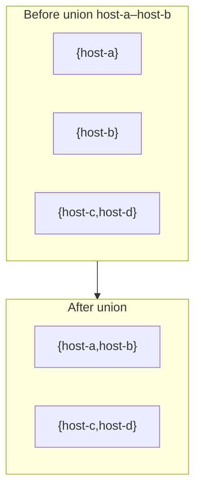
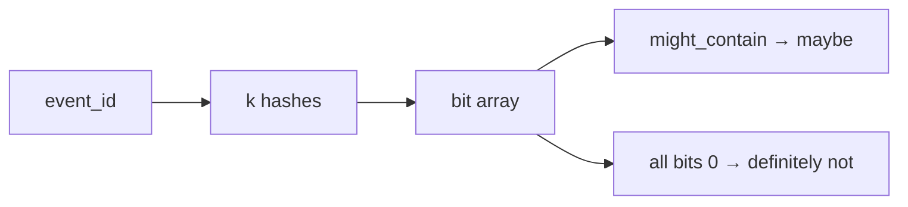
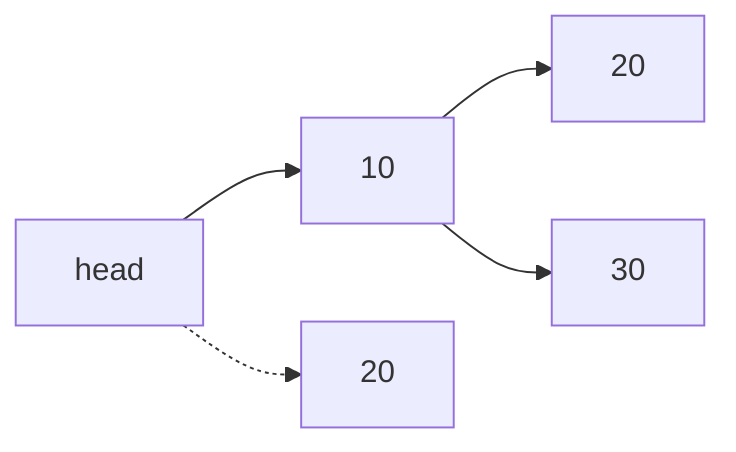
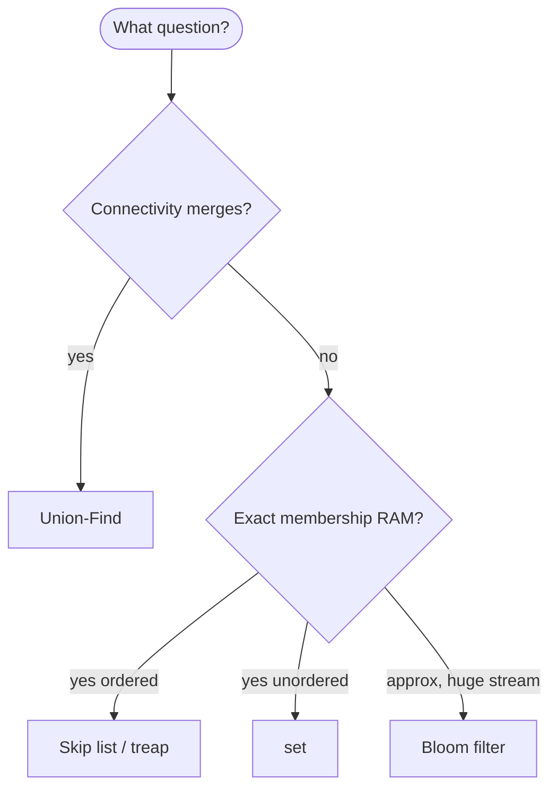

# Honorable mention ADT

Classic **abstract data types** that appear in DSA courses, interviews, and production systems but do not have a dedicated subpage in this guide’s main table. This page collects **mini ready-references**—each with a systems use case, Python code, complexity, and pitfalls.

| | |
| --- | --- |
| **What this page is** | Focused sections on Union-Find, Bloom filters, and skip lists (plus pointers to covered ADTs). |
| **How to use** | Jump to the ADT you need; follow links to full pages where they exist. |
| **Depth** | Comprehensive per section, not a one-line glossary. |

For Big-O notation, see [Complexity analysis](../../complexity/index.md).

[Parent: Data structures](../index.md)

---

## Covered elsewhere in this guide

| ADT | Page |
| --- | --- |
| Deque | [Dequeue (deque)](../dequeue-deque/index.md) |
| Stack / queue | [Stacks](../stacks/index.md), [Queue](../queue/index.md) |
| Multiset (bag) | `collections.Counter` — see [Sets](../sets/index.md) |
| Segment / Fenwick tree | Standard algorithms texts; not expanded here |

---

## Union-Find (disjoint set)

**Union-Find** maintains a partition of elements into **disjoint sets** with near-constant **union** and **find** (with path compression + union by rank).

| | |
| --- | --- |
| **What it is** | Each element has a parent pointer; `find(x)` returns set representative; `union(a,b)` merges sets. |
| **When to use** | Dynamic **connectivity**, Kruskal MST, “same network component?” |
| **Systems fit** | Hosts in the **same connected cluster**; merge peer groupings; detect if two nodes share a routing partition after merges. |

### Application: network connectivity

Vertices = hosts or routers; union nodes when they share a network link (or same cluster tag).

```python
class UnionFind:
 def __init__(self, items: list[str]) -> None:
 self.parent = {x: x for x in items}
 self.rank = {x: 0 for x in items}

 def find(self, x: str) -> str:
 while self.parent[x] != x:
 self.parent[x] = self.parent[self.parent[x]]
 x = self.parent[x]
 return x

 def union(self, a: str, b: str) -> bool:
 ra, rb = self.find(a), self.find(b)
 if ra == rb:
 return False
 if self.rank[ra] < self.rank[rb]:
 ra, rb = rb, ra
 self.parent[rb] = ra
 if self.rank[ra] == self.rank[rb]:
 self.rank[ra] += 1
 return True

 def connected(self, a: str, b: str) -> bool:
 return self.find(a) == self.find(b)


uf = UnionFind(["host-a", "host-b", "host-c", "host-d"])
uf.union("host-a", "host-b")
uf.union("host-c", "host-d")
assert uf.connected("host-a", "host-b")
assert not uf.connected("host-a", "host-d")
```



| Operation | Time (amortized) | Space |
| --- | --- | --- |
| `find` | O(α(n)) inverse Ackermann | O(1) |
| `union` | O(α(n)) | O(1) |
| Build from E edges | O(E α(V)) | O(V) |

**α(n)** is so slow-growing it is effectively a small constant for any realistic network **V ≤ 10³** or large cluster **V ≤ 10⁴**.

### Pitfalls (Union-Find)

| Pitfall | Fix |
| --- | --- |
| Forgetting path compression | Slower finds on deep chains |
| Union without rank/size | Taller trees |
| Using on non-hashable ids without index map | Map string → int first |

### Stdlib note

No `UnionFind` in stdlib; use this ~20-line class or **networkx** connected components on a built graph ([graphs](../graphs/index.md)).

---

## Bloom filter (probabilistic set)

A **Bloom filter** is a **compact** bit array plus **k** hash functions. It supports **insert** and **might contain** with **no false negatives** (if built correctly) but **possible false positives**.

| | |
| --- | --- |
| **What it is** | Approximate set membership in O(k) bit ops; cannot delete without variants. |
| **When to use** | “Probably seen this `event_id` before” with tiny RAM; pre-filter before disk. |
| **Systems fit** | Stream millions of event IDs: skip disk lookup if filter says **definitely not** indexed. |

### Application: event-id prefilter

```python
import hashlib


class BloomFilter:
 def __init__(self, size: int = 1 << 20, num_hashes: int = 7) -> None:
 self.size = size
 self.num_hashes = num_hashes
 self.bits = bytearray((size + 7) // 8)

 def _hashes(self, key: str) -> list[int]:
 digests = []
 for i in range(self.num_hashes):
 h = hashlib.md5(f"{key}:{i}".encode()).hexdigest()
 digests.append(int(h, 16) % self.size)
 return digests

 def add(self, key: str) -> None:
 for idx in self._hashes(key):
 self.bits[idx // 8] |= 1 << (idx % 8)

 def might_contain(self, key: str) -> bool:
 return all(
 self.bits[idx // 8] & (1 << (idx % 8))
 for idx in self._hashes(key)
 )


seen = BloomFilter()
seen.add("event_9001")
if seen.might_contain("event_9001"):
 maybe_load_from_db("event_9001")
if not seen.might_contain("event_9999"):
 pass
```



| Operation | Time | Space |
| --- | --- | --- |
| `add` | O(k) | O(m) bits |
| `might_contain` | O(k) | O(1) extra |
| False positive rate | — | Tune m, k vs expected n |

### Pitfalls (Bloom filter)

| Pitfall | Fix |
| --- | --- |
| Treating “maybe” as “yes” | Confirm with real set/DB |
| Too small m for n | Raise bit array size |
| Need deletion | Counting Bloom or set |
| Using weak hash for production | Use proper k independent hashes |

### Stdlib / ecosystem

No Bloom filter in stdlib; consider **`pybloom_live`** or Redis Bloom modules in production pipelines.

---

## Skip list (probabilistic ordered structure)

A **skip list** is a **sorted** linked structure with **express lanes**: level 0 is a linked list of all keys; higher levels skip forward, giving **expected** O(log n) search like a balanced BST with simpler implementation than red–black.

| | |
| --- | --- |
| **What it is** | Tower of forward pointers per node; random level on insert. |
| **When to use** | Ordered map in RAM when treap/RB feels heavy; Redis sorted-set internals (related ideas). |
| **Systems fit** | Live **timestamp-sorted** priority leaderboard with fast `search` and `delete` by event key. |

### Structure (concept)



| Operation | Expected time | Worst time | Space |
| --- | --- | --- | --- |
| Search | O(log n) | O(n) unlucky | O(1) |
| Insert | O(log n) | O(n) | O(1) node |
| Delete | O(log n) | O(n) | O(1) |

### Minimal search sketch (teaching)

```python
import random
from dataclasses import dataclass, field


@dataclass
class SkipNode:
 key: int
 value: str
 forward: list[SkipNode | None] = field(default_factory=list)


class SkipList:
 def __init__(self, p: float = 0.5, max_level: int = 16) -> None:
 self.p = p
 self.max_level = max_level
 self.head = SkipNode(key=-1, value="", forward=[None] * max_level)
 self.level = 0

 def _random_level(self) -> int:
 lvl = 0
 while random.random() < self.p and lvl < self.max_level - 1:
 lvl += 1
 return lvl

 def search(self, key: int) -> str | None:
 cur = self.head
 for i in range(self.level, -1, -1):
 while cur.forward[i] and cur.forward[i].key < key:
 cur = cur.forward[i]
 cur = cur.forward[0]
 if cur and cur.key == key:
 return cur.value
 return None
```

**Full insert/delete** follows the same tower logic as CLRS; for a complete ordered-map implementation see [Treaps](../treaps/index.md) or [Red–black tree](../red-black-tree/index.md) in this guide.

### Pitfalls (skip list)

| Pitfall | Fix |
| --- | --- |
| Bad RNG | Use `random.random()` per insert |
| Level cap too low | Raise `max_level` for large n |
| Duplicate key policy | Document update vs reject |

---

## Multiset (bag) — brief

Counts **how many** of each element—useful for **requests per status code** or **alert frequency by severity**.

```python
from collections import Counter

requests_by_status = Counter(row["status_code"] for row in log_entries)
assert requests_by_status[200] >= 1
```

| Operation | Time | Space |
| --- | --- | --- |
| `update` / `+=` | O(1) per item amortized | O(unique keys) |
| Most common | O(n) scan or heap | |

---

## Bitset — brief

Fixed-universe **set** as bits—see [Sets](../sets/index.md) bitset note for user-id masks.

---

## Segment tree / Fenwick tree — pointer only

For **range queries** on arrays (e.g. cumulative request count over time-index ranges), use:

- **Fenwick (BIT):** O(log n) prefix sum update/query, O(n) space
- **Segment tree:** O(log n) range query/updates, O(n) space

Not expanded here; production metrics often use **rolling windows** or **prefix sums** on sorted arrays instead.

---

## Master comparison (honorable ADTs)

| ADT | Ordered? | Exact membership? | Example |
| --- | --- | --- | --- |
| Union-Find | No | Same component | Network-cluster connectivity |
| Bloom filter | No | Approximate | Event-id stream prefilter |
| Skip list | Yes | Exact | Timestamp-sorted priority board |
| Counter (multiset) | No | Exact counts | HTTP status-code frequency |
| Bitset | No | Exact (small V) | User-id bitmask |

---

## When to pick which



| Scenario | ADT |
| --- | --- |
| Same cluster after hypothetical merges | Union-Find |
| Billions of event_ids, RAM tight | Bloom then DB |
| Sorted mutable priority leaderboard | Skip list or treap |
| Count requests per status code | `Counter` |

---

## Common pitfalls (cross-cutting)

| Pitfall | ADT | Fix |
| --- | --- | --- |
| Using Bloom when false positive costly | Bloom | Exact `set` after filter |
| Union-Find without initializing all vertices | UF | `parent` for every vertex |
| Skip list without cap on level | Skip list | `max_level = 32` typical |
| Reimplementing deque | Deque | [deque page](../dequeue-deque/index.md) |

---

## Related pages

| Page | Relationship |
| --- | --- |
| [Graphs](../graphs/index.md) | DFS components vs Union-Find |
| [Sets](../sets/index.md) | Exact membership |
| [Treaps](../treaps/index.md) | Ordered alternative to skip list |
| [Hash table](../hash-table/index.md) | Bloom uses hashing |
| [Complexity analysis](../../complexity/index.md) | α(n), O(log n) |

---

## Quick reference card

```python
uf = UnionFind(hosts)
uf.union("host-a", "host-b")
uf.connected("host-a", "host-b")

bf = BloomFilter()
bf.add(event_id)
bf.might_contain(event_id)

sl.search(timestamp_rank)

Counter(status_codes)
```

These **honorable mention** ADTs fill gaps next to the main structure pages—use **Union-Find** for **merging network connectivity**, **Bloom filters** for **cheap event-id screens**, and **skip lists** when you want **sorted order** without red–black code.
