# Linked list

A linear collection stored as **nodes** that point to the next item—unlike a contiguous array, there is no index-based address arithmetic. You reach the *i*-th element only by following links from the **head**. That shape shows up when you model a **sequence in order** (tracks in a playlist, entries in browser history, events in a live ingest feed) and care about **prepend/append at the ends** or **pointer-style merges** more than random access by index.

| | |
| --- | --- |
| **What it is** | Nodes in a chain: each holds a value (e.g. one playlist track dict or `track_id`) and a link to the *next* node. The *head* is the entry to the list. |
| **Core operations** | Insert or delete at the head in O(1); traverse from the head for everything else. |
| **When to use** | Frequent insert/delete at the front (newest item arrives “at the top” of a working buffer), unknown or changing length, or algorithms defined as **rewiring** (reverse an entry chain, merge two sorted entry streams). |
| **Trade-off** | Random access by index is O(n)—painful if you keep calling `get(i)` on thousands of playlist tracks or history entries; extra memory per node for `next`. Full catalogs and indexed lookups usually belong on a Python `list` or `dict`. |

Python has **no built-in singly linked list type**. You either implement nodes yourself (the best way to learn the ADT) or reach for tools that solve similar problems—`collections.deque` for a live event buffer, or a `list` when you need `tracks[i]` on a full playlist catalog. This page is your **ready reference** for singly linked lists in Python: structure, a complete implementation, every operation with examples, and **time and space complexity** on each. For Big-O notation and problem-scale *n*, see [Complexity analysis](../../complexity/index.md).

[Parent: Data structures](../index.md)

---

## How a singly linked list differs from Python’s `list`

| | **Singly linked list** | **Python `list`** ([array-based list](../array-based-lists/index.md)) |
| --- | --- | --- |
| **Storage** | Scattered nodes linked by references | Contiguous array of references |
| **Access `i`-th item** | O(n) walk from head | O(1) index |
| **Insert at head** | O(1) | O(n) shift |
| **Insert at tail** | O(1) with tail pointer; O(n) without | Amortized O(1) `append` |
| **Insert in middle** | O(n) to find position; O(1) pointer rewiring once there | O(n) shift |
| **Cache behavior** | Poor (nodes may be far apart in memory) | Good (sequential slots) |
| **Example workload** | One playlist buffer chain | Full playlist catalog, `tracks[i]`, bulk export to JSON |

In CPython, `list` is always a dynamic array. A “linked list” in Python is **your own classes**, not a language primitive. Your full playlist catalog belongs in a **`list` of dicts or a database table**; a linked list is for **ordered chains** where pointer costs are the lesson or the algorithm (merge two sorted track-id chains without array shifts).

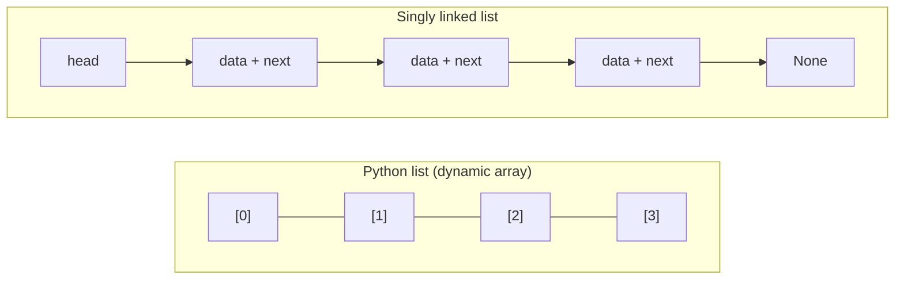

Throughout this page, **n** means the number of nodes in the list (e.g. tracks in one playlist buffer, events in one ingest window). **i** means a zero-based index. In production apps, **n** per list is often small (one bounded buffer) while total tracks in a catalog live in databases—do not confuse “linked list of one buffer” with “50k-track catalog.”

---

## Singly linked vs doubly linked vs Python `list`

| | **Singly linked** | [Doubly linked](../doubly-linked-list/index.md) | [Python `list`](../array-based-lists/index.md) |
| --- | --- | --- | --- |
| **Pointers per node** | `next` only | `next` + `prev` | None (array of refs) |
| **`pop_tail`** | O(n) — must find predecessor | O(1) with `tail` | O(1) amortized |
| **Delete when you hold a node reference** | O(n) to find predecessor; **copy-value hack** is an O(1) workaround with caveats | O(1) rewire `prev` and `next` | O(n) shift after removal |
| **Access by index `i`** | O(n) from head only | O(n) from nearer end | O(1) |
| **Memory** | Medium | Highest per element | Compact + cache-friendly |
| **Typical fit** | Head-heavy event ingest, merge drills | Bidirectional browser history UI, both-end buffer | Full playlist catalog |

The **copy-value hack** (detailed below) is the main singly linked workaround when you hold a node reference but not its predecessor. A [doubly linked list](../doubly-linked-list/index.md) avoids the hack entirely with a `prev` pointer.

---

## Practical applications: what a linked list models

You will rarely store an entire catalog in a hand-rolled `LinkedList`. The structure still matters because the **same costs** appear in custom code, interviews, and pointer-based algorithms you might use on **chunks** of data.

| Application idea | Linked-list view | Typical *n* |
| --- | --- | --- |
| **Items in one buffer** | Head = oldest item; `next` = next track in playlist order | ~7–31 |
| **Live event buffer** | `prepend` newest event; trim from tail when buffer exceeds *k* | buffer size *k* |
| **Merge two sorted streams** | Each stream is a chain sorted by `(playlist_id, track_id)`; merge without shifting a whole array | *n* + *m* |
| **Walk the chain** | Sum duration_ms, find first short track, detect cycle in bad test data | O(n) traverse |

**Reach for a Python `list` or a database query** when you filter 50,000 history entries by URL, sort playlist tracks by duration, or need `tracks[i]` in a loop. **Reach for a linked list (or `deque`)** when the problem is inherently **sequential** and **end-heavy**: browser history scrubber, live event ingest buffer, merge sorted linked chains in a streaming join sketch, or learning how `insert(0)` on a `list` differs from O(1) `prepend`.

```python
from dataclasses import dataclass

@dataclass
class PlaylistTrack:
    track_id = 0
    disc = 0
    duration_ms = 0.0
    title = ''

@dataclass
class HistoryEntry:
    entry_id = 0
    tab_id = 0
    duration_ms = 0.0
    title = ''
```

Each node's `data` can be a `PlaylistTrack`, a `HistoryEntry`, a `track_id`, or an event dict. `LinkedList` is defined in [Reference implementation](#reference-implementation) below; later sections use `PlaylistTrack` and `HistoryEntry` in operation examples.

---

## Mental model: pointers, head, and tail

Each **node** stores:

1. **`data`** — the value (any Python object).
2. **`next`** — reference to the next node, or `None` at the end.

The **head** is the only handle the outside world needs to reach the whole chain (unless you also keep a **tail** reference for fast appends).

```mermaid
sequenceDiagram
  participant Client
  participant Head as head pointer
  participant N1 as node A
  participant N2 as node B
  participant N3 as node C
  Client->>Head: holds reference to first node
  Head->>N1: data = A
  N1->>N2: next
  N2->>N3: next
  N3->>N3: next = None
  Client->>Head: traverse: cur = head; cur = cur.next
```

**Three kinds of cost** (mirror the array-based list page):

| Kind | What you pay for | Linked list examples | Application example |
| --- | --- | --- | --- |
| **Head change** | Rewire one or two pointers | `prepend`, `pop_head` | New live event pushed to front of a scratch buffer |
| **Find position** | Walk up to *n* nodes | `get(i)`, `insert(i)`, `remove(value)` | “Third item in this buffer”—must walk from head |
| **Rewire after find** | Constant pointer updates | splice after predecessor | Insert corrected history entry after index 2 without shifting a whole array |

---

## Node definition (foundation for everything)

Use a small class. The list **logic** lives in a wrapper class that holds `head` (and optionally `tail`, `size`).

```python
class Node:

    def __init__(self, data, next=None):
        self.data = data
        self.next = next
```

| | |
| --- | --- |
| **Time** | O(1) to construct one node |
| **Space** | O(1) per node (value + `next` reference; object overhead applies in CPython) |

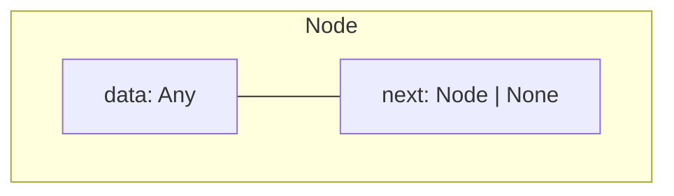

---

## Ways to create a linked list

### 1. Empty list — `head is None`

The canonical empty structure.

```python
head = None
```

| | |
| --- | --- |
| **Time** | O(1) |
| **Space** | O(1) |

### 2. Empty `LinkedList` wrapper

```python
class LinkedList:

    def __init__(self, values=None):
        self.head = None
        self.tail = None
        self.size = 0
ll = LinkedList()
assert ll.head is None
```

| | |
| --- | --- |
| **Time** | O(1) |
| **Space** | O(1) |

### 3. Single-node list

```python
head = Node(42)
head = Node('only', next=None)
```

| | |
| --- | --- |
| **Time** | O(1) |
| **Space** | O(1) for one node |

### 4. Build from an iterable — append at tail (forward order)

Preserves input order; needs O(n) steps (and a tail pointer for O(1) per append).

```python
def from_iterable(items):
    head = None
    tail = None
    for item in items:
        node = Node(item)
        if head is None:
            head = tail = node
        else:
            tail.next = node
            tail = node
    return head
track_ids = [401, 402, 403]
chain = from_iterable(track_ids)
```

| | |
| --- | --- |
| **Time** | O(k) for *k* items (e.g. *k* items in a buffer) |
| **Space** | O(k) nodes |

### 5. Build from an iterable — prepend at head (reversed order)

Each insert at head is O(1); result is **backwards** unless you reverse later.

```python
def from_iterable_reversed(items):
    head = None
    for item in items:
        head = Node(item, next=head)
    return head
chain = from_iterable_reversed([10, 20, 30])
```

| | |
| --- | --- |
| **Time** | O(k) |
| **Space** | O(k) |

### 6. Constructor on a class

```python
class LinkedList:

    def __init__(self, values=None):
        self.head = None
        self.tail = None
        self.size = 0
        if values is not None:
            for value in values:
                self.append(value)
ll = LinkedList([1, 2, 3])
```

| | |
| --- | --- |
| **Time** | O(k) for *k* items with tail-tracked `append` |
| **Space** | O(k) |

### 7. Manual chain wiring (tests and diagrams)

```python
n3 = Node(3)
n2 = Node(2, next=n3)
n1 = Node(1, next=n2)
head = n1
```

| | |
| --- | --- |
| **Time** | O(k) |
| **Space** | O(k) |

### Creation cheat sheet

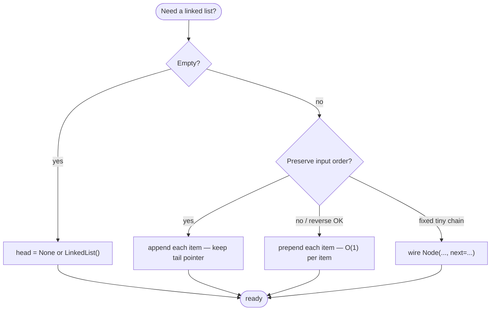

---

## Reference implementation

The sections below use this **complete** singly linked list (`LinkedList` class). Every method is documented with complexity in the following sections.

```python
class Node:

    def __init__(self, data, next=None):
        self.data = data
        self.next = next

class LinkedList:

    def __init__(self, values=None):
        self.head = None
        self.tail = None
        self.next = None
        self.size = 0
        if values is not None:
            for value in values:
                self.append(value)

    def __str__(self):
        current = self.head
        out = []
        while current:
            out.append(repr(current.data))
            current = current.next
        return f'LinkedList([{', '.join(out)}])'

    def __repr__(self):
        return self.__str__()

    def __len__(self):
        return self.size

    def __iter__(self):
        cur = self.head
        while cur is not None:
            yield cur.data
            cur = cur.next

    def is_empty(self):
        return self.head is None

    def prepend(self, data):
        new_node = Node(data, next=self.head)
        self.head = new_node
        if self.tail is None:
            self.tail = new_node
        self.size += 1

    def append(self, data):
        node = Node(data)
        if self.tail is None:
            self.head = self.tail = node
        else:
            self.tail.next = node
            self.tail = node
        self.size += 1

    def insert(self, index, data):
        if index >= self.size:
            self.append(data)
            return
        if index == 0:
            self.prepend(data)
            return
        prev = self._node_at(index - 1)
        node = Node(data, next=prev.next)
        prev.next = node
        self.size += 1

    def pop_head(self):
        if self.head is None:
            raise IndexError('pop from empty list')
        data = self.head.data
        if self.head.next is None:
            self.head = None
            self.tail = None
        else:
            self.head = self.head.next
        self.size -= 1
        return data

    def pop_tail(self):
        if self.head is None:
            raise IndexError('pop from empty list')
        if self.head.next == None:
            return self.pop_head()
        else:
            prev = self._node_at(self.size - 2)
            data = prev.next.data
            prev.next = None
            self.tail = prev
            self.size -= 1
            return data

    def remove(self, index):
        if index < 0 or index >= self.size:
            raise IndexError('index out of range')
        if index == 0:
            return self.pop_head()
        else:
            prev = self._node_at(index - 1)
            cur = prev.next
            prev.next = cur.next
            if prev.next is None:
                self.tail = prev
        self.size -= 1
        return cur.data

    def get(self, index):
        return self._node_at(index).data

    def set(self, index, data):
        self._node_at(index).data = data

    def _node_at(self, index):
        if index < 0 or index >= self.size:
            raise IndexError('index out of range')
        cur = self.head
        for _ in range(index):
            cur = cur.next
        return cur

    def index_of(self, data):
        index = 0
        cur = self.head
        while cur is not None:
            if cur.data == data:
                return index
            cur = cur.next
            index += 1
        raise ValueError()

    def contains(self, data):
        cur = self.head
        while cur is not None:
            if cur.data == data:
                return True
            cur = cur.next
        return False

    def reverse(self):
        prev = None
        cur = self.head
        self.tail = self.head
        while cur is not None:
            nxt = cur.next
            cur.next = prev
            prev = cur
            cur = nxt
        self.head = prev

    def to_list(self):
        return list(self)

    def clear(self):
        self.head = None
        self.tail = None
        self.size = 0

    def extend(self, other):
        self.tail.next = other.head
        self.tail = other.tail
        self.size += other.size

    def sort(self):
        nodes = self.to_list()
        nodes.sort()
        self.clear()
        for node in nodes:
            self.append(node)
```

---

## All operations (with examples and complexity)

Examples below use small integers or strings where the focus is pointer mechanics. In an application script, the same methods apply when `data` is a `PlaylistTrack`, a `HistoryEntry`, or an event dict—costs depend on **chain length**, not on whether `data` is a dataclass or a dict.

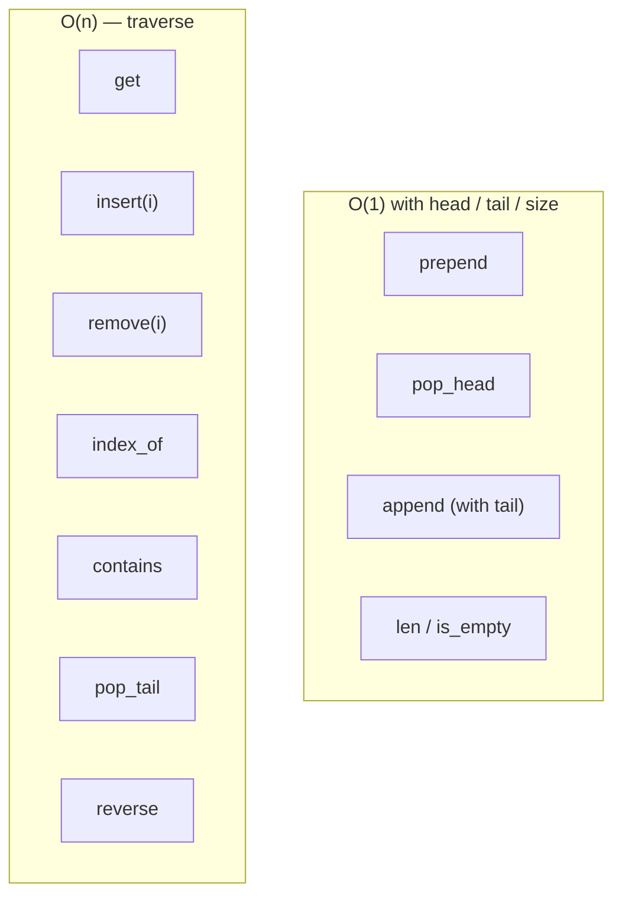

### `is_empty()` / `len(ll)`

```python
ll = LinkedList()
assert ll.is_empty()
assert len(ll) == 0
ll.append(1)
assert not ll.is_empty()
assert len(ll) == 1
```

| | |
| --- | --- |
| **Time** | O(1) when `size` is maintained; O(n) if you walk the chain each time |
| **Space** | O(1) |

---

### `prepend(data)` — insert at head

New node points to old head; update `head` (and `tail` if list was empty).

```python
ll = LinkedList([2, 3])
ll.prepend(1)
assert list(ll) == [1, 2, 3]
buffer = LinkedList([PlaylistTrack(201, 3, 212000, 'Neon Skyline'), PlaylistTrack(202, 3, 198000, 'Late Shift')])
buffer.prepend(PlaylistTrack(200, 3, 245000, 'Opening Act'))
```

| | |
| --- | --- |
| **Time** | O(1) |
| **Space** | O(1) auxiliary (one new node) |

**Application note:** Prepending every track in an entire playlist catalog would still be Θ(n) nodes total; you are choosing O(1) **per prepend**, not O(1) for the whole catalog.

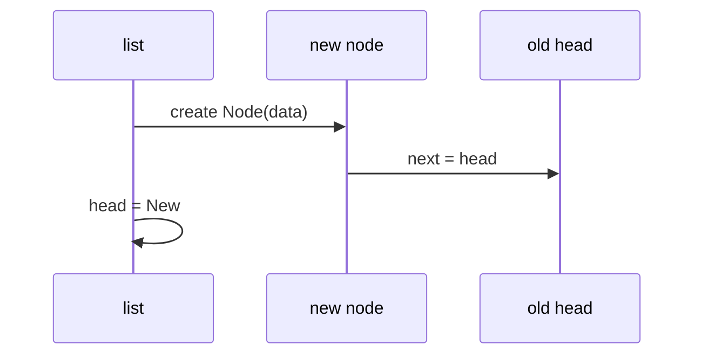

---

### `append(data)` — insert at tail

With a **tail pointer**, no traversal. Without tail, each append is O(n).

```python
ll = LinkedList()
ll.append('a')
ll.append('b')
assert list(ll) == ['a', 'b']
playlist = LinkedList()
playlist.append(PlaylistTrack(1, 1, 212000, 'Neon Skyline'))
playlist.append(PlaylistTrack(2, 1, 198000, 'Late Shift'))
```

| | |
| --- | --- |
| **Time** | O(1) with `tail`; O(n) if only `head` |
| **Space** | O(1) auxiliary per append |

**Application note:** Appending each event as a buffer grows matches live ingest: O(1) amortized per item **if** you keep `tail`, same idea as [array-based list](../array-based-lists/index.md) `append` on a growing playlist.

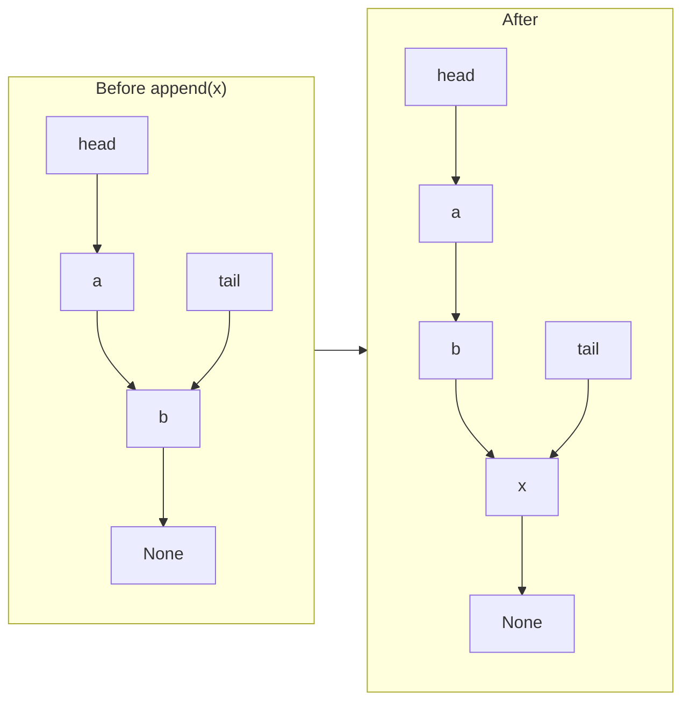

---

### `insert(index, data)` — insert before position `index`

Index `0` delegates to `prepend`. Otherwise find the **predecessor** at `index - 1` and splice in.

```python
ll = LinkedList([10, 30])
ll.insert(1, 20)
assert list(ll) == [10, 20, 30]
ll.insert(0, 5)
assert list(ll) == [5, 10, 20, 30]
```

| | |
| --- | --- |
| **Time** | O(n) — O(i) to find position + O(1) rewire |
| **Space** | O(1) auxiliary |

```mermaid
flowchart TD
  S([insert at index i])
  S --> Z{i == 0?}
  Z -->|yes| P[prepend — O(1)]
  Z -->|no| W[walk i-1 steps to predecessor]
  W --> R[rewire: prev.next = new; new.next = old next]
```

---

### `get(index)` / `set(index, data)`

No shortcut: walk from head.

```python
ll = LinkedList(['a', 'b', 'c'])
assert ll.get(1) == 'b'
ll.set(1, 'B')
assert ll.get(1) == 'B'
```

| | |
| --- | --- |
| **Time** | O(n) worst case (index near end); O(i) for index `i` |
| **Space** | O(1) |

**Application note:** “Give me track index 7 in this playlist buffer” without a `list` backing store is O(i) pointer hops. If you need random index access repeatedly, materialize `playlist.to_list()` once or keep a Python `list` for that buffer.

---

### `pop_head()` — remove first element

```python
ll = LinkedList([1, 2, 3])
assert ll.pop_head() == 1
assert list(ll) == [2, 3]
```

| | |
| --- | --- |
| **Time** | O(1) |
| **Space** | O(1) |

---

### `pop_tail()` — remove last element

Singly linked list needs the **predecessor** of the tail—full scan O(n).

```python
ll = LinkedList([1, 2, 3])
assert ll.pop_tail() == 3
assert list(ll) == [1, 2]
```

| | |
| --- | --- |
| **Time** | O(n) |
| **Space** | O(1) |

For O(1) pops at both ends in Python, use `collections.deque` ([deque](../dequeue-deque/index.md)) or a [doubly linked list](../doubly-linked-list/index.md).

---

### `remove(index)` — delete by position

```python
ll = LinkedList([10, 20, 30])
assert ll.remove(1) == 20
assert list(ll) == [10, 30]
```

| | |
| --- | --- |
| **Time** | O(n) |
| **Space** | O(1) |

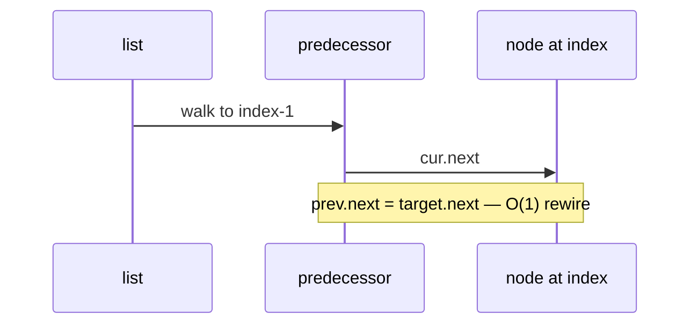

If you hold a **node reference** but not its index or predecessor, see [copy-value hack](#delete-node-when-you-only-have-the-node-singly-linked) below—or use a [doubly linked list](../doubly-linked-list/index.md).

---

### `index_of(data)` / `contains(data)`

Linear search.

```python
ll = LinkedList(['x', 'y', 'z'])
assert ll.index_of('y') == 1
assert ll.contains('z')
assert not ll.contains('w')
```

| | |
| --- | --- |
| **Time** | O(n) |
| **Space** | O(1) |

---

### `clear()`

Drop `head` (and `tail`); let garbage collection reclaim nodes.

```python
ll = LinkedList([1, 2, 3])
ll.clear()
assert ll.is_empty() and len(ll) == 0
```

| | |
| --- | --- |
| **Time** | O(1) to clear references; O(n) if you iterate to free explicitly |
| **Space** | O(1) |

---

### `reverse()` — in-place reverse

Iterative three-pointer walk (`prev`, `cur`, `nxt`); update `head` and `tail`.

```python
ll = LinkedList([1, 2, 3])
ll.reverse()
assert list(ll) == [3, 2, 1]
```

| | |
| --- | --- |
| **Time** | O(n) |
| **Space** | O(1) auxiliary |

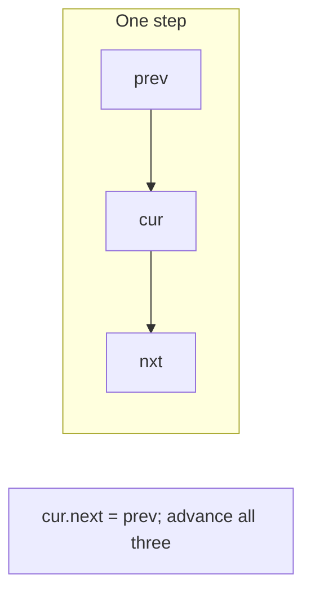

Recursive reverse (educational):

```python
def reverse_recursive(head):
    if head is None or head.next is None:
        return head
    new_head = reverse_recursive(head.next)
    head.next.next = head
    head.next = None
    return new_head
```

| | |
| --- | --- |
| **Time** | O(n) |
| **Space** | O(n) call stack depth |

---

### `extend(other)` / `to_list()`

`extend` splices another `LinkedList` onto the tail in O(1) pointer steps (no new nodes). The constructor `LinkedList(values)` builds from an iterable by calling `append` for each item.

```python
ll = LinkedList([1, 2, 3])
tail = LinkedList([4, 5])
ll.extend(tail)
assert ll.to_list() == [1, 2, 3, 4, 5]
assert tail.to_list() == [4, 5]
```

| Operation | Time | Space |
| --- | --- | --- |
| `extend` | O(1) pointer splice | O(1) — reuses `other`'s nodes |
| `to_list` | O(n) | O(n) new Python `list` |

---

### `sort()` — in-place sort via materialize

Converts to a Python `list`, sorts in place, clears the chain, and rebuilds with `append`. Simple and correct; not an in-node pointer sort.

```python
ll = LinkedList([3, 1, 4, 2])
ll.sort()
assert ll.to_list() == [1, 2, 3, 4]
```

| | |
| --- | --- |
| **Time** | O(n log n) — dominated by Python's Timsort |
| **Space** | O(n) for the temporary `list` |

---

### Iteration: `for x in ll` / `__iter__`

```python
ll = LinkedList([10, 20, 30])
total = sum((x for x in ll))
assert total == 60
playlist = LinkedList([PlaylistTrack(1, 1, 212000, 'Neon Skyline'), PlaylistTrack(2, 1, 198000, 'Late Shift'), PlaylistTrack(3, 1, 245000, 'Opening Act')])
total_duration = sum((r.duration_ms for r in playlist))
```

| | |
| --- | --- |
| **Time** | O(n) full traversal |
| **Space** | O(1) auxiliary |

This is the right pattern for **aggregate on a chain** (sum `duration_ms`, count short tracks). For **aggregate on a full catalog**, query the database or traverse a `list` once—still O(n), but *n* is all tracks and the structure should be a `list` or indexed `dict`, not a linked list of 50k nodes.

Manual walk (no wrapper class):

```python
def walk(head):
    cur = head
    while cur is not None:
        print(cur.data)
        cur = cur.next
```

---

## Low-level pointer operations (no class)

Useful in interviews and for understanding splice logic.

### Insert after a known node (not necessarily head)

You already hold reference `node`; no search.

```python
def insert_after(node, data):
    node.next = Node(data, next=node.next)
```

| | |
| --- | --- |
| **Time** | O(1) |
| **Space** | O(1) |

### Delete `node` when you only have the node (singly linked)

On a singly linked list, normal deletion needs the **predecessor** to set `predecessor.next = node.next`. If you only hold a reference to `node` itself, finding that predecessor costs **O(n)**.

The **copy-value hack** avoids the predecessor scan when you may **mutate** `node.data`:

1. Copy `node.next.data` into `node.data`.
2. Delete `node.next` instead — O(1) when you hold `node`, because `node` is the predecessor of `node.next`.

```python
def delete_node_copy_hack(node):
    if node.next is None:
        raise ValueError('cannot delete tail with copy-value hack')
    node.data = node.next.data
    node.next = node.next.next
```

Application example: a browser history chain holds a `Node` for “Entry 102 — Docs”. You want to remove that entry without scanning from the head; copy Entry 103’s data into Entry 102’s node, then unlink Entry 103.

```python
n3 = Node(HistoryEntry(103, 2, 12000, 'Settings'))
n2 = Node(HistoryEntry(102, 2, 45000, 'Docs'), next=n3)
n1 = Node(HistoryEntry(101, 2, 8000, 'Home'), next=n2)
delete_node_copy_hack(n2)
assert n1.next.data.entry_id == 103
assert n1.next.next is None
```

| | |
| --- | --- |
| **Time** | O(1) when `node.next` is not `None` |
| **Space** | O(1) |

| Caveat | Why it matters |
| --- | --- |
| **Tail node** | No `node.next` — hack fails; scan for predecessor or use a [doubly linked list](../doubly-linked-list/index.md) |
| **Mutates data in place** | The node at that address keeps its identity but holds a different entry's data |
| **Stale references** | After unlinking `node.next`, other pointers to that detached node are invalid |
| **Production history UI** | Prefer doubly linked `remove_node` or pass the predecessor explicitly |

```mermaid
sequenceDiagram
  participant N as node (Entry 102)
  participant Nxt as node.next (Entry 103)
  N->>N: data = Nxt.data
  N->>N: next = Nxt.next
  Note over N: Entry 102 slot now holds Entry 103 data; Entry 103 node dropped
```

For contrast, a [doubly linked list](../doubly-linked-list/index.md) rewires `prev` and `next` in true O(1) without copying values.

### Dummy head sentinel

Simplifies “delete head” and “insert before head” in one uniform loop.

```python
def remove_all_greater_than(head, limit):
    dummy = Node(0, next=head)
    prev = dummy
    while prev.next is not None:
        if prev.next.data > limit:
            prev.next = prev.next.next
        else:
            prev = prev.next
    return dummy.next
```

| | |
| --- | --- |
| **Time** | O(n) |
| **Space** | O(1) extra (dummy node) |

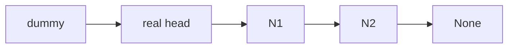

---

## Master complexity table

Let **n** = `len(ll)`, **i** = index. For linked-list work, map **n** to the chain you are holding (tracks in one playlist buffer, events in one ingest window, nodes in a merge sketch)—not catalog size unless you mistakenly built one giant linked list.

| Operation | Time | Space (auxiliary) | Notes |
| --- | --- | --- | --- |
| Create empty | O(1) | O(1) | |
| Build from *k* items (tail append) | O(k) | O(k) nodes | |
| Build from *k* items (head prepend) | O(k) | O(k) | reversed order |
| `prepend` | O(1) | O(1) | |
| `append` (with tail) | O(1) | O(1) | |
| `append` (head only) | O(n) | O(1) | |
| `insert(i)` | O(n) | O(1) | find + splice |
| `get` / `set` at `i` | O(i) ≤ O(n) | O(1) | |
| `pop_head` | O(1) | O(1) | |
| `pop_tail` | O(n) | O(1) | singly linked |
| `remove(i)` | O(n) | O(1) | |
| `index_of` / `contains` | O(n) | O(1) | |
| `len` (cached) | O(1) | O(1) | |
| `len` (walk) | O(n) | O(1) | |
| `clear` | O(1) | O(1) | drop head |
| `reverse` iterative | O(n) | O(1) | |
| `reverse` recursive | O(n) | O(n) stack | |
| `extend` (splice `LinkedList`) | O(1) | O(1) | reuses nodes from `other` |
| `sort` | O(n log n) | O(n) | materialize + Timsort + rebuild |
| `to_list` | O(n) | O(n) | |
| Traverse all | O(n) | O(1) | sum `duration_ms` on one playlist chain |
| Delete with node ref (copy-value hack) | O(1) | O(1) | fails on tail; mutates `node.data` |

**Storage for the whole structure:** Θ(n) nodes, each O(1) extra for `next` (and object headers in CPython). Storing a full browser history export as nodes costs Θ(all entries) memory with poor locality—use indexed storage instead.

---

## Classic patterns (with complexity)

These patterns appear in structure-heavy interview questions; they also describe **one-pass** logic you might apply to a **short** chain (one playlist buffer, two merged event logs) before you reach for a database query.

### Two pointers: find middle

Slow moves 1 step, fast moves 2; when fast hits end, slow is middle. On a history chain, that is the middle **entry node** without knowing length ahead of time (still O(n); `size` on the class makes it O(1) if you trust cached length).

```python
def middle_node(head):
    slow = fast = head
    while fast is not None and fast.next is not None:
        slow = slow.next
        fast = fast.next.next
    return slow
```

| | |
| --- | --- |
| **Time** | O(n) |
| **Space** | O(1) |

### Detect cycle (Floyd)

If fast meets slow inside a cycle, loop exists.

```python
def has_cycle(head):
    slow = fast = head
    while fast is not None and fast.next is not None:
        slow = slow.next
        fast = fast.next.next
        if slow is fast:
            return True
    return False
```

| | |
| --- | --- |
| **Time** | O(n) |
| **Space** | O(1) |

### Merge two sorted lists

**Application use:** Two chains sorted by `track_id` (e.g. two playlist chunks already sorted) can be merged into one chronological chain in O(n + m) pointer steps—no array shifts. Production merges usually sort keys in a database or `list`; the linked version teaches the combine step.

```python
def merge_sorted(a, b):
    dummy = Node(0)
    tail = dummy
    while a is not None and b is not None:
        if a.data <= b.data:
            tail.next = a
            a = a.next
        else:
            tail.next = b
            b = b.next
        tail = tail.next
    tail.next = a if a is not None else b
    return dummy.next
```

| | |
| --- | --- |
| **Time** | O(n + m) |
| **Space** | O(1) auxiliary (relinks existing nodes) |

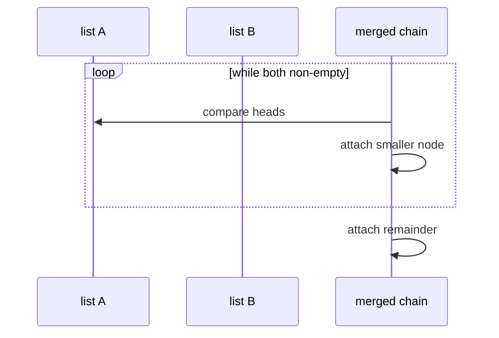

---

## Python stdlib: what to use instead

| Need | Prefer | Why |
| --- | --- | --- |
| Fast indexing, slicing | `list` | O(1) index; cache-friendly |
| Full playlist catalog | `list` / **dict** / database | Random access, aggregate stats, joins by `playlist_id` |
| Queue / stack at both ends | `collections.deque` | O(1) `append` / `pop` both ends—live event buffer, rolling history |
| Lookup by id | `dict` | O(1) average after index build—not a linked list |
| Ordered mapping | `dict` (3.7+ insertion order) | Ordered mapping sketches; not pointer chains |
| Learning / interviews | `Node` + `LinkedList` (this page) | Pointer discipline |
| Merge / reverse on **nodes** | Custom linked list or algorithm on `Node` | Teaches merge-sort chain step |

```python
from collections import deque
recent = deque(maxlen=10)
recent.append(9021)
recent.appendleft(9020)
```

`deque` is **not** a singly linked list you implement in Python—it is a C-level block deque. Treat it as the practical stdlib tool when the *reason* you wanted a linked list was O(1) push/pop at both ends of a **small** buffer.

---

## Linked list vs Python `list` — when to choose which

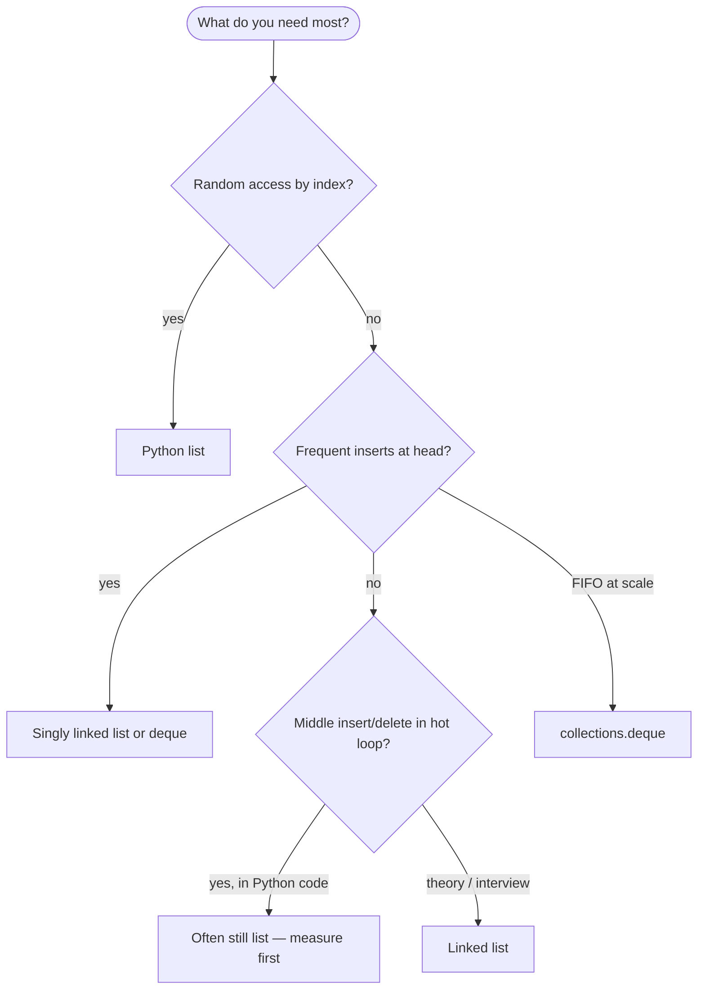

| Scenario | Linked list | Python `list` |
| --- | --- | --- |
| `get(i)` in a loop | O(n) each — painful | O(1) |
| Prepend in a tight loop | O(1) each | O(n) per `insert(0)` |
| Memory per element | Value + `next` + object overhead | One reference in array |
| Merge sort on sequence | Natural for linked nodes | [Merge sort](../../algorithms/merge-sort/index.md) often uses arrays in Python |
| Large aggregate queries | Wrong default structure | Database query / `list` of tracks + `dict` indexes |
| One playlist buffer, algorithm homework | Clear teaching model | Still fine to use `list` in prod for one buffer |

---

## Common pitfalls

| Pitfall | Why it hurts | Better approach |
| --- | --- | --- |
| Losing `head` reference | Rest of chain unreachable | Always assign to `self.head` or return new head |
| No `tail` but frequent `append` | O(n²) builds | Keep `tail` pointer |
| `pop_tail` on singly linked list | Must scan to predecessor | Doubly linked list or `deque` |
| `remove(node)` without predecessor | Cannot rewire in O(1) | Pass predecessor, use copy-value hack (with caveats), or use [doubly linked list](../doubly-linked-list/index.md) |
| Copy-value hack on tail node | No `node.next` to copy from | Scan for predecessor or use doubly linked list |
| `extend` shares nodes with `other` | Mutating one list affects both | Copy data with `to_list()` + rebuild if isolation matters |
| Using linked list for `xs[i]` hot paths | O(n) per access | `list` or array |
| Storing full catalog as nodes | Huge overhead, slow scans | JSON/CSV → `dict` index; keep chains bounded |
| `get(i)` for every item in every buffer | O(buffers × entries²) if nested wrong | Store buffer as `list` or one traverse per buffer |
| Confusing chain *n* with catalog *n* | Mis-estimate Big-O | Name *n*: items in **this** list only |

---

## Related structures in this guide

| Structure | Difference |
| --- | --- |
| [Array-based lists](../array-based-lists/index.md) | Contiguous dynamic array; Python `list` |
| [Doubly linked list](../doubly-linked-list/index.md) | `prev` pointer; O(1) delete with node reference (no copy-value hack) |
| [Circularly linked list](../circularly-linked-list/index.md) | Last `next` points to head; round-robin |
| [Stacks](../stacks/index.md) | LIFO—often `list.append` / `pop` or linked head |
| [Queue](../queue/index.md) | FIFO—`deque` over singly linked `pop(0)` |

Official Python sequences tutorial (arrays, not linked lists): [Data Structures — More on Lists](https://docs.python.org/3/tutorial/datastructures.html#more-on-lists).

---

## Quick reference card

```python
head = None
ll = LinkedList([1, 2, 3])
ll.prepend(0)
x = ll.pop_head()
ll.append(4)
ll.get(i)
ll.insert(i, x)
ll.remove(i)
ll.pop_tail()
ll.extend(other_ll)
ll.sort()
for entry in ll:
    ...
```

Use a singly linked list when the **algorithm** is defined in terms of pointer rewiring (merge, reverse, cycle detection) or when inserts at the **head** dominate—often on **small** chains (one event buffer, one playlist window, two sorted streams). Use Python’s `list`, a **database**, or `deque` when the **machine and library** should carry catalog-scale load.

**Structure selection checklist**

1. **Default** — Playlist catalogs in `list`/database; track or entry index in `dict`.
2. **Chain** — Use linked list (or `deque`) only when order and O(1) ends matter for a **bounded** buffer or exercise.
3. **Count *n*** — Tracks in this playlist buffer, not rows in the full catalog export.
4. **Hot loop** — Never `get(i)` inside `for each track in catalog`; walk the chain once or query the database.
5. **Delete with node ref** — Use copy-value hack only when mutation is OK; prefer doubly linked list in production timelines.
