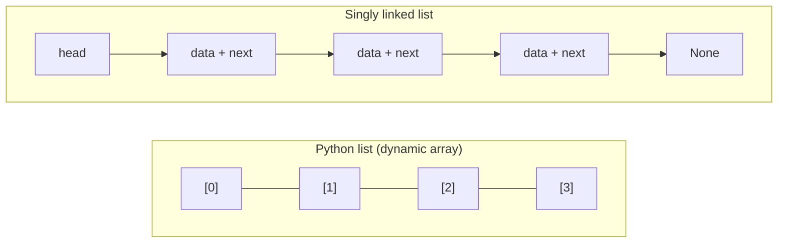
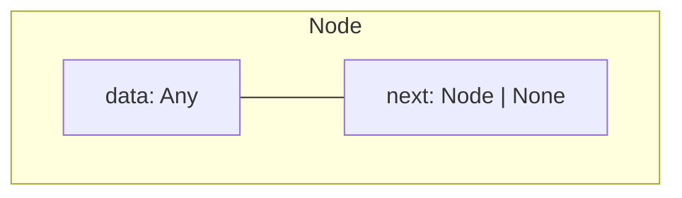
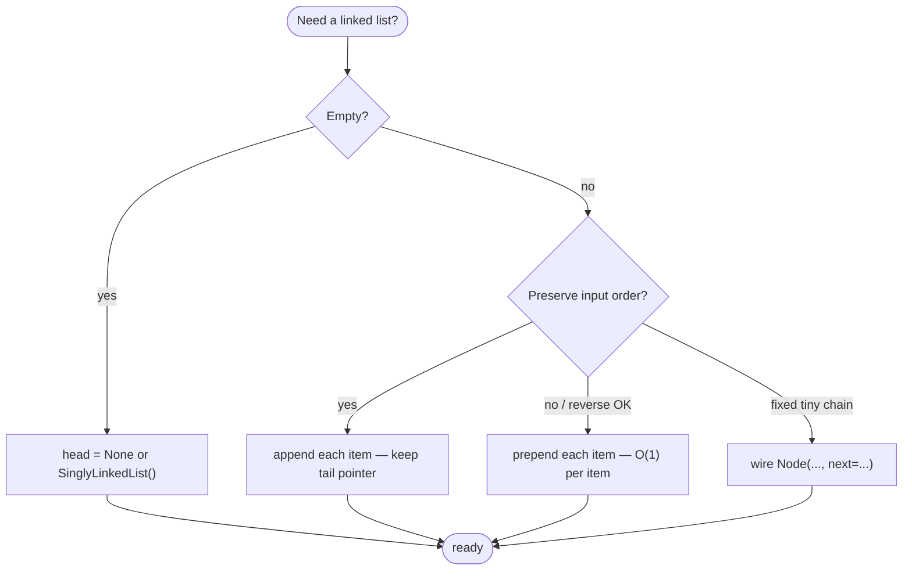
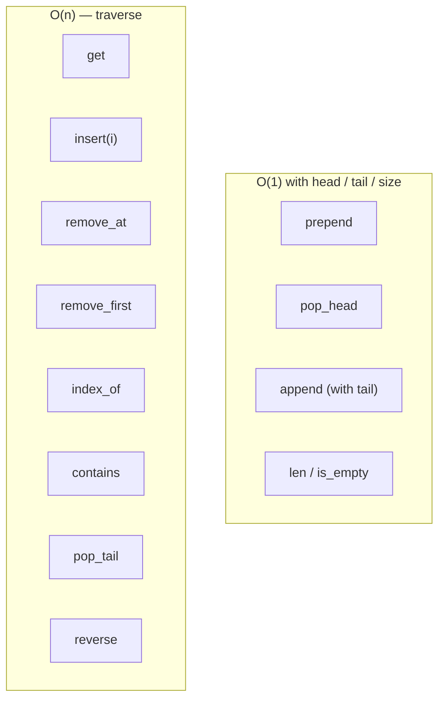
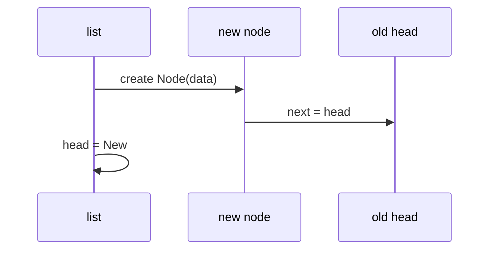
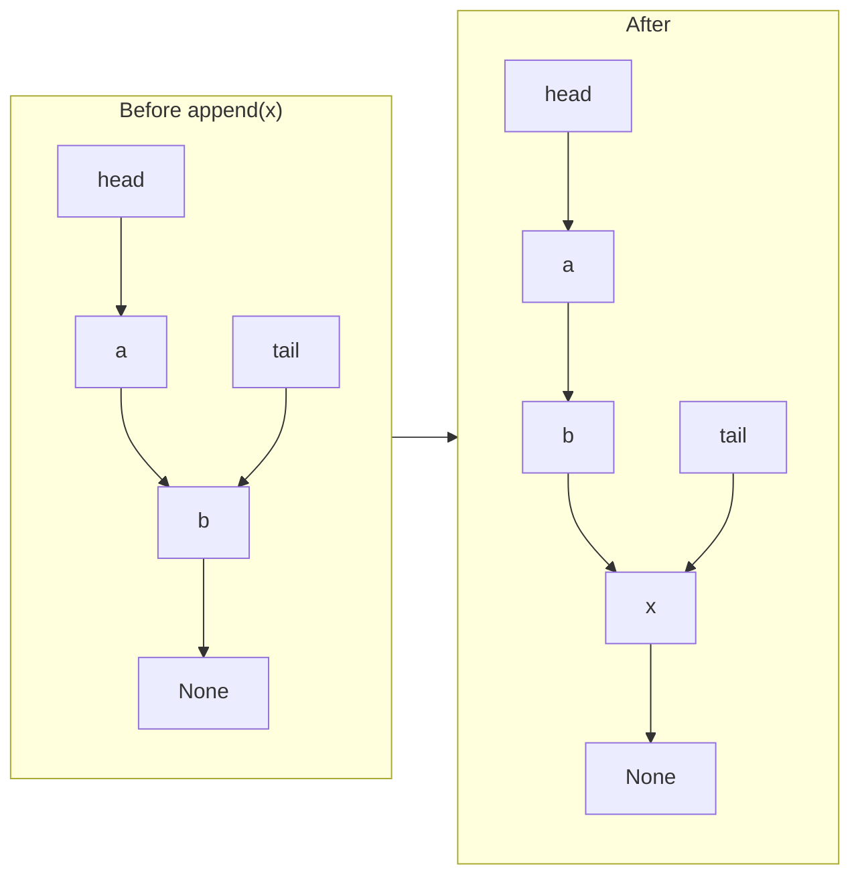
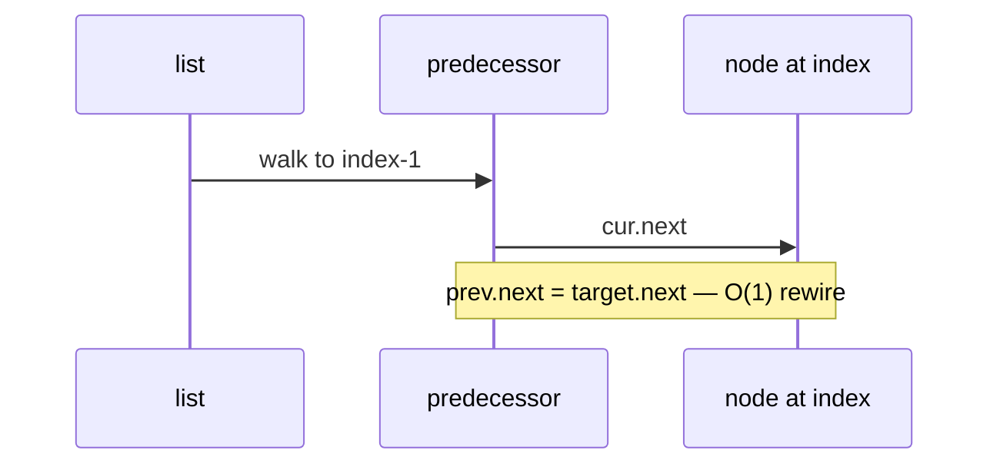
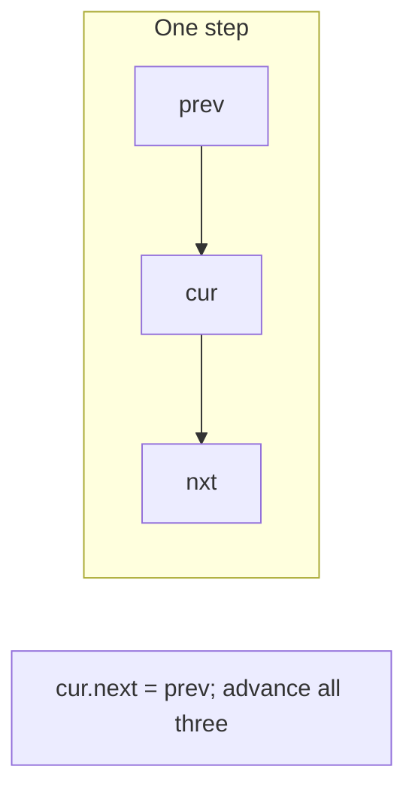
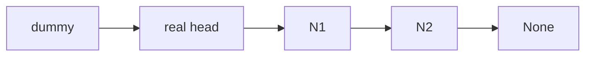
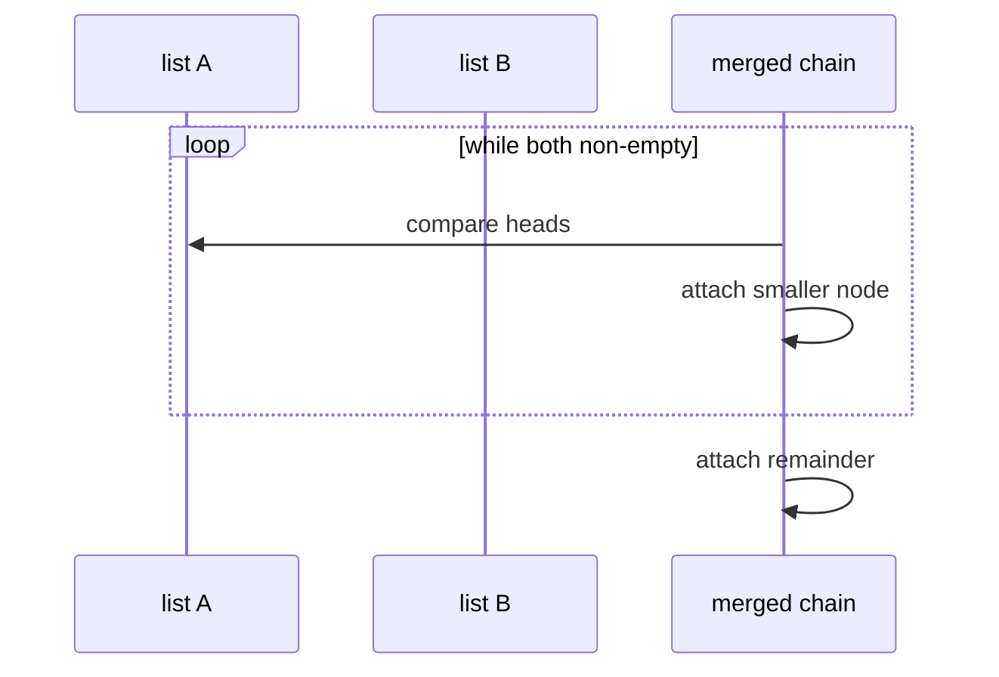

# Linked list

A linear collection stored as **nodes** that point to the next item—unlike a contiguous array, there is no index-based address arithmetic. You reach the *i*-th element only by following links from the **head**. In **NFL data analysis**, that shape shows up when you model a **sequence in order** (snaps in a drive, plays in a drive chain, events in a live feed) and care about **prepend/append at the ends** or **pointer-style merges** more than random access by index.

| | |
| --- | --- |
| **What it is** | Nodes in a chain: each holds a value (e.g. one snap dict or play id) and a link to the *next* node. The *head* is the entry to the list. |
| **Core operations** | Insert or delete at the head in O(1); traverse from the head for everything else. |
| **When to use** | Frequent insert/delete at the front (new snap arrives “at the top” of a working buffer), unknown or changing length, or algorithms defined as **rewiring** (reverse a drive chain, merge two sorted play streams). |
| **Trade-off** | Random access by index is O(n)—painful if you keep calling `get(i)` on thousands of plays; extra memory per node for `next`. Season tables and indexed lookups usually belong on a Python `list` or `dict`. |

Python has **no built-in singly linked list type**. You either implement nodes yourself (the best way to learn the ADT) or reach for tools that solve similar problems—`collections.deque` for a live play queue, or a `list` when you need `plays[i]` and vectorized pandas work. This page is your **ready reference** for singly linked lists in Python: structure, a complete implementation, every operation with examples, and **time and space complexity** on each. For Big-O notation and NFL-scale *n*, see [Complexity analysis](../../complexity/index.md).

[Parent: Data structures](../index.md)

---

## How a singly linked list differs from Python’s `list`

| | **Singly linked list** | **Python `list`** ([array-based list](../array-based-lists/index.md)) |
| --- | --- | --- |
| **Storage** | Scattered nodes linked by references | Contiguous array of references |
| **Access `i`-th item** | O(n) walk from head | O(1) index |
| **Insert at head** | O(1) | O(n) shift |
| **Insert at tail** | O(1) with tail pointer; O(n) without | Amortized O(1) `append` |
| **Insert in middle** | O(n) to find position; O(1) pointer rewiring once there | O(n) shift |
| **Cache behavior** | Poor (nodes may be far apart in memory) | Good (sequential slots) |
| **NFL-style workload** | One drive chain, merge/reverse exercises, live buffer at head | Full play-by-play column, `plays[i]`, `groupby`, export to parquet |

In CPython, `list` is always a dynamic array. A “linked list” in Python is **your own classes** (or interview scratch code), not a language primitive. Your week-7 CSV belongs in a **`list` of dicts or a DataFrame**; a linked list is for **ordered chains** where pointer costs are the lesson or the algorithm (merge two sorted play-id chains without array shifts).



Throughout this page, **n** means the number of nodes in the list (e.g. snaps in one drive). **i** means a zero-based index. In production NFL pipelines, **n** per list is often small (one drive) while total plays in a season live in tables—do not confuse “linked list of one drive” with “50k-row play-by-play DataFrame.”

---

## NFL data analysis: what a linked list models

You will rarely store a full season in a hand-rolled `SinglyLinkedList`. The structure still matters because the **same costs** appear in custom code, interviews, and pointer-based algorithms you might use on **chunks** of data.

| NFL idea | Linked-list view | Typical *n* |
| --- | --- | --- |
| **Snaps in one drive** | Head = first snap; `next` = next snap in drive order | ~3–15 |
| **Live ingest buffer** | `prepend` newest tick; trim from tail when window exceeds *k* | window size *k* |
| **Merge two sorted streams** | Each stream is a chain sorted by `(game_id, play_id)`; merge without shifting a whole array | *n* + *m* |
| **Walk the chain** | Sum EPA, find first sack, detect cycle in bad test data | O(n) traverse |

**Reach for a Python `list` or pandas** when you filter 50,000 plays by team, sort receivers by yards, or need `plays[i]` in a loop. **Reach for a linked list (or `deque`)** when the problem is inherently **sequential** and **end-heavy**: stack of undo edits on a drive builder, merge sorted linked chains in a streaming join sketch, or learning how `insert(0)` on a `list` differs from O(1) `prepend`.

```python
from dataclasses import dataclass

@dataclass(frozen=True)
class Snap:
    """Minimal snap record for examples on this page."""
    play_id: int
    epa: float
    description: str

# After SinglyLinkedList is defined (see Reference implementation):
# drive = SinglyLinkedList([
#     Snap(101, 0.4, "1st & 10 pass"),
#     Snap(102, -1.2, "sack"),
#     Snap(103, 0.1, "3rd & long checkdown"),
# ])
```

Each node’s `data` can be a `Snap`, a `play_id`, or a row dict. `SinglyLinkedList` is defined in [Reference implementation](#reference-implementation) below; later sections use `Snap` in operation examples.

---

## Mental model: pointers, head, and tail

Each **node** stores:

1. **`data`** — the value (any Python object).
2. **`next`** — reference to the next node, or `None` at the end.

The **head** is the only handle the outside world needs to reach the whole chain (unless you also keep a **tail** reference for fast appends).

```mermaid
sequenceDiagram
  participant Client
  participant Head as head pointer
  participant N1 as node A
  participant N2 as node B
  participant N3 as node C
  Client->>Head: holds reference to first node
  Head->>N1: data = A
  N1->>N2: next
  N2->>N3: next
  N3->>N3: next = None
  Client->>Head: traverse: cur = head; cur = cur.next
```

**Three kinds of cost** (mirror the array-based list page):

| Kind | What you pay for | Linked list examples | NFL-flavored example |
| --- | --- | --- | --- |
| **Head change** | Rewire one or two pointers | `prepend`, `pop_head` | New live snap pushed to front of a scratch buffer |
| **Find position** | Walk up to *n* nodes | `get(i)`, `insert(i)`, `remove(value)` | “Third snap in this drive”—must walk from head |
| **Rewire after find** | Constant pointer updates | splice after predecessor | Insert penalty flag node after snap 2 without shifting a whole array |

---

## Node definition (foundation for everything)

Use a small class or `@dataclass`. The list **logic** lives in a wrapper class that holds `head` (and optionally `tail`, `_size`).

```python
from __future__ import annotations

from dataclasses import dataclass
from typing import Any, Iterable, Iterator


@dataclass
class Node:
    """One link in the chain."""
    data: Any
    next: Node | None = None
```

| | |
| --- | --- |
| **Time** | O(1) to construct one node |
| **Space** | O(1) per node (value + `next` reference; object overhead applies in CPython) |



---

## Ways to create a linked list

### 1. Empty list — `head is None`

The canonical empty structure.

```python
head: Node | None = None
```

| | |
| --- | --- |
| **Time** | O(1) |
| **Space** | O(1) |

### 2. Empty `SinglyLinkedList` wrapper

```python
class SinglyLinkedList:
    def __init__(self) -> None:
        self.head: Node | None = None
        self._size: int = 0  # optional but useful for O(1) len

ll = SinglyLinkedList()
assert ll.head is None
```

| | |
| --- | --- |
| **Time** | O(1) |
| **Space** | O(1) |

### 3. Single-node list

```python
head = Node(42)
# or
head = Node("only", next=None)
```

| | |
| --- | --- |
| **Time** | O(1) |
| **Space** | O(1) for one node |

### 4. Build from an iterable — append at tail (forward order)

Preserves input order; needs O(n) steps (and a tail pointer for O(1) per append).

```python
def from_iterable(items: Iterable[Any]) -> Node | None:
    head: Node | None = None
    tail: Node | None = None
    for item in items:
        node = Node(item)
        if head is None:
            head = tail = node
        else:
            assert tail is not None
            tail.next = node
            tail = node
    return head

play_ids = [401, 402, 403]  # one drive, chronological
chain = from_iterable(play_ids)
```

| | |
| --- | --- |
| **Time** | O(k) for *k* items (e.g. *k* snaps in a drive) |
| **Space** | O(k) nodes |

### 5. Build from an iterable — prepend at head (reversed order)

Each insert at head is O(1); result is **backwards** unless you reverse later.

```python
def from_iterable_reversed(items: Iterable[Any]) -> Node | None:
    head: Node | None = None
    for item in items:
        head = Node(item, next=head)
    return head

chain = from_iterable_reversed([10, 20, 30])
# head -> 30 -> 20 -> 10 -> None
```

| | |
| --- | --- |
| **Time** | O(k) |
| **Space** | O(k) |

### 6. Constructor on a class

```python
class SinglyLinkedList:
    def __init__(self, items: Iterable[Any] | None = None) -> None:
        self.head: Node | None = None
        self.tail: Node | None = None
        self._size = 0
        if items is not None:
            for item in items:
                self.append(item)

ll = SinglyLinkedList([1, 2, 3])
```

| | |
| --- | --- |
| **Time** | O(k) for *k* items with tail-tracked `append` |
| **Space** | O(k) |

### 7. Manual chain wiring (tests and diagrams)

```python
# 1 -> 2 -> 3
n3 = Node(3)
n2 = Node(2, next=n3)
n1 = Node(1, next=n2)
head = n1
```

| | |
| --- | --- |
| **Time** | O(k) |
| **Space** | O(k) |

### Creation cheat sheet



---

## Reference implementation

The sections below use this **complete** singly linked list. Every method is documented with complexity in the following sections.

```python
from __future__ import annotations

from dataclasses import dataclass
from typing import Any, Iterable, Iterator


@dataclass
class Node:
    data: Any
    next: Node | None = None


class SinglyLinkedList:
    """Singly linked list with head, tail, and cached length."""

    def __init__(self, items: Iterable[Any] | None = None) -> None:
        self.head: Node | None = None
        self.tail: Node | None = None
        self._size = 0
        if items is not None:
            for item in items:
                self.append(item)

    def __len__(self) -> int:
        return self._size

    def __iter__(self) -> Iterator[Any]:
        cur = self.head
        while cur is not None:
            yield cur.data
            cur = cur.next

    def __repr__(self) -> str:
        return f"SinglyLinkedList({list(self)})"

    def is_empty(self) -> bool:
        return self.head is None

    def prepend(self, data: Any) -> None:
        node = Node(data, next=self.head)
        self.head = node
        if self.tail is None:
            self.tail = node
        self._size += 1

    def append(self, data: Any) -> None:
        node = Node(data)
        if self.tail is None:
            self.head = self.tail = node
        else:
            self.tail.next = node
            self.tail = node
        self._size += 1

    def insert(self, index: int, data: Any) -> None:
        if index < 0 or index > self._size:
            raise IndexError("index out of range")
        if index == 0:
            self.prepend(data)
            return
        prev = self._node_at(index - 1)
        node = Node(data, next=prev.next)
        prev.next = node
        self._size += 1

    def pop_head(self) -> Any:
        if self.head is None:
            raise IndexError("pop from empty list")
        data = self.head.data
        self.head = self.head.next
        if self.head is None:
            self.tail = None
        self._size -= 1
        return data

    def pop_tail(self) -> Any:
        if self.head is None:
            raise IndexError("pop from empty list")
        if self.head.next is None:
            return self.pop_head()
        prev = self._node_at(self._size - 2)
        assert prev.next is not None
        data = prev.next.data
        prev.next = None
        self.tail = prev
        self._size -= 1
        return data

    def remove_at(self, index: int) -> Any:
        if index < 0 or index >= self._size:
            raise IndexError("index out of range")
        if index == 0:
            return self.pop_head()
        prev = self._node_at(index - 1)
        assert prev.next is not None
        data = prev.next.data
        prev.next = prev.next.next
        if prev.next is None:
            self.tail = prev
        self._size -= 1
        return data

    def remove_first(self, data: Any) -> bool:
        if self.head is None:
            return False
        if self.head.data == data:
            self.pop_head()
            return True
        cur = self.head
        while cur.next is not None:
            if cur.next.data == data:
                if cur.next is self.tail:
                    self.tail = cur
                cur.next = cur.next.next
                self._size -= 1
                return True
            cur = cur.next
        return False

    def get(self, index: int) -> Any:
        return self._node_at(index).data

    def set(self, index: int, data: Any) -> None:
        self._node_at(index).data = data

    def index_of(self, data: Any) -> int:
        i = 0
        cur = self.head
        while cur is not None:
            if cur.data == data:
                return i
            cur = cur.next
            i += 1
        raise ValueError(f"{data!r} not in list")

    def contains(self, data: Any) -> bool:
        cur = self.head
        while cur is not None:
            if cur.data == data:
                return True
            cur = cur.next
        return False

    def clear(self) -> None:
        self.head = self.tail = None
        self._size = 0

    def copy(self) -> SinglyLinkedList:
        out = SinglyLinkedList()
        for item in self:
            out.append(item)
        return out

    def reverse(self) -> None:
        prev: Node | None = None
        cur = self.head
        self.tail = self.head
        while cur is not None:
            nxt = cur.next
            cur.next = prev
            prev = cur
            cur = nxt
        self.head = prev

    def extend(self, items: Iterable[Any]) -> None:
        for item in items:
            self.append(item)

    def to_list(self) -> list[Any]:
        return list(self)

    def _node_at(self, index: int) -> Node:
        if index < 0 or index >= self._size:
            raise IndexError("index out of range")
        cur = self.head
        for _ in range(index):
            assert cur is not None
            cur = cur.next
        assert cur is not None
        return cur
```

---

## All operations (with examples and complexity)

Examples below use small integers or strings where the focus is pointer mechanics. In an NFL script, the same methods apply when `data` is a `Snap`, a `play_id`, or a row dict—costs depend on **chain length**, not on whether `data` is a float or a dict.



### `is_empty()` / `len(ll)`

```python
ll = SinglyLinkedList()
assert ll.is_empty()
assert len(ll) == 0

ll.append(1)
assert not ll.is_empty()
assert len(ll) == 1
```

| | |
| --- | --- |
| **Time** | O(1) when `_size` is maintained; O(n) if you walk the chain each time |
| **Space** | O(1) |

---

### `prepend(data)` — insert at head

New node points to old head; update `head` (and `tail` if list was empty).

```python
# Generic
ll = SinglyLinkedList([2, 3])
ll.prepend(1)
assert list(ll) == [1, 2, 3]

# NFL: newest correction snap at head of a working drive (rare in prod; illustrative)
buffer = SinglyLinkedList([Snap(201, 0.2, "run"), Snap(202, -0.5, "incomplete")])
buffer.prepend(Snap(200, 0.0, "penalty reversed — re-snap"))
```

| | |
| --- | --- |
| **Time** | O(1) |
| **Space** | O(1) auxiliary (one new node) |

**NFL note:** Prepending every play of a season would still be Θ(n) nodes total; you are choosing O(1) **per prepend**, not O(1) for the whole dataset.



---

### `append(data)` — insert at tail

With a **tail pointer**, no traversal. Without tail, each append is O(n).

```python
ll = SinglyLinkedList()
ll.append("a")
ll.append("b")
assert list(ll) == ["a", "b"]

# NFL: build drive in chronological order (tail append + tail pointer)
drive = SinglyLinkedList()
drive.append(Snap(1, 0.3, "rush"))
drive.append(Snap(2, 1.1, "TD pass"))
```

| | |
| --- | --- |
| **Time** | O(1) with `tail`; O(n) if only `head` |
| **Space** | O(1) auxiliary per append |

**NFL note:** Appending each snap as a drive is parsed matches live ingest: O(1) amortized per snap **if** you keep `tail`, same idea as [array-based list](../array-based-lists/index.md) `append` on a growing table.



---

### `insert(index, data)` — insert before position `index`

Index `0` delegates to `prepend`. Otherwise find the **predecessor** at `index - 1` and splice in.

```python
ll = SinglyLinkedList([10, 30])
ll.insert(1, 20)
assert list(ll) == [10, 20, 30]

ll.insert(0, 5)
assert list(ll) == [5, 10, 20, 30]
```

| | |
| --- | --- |
| **Time** | O(n) — O(i) to find position + O(1) rewire |
| **Space** | O(1) auxiliary |

```mermaid
flowchart TD
  S([insert at index i])
  S --> Z{i == 0?}
  Z -->|yes| P[prepend — O(1)]
  Z -->|no| W[walk i-1 steps to predecessor]
  W --> R[rewire: prev.next = new; new.next = old next]
```

---

### `get(index)` / `set(index, data)`

No shortcut: walk from head.

```python
ll = SinglyLinkedList(["a", "b", "c"])
assert ll.get(1) == "b"
ll.set(1, "B")
assert ll.get(1) == "B"
```

| | |
| --- | --- |
| **Time** | O(n) worst case (index near end); O(i) for index `i` |
| **Space** | O(1) |

**NFL note:** “Give me snap index 7 in this drive” without a `list` backing store is O(i) pointer hops. If you need random snap access repeatedly, materialize `drive.to_list()` once or keep a Python `list` for that drive.

---

### `pop_head()` — remove first element

```python
ll = SinglyLinkedList([1, 2, 3])
assert ll.pop_head() == 1
assert list(ll) == [2, 3]
```

| | |
| --- | --- |
| **Time** | O(1) |
| **Space** | O(1) |

---

### `pop_tail()` — remove last element

Singly linked list needs the **predecessor** of the tail—full scan O(n).

```python
ll = SinglyLinkedList([1, 2, 3])
assert ll.pop_tail() == 3
assert list(ll) == [1, 2]
```

| | |
| --- | --- |
| **Time** | O(n) |
| **Space** | O(1) |

For O(1) pops at both ends in Python, use `collections.deque` ([deque](../dequeue-deque/index.md)) or a [doubly linked list](../doubly-linked-list/index.md).

---

### `remove_at(index)` — delete by position

```python
ll = SinglyLinkedList([10, 20, 30])
assert ll.remove_at(1) == 20
assert list(ll) == [10, 30]
```

| | |
| --- | --- |
| **Time** | O(n) |
| **Space** | O(1) |



---

### `remove_first(data)` — delete first matching value

Track predecessor to splice out `cur.next` when found.

```python
ll = SinglyLinkedList([1, 2, 3, 2])
assert ll.remove_first(2) is True
assert list(ll) == [1, 3, 2]
assert ll.remove_first(99) is False
```

| | |
| --- | --- |
| **Time** | O(n) |
| **Space** | O(1) |

---

### `index_of(data)` / `contains(data)`

Linear search.

```python
ll = SinglyLinkedList(["x", "y", "z"])
assert ll.index_of("y") == 1
assert ll.contains("z")
assert not ll.contains("w")
# ll.index_of("w")  # ValueError
```

| | |
| --- | --- |
| **Time** | O(n) |
| **Space** | O(1) |

---

### `clear()`

Drop `head` (and `tail`); let garbage collection reclaim nodes.

```python
ll = SinglyLinkedList([1, 2, 3])
ll.clear()
assert ll.is_empty() and len(ll) == 0
```

| | |
| --- | --- |
| **Time** | O(1) to clear references; O(n) if you iterate to free explicitly |
| **Space** | O(1) |

---

### `copy()` — shallow duplicate structure

New list, same `data` objects (not deep-copied).

```python
original = SinglyLinkedList([[1]])
duplicate = original.copy()
duplicate.get(0).append(2)
assert original.get(0) == [1, 2]  # shared inner list
```

| | |
| --- | --- |
| **Time** | O(n) |
| **Space** | O(n) for new nodes |

---

### `reverse()` — in-place reverse

Iterative three-pointer walk (`prev`, `cur`, `nxt`); update `head` and `tail`.

```python
ll = SinglyLinkedList([1, 2, 3])
ll.reverse()
assert list(ll) == [3, 2, 1]
```

| | |
| --- | --- |
| **Time** | O(n) |
| **Space** | O(1) auxiliary |



Recursive reverse (educational):

```python
def reverse_recursive(head: Node | None) -> Node | None:
    if head is None or head.next is None:
        return head
    new_head = reverse_recursive(head.next)
    head.next.next = head
    head.next = None
    return new_head
```

| | |
| --- | --- |
| **Time** | O(n) |
| **Space** | O(n) call stack depth |

---

### `extend(iterable)` / `to_list()`

```python
ll = SinglyLinkedList([1])
ll.extend([2, 3])
assert ll.to_list() == [1, 2, 3]
```

| Operation | Time | Space |
| --- | --- | --- |
| `extend` | O(k) for *k* new items | O(1) aux per append |
| `to_list` | O(n) | O(n) new Python `list` |

---

### Iteration: `for x in ll` / `__iter__`

```python
ll = SinglyLinkedList([10, 20, 30])
total = sum(x for x in ll)
assert total == 60

# NFL: one pass over a drive chain — O(n) in snaps on this drive
drive = SinglyLinkedList([Snap(1, 0.5, "a"), Snap(2, -0.3, "b"), Snap(3, 0.2, "c")])
drive_epa = sum(s.epa for s in drive)
```

| | |
| --- | --- |
| **Time** | O(n) full traversal |
| **Space** | O(1) auxiliary |

This is the right pattern for **aggregate on a chain** (sum EPA, count sacks). For **aggregate on a full season**, traverse a table or column once—still O(n), but *n* is all plays and the structure should be a `list`/DataFrame, not a linked list of 50k nodes.

Manual walk (no wrapper class):

```python
def walk(head: Node | None) -> None:
    cur = head
    while cur is not None:
        print(cur.data)
        cur = cur.next
```

---

## Low-level pointer operations (no class)

Useful in interviews and for understanding splice logic.

### Insert after a known node (not necessarily head)

You already hold reference `node`; no search.

```python
def insert_after(node: Node, data: Any) -> None:
    node.next = Node(data, next=node.next)
```

| | |
| --- | --- |
| **Time** | O(1) |
| **Space** | O(1) |

### Delete `node` when you only have the node (singly linked)

**Cannot** delete an arbitrary node in O(1) without the predecessor—unless you copy next node’s data into current (hack used only when mutation of values is allowed).

### Dummy head sentinel

Simplifies “delete head” and “insert before head” in one uniform loop.

```python
def remove_all_greater_than(head: Node | None, limit: int) -> Node | None:
    dummy = Node(0, next=head)
    prev = dummy
    while prev.next is not None:
        if prev.next.data > limit:
            prev.next = prev.next.next
        else:
            prev = prev.next
    return dummy.next
```

| | |
| --- | --- |
| **Time** | O(n) |
| **Space** | O(1) extra (dummy node) |



---

## Master complexity table

Let **n** = `len(ll)`, **i** = index. For NFL work, map **n** to the chain you are holding (snaps in one drive, nodes in a merge sketch)—not season row count unless you mistakenly built one giant linked list.

| Operation | Time | Space (auxiliary) | Notes |
| --- | --- | --- | --- |
| Create empty | O(1) | O(1) | |
| Build from *k* items (tail append) | O(k) | O(k) nodes | |
| Build from *k* items (head prepend) | O(k) | O(k) | reversed order |
| `prepend` | O(1) | O(1) | |
| `append` (with tail) | O(1) | O(1) | |
| `append` (head only) | O(n) | O(1) | |
| `insert(i)` | O(n) | O(1) | find + splice |
| `get` / `set` at `i` | O(i) ≤ O(n) | O(1) | |
| `pop_head` | O(1) | O(1) | |
| `pop_tail` | O(n) | O(1) | singly linked |
| `remove_at(i)` | O(n) | O(1) | |
| `remove_first(value)` | O(n) | O(1) | |
| `index_of` / `contains` | O(n) | O(1) | |
| `len` (cached) | O(1) | O(1) | |
| `len` (walk) | O(n) | O(1) | |
| `clear` | O(1) | O(1) | drop head |
| `copy` | O(n) | O(n) | |
| `reverse` iterative | O(n) | O(1) | |
| `reverse` recursive | O(n) | O(n) stack | |
| `extend` | O(k) | O(1) per item | |
| `to_list` | O(n) | O(n) | |
| Traverse all | O(n) | O(1) | sum EPA on one drive chain |

**Storage for the whole structure:** Θ(n) nodes, each O(1) extra for `next` (and object headers in CPython). Storing a full season as nodes costs Θ(season plays) memory with poor locality—use tabular storage instead.

---

## Classic patterns (with complexity)

These patterns appear in structure-heavy interview questions; they also describe **one-pass** logic you might apply to a **short** NFL chain (one drive, two merged game logs) before you reach for pandas.

### Two pointers: find middle

Slow moves 1 step, fast moves 2; when fast hits end, slow is middle. On a drive chain, that is the middle **snap node** without knowing length ahead of time (still O(n); `_size` on the class makes it O(1) if you trust cached length).

```python
def middle_node(head: Node | None) -> Node | None:
    slow = fast = head
    while fast is not None and fast.next is not None:
        slow = slow.next
        fast = fast.next.next
    return slow
```

| | |
| --- | --- |
| **Time** | O(n) |
| **Space** | O(1) |

### Detect cycle (Floyd)

If fast meets slow inside a cycle, loop exists.

```python
def has_cycle(head: Node | None) -> bool:
    slow = fast = head
    while fast is not None and fast.next is not None:
        slow = slow.next
        fast = fast.next.next
        if slow is fast:
            return True
    return False
```

| | |
| --- | --- |
| **Time** | O(n) |
| **Space** | O(1) |

### Merge two sorted lists

**NFL use:** Two chains sorted by `play_id` (e.g. first-half and second-half plays already sorted) can be merged into one chronological chain in O(n + m) pointer steps—no array shifts. Production merges usually sort keys in pandas/SQL; the linked version teaches the combine step.

```python
def merge_sorted(a: Node | None, b: Node | None) -> Node | None:
    dummy = Node(0)
    tail = dummy
    while a is not None and b is not None:
        if a.data <= b.data:
            tail.next = a
            a = a.next
        else:
            tail.next = b
            b = b.next
        tail = tail.next
    tail.next = a if a is not None else b
    return dummy.next
```

| | |
| --- | --- |
| **Time** | O(n + m) |
| **Space** | O(1) auxiliary (relinks existing nodes) |



---

## Python stdlib: what to use instead

| Need | Prefer | Why |
| --- | --- | --- |
| Fast indexing, slicing | `list` | O(1) index; cache-friendly |
| Full play-by-play season | `list` / **pandas** / parquet | Random access, vectorized stats, joins by `player_id` |
| Queue / stack at both ends | `collections.deque` | O(1) `append` / `pop` both ends—live play queue, rolling window |
| Player lookup by id | `dict` | O(1) average after index build—not a linked list |
| Ordered mapping | `dict` (3.7+ insertion order) | Roster order sketches; not pointer chains |
| Learning / interviews | `Node` + `SinglyLinkedList` | Pointer discipline |
| Merge / reverse on **nodes** | Custom linked list or algorithm on `Node` | Teaches merge-sort chain step |

```python
from collections import deque

# Rolling last-k play_ids from a live feed (O(1) ends)
recent: deque[int] = deque(maxlen=10)
recent.append(9021)
recent.appendleft(9020)  # optional: treat as newest at left
```

`deque` is **not** a singly linked list you implement in Python—it is a C-level block deque. Treat it as the practical NFL tool when the *reason* you wanted a linked list was O(1) push/pop at both ends of a **small** buffer.

---

## Linked list vs Python `list` — when to choose which


| Scenario | Linked list | Python `list` |
| --- | --- | --- |
| `get(i)` in a loop | O(n) each — painful | O(1) |
| Prepend in a tight loop | O(1) each | O(n) per `insert(0)` |
| Memory per element | Value + `next` + object overhead | One reference in array |
| Merge sort on sequence | Natural for linked nodes | [Merge sort](../../algorithms/merge-sort/index.md) often uses arrays in Python |
| Season play-by-play analytics | Wrong default structure | `DataFrame` / `list` of rows + `dict` indexes |
| One drive, algorithm homework | Clear teaching model | Still fine to use `list` in prod for one drive |

---

## Common pitfalls

| Pitfall | Why it hurts | Better approach |
| --- | --- | --- |
| Losing `head` reference | Rest of chain unreachable | Always assign to `self.head` or return new head |
| No `tail` but frequent `append` | O(n²) builds | Keep `tail` pointer |
| `pop_tail` on singly linked list | Must scan to predecessor | Doubly linked list or `deque` |
| `remove(node)` without predecessor | Cannot rewire in O(1) | Pass predecessor or use dummy head |
| Deep copy expected from `copy()` | Only new nodes; shared `data` | `copy.deepcopy` on values if needed |
| Using linked list for `xs[i]` hot paths | O(n) per access | `list` or array |
| Storing full season as nodes | Huge overhead, slow scans | Parquet/CSV → pandas; index players with `dict` |
| `get(i)` for every snap in every drive | O(drives × snaps²) if nested wrong | Store drive as `list` or one traverse per drive |
| Confusing chain *n* with table *n* | Mis-estimate Big-O | Name *n*: snaps in **this** list only |

---

## Related structures in this guide

| Structure | Difference |
| --- | --- |
| [Array-based lists](../array-based-lists/index.md) | Contiguous dynamic array; Python `list` |
| [Doubly linked list](../doubly-linked-list/index.md) | `prev` pointer; O(1) delete with node reference |
| [Circularly linked list](../circularly-linked-list/index.md) | Last `next` points to head; round-robin |
| [Stacks](../stacks/index.md) | LIFO—often `list.append` / `pop` or linked head |
| [Queue](../queue/index.md) | FIFO—`deque` over singly linked `pop(0)` |

Official Python sequences tutorial (arrays, not linked lists): [Data Structures — More on Lists](https://docs.python.org/3/tutorial/datastructures.html#more-on-lists).

---

## Quick reference card

```python
# node + empty list
head: Node | None = None
ll = SinglyLinkedList([1, 2, 3])

# O(1) at head — e.g. prepend correction snap
ll.prepend(0)
x = ll.pop_head()

# O(1) at tail (with tail pointer) — e.g. append next snap in drive
ll.append(4)

# O(n) — search / index / tail pop (avoid in season-wide loops)
ll.get(i)
ll.insert(i, x)
ll.remove_at(i)
ll.remove_first(value)
ll.pop_tail()

# O(n) once per drive — sum EPA, export to list
for snap in ll:
    ...
```

Use a singly linked list when the **algorithm** is defined in terms of pointer rewiring (merge, reverse, cycle detection) or when inserts at the **head** dominate—often on **small** NFL chains (one drive, two sorted streams). Use Python’s `list`, **pandas**, or `deque` when the **machine and library** should carry season-scale load.

**NFL pipeline checklist**

1. **Default** — Play-by-play table in pandas/`list`; player index in `dict`.
2. **Chain** — Use linked list (or `deque`) only when order and O(1) ends matter for a **bounded** buffer or exercise.
3. **Count *n*** — Snaps in this drive, not rows in the season file.
4. **Hot loop** — Never `get(i)` inside `for each play in season`; walk the chain once or vectorize.
