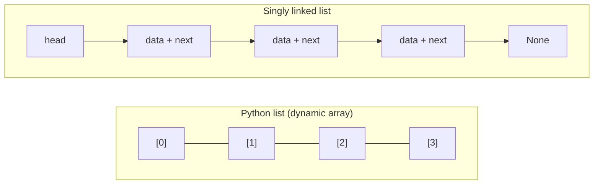
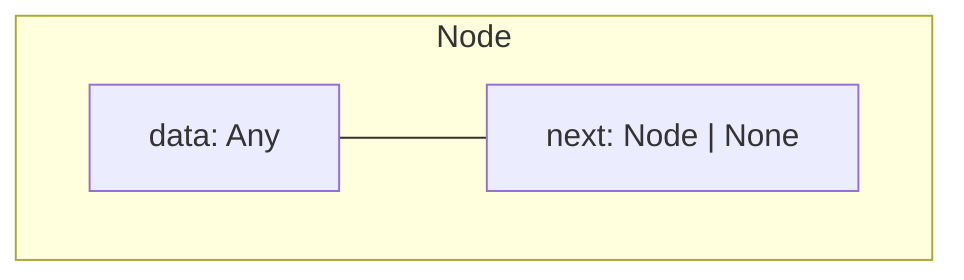
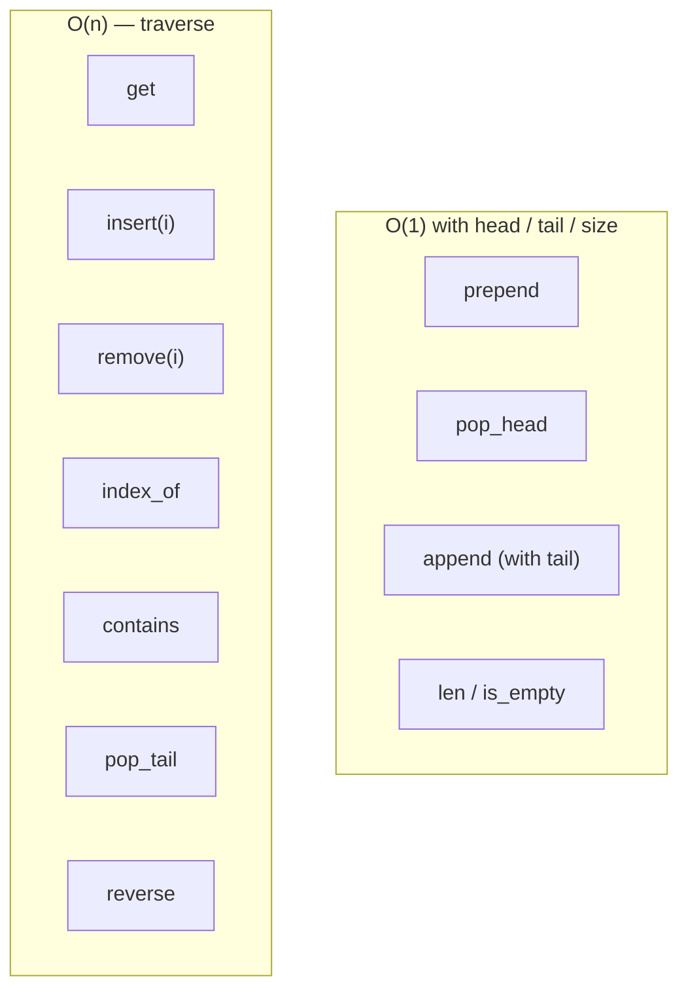
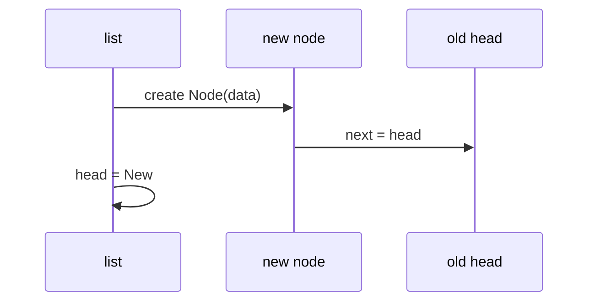
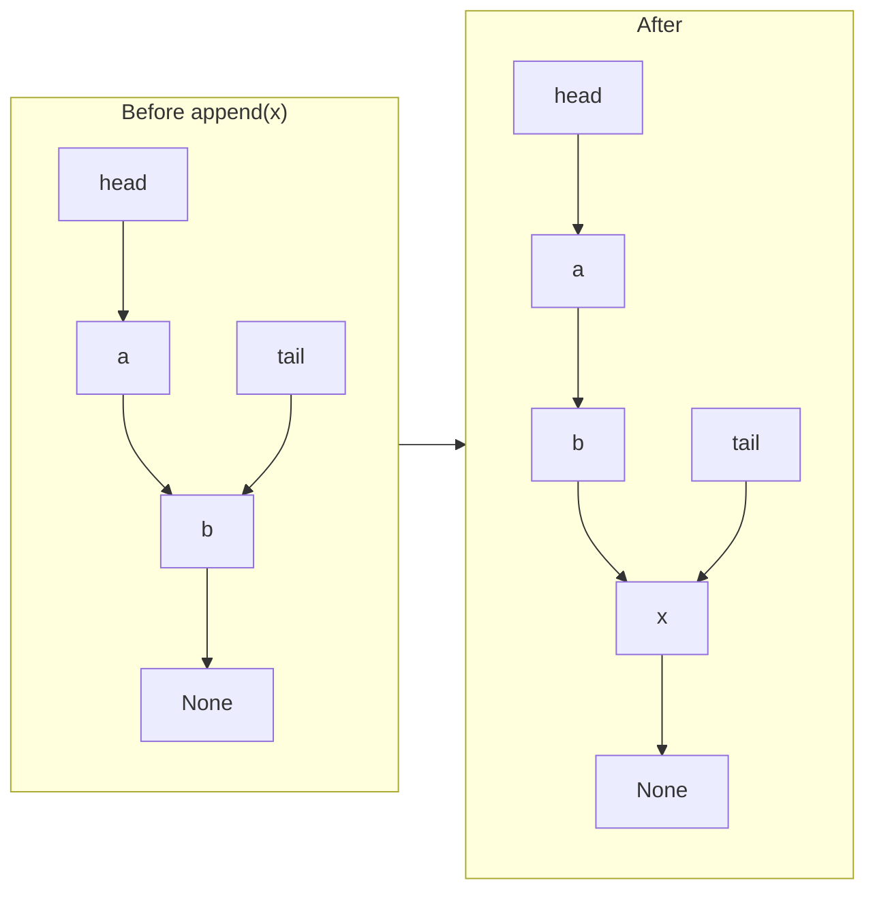
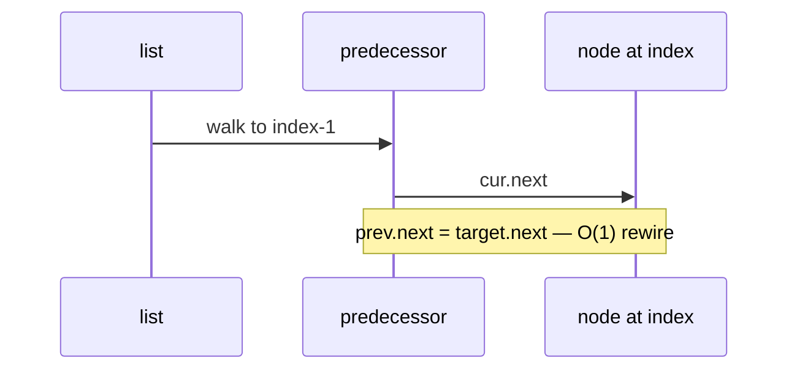
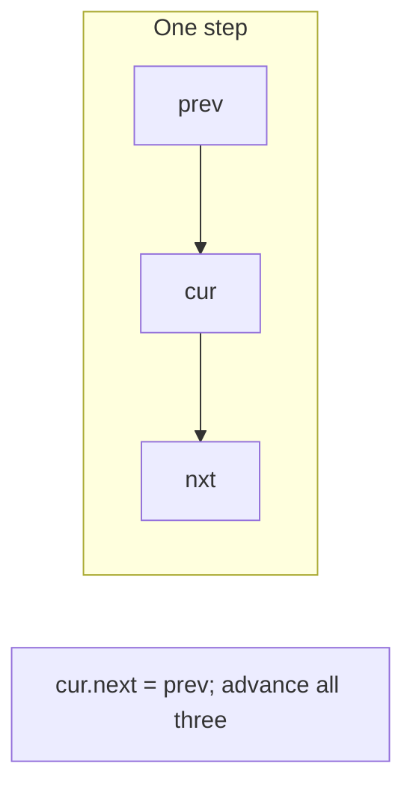
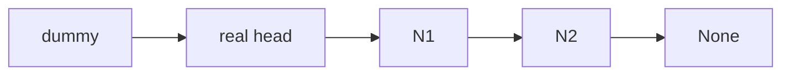
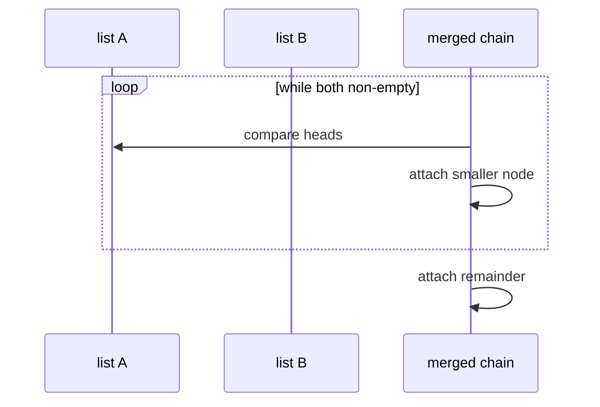

# Linked list

A linear collection stored as **nodes** that point to the next item—unlike a contiguous array, there is no index-based address arithmetic. You reach the *i*-th element only by following links from the **head**. In **NFL data analysis**, that shape shows up when you model a **sequence in order** (snaps in a drive, plays in a drive chain, events in a live feed) and care about **prepend/append at the ends** or **pointer-style merges** more than random access by index.

| | |
| --- | --- |
| **What it is** | Nodes in a chain: each holds a value (e.g. one snap dict or play id) and a link to the *next* node. The *head* is the entry to the list. |
| **Core operations** | Insert or delete at the head in O(1); traverse from the head for everything else. |
| **When to use** | Frequent insert/delete at the front (new snap arrives “at the top” of a working buffer), unknown or changing length, or algorithms defined as **rewiring** (reverse a drive chain, merge two sorted play streams). |
| **Trade-off** | Random access by index is O(n)—painful if you keep calling `get(i)` on thousands of plays; extra memory per node for `next`. Season tables and indexed lookups usually belong on a Python `list` or `dict`. |

Python has **no built-in singly linked list type**. You either implement nodes yourself (the best way to learn the ADT) or reach for tools that solve similar problems—`collections.deque` for a live play queue, or a `list` when you need `plays[i]` and vectorized pandas work. This page is your **ready reference** for singly linked lists in Python: structure, a complete implementation, every operation with examples, and **time and space complexity** on each. For Big-O notation and NFL-scale *n*, see [Complexity analysis](../../complexity/index.md).

[Parent: Data structures](../index.md)

---

## How a singly linked list differs from Python’s `list`

| | **Singly linked list** | **Python `list`** ([array-based list](../array-based-lists/index.md)) |
| --- | --- | --- |
| **Storage** | Scattered nodes linked by references | Contiguous array of references |
| **Access `i`-th item** | O(n) walk from head | O(1) index |
| **Insert at head** | O(1) | O(n) shift |
| **Insert at tail** | O(1) with tail pointer; O(n) without | Amortized O(1) `append` |
| **Insert in middle** | O(n) to find position; O(1) pointer rewiring once there | O(n) shift |
| **Cache behavior** | Poor (nodes may be far apart in memory) | Good (sequential slots) |
| **NFL-style workload** | One drive chain | Full play-by-play column, `plays[i]`, `groupby`, export to parquet |

In CPython, `list` is always a dynamic array. A “linked list” in Python is **your own classes**, not a language primitive. Your week-7 CSV belongs in a **`list` of dicts or a DataFrame**; a linked list is for **ordered chains** where pointer costs are the lesson or the algorithm (merge two sorted play-id chains without array shifts).



Throughout this page, **n** means the number of nodes in the list (e.g. snaps in one drive). **i** means a zero-based index. In production NFL pipelines, **n** per list is often small (one drive) while total plays in a season live in tables—do not confuse “linked list of one drive” with “50k-row play-by-play DataFrame.”

---

## NFL data analysis: what a linked list models

You will rarely store a full season in a hand-rolled `LinkedList`. The structure still matters because the **same costs** appear in custom code, interviews, and pointer-based algorithms you might use on **chunks** of data.

| NFL idea | Linked-list view | Typical *n* |
| --- | --- | --- |
| **Snaps in one drive** | Head = first snap; `next` = next snap in drive order | ~3–15 |
| **Live ingest buffer** | `prepend` newest tick; trim from tail when window exceeds *k* | window size *k* |
| **Merge two sorted streams** | Each stream is a chain sorted by `(game_id, play_id)`; merge without shifting a whole array | *n* + *m* |
| **Walk the chain** | Sum EPA, find first sack, detect cycle in bad test data | O(n) traverse |

**Reach for a Python `list` or pandas** when you filter 50,000 plays by team, sort receivers by yards, or need `plays[i]` in a loop. **Reach for a linked list (or `deque`)** when the problem is inherently **sequential** and **end-heavy**: stack of undo edits on a drive builder, merge sorted linked chains in a streaming join sketch, or learning how `insert(0)` on a `list` differs from O(1) `prepend`.

```python
class Snap:
    """Minimal snap record for examples on this page."""
    def __init__(self, play_id, epa, description):
        self.play_id = play_id
        self.epa = epa
        self.description = description

# After LinkedList is defined (see Reference implementation):
# drive = LinkedList([
#     Snap(101, 0.4, "1st & 10 pass"),
#     Snap(102, -1.2, "sack"),
#     Snap(103, 0.1, "3rd & long checkdown"),
# ])
```

Each node’s `data` can be a `Snap`, a `play_id`, or a row dict. `LinkedList` is defined in [Reference implementation](#reference-implementation) below; later sections use `Snap` in operation examples.

---

## Mental model: pointers, head, and tail

Each **node** stores:

1. **`data`** — the value (any Python object).
2. **`next`** — reference to the next node, or `None` at the end.

The **head** is the only handle the outside world needs to reach the whole chain (unless you also keep a **tail** reference for fast appends).

```mermaid
sequenceDiagram
  participant Client
  participant Head as head pointer
  participant N1 as node A
  participant N2 as node B
  participant N3 as node C
  Client->>Head: holds reference to first node
  Head->>N1: data = A
  N1->>N2: next
  N2->>N3: next
  N3->>N3: next = None
  Client->>Head: traverse: cur = head; cur = cur.next
```

**Three kinds of cost** (mirror the array-based list page):

| Kind | What you pay for | Linked list examples | NFL-flavored example |
| --- | --- | --- | --- |
| **Head change** | Rewire one or two pointers | `prepend`, `pop_head` | New live snap pushed to front of a scratch buffer |
| **Find position** | Walk up to *n* nodes | `get(i)`, `insert(i)`, `remove(value)` | “Third snap in this drive”—must walk from head |
| **Rewire after find** | Constant pointer updates | splice after predecessor | Insert penalty flag node after snap 2 without shifting a whole array |

---

## Node definition (foundation for everything)

Use a small class. The list **logic** lives in a wrapper class that holds `head` (and optionally `tail`, `size`).

```python
class Node:
    """One link in the chain."""
    def __init__(self, data, next=None):
        self.data = data
        self.next = next
```

| | |
| --- | --- |
| **Time** | O(1) to construct one node |
| **Space** | O(1) per node (value + `next` reference; object overhead applies in CPython) |



---

## Ways to create a linked list

### 1. Empty list — `head is None`

The canonical empty structure.

```python
head = None
```

| | |
| --- | --- |
| **Time** | O(1) |
| **Space** | O(1) |

### 2. Empty `LinkedList` wrapper

```python
class LinkedList:
    def __init__(self, values=None):
        self.head = None
        self.tail = None
        self.size = 0  # optional but useful for O(1) len

ll = LinkedList()
assert ll.head is None
```

| | |
| --- | --- |
| **Time** | O(1) |
| **Space** | O(1) |

### 3. Single-node list

```python
head = Node(42)
# or
head = Node("only", next=None)
```

| | |
| --- | --- |
| **Time** | O(1) |
| **Space** | O(1) for one node |

### 4. Build from an iterable — append at tail (forward order)

Preserves input order; needs O(n) steps (and a tail pointer for O(1) per append).

```python
def from_iterable(items):
    head = None
    tail = None
    for item in items:
        node = Node(item)
        if head is None:
            head = tail = node
        else:
            tail.next = node
            tail = node
    return head

play_ids = [401, 402, 403]  # one drive, chronological
chain = from_iterable(play_ids)
```

| | |
| --- | --- |
| **Time** | O(k) for *k* items (e.g. *k* snaps in a drive) |
| **Space** | O(k) nodes |

### 5. Build from an iterable — prepend at head (reversed order)

Each insert at head is O(1); result is **backwards** unless you reverse later.

```python
def from_iterable_reversed(items):
    head = None
    for item in items:
        head = Node(item, next=head)
    return head

chain = from_iterable_reversed([10, 20, 30])
# head -> 30 -> 20 -> 10 -> None
```

| | |
| --- | --- |
| **Time** | O(k) |
| **Space** | O(k) |

### 6. Constructor on a class

```python
class LinkedList:
    def __init__(self, values=None):
        self.head = None
        self.tail = None
        self.size = 0
        if values is not None:
            for value in values:
                self.append(value)

ll = LinkedList([1, 2, 3])
```

| | |
| --- | --- |
| **Time** | O(k) for *k* items with tail-tracked `append` |
| **Space** | O(k) |

### 7. Manual chain wiring (tests and diagrams)

```python
# 1 -> 2 -> 3
n3 = Node(3)
n2 = Node(2, next=n3)
n1 = Node(1, next=n2)
head = n1
```

| | |
| --- | --- |
| **Time** | O(k) |
| **Space** | O(k) |

### Creation cheat sheet


---

## Reference implementation

The sections below use this **complete** singly linked list (`LinkedList` class). Every method is documented with complexity in the following sections.

```python
class Node:
    def __init__(self, data, next=None):
        self.data = data # set node data to provided value
        self.next = next # set next node
   
class LinkedList:
    # initialize the linked list
    def __init__(self, values=None):
        self.head = None # set head pointer to None
        self.tail = None # set tail pointer to None
        self.next = None # set next pointer to None (unused for linked list instance)
        self.size = 0 # set initial size to 0

        if values is not None:
            for value in values:
                self.append(value)
   
    # print the linked list
    def __str__(self):
        """
        (1) Traverse the linked list and append the data of each node to a list.
        (2) Return a string representation of the linked list.
        """
        current = self.head # set starting point to head node
        out = [] # initialize output list
        while current: # iterate while current node is not None
            out.append(repr(current.data)) # append string representation of node data
            current = current.next # set current node to next node
        return f"LinkedList([{', '.join(out)}])" # return formatted string
   
    # represent the linked list
    def __repr__(self):
        return self.__str__() # call __str__ to return string representation

    # get the size of the linked list
    def __len__(self):
        return self.size # return size attribute

    def __iter__(self):
        """
        (1) Iterate over the linked list and yield each node's data.
        """
        cur = self.head # set starting point to head node
        while cur is not None: # iterate while cur node is not None
            yield cur.data # yield the current node's data
            cur = cur.next # set current node to next node

    # check if the linked list is empty
    def is_empty(self):
        """
        (1) Return True if the linked list is empty, False otherwise.
        """
        # if the head is None, then the linked list is empty
        return self.head is None # return True if head is None

    # prepend a node to the linked list
    def prepend(self, data):
        """
        (1) Create a new node with the given data and set its next pointer to the current head.
        (2) Update the linked list's head pointer to the new node.
        (3) Update the linked list's tail pointer to the new node only if the list was empty.
        (4) Update the size of the linked list.
        """
        # create a new node
        new_node = Node(data, next=self.head) # the new node's next pointer is the current head

        # update the head to the new node
        self.head = new_node # set head to new node
        
        # update tail only if the list was empty
        if self.tail is None:
            self.tail = new_node # set tail to new node if list was empty
        
        # update the size of the linked list
        self.size += 1 # increment size

    # append a node to the linked list
    def append(self, data):
        """
        (1) Create a new node with the given data and set its next pointer to None.
        (2) If the list is empty, set the head and tail to the new node.
        (3) If the list is not empty
            (a) set the next pointer of the current tail node to the new node
            (b) update the linked list's tail pointer to the new node.
        (4) Update the size of the linked list.
        """
        # create a new node
        node = Node(data) # create new node with given data

        # if the list is empty, set the head and tail to the new node
        if self.tail is None:
            self.head = self.tail = node # set head and tail to the new node
        else:
            # set the next pointer of the current tail to the new node
            self.tail.next = node # set current tail's next to new node
            # update the tail to the new node
            self.tail = node # set tail to new node
        
        # update the size of the linked list
        self.size += 1 # increment size

    def insert(self, index, data):
        """
        (1) Create a new node from data in argument
        (2) If the list is empty, set the head and tail to the new node.
        (3) If the list is not empty
            (a) set the next pointer of the current tail node to the new node
            (b) update the linked list's tail pointer to the new node.
        (4) Update the size of the linked list.
        """
        # if index is larger than the size of the linked list then append to end of linked list
        if index >= self.size:
            self.append(data) # append if index is out of range
            return
        
        # handle inserting a new head node
        if index == 0:
            self.prepend(data) # prepend if index is zero
            return
        
        # get the node right before the node that we want to insert
        prev = self._node_at(index - 1) # get node at index-1

        # create the node and set node next pointer to the next node after prev
        node = Node(data, next=prev.next) # create new node with next set to prev.next

        # set prev next node to the new node to append the new node to the linked list
        prev.next = node # set prev's next to new node

        # update linkedlist size
        self.size += 1 # increment size

    def pop_head(self):
        """
        (1) case: linkedlist is empty then raise IndexError
        (2) Handle: store current head data somewhere in memory 
        (3) case: single node linkedlist
        (4) case: multi node linkedlist
        (5) update the size of the linked list
        (6) return the data from the head node back to the caller
        """
        # case: linkedlist is empty
        if self.head is None: # case: linkedlist is empty then raise IndexError
            raise IndexError("pop from empty list") # raise error if list empty

        data = self.head.data # store current head data somewhere in memory

        # case: single node linkedlist
        if self.head.next is None:
            self.head = None # set head to None
            self.tail = None # set tail to None
        # case: multi node linkedlist
        else:
            self.head = self.head.next # set new head node
        
        # case: update size
        self.size -= 1 # update the size of the linked list

        # return the data from the head node back to the caller
        return data # return the data from the head node back to the caller

    def pop_tail(self):
        """
        (1) case: empty linkedlist
        (2) case: single node linkedlist
        (3) case: multinode linkedlist
        (4) update the size of the linked list
        (5) return the data from the tail node back to the caller
        """
        # case: empty linkedlist
        if self.head is None: # case: linkedlist is empty then raise IndexError
            raise IndexError("pop from empty list") # raise error if linkedlist is empty
        
        # case: single node linkedlist
        if self.head.next == None: # case: single node linkedlist then pop head node
            return self.pop_head() # pop head node and return the data from the head node back to the caller

        # case: multinode linkedlist
        else:
            prev = self._node_at(self.size - 2) # get second to last node
            data = prev.next.data # get data from last node
            prev.next = None # set second to last node's next pointer to None
            self.tail = prev # set new tail node
            self.size -= 1 # decrement size of linkedlist
            return data # return data to caller

    def remove(self, index):
        """
        (1) case: empty linkedlist
        (2) case: single node linkedlist
        (3) case: multi node linkedlist
        (4) update the size of the linked list
        (5) return the data from the node that was removed back to the caller
        """
        # case: empty linkedlist
        if index < 0 or index >= self.size:
            raise IndexError("index out of range") # case: index is out of range then raise IndexError
        
        # case: single node linkedlist
        if index == 0:
            return self.pop_head() # pop head node

        # case: multi node linkedlist
        else:         
            prev      = self._node_at(index - 1) # get the node right before the node that we want to remove
            cur       = prev.next # get current node
            prev.next = cur.next # remove node from list by setting prev node next node to current node next node

            # case: removed tail node
            if prev.next is None:
                self.tail = prev # set new tail node
        
        self.size -= 1 # decrement size of linkedlist
        return cur.data # return data to caller

    # helpers
    def get(self, index):
        """
        (1) Return the data found at a given index or raise
        """
        return self._node_at(index).data # get node at index and return data

    def set(self, index, data):
        """
        (1) Set data for a given node or raise
        """
        self._node_at(index).data = data # set node's data at given index

    # get the node at the given index
    def _node_at(self, index):
        """
        (1) case: index is out of range then raise IndexError
        (2) case: index is in range then traverse the linked list and return the node at the given index.
        """
        if index < 0 or index >= self.size:
            raise IndexError("index out of range") # case: index is out of range then raise IndexError
        cur = self.head # set starting point to head node
        for _ in range(index): # traverse the linked list
            cur = cur.next # set current node to next node in the linkedlist
        return cur # return the node at the given index

    def index_of(self, data):
        """
        (1) case: found data in linkedlist
        (2) case: no data found in linkedlist then raise ValueError
        """
        
        index = 0 # track iteration index starting at 0
        cur = self.head # set starting point to head node
        while cur is not None: # iterate while cur node next pointer is set
            if cur.data == data: # check if node data is equal to parameters data
                return index # case: is equal then is the data we need so return            
            cur = cur.next # case is not equal then set current node to next node in the linkedlist
            index += 1 # update index to move to next node in linkedlist
        raise ValueError() # raise here sense the data was not found in the linkedlist
    

    def contains(self, data):
        """
        (1) case: found data in linkedlist
        (2) case: no data found in linkedlist then return False
        """
        cur = self.head # set starting point to head node
        while cur is not None: # iterate while cur node next pointer is set
            if cur.data == data: # check if node data is equal to parameters data
                return True # case: is equal then is the data we need so return            
            cur = cur.next # case is not equal then set current node to next node in the linkedlist
        return False # case: no data found in linkedlist then return False

    def reverse(self):
        """
        (1) case: reverse the linkedlist
        """
        prev = None # set previous node to None
        cur = self.head # set current node to head node
        self.tail = self.head # set tail to head
        while cur is not None: # iterate while cur node next pointer is set
            nxt = cur.next # set next node to current node next node
            cur.next = prev # set current node next node to previous node
            prev = cur # set previous node to current node
            cur = nxt # set current node to next node
        self.head = prev # set head to previous node

    def to_list(self):
        """
        Converts the linked list to a Python list.

        (1) Iterates over the linked list using the __iter__ method, 
            which yields each node's data in order.
        (2) Uses the built-in list() function to collect these values into a list.
        (3) Returns the resulting list.
        """
        return list(self) # convert linked list to python list and return result
    
    def clear(self):
        """
        (1) Clear the linked list by setting the head and tail to None and the size to 0.
        """
        self.head = None # set head to None
        self.tail = None # set tail to None
        self.size = 0 # set size to 0


    def extend(self, other):
        """
        (1) Extend the linked list by appending all nodes from another linked list.
        """
        self.tail.next = other.head # set current tail's next to other head
        self.tail = other.tail # set new tail to other tail
        self.size += other.size # update size by adding other size

    def sort(self):
        """
        (1) Sort the linked list using the built-in sorted function.
        """
        nodes = self.to_list() # convert linked list to python list
        nodes.sort() # sort the linked list using the built-in sorted function
        self.clear() # clear the linked list
        for node in nodes: # iterate through the sorted nodes
            self.append(node) # append the sorted nodes to the linked list
```

---

## All operations (with examples and complexity)

Examples below use small integers or strings where the focus is pointer mechanics. In an NFL script, the same methods apply when `data` is a `Snap`, a `play_id`, or a row dict—costs depend on **chain length**, not on whether `data` is a float or a dict.



### `is_empty()` / `len(ll)`

```python
ll = LinkedList()
assert ll.is_empty()
assert len(ll) == 0

ll.append(1)
assert not ll.is_empty()
assert len(ll) == 1
```

| | |
| --- | --- |
| **Time** | O(1) when `size` is maintained; O(n) if you walk the chain each time |
| **Space** | O(1) |

---

### `prepend(data)` — insert at head

New node points to old head; update `head` (and `tail` if list was empty).

```python
# Generic
ll = LinkedList([2, 3])
ll.prepend(1)
assert list(ll) == [1, 2, 3]

# NFL: newest correction snap at head of a working drive (rare in prod; illustrative)
buffer = LinkedList([Snap(201, 0.2, "run"), Snap(202, -0.5, "incomplete")])
buffer.prepend(Snap(200, 0.0, "penalty reversed — re-snap"))
```

| | |
| --- | --- |
| **Time** | O(1) |
| **Space** | O(1) auxiliary (one new node) |

**NFL note:** Prepending every play of a season would still be Θ(n) nodes total; you are choosing O(1) **per prepend**, not O(1) for the whole dataset.



---

### `append(data)` — insert at tail

With a **tail pointer**, no traversal. Without tail, each append is O(n).

```python
ll = LinkedList()
ll.append("a")
ll.append("b")
assert list(ll) == ["a", "b"]

# NFL: build drive in chronological order (tail append + tail pointer)
drive = LinkedList()
drive.append(Snap(1, 0.3, "rush"))
drive.append(Snap(2, 1.1, "TD pass"))
```

| | |
| --- | --- |
| **Time** | O(1) with `tail`; O(n) if only `head` |
| **Space** | O(1) auxiliary per append |

**NFL note:** Appending each snap as a drive is parsed matches live ingest: O(1) amortized per snap **if** you keep `tail`, same idea as [array-based list](../array-based-lists/index.md) `append` on a growing table.



---

### `insert(index, data)` — insert before position `index`

Index `0` delegates to `prepend`. Otherwise find the **predecessor** at `index - 1` and splice in.

```python
ll = LinkedList([10, 30])
ll.insert(1, 20)
assert list(ll) == [10, 20, 30]

ll.insert(0, 5)
assert list(ll) == [5, 10, 20, 30]
```

| | |
| --- | --- |
| **Time** | O(n) — O(i) to find position + O(1) rewire |
| **Space** | O(1) auxiliary |

```mermaid
flowchart TD
  S([insert at index i])
  S --> Z{i == 0?}
  Z -->|yes| P[prepend — O(1)]
  Z -->|no| W[walk i-1 steps to predecessor]
  W --> R[rewire: prev.next = new; new.next = old next]
```

---

### `get(index)` / `set(index, data)`

No shortcut: walk from head.

```python
ll = LinkedList(["a", "b", "c"])
assert ll.get(1) == "b"
ll.set(1, "B")
assert ll.get(1) == "B"
```

| | |
| --- | --- |
| **Time** | O(n) worst case (index near end); O(i) for index `i` |
| **Space** | O(1) |

**NFL note:** “Give me snap index 7 in this drive” without a `list` backing store is O(i) pointer hops. If you need random snap access repeatedly, materialize `drive.to_list()` once or keep a Python `list` for that drive.

---

### `pop_head()` — remove first element

```python
ll = LinkedList([1, 2, 3])
assert ll.pop_head() == 1
assert list(ll) == [2, 3]
```

| | |
| --- | --- |
| **Time** | O(1) |
| **Space** | O(1) |

---

### `pop_tail()` — remove last element

Singly linked list needs the **predecessor** of the tail—full scan O(n).

```python
ll = LinkedList([1, 2, 3])
assert ll.pop_tail() == 3
assert list(ll) == [1, 2]
```

| | |
| --- | --- |
| **Time** | O(n) |
| **Space** | O(1) |

For O(1) pops at both ends in Python, use `collections.deque` ([deque](../dequeue-deque/index.md)) or a [doubly linked list](../doubly-linked-list/index.md).

---

### `remove(index)` — delete by position

```python
ll = LinkedList([10, 20, 30])
assert ll.remove(1) == 20
assert list(ll) == [10, 30]
```

| | |
| --- | --- |
| **Time** | O(n) |
| **Space** | O(1) |



---

### `index_of(data)` / `contains(data)`

Linear search.

```python
ll = LinkedList(["x", "y", "z"])
assert ll.index_of("y") == 1
assert ll.contains("z")
assert not ll.contains("w")
# ll.index_of("w")  # ValueError
```

| | |
| --- | --- |
| **Time** | O(n) |
| **Space** | O(1) |

---

### `clear()`

Drop `head` (and `tail`); let garbage collection reclaim nodes.

```python
ll = LinkedList([1, 2, 3])
ll.clear()
assert ll.is_empty() and len(ll) == 0
```

| | |
| --- | --- |
| **Time** | O(1) to clear references; O(n) if you iterate to free explicitly |
| **Space** | O(1) |

---

### `reverse()` — in-place reverse

Iterative three-pointer walk (`prev`, `cur`, `nxt`); update `head` and `tail`.

```python
ll = LinkedList([1, 2, 3])
ll.reverse()
assert list(ll) == [3, 2, 1]
```

| | |
| --- | --- |
| **Time** | O(n) |
| **Space** | O(1) auxiliary |



Recursive reverse (educational):

```python
def reverse_recursive(head):
    if head is None or head.next is None:
        return head
    new_head = reverse_recursive(head.next)
    head.next.next = head
    head.next = None
    return new_head
```

| | |
| --- | --- |
| **Time** | O(n) |
| **Space** | O(n) call stack depth |

---

### `extend(other)` / `to_list()`

`extend` splices another `LinkedList` onto the tail in O(1) pointer steps (no new nodes). The constructor `LinkedList(values)` builds from an iterable by calling `append` for each item.

```python
ll = LinkedList([1, 2, 3])
tail = LinkedList([4, 5])
ll.extend(tail)
assert ll.to_list() == [1, 2, 3, 4, 5]
assert tail.to_list() == [4, 5]  # nodes are shared, not copied
```

| Operation | Time | Space |
| --- | --- | --- |
| `extend` | O(1) pointer splice | O(1) — reuses `other`'s nodes |
| `to_list` | O(n) | O(n) new Python `list` |

---

### `sort()` — in-place sort via materialize

Converts to a Python `list`, sorts in place, clears the chain, and rebuilds with `append`. Simple and correct; not an in-node pointer sort.

```python
ll = LinkedList([3, 1, 4, 2])
ll.sort()
assert ll.to_list() == [1, 2, 3, 4]
```

| | |
| --- | --- |
| **Time** | O(n log n) — dominated by Python's Timsort |
| **Space** | O(n) for the temporary `list` |

---

### Iteration: `for x in ll` / `__iter__`

```python
ll = LinkedList([10, 20, 30])
total = sum(x for x in ll)
assert total == 60

# NFL: one pass over a drive chain — O(n) in snaps on this drive
drive = LinkedList([Snap(1, 0.5, "a"), Snap(2, -0.3, "b"), Snap(3, 0.2, "c")])
drive_epa = sum(s.epa for s in drive)
```

| | |
| --- | --- |
| **Time** | O(n) full traversal |
| **Space** | O(1) auxiliary |

This is the right pattern for **aggregate on a chain** (sum EPA, count sacks). For **aggregate on a full season**, traverse a table or column once—still O(n), but *n* is all plays and the structure should be a `list`/DataFrame, not a linked list of 50k nodes.

Manual walk (no wrapper class):

```python
def walk(head):
    cur = head
    while cur is not None:
        print(cur.data)
        cur = cur.next
```

---

## Low-level pointer operations (no class)

Useful in interviews and for understanding splice logic.

### Insert after a known node (not necessarily head)

You already hold reference `node`; no search.

```python
def insert_after(node, data):
    node.next = Node(data, next=node.next)
```

| | |
| --- | --- |
| **Time** | O(1) |
| **Space** | O(1) |

### Delete `node` when you only have the node (singly linked)

**Cannot** delete an arbitrary node in O(1) without the predecessor—unless you copy next node’s data into current (hack used only when mutation of values is allowed).

### Dummy head sentinel

Simplifies “delete head” and “insert before head” in one uniform loop.

```python
def remove_all_greater_than(head, limit):
    dummy = Node(0, next=head)
    prev = dummy
    while prev.next is not None:
        if prev.next.data > limit:
            prev.next = prev.next.next
        else:
            prev = prev.next
    return dummy.next
```

| | |
| --- | --- |
| **Time** | O(n) |
| **Space** | O(1) extra (dummy node) |



---

## Master complexity table

Let **n** = `len(ll)`, **i** = index. For NFL work, map **n** to the chain you are holding (snaps in one drive, nodes in a merge sketch)—not season row count unless you mistakenly built one giant linked list.

| Operation | Time | Space (auxiliary) | Notes |
| --- | --- | --- | --- |
| Create empty | O(1) | O(1) | |
| Build from *k* items (tail append) | O(k) | O(k) nodes | |
| Build from *k* items (head prepend) | O(k) | O(k) | reversed order |
| `prepend` | O(1) | O(1) | |
| `append` (with tail) | O(1) | O(1) | |
| `append` (head only) | O(n) | O(1) | |
| `insert(i)` | O(n) | O(1) | find + splice |
| `get` / `set` at `i` | O(i) ≤ O(n) | O(1) | |
| `pop_head` | O(1) | O(1) | |
| `pop_tail` | O(n) | O(1) | singly linked |
| `remove(i)` | O(n) | O(1) | |
| `index_of` / `contains` | O(n) | O(1) | |
| `len` (cached) | O(1) | O(1) | |
| `len` (walk) | O(n) | O(1) | |
| `clear` | O(1) | O(1) | drop head |
| `reverse` iterative | O(n) | O(1) | |
| `reverse` recursive | O(n) | O(n) stack | |
| `extend` (splice `LinkedList`) | O(1) | O(1) | reuses nodes from `other` |
| `sort` | O(n log n) | O(n) | materialize + Timsort + rebuild |
| `to_list` | O(n) | O(n) | |
| Traverse all | O(n) | O(1) | sum EPA on one drive chain |

**Storage for the whole structure:** Θ(n) nodes, each O(1) extra for `next` (and object headers in CPython). Storing a full season as nodes costs Θ(season plays) memory with poor locality—use tabular storage instead.

---

## Classic patterns (with complexity)

These patterns appear in structure-heavy interview questions; they also describe **one-pass** logic you might apply to a **short** NFL chain (one drive, two merged game logs) before you reach for pandas.

### Two pointers: find middle

Slow moves 1 step, fast moves 2; when fast hits end, slow is middle. On a drive chain, that is the middle **snap node** without knowing length ahead of time (still O(n); `size` on the class makes it O(1) if you trust cached length).

```python
def middle_node(head):
    slow = fast = head
    while fast is not None and fast.next is not None:
        slow = slow.next
        fast = fast.next.next
    return slow
```

| | |
| --- | --- |
| **Time** | O(n) |
| **Space** | O(1) |

### Detect cycle (Floyd)

If fast meets slow inside a cycle, loop exists.

```python
def has_cycle(head):
    slow = fast = head
    while fast is not None and fast.next is not None:
        slow = slow.next
        fast = fast.next.next
        if slow is fast:
            return True
    return False
```

| | |
| --- | --- |
| **Time** | O(n) |
| **Space** | O(1) |

### Merge two sorted lists

**NFL use:** Two chains sorted by `play_id` (e.g. first-half and second-half plays already sorted) can be merged into one chronological chain in O(n + m) pointer steps—no array shifts. Production merges usually sort keys in pandas/SQL; the linked version teaches the combine step.

```python
def merge_sorted(a, b):
    dummy = Node(0)
    tail = dummy
    while a is not None and b is not None:
        if a.data <= b.data:
            tail.next = a
            a = a.next
        else:
            tail.next = b
            b = b.next
        tail = tail.next
    tail.next = a if a is not None else b
    return dummy.next
```

| | |
| --- | --- |
| **Time** | O(n + m) |
| **Space** | O(1) auxiliary (relinks existing nodes) |



---

## Python stdlib: what to use instead

| Need | Prefer | Why |
| --- | --- | --- |
| Fast indexing, slicing | `list` | O(1) index; cache-friendly |
| Full play-by-play season | `list` / **pandas** / parquet | Random access, vectorized stats, joins by `player_id` |
| Queue / stack at both ends | `collections.deque` | O(1) `append` / `pop` both ends—live play queue, rolling window |
| Player lookup by id | `dict` | O(1) average after index build—not a linked list |
| Ordered mapping | `dict` (3.7+ insertion order) | Roster order sketches; not pointer chains |
| Learning / interviews | `Node` + `LinkedList` (this page) | Pointer discipline |
| Merge / reverse on **nodes** | Custom linked list or algorithm on `Node` | Teaches merge-sort chain step |

```python
from collections import deque

# Rolling last-k play_ids from a live feed (O(1) ends)
recent = deque(maxlen=10)
recent.append(9021)
recent.appendleft(9020)  # optional: treat as newest at left
```

`deque` is **not** a singly linked list you implement in Python—it is a C-level block deque. Treat it as the practical NFL tool when the *reason* you wanted a linked list was O(1) push/pop at both ends of a **small** buffer.

---

## Linked list vs Python `list` — when to choose which


| Scenario | Linked list | Python `list` |
| --- | --- | --- |
| `get(i)` in a loop | O(n) each — painful | O(1) |
| Prepend in a tight loop | O(1) each | O(n) per `insert(0)` |
| Memory per element | Value + `next` + object overhead | One reference in array |
| Merge sort on sequence | Natural for linked nodes | [Merge sort](../../algorithms/merge-sort/index.md) often uses arrays in Python |
| Season play-by-play analytics | Wrong default structure | `DataFrame` / `list` of rows + `dict` indexes |
| One drive, algorithm homework | Clear teaching model | Still fine to use `list` in prod for one drive |

---

## Common pitfalls

| Pitfall | Why it hurts | Better approach |
| --- | --- | --- |
| Losing `head` reference | Rest of chain unreachable | Always assign to `self.head` or return new head |
| No `tail` but frequent `append` | O(n²) builds | Keep `tail` pointer |
| `pop_tail` on singly linked list | Must scan to predecessor | Doubly linked list or `deque` |
| `remove(node)` without predecessor | Cannot rewire in O(1) | Pass predecessor or use dummy head |
| `extend` shares nodes with `other` | Mutating one list affects both | Copy data with `to_list()` + rebuild if isolation matters |
| Using linked list for `xs[i]` hot paths | O(n) per access | `list` or array |
| Storing full season as nodes | Huge overhead, slow scans | Parquet/CSV → pandas; index players with `dict` |
| `get(i)` for every snap in every drive | O(drives × snaps²) if nested wrong | Store drive as `list` or one traverse per drive |
| Confusing chain *n* with table *n* | Mis-estimate Big-O | Name *n*: snaps in **this** list only |

---

## Related structures in this guide

| Structure | Difference |
| --- | --- |
| [Array-based lists](../array-based-lists/index.md) | Contiguous dynamic array; Python `list` |
| [Doubly linked list](../doubly-linked-list/index.md) | `prev` pointer; O(1) delete with node reference |
| [Circularly linked list](../circularly-linked-list/index.md) | Last `next` points to head; round-robin |
| [Stacks](../stacks/index.md) | LIFO—often `list.append` / `pop` or linked head |
| [Queue](../queue/index.md) | FIFO—`deque` over singly linked `pop(0)` |

Official Python sequences tutorial (arrays, not linked lists): [Data Structures — More on Lists](https://docs.python.org/3/tutorial/datastructures.html#more-on-lists).

---

## Quick reference card

```python
# node + empty list
head = None
ll = LinkedList([1, 2, 3])

# O(1) at head — e.g. prepend correction snap
ll.prepend(0)
x = ll.pop_head()

# O(1) at tail (with tail pointer) — e.g. append next snap in drive
ll.append(4)

# O(n) — search / index / tail pop (avoid in season-wide loops)
ll.get(i)
ll.insert(i, x)
ll.remove(i)
ll.pop_tail()
ll.extend(other_ll)
ll.sort()

# O(n) once per drive — sum EPA, export to list
for snap in ll:
    ...
```

Use a singly linked list when the **algorithm** is defined in terms of pointer rewiring (merge, reverse, cycle detection) or when inserts at the **head** dominate—often on **small** NFL chains (one drive, two sorted streams). Use Python’s `list`, **pandas**, or `deque` when the **machine and library** should carry season-scale load.

**NFL pipeline checklist**

1. **Default** — Play-by-play table in pandas/`list`; player index in `dict`.
2. **Chain** — Use linked list (or `deque`) only when order and O(1) ends matter for a **bounded** buffer or exercise.
3. **Count *n*** — Snaps in this drive, not rows in the season file.
4. **Hot loop** — Never `get(i)` inside `for each play in season`; walk the chain once or vectorize.
