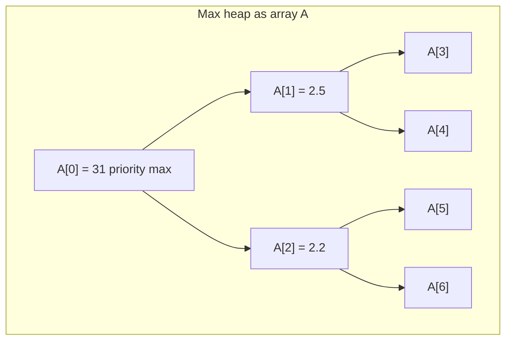
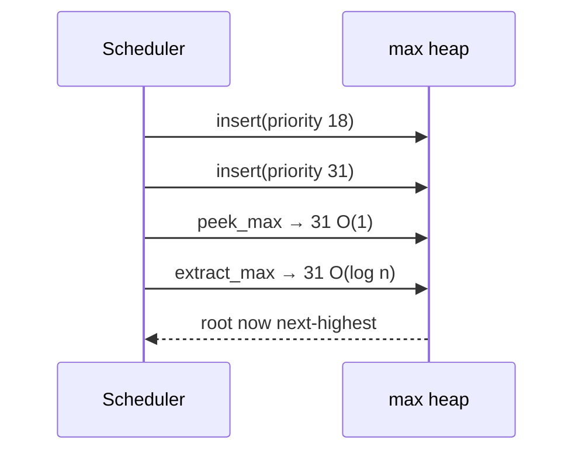
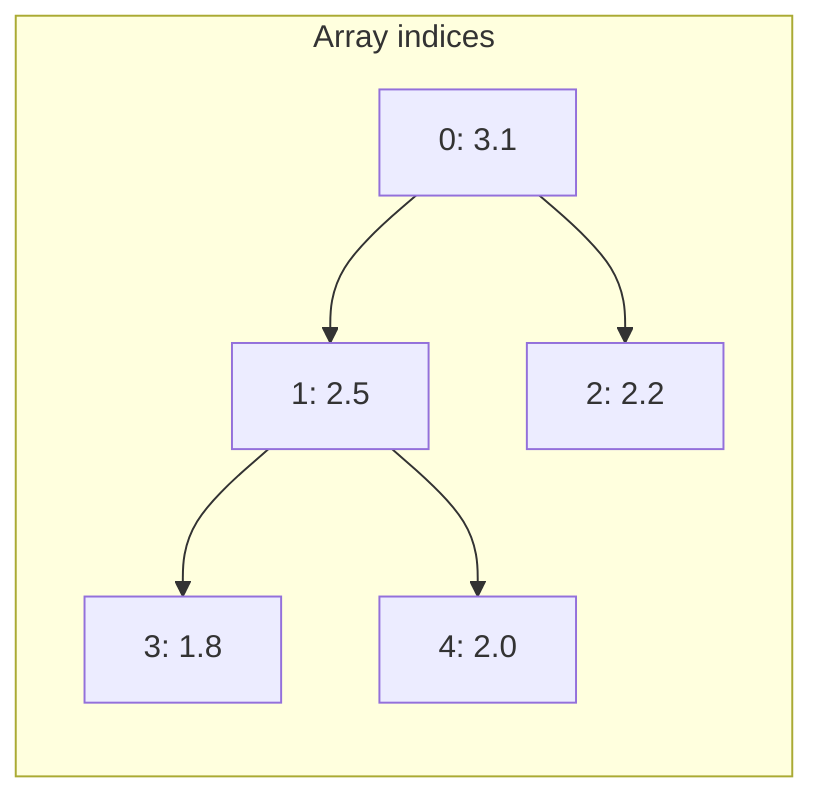
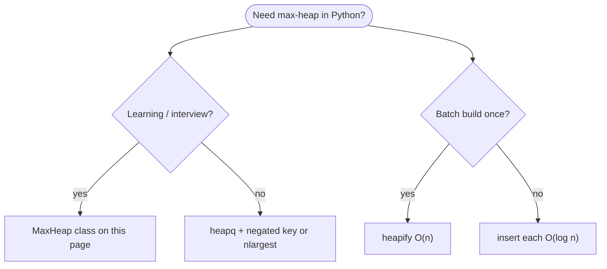
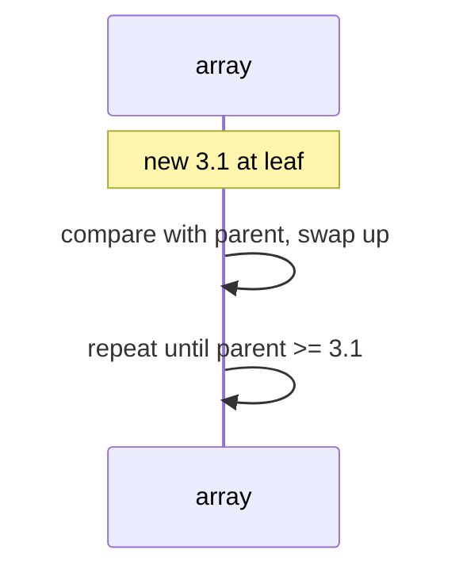
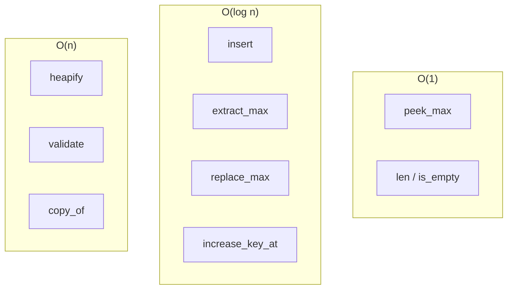
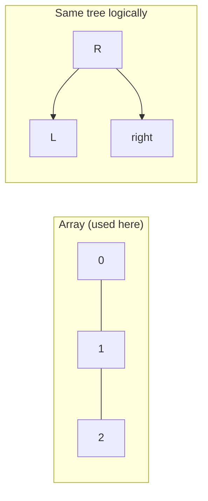
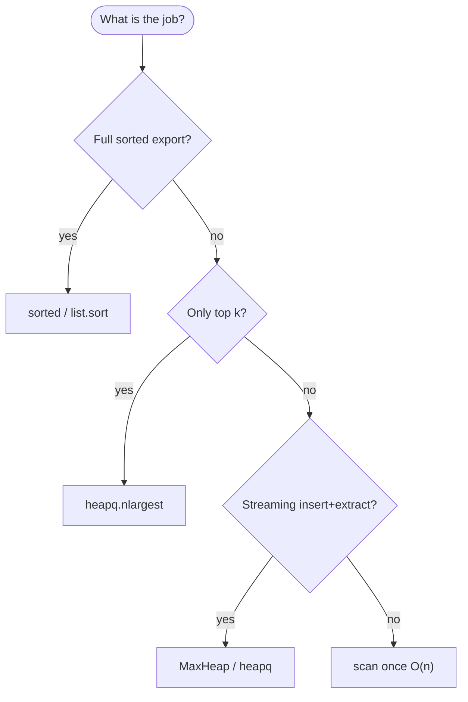

# Max heap

A **complete binary tree** stored in an array where each **parent’s key is ≥ every key in its subtrees** (the **max-heap property**). The largest element always sits at index `0`.

| | |
| --- | --- |
| **What it is** | A binary tree with no gaps in the last level, usually represented as a Python `list` with index formulas instead of child pointers. |
| **Core operations** | `insert`, `extract_max`, `peek_max`, `heapify`—each touches at most tree height O(log n). |
| **When to use** | Top-k selection, priority schedulers, event timers, building blocks for [heap sort](../heap-sort/index.md) and [priority queues](../priority-queue/index.md). |
| **Trade-off** | No sorted order across the whole array—only the root is guaranteed maximal; `heapq` in Python is a **min-heap** by default. |

A max heap is the right mental model for **“always pull the highest-priority item next”**: the **most urgent job** in a scheduler queue, the **highest score** in a top-k leaderboard, or the **next expiring timer** in an event loop. You will still rank large batches with **`sorted`** or **`heapq.nlargest`** in production scripts—implement **`MaxHeap`** here to learn the structure and to pass interviews.

This page is your **ready reference**: array indexing, a complete Python `MaxHeap` class, every way to create a heap, every operation with scheduler and top-k examples, and **time and space complexity** on each. For Big-O notation, see [Complexity analysis](../../complexity/index.md).

[Parent: Data structures](../index.md)

---

## What a max heap models

| Use case | Heap view | Why max at root |
| --- | --- | --- |
| **Priority scheduler** | Root = highest-priority pending job | O(1) peek, O(log n) extract |
| **Top-k leaderboard** | Size-k heap or repeated extract | Keep only k best without full sort |
| **Event timer queue** | Key = deadline or urgency score | Process next expiring event first |
| **Live “best so far”** | Single-element peek while streaming | Compare new candidate vs root in O(1) |
| **Heap sort warm-up** | Same array + `sift_down` | [Heap sort](../heap-sort/index.md) drains max to sorted suffix |

**Use `heapq.nlargest` or `sorted`** when you need top-k from a large batch once. **Use a max heap** when you **interleave inserts and extracts** on a **moderate** in-memory set (scheduler, simulation, teaching).



Throughout this page, **n** is the number of elements in the heap (e.g. jobs in one scheduler batch). **h** = ⌊log₂ n⌋ is tree height. In production services, **n** per heap is often moderate while full history lives in databases or logs.

---

## Max heap vs min heap vs sorted list vs `heapq`

| | **Max heap** | **Min heap** | **Sorted `list`** | **`heapq` (stdlib)** |
| --- | --- | --- | --- | --- |
| **Extreme at top** | Maximum | Minimum | Min at `[0]`, max at `[-1]` | Minimum |
| **`insert`** | O(log n) | O(log n) | O(n) insert + keep sorted | O(log n) |
| **`extract_best`** | O(log n) max | O(log n) min | O(1) pop end; O(n) pop front | O(log n) min |
| **`peek`** | O(1) max | O(1) min | O(1) either end | O(1) min |
| **Full order visible** | No | No | Yes | No |
| **Typical Python choice** | Teach / custom | Dijkstra, schedules | Full sorted export | `nlargest` via negated keys |



---

## Mental model: complete tree in an array

A **complete** binary tree fills levels left to right—no gaps until the last row. Store it in array `A`:

| Index relation | Formula (0-based) |
| --- | --- |
| **Parent of `i`** | `(i - 1) // 2` for `i > 0` |
| **Left child of `i`** | `2 * i + 1` |
| **Right child of `i`** | `2 * i + 2` |
| **Last parent** | `(n // 2) - 1` when `n > 0` |

**Max-heap property:** for every node `i` (except root’s children logic), `A[parent(i)] ≥ A[i]`.



| Step | Cost driver |
| --- | --- |
| One `sift_up` / `sift_down` | O(log n) comparisons/swaps |
| `heapify` all nodes | O(n) — not O(n log n) |

---

## Example data types

```python

from dataclasses import dataclass, field


@dataclass(order=True, slots=True)
class PrioritizedJob:
 neg_priority = 0.0
 job_id= field(compare=False)
 label= field(compare=False, default="")


@dataclass(frozen=True, slots=True)
class Task:
 task_id = 0
 priority = 0.0
 label = ""


@dataclass(frozen=True, slots=True)
class TimedEvent:
 name = ""
 urgency = 0.0
 deadline_ms = 0
```

---

## Ways to create a max heap

### 1. Empty `MaxHeap`

```python
heap = MaxHeap()
assert heap.is_empty()
```

| | |
| --- | --- |
| **Time** | O(1) |
| **Space** | O(1) |

### 2. Insert one-by-one (online build)

Each `insert` sift-up—O(log n) per item → **O(n log n)** total for n inserts.

```python
h = MaxHeap()
for task in pending_tasks:
 h.insert(task.priority, task)
```

| | |
| --- | --- |
| **Time** | O(n log n) for n items |
| **Space** | O(n) |

### 3. `heapify` from existing array (offline build)

Floyd’s method: sift-down from last parent to root—**O(n)**.

```python
priorities = [18, 31, 22, 25, 20]
h = MaxHeap.from_iterable(priorities)
```

| | |
| --- | --- |
| **Time** | O(n) |
| **Space** | O(n) copy if you keep original |

### 4. Build from list literal inside wrapper

```python
h = MaxHeap([3.1, 2.5, 2.2, 1.8])
```

| | |
| --- | --- |
| **Time** | O(n) after `heapify` |
| **Space** | O(n) |

### 5. Copy from another `MaxHeap`

```python
h2 = MaxHeap.copy_of(h)
```

| | |
| --- | --- |
| **Time** | O(n) |
| **Space** | O(n) |

### 6. `heapq` min-heap with negated keys (production idiom)

Python stdlib has **min-heap** only; negate scores for “max” behavior.

```python
import heapq

min_heap= []
heapq.heappush(min_heap, (-task.priority, task))
best = heapq.heappop(min_heap)[1]
```

| | |
| --- | --- |
| **Time** | Same O(log n) per op |
| **Space** | O(n) |



---

## Reference implementation: `MaxHeap`

Generic max heap over comparable keys with optional satellite data (e.g. attach a `Task` at each priority score).

```python

from dataclasses import dataclass


@dataclass
class _Entry:
 key = None
 value= None


class MaxHeap:
 def __init__(self, items= None):
 self._data= []
 if items is not None:
 for k in items:
 self._data.append(_Entry(k))
 self.heapify()

 @classmethod
 def from_pairs(cls, pairs):
 h= cls()
 for key, value in pairs:
 h._data.append(_Entry(key, value))
 h.heapify()
 return h

 @classmethod
 def copy_of(cls, other):
 out= cls()
 out._data = [_Entry(e.key, e.value) for e in other._data]
 return out

 def __len__(self):
 return len(self._data)

 def is_empty(self):
 return len(self._data) == 0

 def clear(self):
 self._data.clear()

 def peek_max(self):
 if not self._data:
 raise IndexError("peek_max from empty heap")
 return self._data[0].key

 def peek_entry(self):
 if not self._data:
 raise IndexError("peek from empty heap")
 e = self._data[0]
 return e.key, e.value

 def insert(self, key, value= None):
 self._data.append(_Entry(key, value))
 self._sift_up(len(self._data) - 1)

 def extract_max(self):
 key, _ = self.extract_entry()
 return key

 def extract_entry(self):
 if not self._data:
 raise IndexError("extract_max from empty heap")
 root = self._data[0]
 last = self._data.pop()
 if self._data:
 self._data[0] = last
 self._sift_down(0)
 return root.key, root.value

 def replace_max(self, key, value= None):
 if not self._data:
 self.insert(key, value)
 return key
 old = self._data[0].key
 self._data[0] = _Entry(key, value)
 self._sift_down(0)
 self._sift_up(0)
 return old

 def increase_key_at(self, index, new_key):
 if not (0 <= index < len(self._data)):
 raise IndexError(index)
 if new_key < self._data[index].key:
 raise ValueError("new_key must be >= current key for increase_key")
 self._data[index].key = new_key
 self._sift_up(index)

 def heapify(self):
 n = len(self._data)
 for i in range(n // 2 - 1, -1, -1):
 self._sift_down(i)

 def to_list(self):
 return [e.key for e in self._data]

 def validate(self):
 for i in range(1, len(self._data)):
 p = (i - 1) // 2
 if self._data[p].key < self._data[i].key:
 return False
 return True

 def _parent(self, i):
 return (i - 1) // 2

 def _left(self, i):
 return 2 * i + 1

 def _right(self, i):
 return 2 * i + 2

 def _sift_up(self, i):
 while i > 0:
 p = self._parent(i)
 if self._data[p].key >= self._data[i].key:
 break
 self._data[p], self._data[i] = self._data[i], self._data[p]
 i = p

 def _sift_down(self, i):
 n = len(self._data)
 while True:
 largest = i
 left = self._left(i)
 right = self._right(i)
 if left < n and self._data[left].key > self._data[largest].key:
 largest = left
 if right < n and self._data[right].key > self._data[largest].key:
 largest = right
 if largest == i:
 break
 self._data[i], self._data[largest] = self._data[largest], self._data[i]
 i = largest

 def __iter__(self):
 for e in self._data:
 yield e.key
```

| | |
| --- | --- |
| **Time** | See per-operation table below |
| **Space** | O(n) for n stored keys |

---

## Core helpers: `sift_up` and `sift_down`

### `sift_up(i)` — after insert at leaf

Bubble node at `i` toward root while it is larger than its parent.

```python
h = MaxHeap()
h.insert(1.8)
h.insert(3.1)
assert h.peek_max() == 3.1
```

| | |
| --- | --- |
| **Time** | O(log n) |
| **Space** | O(1) |



---

### `sift_down(i)` — after extract or heapify step

Push node at `i` down by swapping with larger child until both children ≤ it.

```python
h = MaxHeap([3.1, 2.5, 2.2, 1.8])
h.extract_max()
```

| | |
| --- | --- |
| **Time** | O(log n) |
| **Space** | O(1) |

---

### `heapify()` — O(n) build

```python
scores = [4, -12, 8, 1, 9, -3]
h = MaxHeap(scores)
assert h.validate()
```

| | |
| --- | --- |
| **Time** | O(n) |
| **Space** | O(1) auxiliary |

**Why O(n)?** Most nodes are near leaves; few sift-down steps reach full height. Sum of work is linear (CLRS aggregate analysis).

---

## All operations (with examples and complexity)



### `insert(key, value=None)`

```python
scheduler = MaxHeap.from_pairs([])
scheduler.insert(42, Task(101, 42, "retry webhook"))
scheduler.insert(91, Task(102, 91, "page on-call"))
```

| | |
| --- | --- |
| **Time** | O(log n) |
| **Space** | O(1) aux; O(1) amortized array growth |

Stream tasks into a “highest priority so far” structure during incremental ingest.

---

### `peek_max()` / `peek_entry()`

```python
top_priority = scheduler.peek_max()
key, task = scheduler.peek_entry()
```

| | |
| --- | --- |
| **Time** | O(1) |
| **Space** | O(1) |

Does not remove—safe to inspect before committing extract in a UI.

---

### `extract_max()` / `extract_entry()`

```python
while not scheduler.is_empty():
 priority, task = scheduler.extract_entry()
 print(task.label, priority)
```

| | |
| --- | --- |
| **Time** | O(log n) |
| **Space** | O(1) |

Drain queue from highest priority downward—same order as repeated max selection; n extracts total O(n log n).

---

### `replace_max(key, value=None)`

Pop-max + push combined—one sift-up and sift-down path from root.

```python
stream = MaxHeap([0.5])
old = stream.replace_max(90, Task(1, 90, "deadline bumped"))
```

| | |
| --- | --- |
| **Time** | O(log n) |
| **Space** | O(1) |

Useful when sliding window max changes by one new candidate per step.

---

### `increase_key_at(index, new_key)`

Decrease-key is harder without extra indirection; increase-key is O(log n) sift-up.

| | |
| --- | --- |
| **Time** | O(log n) |
| **Space** | O(1) |

Production heaps often store **`(key, id)`** with a **`id → index`** map for arbitrary delete/decrease—see [Priority queue](../priority-queue/index.md).

---

### `heapify()` / `MaxHeap(iterable)`

```python
timer_scores = [12, 44, 31, 8, 55]
h = MaxHeap(timer_scores)
```

| | |
| --- | --- |
| **Time** | O(n) |
| **Space** | O(n) storage |

Prefer **`heapify`** over n separate **`insert`** calls when all data is known upfront.

---

### `len(heap)` / `is_empty()` / `clear()`

| Operation | Time | Space |
| --- | --- | --- |
| `len` / `is_empty` | O(1) | O(1) |
| `clear` | O(1) drop refs | O(1) |

---

### `validate()` — debug heap property

| | |
| --- | --- |
| **Time** | O(n) |
| **Space** | O(1) |

---

### `to_list()` — unordered key snapshot

Array is **not** sorted; only root is max.

| | |
| --- | --- |
| **Time** | O(n) |
| **Space** | O(n) |

---

## Common patterns with max heaps

### Top-k by priority without full sort

```python
import heapq


def top_k_tasks(tasks, k):
 heap= []
 for t in tasks:
 if len(heap) < k:
 heapq.heappush(heap, (t.priority, t))
 elif t.priority > heap[0][0]:
 heapq.heapreplace(heap, (t.priority, t))
 return [t for _, t in sorted(heap, reverse=True)]


def top_k_maxheap(tasks, k):
 h = MaxHeap.from_pairs((t.priority, t) for t in tasks)
 out= []
 for _ in range(min(k, len(h))):
 _, task = h.extract_entry()
 out.append(task)
 return out
```

| Approach | Time | Space |
| --- | --- | --- |
| **`heapq` size-k min-heap** | O(n log k) | O(k) |
| **Extract k from max heap** | O(n + k log n) | O(n) |
| **`nlargest(k, tasks, key=lambda t: t.priority)`** | O(n log k) | O(k) |

For large *n*, prefer **`nlargest`**. For streaming with unknown length, size-k heap wins.

---

### Merge two sorted priority lists (heap merge)

When merging many sorted streams, a min-heap of stream heads is classic—max-heap if you want descending merge.

```python
def merge_desc(list_a, list_b):
 h = MaxHeap(list_a + list_b)
 out= []
 while not h.is_empty():
 out.append(h.extract_max())
 return out
```

| | |
| --- | --- |
| **Time** | O(n log n) naive one-heap |
| **Space** | O(n) |

---

### Priority scheduler simulation

```python
def select_top_events(events, keep):
 h = MaxHeap.from_pairs((e.urgency, e) for e in events)
 kept= []
 for _ in range(min(keep, len(h))):
 _, event = h.extract_entry()
 kept.append(event)
 return kept
```

| | |
| --- | --- |
| **Time** | O(n log n) |
| **Space** | O(n) |

---

## Array max heap vs pointer-based tree

| | **Array heap** | **Explicit tree nodes** |
| --- | --- | --- |
| **Memory** | Compact; no child pointers | Extra `left`/`right` refs |
| **Index math** | Required | Follow pointers |
| **Cache** | Better locality | Pointer chasing |
| **Interview / CLRS** | Default | Rare |
| **Production scripts** | `heapq` uses array | Custom tree almost never |



---

## Python stdlib: `heapq` patterns

| Need | API |
| --- | --- |
| K smallest times | `heapq.nsmallest(k, xs)` |
| K highest priorities | `heapq.nlargest(k, tasks, key=lambda t: t.priority)` |
| Max via min-heap | Push `(-priority, task)` |
| In-place min-heapify | `heapq.heapify(lst)` |
| Push / pop | `heappush`, `heappop` |

```python
import heapq

h= []
heapq.heappush(h, (-task.priority, task))
neg_priority, best = heapq.heappop(h)
actual_priority = -neg_priority
```

**Rule of thumb:** ship **`heapq`** in production services; implement **`MaxHeap`** to learn and debug heap property.

---

## Master complexity table

Let **n** = heap size, **k** = number of extracts.

| Operation | Time | Space (auxiliary) | Notes |
| --- | --- | --- | --- |
| Create empty | O(1) | O(1) | |
| `insert` | O(log n) | O(1) | sift-up |
| `extract_max` | O(log n) | O(1) | sift-down |
| `peek_max` | O(1) | O(1) | |
| `replace_max` | O(log n) | O(1) | |
| `increase_key_at` | O(log n) | O(1) | |
| `heapify` n items | O(n) | O(1) | Floyd |
| n inserts (online) | O(n log n) | O(n) | |
| Extract all n | O(n log n) | O(1) per step | |
| `validate` | O(n) | O(1) | |
| `copy_of` | O(n) | O(n) | |
| Top-k via size-k heap | O(n log k) | O(k) | stdlib pattern |

**Storage:** Θ(n) array entries.

---

## When to pick which tool



| Scenario | Best tool |
| --- | --- |
| Full leaderboard export | `sorted` or `list.sort` |
| Top 10 tasks one batch | `nlargest(10, ...)` |
| Interactive priority queue | [Priority queue](../priority-queue/index.md) |
| Guaranteed in-place O(n log n) sort | [Heap sort](../heap-sort/index.md) |
| Learn heap property | `MaxHeap` on this page |

---

## Common pitfalls

| Pitfall | Why it hurts | Fix |
| --- | --- | --- |
| Confusing min-heap and max-heap | Wrong extrema | Python `heapq` is min; negate or use this class |
| Assuming array is sorted | Only root is max | Full sort is different algorithm |
| Off-by-one in child indices | Corrupt tree | Use `2*i+1`, `2*i+2`, check bounds |
| `extract_max` on empty | `IndexError` | Check `is_empty()` |
| n inserts when `heapify` possible | O(n log n) vs O(n) | Batch `heapify` |
| Decrease-key without index map | O(n) search | Locator map in priority queue |
| Using heap for one-shot full sort | Constants worse than Timsort | `list.sort` in apps |

---

## Related pages

| Page | Relationship |
| --- | --- |
| [Priority queue](../priority-queue/index.md) | ADT backed by heap |
| [Linked list](../linked-list/index.md) | Pointer structures vs array heap |
| [Circularly linked list](../circularly-linked-list/index.md) | Ring buffers vs heap priority |
| [Heap sort (data structures)](../heap-sort/index.md) | Sort via heap |
| [Heap sort (algorithms)](../../algorithms/heap-sort/index.md) | Algorithm-focused page |
| [Treaps](../treaps/index.md) | BST + heap priority |
| [Binary search tree](../binary-search-tree/index.md) | Full ordering |
| [Complexity analysis](../../complexity/index.md) | Big-O reference |

---

## Quick reference card

```python
h = MaxHeap()
h = MaxHeap([3.1, 2.5, 2.2])
h = MaxHeap.from_pairs((t.priority, t) for t in tasks)

h.insert(91, task)
priority = h.extract_max()
_, task = h.extract_entry()

best = h.peek_max()

h.heapify()

import heapq
heapq.nlargest(10, tasks, key=lambda t: t.priority)
```

Use a **max heap** when you need **repeated access to the current maximum** with **interleaved inserts**—priority schedulers, event timers, and the foundation of **heap sort**. Reach for **`heapq.nlargest`** and **`sorted`** when the job is **one-shot ranking** on a large batch.

**Application checklist**

1. **One-shot top-k** — `heapq.nlargest`.
2. **Streaming priority** — max heap or [priority queue](../priority-queue/index.md).
3. **Batch known set** — `heapify` O(n), not n inserts.
4. **Python default** — min-heap; negate keys for max behavior.
5. **Full ordering** — sort, not heap drain.
