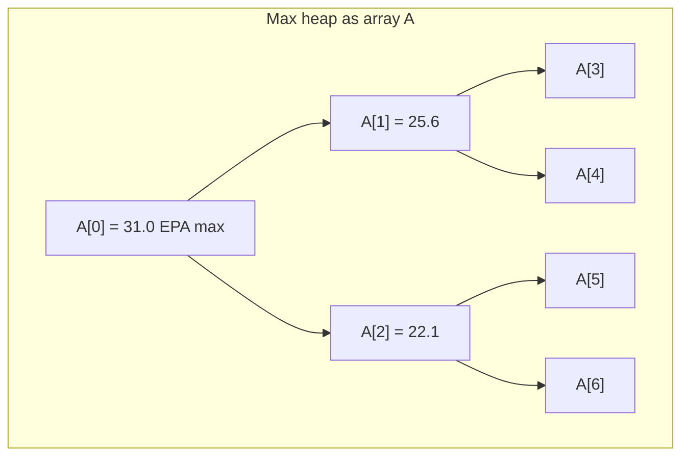
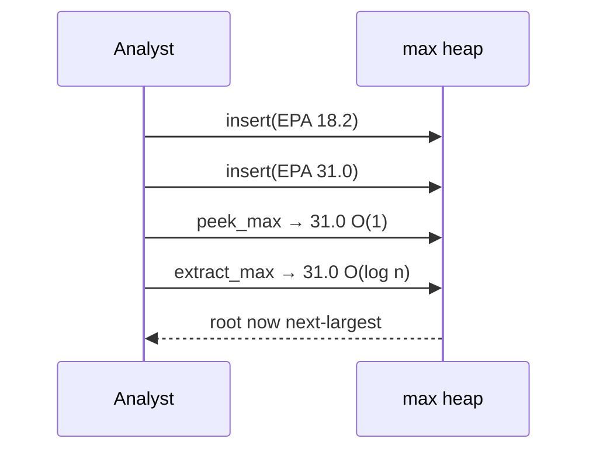
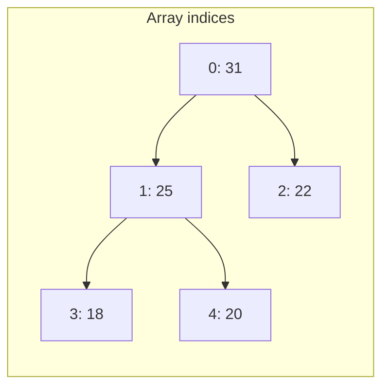
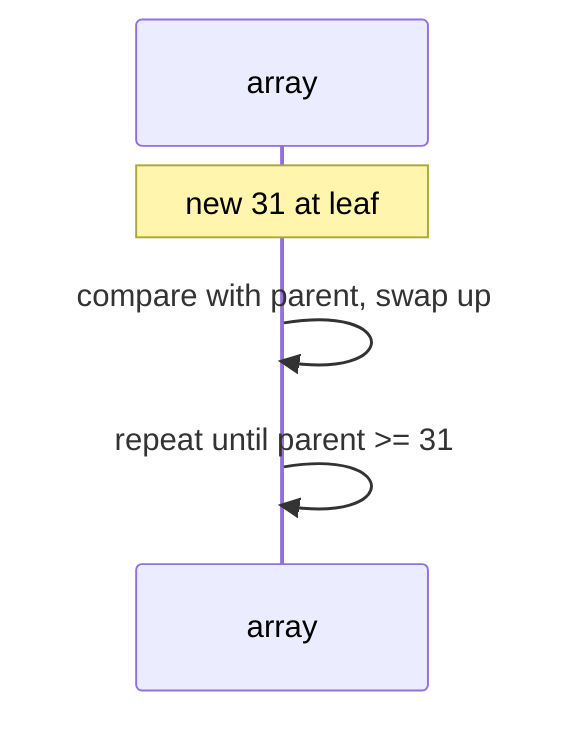
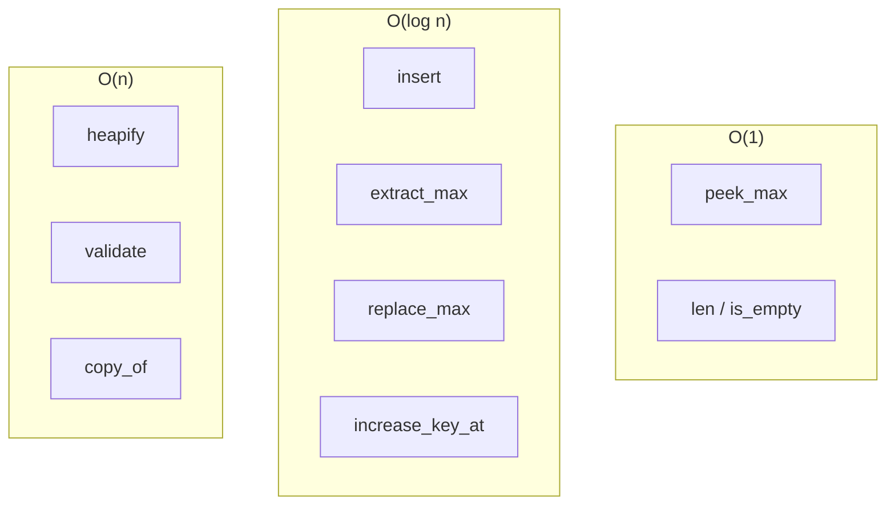
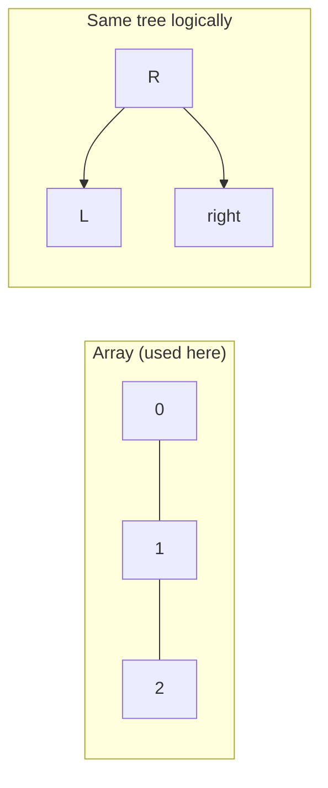
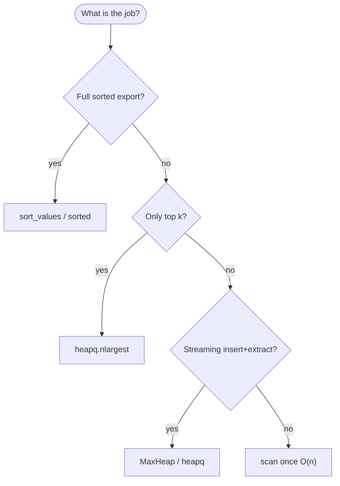

# Max heap

A **complete binary tree** stored in an array where each **parent’s key is ≥ every key in its subtrees** (the **max-heap property**). The largest element always sits at index `0`.

| | |
| --- | --- |
| **What it is** | A binary tree with no gaps in the last level, usually represented as a Python `list` with index formulas instead of child pointers. |
| **Core operations** | `insert`, `extract_max`, `peek_max`, `heapify`—each touches at most tree height O(log n). |
| **When to use** | Top-k EPA plays, scheduling by priority, building blocks for [heap sort](heap-sort/index.md) and [priority queues](../priority-queue/index.md). |
| **Trade-off** | No sorted order across the whole array—only the root is guaranteed maximal; `heapq` in Python is a **min-heap** by default. |

In **NFL data analysis**, a max heap is the right mental model for **“always pull the highest-priority item next”**: the **best red-zone EPA snap** in a batch review queue, the **highest projected fantasy score** among remaining waiver targets, or the **largest remaining cap hit** when trimming a roster simulation. You will still rank full season tables with **pandas** `sort_values` or **`heapq.nlargest`** in production scripts—implement **`MaxHeap`** here to learn the structure and to pass interviews.

This page is your **ready reference**: array indexing, a complete Python `MaxHeap` class, every way to create a heap, every operation with NFL-flavored examples, and **time and space complexity** on each. For Big-O notation, see [Complexity analysis](../../complexity/index.md).

[Parent: Data structures](../index.md)

---

## How a max heap fits NFL-shaped problems

| NFL idea | Heap view | Why max at root |
| --- | --- | --- |
| **Top EPA play in a batch** | Root = highest EPA among queued snaps | O(1) peek, O(log n) extract |
| **Injury report urgency** | Priority = severity × snap count | Always process worst case first |
| **Cap-cut simulation** | Key = dead money saved | Repeatedly extract max savings |
| **Live “best play so far”** | Single-element peek while streaming | Compare new play vs root in O(1) |
| **Heap sort warm-up** | Same array + `sift_down` | [Heap sort](heap-sort/index.md) drains max to sorted suffix |

**Use `heapq.nlargest` or pandas** when you need top-k from a million-row play table once. **Use a max heap** when you **interleave inserts and extracts** on a **moderate** in-memory set (simulation, game chunk, teaching).



Throughout this page, **n** is the number of elements in the heap. **h** = ⌊log₂ n⌋ is tree height.

---

## Max heap vs min heap vs sorted list vs `heapq`

| | **Max heap** | **Min heap** | **Sorted `list`** | **`heapq` (stdlib)** |
| --- | --- | --- | --- | --- |
| **Extreme at top** | Maximum | Minimum | Min at `[0]`, max at `[-1]` | Minimum |
| **`insert`** | O(log n) | O(log n) | O(n) insert + keep sorted | O(log n) |
| **`extract_best`** | O(log n) max | O(log n) min | O(1) pop end; O(n) pop front | O(log n) min |
| **`peek`** | O(1) max | O(1) min | O(1) either end | O(1) min |
| **Full order visible** | No | No | Yes | No |
| **NFL default in Python** | Teach / custom | Dijkstra, schedules | Leaderboards export | `nlargest` via negated keys |



---

## Mental model: complete tree in an array

A **complete** binary tree fills levels left to right—no gaps until the last row. Store it in array `A`:

| Index relation | Formula (0-based) |
| --- | --- |
| **Parent of `i`** | `(i - 1) // 2` for `i > 0` |
| **Left child of `i`** | `2 * i + 1` |
| **Right child of `i`** | `2 * i + 2` |
| **Last parent** | `(n // 2) - 1` when `n > 0` |

**Max-heap property:** for every node `i` (except root’s children logic), `A[parent(i)] ≥ A[i]`.



| Step | Cost driver |
| --- | --- |
| One `sift_up` / `sift_down` | O(log n) comparisons/swaps |
| `heapify` all nodes | O(n) — not O(n log n) |

---

## NFL data types for examples

```python
from __future__ import annotations

from dataclasses import dataclass, field


@dataclass(order=True, slots=True)
class PrioritizedSnap:
    """Lower priority field sorts first in dataclass order; we negate EPA for max-heap demos."""
    neg_epa: float  # store -epa when using min-heap; max-heap uses epa directly
    play_id: int = field(compare=False)
    description: str = field(compare=False, default="")


@dataclass(frozen=True, slots=True)
class Snap:
    play_id: int
    quarter: int
    epa: float
    description: str


@dataclass(frozen=True, slots=True)
class Player:
    name: str
    ppr: float
    team: str
```

---

## Ways to create a max heap

### 1. Empty `MaxHeap`

```python
heap = MaxHeap()
assert heap.is_empty()
```

| | |
| --- | --- |
| **Time** | O(1) |
| **Space** | O(1) |

### 2. Insert one-by-one (online build)

Each `insert` sift-up—O(log n) per item → **O(n log n)** total for n inserts.

```python
h = MaxHeap()
for snap in drive_snaps:
    h.insert(snap.epa, snap)
```

| | |
| --- | --- |
| **Time** | O(n log n) for n items |
| **Space** | O(n) |

### 3. `heapify` from existing array (offline build)

Floyd’s method: sift-down from last parent to root—**O(n)**.

```python
epas = [18.2, 31.0, 22.1, 25.6, 20.0]
h = MaxHeap.from_iterable(epas)
```

| | |
| --- | --- |
| **Time** | O(n) |
| **Space** | O(n) copy if you keep original |

### 4. Build from list literal inside wrapper

```python
h = MaxHeap([31.0, 25.6, 22.1, 18.2])
```

| | |
| --- | --- |
| **Time** | O(n) after `heapify` |
| **Space** | O(n) |

### 5. Copy from another `MaxHeap`

```python
h2 = MaxHeap.copy_of(h)
```

| | |
| --- | --- |
| **Time** | O(n) |
| **Space** | O(n) |

### 6. `heapq` min-heap with negated keys (production idiom)

Python stdlib has **min-heap** only; negate scores for “max” behavior.

```python
import heapq

min_heap: list[tuple[float, Snap]] = []
heapq.heappush(min_heap, (-snap.epa, snap))
best = heapq.heappop(min_heap)[1]
```

| | |
| --- | --- |
| **Time** | Same O(log n) per op |
| **Space** | O(n) |


---

## Reference implementation: `MaxHeap`

Generic max heap over comparable keys with optional satellite data (e.g. attach `Snap` at each EPA).

```python
from __future__ import annotations

from dataclasses import dataclass
from typing import Any, Generic, Iterable, Iterator, TypeVar

K = TypeVar("K")
V = TypeVar("V")


@dataclass
class _Entry(Generic[K, V]):
    key: K
    value: V | None = None


class MaxHeap(Generic[K, V]):
    """Binary max-heap in a dynamic array."""

    def __init__(self, items: Iterable[K] | None = None) -> None:
        self._data: list[_Entry[K, V]] = []
        if items is not None:
            for k in items:
                self._data.append(_Entry(k))
            self.heapify()

    @classmethod
    def from_pairs(cls, pairs: Iterable[tuple[K, V]]) -> MaxHeap[K, V]:
        h: MaxHeap[K, V] = cls()
        for key, value in pairs:
            h._data.append(_Entry(key, value))
        h.heapify()
        return h

    @classmethod
    def copy_of(cls, other: MaxHeap[K, V]) -> MaxHeap[K, V]:
        out: MaxHeap[K, V] = cls()
        out._data = [_Entry(e.key, e.value) for e in other._data]
        return out

    def __len__(self) -> int:
        return len(self._data)

    def is_empty(self) -> bool:
        return len(self._data) == 0

    def clear(self) -> None:
        self._data.clear()

    def peek_max(self) -> K:
        if not self._data:
            raise IndexError("peek_max from empty heap")
        return self._data[0].key

    def peek_entry(self) -> tuple[K, V | None]:
        if not self._data:
            raise IndexError("peek from empty heap")
        e = self._data[0]
        return e.key, e.value

    def insert(self, key: K, value: V | None = None) -> None:
        self._data.append(_Entry(key, value))
        self._sift_up(len(self._data) - 1)

    def extract_max(self) -> K:
        key, _ = self.extract_entry()
        return key

    def extract_entry(self) -> tuple[K, V | None]:
        if not self._data:
            raise IndexError("extract_max from empty heap")
        root = self._data[0]
        last = self._data.pop()
        if self._data:
            self._data[0] = last
            self._sift_down(0)
        return root.key, root.value

    def replace_max(self, key: K, value: V | None = None) -> K:
        """Pop max and push new key in one sift path (efficient for streaming max)."""
        if not self._data:
            self.insert(key, value)
            return key  # no old max
        old = self._data[0].key
        self._data[0] = _Entry(key, value)
        self._sift_down(0)
        self._sift_up(0)
        return old

    def increase_key_at(self, index: int, new_key: K) -> None:
        """Assume new_key >= old key at index (max-heap increase)."""
        if not (0 <= index < len(self._data)):
            raise IndexError(index)
        if new_key < self._data[index].key:
            raise ValueError("new_key must be >= current key for increase_key")
        self._data[index].key = new_key
        self._sift_up(index)

    def heapify(self) -> None:
        n = len(self._data)
        for i in range(n // 2 - 1, -1, -1):
            self._sift_down(i)

    def to_list(self) -> list[K]:
        return [e.key for e in self._data]

    def validate(self) -> bool:
        for i in range(1, len(self._data)):
            p = (i - 1) // 2
            if self._data[p].key < self._data[i].key:
                return False
        return True

    def _parent(self, i: int) -> int:
        return (i - 1) // 2

    def _left(self, i: int) -> int:
        return 2 * i + 1

    def _right(self, i: int) -> int:
        return 2 * i + 2

    def _sift_up(self, i: int) -> None:
        while i > 0:
            p = self._parent(i)
            if self._data[p].key >= self._data[i].key:
                break
            self._data[p], self._data[i] = self._data[i], self._data[p]
            i = p

    def _sift_down(self, i: int) -> None:
        n = len(self._data)
        while True:
            largest = i
            left = self._left(i)
            right = self._right(i)
            if left < n and self._data[left].key > self._data[largest].key:
                largest = left
            if right < n and self._data[right].key > self._data[largest].key:
                largest = right
            if largest == i:
                break
            self._data[i], self._data[largest] = self._data[largest], self._data[i]
            i = largest

    def __iter__(self) -> Iterator[K]:
        for e in self._data:
            yield e.key
```

| | |
| --- | --- |
| **Time** | See per-operation table below |
| **Space** | O(n) for n stored keys |

---

## Core helpers: `sift_up` and `sift_down`

### `sift_up(i)` — after insert at leaf

Bubble node at `i` toward root while it is larger than its parent.

```python
# Called automatically by insert after append at index n-1
h = MaxHeap()
h.insert(18.2)
h.insert(31.0)  # sift_up restores max-heap property
assert h.peek_max() == 31.0
```

| | |
| --- | --- |
| **Time** | O(log n) |
| **Space** | O(1) |



---

### `sift_down(i)` — after extract or heapify step

Push node at `i` down by swapping with larger child until both children ≤ it.

```python
h = MaxHeap([31.0, 25.6, 22.1, 18.2])
h.extract_max()  # 22.1 moved to root, then sift_down
```

| | |
| --- | --- |
| **Time** | O(log n) |
| **Space** | O(1) |

---

### `heapify()` — O(n) build

```python
epas = [0.4, -1.2, 0.8, 0.1, 0.9, -0.3]
h = MaxHeap(epas)
assert h.validate()
```

| | |
| --- | --- |
| **Time** | O(n) |
| **Space** | O(1) auxiliary |

**Why O(n)?** Most nodes are near leaves; few sift-down steps reach full height. Sum of work is linear (CLRS aggregate analysis).

---

## All operations (with examples and complexity)



### `insert(key, value=None)`

```python
review = MaxHeap.from_pairs([])
review.insert(0.42, Snap(101, 2, 0.42, "deep shot"))
review.insert(0.91, Snap(102, 2, 0.91, "TD pass"))
```

| | |
| --- | --- |
| **Time** | O(log n) |
| **Space** | O(1) aux; O(1) amortized array growth |

**NFL:** Stream plays into a “best so far” structure during a live drive recap.

---

### `peek_max()` / `peek_entry()`

```python
best_epa = review.peek_max()
key, snap = review.peek_entry()
```

| | |
| --- | --- |
| **Time** | O(1) |
| **Space** | O(1) |

Does not remove—safe to inspect before committing extract in a UI.

---

### `extract_max()` / `extract_entry()`

```python
while not review.is_empty():
    epa, snap = review.extract_entry()
    print(snap.description, epa)
```

| | |
| --- | --- |
| **Time** | O(log n) |
| **Space** | O(1) |

**NFL:** Drain queue from highest EPA downward—same order as repeated max selection without full sort O(n log n) if you extract all n (actually still O(n log n) total for n extracts).

---

### `replace_max(key, value=None)`

Pop-max + push combined—one sift-up and sift-down path from root.

```python
stream = MaxHeap([0.5])
old = stream.replace_max(0.9, Snap(1, 1, 0.9, "bomb"))
```

| | |
| --- | --- |
| **Time** | O(log n) |
| **Space** | O(1) |

Useful when sliding window max changes by one new candidate per step.

---

### `increase_key_at(index, new_key)`

Decrease-key is harder without extra indirection; increase-key is O(log n) sift-up.

| | |
| --- | --- |
| **Time** | O(log n) |
| **Space** | O(1) |

Production heaps often store **`(key, id)`** with a **`id → index`** map for arbitrary delete/decrease—see [Priority queue](../priority-queue/index.md).

---

### `heapify()` / `MaxHeap(iterable)`

```python
week_epas = [0.12, 0.44, 0.31, 0.08, 0.55]
h = MaxHeap(week_epas)
```

| | |
| --- | --- |
| **Time** | O(n) |
| **Space** | O(n) storage |

Prefer **`heapify`** over n separate **`insert`** calls when all data is known upfront.

---

### `len(heap)` / `is_empty()` / `clear()`

| Operation | Time | Space |
| --- | --- | --- |
| `len` / `is_empty` | O(1) | O(1) |
| `clear` | O(1) drop refs | O(1) |

---

### `validate()` — debug heap property

| | |
| --- | --- |
| **Time** | O(n) |
| **Space** | O(1) |

---

### `to_list()` — unordered key snapshot

Array is **not** sorted; only root is max.

| | |
| --- | --- |
| **Time** | O(n) |
| **Space** | O(n) |

---

## NFL patterns with max heaps

### Top-k EPA plays without full sort

```python
import heapq


def top_k_epa(snaps: list[Snap], k: int) -> list[Snap]:
    """Return k highest-EPA snaps. Uses min-heap of size k — stdlib idiom."""
    heap: list[tuple[float, Snap]] = []
    for s in snaps:
        if len(heap) < k:
            heapq.heappush(heap, (s.epa, s))
        elif s.epa > heap[0][0]:
            heapq.heapreplace(heap, (s.epa, s))
    return [s for _, s in sorted(heap, reverse=True)]


def top_k_maxheap(snaps: list[Snap], k: int) -> list[Snap]:
    """Teaching version: max-heap all, extract k times."""
    h = MaxHeap.from_pairs((s.epa, s) for s in snaps)
    out: list[Snap] = []
    for _ in range(min(k, len(h))):
        _, snap = h.extract_entry()
        out.append(snap)
    return out
```

| Approach | Time | Space |
| --- | --- | --- |
| **`heapq` size-k min-heap** | O(n log k) | O(k) |
| **Extract k from max heap** | O(n + k log n) | O(n) |
| **`nlargest(k, snaps, key=lambda s: s.epa)`** | O(n log k) | O(k) |

For large *n*, prefer **`nlargest`**. For streaming with unknown length, size-k heap wins.

---

### Merge two sorted weekly score lists (heap merge)

When merging many sorted streams, a min-heap of stream heads is classic—max-heap if you want descending merge.

```python
def merge_desc(list_a: list[float], list_b: list[float]) -> list[float]:
    h = MaxHeap(list_a + list_b)  # simplified; real k-way uses indexed heads
    out: list[float] = []
    while not h.is_empty():
        out.append(h.extract_max())
    return out
```

| | |
| --- | --- |
| **Time** | O(n log n) naive one-heap |
| **Space** | O(n) |

---

### Running cap-cut priority

```python
def simulate_cuts(players: list[Player], cuts_needed: int) -> list[Player]:
    """Extract highest PPR players as 'keepers'; cut from low end separately."""
    h = MaxHeap.from_pairs((p.ppr, p) for p in players)
    kept: list[Player] = []
    for _ in range(len(players) - cuts_needed):
        _, p = h.extract_entry()
        kept.append(p)
    return kept
```

| | |
| --- | --- |
| **Time** | O(n log n) |
| **Space** | O(n) |

---

## Array max heap vs pointer-based tree

| | **Array heap** | **Explicit tree nodes** |
| --- | --- | --- |
| **Memory** | Compact; no child pointers | Extra `left`/`right` refs |
| **Index math** | Required | Follow pointers |
| **Cache** | Better locality | Pointer chasing |
| **Interview / CLRS** | Default | Rare |
| **NFL scripts** | `heapq` uses array | Custom tree almost never |



---

## Python stdlib: `heapq` patterns

| Need | API |
| --- | --- |
| K smallest times | `heapq.nsmallest(k, xs)` |
| K largest EPA | `heapq.nlargest(k, snaps, key=lambda s: s.epa)` |
| Max via min-heap | Push `(-epa, snap)` |
| In-place min-heapify | `heapq.heapify(lst)` |
| Push / pop | `heappush`, `heappop` |

```python
import heapq

# Max-EPA with negation
h: list[tuple[float, Snap]] = []
heapq.heappush(h, (-snap.epa, snap))
neg_epa, best = heapq.heappop(h)
actual_epa = -neg_epa
```

**Rule of thumb:** ship **`heapq`** in production NFL notebooks; implement **`MaxHeap`** to learn and debug heap property.

---

## Master complexity table

Let **n** = heap size, **k** = number of extracts.

| Operation | Time | Space (auxiliary) | Notes |
| --- | --- | --- | --- |
| Create empty | O(1) | O(1) | |
| `insert` | O(log n) | O(1) | sift-up |
| `extract_max` | O(log n) | O(1) | sift-down |
| `peek_max` | O(1) | O(1) | |
| `replace_max` | O(log n) | O(1) | |
| `increase_key_at` | O(log n) | O(1) | |
| `heapify` n items | O(n) | O(1) | Floyd |
| n inserts (online) | O(n log n) | O(n) | |
| Extract all n | O(n log n) | O(1) per step | |
| `validate` | O(n) | O(1) | |
| `copy_of` | O(n) | O(n) | |
| Top-k via size-k heap | O(n log k) | O(k) | stdlib pattern |

**Storage:** Θ(n) array entries.

---

## When to pick which tool (NFL context)



| Scenario | Best tool |
| --- | --- |
| Season EPA leaderboard CSV | pandas sort |
| Top 10 plays one game | `nlargest(10, ...)` |
| Interactive priority queue | [Priority queue](../priority-queue/index.md) |
| Guaranteed in-place O(n log n) sort | [Heap sort](heap-sort/index.md) |
| Learn heap property | `MaxHeap` on this page |

---

## Common pitfalls

| Pitfall | Why it hurts | Fix |
| --- | --- | --- |
| Confusing min-heap and max-heap | Wrong extrema | Python `heapq` is min; negate or use this class |
| Assuming array is sorted | Only root is max | Full sort is different algorithm |
| Off-by-one in child indices | Corrupt tree | Use `2*i+1`, `2*i+2`, check bounds |
| `extract_max` on empty | `IndexError` | Check `is_empty()` |
| n inserts when `heapify` possible | O(n log n) vs O(n) | Batch `heapify` |
| Decrease-key without index map | O(n) search | Locator map in priority queue |
| Using heap for one-shot full sort | Constants worse than Timsort | `list.sort` in apps |

---

## Related pages

| Page | Relationship |
| --- | --- |
| [Priority queue](../priority-queue/index.md) | ADT backed by heap |
| [Heap sort (data structures)](heap-sort/index.md) | Sort via heap |
| [Heap sort (algorithms)](../../algorithms/heap-sort/index.md) | Algorithm-focused page |
| [Treaps](../treaps/index.md) | BST + heap priority |
| [Binary search tree](../binary-search-tree/index.md) | Full ordering |
| [Complexity analysis](../../complexity/index.md) | Big-O reference |

---

## Quick reference card

```python
# create
h = MaxHeap()
h = MaxHeap([31.0, 25.6, 22.1])
h = MaxHeap.from_pairs((s.epa, s) for s in snaps)

# O(log n)
h.insert(0.91, snap)
epa = h.extract_max()
_, snap = h.extract_entry()

# O(1)
best = h.peek_max()

# O(n) batch build
h.heapify()

# production
import heapq
heapq.nlargest(10, snaps, key=lambda s: s.epa)
```

Use a **max heap** when you need **repeated access to the current maximum** with **interleaved inserts**—EPA review queues, simulation priorities, and the foundation of **heap sort**. Reach for **`heapq.nlargest`** and **pandas** when the job is **one-shot analytics** on big tables.

**NFL pipeline checklist**

1. **One-shot top-k** — `heapq.nlargest` or `df.nlargest`.
2. **Streaming priority** — max heap or [priority queue](../priority-queue/index.md).
3. **Batch known set** — `heapify` O(n), not n inserts.
4. **Python default** — min-heap; negate keys for max behavior.
5. **Full ordering** — sort, not heap drain.
