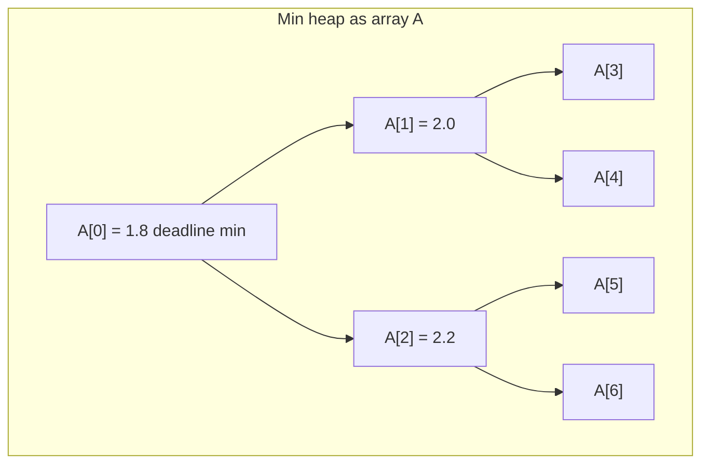
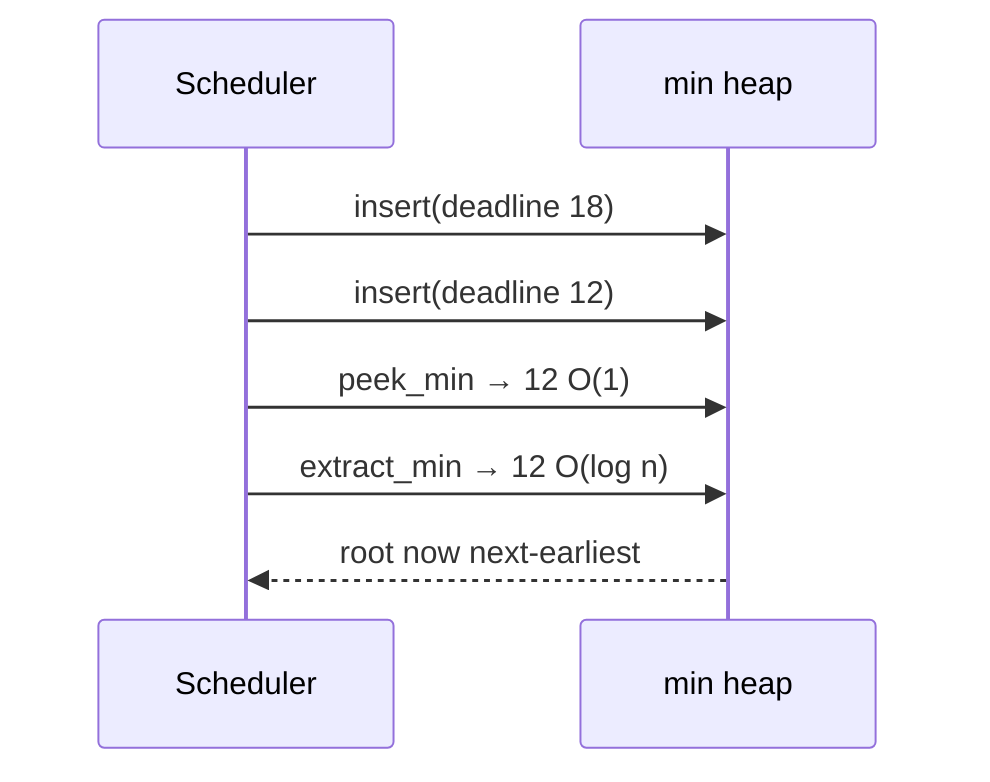
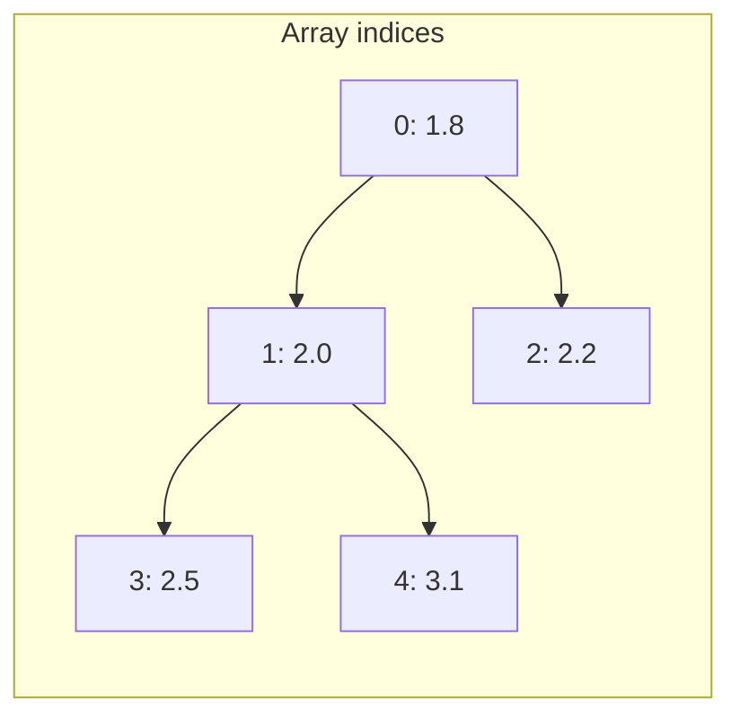
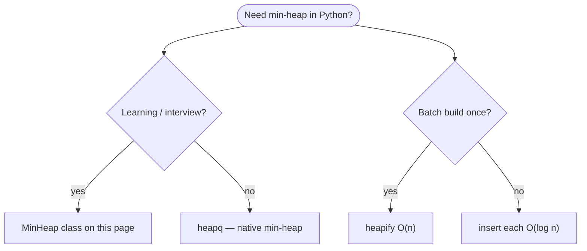
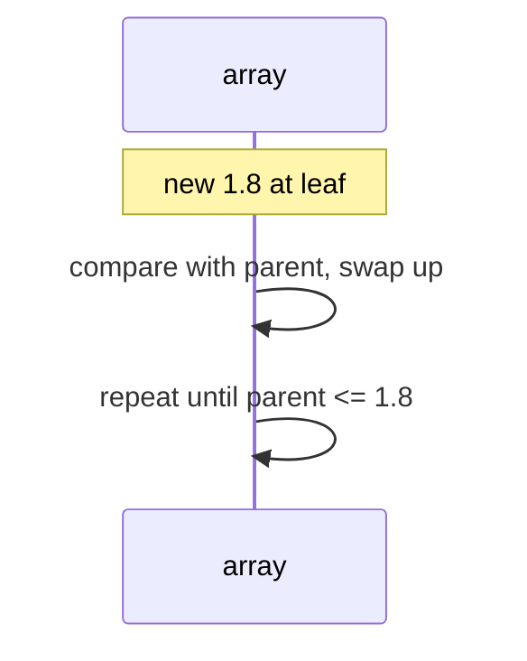
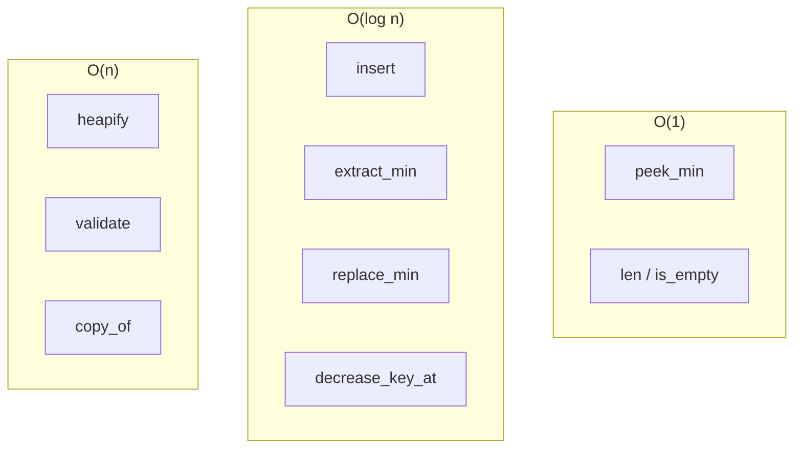
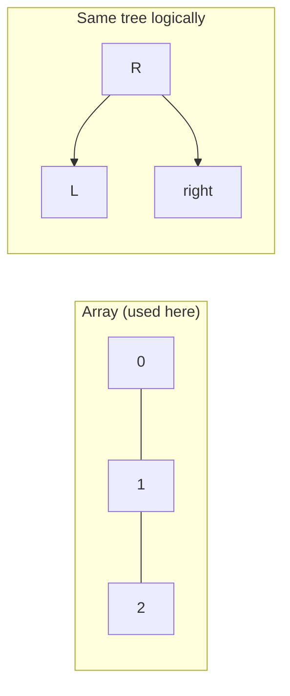
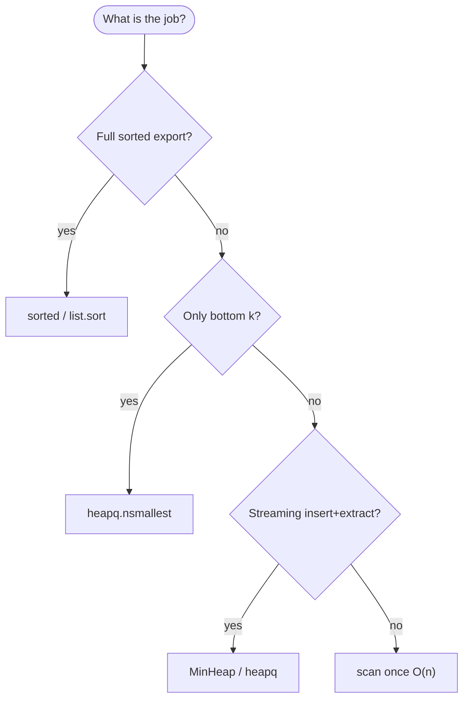

# Min heap

A **min heap** is a **complete binary tree**—all levels are filled except possibly the last, which is filled from left to right with no gaps—where the **parent’s key is always ≤ every key in its subtrees** (**min-heap property**). This structure is usually implemented using a Python `list` (array), with the smallest element always at index `0`. Parent and child relationships are determined through index calculations rather than explicit node references.

The core **min heap operations** are:
- **Insert** an element
- **Extract** (remove and return) the minimum
- **Peek** at the minimum without removing it
- **Heapify**: reorganize any array into a valid heap

All of these operations run in **O(log n)** time, proportional to the height of the tree.

**Min heaps** are essential for:
- **Dijkstra’s shortest path** (quickly expand the vertex with smallest distance)
- **Earliest deadline scheduling** (always get the soonest event)
- **K-smallest selection** (maintain just the smallest k elements efficiently)
- **Merging sorted data streams** (pop next global minimum across multiple inputs)
- [Priority queue](../priority-queue/index.md) (where fast access to the lowest-priority element is needed).

A min heap is the right mental model for **“always pull the smallest item next”**: the closest vertex on a Dijkstra frontier, the earliest deadline in a scheduler, or the next global minimum when merging sorted streams. The main trade-off is that only the root (index `0`) is guaranteed minimal—the rest of the array is **not** in globally sorted order.

For one-off k-smallest selection from a large batch, Python’s **`sorted()`** or **`heapq.nsmallest()`** are usually enough. When you **interleave inserts and extracts** on a moderate in-memory set (graph search, real-time scheduling, or simulation), a min heap is the natural choice—and the standard library [`heapq`](../../../versions/3.14.5/standard-library/data-types/heapq-heap-queue-algorithm/index.md) module already provides a production-ready implementation.

Building your own `MinHeap` class (as included below) deepens your understanding and is a common interview test for data structures. This reference covers array indexing, all standard heap methods, scheduler and k-smallest examples, and a summary of **time and space complexity** for every operation. For formal Big-O analysis, see [Complexity analysis](../../complexity/index.md).

---

## What a min heap models

| Use case | Heap view | Why min at root |
| --- | --- | --- |
| **Earliest-deadline scheduler** | Root = soonest pending event | O(1) peek, O(log n) extract |
| **Dijkstra frontier** | Key = tentative distance to vertex | Always expand closest unvisited node |
| **K-smallest snapshot** | Size-k heap or repeated extract | Keep only k best without full sort |
| **Merge sorted streams** | One heap entry per stream head | Pop global minimum, push next from that stream |
| **Live “best so far” (min)** | Single-element peek while streaming | Compare new candidate vs root in O(1) |
| **Heap sort (ascending via min drain)** | Same array + `sift_down` | Drain min to build sorted prefix—see [Heap sort](../heap-sort/index.md) |

**Use `heapq.nsmallest` or `sorted`** when you need k-smallest from a large batch once. **Use a min heap** when you **interleave inserts and extracts** on a **moderate** in-memory set (graph search, simulation, teaching).



Throughout this page, **n** is the number of elements in the heap (e.g. frontier nodes in one Dijkstra step). **h** = ⌊log₂ n⌋ is tree height. In production services, **n** per heap is often moderate while full history lives in databases or logs.

---

## Min heap vs max heap vs sorted list vs `heapq`

| | **Min heap** | **Max heap** | **Sorted `list`** | **`heapq` (stdlib)** |
| --- | --- | --- | --- | --- |
| **Extreme at top** | Minimum | Maximum | Min at `[0]`, max at `[-1]` | Minimum |
| **`insert`** | O(log n) | O(log n) | O(n) insert + keep sorted | O(log n) |
| **`extract_best`** | O(log n) min | O(log n) max | O(1) pop end; O(n) pop front | O(log n) min |
| **`peek`** | O(1) min | O(1) max | O(1) either end | O(1) min |
| **Full order visible** | No | No | Yes | No |
| **Typical Python choice** | Dijkstra, schedules, `heapq` | Teach / custom max | Full sorted export | Default for heaps |



---

## Mental model: complete tree in an array

A **complete** binary tree fills levels left to right—no gaps until the last row. Store it in array `A`:

| Index relation | Formula (0-based) |
| --- | --- |
| **Parent of `i`** | `(i - 1) // 2` for `i > 0` |
| **Left child of `i`** | `2 * i + 1` |
| **Right child of `i`** | `2 * i + 2` |
| **Last parent** | `(n // 2) - 1` when `n > 0` |

**Min-heap property:** for every node `i` with parent `p`, `A[p] ≤ A[i]`.



| Step | Cost driver |
| --- | --- |
| One `sift_up` / `sift_down` | O(log n) comparisons/swaps |
| `heapify` all nodes | O(n) — not O(n log n) |

---

## Example data types

```python

from dataclasses import dataclass, field


@dataclass(order=True, slots=True)
class TimedEvent:
    deadline_ms = 0
    name = field(compare=False, default="")


@dataclass(frozen=True, slots=True)
class VertexDistance:
    vertex_id = 0
    distance = 0.0


@dataclass(frozen=True, slots=True)
class StreamItem:
    stream_id = 0
    value = 0
    next_index = 0
```

---

## Ways to create a min heap

### 1. Empty `MinHeap`

```python
heap = MinHeap()
assert heap.is_empty()
```

| | |
| --- | --- |
| **Time** | O(1) |
| **Space** | O(1) |

### 2. Insert one-by-one (online build)

Each `insert` sift-up—O(log n) per item → **O(n log n)** total for n inserts.

```python
h = MinHeap()
for event in pending_events:
    h.insert(event.deadline_ms, event)
```

| | |
| --- | --- |
| **Time** | O(n log n) for n items |
| **Space** | O(n) |

### 3. `heapify` from existing array (offline build)

Floyd’s method: sift-down from last parent to root—**O(n)**.

```python
deadlines = [44, 12, 31, 18, 25]
h = MinHeap.from_iterable(deadlines)
```

| | |
| --- | --- |
| **Time** | O(n) |
| **Space** | O(n) copy if you keep original |

### 4. Build from list literal inside wrapper

```python
h = MinHeap([1.8, 2.0, 2.2, 2.5, 3.1])
```

| | |
| --- | --- |
| **Time** | O(n) after `heapify` |
| **Space** | O(n) |

### 5. Copy from another `MinHeap`

```python
h2 = MinHeap.copy_of(h)
```

| | |
| --- | --- |
| **Time** | O(n) |
| **Space** | O(n) |

### 6. `heapq` directly (production idiom)

Python stdlib **`heapq`** is a min-heap out of the box—no negation tricks needed for minimum behavior.

```python
import heapq

min_heap = []
heapq.heappush(min_heap, (event.deadline_ms, event))
deadline, next_event = heapq.heappop(min_heap)
```

| | |
| --- | --- |
| **Time** | Same O(log n) per op |
| **Space** | O(n) |



---

## Reference implementation: `MinHeap`

Generic min heap over comparable keys with optional satellite data (e.g. attach a `TimedEvent` at each deadline).

```python

from dataclasses import dataclass


@dataclass
class _Entry:
    key: object = None
    value: object = None


class MinHeap:
    def __init__(self, items=None):
        self._data = []
        if items is not None:
            for k in items:
                self._data.append(_Entry(k))
            self.heapify()

    @classmethod
    def from_pairs(cls, pairs):
        h = cls()
        for key, value in pairs:
            h._data.append(_Entry(key, value))
        h.heapify()
        return h

    @classmethod
    def copy_of(cls, other):
        out = cls()
        out._data = [_Entry(e.key, e.value) for e in other._data]
        return out

    def __len__(self):
        return len(self._data)

    def is_empty(self):
        return len(self._data) == 0

    def clear(self):
        self._data.clear()

    def peek_min(self):
        if not self._data:
            raise IndexError("peek_min from empty heap")
        return self._data[0].key

    def peek_entry(self):
        if not self._data:
            raise IndexError("peek from empty heap")
        e = self._data[0]
        return e.key, e.value

    def insert(self, key, value=None):
        self._data.append(_Entry(key, value))
        self._sift_up(len(self._data) - 1)

    def extract_min(self):
        key, _ = self.extract_entry()
        return key

    def extract_entry(self):
        if not self._data:
            raise IndexError("extract_min from empty heap")
        root = self._data[0]
        last = self._data.pop()
        if self._data:
            self._data[0] = last
            self._sift_down(0)
        return root.key, root.value

    def replace_min(self, key, value=None):
        if not self._data:
            self.insert(key, value)
            return key
        old = self._data[0].key
        self._data[0] = _Entry(key, value)
        self._sift_down(0)
        self._sift_up(0)
        return old

    def decrease_key_at(self, index, new_key):
        if not (0 <= index < len(self._data)):
            raise IndexError(index)
        if new_key > self._data[index].key:
            raise ValueError("new_key must be <= current key for decrease_key")
        self._data[index].key = new_key
        self._sift_up(index)

    def heapify(self):
        n = len(self._data)
        for i in range(n // 2 - 1, -1, -1):
            self._sift_down(i)

    def to_list(self):
        return [e.key for e in self._data]

    def validate(self):
        for i in range(1, len(self._data)):
            p = (i - 1) // 2
            if self._data[p].key > self._data[i].key:
                return False
        return True

    def _parent(self, i):
        return (i - 1) // 2

    def _left(self, i):
        return 2 * i + 1

    def _right(self, i):
        return 2 * i + 2

    def _sift_up(self, i):
        while i > 0:
            p = self._parent(i)
            if self._data[p].key <= self._data[i].key:
                break
            self._data[p], self._data[i] = self._data[i], self._data[p]
            i = p

    def _sift_down(self, i):
        n = len(self._data)
        while True:
            smallest = i
            left = self._left(i)
            right = self._right(i)
            if left < n and self._data[left].key < self._data[smallest].key:
                smallest = left
            if right < n and self._data[right].key < self._data[smallest].key:
                smallest = right
            if smallest == i:
                break
            self._data[i], self._data[smallest] = self._data[smallest], self._data[i]
            i = smallest

    def __iter__(self):
        for e in self._data:
            yield e.key
```

| | |
| --- | --- |
| **Time** | See per-operation table below |
| **Space** | O(n) for n stored keys |

---

## Core helpers: `sift_up` and `sift_down`

### `sift_up(i)` — after insert at leaf

Bubble node at `i` toward root while it is smaller than its parent.

```python
h = MinHeap()
h.insert(3.1)
h.insert(1.8)
assert h.peek_min() == 1.8
```

| | |
| --- | --- |
| **Time** | O(log n) |
| **Space** | O(1) |



---

### `sift_down(i)` — after extract or heapify step

Push node at `i` down by swapping with smaller child until both children ≥ it.

```python
h = MinHeap([1.8, 2.0, 2.2, 2.5, 3.1])
h.extract_min()
```

| | |
| --- | --- |
| **Time** | O(log n) |
| **Space** | O(1) |

---

### `heapify()` — O(n) build

```python
costs = [9, -3, 1, 8, -12, 4]
h = MinHeap(costs)
assert h.validate()
```

| | |
| --- | --- |
| **Time** | O(n) |
| **Space** | O(1) auxiliary |

**Why O(n)?** Most nodes are near leaves; few sift-down steps reach full height. Sum of work is linear (CLRS aggregate analysis).

---

## All operations (with examples and complexity)



### `insert(key, value=None)`

```python
scheduler = MinHeap.from_pairs([])
scheduler.insert(1200, TimedEvent(1200, "flush cache"))
scheduler.insert(400, TimedEvent(400, "send heartbeat"))
```

| | |
| --- | --- |
| **Time** | O(log n) |
| **Space** | O(1) aux; O(1) amortized array growth |

Stream events into an “earliest deadline so far” structure during incremental ingest.

---

### `peek_min()` / `peek_entry()`

```python
next_deadline = scheduler.peek_min()
deadline, event = scheduler.peek_entry()
```

| | |
| --- | --- |
| **Time** | O(1) |
| **Space** | O(1) |

Does not remove—safe to inspect before committing extract in a UI.

---

### `extract_min()` / `extract_entry()`

```python
while not scheduler.is_empty():
    deadline, event = scheduler.extract_entry()
    print(event.name, deadline)
```

| | |
| --- | --- |
| **Time** | O(log n) |
| **Space** | O(1) |

Drain queue from earliest deadline upward—same order as repeated min selection; n extracts total O(n log n).

---

### `replace_min(key, value=None)`

Pop-min + push combined—one sift-up and sift-down path from root.

```python
stream = MinHeap([500.0])
old = stream.replace_min(90.0, TimedEvent(90, "deadline moved earlier"))
```

| | |
| --- | --- |
| **Time** | O(log n) |
| **Space** | O(1) |

Useful when sliding window min changes by one new candidate per step.

---

### `decrease_key_at(index, new_key)`

Increase-key is harder without extra indirection; decrease-key is O(log n) sift-up—critical for Dijkstra when a shorter path is found.

| | |
| --- | --- |
| **Time** | O(log n) |
| **Space** | O(1) |

Production heaps often store **`(key, id)`** with an **`id → index`** map for arbitrary delete/decrease—see [Priority queue](../priority-queue/index.md).

---

### `heapify()` / `MinHeap(iterable)`

```python
distances = [12, 44, 3, 8, 55]
h = MinHeap(distances)
```

| | |
| --- | --- |
| **Time** | O(n) |
| **Space** | O(n) storage |

Prefer **`heapify`** over n separate **`insert`** calls when all data is known upfront.

---

### `len(heap)` / `is_empty()` / `clear()`

| Operation | Time | Space |
| --- | --- | --- |
| `len` / `is_empty` | O(1) | O(1) |
| `clear` | O(1) drop refs | O(1) |

---

### `validate()` — debug heap property

| | |
| --- | --- |
| **Time** | O(n) |
| **Space** | O(1) |

---

### `to_list()` — unordered key snapshot

Array is **not** sorted; only root is min.

| | |
| --- | --- |
| **Time** | O(n) |
| **Space** | O(n) |

---

## Common patterns with min heaps

### K-smallest without full sort

```python
import heapq


def bottom_k_events(events, k):
    heap = []
    for e in events:
        if len(heap) < k:
            heapq.heappush(heap, (-e.deadline_ms, e))
        elif e.deadline_ms < -heap[0][0]:
            heapq.heapreplace(heap, (-e.deadline_ms, e))
    return [e for _, e in sorted(heap, key=lambda x: -x[0])]


def bottom_k_minheap(events, k):
    h = MinHeap.from_pairs((e.deadline_ms, e) for e in events)
    out = []
    for _ in range(min(k, len(h))):
        _, event = h.extract_entry()
        out.append(event)
    return out
```

| Approach | Time | Space |
| --- | --- | --- |
| **`heapq` size-k max-heap via negation** | O(n log k) | O(k) |
| **Extract k from min heap** | O(n + k log n) | O(n) |
| **`nsmallest(k, events, key=lambda e: e.deadline_ms)`** | O(n log k) | O(k) |

For large *n*, prefer **`nsmallest`**. For streaming with unknown length, size-k heap wins.

---

### Merge k sorted lists (classic min-heap merge)

When merging many sorted streams, a min-heap of stream heads is the standard pattern.

```python
def merge_asc(list_a, list_b):
    h = MinHeap(list_a + list_b)
    out = []
    while not h.is_empty():
        out.append(h.extract_min())
    return out


def merge_k_sorted(streams):
    h = MinHeap()
    for sid, stream in enumerate(streams):
        if stream:
            h.insert(stream[0], StreamItem(sid, stream[0], 1))
    out = []
    while not h.is_empty():
        _, item = h.extract_entry()
        out.append(item.value)
        stream = streams[item.stream_id]
        if item.next_index < len(stream):
            nxt = stream[item.next_index]
            h.insert(nxt, StreamItem(item.stream_id, nxt, item.next_index + 1))
    return out
```

| | |
| --- | --- |
| **Time** | O(n log k) for total n elements across k streams |
| **Space** | O(k) heap size |

---

### Dijkstra frontier (conceptual)

```python
def dijkstra_frontier_example(edges_from, start):
    h = MinHeap.from_pairs([(0.0, start)])
    while not h.is_empty():
        dist, v = h.extract_entry()
        for nbr, weight in edges_from.get(v, []):
            h.insert(dist + weight, nbr)
```

| | |
| --- | --- |
| **Time** | O((V + E) log V) with decrease-key map |
| **Space** | O(V) frontier |

A teaching sketch—production Dijkstra needs a **`vertex → index`** map for **`decrease_key_at`**.

---

### Earliest-deadline event simulation

```python
def process_next_events(events, count):
    h = MinHeap.from_pairs((e.deadline_ms, e) for e in events)
    processed = []
    for _ in range(min(count, len(h))):
        _, event = h.extract_entry()
        processed.append(event)
    return processed
```

| | |
| --- | --- |
| **Time** | O(n log n) build + O(count log n) extract |
| **Space** | O(n) |

---

## Array min heap vs pointer-based tree

| | **Array heap** | **Explicit tree nodes** |
| --- | --- | --- |
| **Memory** | Compact; no child pointers | Extra `left`/`right` refs |
| **Index math** | Required | Follow pointers |
| **Cache** | Better locality | Pointer chasing |
| **Interview / CLRS** | Default | Rare |
| **Production scripts** | `heapq` uses array | Custom tree almost never |



---

## Python stdlib: `heapq` patterns

| Need | API |
| --- | --- |
| K smallest times | `heapq.nsmallest(k, xs)` |
| K highest priorities | `heapq.nlargest(k, tasks, key=lambda t: t.priority)` |
| Native min-heap | `heappush`, `heappop`—no negation |
| Max via min-heap | Push `(-priority, task)` |
| In-place min-heapify | `heapq.heapify(lst)` |

```python
import heapq

h = []
heapq.heappush(h, (event.deadline_ms, event))
deadline, next_event = heapq.heappop(h)
```

**Rule of thumb:** ship **`heapq`** in production services; implement **`MinHeap`** to learn and debug heap property. For max behavior, see [Max heap](../max-heap/index.md) or negate keys.

---

## Master complexity table

Let **n** = heap size, **k** = number of extracts.

| Operation | Time | Space (auxiliary) | Notes |
| --- | --- | --- | --- |
| Create empty | O(1) | O(1) | |
| `insert` | O(log n) | O(1) | sift-up |
| `extract_min` | O(log n) | O(1) | sift-down |
| `peek_min` | O(1) | O(1) | |
| `replace_min` | O(log n) | O(1) | |
| `decrease_key_at` | O(log n) | O(1) | |
| `heapify` n items | O(n) | O(1) | Floyd |
| n inserts (online) | O(n log n) | O(n) | |
| Extract all n | O(n log n) | O(1) per step | |
| `validate` | O(n) | O(1) | |
| `copy_of` | O(n) | O(n) | |
| Top-k via size-k heap | O(n log k) | O(k) | stdlib pattern |
| Merge k sorted streams | O(n log k) | O(k) | n total elements |

**Storage:** Θ(n) array entries.

---

## When to pick which tool



| Scenario | Best tool |
| --- | --- |
| Full sorted export | `sorted` or `list.sort` |
| Bottom 10 deadlines one batch | `nsmallest(10, ...)` |
| Interactive min-priority queue | [Priority queue](../priority-queue/index.md) |
| Dijkstra / merge k lists | `heapq` or `MinHeap` |
| Learn heap property | `MinHeap` on this page |
| Repeated maximum access | [Max heap](../max-heap/index.md) |

---

## Common pitfalls

| Pitfall | Why it hurts | Fix |
| --- | --- | --- |
| Confusing min-heap and max-heap | Wrong extrema | Root is min here; see [Max heap](../max-heap/index.md) for max |
| Assuming array is sorted | Only root is min | Full sort is different algorithm |
| Off-by-one in child indices | Corrupt tree | Use `2*i+1`, `2*i+2`, check bounds |
| `extract_min` on empty | `IndexError` | Check `is_empty()` |
| n inserts when `heapify` possible | O(n log n) vs O(n) | Batch `heapify` |
| Decrease-key without index map | O(n) search | Locator map in priority queue |
| Using heap for one-shot full sort | Constants worse than Timsort | `list.sort` in apps |
| Negating keys unnecessarily | Extra mental overhead | `heapq` is already min—use directly |

---

## Related pages

| Page | Relationship |
| --- | --- |
| [Max heap](../max-heap/index.md) | Dual structure (max at root) |
| [Priority queue](../priority-queue/index.md) | ADT backed by heap |
| [Linked list](../linked-list/index.md) | Pointer structures vs array heap |
| [Circularly linked list](../circularly-linked-list/index.md) | Ring buffers vs heap priority |
| [Heap sort (data structures)](../heap-sort/index.md) | Sort via heap |
| [Heap sort (algorithms)](../../algorithms/heap-sort/index.md) | Algorithm-focused page |
| [Treaps](../treaps/index.md) | BST + heap priority |
| [Binary search tree](../binary-search-tree/index.md) | Full ordering |
| [Complexity analysis](../../complexity/index.md) | Big-O reference |

---

## Quick reference card

```python
h = MinHeap()
h = MinHeap([1.8, 2.0, 2.2])
h = MinHeap.from_pairs((e.deadline_ms, e) for e in events)

h.insert(400, event)
deadline = h.extract_min()
_, event = h.extract_entry()

soonest = h.peek_min()

h.heapify()

import heapq
heapq.nsmallest(10, events, key=lambda e: e.deadline_ms)
```

Use a **min heap** when you need **repeated access to the current minimum** with **interleaved inserts**—earliest-deadline schedulers, Dijkstra frontiers, merge of sorted streams, and the natural match for Python’s **`heapq`**. Reach for **`heapq.nsmallest`** and **`sorted`** when the job is **one-shot ranking** on a large batch.

**Application checklist**

1. **One-shot bottom-k** — `heapq.nsmallest`.
2. **Streaming min-priority** — min heap or [priority queue](../priority-queue/index.md).
3. **Batch known set** — `heapify` O(n), not n inserts.
4. **Python default** — `heapq` is a min-heap; use it directly.
5. **Need maximum instead** — [Max heap](../max-heap/index.md) or negated keys.
6. **Full ordering** — sort, not heap drain.
