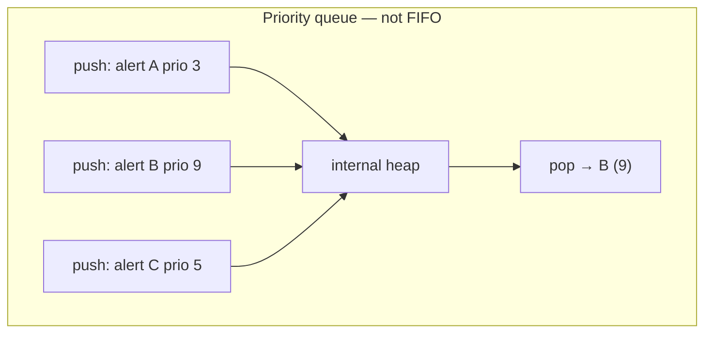
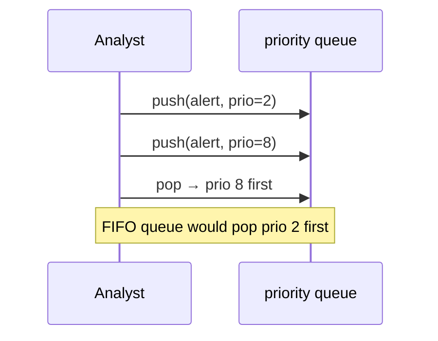
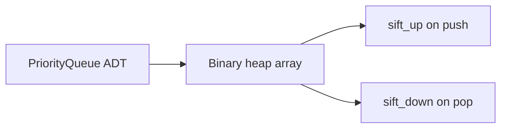
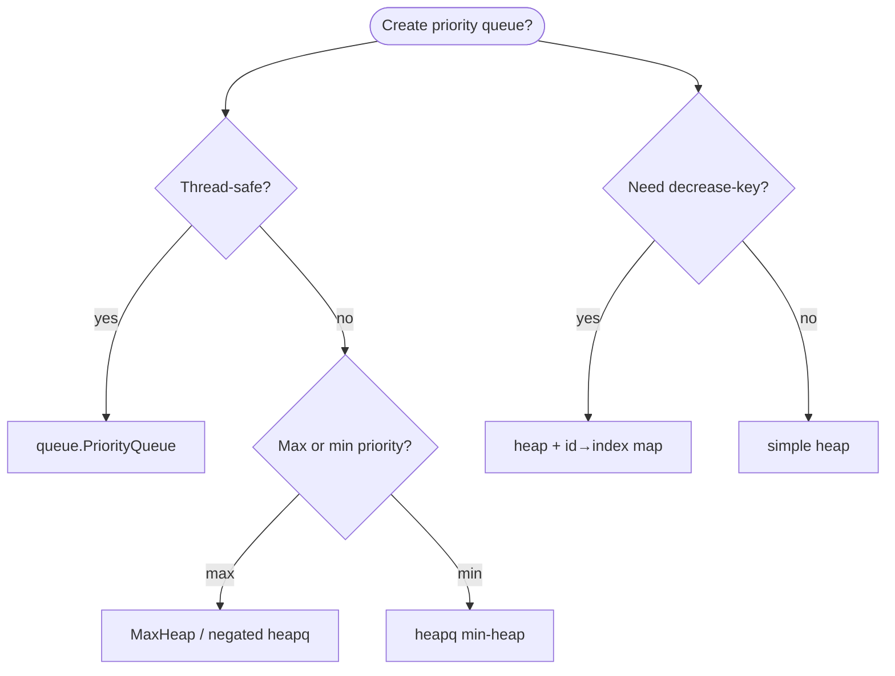
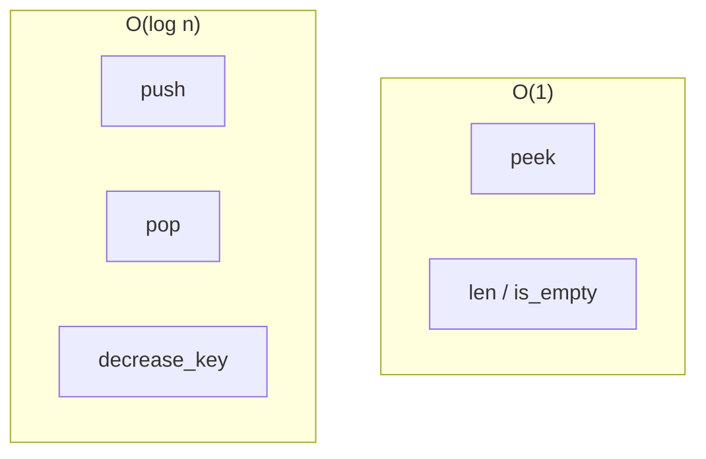
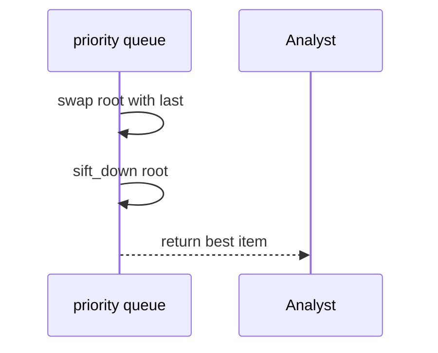
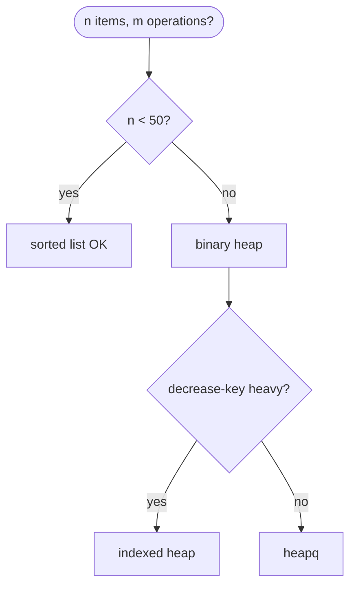
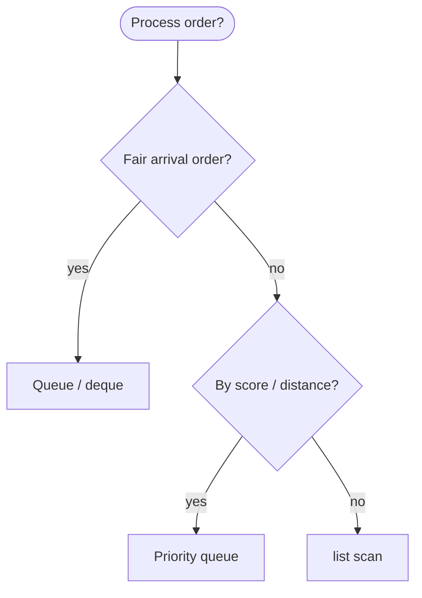

# Priority queue

An **abstract data type (ADT)** that always returns the element with the **highest priority** next—regardless of arrival order. It is **not** a FIFO [queue](../queue/index.md); it is a **bag ordered by priority**.

| | |
| --- | --- |
| **What it is** | `insert` any time; `extract_best` removes and returns the highest-priority item; optional `peek`, `decrease_priority`, `merge`. |
| **Core operations** | `push` / `insert`, `pop` / `extract_best`, `peek`—typically O(log n) with a binary heap. |
| **When to use** | Task urgency, deadline scheduling, Dijkstra on weighted graphs, A* on route trees, event simulation. |
| **Trade-off** | No time-order fairness; two items with equal priority need a tie-break policy. |

In **task scheduling and graph algorithms**, a priority queue models **“work the most important item next”**: queue **review tasks** by priority score, schedule **report exports** by analyst urgency, or drive **Dijkstra** on a **weighted graph** for shortest-path distance estimates. Live event ingestion order stays FIFO ([Queue](../queue/index.md)); priority queues reorder by **score**, not **clock**.

This page is your **ready reference**: ADT contract, heap-backed and `heapq` implementations, every way to create a PQ, every operation with practical examples, and **time and space complexity**. For Big-O notation and large-scale *n*, see [Complexity analysis](../../complexity/index.md).

[Parent: Data structures](../index.md)

---

## How a priority queue fits common applications

| Use case | Priority key | Operation |
| --- | --- | --- |
| **Task review queue** | Absolute priority score | `extract_best` = most urgent |
| **Alert desk** | Severity × coverage | Highest risk first |
| **Candidate ranking** | Projected score delta | Pop best candidate |
| **Graph: shortest path** | Tentative distance | Min-priority queue in Dijkstra |
| **Live “next report to render”** | Analyst star rating | Push new; pop best |

**Use a FIFO queue** when fairness is **first submitted, first processed**. **Use a priority queue** when **importance** dominates **arrival time**.



Throughout this page, **n** is the number of items in the queue (e.g. pending alerts in one dashboard session). In production data pipelines, **n** per queue is often moderate while multi-year archives live in tables.

---

## Priority queue vs queue vs max heap vs sorted list

| | **Priority queue (ADT)** | [Queue (FIFO)](../queue/index.md) | [Max heap](../max-heap/index.md) | **Sorted list** |
| --- | --- | --- | --- | --- |
| **Next out** | Best priority | Oldest | Max key | Either end |
| **Arrival order** | Ignored for order | Sacred | Ignored | Ignored |
| **Implementation** | Often binary heap | deque / [linked list](../linked-list/index.md) | Concrete structure | list |
| **`insert`** | O(log n) typical | O(1) | O(log n) | O(n) |
| **`extract_best`** | O(log n) | O(1) dequeue | O(log n) | O(1) pop |
| **Typical fit** | Task urgency | Event stream | Same as PQ backend | Static lookup table |



---

## Mental model: ADT vs implementation

The **ADT** is the contract:

- **`push(item, priority)`** — add without specifying position.
- **`pop()`** — remove and return highest-priority item.
- **`peek()`** — inspect best without removing.
- Optional: **`decrease_priority(id, new_prio)`**, **`remove(id)`**, **`merge(other)`**.

The **implementation** is usually a **[max heap](../max-heap/index.md)** (max-priority) or **min heap** (min-priority for Dijkstra). Python **`heapq`** implements a **min-heap**; store negated priorities for max behavior.



| Step | Cost driver |
| --- | --- |
| Push | O(log n) sift-up |
| Pop | O(log n) sift-down |
| Peek | O(1) at root |

---

## Example data types

```python

from dataclasses import dataclass, field

@dataclass(order=True, slots=True)
class ReviewTask:
 neg_priority = 0.0
 record_id= field(compare=False)
 analyst= field(compare=False, default="")

@dataclass(frozen=True, slots=True)
class DataRecord:
 record_id = 0
 value = 0.0
 label = ""

@dataclass(frozen=True, slots=True)
class SystemAlert:
 source = ""
 severity = 0
 coverage_pct = 0.0
```

---

## Ways to create a priority queue

### 1. Empty heap-backed `PriorityQueue`

```python
pq = PriorityQueue()
assert pq.is_empty()
```

| | |
| --- | --- |
| **Time** | O(1) |
| **Space** | O(1) |

### 2. From iterable of `(priority, item)` pairs

```python
tasks = [(8.0, ReviewTask(-8.0, 101)), (3.0, ReviewTask(-3.0, 102))]
pq = PriorityQueue.from_pairs(tasks, max_queue=True)
```

| | |
| --- | --- |
| **Time** | O(n) heapify |
| **Space** | O(n) |

### 3. `heapq` list as min-priority queue

```python
import heapq

pq= []
counter = 0

def push(record, priority):
 global counter
 heapq.heappush(pq, (priority, counter, record))
 counter += 1
```

| | |
| --- | --- |
| **Time** | O(log n) per push |
| **Space** | O(n) |

### 4. `queue.PriorityQueue` (thread-safe, blocking)

```python
from queue import PriorityQueue as ThreadSafePQ

tpq= ThreadSafePQ()
tpq.put((7.5, record))
item = tpq.get()
```

| | |
| --- | --- |
| **Time** | O(log n) typical |
| **Space** | O(n) |

### 5. Lazy deletion heap (handles arbitrary remove)

Store `(priority, id, item)`; mark ids deleted in a set; pop until valid top.

| | |
| --- | --- |
| **Time** | O(log n) amortized push/pop |
| **Space** | O(n) + deleted set |



---

## Reference implementation: `PriorityQueue` (max-priority)

Wraps the same array heap as [Max heap](../max-heap/index.md) with ADT naming and tie-break counter for stable ordering among equal priorities.

```python

from dataclasses import dataclass

@dataclass
class _PQEntry:
 priority = 0.0
 seq = 0
 item = None

class PriorityQueue:
 def __init__(self, max_queue= True):
 self._heap= []
 self._seq = 0
 self._max_queue = max_queue

 @classmethod
 def from_pairs(
 cls, pairs, *, max_queue= True
 ):
 pq= cls(max_queue=max_queue)
 for prio, item in pairs:
 pq.push(item, prio)
 return pq

 def __len__(self):
 return len(self._heap)

 def is_empty(self):
 return not self._heap

 def clear(self):
 self._heap.clear()
 self._seq = 0

 def push(self, item, priority):
 entry = _PQEntry(priority, self._seq, item)
 self._seq += 1
 self._heap.append(entry)
 self._sift_up(len(self._heap) - 1)

 def pop(self):
 if not self._heap:
 raise IndexError("pop from empty priority queue")
 self._swap(0, len(self._heap) - 1)
 entry = self._heap.pop()
 if self._heap:
 self._sift_down(0)
 return entry.item

 def peek(self):
 if not self._heap:
 raise IndexError("peek from empty priority queue")
 return self._heap[0].item

 def peek_priority(self):
 if not self._heap:
 raise IndexError("peek from empty priority queue")
 return self._heap[0].priority

 def merge(self, other):
 temp= []
 while not other.is_empty():
 temp.append((other.peek_priority(), other.pop()))
 for prio, item in temp:
 self.push(item, prio)

 def _better(self, a, b):
 if self._max_queue:
 if a.priority != b.priority:
 return a.priority > b.priority
 else:
 if a.priority != b.priority:
 return a.priority < b.priority
 return a.seq < b.seq

 def _parent(self, i):
 return (i - 1) // 2

 def _left(self, i):
 return 2 * i + 1

 def _right(self, i):
 return 2 * i + 2

 def _swap(self, i, j):
 self._heap[i], self._heap[j] = self._heap[j], self._heap[i]

 def _sift_up(self, i):
 while i > 0:
 p = self._parent(i)
 if self._better(self._heap[p], self._heap[i]):
 break
 self._swap(p, i)
 i = p

 def _sift_down(self, i):
 n = len(self._heap)
 while True:
 best = i
 left = self._left(i)
 right = self._right(i)
 if left < n and self._better(self._heap[left], self._heap[best]):
 best = left
 if right < n and self._better(self._heap[right], self._heap[best]):
 best = right
 if best == i:
 break
 self._swap(i, best)
 i = best

 def __iter__(self):
 for e in self._heap:
 yield e.item
```

| | |
| --- | --- |
| **Time** | See operation table |
| **Space** | O(n) |

---

## Indexed priority queue (decrease-key)

For Dijkstra and schedulers that **improve** a vertex’s distance, keep **`id → heap index`** and sift after update.

```python
class IndexedMinPQ:
 def __init__(self, n):
 self._pq= []
 self._qp= [-1] * n
 self._keys= [float("inf")] * n

 def insert(self, i, key):
 self._keys[i] = key
 self._qp[i] = len(self._pq)
 self._pq.append(i)
 self._sift_up(self._qp[i])

 def decrease_key(self, i, key):
 if key >= self._keys[i]:
 return
 self._keys[i] = key
 self._sift_up(self._qp[i])

 def pop_min(self):
 if not self._pq:
 raise IndexError("empty")
 root = self._pq[0]
 self._swap(0, len(self._pq) - 1)
 self._qp[root] = -1
 self._pq.pop()
 if self._pq:
 self._sift_down(0)
 return root, self._keys[root]

 def _better(self, i, j):
 return self._keys[i] < self._keys[j]

 def _swap(self, a, b):
 i, j = self._pq[a], self._pq[b]
 self._pq[a], self._pq[b] = j, i
 self._qp[i], self._qp[j] = b, a

 def _parent(self, i):
 return (i - 1) // 2

 def _left(self, i):
 return 2 * i + 1

 def _right(self, i):
 return 2 * i + 2

 def _sift_up(self, j):
 while j > 0:
 p = self._parent(j)
 if self._better(self._pq[p], self._pq[j]):
 break
 self._swap(p, j)
 j = p

 def _sift_down(self, j):
 n = len(self._pq)
 while True:
 best = j
 left = self._left(j)
 right = self._right(j)
 if left < n and self._better(self._pq[left], self._pq[best]):
 best = left
 if right < n and self._better(self._pq[right], self._pq[best]):
 best = right
 if best == j:
 break
 self._swap(j, best)
 j = best
```

| Operation | Time | Space |
| --- | --- | --- |
| `insert` | O(log n) | O(1) |
| `decrease_key` | O(log n) | O(1) |
| `pop_min` | O(log n) | O(1) |

**Graph example:** nodes = vertices; edge weight = cost; Dijkstra pops min distance next.

---

## All operations (with examples and complexity)



### `push(item, priority)`

```python
reviews = PriorityQueue[ReviewTask]()
reviews.push(ReviewTask(-9.0, 4021, "Chen"), priority=9.0)
reviews.push(ReviewTask(-3.0, 4018, "Chen"), priority=3.0)
```

| | |
| --- | --- |
| **Time** | O(log n) |
| **Space** | O(1) aux |

---

### `pop()` — extract highest priority

```python
urgent = reviews.pop()
```

| | |
| --- | --- |
| **Time** | O(log n) |
| **Space** | O(1) |



---

### `peek()` / `peek_priority()`

```python
next_review = reviews.peek()
prio = reviews.peek_priority()
```

| | |
| --- | --- |
| **Time** | O(1) |
| **Space** | O(1) |

---

### `decrease_key` / `increase_key` (indexed PQ)

When an item’s priority estimate improves, update its priority without re-inserting a duplicate.

| | |
| --- | --- |
| **Time** | O(log n) with index map |
| **Space** | O(n) for `qp` array |

Plain heap without locator: **O(n)** find + delete + insert.

---

### `merge(other)`

Combine two queues—naive: pop all from `other` and push into `self`.

| | |
| --- | --- |
| **Time** | O(n log n) naive; O(n) with mergeable heaps (advanced) |
| **Space** | O(1) aux per item moved |

---

### `len(pq)` / `is_empty()` / `clear()`

| Operation | Time | Space |
| --- | --- | --- |
| `len` / `is_empty` | O(1) | O(1) |
| `clear` | O(1) | O(1) |

---

## Min-priority vs max-priority

| Variant | Root holds | Typical algorithm |
| --- | --- | --- |
| **Max-priority** | Largest key | Alert urgency, `nlargest` streaming |
| **Min-priority** | Smallest key | Dijkstra, A*, `nsmallest` |

```python
import heapq

dist_pq= []
heapq.heappush(dist_pq, (0.0, start_node))
d, u = heapq.heappop(dist_pq)
```

Toggle `max_queue=False` on `PriorityQueue` or negate priorities for max behavior on min-heap.

---

## Application patterns with priority queues

### Priority task desk

```python
def process_reviews(tasks):
 pq = PriorityQueue.from_pairs(tasks)
 done= []
 while not pq.is_empty():
 done.append(pq.pop())
 return done
```

| | |
| --- | --- |
| **Time** | O(n log n) |
| **Space** | O(n) |

---

### Dijkstra on weighted graph (min-priority)

```python
def dijkstra(adj, start, n):
 dist = [float("inf")] * n
 dist[start] = 0.0
 pq = IndexedMinPQ(n)
 pq.insert(start, 0.0)
 while True:
 try:
 u, du = pq.pop_min()
 except IndexError:
 break
 if du > dist[u]:
 continue
 for v, w in adj.get(u, []):
 nd = du + w
 if nd < dist[v]:
 dist[v] = nd
 if pq._qp[v] < 0:
 pq.insert(v, nd)
 else:
 pq.decrease_key(v, nd)
 return dist
```

| | |
| --- | --- |
| **Time** | O((V + E) log V) with binary heap |
| **Space** | O(V) |

Nodes = vertices; edge weights = cost—the same PQ machinery as routing and pathfinding.

---

### Top-k highest scores (max-priority, size cap)

Same as [Max heap](../max-heap/index.md) size-k pattern—PQ language emphasizes **pop best** repeatedly.

```python
import heapq

def top_k_scores(candidates, k):
 heap= []
 for score, label in candidates:
 if len(heap) < k:
 heapq.heappush(heap, (score, label))
 elif score > heap[0][0]:
 heapq.heapreplace(heap, (score, label))
 return [label for _, label in sorted(heap, reverse=True)]
```

| | |
| --- | --- |
| **Time** | O(n log k) |
| **Space** | O(k) |

---

### Event simulation (discrete timeline)

```python
@dataclass(order=True)
class Event:
 time = 0.0
 kind= field(compare=False)

events = PriorityQueue[Event](max_queue=False)
events.push(Event(0.0, "midnight run"), priority=0.0)
events.push(Event(6.0, "morning refresh"), priority=6.0)
next_ev = events.pop()
```

| | |
| --- | --- |
| **Time** | O(log n) per event |
| **Space** | O(n) |

---

## Implementation comparison

| Backend | push | pop | decrease-key | Notes |
| --- | --- | --- | --- | --- |
| **Binary heap** | O(log n) | O(log n) | O(log n) indexed | Default |
| **Sorted list** | O(n) | O(1) | O(n) | Small n only |
| **Fibonacci heap** | O(1) amortized | O(log n) | O(1) amortized | Theory; rare in Python |
| **`heapq` + lazy delete** | O(log n) | O(log n) amortized | O(1) mark | Simple invalidation |



---

## Python stdlib: what to use

| Need | API |
| --- | --- |
| Min-priority in scripts | `heapq.heappush` / `heappop` |
| Thread-safe PQ | `queue.PriorityQueue` |
| Max-priority | Negate key or custom `PriorityQueue` |
| Top-k only | `heapq.nlargest` |
| Async scheduling | `asyncio.PriorityQueue` |

```python
import asyncio

async def schedule():
 apq= asyncio.PriorityQueue()
 await apq.put((1, "report render"))
```

---

## Master complexity table

| Operation | Binary heap | Indexed heap | Sorted list |
| --- | --- | --- | --- |
| `push` | O(log n) | O(log n) | O(n) |
| `pop` | O(log n) | O(log n) | O(1) |
| `peek` | O(1) | O(1) | O(1) |
| `decrease_key` | — | O(log n) | O(n) |
| Build from n pairs | O(n) heapify | O(n log n) inserts | O(n²) |
| Dijkstra | O((V+E) log V) | Same | Impractical |

**Storage:** Θ(n) for n queued items.

---

## When to pick which structure



| Scenario | Best tool |
| --- | --- |
| Live event feed | [Queue](../queue/index.md) |
| Task urgency | Priority queue |
| Shortest path in graph | Min indexed PQ |
| Static lookup table | pandas sort |
| Top 10 only | `nlargest` |

---

## Common pitfalls

| Pitfall | Why it hurts | Fix |
| --- | --- | --- |
| Using PQ for FIFO events | Starvation of early items | Use [Queue](../queue/index.md) |
| Equal priorities undefined | Non-deterministic pop order | Tie-break with `seq` counter |
| `heapq` max without negation | Pops minimum | Negate or `max_queue=True` |
| Stale entries after decrease-key | Wrong pop | Indexed PQ or lazy deletion |
| Comparing non-orderable items | TypeError | Store `(priority, seq, item)` |
| Fibonacci heap in Python | Over-engineering | Binary heap + `heapq` |

---

## Related pages

| Page | Relationship |
| --- | --- |
| [Max heap](../max-heap/index.md) | Typical implementation |
| [Queue](../queue/index.md) | FIFO, not priority |
| [Linked list](../linked-list/index.md) | Alternative FIFO backend |
| [Circularly linked list](../circularly-linked-list/index.md) | Ring buffers vs heap priority |
| [Heap sort](../heap-sort/index.md) | Repeated extract |
| [Graphs](../graphs/index.md) | Dijkstra uses min-PQ |
| [Complexity analysis](../../complexity/index.md) | Big-O reference |

---

## Quick reference card

```python
pq = PriorityQueue[ReviewTask]()
pq.push(task, priority=9.0)
best = pq.pop()
top = pq.peek()

import heapq
heapq.heappush(pq_list, (dist, node))

ipq = IndexedMinPQ(n_vertices)
ipq.insert(v, key)
ipq.decrease_key(v, new_key)
v, d = ipq.pop_min()

heapq.nlargest(10, records, key=lambda r: r.value)
```

Use a **priority queue** when **importance or distance** determines **what goes next**—task desks, graph algorithms, and schedulers. Use a **FIFO queue** for **event streams**; use **sort** for **full static lookup tables**.

**Application checklist**

1. **Live ingest order** — [Queue](../queue/index.md), not PQ.
2. **Urgent tasks** — max-priority queue with score key.
3. **Graph shortest paths** — min indexed priority queue.
4. **Tie equal priorities** — monotonic sequence counter.
5. **Top-k only** — `heapq.nlargest`, not full PQ drain.
