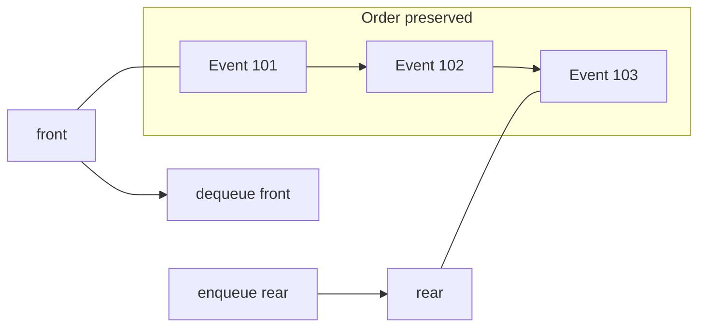
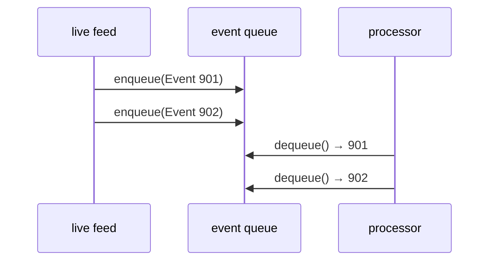
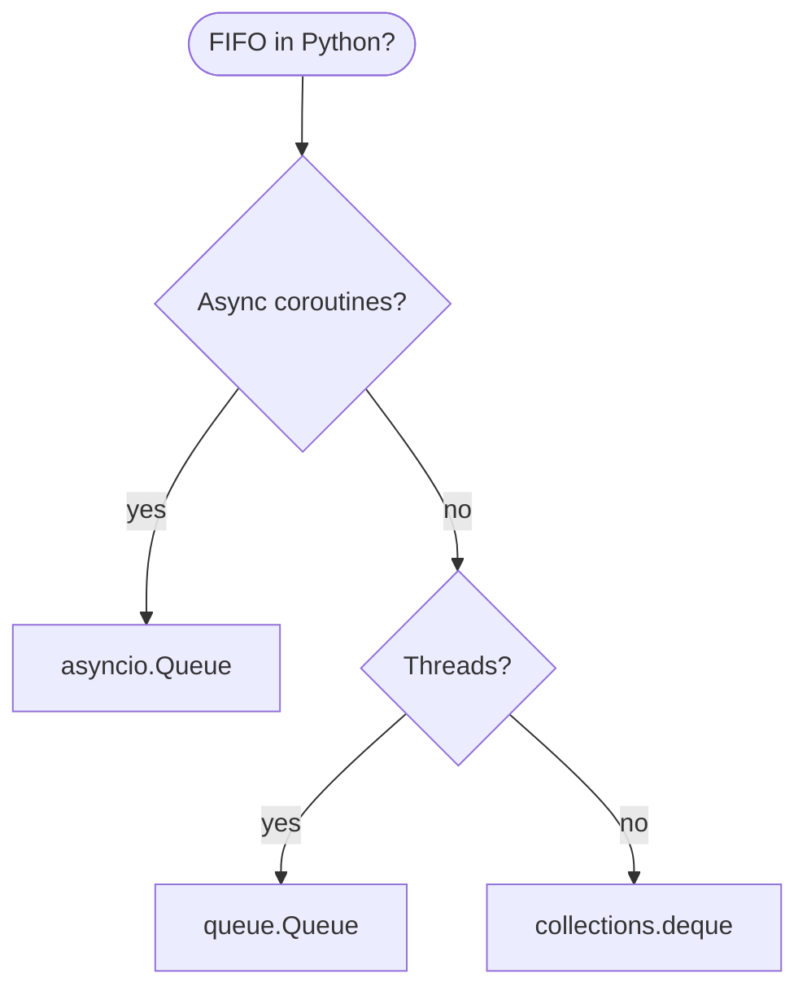
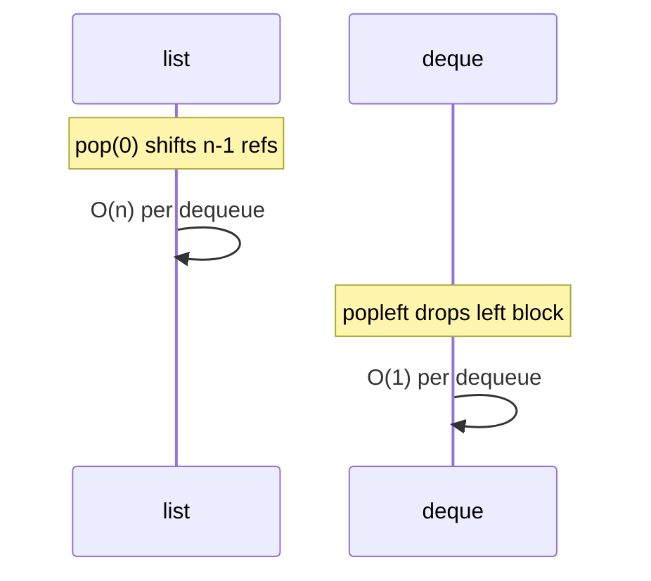
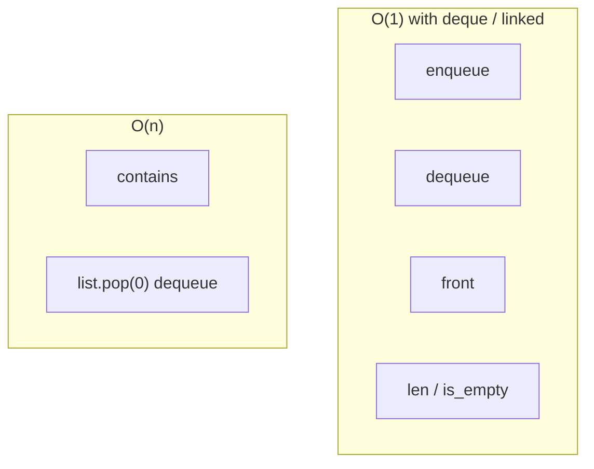
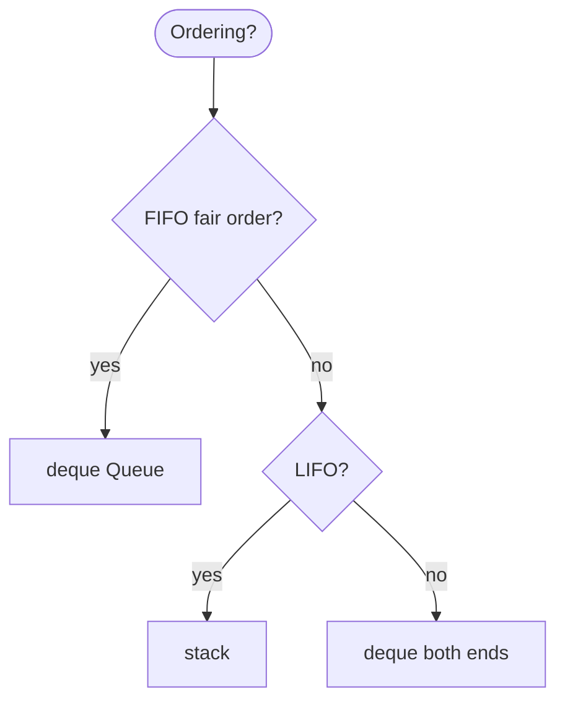
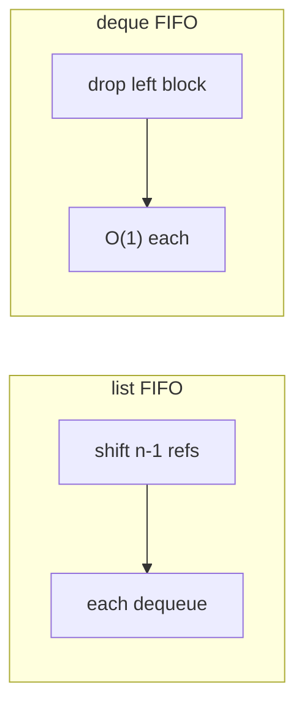

# Queue

A **first-in, first-out (FIFO)** collection: the **oldest** enqueued item is the next one removed. Fair ordering—“first come, first served.”

| | |
| --- | --- |
| **What it is** | Enqueue at the **rear**, dequeue from the **front**; optional peek at front. |
| **Core operations** | `enqueue`, `dequeue`, `front` / `peek`. |
| **When to use** | Event ingest pipelines, BFS on graphs, job workers, buffering streams, level-order tree walks. |
| **Trade-off** | No LIFO at one end only; `list.pop(0)` is O(n)—use `deque` or a proper queue. |

Queues model **arrival order**: events from a live feed hit the **back** and workers take them from the **front**; BFS layers **graph hops** when exploring an unweighted network; a **job queue** runs background tasks without starving early requests. Large archive tables are not a queue—they are random-access storage ([Array-based lists](../array-based-lists/index.md)).

This page is your **ready reference**: every way to build a FIFO queue in Python, list vs linked vs `deque`, full implementations, operation-level complexity, and why **`list.pop(0)` fails** at scale. For Big-O notation, see [Complexity analysis](../../complexity/index.md).

[Parent: Data structures](../index.md)

---

## Queue vs stack vs deque

| | **Queue (FIFO)** | [Stack (LIFO)](../stacks/index.md) | [Deque](../dequeue-deque/index.md) |
| --- | --- | --- | --- |
| **Remove** | Oldest (front) | Newest (top) | Either end O(1) |
| **Insert for FIFO** | Rear | Top | `append` rear, `appendleft` if reversing |
| **Python default** | `deque` or `Queue` | `list` | `collections.deque` |
| **Example** | Event processing order | Undo edits | Sliding window + FIFO |



Throughout this page, **n** is the queue length.

---

## What a queue models

| Use case | Queue view | Notes |
| --- | --- | --- |
| **Live event feed** | Producer `enqueue`; consumer `dequeue` | Preserves arrival order |
| **BFS on graph** | Queue of `(node, depth)` | Shortest path in unweighted graph |
| **Background jobs** | “Run report for task X” | Fair worker pool |
| **Timeline replay** | Events played in broadcast order | Not the same as stack undo |
| **Level-order tree** | Schedule tree nodes by depth | Queue + children |

```python
from dataclasses import dataclass

@dataclass(frozen=True)
class LogEvent:
 event_id = 0
 source = ""
 priority = 0
 message = ""
 score = 0.0

@dataclass(frozen=True)
class Job:
 task_id = ""
 run_id = 0
 report = ""
```

---

## Mental model: front, rear, and fairness

**Front** = next to leave. **Rear** = where new items join.



| Operation | FIFO meaning | Example |
| --- | --- | --- |
| `enqueue` | Join the line at rear | New event arrives from API |
| `dequeue` | Serve front | Worker handles oldest pending item |
| `peek` | Look at front, keep queue | Check next without removing |

---

## Ways to create a queue in Python

### 1. `collections.deque` (recommended)

```python
from collections import deque

event_queue= deque()
event_queue.append(new_event)
nxt = event_queue.popleft()
```

| | |
| --- | --- |
| **Time** | O(1) enqueue/dequeue |
| **Space** | O(n) |

### 2. `queue.Queue` (thread-safe, blocking)

```python
from queue import Queue

q= Queue()
q.put(event)
p = q.get()
```

| | |
| --- | --- |
| **Time** | O(1) typical |
| **Space** | O(n) |

### 3. `queue.SimpleQueue` (3.7+, simpler, thread-safe)

```python
from queue import SimpleQueue

sq= SimpleQueue()
sq.put(Job("task-01", 2024, "latency_report"))
job = sq.get()
```

| | |
| --- | --- |
| **Time** | O(1) |
| **Space** | O(n) |

### 4. Python `list` — enqueue `append`, dequeue `pop(0)` ⚠️

```python
q= []
q.append(event)
p = q.pop(0)
```

| | |
| --- | --- |
| **Time** | O(1) enqueue; **O(n) dequeue** |
| **Space** | O(n) |

**Do not** use `pop(0)` in a hot loop over thousands of events per batch.

### 5. `ListQueue` wrapper (deque inside)

```python
class ListQueue:
 def __init__(self):
 from collections import deque
 self._dq= deque()
```

### 6. Linked-list queue (maintain `head` + `tail`)

See [Reference implementation](#reference-implementation-linkedqueue) below.

### 7. `asyncio.Queue` for async pipelines

```python
import asyncio

async def main():
 aq= asyncio.Queue()
 await aq.put(LogEvent(1, "api-01", 1, "request_ok", 0.0))
 p = await aq.get()
```

| | |
| --- | --- |
| **Time** | O(1) amortized |
| **Space** | O(n) |



---

## Why `list.pop(0)` loses to `deque`

CPython `list` is a **dynamic array**. Index `0` is the front. Removing it **shifts** every remaining element one slot left.

| n (queue length) | `list.pop(0)` cost | `deque.popleft()` cost |
| --- | --- | --- |
| 100 | O(100) | O(1) |
| 10,000 | O(10,000) | O(1) |

Processing **every event** in a batch with `list.pop(0)` costs **O(n²)** over the batch. `deque` uses a **block chain** in C: pops from the left without shifting the whole sequence.

```python
events= []
events.append(incoming)
while events:
 process(events.pop(0))

from collections import deque
events_q= deque()
events_q.append(incoming)
while events_q:
 process(events_q.popleft())
```



---

## Reference implementation: `DequeQueue`

Thin FIFO wrapper over `collections.deque`.

```python

from collections import deque

class DequeQueue:
 def __init__(self, items= None):
 self._items= deque(items) if items is not None else deque()

 def __len__(self):
 return len(self._items)

 def is_empty(self):
 return len(self._items) == 0

 def enqueue(self, item):
 self._items.append(item)

 def dequeue(self):
 if not self._items:
 raise IndexError("dequeue from empty queue")
 return self._items.popleft()

 def front(self):
 if not self._items:
 raise IndexError("front from empty queue")
 return self._items[0]

 def try_front(self):
 return self._items[0] if self._items else None

 def rear(self):
 if not self._items:
 raise IndexError("rear from empty queue")
 return self._items[-1]

 def clear(self):
 self._items.clear()

 def contains(self, item):
 return item in self._items

 def extend_enqueue(self, items):
 self._items.extend(items)

 def __iter__(self):
 yield from self._items
```

---

## Reference implementation: `LinkedQueue`

```python
from dataclasses import dataclass

@dataclass
class QNode:
 data = None
 next= None

class LinkedQueue:
 def __init__(self):
 self._head= None
 self._tail= None
 self._size = 0

 def __len__(self):
 return self._size

 def is_empty(self):
 return self._head is None

 def enqueue(self, item):
 node = QNode(item)
 if self._tail is None:
 self._head = self._tail = node
 else:
 self._tail.next = node
 self._tail = node
 self._size += 1

 def dequeue(self):
 if self._head is None:
 raise IndexError("dequeue from empty queue")
 data = self._head.data
 self._head = self._head.next
 if self._head is None:
 self._tail = None
 self._size -= 1
 return data

 def front(self):
 if self._head is None:
 raise IndexError("front from empty queue")
 return self._head.data

 def clear(self):
 self._head = self._tail = None
 self._size = 0
```

| Implementation | `enqueue` | `dequeue` | Notes |
| --- | --- | --- | --- |
| `deque` | O(1) | O(1) | **Use in production** |
| `list` + `pop(0)` | O(1) | O(n) | Avoid |
| `LinkedQueue` | O(1) | O(1) | Teaching; pointer overhead |

---

## All operations (with examples and complexity)



### `enqueue(item)` — add at rear

```python
q = DequeQueue()
q.enqueue(LogEvent(101, "api-01", 1, "retry", 0.2))
q.enqueue(LogEvent(102, "api-01", 1, "timeout", 1.1))
```

| | |
| --- | --- |
| **Time** | O(1) |
| **Space** | O(1) auxiliary |

---

### `dequeue()` — remove front

```python
first = q.dequeue()
assert first.event_id == 101
```

| | |
| --- | --- |
| **Time** | O(1) `deque` / linked; **O(n)** `list.pop(0)` |
| **Space** | O(1) |

**FIFO rule:** Worker always processes the **oldest unprocessed** item in the buffer.

---

### `front()` / `try_front()` — peek

```python
nxt = q.front()
```

| | |
| --- | --- |
| **Time** | O(1) |
| **Space** | O(1) |

---

### `rear()` — peek at newest (optional)

| | |
| --- | --- |
| **Time** | O(1) on `deque` |
| **Space** | O(1) |

---

### `is_empty()` / `len(q)`

| | |
| --- | --- |
| **Time** | O(1) |
| **Space** | O(1) |

---

### `clear()` / `extend_enqueue` / iteration

```python
for event in q:
 print(event.event_id)
```

| | |
| --- | --- |
| **Time** | O(n) traverse |
| **Space** | O(1) iterator |

---

## Practical patterns with queues

### Live event processor

```python
def drain_events(q, max_batch= 50):
 scores= []
 for _ in range(min(max_batch, len(q))):
 event = q.dequeue()
 scores.append(event.score)
 return scores
```

| | |
| --- | --- |
| **Time** | O(batch) |
| **Space** | O(batch) |

### BFS — shortest path on unweighted graph

```python
def bfs(start, adj):
 dist = {start: 0}
 q= deque([start])
 while q:
 u = q.popleft()
 for v in adj.get(u, []):
 if v not in dist:
 dist[v] = dist[u] + 1
 q.append(v)
 return dist
```

| | |
| --- | --- |
| **Time** | O(V + E) |
| **Space** | O(V) |

BFS gives minimum **number of hops** in an unweighted graph (not weighted path cost).

### Level-order traversal of tree

```python
def level_order(root):
 if root is None:
 return []
 out= []
 q= deque([root])
 while q:
 node = q.popleft()
 out.append(node.data)
 if node.next:
 q.append(node.next)
 return out
```

| | |
| --- | --- |
| **Time** | O(n) nodes |
| **Space** | O(width) |

---

## Circular queue (array-based, fixed capacity)

Useful when buffer size is **fixed** (ring buffer). Indices wrap with modulo.

```python
class CircularArrayQueue:
 def __init__(self, capacity):
 self._cap = capacity
 self._data= [None] * capacity
 self._head = 0
 self._tail = 0
 self._size = 0

 def enqueue(self, item):
 if self._size == self._cap:
 raise OverflowError("queue full")
 self._data[self._tail] = item
 self._tail = (self._tail + 1) % self._cap
 self._size += 1

 def dequeue(self):
 if self._size == 0:
 raise IndexError("dequeue from empty queue")
 item = self._data[self._head]
 self._head = (self._head + 1) % self._cap
 self._size -= 1
 return item
```

| | |
| --- | --- |
| **Time** | O(1) |
| **Space** | O(capacity) |

For variable size in Python, prefer `deque` over manual rings unless you are implementing a embedded systems style buffer.

---

## Master complexity table

| Operation | `deque` | `list.pop(0)` | `LinkedQueue` |
| --- | --- | --- | --- |
| `enqueue` | O(1) | O(1) append | O(1) |
| `dequeue` | O(1) | **O(n)** | O(1) |
| `front` | O(1) | O(1) | O(1) |
| `len` | O(1) | O(1) | O(1) |
| `contains` | O(n) | O(n) | O(n) |
| BFS | O(V+E) | — | — |

**Storage:** Θ(n) for n queued items.

---

## Python stdlib: what to use

| Need | API |
| --- | --- |
| Scripts, asyncio-adjacent sync code | `collections.deque` |
| Multi-thread workers | `queue.Queue` |
| Async consumers | `asyncio.Queue` |
| Process pools | `multiprocessing.Queue` |
| Priority by rank | [Priority queue](../priority-queue/index.md) — not FIFO |

---

## When queue vs stack vs deque



| Scenario | Queue | Alternative |
| --- | --- | --- |
| Event ingest | `deque` FIFO | — |
| Undo edits | Stack | — |
| Last-k sliding window | `deque(maxlen=k)` | [Deque page](../dequeue-deque/index.md) |
| Sort archive by score | Not queue | `sorted` / pandas |

---

## Common pitfalls

| Pitfall | Why it hurts | Fix |
| --- | --- | --- |
| `list.pop(0)` in hot path | O(n²) per batch | `deque.popleft()` |
| `deque.pop()` instead of `popleft` | LIFO not FIFO | `popleft` = dequeue |
| Unbounded queue on fast feed | Memory exhaustion | `maxlen` or drop policy |
| `Queue.get` without timeout | Blocks forever | `get(timeout=...)` |
| Peeking empty queue | `IndexError` | `try_front` |
| Using queue for priority exports | Wrong order | priority heap |

---

## `LinkedQueue` — remaining operations

### `rear()` / `try_rear()` — peek newest

```python
lq = LinkedQueue()
lq.enqueue(LogEvent(1, "api-01", 1, "ok", 0.0))
lq.enqueue(LogEvent(2, "api-01", 1, "warn", 0.1))
assert lq.rear().event_id == 2
```

| | |
| --- | --- |
| **Time** | O(1) with tail pointer |
| **Space** | O(1) |

---

### `extend_enqueue` — bulk append at rear

```python
batch = [LogEvent(i, "api-01", 1, "batch", 0.0) for i in range(100, 110)]
for r in batch:
 lq.enqueue(r)
```

| | |
| --- | --- |
| **Time** | O(k) |
| **Space** | O(1) aux per item |

---

### `contains` / iteration

| | |
| --- | --- |
| **Time** | O(n) |
| **Space** | O(1) |

---

## Threading and async queues

### `queue.Queue` — blocking producer/consumer

```python
from queue import Queue
from threading import Thread

def producer(q, events):
 for e in events:
 q.put(e)

def consumer(q):
 while True:
 e = q.get()
 if e is None:
 break
 q.task_done()

q= Queue(maxsize=1000)
Thread(target=producer, args=(q, events)).start()
```

| | |
| --- | --- |
| **Time** | O(1) put/get typical |
| **Space** | Bounded by `maxsize` |

Back-pressure when the live feed outpaces the worker—`maxsize` prevents unbounded RAM.

---

### `asyncio.Queue` — async job pipeline

```python
import asyncio

async def worker(q):
 while True:
 job = await q.get()
 await run_report(job)
 q.task_done()

async def main():
 q= asyncio.Queue()
 asyncio.create_task(worker(q))
 await q.put(Job("task-01", 2024, "latency_summary"))
 await q.join()
```

| | |
| --- | --- |
| **Time** | O(1) await put/get |
| **Space** | O(n) pending jobs |

---

## Micro-benchmark intuition: `list.pop(0)` vs `deque`

For **n = 10,000** dequeues from a growing-then-shrinking queue:

| Implementation | Rough comparative cost |
| --- | --- |
| `list.pop(0)` | Sum of 1..n → **O(n²)** |
| `deque.popleft()` | **O(n)** total |

You do not need to benchmark every script—if the queue is **small** (hundreds of events), `list.pop(0)` might “feel fine.” If the queue is **long-running** or **high-throughput streaming**, use `deque`.



---

## Double-ended BFS (0-1 BFS sketch)

When edge weights are 0 or 1, use `deque` and push to front on 0-cost edges:

```python
def zero_one_bfs(start, adj):
 dist = {start: 0}
 q= deque([start])
 while q:
 u = q.popleft()
 for v, w in adj.get(u, []):
 nd = dist[u] + w
 if v not in dist or nd < dist[v]:
 dist[v] = nd
 if w == 0:
 q.appendleft(v)
 else:
 q.append(v)
 return dist
```

| | |
| --- | --- |
| **Time** | O(V + E) |
| **Space** | O(V) |

---

## `DequeQueue` method checklist

| Method | Time | Use case |
| --- | --- | --- |
| `enqueue` | O(1) | New event arrives |
| `dequeue` | O(1) | Worker takes oldest |
| `front` / `try_front` | O(1) | Preview next |
| `rear` | O(1) | Newest in buffer |
| `extend_enqueue` | O(k) | Bulk load batch |
| `clear` | O(1) | Reset on reconnect |
| `contains` | O(n) | Rare sanity check |

---

## Related structures in this guide

| Structure | Relationship |
| --- | --- |
| [Stacks](../stacks/index.md) | LIFO opposite |
| [Dequeue (deque)](../dequeue-deque/index.md) | O(1) both ends |
| [Circularly linked list](../circularly-linked-list/index.md) | Ring buffer cousin |
| [Priority queue](../priority-queue/index.md) | Ordered by priority, not time |

---

## Quick reference card

```python
from collections import deque

q= deque()
q.append(event)
nxt = q[0]
p = q.popleft()

fq = DequeQueue()
fq.enqueue(Job("task-02", 2024, "error_rate"))
job = fq.dequeue()
```

Use a **queue** when **first in, first out** fairness matters—live events, BFS, job pipes. In Python, **`collections.deque`** is the default implementation; never dequeue with **`list.pop(0)`** at scale.

**Queue usage checklist**

1. **Live feed** — `deque` or `Queue`; producer `append`, worker `popleft`.
2. **Measure** — if dequeue feels slow, check you are not using `pop(0)`.
3. **BFS** — `deque` of visited frontier on a graph.
4. **Not for** — archive sorting, random access, undo stacks.
