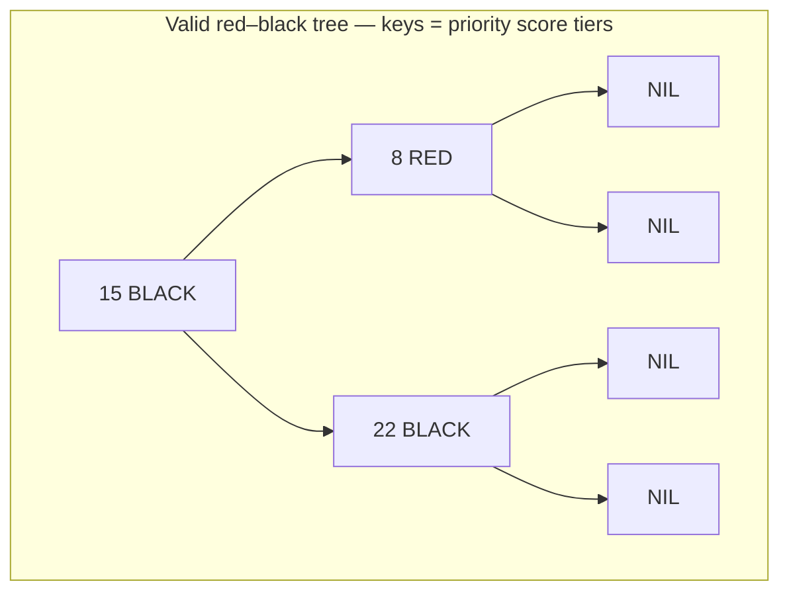
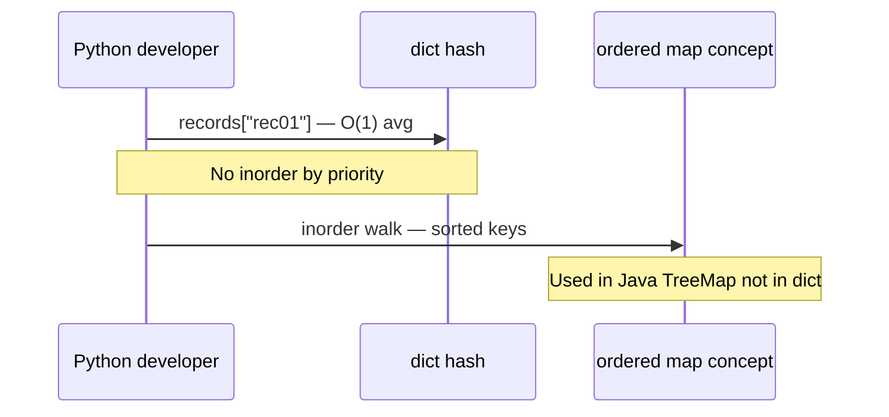
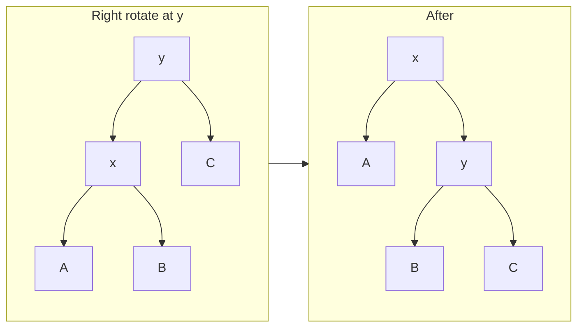
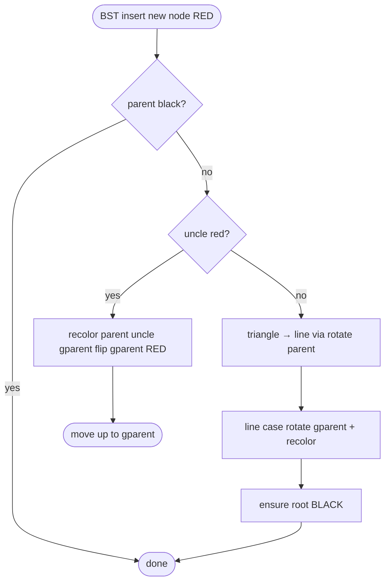
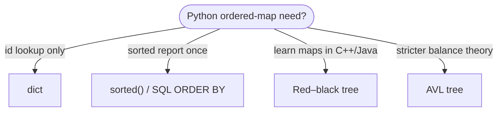

# Red–black tree

A **self-balancing binary search tree** where every node is colored **red** or **black** and five **coloring rules** guarantee height **O(log n)**. Inserts and deletes fix violations with **recoloring** and at most **two rotations**—the design behind many language **sorted maps** (C++ `std::map`, Java `TreeMap`), though **Python’s built-in `dict` is not a red–black tree**.

| | |
| --- | --- |
| **What it is** | A [BST](../binary-search-tree/index.md) plus color bit and color invariants; root is black; no two consecutive reds on a path. |
| **Core operations** | `search`, `insert`, `delete` in O(log n) worst case. |
| **Balance** | Looser than [AVL](../avl-tree/index.md)—fewer rotations on write, slightly taller. |
| **When to use** | Understanding library map/set implementations; interview “design a sorted dictionary.” |
| **Trade-off** | More cases than AVL on paper; excellent amortized behavior in practice. |

Red–black trees are the **conceptual engine** behind **ordered maps** in other ecosystems: e.g. a `TreeMap<(timestamp, record_id), RecordInfo>` for chronologically sorted lookup with guaranteed log updates. In **Python**, you use **`dict`** for `id → record` (hash table) and **`sorted()` / SQL** for sorted reports—not an ordered map in stdlib. Learn red–black trees to **compare balancing strategies** and to read **CPython-adjacent** designs (some third-party sorted containers use similar ideas).

This page is your **ready reference**: invariants, insert/delete fixups, Python teaching implementation, practical examples, and complexity tables. For Big-O notation, see [Complexity analysis](../../complexity/index.md).

[Parent: Data structures](../index.md)

---

## Red–black rules (invariants)

1. Every node is **red** or **black**.
2. The **root** is **black**.
3. Every **leaf (NIL)** is **black** (often represented as `None` with implicit black).
4. If a node is **red**, both children are **black** (no **double red**).
5. Every path from a node to its descendant NILs has the **same number of black nodes** (**black-height**).

Together, these force height ≤ **2 log(n + 1)**.



Throughout this page, **n** = node count.

---

## How red–black fits ordered-map problems

| Use case | Ordered-map view | Note |
| --- | --- | --- |
| **Chronological index** | Key `(timestamp, record_id)` → payload | Ordered iteration by time |
| **Priority tier ladder** | Sorted unique score thresholds | Insert/delete with log guarantee |
| **Event log index** | Sequence-ordered tree | Other langs; Python uses heap/list often |
| **Compare to Python** | Mental model for Java/C++ maps | `dict` = hash, not comparison order |

**Ship Python with `dict` + sort.** **Study red–black** to explain **why sorted maps in C++/Java are O(log n)** and how that differs from Python hashing.

---

## Red–black vs AVL vs BST vs Python `dict`

| | **Red–black** | [AVL](../avl-tree/index.md) | [BST](../binary-search-tree/index.md) | **`dict` / `set`** |
| --- | --- | --- | --- | --- |
| **Worst search** | O(log n) | O(log n) | O(n) skewed | O(1) average |
| **Insert rotations** | ≤ 2 | ≤ 2 (stricter rebalance) | 0 | N/A |
| **Key order** | Inorder sorted | Inorder sorted | Inorder sorted | Insertion order (3.7+), not sort order |
| **Implementation** | Color cases | Balance factor | Simple | Hash + probe |
| **Lookup by id only** | Overkill in Python | Overkill | Overkill | **Correct tool** |

!!! note "Python `dict` is a hash table, not a red–black tree"
 **`dict`** gives average **O(1)** lookup by hashable key. It does **not** maintain **comparison-based sorted order**. Need sorted keys? **`sorted(d.keys())`**, **`bisect`** on a list, or third-party **`sortedcontainers.SortedDict`**.



---

## Node definition

```python
from __future__ import annotations

from dataclasses import dataclass
from enum import Enum
from typing import Any, Iterator


class Color(Enum):
 RED = 0
 BLACK = 1


@dataclass(frozen=True, order=True)
class IndexKey:
 priority: int
 record_id: str


@dataclass
class RBNode:
 key: Any
 color: Color = Color.RED
 left: RBNode | None = None
 right: RBNode | None = None
 parent: RBNode | None = None
```

| | |
| --- | --- |
| **Time** | O(1) |
| **Space** | O(1) per node |

---

## Rotations (same as AVL)

```python
def _left_rotate(tree: "RedBlackTree", x: RBNode) -> None:
 y = x.right
 assert y is not None
 x.right = y.left
 if y.left is not None:
 y.left.parent = x
 y.parent = x.parent
 if x.parent is None:
 tree.root = y
 elif x is x.parent.left:
 x.parent.left = y
 else:
 x.parent.right = y
 y.left = x
 x.parent = y


def _right_rotate(tree: "RedBlackTree", y: RBNode) -> None:
 x = y.left
 assert x is not None
 y.left = x.right
 if x.right is not None:
 x.right.parent = y
 x.parent = y.parent
 if y.parent is None:
 tree.root = x
 elif y is y.parent.right:
 y.parent.right = x
 else:
 y.parent.left = x
 x.right = y
 y.parent = x
```

| | |
| --- | --- |
| **Time** | O(1) |
| **Space** | O(1) |



---

## Insert fixup (teaching outline)

Standard BST insert as **red**, then fix **double-red** violations walking up:

| Case | Condition | Action |
| --- | --- | --- |
| **1** | Parent black | Done |
| **2** | Uncle red | Recolor parent, uncle, grandparent; continue at grandparent |
| **3** | Uncle black, triangle | Rotate parent to line case |
| **4** | Uncle black, line | Rotate grandparent + recolor | 



---

## Full implementation sketch: `RedBlackTree`

Teaching implementation with **insert** and **search** (delete is longer but follows CLRS symmetric fixup).

```python
class RedBlackTree:
 def __init__(self) -> None:
 self.root: RBNode | None = None
 self._size = 0

 def __len__(self) -> int:
 return self._size

 def search(self, key: Any) -> RBNode | None:
 cur = self.root
 while cur is not None:
 if key == cur.key:
 return cur
 cur = cur.left if key < cur.key else cur.right
 return None

 def insert(self, key: Any) -> None:
 node = RBNode(key, color=Color.RED)
 parent: RBNode | None = None
 cur = self.root
 while cur is not None:
 parent = cur
 if key < cur.key:
 cur = cur.left
 elif key > cur.key:
 cur = cur.right
 else:
 return # duplicate
 node.parent = parent
 if parent is None:
 self.root = node
 elif key < parent.key:
 parent.left = node
 else:
 parent.right = node
 self._insert_fixup(node)
 self._size += 1

 def _insert_fixup(self, node: RBNode) -> None:
 while node.parent is not None and node.parent.color == Color.RED:
 assert node.parent.parent is not None
 if node.parent is node.parent.parent.left:
 uncle = node.parent.parent.right
 if uncle is not None and uncle.color == Color.RED:
 node.parent.color = Color.BLACK
 uncle.color = Color.BLACK
 node.parent.parent.color = Color.RED
 node = node.parent.parent
 else:
 if node is node.parent.right:
 node = node.parent
 _left_rotate(self, node)
 node.parent.color = Color.BLACK
 node.parent.parent.color = Color.RED
 _right_rotate(self, node.parent.parent)
 else:
 uncle = node.parent.parent.left
 if uncle is not None and uncle.color == Color.RED:
 node.parent.color = Color.BLACK
 uncle.color = Color.BLACK
 node.parent.parent.color = Color.RED
 node = node.parent.parent
 else:
 if node is node.parent.left:
 node = node.parent
 _right_rotate(self, node)
 node.parent.color = Color.BLACK
 node.parent.parent.color = Color.RED
 _left_rotate(self, node.parent.parent)
 if self.root is not None:
 self.root.color = Color.BLACK

 def inorder(self) -> list[Any]:
 out: list[Any] = []
 self._inorder(self.root, out)
 return out

 def _inorder(self, node: RBNode | None, out: list[Any]) -> None:
 if node is None:
 return
 self._inorder(node.left, out)
 out.append(node.key)
 self._inorder(node.right, out)

 def inorder_iter(self) -> Iterator[Any]:
 stack: list[RBNode] = []
 cur = self.root
 while stack or cur is not None:
 while cur is not None:
 stack.append(cur)
 cur = cur.left
 cur = stack.pop()
 yield cur.key
 cur = cur.right
```

| | |
| --- | --- |
| **Insert** | O(log n) time, O(1) rotations amortized |
| **Space** | O(n) |

---

## Ways to create a red–black tree

### 1. Empty tree

```python
tree = RedBlackTree()
```

### 2. Insert unsorted score tiers

```python
tree = RedBlackTree()
for priority, rid in [(182, "rec01"), (121, "rec03"), (225, "rec07"), (150, "rec02")]:
 tree.insert(IndexKey(priority, rid))
assert [k.priority for k in tree.inorder()] == sorted([182, 121, 225, 150])
```

| | |
| --- | --- |
| **Time** | O(n log n) |
| **Space** | O(n) |

### 3. Sorted insert — still O(log n) height

Unlike plain BST, inserting ascending `(timestamp, id)` stays balanced.

```python
tree = RedBlackTree()
for t in range(1, 19):
 tree.insert(IndexKey(t, f"rec{t}"))
```

---

## Operations with practical examples

### Search — find record at priority tier

```python
tree = RedBlackTree()
tree.insert(IndexKey(195, "rec01"))
found = tree.search(IndexKey(195, "rec01"))
assert found is not None
```

| | |
| --- | --- |
| **Time** | O(log n) |
| **Space** | O(1) |

---

### Inorder — ascending priority

```python
tree = RedBlackTree()
entries = [(140, "A"), (215, "B"), (90, "C")]
for priority, rid in entries:
 tree.insert(IndexKey(priority, rid))
for k in tree.inorder_iter():
 print(f"{k.record_id}: {k.priority}")
```

| | |
| --- | --- |
| **Time** | O(n) |
| **Space** | O(log n) stack |

---

## Application: ordered chronology (conceptual)

In Java/C++ you might write:

```text
TreeMap<TimestampRecord, RecordInfo> chronology;
chronology.put(new TimestampRecord(1, "rec01"), record);
```

Python equivalent patterns:

```python
records_by_id: dict[str, dict] = {"rec01": {"ts": 1, "symbol": "alpha"}}

records = sorted(records_by_id.values(), key=lambda r: (r["ts"], r.get("id", "")))

schedule_rb = RedBlackTree()
schedule_rb.insert(IndexKey(1, "rec01"))
```

| Approach | Lookup by id | Sorted by timestamp |
| --- | --- | --- |
| `dict` | O(1) avg | Sort separately O(n log n) |
| Red–black (other langs) | O(log n) | Inorder O(n) |
| SQL index | B-tree under the hood | `ORDER BY` |

---

## Delete fixup (outline)

BST delete, then if removed node was black, fix **extra black** on path with sibling cases (CLRS §13.4). Same rotation primitives as insert.

| Case | Idea |
| --- | --- |
| Sibling red | Rotate parent; recolor |
| Sibling black, both nephews black | Recolor sibling red; propagate |
| Far nephew black | Rotate sibling; recolor |
| Near/far red nephew | Rotate parent; recolor |

| | |
| --- | --- |
| **Time** | O(log n) |
| **Space** | O(log n) |

---

## Master complexity table

| Operation | Time | Space (aux) | Notes |
| --- | --- | --- | --- |
| Search | O(log n) | O(1) | |
| Insert | O(log n) | O(1) | ≤ 2 rotations |
| Delete | O(log n) | O(1) | ≤ 3 rotations |
| Inorder | O(n) | O(log n) | |
| Storage | — | O(n) | color + key + pointers |

---

## When to pick which structure



---

## Common pitfalls

| Pitfall | Why it hurts | Fix |
| --- | --- | --- |
| Assuming `dict` is ordered by value | Wrong API expectations | `sorted(d.items(), key=...)` |
| Forgetting to blacken root after insert | Invariant broken | Always set `root.color = BLACK` at end |
| Confusing insertion order with sort order | Python 3.7+ dict order ≠ sorted | Explicit sort or tree |
| Implementing delete before insert solid | RB delete is hardest | Master insert + rotations first |
| Using RB tree for hashable IDs only | Hash wins in Python | `dict[str, Record]` |

---

## Related pages

| Page | Relationship |
| --- | --- |
| [Binary search tree](../binary-search-tree/index.md) | Base ordering |
| [AVL tree](../avl-tree/index.md) | Stricter balance |
| [2-3-4 tree](../2-3-4-tree/index.md) | Isomorphic to red–black |
| [Hash table](../hash-table/index.md) | Python `dict` |
| [Complexity analysis](../../complexity/index.md) | Big-O |
| [Data structures hub](../index.md) | Index |

---

## Quick reference card

```python
tree = RedBlackTree()
tree.insert(IndexKey(175, "rec09"))
tree.search(IndexKey(175, "rec09"))
list(tree.inorder_iter())
```

A **red–black tree** is the **standard balanced BST** behind many **sorted map** APIs—compare with **[AVL](../avl-tree/index.md)** and remember **`dict` in Python is hashed**, not red–black.
