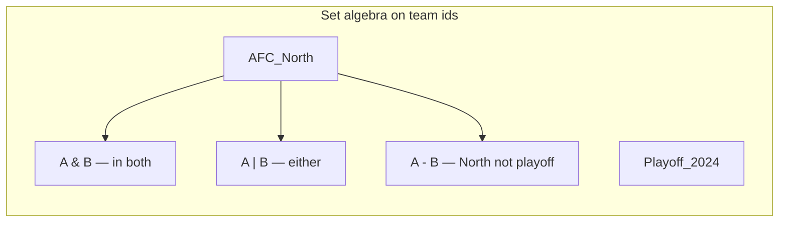
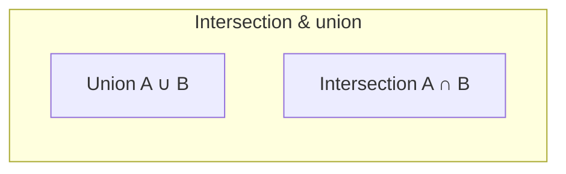
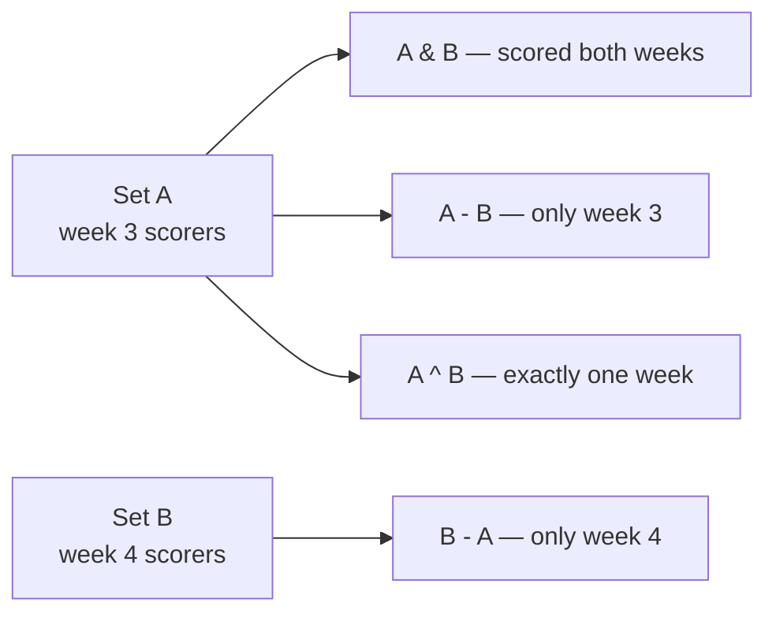

# Sets

An abstract collection of **unique** elements where **membership**, **insert**, and **remove** dominate the API. **Unordered** sets usually sit on **hash tables**; **ordered** sets sit on **balanced BSTs** (red–black in many languages). Python’s built-in `set` and `frozenset` are hash-based and unordered.

| | |
| --- | --- |
| **What it is** | No duplicate members; typical ops: `add`, `discard`, `in`, and set algebra (`|`, `&`, `-`, `^`). |
| **Core operations** | Average O(1) hash set ops; O(log n) tree set ops; algebra on two sets of size n, m is O(n + m) with hashing. |
| **When to use** | Deduplication, fast membership, division/team pools, roster tags, and combining player groups. |
| **Trade-off** | Hash sets sacrifice sorted iteration; tree sets cost more per op but give order. |

In **NFL data analysis**, sets model **divisions**, **active rosters**, **skill-position tags**, and **“who played in both games”** style questions without duplicate rows. You will still join large tables in **pandas**—sets excel for **small-to-medium unique collections** and **algebra** on team ids.

This page is your **ready reference**: ADT semantics, hash vs tree implementations, full Python patterns, every operation with NFL-flavored examples, and **time and space complexity**. For Big-O notation, see [Complexity analysis](../../complexity/index.md).

[Parent: Data structures](../index.md)

---

## How sets fit NFL-shaped problems

| NFL idea | Set view | Typical op |
| --- | --- | --- |
| **AFC North teams** | 4 franchise ids | `membership`, iterate |
| **Players who caught TD in week 3 and 4** | Intersection of two scorer sets | `&` |
| **All WRs minus injured reserve** | Difference | `-` |
| **Home or away captains** | Union of two captain sets | `\|` |
| **Unique jersey numbers on roster** | Dedup from list | `set(list)` |
| **Frozen schedule snapshot** | Immutable set | `frozenset` |



Throughout this page, **n** = \|set A\|, **m** = \|set B\|, **u** = universe size for bitset discussion.

---

## Set vs multiset vs dict vs list

| | **Set** | Multiset (bag) | `dict` | `list` |
| --- | --- | --- | --- | --- |
| **Duplicates** | No | Counted | Keys unique | Yes |
| **`in`** | O(1) avg hash | O(1) with Counter | O(1) avg | O(n) |
| **Order** | Unordered (Py 3.7+ insertion order incidental) | Varies | Insertion order 3.7+ | Index order |
| **Algebra** | Built-in | `Counter` arithmetic | Key sets only | Manual |
| **NFL fit** | Divisions, tags | Snap counts per player | Stats per id | Play sequence |

---

## ADT operations (abstract)

| Operation | Meaning | NFL example |
| --- | --- | --- |
| `insert(x)` | Add if absent | Add team to division |
| `remove(x)` | Delete if present | Remove traded player id |
| `contains(x)` | Membership test | Is `team_id` in playoffs? |
| `size()` | Count distinct | Roster size (unique ids) |
| `union(A,B)` | All in either | AFC \| NFC pro bowl |
| `intersection(A,B)` | In both | Scorers ∩ 100-yard rushers |
| `difference(A,B)` | In A not B | Roster minus IR |
| `symmetric_difference` | In exactly one | XOR of two week lists |



---

## Ways to create a set (Python)

### 1. Empty set — **not** `{}` (that is a dict)

```python
afc_north: set[str] = set()
```

| | |
| --- | --- |
| **Time** | O(1) |
| **Space** | O(1) |

### 2. Literal with members

```python
afc_north = {"BAL", "CIN", "CLE", "PIT"}
```

| | |
| --- | --- |
| **Time** | O(k) for k members (hash each) |
| **Space** | O(k) |

### 3. From iterable — dedup play ids

```python
scorers = set(row["player_id"] for row in week3_td_rows)
```

| | |
| --- | --- |
| **Time** | O(n) average for n inputs |
| **Space** | O(unique) |

### 4. Set comprehension

```python
skill = {p["player_id"] for p in roster if p["pos"] in {"WR", "TE"}}
```

| | |
| --- | --- |
| **Time** | O(n) |
| **Space** | O(output) |

### 5. `frozenset` — immutable division snapshot

```python
div_2024 = frozenset(["BAL", "CIN", "CLE", "PIT"])
# hashable — use as dict key for "rules per division"
rules_cache[div_2024] = tiebreaker_policy
```

| | |
| --- | --- |
| **Time** | O(k) build |
| **Space** | O(k) |

### 6. From pandas column

```python
import pandas as pd

teams = set(df["posteam"].dropna().unique())
```

| | |
| --- | --- |
| **Time** | O(n) scan |
| **Space** | O(unique teams) |

---

## Hash-table set (how Python `set` behaves)

Conceptual buckets: `hash(x) % table_size` → chain or open addressing (CPython uses open addressing with perturbation).

```python
def demo_membership() -> None:
    playoff = {"KC", "BUF", "BAL", "SF"}
    assert "KC" in playoff          # O(1) average
    playoff.add("DET")              # O(1) average
    playoff.discard("BUF")          # O(1) average; no KeyError
```

| Operation | Average time | Worst time | Notes |
| --- | --- | --- | --- |
| `in` / `add` / `discard` | O(1) | O(n) | Rare bad hashes |
| `len` | O(1) | O(1) | |
| Iterate | O(n) | O(n) | |
| `union` (update many) | O(n + m) | O(n + m) | |

**Space:** Θ(n) for n members (overhead factor ~2–3 in CPython).

---

## Tree-based ordered set (concept + sketch)

Used in C++ `std::set`, Java `TreeSet`—not Python stdlib. **Red–black** or similar keeps keys sorted.

```python
# Teaching sketch only — use sortedcontainers or treap in real code
class OrderedSet:
    """BST-backed ordered set (insert/search/delete O(log n))."""

    def __init__(self) -> None:
        self.root = None  # TreapNode or RB node

    def insert(self, key: str) -> None: ...
    def contains(self, key: str) -> bool: ...
    def inorder(self) -> list[str]: ...
```

| Operation | Time | Space |
| --- | --- | --- |
| `insert` / `contains` / `remove` | O(log n) | O(1) |
| In-order iterate | O(n) | O(n) output |

**NFL use:** walk teams in alphabetical order for printed reports without sorting each time.

---

## Set algebra (full reference)

```python
afc = {"BAL", "CIN", "CLE", "PIT"}
playoff = {"BAL", "KC", "BUF", "SF"}

both = afc & playoff                    # {'BAL'}
either = afc | playoff
north_only = afc - playoff
symmetric = afc ^ playoff               # in one, not both

afc |= {"PIT"}                          # in-place union
afc &= playoff                          # in-place intersection
```



| Operation | Operator / method | Time (hash) | Space |
| --- | --- | --- | --- |
| Union | `\|`, `.union()` | O(n + m) | O(n + m) result |
| Intersection | `&`, `.intersection()` | O(min(n,m)) typical | O(output) |
| Difference | `-`, `.difference()` | O(n) | O(output) |
| Symmetric diff | `^`, `.symmetric_difference()` | O(n + m) | O(output) |
| Subset test | `<=`, `.issubset()` | O(n) | O(1) |
| Disjoint | `.isdisjoint()` | O(min(n,m)) avg | O(1) |

---

## All operations (NFL examples + complexity)

### `add(x)` — tag player as captain

```python
captains.add("player_87")
```

| **Time** | O(1) average |
| **Space** | O(1) |

### `discard(x)` / `remove(x)`

```python
captains.discard("player_99")  # silent if missing
captains.remove("player_87")   # KeyError if missing
```

| **Time** | O(1) average |
| **Space** | O(1) |

### `in` — is team in division?

```python
if "BAL" in afc_north:
    apply_division_tiebreaker()
```

| **Time** | O(1) average |
| **Space** | O(1) |

### Copy and freeze

```python
live = {"KC", "BUF"}
snapshot = live.copy()
frozen = frozenset(live)
```

| | |
| --- | --- |
| **Time** | O(n) |
| **Space** | O(n) new structure |

### Pop arbitrary element

```python
team = captains.pop()  # raises KeyError if empty
```

| **Time** | O(1) average |

---

## NFL application: division and conference pools

```python
AFC_NORTH = frozenset({"BAL", "CIN", "CLE", "PIT"})
AFC_SOUTH = frozenset({"HOU", "IND", "JAX", "TEN"})
AFC = AFC_NORTH | AFC_SOUTH  # extend with other divisions likewise

def same_division(t1: str, t2: str) -> bool:
    for div in (AFC_NORTH, AFC_SOUTH):
        if t1 in div and t2 in div:
            return True
    return False
```

| | |
| --- | --- |
| **Time** | O(1) membership per div check with small frozensets |
| **Space** | O(32) teams league-wide |

---

## NFL application: two-week scorer overlap

```python
def player_ids_with_td(rows: list[dict]) -> set[str]:
    return {r["player_id"] for r in rows if r["touchdown"]}

w3 = player_ids_with_td(week3_plays)
w4 = player_ids_with_td(week4_plays)
repeat = w3 & w4
only_w3 = w3 - w4
```

| | |
| --- | --- |
| **Time** | O(n3 + n4) build + O(min) intersect |
| **Space** | O(unique players) |

---

## NFL application: skill-position filter set

```python
SKILL = frozenset({"WR", "TE", "RB"})
skill_players = {
    p["player_id"]
    for p in roster
    if p["position"] in SKILL
}
```

---

## Bitset set (honorable implementation note)

When universe is **small and fixed** (32 teams, 53-man roster index), bit vectors give O(1) word-sized ops.

```python
def bitset_from_ids(ids: list[int], universe: int = 32) -> int:
    mask = 0
    for i in ids:
        mask |= 1 << i
    return mask

def in_bitset(mask: int, i: int) -> bool:
    return (mask >> i) & 1 == 1

def union_masks(a: int, b: int) -> int:
    return a | b
```

| Operation | Time | Space |
| --- | --- | --- |
| Union/intersect on fixed universe | O(1) word ops | O(1) |

---

## Python stdlib: `set` and `frozenset`

| Type | Mutable | Hashable | Use |
| --- | --- | --- | --- |
| `set` | Yes | No | Live roster tags, weekly builds |
| `frozenset` | No | Yes | Division constants, dict keys |

```python
# Optional ecosystem for huge graph-style sets
# pip install networkx  — not required for basic sets
import networkx as nx

G = nx.Graph()
G.add_edge("KC", "BUF")  # relationship graph, not a set ADT
```

**networkx** models **graphs** ([graphs](../graphs/index.md)), not replacement for `set`—listed when you cross team **networks** with set **nodes**.

---

## Master complexity table

| Operation | Hash set (avg) | Hash set (worst) | Tree set |
| --- | --- | --- | --- |
| `add` / `discard` / `in` | O(1) | O(n) | O(log n) |
| `len` | O(1) | O(1) | O(1) |
| Iterate all | O(n) | O(n) | O(n) |
| Union / update | O(n + m) | O(n + m) | O(n log m) merge walk |
| Intersection | O(min(n,m)) | O(n + m) | O(n log m) |
| Build from list len n | O(n) | O(n²) worst | O(n log n) |

**Space:** Θ(n) stored elements plus hash table overhead.

---

## When to pick which structure (NFL context)


| Scenario | Best tool |
| --- | --- |
| 4-team division membership | `frozenset` |
| 50k play dedup ids | `set` or pandas |
| Ordered team report | `sorted(set)` once or tree set |
| Fixed 32-team universe bitwise | bitset |

---

## Common pitfalls

| Pitfall | Why it hurts | Fix |
| --- | --- | --- |
| `s = {}` for empty set | Creates dict | `s = set()` |
| Lists in set | Unhashable TypeError | Use ids/tuples |
| Relying on set order for logic | Order not semantic in theory | Sort for display |
| O(n²) `in` in loop over list | Slow roster scans | Build `set` once |
| Mutating set while iterating | RuntimeError | Iterate on `list(s)` copy |

---

## Related pages

| Page | Relationship |
| --- | --- |
| [Hash table](../hash-table/index.md) | Implementation behind `set` |
| [Red–black tree](../red-black-tree/index.md) | Ordered set backend |
| [Treaps](../treaps/index.md) | Alternative ordered set |
| [Graphs](../graphs/index.md) | Edges, not just vertices |
| [Complexity analysis](../../complexity/index.md) | Big-O reference |

---

## Quick reference card

```python
# create
teams = set()
teams = {"KC", "BUF"}
div = frozenset(["BAL", "CIN", "CLE", "PIT"])
from_list = set(player_ids)

# membership & mutate
"x" in teams
teams.add("DET")
teams.discard("BUF")

# algebra
a | b; a & b; a - b; a ^ b
a |= b; a <= b; a.isdisjoint(b)

# copy / freeze
teams.copy()
frozenset(teams)
```

Use **`set`** for **fast unique membership and algebra** on NFL ids—use **pandas** for **column-wide** season tables.
