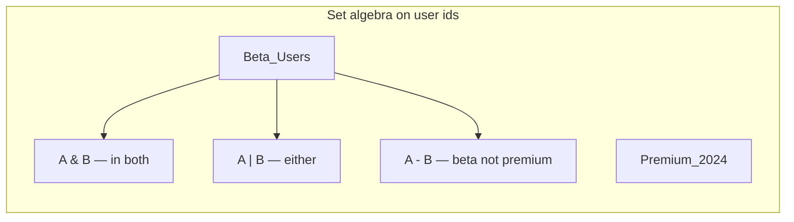
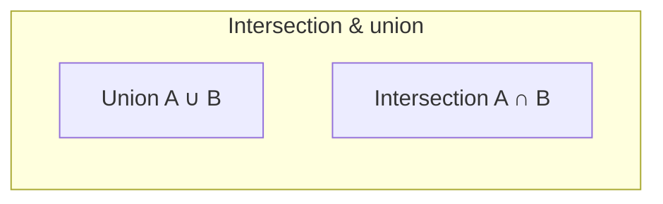
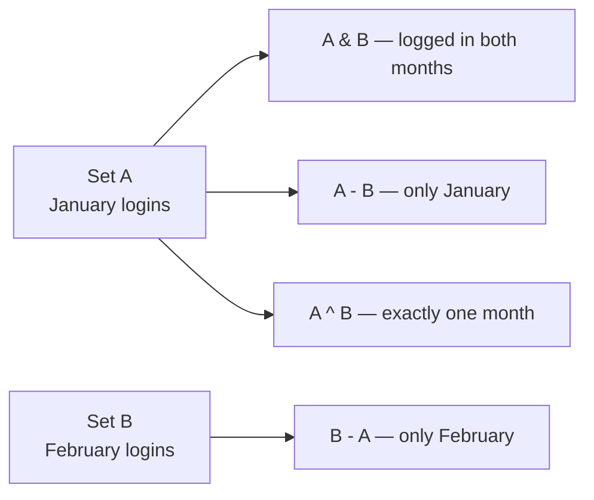

# Sets

An abstract collection of **unique** elements where **membership**, **insert**, and **remove** dominate the API. **Unordered** sets usually sit on **hash tables**; **ordered** sets sit on **balanced BSTs** (red–black in many languages). Python's built-in `set` and `frozenset` are hash-based and unordered.

| | |
| --- | --- |
| **What it is** | No duplicate members; typical ops: `add`, `discard`, `in`, and set algebra (`|`, `&`, `-`, `^`). |
| **Core operations** | Average O(1) hash set ops; O(log n) tree set ops; algebra on two sets of size n, m is O(n + m) with hashing. |
| **When to use** | Deduplication, fast membership, permission pools, feature tags, and combining user groups. |
| **Trade-off** | Hash sets sacrifice sorted iteration; tree sets cost more per op but give order. |

In **application code**, sets model **permission groups**, **active session ids**, **feature tags**, and **"which users logged in both months"** style questions without duplicate rows. You will still join large tables in **pandas** or SQL—sets excel for **small-to-medium unique collections** and **algebra** on ids.

This page is your **ready reference**: ADT semantics, hash vs tree implementations, full Python patterns, every operation with practical examples, and **time and space complexity**. For Big-O notation, see [Complexity analysis](../../complexity/index.md).

[Parent: Data structures](../index.md)

---

## How sets fit common problems

| Application | Set view | Typical op |
| --- | --- | --- |
| **Beta testers** | 4 user ids | `membership`, iterate |
| **Users active in Jan and Feb** | Intersection of two login sets | `&` |
| **All premium minus churned** | Difference | `-` |
| **Web or mobile clients** | Union of two client sets | `\|` |
| **Unique user ids in file** | Dedup from list | `set(list)` |
| **Frozen permission snapshot** | Immutable set | `frozenset` |



Throughout this page, **n** = \|set A\|, **m** = \|set B\|, **u** = universe size for bitset discussion.

---

## Set vs multiset vs dict vs list

| | **Set** | Multiset (bag) | `dict` | `list` |
| --- | --- | --- | --- | --- |
| **Duplicates** | No | Counted | Keys unique | Yes |
| **`in`** | O(1) avg hash | O(1) with Counter | O(1) avg | O(n) |
| **Order** | Unordered (Py 3.7+ insertion order incidental) | Varies | Insertion order 3.7+ | Index order |
| **Algebra** | Built-in | `Counter` arithmetic | Key sets only | Manual |
| **Typical fit** | Permission pools, tags | Event counts per user | Stats per id | Event sequence |

---

## ADT operations (abstract)

| Operation | Meaning | Example |
| --- | --- | --- |
| `insert(x)` | Add if absent | Add user to beta group |
| `remove(x)` | Delete if present | Remove deactivated account id |
| `contains(x)` | Membership test | Is `user_id` in admin set? |
| `size()` | Count distinct | Active session count (unique ids) |
| `union(A,B)` | All in either | Web \| mobile clients |
| `intersection(A,B)` | In both | Login days ∩ error days |
| `difference(A,B)` | In A not B | Active minus churned |
| `symmetric_difference` | In exactly one | XOR of two month lists |



---

## Ways to create a set (Python)

### 1. Empty set — **not** `{}` (that is a dict)

```python
beta_users: set[str] = set()
```

| | |
| --- | --- |
| **Time** | O(1) |
| **Space** | O(1) |

### 2. Literal with members

```python
beta_users = {"u-101", "u-102", "u-103", "u-104"}
```

| | |
| --- | --- |
| **Time** | O(k) for k members (hash each) |
| **Space** | O(k) |

### 3. From iterable — dedup session ids

```python
jan_logins = set(row["session_id"] for row in january_login_rows)
```

| | |
| --- | --- |
| **Time** | O(n) average for n inputs |
| **Space** | O(unique) |

### 4. Set comprehension

```python
admins = {u["user_id"] for u in users if u["role"] in {"admin", "superuser"}}
```

| | |
| --- | --- |
| **Time** | O(n) |
| **Space** | O(output) |

### 5. `frozenset` — immutable permission snapshot

```python
admin_perms = frozenset(["read", "write", "admin"])
rules_cache[admin_perms] = access_policy
```

| | |
| --- | --- |
| **Time** | O(k) build |
| **Space** | O(k) |

### 6. From pandas column

```python
import pandas as pd

users = set(df["user_id"].dropna().unique())
```

| | |
| --- | --- |
| **Time** | O(n) scan |
| **Space** | O(unique users) |

---

## Hash-table set (how Python `set` behaves)

Conceptual buckets: `hash(x) % table_size` → chain or open addressing (CPython uses open addressing with perturbation).

```python
def demo_membership() -> None:
 admins = {"u-101", "u-201", "u-301", "u-401"}
 assert "u-101" in admins
 admins.add("u-501")
 admins.discard("u-201")
```

| Operation | Average time | Worst time | Notes |
| --- | --- | --- | --- |
| `in` / `add` / `discard` | O(1) | O(n) | Rare bad hashes |
| `len` | O(1) | O(1) | |
| Iterate | O(n) | O(n) | |
| `union` (update many) | O(n + m) | O(n + m) | |

**Space:** Θ(n) for n members (overhead factor ~2–3 in CPython).

---

## Tree-based ordered set (concept + sketch)

Used in C++ `std::set`, Java `TreeSet`—not Python stdlib. **Red–black** or similar keeps keys sorted.

```python
class OrderedSet:
 def __init__(self) -> None:
 self.root = None

 def insert(self, key: str) -> None: ...
 def contains(self, key: str) -> bool: ...
 def inorder(self) -> list[str]: ...
```

| Operation | Time | Space |
| --- | --- | --- |
| `insert` / `contains` / `remove` | O(log n) | O(1) |
| In-order iterate | O(n) | O(n) output |

**Use case:** Walk usernames in alphabetical order for printed reports without sorting each time.

---

## Set algebra (full reference)

```python
beta = {"u-101", "u-102", "u-103", "u-104"}
premium = {"u-101", "u-201", "u-301", "u-401"}

both = beta & premium
either = beta | premium
beta_only = beta - premium
symmetric = beta ^ premium

beta |= {"u-105"}
beta &= premium
```



| Operation | Operator / method | Time (hash) | Space |
| --- | --- | --- | --- |
| Union | `\|`, `.union()` | O(n + m) | O(n + m) result |
| Intersection | `&`, `.intersection()` | O(min(n,m)) typical | O(output) |
| Difference | `-`, `.difference()` | O(n) | O(output) |
| Symmetric diff | `^`, `.symmetric_difference()` | O(n + m) | O(output) |
| Subset test | `<=`, `.issubset()` | O(n) | O(1) |
| Disjoint | `.isdisjoint()` | O(min(n,m)) avg | O(1) |

---

## All operations (with examples and complexity)

### `add(x)` — tag user as flagged

```python
flagged.add("u-101")
```

| **Time** | O(1) average |
| **Space** | O(1) |

### `discard(x)` / `remove(x)`

```python
flagged.discard("u-999")
flagged.remove("u-101")
```

| **Time** | O(1) average |
| **Space** | O(1) |

### `in` — is user in beta group?

```python
if "u-101" in beta_users:
 enable_beta_features()
```

| **Time** | O(1) average |
| **Space** | O(1) |

### Copy and freeze

```python
live = {"u-101", "u-201"}
snapshot = live.copy()
frozen = frozenset(live)
```

| | |
| --- | --- |
| **Time** | O(n) |
| **Space** | O(n) new structure |

### Pop arbitrary element

```python
user_id = flagged.pop()
```

| **Time** | O(1) average |

---

## Application: permission group pools

```python
READ_ONLY = frozenset({"read", "list"})
WRITE = frozenset({"read", "write", "delete"})
ADMIN = READ_ONLY | WRITE | frozenset({"admin"})

def same_tier(p1: str, p2: str) -> bool:
 for tier in (READ_ONLY, WRITE, ADMIN):
 if p1 in tier and p2 in tier:
 return True
 return False
```

| | |
| --- | --- |
| **Time** | O(1) membership per tier check with small frozensets |
| **Space** | O(permissions in policy) |

---

## Application: two-month login overlap

```python
def session_ids_with_login(rows: list[dict]) -> set[str]:
 return {r["session_id"] for r in rows if r["event"] == "login"}

jan = session_ids_with_login(january_events)
feb = session_ids_with_login(february_events)
repeat = jan & feb
only_jan = jan - feb
```

| | |
| --- | --- |
| **Time** | O(n_jan + n_feb) build + O(min) intersect |
| **Space** | O(unique sessions) |

---

## Application: error-type filter set

```python
RETRYABLE = frozenset({"timeout", "503", "connection_reset"})
retryable_hosts = {
 h["host"]
 for h in hosts
 if h["last_error"] in RETRYABLE
}
```

---

## Bitset set (honorable implementation note)

When universe is **small and fixed** (32 feature flags, 64 host index), bit vectors give O(1) word-sized ops.

```python
def bitset_from_ids(ids: list[int], universe: int = 32) -> int:
 mask = 0
 for i in ids:
 mask |= 1 << i
 return mask

def in_bitset(mask: int, i: int) -> bool:
 return (mask >> i) & 1 == 1

def union_masks(a: int, b: int) -> int:
 return a | b
```

| Operation | Time | Space |
| --- | --- | --- |
| Union/intersect on fixed universe | O(1) word ops | O(1) |

---

## Python stdlib: `set` and `frozenset`

| Type | Mutable | Hashable | Use |
| --- | --- | --- | --- |
| `set` | Yes | No | Live session tags, batch builds |
| `frozenset` | No | Yes | Permission constants, dict keys |

```python
import networkx as nx

G = nx.Graph()
G.add_edge("alice", "bob")
```

**networkx** models **graphs** ([graphs](../graphs/index.md)), not replacement for `set`—listed when you cross social **networks** with set **nodes**.

---

## Master complexity table

| Operation | Hash set (avg) | Hash set (worst) | Tree set |
| --- | --- | --- | --- |
| `add` / `discard` / `in` | O(1) | O(n) | O(log n) |
| `len` | O(1) | O(1) | O(1) |
| Iterate all | O(n) | O(n) | O(n) |
| Union / update | O(n + m) | O(n + m) | O(n log m) merge walk |
| Intersection | O(min(n,m)) | O(n + m) | O(n log m) |
| Build from list len n | O(n) | O(n²) worst | O(n log n) |

**Space:** Θ(n) stored elements plus hash table overhead.

---

## When to pick which structure


| Scenario | Best tool |
| --- | --- |
| Small permission group membership | `frozenset` |
| 50k session dedup ids | `set` or pandas |
| Ordered username report | `sorted(set)` once or tree set |
| Fixed 32-flag universe bitwise | bitset |

---

## Common pitfalls

| Pitfall | Why it hurts | Fix |
| --- | --- | --- |
| `s = {}` for empty set | Creates dict | `s = set()` |
| Lists in set | Unhashable TypeError | Use ids/tuples |
| Relying on set order for logic | Order not semantic in theory | Sort for display |
| O(n²) `in` in loop over list | Slow user scans | Build `set` once |
| Mutating set while iterating | RuntimeError | Iterate on `list(s)` copy |

---

## Related pages

| Page | Relationship |
| --- | --- |
| [Hash table](../hash-table/index.md) | Implementation behind `set` |
| [Red–black tree](../red-black-tree/index.md) | Ordered set backend |
| [Treaps](../treaps/index.md) | Alternative ordered set |
| [Graphs](../graphs/index.md) | Edges, not just vertices |
| [Complexity analysis](../../complexity/index.md) | Big-O reference |

---

## Quick reference card

```python
users = set()
users = {"u-101", "u-201"}
perms = frozenset(["read", "write", "admin"])
from_list = set(user_ids)

"x" in users
users.add("u-301")
users.discard("u-201")

a | b; a & b; a - b; a ^ b
a |= b; a <= b; a.isdisjoint(b)

users.copy()
frozenset(users)
```

Use **`set`** for **fast unique membership and algebra** on user or session ids—use **pandas** or SQL for **column-wide** archive tables.
