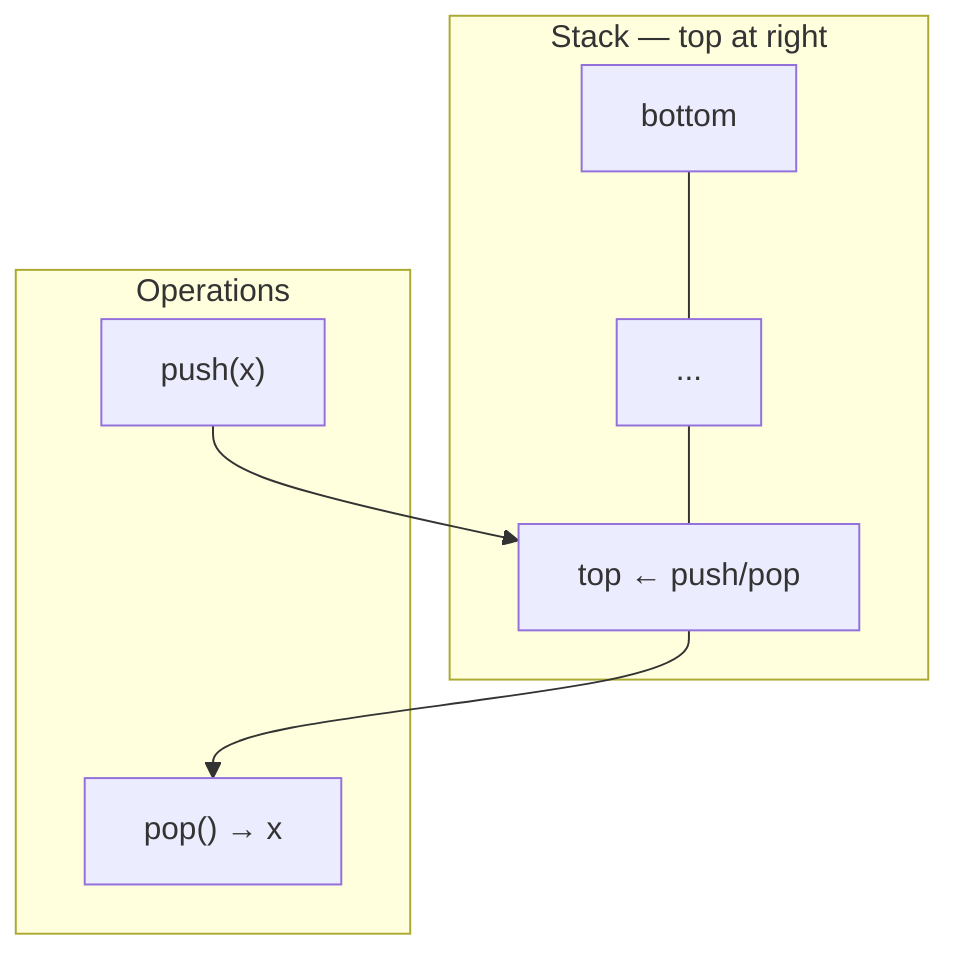
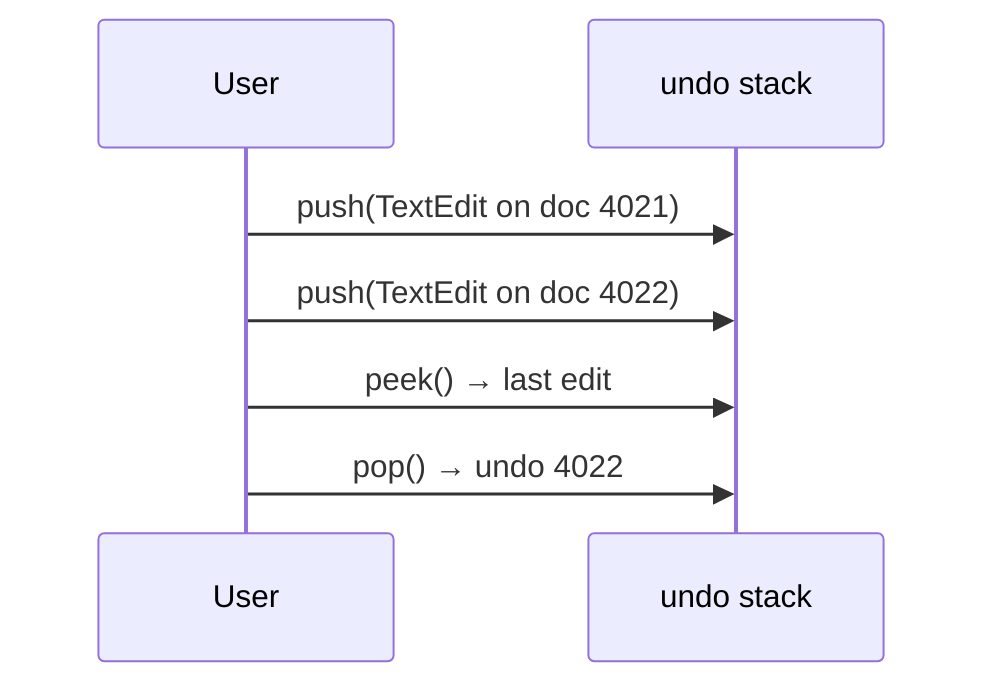
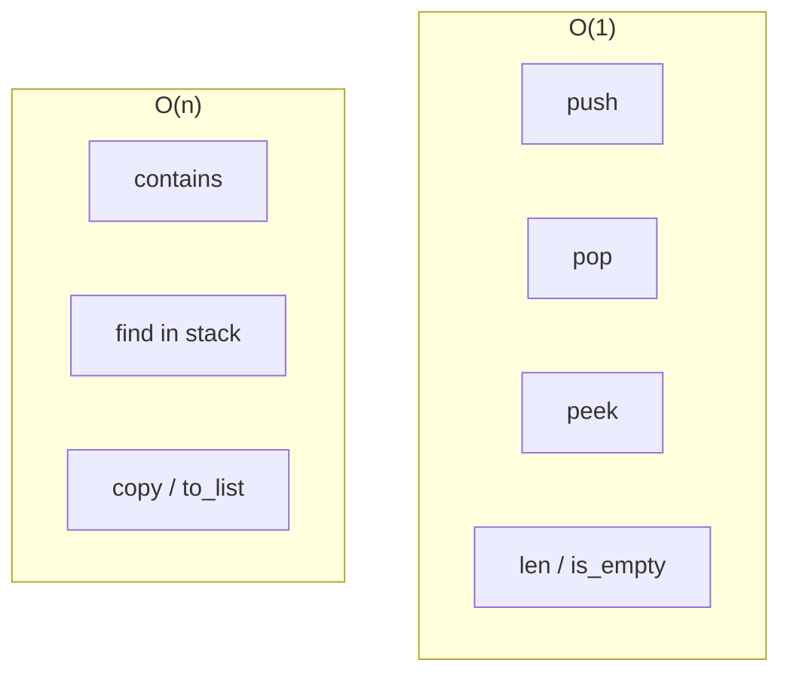
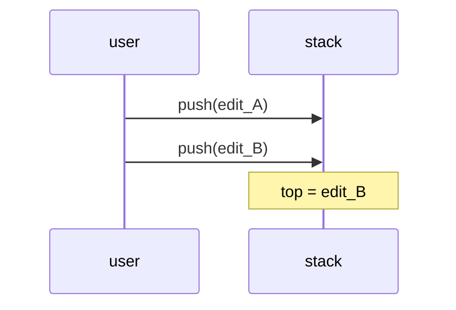
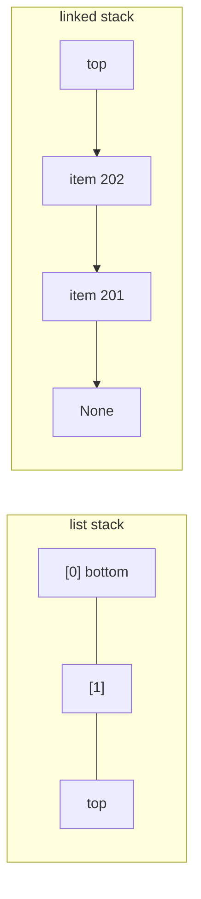
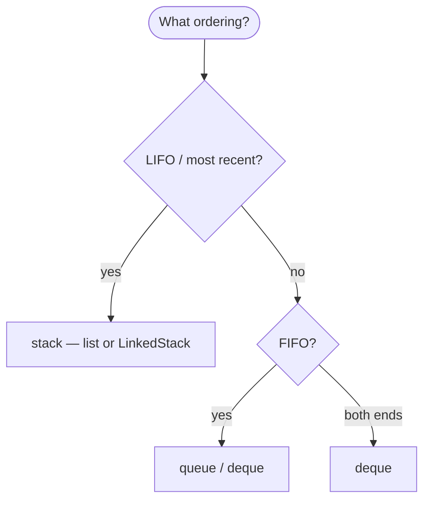
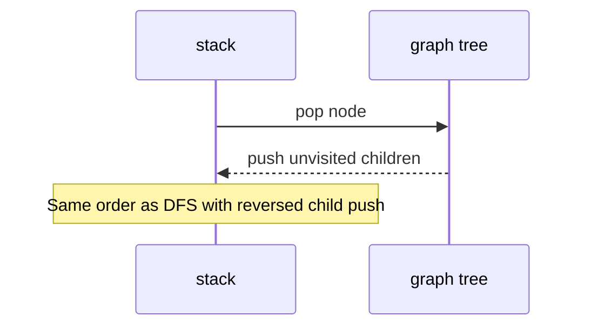

# Stacks

A **last-in, first-out (LIFO)** collection: the most recently added item is the first one removed. Only the **top** is directly accessible in the abstract ADT.

| | |
| --- | --- |
| **What it is** | Push adds to the top; pop removes from the top; peek reads the top without removing. |
| **Core operations** | `push`, `pop`, `peek` (or `top`) — all at one end. |
| **When to use** | Undo history, DFS on trees/graphs, bracket parsing, backtracking, call stacks, monotonic stacks on numeric series. |
| **Trade-off** | No fair FIFO ordering; wrong tool if you need “oldest item first.” |

Stacks model **reverse chronological** workflows: an **undo stack** for text edits in an editor, **DFS** through a decision tree or file hierarchy, or a **monotonic stack** on an array to find the “next greater element” in O(n). Live **queues** are FIFO ([Queue](../queue/index.md)), not LIFO—do not process a stream in arrival order with a stack unless the algorithm explicitly walks depth-first or reverses order.

This page is your **ready reference**: Python built-ins, list-backed and linked implementations, every operation with software examples, and **time and space complexity** on each. For Big-O notation and how *n* scales, see [Complexity analysis](../../complexity/index.md).

[Parent: Data structures](../index.md)

---

## Stack vs queue vs Python `list`

| | **Stack (LIFO)** | [Queue (FIFO)](../queue/index.md) | **Python `list` as stack** |
| --- | --- | --- | --- |
| **Insert** | `push` at top | `enqueue` at rear | `append` |
| **Remove** | `pop` from top | `dequeue` from front | `pop()` |
| **Peek** | `peek()` top | `front()` oldest | `lst[-1]` |
| **Hot end** | Same end for push/pop | Opposite ends | Tail only for O(1) |
| **Example** | Undo last text edit; DFS on tree | Process events in arrival order | Default for stack in scripts |



Throughout this page, **n** is the number of elements on the stack (e.g. edits in an undo buffer, nodes in a DFS walk on one branch of a tree). In production systems, **n** per stack is often small (one editing session, one tree) while bulk data lives in tables or arrays.

---

## What a stack models

| Use case | Stack view | Why LIFO |
| --- | --- | --- |
| **Undo text edits** | Each edit `push`; undo `pop` | Last change reverted first |
| **DFS on tree/graph** | Push child branches; pop to backtrack | Depth before breadth |
| **Nested scopes** | Push on enter; pop on exit | Nested contexts |
| **Expression parsing** | Push operators in expression DSL | Classic compiler pattern |
| **Monotonic “next greater”** | Stack of indices on numeric array | One pass O(n) |

**Use a queue or `deque`** when items must leave in **ingest order**. **Use a stack** when you need **most recent first** or **depth-first** exploration.

```python
from dataclasses import dataclass


@dataclass
class WorkItem:
 task_id: int
 priority: int
 metric: float
 label: str


@dataclass
class TextEdit:
 doc_id: int
 old_label: str | None = None
 new_label: str = ""
```

---

## Mental model: top, bottom, and the call stack

The **top** is where `push` and `pop` happen. The **bottom** is the oldest remaining item (still in the structure but not removable in O(1) from the top in a basic array stack).



| Kind | Cost | Stack examples | Use case |
| --- | --- | --- | --- |
| **Top only** | O(1) | `push`, `pop`, `peek` | Undo last text edit |
| **Search bottom** | O(n) | scan all | Find if any edit touched doc X |
| **Copy stack** | O(n) | snapshot | Save checkpoint before bulk import |

---

## Ways to create a stack in Python

### 1. Empty Python `list` (most common)

```python
stack = []
```

| | |
| --- | --- |
| **Time** | O(1) |
| **Space** | O(1) |

### 2. `list` with initial items (bottom → top order)

```python
stack = [
 WorkItem(101, 2, 0.4, "retry"),
 WorkItem(102, 2, -1.2, "pending"),
]
```

| | |
| --- | --- |
| **Time** | O(k) for k items |
| **Space** | O(k) |

### 3. `collections.deque` as stack (both ends O(1))

```python
from collections import deque

stack = deque()
stack.append(item)
top = stack.pop()
```

| | |
| --- | --- |
| **Time** | O(1) push/pop |
| **Space** | O(n) |

### 4. Empty `ListStack` wrapper class

```python
class ListStack:
 def __init__(self):
 self._items = []

 def push(self, item):
 self._items.append(item)

 def pop(self):
 if not self._items:
 raise IndexError("pop from empty stack")
 return self._items.pop()

s = ListStack()
```

| | |
| --- | --- |
| **Time** | O(1) |
| **Space** | O(1) |

### 5. Linked-list stack (head = top)

```python
from dataclasses import dataclass, field


@dataclass
class SNode:
 data = field()
 next = field(default=None)

top = None

def push_node(data):
 global top
 top = SNode(data, next=top)
```

| | |
| --- | --- |
| **Time** | O(1) push |
| **Space** | O(1) per node |

### 6. `LifoQueue` (thread-safe, blocking)

```python
from queue import LifoQueue

q = LifoQueue()
q.put(item)
r = q.get()
```

| | |
| --- | --- |
| **Time** | O(1) amortized typical |
| **Space** | O(n) |


---

## Reference implementation: `ListStack`

Full ADT with `push`, `pop`, `peek`, `clear`, iteration (top-down), and size.

```python
class ListStack:
 def __init__(self, items=None):
 self._items = list(items) if items is not None else []

 def __len__(self):
 return len(self._items)

 def is_empty(self):
 return len(self._items) == 0

 def push(self, item):
 self._items.append(item)

 def pop(self):
 if not self._items:
 raise IndexError("pop from empty stack")
 return self._items.pop()

 def peek(self):
 if not self._items:
 raise IndexError("peek from empty stack")
 return self._items[-1]

 def try_peek(self):
 return self._items[-1] if self._items else None

 def clear(self):
 self._items.clear()

 def contains(self, item):
 return item in self._items

 def to_list(self, bottom_first=True):
 return list(self._items) if bottom_first else list(reversed(self._items))

 def extend_push(self, items):
 for item in items:
 self.push(item)

 def __iter__(self):
 for i in range(len(self._items) - 1, -1, -1):
 yield self._items[i]
```

---

## Reference implementation: `LinkedStack`

Top = head; O(1) push/pop; no dynamic array resize.

```python
from dataclasses import dataclass, field


@dataclass
class SNode:
 data = field()
 next = field(default=None)


class LinkedStack:
 def __init__(self):
 self._top = None
 self._size = 0

 def __len__(self):
 return self._size

 def is_empty(self):
 return self._top is None

 def push(self, item):
 self._top = SNode(item, next=self._top)
 self._size += 1

 def pop(self):
 if self._top is None:
 raise IndexError("pop from empty stack")
 data = self._top.data
 self._top = self._top.next
 self._size -= 1
 return data

 def peek(self):
 if self._top is None:
 raise IndexError("peek from empty stack")
 return self._top.data

 def clear(self):
 self._top = None
 self._size = 0
```

| Implementation | `push` | `pop` | `peek` | Notes |
| --- | --- | --- | --- | --- |
| `list` | O(1)* | O(1) | O(1) | *amortized |
| `deque` | O(1) | O(1) | O(1) | either end |
| Linked | O(1) | O(1) | O(1) | extra pointer per item |

---

## All operations (examples + complexity)



### `push(item)` — add to top

```python
undo = []
undo.append(TextEdit(4021, "draft", "published"))

st = ListStack()
st.push(WorkItem(201, 3, -0.8, "low"))
st.push(WorkItem(202, 3, 0.3, "high"))
```

| | |
| --- | --- |
| **Time** | O(1) amortized (`list`); O(1) linked |
| **Space** | O(1) auxiliary |



---

### `pop()` — remove top

```python
last = undo.pop()
```

| | |
| --- | --- |
| **Time** | O(1) |
| **Space** | O(1) |

After `pop`, restore `old_label` on `doc_id` in your database or in-memory row.

---

### `peek()` / `try_peek()` — read top without pop

```python
if undo:
 preview = undo[-1]

edit = st.peek()
```

| | |
| --- | --- |
| **Time** | O(1) |
| **Space** | O(1) |

---

### `is_empty()` / `len(stack)`

```python
assert len(st) == 0 or not st.is_empty()
```

| | |
| --- | --- |
| **Time** | O(1) |
| **Space** | O(1) |

---

### `clear()`

```python
undo.clear()
```

| | |
| --- | --- |
| **Time** | O(1) to drop references; O(n) if you zero each slot for security |
| **Space** | O(1) |

---

### `contains(item)` — membership

Linear scan from top or bottom.

| | |
| --- | --- |
| **Time** | O(n) |
| **Space** | O(1) |

---

### Iteration (top → bottom)

```python
for edit in st:
 print(edit.doc_id)
```

| | |
| --- | --- |
| **Time** | O(n) |
| **Space** | O(1) |

---

## List-backed vs linked stack

| | **Python `list`** | **Linked `LinkedStack`** |
| --- | --- | --- |
| **Constant factors** | Very fast in CPython | Node allocation overhead |
| **Memory** | Contiguous array of refs | Value + `next` per item |
| **Growth** | Over-allocates sometimes | One node at a time |
| **Interview / teaching** | Still cite linked version | Shows LIFO = prepend at head |
| **Python scripts** | Default choice | Rare unless exercising pointers |



---

## Practical patterns with stacks

### Undo stack for text edits

```python
def apply_label(stack, doc_id, old, new):
 stack.push(TextEdit(doc_id, old, new))

def undo(stack):
 edit = stack.pop()
```

| | |
| --- | --- |
| **Time** | O(1) per undo |
| **Space** | O(edits) |

### DFS on a tree or graph

```python
def dfs_nodes(root_id, adj):
 stack = [root_id]
 order = []
 while stack:
 node = stack.pop()
 order.append(node)
 for child in reversed(adj.get(node, [])):
 stack.append(child)
 return order
```

| | |
| --- | --- |
| **Time** | O(V + E) |
| **Space** | O(V) stack depth worst case |

The stack explores one branch deeply before siblings (pre-order with reversed children).

### Monotonic stack — next greater element

```python
def next_greater_element(values):
 n = len(values)
 result = [None] * n
 stack = []
 for i in range(n):
 while stack and values[i] > values[stack[-1]]:
 j = stack.pop()
 result[j] = i
 stack.append(i)
 return result
```

| | |
| --- | --- |
| **Time** | O(n) |
| **Space** | O(n) |

### Valid parentheses — formula syntax

```python
def valid_formula(s):
 pairs = {")": "(", "]": "[", "}": "{"}
 stack = []
 for ch in s:
 if ch in "([{":
 stack.append(ch)
 elif ch in ")]}":
 if not stack or stack.pop() != pairs[ch]:
 return False
 return not stack
```

| | |
| --- | --- |
| **Time** | O(len(s)) |
| **Space** | O(len(s)) |

---

## Master complexity table

| Operation | Time | Space (auxiliary) | Notes |
| --- | --- | --- | --- |
| Create empty | O(1) | O(1) | |
| `push` | O(1)* | O(1) | *list amortized |
| `pop` | O(1) | O(1) | |
| `peek` | O(1) | O(1) | |
| `len` / `is_empty` | O(1) | O(1) | |
| `clear` | O(1) | O(1) | drop structure |
| `contains` | O(n) | O(1) | |
| Copy / `to_list` | O(n) | O(n) | |
| DFS with stack | O(V+E) | O(V) | tree or graph |
| Monotonic pass | O(n) | O(n) | numeric array |

**Storage:** Θ(n) for n stacked items.

---

## Python stdlib: what to use

| Need | API | Notes |
| --- | --- | --- |
| Default LIFO in scripts | `list.append` / `pop` | Idiomatic |
| Stack + queue in one type | `collections.deque` | [Deque](../dequeue-deque/index.md) |
| Thread-safe LIFO | `queue.LifoQueue` | Blocking `put`/`get` |
| Function calls | CPython interpreter | Real “call stack” |
| No `stack` in stdlib | Roll your own or `list` | |

```python
items = []
items.insert(0, new_item)
```

Use `deque` or [Queue](../queue/index.md) for FIFO ingest—`insert(0, …)` is O(n) per push.

---

## When to use stack vs other structures



| Scenario | Stack | Better alternative |
| --- | --- | --- |
| Process events in ingest order | Wrong | [Queue](../queue/index.md) |
| Undo last N edits | Yes | — |
| BFS shortest path on graph | Wrong | queue |
| Random access `arr[i]` | Wrong | `list` / DataFrame |
| Bulk aggregation | Wrong | pandas, `Counter` |

---

## Common pitfalls

| Pitfall | Why it hurts | Fix |
| --- | --- | --- |
| `pop()` on empty | `IndexError` | Check `if stack:` or `try_peek` |
| `insert(0, x)` as “stack” | O(n) per push | Use `append` |
| Using stack for event queue | Reverses order | FIFO queue |
| Unbounded undo stack | Memory grows | Cap size or spill to disk |
| Peeking after pop | Stale variable | Call `peek` again |
| Confusing `deque.popleft` with stack | Wrong end | Document which end is “top” |

---

## Advanced stack patterns

### Min stack — track running minimum in window

Keep a parallel stack of minima so `get_min()` is O(1) after each push.

```python
class MinStack:
 def __init__(self):
 self._data = []
 self._mins = []

 def push(self, value):
 self._data.append(value)
 if not self._mins or value <= self._mins[-1]:
 self._mins.append(value)

 def pop(self):
 v = self._data.pop()
 if v == self._mins[-1]:
 self._mins.pop()
 return v

 def get_min(self):
 return self._mins[-1]
```

| Operation | Time | Space |
| --- | --- | --- |
| `push` | O(1) | O(1) |
| `pop` | O(1) | O(1) |
| `get_min` | O(1) | O(1) |

Track the lowest value in the current sliding window without rescanning the list on each new push.

---

### Reverse Polish Notation — derived metric calculator

```python
def eval_rpn(tokens, lookup):
 stack = []
 for tok in tokens:
 if tok in "+-*/":
 b, a = stack.pop(), stack.pop()
 stack.append({"+": a + b, "-": a - b, "*": a * b, "/": a / b}[tok])
 else:
 stack.append(lookup[tok])
 return stack[-1]

lookup = {"latency_ms": 1.2, "error_rate": 8.0}
score = eval_rpn(["latency_ms", "error_rate", "+"], lookup)
```

| | |
| --- | --- |
| **Time** | O(tokens) |
| **Space** | O(tokens) stack depth |

---

### Recursion vs explicit stack on deep trees

CPython call depth is limited (~1000 frames). Deep trees use an explicit stack:

```python
def dfs_iterative(root, adj):
 stack = [root]
 visited = set()
 order = []
 while stack:
 node = stack.pop()
 if node in visited:
 continue
 visited.add(node)
 order.append(node)
 for child in adj.get(node, []):
 stack.append(child)
 return order
```

| | |
| --- | --- |
| **Time** | O(V + E) |
| **Space** | O(V) explicit stack |



---

### Bounded undo stack (cap at N edits)

```python
def push_undo(stack, edit, cap=50):
 stack.append(edit)
 while len(stack) > cap:
 stack.pop(0)
```

| Approach | Cap enforcement | Notes |
| --- | --- | --- |
| `list` + `pop(0)` | O(n) per overflow | Simple, small cap only |
| `deque(maxlen=N)` | O(1) | Drops **oldest** undo — may be wrong semantics |
| Drop bottom with linked list | O(1) | Custom |

For text editor UIs, **cap at 50** undos is usually enough; document whether oldest undo is discarded.

---

### `copy` / snapshot before bulk re-label

```python
import copy

checkpoint = copy.copy(undo_stack)
deep_checkpoint = copy.deepcopy(undo_stack)
```

| | |
| --- | --- |
| **Time** | O(n) shallow; O(n) deep if objects copied |
| **Space** | O(n) |

---

## Stack methods checklist (`ListStack`)

| Method | Present | Time |
| --- | --- | --- |
| `push` | yes | O(1) |
| `pop` | yes | O(1) |
| `peek` / `try_peek` | yes | O(1) |
| `is_empty` / `len` | yes | O(1) |
| `clear` | yes | O(1) |
| `contains` | yes | O(n) |
| `extend_push` | yes | O(k) |
| `to_list` | yes | O(n) |
| `__iter__` top→bottom | yes | O(n) |

`LinkedStack` implements the same surface except `extend_push` (add in a loop).

---

## Related structures in this guide

| Structure | Relationship |
| --- | --- |
| [Queue](../queue/index.md) | FIFO opposite |
| [Dequeue (deque)](../dequeue-deque/index.md) | Both ends; can emulate stack |
| [Linked list](../linked-list/index.md) | Linked stack = prepend at head |
| [Graphs](../graphs/index.md) | DFS uses stack (or recursion) |

---

## Quick reference card

```python
stack: list[TextEdit] = []
stack.append(TextEdit(4022, "draft", "published"))
top = stack[-1]
edit = stack.pop()

st = ListStack()
st.push(WorkItem(101, 2, 0.4, "retry"))
item = st.pop()

lst = LinkedStack()
lst.push(WorkItem(102, 2, -1.2, "pending"))
```

Use a **stack** when **last in, first out** matches the problem—undo, DFS, parsing, monotonic scans. Use a **`list`** in Python unless you need linked-list practice or `LifoQueue` for threads.

**Stack usage checklist**

1. **Undo / backtrack** — `list` stack of edits or DFS on small trees.
2. **Stream ingest** — queue or `deque`, not stack.
3. **One-pass “next greater”** — monotonic stack on a numpy/list array.
4. **Guard** — never `pop()` without checking empty on live UI handlers.
