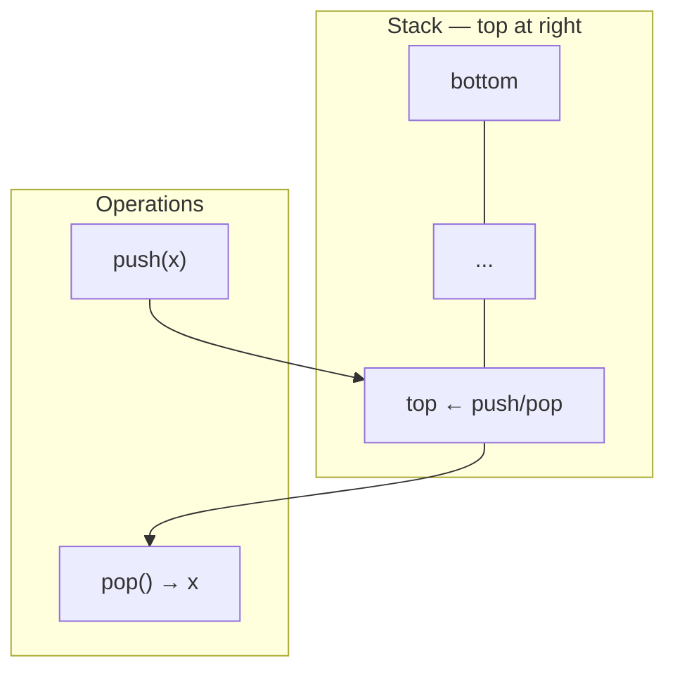
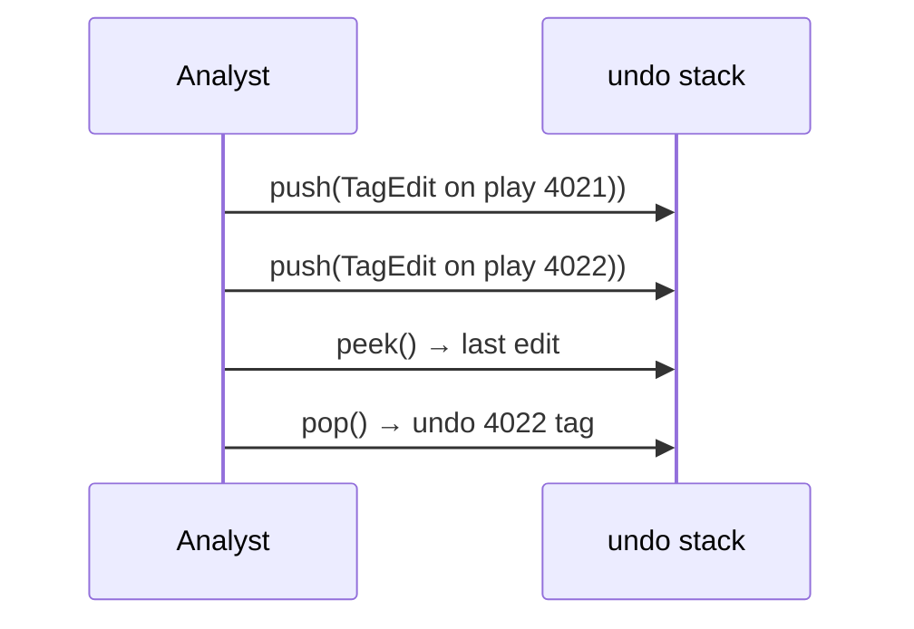
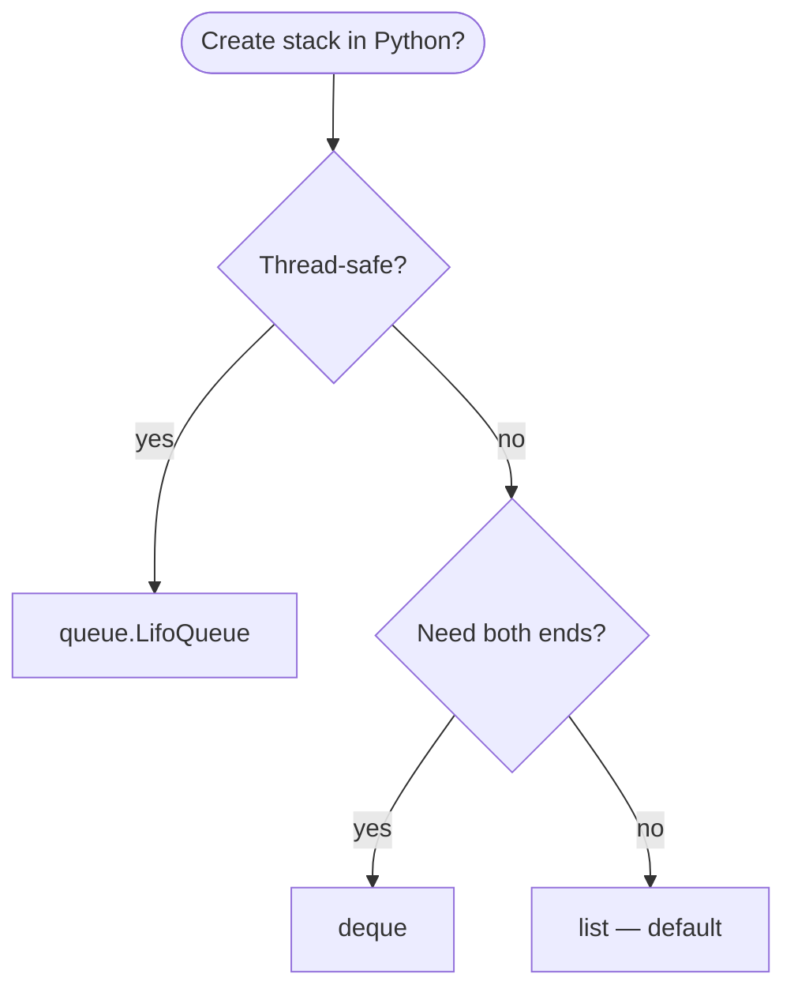
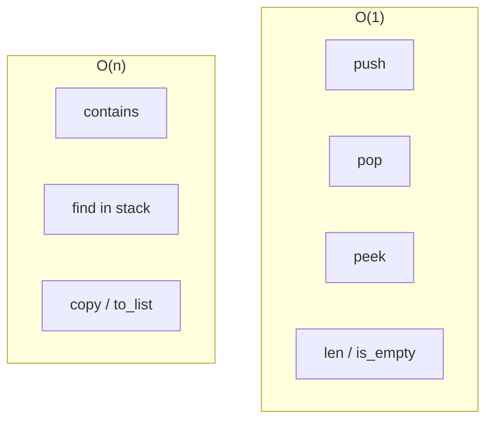
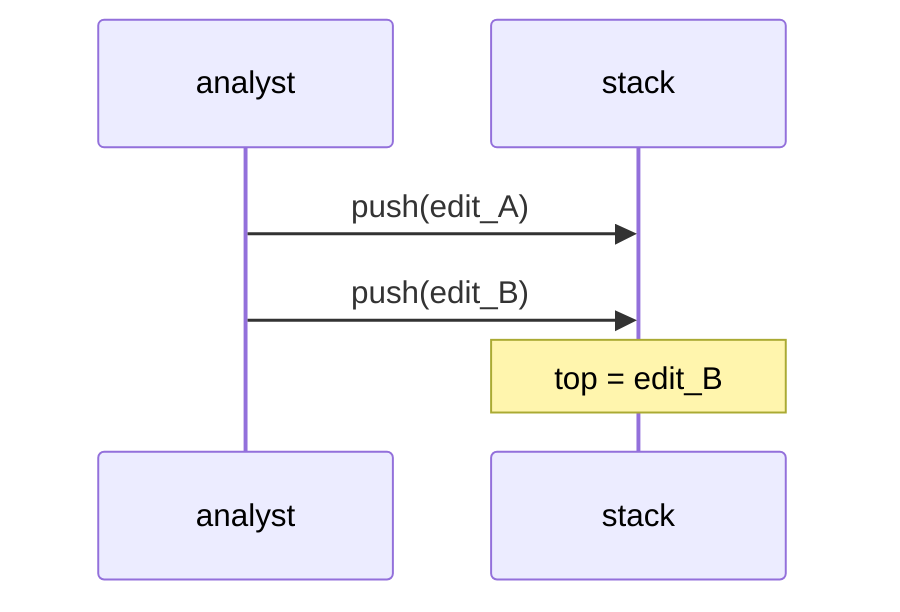
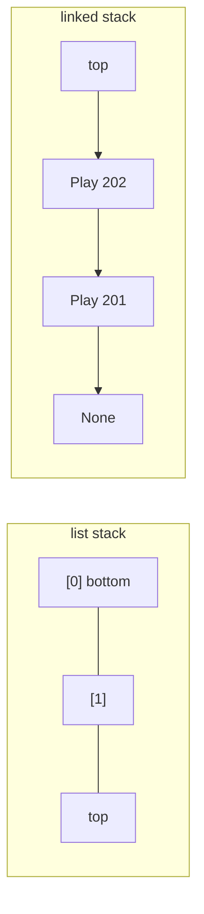

# Stacks

A **last-in, first-out (LIFO)** collection: the most recently added item is the first one removed. Only the **top** is directly accessible in the abstract ADT.

| | |
| --- | --- |
| **What it is** | Push adds to the top; pop removes from the top; peek reads the top without removing. |
| **Core operations** | `push`, `pop`, `peek` (or `top`) — all at one end. |
| **When to use** | Undo history, DFS on trees/graphs, bracket parsing, backtracking, call stacks, monotonic stacks on score series. |
| **Trade-off** | No fair FIFO ordering; wrong tool if you need “oldest play first.” |

In **NFL data analysis**, stacks model **reverse chronological** workflows: an **undo stack** for manual play tags in a drive editor, **DFS** through a game decision tree (fourth-down branches), or a **monotonic stack** on weekly team points to find “next hotter week” in O(n). Live play **queues** are FIFO ([Queue](../queue/index.md)), not LIFO—do not process play-by-play with a stack unless the algorithm explicitly walks depth-first or reverses order.

This page is your **ready reference**: Python built-ins, list-backed and linked implementations, every operation with NFL-flavored examples, and **time and space complexity** on each. For Big-O notation, see [Complexity analysis](../../complexity/index.md).

[Parent: Data structures](../index.md)

---

## Stack vs queue vs Python `list`

| | **Stack (LIFO)** | [Queue (FIFO)](../queue/index.md) | **Python `list` as stack** |
| --- | --- | --- | --- |
| **Insert** | `push` at top | `enqueue` at rear | `append` |
| **Remove** | `pop` from top | `dequeue` from front | `pop()` |
| **Peek** | `peek()` top | `front()` oldest | `lst[-1]` |
| **Hot end** | Same end for push/pop | Opposite ends | Tail only for O(1) |
| **NFL example** | Undo last tag; DFS on play tree | Process plays in arrival order | Default for stack in scripts |



Throughout this page, **n** is the number of elements on the stack.

---

## NFL data analysis: what a stack models

| NFL idea | Stack view | Why LIFO |
| --- | --- | --- |
| **Undo play tags** | Each edit `push`; undo `pop` | Last change reverted first |
| **DFS on game tree** | Push child branches; pop to backtrack | Depth before breadth |
| **Drive nesting** | Push entering red zone; pop on turnover | Nested contexts |
| **Expression parsing** | Push operators in EPA formula DSL | Classic compiler pattern |
| **Monotonic “next greater week”** | Stack of indices on points series | One pass O(n) |

**Use a queue or `deque`** when plays must leave in **ingest order**. **Use a stack** when you need **most recent first** or **depth-first** exploration.

```python
from dataclasses import dataclass, field
from typing import Literal


@dataclass(frozen=True)
class Play:
    play_id: int
    quarter: int
    description: str
    epa: float


@dataclass
class TagEdit:
    """One tagging action on a play (for undo stack examples)."""
    play_id: int
    old_tag: str | None
    new_tag: str
```

---

## Mental model: top, bottom, and the call stack

The **top** is where `push` and `pop` happen. The **bottom** is the oldest remaining item (still in the structure but not removable in O(1) from the top in a basic array stack).



| Kind | Cost | Stack examples | NFL example |
| --- | --- | --- | --- |
| **Top only** | O(1) | `push`, `pop`, `peek` | Undo last tag |
| **Search bottom** | O(n) | scan all | Find if any edit touched play X |
| **Copy stack** | O(n) | snapshot | Save checkpoint before bulk import |

---

## Ways to create a stack in Python

### 1. Empty Python `list` (most common)

```python
stack: list[Play] = []
```

| | |
| --- | --- |
| **Time** | O(1) |
| **Space** | O(1) |

### 2. `list` with initial plays (bottom → top order)

```python
stack = [
    Play(101, 1, "rush", 0.1),
    Play(102, 1, "pass", 0.8),
]
# top is Play(102, ...)
```

| | |
| --- | --- |
| **Time** | O(k) for k items |
| **Space** | O(k) |

### 3. `collections.deque` as stack (both ends O(1))

```python
from collections import deque

stack: deque[Play] = deque()
stack.append(play)       # push
top = stack.pop()        # pop
# or: stack.appendleft / popleft if you prefer top on the left
```

| | |
| --- | --- |
| **Time** | O(1) push/pop |
| **Space** | O(n) |

### 4. Empty `ListStack` wrapper class

```python
class ListStack:
    def __init__(self) -> None:
        self._items: list[Any] = []

    def push(self, item: Any) -> None:
        self._items.append(item)

    def pop(self) -> Any:
        if not self._items:
            raise IndexError("pop from empty stack")
        return self._items.pop()

s = ListStack()
```

| | |
| --- | --- |
| **Time** | O(1) |
| **Space** | O(1) |

### 5. Linked-list stack (head = top)

```python
@dataclass
class SNode:
    data: Any
    next: SNode | None = None

top: SNode | None = None

def push_node(data: Any) -> None:
    global top
    top = SNode(data, next=top)
```

| | |
| --- | --- |
| **Time** | O(1) push |
| **Space** | O(1) per node |

### 6. `LifoQueue` (thread-safe, blocking)

```python
from queue import LifoQueue

q: LifoQueue[Play] = LifoQueue()
q.put(play)
p = q.get()
```

| | |
| --- | --- |
| **Time** | O(1) amortized typical |
| **Space** | O(n) |



---

## Reference implementation: `ListStack`

Full ADT with `push`, `pop`, `peek`, `clear`, iteration (top-down), and size.

```python
from __future__ import annotations

from dataclasses import dataclass
from typing import Any, Iterable, Iterator


class ListStack:
    """LIFO stack backed by a Python list (top at end)."""

    def __init__(self, items: Iterable[Any] | None = None) -> None:
        self._items: list[Any] = list(items) if items is not None else []

    def __len__(self) -> int:
        return len(self._items)

    def is_empty(self) -> bool:
        return len(self._items) == 0

    def push(self, item: Any) -> None:
        self._items.append(item)

    def pop(self) -> Any:
        if not self._items:
            raise IndexError("pop from empty stack")
        return self._items.pop()

    def peek(self) -> Any:
        if not self._items:
            raise IndexError("peek from empty stack")
        return self._items[-1]

    def try_peek(self) -> Any | None:
        return self._items[-1] if self._items else None

    def clear(self) -> None:
        self._items.clear()

    def contains(self, item: Any) -> bool:
        return item in self._items

    def to_list(self, bottom_first: bool = True) -> list[Any]:
        return list(self._items) if bottom_first else list(reversed(self._items))

    def extend_push(self, items: Iterable[Any]) -> None:
        for item in items:
            self.push(item)

    def __iter__(self) -> Iterator[Any]:
        """Top to bottom (most recent first)."""
        for i in range(len(self._items) - 1, -1, -1):
            yield self._items[i]
```

---

## Reference implementation: `LinkedStack`

Top = head; O(1) push/pop; no dynamic array resize.

```python
@dataclass
class SNode:
    data: Any
    next: SNode | None = None


class LinkedStack:
    def __init__(self) -> None:
        self._top: SNode | None = None
        self._size = 0

    def __len__(self) -> int:
        return self._size

    def is_empty(self) -> bool:
        return self._top is None

    def push(self, item: Any) -> None:
        self._top = SNode(item, next=self._top)
        self._size += 1

    def pop(self) -> Any:
        if self._top is None:
            raise IndexError("pop from empty stack")
        data = self._top.data
        self._top = self._top.next
        self._size -= 1
        return data

    def peek(self) -> Any:
        if self._top is None:
            raise IndexError("peek from empty stack")
        return self._top.data

    def clear(self) -> None:
        self._top = None
        self._size = 0
```

| Implementation | `push` | `pop` | `peek` | Notes |
| --- | --- | --- | --- | --- |
| `list` | O(1)* | O(1) | O(1) | *amortized |
| `deque` | O(1) | O(1) | O(1) | either end |
| Linked | O(1) | O(1) | O(1) | extra pointer per item |

---

## All operations (with examples and complexity)



### `push(item)` — add to top

```python
# list idiom
undo: list[TagEdit] = []
undo.append(TagEdit(4021, "run", "pass"))

# ListStack
st = ListStack()
st.push(Play(201, 2, "sack", -1.5))
st.push(Play(202, 2, "scramble", 0.3))
```

| | |
| --- | --- |
| **Time** | O(1) amortized (`list`); O(1) linked |
| **Space** | O(1) auxiliary |



---

### `pop()` — remove top

```python
last = undo.pop()  # reverts most recent tag
```

| | |
| --- | --- |
| **Time** | O(1) |
| **Space** | O(1) |

**NFL:** After `pop`, restore `old_tag` on `play_id` in your database or in-memory row.

---

### `peek()` / `try_peek()` — read top without pop

```python
if undo:
    preview = undo[-1]
# ListStack
edit = st.peek()
```

| | |
| --- | --- |
| **Time** | O(1) |
| **Space** | O(1) |

---

### `is_empty()` / `len(stack)`

```python
assert len(st) == 0 or not st.is_empty()
```

| | |
| --- | --- |
| **Time** | O(1) |
| **Space** | O(1) |

---

### `clear()`

```python
undo.clear()
```

| | |
| --- | --- |
| **Time** | O(1) to drop references; O(n) if you zero each slot for security |
| **Space** | O(1) |

---

### `contains(item)` — membership

Linear scan from top or bottom.

| | |
| --- | --- |
| **Time** | O(n) |
| **Space** | O(1) |

---

### Iteration (top → bottom)

```python
for edit in st:  # ListStack __iter__
    print(edit.play_id)
```

| | |
| --- | --- |
| **Time** | O(n) |
| **Space** | O(1) |

---

## List-backed vs linked stack

| | **Python `list`** | **Linked `LinkedStack`** |
| --- | --- | --- |
| **Constant factors** | Very fast in CPython | Node allocation overhead |
| **Memory** | Contiguous array of refs | Value + `next` per item |
| **Growth** | Over-allocates sometimes | One node at a time |
| **Interview / teaching** | Still cite linked version | Shows LIFO = prepend at head |
| **NFL scripts** | Default choice | Rare unless exercising pointers |



---

## NFL patterns with stacks

### Undo stack for play tags

```python
def apply_tag(stack: ListStack, play_id: int, old: str | None, new: str) -> None:
    stack.push(TagEdit(play_id, old, new))
    # ... write new tag to store ...

def undo(stack: ListStack) -> None:
    edit = stack.pop()
    # restore edit.old_tag on edit.play_id
```

| | |
| --- | --- |
| **Time** | O(1) per undo |
| **Space** | O(edits) |

### DFS on a game decision tree

```python
def dfs_plays(root_id: int, adj: dict[int, list[int]]) -> list[int]:
    stack = [root_id]
    order: list[int] = []
    while stack:
        node = stack.pop()
        order.append(node)
        for child in reversed(adj.get(node, [])):
            stack.append(child)
    return order
```

| | |
| --- | --- |
| **Time** | O(V + E) |
| **Space** | O(V) stack depth worst case |

**NFL:** Branch nodes might be “go for it” vs “punt” outcomes; stack explores one branch deeply before siblings (pre-order with reversed children).

### Monotonic stack — next week with more points

```python
def next_greater_week(points: list[float]) -> list[int | None]:
    """For each week i, index of next week j>i with points[j] > points[i], else None."""
    n = len(points)
    result: list[int | None] = [None] * n
    stack: list[int] = []  # indices, decreasing points
    for i in range(n):
        while stack and points[i] > points[stack[-1]]:
            j = stack.pop()
            result[j] = i
        stack.append(i)
    return result
```

| | |
| --- | --- |
| **Time** | O(n) |
| **Space** | O(n) |

### Valid parentheses — challenge flag syntax

```python
def valid_flags(s: str) -> bool:
    pairs = {")": "(", "]": "[", "}": "{"}
    stack: list[str] = []
    for ch in s:
        if ch in "([{":
            stack.append(ch)
        elif ch in ")]}":
            if not stack or stack.pop() != pairs[ch]:
                return False
    return not stack
```

| | |
| --- | --- |
| **Time** | O(len(s)) |
| **Space** | O(len(s)) |

---

## Master complexity table

| Operation | Time | Space (auxiliary) | Notes |
| --- | --- | --- | --- |
| Create empty | O(1) | O(1) | |
| `push` | O(1)* | O(1) | *list amortized |
| `pop` | O(1) | O(1) | |
| `peek` | O(1) | O(1) | |
| `len` / `is_empty` | O(1) | O(1) | |
| `clear` | O(1) | O(1) | drop structure |
| `contains` | O(n) | O(1) | |
| Copy / `to_list` | O(n) | O(n) | |
| DFS with stack | O(V+E) | O(V) | game tree |
| Monotonic pass | O(n) | O(n) | weekly points |

**Storage:** Θ(n) for n stacked items.

---

## Python stdlib: what to use

| Need | API | Notes |
| --- | --- | --- |
| Default LIFO in scripts | `list.append` / `pop` | Idiomatic |
| Stack + queue in one type | `collections.deque` | [Deque](../dequeue-deque/index.md) |
| Thread-safe LIFO | `queue.LifoQueue` | Blocking `put`/`get` |
| Function calls | CPython interpreter | Real “call stack” |
| No `stack` in stdlib | Roll your own or `list` | |

```python
# Anti-pattern for FIFO plays
plays: list[Play] = []
plays.insert(0, new_play)  # O(n) — use deque or Queue instead
```

---

## When to use stack vs other structures


| Scenario | Stack | Better alternative |
| --- | --- | --- |
| Process plays in ingest order | Wrong | [Queue](../queue/index.md) |
| Undo last N edits | Yes | — |
| BFS shortest path on roster graph | Wrong | queue |
| Random access `plays[i]` | Wrong | `list` / DataFrame |
| Season stats aggregation | Wrong | pandas, `Counter` |

---

## Common pitfalls

| Pitfall | Why it hurts | Fix |
| --- | --- | --- |
| `pop()` on empty | `IndexError` | Check `if stack:` or `try_peek` |
| `insert(0, x)` as “stack” | O(n) per push | Use `append` |
| Using stack for play queue | Reverses order | FIFO queue |
| Unbounded undo stack | Memory grows | Cap size or spill to disk |
| Peeking after pop | Stale variable | Call `peek` again |
| Confusing `deque.popleft` with stack | Wrong end | Document which end is “top” |

---

## Advanced stack patterns

### Min stack — track running minimum EPA in window

Keep a parallel stack of minima so `get_min()` is O(1) after each push.

```python
class MinStack:
    def __init__(self) -> None:
        self._data: list[float] = []
        self._mins: list[float] = []

    def push(self, epa: float) -> None:
        self._data.append(epa)
        if not self._mins or epa <= self._mins[-1]:
            self._mins.append(epa)

    def pop(self) -> float:
        v = self._data.pop()
        if v == self._mins[-1]:
            self._mins.pop()
        return v

    def min_epa(self) -> float:
        return self._mins[-1]
```

| Operation | Time | Space |
| --- | --- | --- |
| `push` | O(1) | O(1) |
| `pop` | O(1) | O(1) |
| `min_epa` | O(1) | O(1) |

**NFL:** Track worst EPA snap in the current drive without rescanning the drive list on each new snap.

---

### Reverse Polish Notation — fantasy points calculator

```python
def eval_rpn(tokens: list[str], lookup: dict[str, float]) -> float:
    stack: list[float] = []
    for tok in tokens:
        if tok in "+-*/":
            b, a = stack.pop(), stack.pop()
            stack.append({"+": a + b, "-": a - b, "*": a * b, "/": a / b}[tok])
        else:
            stack.append(lookup[tok])
    return stack[-1]

# yards=45, td=1 → tokens from DSL
lookup = {"yards": 45.0, "td": 6.0}
score = eval_rpn(["yards", "td", "+"], lookup)
```

| | |
| --- | --- |
| **Time** | O(tokens) |
| **Space** | O(tokens) stack depth |

---

### Recursion vs explicit stack on play tree

CPython call depth is limited (~1000 frames). Deep game trees use an explicit stack:

```python
def dfs_iterative(root: int, adj: dict[int, list[int]]) -> list[int]:
    stack = [root]
    visited: set[int] = set()
    order: list[int] = []
    while stack:
        node = stack.pop()
        if node in visited:
            continue
        visited.add(node)
        order.append(node)
        for child in adj.get(node, []):
            stack.append(child)
    return order
```

| | |
| --- | --- |
| **Time** | O(V + E) |
| **Space** | O(V) explicit stack |


---

### Bounded undo stack (cap at N edits)

```python
def push_undo(stack: list[TagEdit], edit: TagEdit, cap: int = 50) -> None:
    stack.append(edit)
    while len(stack) > cap:
        stack.pop(0)  # O(n) — for strict cap use deque + rotate policy
```

| Approach | Cap enforcement | Notes |
| --- | --- | --- |
| `list` + `pop(0)` | O(n) per overflow | Simple, small cap only |
| `deque(maxlen=N)` | O(1) | Drops **oldest** undo — may be wrong semantics |
| Drop bottom with linked list | O(1) | Custom |

For NFL tagging UIs, **cap at 50** undos is usually enough; document whether oldest undo is discarded.

---

### `copy` / snapshot before bulk re-tag

```python
import copy

checkpoint = copy.copy(undo_stack)  # shallow: same TagEdit objects
deep_checkpoint = copy.deepcopy(undo_stack)
```

| | |
| --- | --- |
| **Time** | O(n) shallow; O(n) deep if objects copied |
| **Space** | O(n) |

---

## Stack methods checklist (`ListStack`)

| Method | Present | Time |
| --- | --- | --- |
| `push` | yes | O(1) |
| `pop` | yes | O(1) |
| `peek` / `try_peek` | yes | O(1) |
| `is_empty` / `len` | yes | O(1) |
| `clear` | yes | O(1) |
| `contains` | yes | O(n) |
| `extend_push` | yes | O(k) |
| `to_list` | yes | O(n) |
| `__iter__` top→bottom | yes | O(n) |

`LinkedStack` implements the same surface except `extend_push` (add in a loop).

---

## Related structures in this guide

| Structure | Relationship |
| --- | --- |
| [Queue](../queue/index.md) | FIFO opposite |
| [Dequeue (deque)](../dequeue-deque/index.md) | Both ends; can emulate stack |
| [Linked list](../linked-list/index.md) | Linked stack = prepend at head |
| [Graphs](../graphs/index.md) | DFS uses stack (or recursion) |

---

## Quick reference card

```python
# Idiomatic Python stack
stack: list[TagEdit] = []
stack.append(TagEdit(4022, "rush", "pass"))  # push O(1)
top = stack[-1]                               # peek O(1)
edit = stack.pop()                            # pop O(1)

# Class wrapper
st = ListStack()
st.push(Play(101, 1, "kickoff", 0.0))
play = st.pop()

# Linked (interview / teaching)
lst = LinkedStack()
lst.push(Play(102, 1, "punt", -0.2))
```

Use a **stack** when **last in, first out** matches the problem—undo, DFS, parsing, monotonic scans. Use a **`list`** in Python unless you need linked-list practice or `LifoQueue` for threads.

**NFL pipeline checklist**

1. **Undo / backtrack** — `list` stack of edits or DFS on small trees.
2. **Play ingest** — queue or `deque`, not stack.
3. **One-pass “next greater”** — monotonic stack on numpy/list series.
4. **Guard** — never `pop()` without checking empty on live UI handlers.
