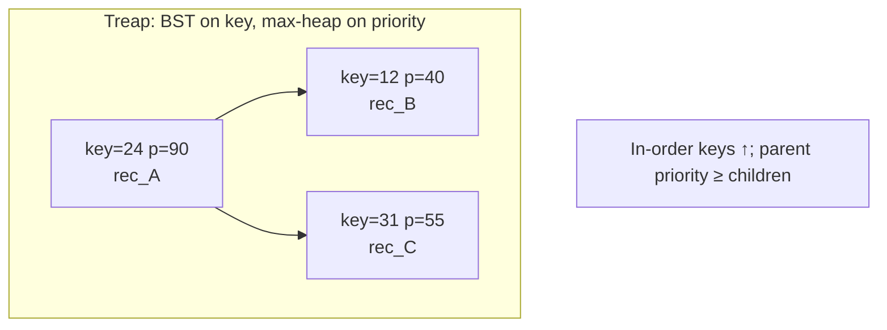
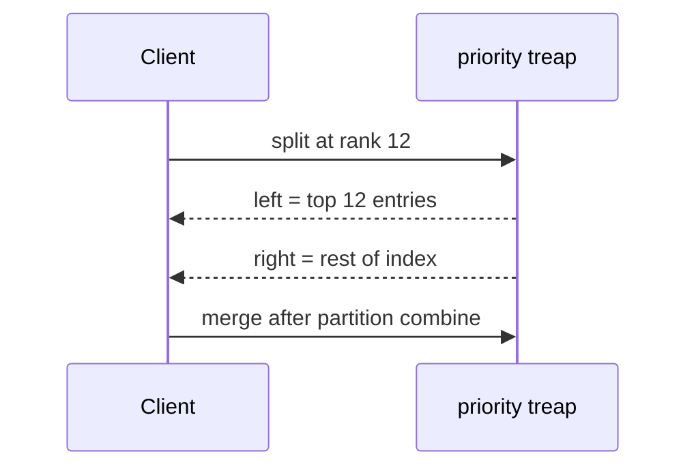
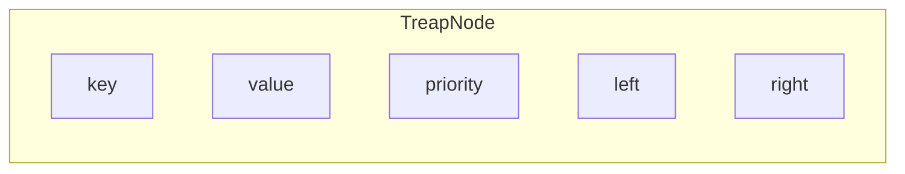
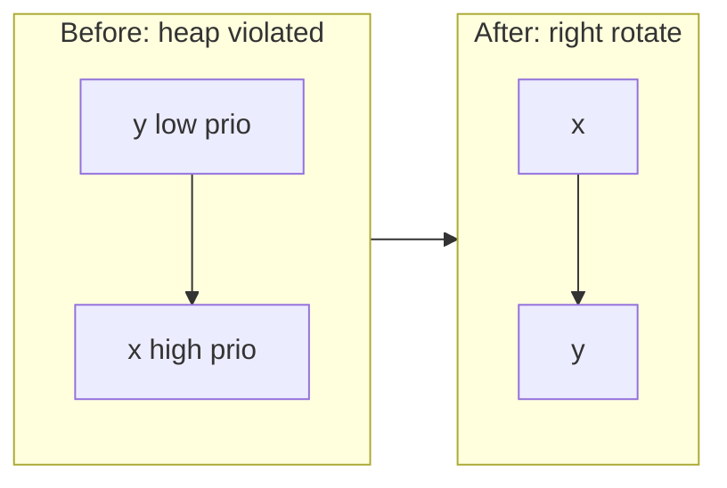
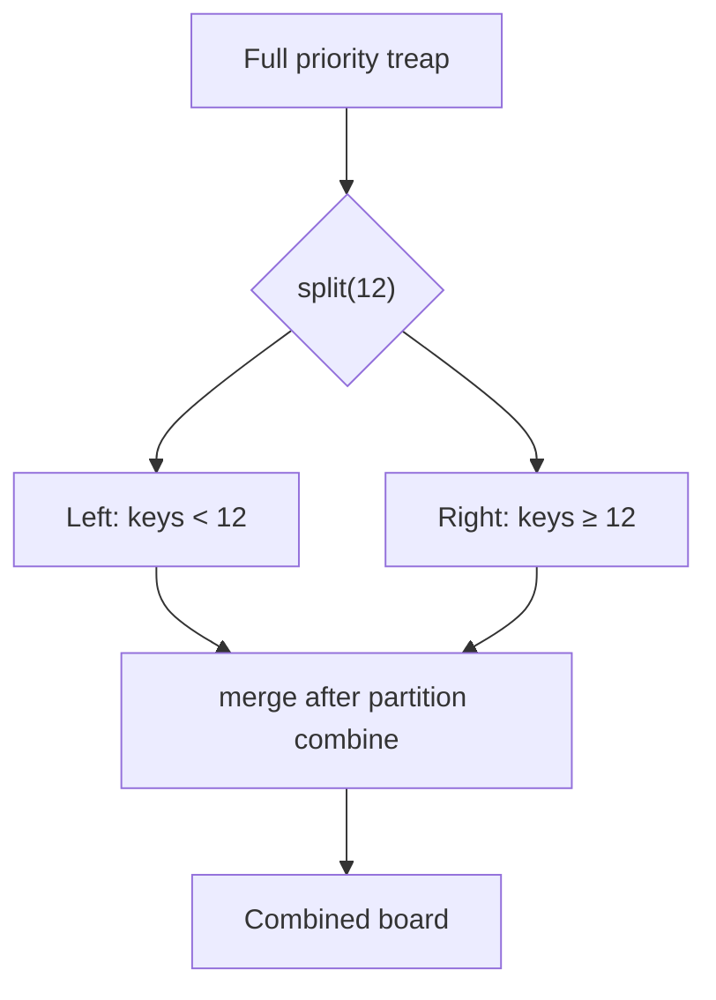
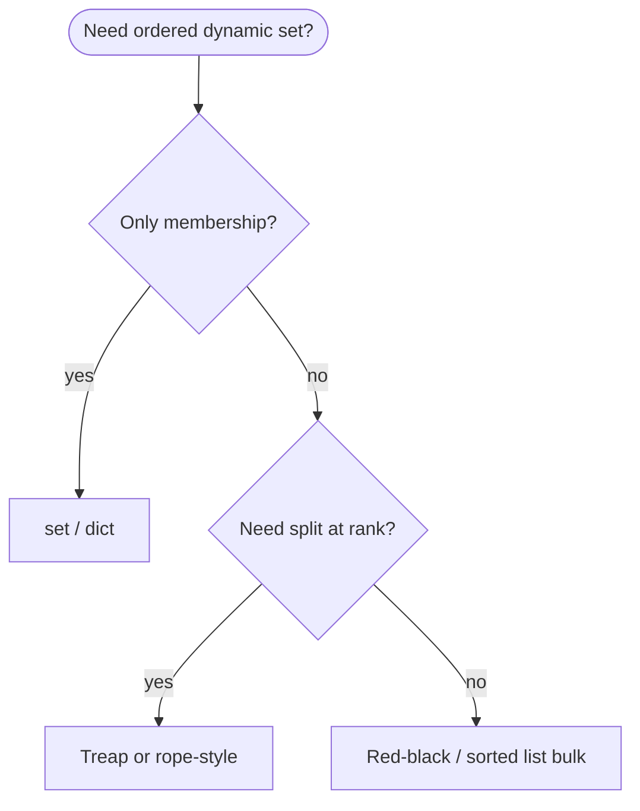

# Treaps

A **binary search tree** ordered by **key**, where each node also carries a **random priority** obeying a **max-heap** rule (parent priority ≥ children’s). The name blends **tree** + **heap**; random priorities keep height **O(log n)** in expectation without red–black coloring rules.

| | |
| --- | --- |
| **What it is** | BST on keys; heap on priorities. Insert assigns a random priority and **rotates** until heap order is restored while preserving BST order. |
| **Core operations** | `search`, `insert`, `delete` in expected O(log n); **split** and **merge** on key in expected O(log n) when implemented with implicit keys or size. |
| **When to use** | Teaching randomized balance, mergeable ordered sets, competitive-programming split/join, or when you want simpler code than red–black with similar expected performance. |
| **Trade-off** | Expected—not worst-case—O(log n) height; randomness required; not in CPython’s `dict`/`set` (those use hash tables). |

A treap is a strong mental model for a **mutable ordered index**: records ranked by priority with fast insert/delete as new entries arrive, or a **scheduler priority list** where you split “above cutoff” vs “below cutoff” by a pivot key. For bulk static data use **`sorted()`**—treaps shine for **dynamic ordered sets** where you also want **split/merge** drills (e.g. “all entries with rank ≤ 12” vs the rest).

This page is your **ready reference**: structure, a complete Python implementation, every way to create it, every method with ordered-map examples, and **time and space complexity** on each operation. For Big-O notation, see [Complexity analysis](../../complexity/index.md).

[Parent: Data structures](../index.md)

---

## How treaps fit ordered-map problems

| Use case | Treap view | Why treap helps |
| --- | --- | --- |
| **Score index** | Keys = `(priority, record_id)`; values = row | Expected O(log n) insert as new entries land |
| **Scheduler priority board** | Keys = rank; split at rank N | Split separates top-N vs rest in O(log n) expected |
| **Cost-tier symbol table** | Keys = cost; range = “under budget” | Walk in-order for budget planning slice |
| **Merge two sorted indexes** | Two treaps sorted by priority | `merge` combines ordered sets if priorities are re-drawn |
| **Randomized balance lesson** | Same keys, different random priorities → different shapes, same expected depth | Explains why “random BST” is O(log n) on average |

**Use a sorted `list`** when you run one bulk sort and rarely insert mid-stream. **Use a treap (or `sortedcontainers`, red–black tree)** when the set **changes often** and you need **order statistics** or **split** at a key boundary.



Throughout this page, **n** is the number of nodes (e.g. entries on a treap). **h** is height; for a treap, **E[h] = O(log n)**.

---

## Treap vs BST vs red–black vs hash set

| | **Treap** | [BST](../binary-search-tree/index.md) | [Red–black](../red-black-tree/index.md) | `set` / `dict` |
| --- | --- | --- | --- | --- |
| **Balance** | Random priorities | None (can skew) | Deterministic rotations | Hash table |
| **Worst height** | O(n) possible (unlucky) | O(n) | O(log n) guaranteed | O(n) buckets worst case |
| **Expected search** | O(log n) | O(log n) if random insert | O(log n) | O(1) average |
| **Split / merge** | Natural teaching path | Awkward | Harder | Not ordered |
| **Ordered iteration** | O(n) in-order | O(n) | O(n) | N/A for plain `set` |
| **Typical fit** | Dynamic priority splits | Unbalanced if sorted insert | Library-grade maps | `id` membership |



---

## Node definition

Each node stores **key**, **value** (optional payload), **priority** (random on insert), and **left** / **right** children.

```python
from __future__ import annotations

import random
from dataclasses import dataclass
from typing import Any, Generic, Iterator, TypeVar

K = TypeVar("K")
V = TypeVar("V")


@dataclass
class IndexRecord:
    record_id: str
    symbol: str
    sequence: int
    priority: int


@dataclass
class TreapNode(Generic[K, V]):
    key: K
    value: V
    priority: int
    left: TreapNode[K, V] | None = None
    right: TreapNode[K, V] | None = None
```

| | |
| --- | --- |
| **Time** | O(1) to construct one node |
| **Space** | O(1) per node (key, value, priority, two child refs + object header) |



---

## Ways to create a treap

### 1. Empty treap — root is `None`

```python
root: TreapNode[str, IndexRecord] | None = None
```

| | |
| --- | --- |
| **Time** | O(1) |
| **Space** | O(1) |

### 2. Empty `Treap` wrapper class

```python
class Treap(Generic[K, V]):
    def __init__(self) -> None:
        self.root: TreapNode[K, V] | None = None
        self._size = 0

board = Treap[int, str]()
assert board.is_empty()
```

| | |
| --- | --- |
| **Time** | O(1) |
| **Space** | O(1) |

### 3. Single-node treap

```python
root = TreapNode(
    key=1,
    value="rec_A",
    priority=random.randint(1, 10**9),
)
```

| | |
| --- | --- |
| **Time** | O(1) |
| **Space** | O(1) |

### 4. Build from iterable — insert keys in given order

Preserves API/CSV order of insertion; **not** the same as sorting first (sorted keys without random priorities can degrade a plain BST—treap priorities fix expectation).

```python
def build_treap(items: list[tuple[K, V]]) -> TreapNode[K, V] | None:
    root = None
    for key, value in items:
        root = treap_insert(root, key, value)
    return root

entries = [
    (1, "rec_A"),
    (2, "rec_B"),
    (3, "rec_C"),
]
root = build_treap(entries)
```

| | |
| --- | --- |
| **Time** | O(k log k) expected for *k* items |
| **Space** | O(k) nodes |

### 5. Build from sorted keys (still OK for treap)

Each insert draws a **new random priority** and rotates; expected height stays logarithmic unlike a naive BST on sorted ranks.

```python
sorted_by_priority = sorted(entries, key=lambda e: (-e[0], e[1]))
treap = Treap[tuple[int, str], IndexRecord]()
for rank, sym in sorted_by_priority:
    treap.insert((rank, sym), IndexRecord(sym, sym, rank, rank))
```

| | |
| --- | --- |
| **Time** | O(k log k) expected |
| **Space** | O(k) |

### 6. Merge two treaps (same key type, all keys in left < all in right)

Classic use: combine two treaps when every key in the left treap is less than every key in the right (e.g. composite key with a partition prefix).

| | |
| --- | --- |
| **Time** | O(log n) expected for \|left\| + \|right\| |
| **Space** | O(1) extra beyond reused nodes |

---

## Rotations (BST + heap repair)

**Right rotation** at `y` when `x` is left child with higher priority:



| | |
| --- | --- |
| **Time** | O(1) pointer rewiring |
| **Space** | O(1) |

---

## Reference implementation

All method sections below use this class. Priorities are **max-heap**: parent priority ≥ children. **Split** returns `(left, right)` where every key in `left` is `< pivot` and every key in `right` is `≥ pivot`.

```python
from __future__ import annotations

import random
from dataclasses import dataclass
from typing import Any, Generic, Iterable, Iterator, TypeVar

K = TypeVar("K")
V = TypeVar("V")


@dataclass
class TreapNode(Generic[K, V]):
    key: K
    value: V
    priority: int
    left: TreapNode[K, V] | None = None
    right: TreapNode[K, V] | None = None


def _rotate_right(y: TreapNode[K, V]) -> TreapNode[K, V]:
    x = y.left
    assert x is not None
    y.left = x.right
    x.right = y
    return x


def _rotate_left(x: TreapNode[K, V]) -> TreapNode[K, V]:
    y = x.right
    assert y is not None
    x.right = y.left
    y.left = x
    return y


def treap_insert(
    root: TreapNode[K, V] | None, key: K, value: V, priority: int | None = None
) -> TreapNode[K, V]:
    if root is None:
        p = priority if priority is not None else random.randint(1, 10**9)
        return TreapNode(key, value, p)
    if key < root.key:
        root.left = treap_insert(root.left, key, value, priority)
        if root.left is not None and root.left.priority > root.priority:
            root = _rotate_right(root)
    elif key > root.key:
        root.right = treap_insert(root.right, key, value, priority)
        if root.right is not None and root.right.priority > root.priority:
            root = _rotate_left(root)
    else:
        root.value = value  # update in place
    return root


def treap_search(root: TreapNode[K, V] | None, key: K) -> TreapNode[K, V] | None:
    cur = root
    while cur is not None:
        if key == cur.key:
            return cur
        cur = cur.left if key < cur.key else cur.right
    return None


def treap_delete(root: TreapNode[K, V] | None, key: K) -> TreapNode[K, V] | None:
    if root is None:
        return None
    if key < root.key:
        root.left = treap_delete(root.left, key)
    elif key > root.key:
        root.right = treap_delete(root.right, key)
    else:
        if root.left is None:
            return root.right
        if root.right is None:
            return root.left
        if root.left.priority > root.right.priority:
            root = _rotate_right(root)
            root.right = treap_delete(root.right, key)
        else:
            root = _rotate_left(root)
            root.left = treap_delete(root.left, key)
    return root


def treap_split(
    root: TreapNode[K, V] | None, key: K
) -> tuple[TreapNode[K, V] | None, TreapNode[K, V] | None]:
    if root is None:
        return None, None
    if root.key < key:
        l, r = treap_split(root.right, key)
        root.right = r
        return root, r
    else:
        l, r = treap_split(root.left, key)
        root.left = l
        return l, root


def treap_merge(
    left: TreapNode[K, V] | None, right: TreapNode[K, V] | None
) -> TreapNode[K, V] | None:
    if left is None:
        return right
    if right is None:
        return left
    if left.priority > right.priority:
        left.right = treap_merge(left.right, right)
        return left
    right.left = treap_merge(left, right.left)
    return right


def _inorder(root: TreapNode[K, V] | None) -> Iterator[tuple[K, V]]:
    if root is None:
        return
    yield from _inorder(root.left)
    yield root.key, root.value
    yield from _inorder(root.right)


class Treap(Generic[K, V]):
    def __init__(self, items: Iterable[tuple[K, V]] | None = None) -> None:
        self.root: TreapNode[K, V] | None = None
        self._size = 0
        if items is not None:
            for key, value in items:
                self.insert(key, value)

    def __len__(self) -> int:
        return self._size

    def __iter__(self) -> Iterator[tuple[K, V]]:
        return _inorder(self.root)

    def is_empty(self) -> bool:
        return self._size == 0

    def insert(self, key: K, value: V, priority: int | None = None) -> None:
        existed = treap_search(self.root, key) is not None
        self.root = treap_insert(self.root, key, value, priority)
        if not existed:
            self._size += 1

    def search(self, key: K) -> V | None:
        node = treap_search(self.root, key)
        return None if node is None else node.value

    def delete(self, key: K) -> bool:
        if treap_search(self.root, key) is None:
            return False
        self.root = treap_delete(self.root, key)
        self._size -= 1
        return True

    def split(self, key: K) -> tuple[Treap[K, V], Treap[K, V]]:
        left_root, right_root = treap_split(self.root, key)
        left_t, right_t = Treap(), Treap()
        left_t.root, right_t.root = left_root, right_root
        left_t._size = sum(1 for _ in left_t)
        right_t._size = sum(1 for _ in right_t)
        self.root, self._size = None, 0
        return left_t, right_t

    def merge(self, other: Treap[K, V]) -> None:
        self.root = treap_merge(self.root, other.root)
        self._size = sum(1 for _ in self)
        other.root, other._size = None, 0

    def min_key(self) -> K | None:
        if self.root is None:
            return None
        cur = self.root
        while cur.left is not None:
            cur = cur.left
        return cur.key

    def max_key(self) -> K | None:
        if self.root is None:
            return None
        cur = self.root
        while cur.right is not None:
            cur = cur.right
        return cur.key
```

| | |
| --- | --- |
| **Time** | See per-operation table below |
| **Space** | Θ(n) for n nodes |

---

## Split and merge (concept)

**Split** at rank 12: left treap = ranks 1–11, right = 12+.



| Operation | Expected time | Space |
| --- | --- | --- |
| `split(k)` | O(log n) | O(log n) recursion stack |
| `merge(L, R)` with L max < R min | O(log n) | O(log n) stack |

---

## All operations (ordered-map examples + complexity)

### `search(key)` — lookup record by composite rank key

```python
rank_key = (1523, "rec_D")
row = treap.search(rank_key)
```

| | |
| --- | --- |
| **Time** | O(h) worst; **O(log n)** expected |
| **Space** | O(1) iterative |

### `insert(key, value)` — add index record

```python
treap.insert((890, "rec_C"), IndexRecord("rec_C", "rec_C", 5, 890))
```

| | |
| --- | --- |
| **Time** | O(log n) expected (rotations along path) |
| **Space** | O(1) new node + O(log n) recursion if recursive |

### `delete(key)` — entry removed from active set

| | |
| --- | --- |
| **Time** | O(log n) expected |
| **Space** | O(log n) stack if recursive |

### In-order iteration — print priority index

```python
for (priority, rid), row in treap:
    print(f"{row.symbol}: {priority}")
```

| | |
| --- | --- |
| **Time** | Θ(n) |
| **Space** | O(h) stack |

### `split(rank)` — “top 12 entries” vs rest

```python
top12, rest = board.split(12)
```

| | |
| --- | --- |
| **Time** | O(log n) expected |
| **Space** | O(log n) |

### `merge(other)` — reunite after undo

| | |
| --- | --- |
| **Time** | O(log n) expected |
| **Space** | O(log n) |

### `min_key` / `max_key` — lowest rank still on board

| | |
| --- | --- |
| **Time** | O(log n) worst; O(log n) expected |
| **Space** | O(1) |

---

## Application: randomized scheduler priority treap

Model **active tasks** as a treap keyed by **priority rank**. On dispatch, `delete(key)`. To show “next 5 highest-priority tasks”, walk from `min_key` in-order five steps.

```python
available = Treap[int, str]()
for rank, task_id in load_scheduler():
    available.insert(rank, task_id)

selected = 12
available.delete(selected)
next_up = []
for rank, task_id in available:
    next_up.append(task_id)
    if len(next_up) == 5:
        break
```

| | |
| --- | --- |
| **Time** | O(log n) per pick; O(k) for next-k scan |
| **Space** | O(n) board |

---

## Application: live score index

Keys `(priority, record_id)` keep priority primary and break ties by id. On update: `delete` old key, `insert` new priority.

```python
leaders = Treap[tuple[int, str], IndexRecord]()
def update_record(row: IndexRecord) -> None:
    old = leaders.search((row.priority, row.record_id))
    leaders.insert((row.priority, row.record_id), row)
```

| | |
| --- | --- |
| **Time** | O(log n) per update expected |
| **Space** | O(n) |

---

## Python stdlib and ecosystem

CPython has **no treap** in the standard library. Practical mappings:

| Need | Stdlib / package |
| --- | --- |
| Ordered map, no split | `sortedcontainers.SortedDict` (third party) |
| Fast membership only | `dict`, `set` |
| Deterministic O(log n) | Implement [red–black](../red-black-tree/index.md) or use tree in other languages |
| Interview / learning | This page’s `Treap` |

```python
records = [{"id": "rec01", "priority": 95}, {"id": "rec02", "priority": 110}]
top = sorted(records, key=lambda r: r["priority"], reverse=True)[:10]
```

**Rule of thumb:** ship **`sorted()`** for bulk static tables; implement **treap** to learn randomized BSTs and **split/merge**.

---

## Master complexity table

Let **n** = number of nodes.

| Operation | Time (expected) | Time (worst) | Space (aux) |
| --- | --- | --- | --- |
| Create empty | O(1) | O(1) | O(1) |
| Build from *k* inserts | O(k log k) | O(k²) unlucky | O(k) |
| `search` | O(log n) | O(n) | O(1) |
| `insert` | O(log n) | O(n) | O(1) node |
| `delete` | O(log n) | O(n) | O(log n) stack |
| `split` | O(log n) | O(n) | O(log n) |
| `merge` | O(log n) | O(n) | O(log n) |
| In-order traverse | Θ(n) | Θ(n) | O(log n) stack |
| `min` / `max` | O(log n) | O(n) | O(1) |

**Total storage:** Θ(n) nodes (key, value, priority, two pointers).

---

## When to pick which structure (ordered-map context)



| Scenario | Best tool |
| --- | --- |
| Bulk CSV, one sort | `sorted()` |
| Split at rank N | Treap split |
| Id lookup only | `dict` |
| Guaranteed worst-case log | Red–black, not treap alone |

---

## Common pitfalls

| Pitfall | Why it hurts | Fix |
| --- | --- | --- |
| Forgetting random priority on insert | Degenerates to BST on sorted ranks | Always `random.randint` per node |
| Using treap for 50k-row analytics | Slower than vectorized sort | `sorted()` |
| Split without `<` / `≥` convention | Duplicates at wrong side | Document tie-breaking |
| Assuming worst-case O(log n) | Adversarial priorities rare but possible | Use RB-tree if guarantee required |
| Storing mutable list in value | Aliasing bugs | Store immutable `IndexRecord` |

---

## Related pages

| Page | Relationship |
| --- | --- |
| [Binary search tree](../binary-search-tree/index.md) | Treap adds heap priorities |
| [Red–black tree](../red-black-tree/index.md) | Deterministic balance |
| [Priority queue](../priority-queue/index.md) | Heap without BST ordering |
| [Sets](../sets/index.md) | Unordered uniqueness |
| [Complexity analysis](../../complexity/index.md) | Big-O reference |

---

## Quick reference card

```python
t = Treap()
t = Treap([(rank, task_id), ...])

t.insert(key, value)
t.search(key)
t.delete(key)

for key, val in t:
    ...

left, right = t.split(pivot_key)
left.merge(right)

t.min_key()
t.max_key()
```

Use a **treap** when you want **BST order** with **simple randomized balance** and **split/merge**—then reach for **`sorted()`** when you ship bulk static tables.
