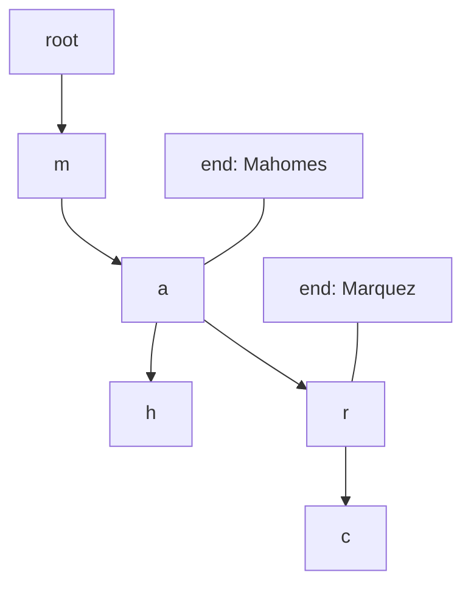
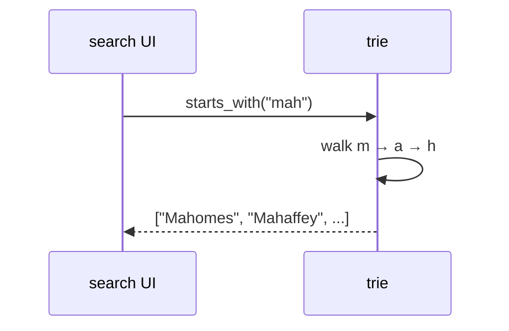
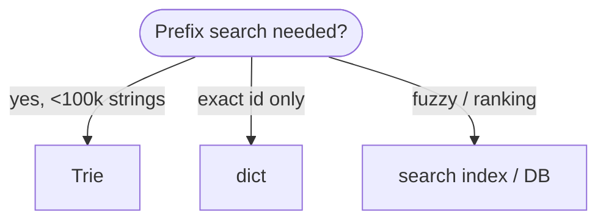
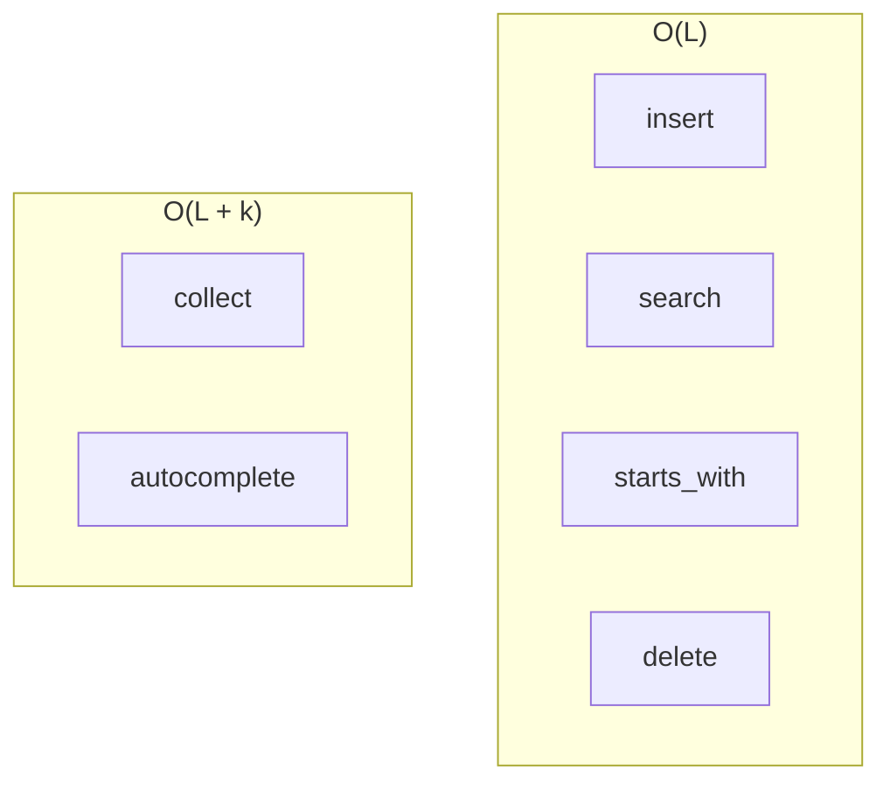
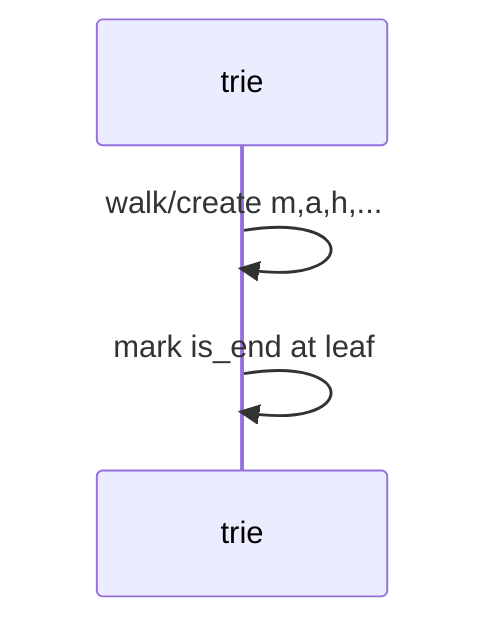
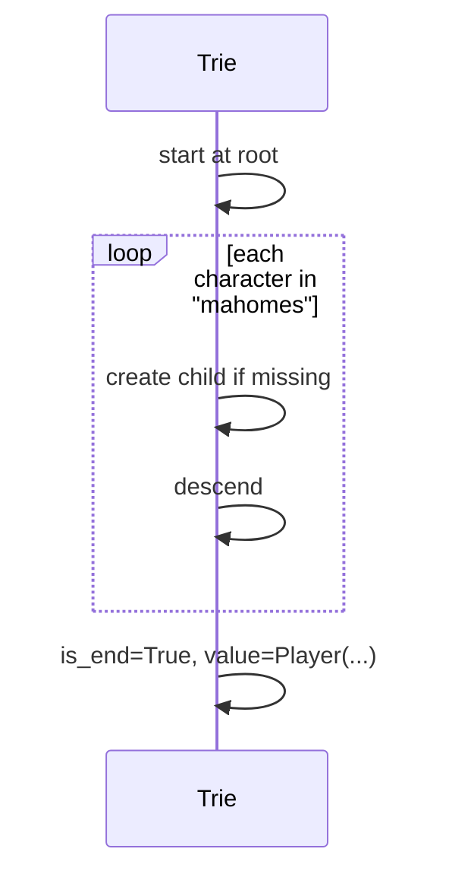
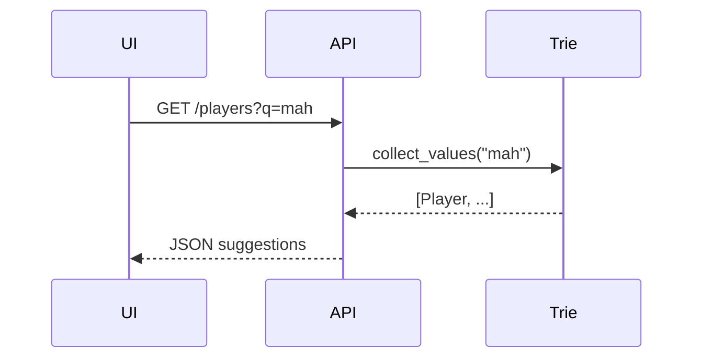

# Tries

A **tree keyed by characters (or tokens)** where each path from the root spells a prefix shared by all strings below it. Also called a **prefix tree** or **digital tree**.

| | |
| --- | --- |
| **What it is** | Each edge labeled with one character; nodes mark end-of-word; search walks characters of the key. |
| **Core operations** | Insert, exact search, prefix search, delete (with pruning). |
| **When to use** | Autocomplete, prefix filters, dictionaries of player names, team abbrev suggestions. |
| **Trade-off** | Space grows with alphabet × depth; hash map wins for exact key lookup only. |

In **NFL data analysis**, tries shine when users **type ahead** on **player names** (`"Mah"` → Mahomes, Mahaffey), **team abbreviations** (`"K"` → KC, …), or **route concepts** with shared prefixes. Exact `play_id` lookup stays in a [Hash table](../hash-table/index.md); tries complement hashes for **prefix** and **completion** UX.

This page is your **ready reference**: Python implementations (`dict`-of-children and `Trie` class), every operation with NFL examples, complexity tables, pitfalls, and when `dict` beats trie. For Big-O notation, see [Complexity analysis](../../complexity/index.md).

[Parent: Data structures](../index.md)

---

## Trie vs hash table vs sorted list

| | **Trie** | **`dict` / `set`** | **Sorted + bisect** |
| --- | --- | --- | --- |
| **Exact lookup** | O(L) | O(1) avg | O(log n) |
| **Prefix all matches** | O(L + k) | O(n) scan all keys | O(log n + k) |
| **Autocomplete** | Natural | Slow scan | Possible |
| **Space** | O(total chars) | O(n) keys | O(n) |
| **NFL** | Name/typeahead UI | `play_id` index | Leaderboards by name |



**L** = key length (characters). **k** = number of matches returned.

---

## NFL data analysis: what a trie models

| NFL idea | Trie keys | Operation |
| --- | --- | --- |
| **Player search box** | `player.name.lower()` | `starts_with("mah")` |
| **Team abbrev** | `"KC"`, `"BUF"`, … | prefix as user types |
| **Concept tags** | `"PAConcept#"` shared prefix | group drills |
| **Roster by last name** | `"Kelce"` | insert full names |
| **Forbidden word filter** | banned substring scan | prefix walk |

```python
from dataclasses import dataclass


@dataclass(frozen=True)
class Player:
    player_id: str
    name: str
    team: str
    position: str


@dataclass(frozen=True)
class Team:
    abbr: str
    city: str
    name: str
```

---

## Mental model: root, children, end marker

- **Root** — empty string prefix.
- **Edge** — one character (or one token if word-level trie).
- **`is_end`** — node completes a stored string; may also store `player_id` payload.



| Step | Cost driver |
| --- | --- |
| Descend one char | O(1) per level with dict children |
| Full word length L | O(L) |

---

## Ways to create a trie in Python

### 1. Empty `Trie` class

```python
class TrieNode:
    def __init__(self) -> None:
        self.children: dict[str, TrieNode] = {}
        self.is_end: bool = False
        self.value: Any | None = None

class Trie:
    def __init__(self) -> None:
        self.root = TrieNode()
```

| | |
| --- | --- |
| **Time** | O(1) |
| **Space** | O(1) |

### 2. Insert roster from iterable

```python
def build_player_trie(players: list[Player]) -> Trie:
    t = Trie()
    for p in players:
        t.insert(p.name.lower(), p)
    return t
```

| | |
| --- | --- |
| **Time** | O(total characters) |
| **Space** | O(total characters) |

### 3. `defaultdict` recursive trie (compact teaching)

```python
from collections import defaultdict

def make_node() -> dict:
    return defaultdict(make_node)

# root = make_node()  # then navigate root['m']['a']['h']
```

| | |
| --- | --- |
| **Time** | O(1) per node creation lazy |
| **Space** | Shared prefixes |

### 4. Third-party / notes

Production Python services often use:

- **Database** `LIKE 'mah%'` for large rosters.
- **Search engines** (Elasticsearch) for fuzzy match.

Tries in pure Python excel in **medium** catalogs (thousands of players) and **teaching**.



---

## Reference implementation: `Trie` with full API

```python
from __future__ import annotations

from dataclasses import dataclass
from typing import Any, Iterator


@dataclass
class TrieNode:
    children: dict[str, TrieNode]
    is_end: bool = False
    value: Any | None = None

    def __init__(self) -> None:
        self.children = {}
        self.is_end = False
        self.value = None


class Trie:
    """Prefix tree over single-character edges (lowercase strings)."""

    def __init__(self) -> None:
        self.root = TrieNode()
        self._size = 0

    def __len__(self) -> int:
        return self._size

    def clear(self) -> None:
        self.root = TrieNode()
        self._size = 0

    def insert(self, word: str, value: Any | None = None) -> None:
        node = self.root
        for ch in word:
            if ch not in node.children:
                node.children[ch] = TrieNode()
            node = node.children[ch]
        if not node.is_end:
            self._size += 1
        node.is_end = True
        node.value = value

    def search(self, word: str) -> Any | None:
        node = self._find_node(word)
        if node is None or not node.is_end:
            return None
        return node.value

    def contains(self, word: str) -> bool:
        return self.search(word) is not None or (
            self._find_node(word) is not None
            and self._find_node(word).is_end
        )

    def starts_with(self, prefix: str) -> bool:
        return self._find_node(prefix) is not None

    def _find_node(self, prefix: str) -> TrieNode | None:
        node = self.root
        for ch in prefix:
            if ch not in node.children:
                return None
            node = node.children[ch]
        return node

    def delete(self, word: str) -> bool:
        """Remove word; prune dead branches."""

        def _delete(node: TrieNode, depth: int) -> bool:
            if depth == len(word):
                if not node.is_end:
                    return False
                node.is_end = False
                node.value = None
                return len(node.children) == 0
            ch = word[depth]
            if ch not in node.children:
                return False
            child = node.children[ch]
            should_prune = _delete(child, depth + 1)
            if should_prune:
                del node.children[ch]
            return len(node.children) == 0 and not node.is_end

        if _delete(self.root, 0):
            self._size -= 1
            return True
        node = self._find_node(word)
        if node and node.is_end:
            node.is_end = False
            node.value = None
            self._size -= 1
            return True
        return False

    def collect(self, prefix: str = "") -> list[str]:
        """All words with given prefix."""
        node = self._find_node(prefix)
        if node is None:
            return []
        out: list[str] = []
        self._dfs_words(node, prefix, out)
        return out

    def collect_values(self, prefix: str = "") -> list[Any]:
        node = self._find_node(prefix)
        if node is None:
            return []
        out: list[Any] = []
        self._dfs_values(node, out)
        return out

    def _dfs_words(self, node: TrieNode, path: str, out: list[str]) -> None:
        if node.is_end:
            out.append(path)
        for ch, child in sorted(node.children.items()):
            self._dfs_words(child, path + ch, out)

    def _dfs_values(self, node: TrieNode, out: list[Any]) -> None:
        if node.is_end and node.value is not None:
            out.append(node.value)
        for child in node.children.values():
            self._dfs_values(child, out)

    def longest_common_prefix(self) -> str:
        node = self.root
        prefix: list[str] = []
        while len(node.children) == 1 and not node.is_end:
            ch, node = next(iter(node.children.items()))
            prefix.append(ch)
        return "".join(prefix)
```

---

## All operations (with examples and complexity)



### `insert(word, value=None)`

```python
trie = Trie()
trie.insert("mahomes", Player("00-001", "Patrick Mahomes", "KC", "QB"))
trie.insert("mahaffey", Player("00-002", "Nick Mahaffey", "KC", "OL"))
```

| | |
| --- | --- |
| **Time** | O(L) |
| **Space** | O(L) new nodes worst case (no shared prefix) |



---

### `search(word)` — exact match

```python
p = trie.search("mahomes")
```

| | |
| --- | --- |
| **Time** | O(L) |
| **Space** | O(1) |

Returns attached `Player` or `None`.

---

### `contains(word)`

| | |
| --- | --- |
| **Time** | O(L) |
| **Space** | O(1) |

---

### `starts_with(prefix)` — any word under prefix?

```python
assert trie.starts_with("mah")
assert not trie.starts_with("zzz")
```

| | |
| --- | --- |
| **Time** | O(L) |
| **Space** | O(1) |

**NFL UI:** Enable autocomplete dropdown after user types 3+ chars.

---

### `collect(prefix)` — all completions

```python
matches = trie.collect("mah")
# ["mahaffey", "mahomes"] sorted by DFS order
```

| | |
| --- | --- |
| **Time** | O(L + k + total output length) |
| **Space** | O(k) recursion stack |

---

### `collect_values(prefix)` — payload objects

```python
players = trie.collect_values("ma")
```

| | |
| --- | --- |
| **Time** | O(L + k) |
| **Space** | O(k) |

---

### `delete(word)`

```python
trie.delete("mahaffey")
```

| | |
| --- | --- |
| **Time** | O(L) |
| **Space** | O(L) recursion stack |

Prune nodes that become useless branches.

---

### `longest_common_prefix()`

```python
t = Trie()
for abbr in ["KC", "KCC", "KCY"]:
    t.insert(abbr.lower())
# useful for detecting shared team abbrev prefixes in toy data
```

| | |
| --- | --- |
| **Time** | O(L) |
| **Space** | O(1) |

---

### `len(trie)` / `clear()`

| | |
| --- | --- |
| **Time** | O(1) len; O(1) clear drop root |
| **Space** | O(1) |

---

## NFL patterns with tries

### Autocomplete player names

```python
def autocomplete(trie: Trie, partial: str, limit: int = 10) -> list[Player]:
    partial = partial.lower().strip()
    if not partial:
        return []
    players = trie.collect_values(partial)
    return players[:limit]
```

| | |
| --- | --- |
| **Time** | O(L + k) |
| **Space** | O(k) |

### Team abbreviation typeahead

```python
TEAMS = ["ARI", "ATL", "BAL", "BUF", "CAR", "CHI", "CIN", "CLE", "DAL", "DEN",
         "DET", "GB", "HOU", "IND", "JAX", "KC", "LA", "LAC", "LV", "MIA",
         "MIN", "NE", "NO", "NYG", "NYJ", "PHI", "PIT", "SEA", "SF", "TB",
         "TEN", "WAS"]

team_trie = Trie()
for abbr in TEAMS:
    team_trie.insert(abbr.lower(), abbr)

def suggest_team(prefix: str) -> list[str]:
    return [team_trie.search(w) for w in team_trie.collect(prefix.lower())]
```

| | |
| --- | --- |
| **Time** | O(L + k) |
| **Space** | O(32) tiny |

For only 32 teams, a **sorted list + filter** is simpler—trie pays off when *n* is thousands (players).

### Prefix word filter on commentary tokens

```python
banned = Trie()
for word in ("badword1", "badword2"):
    banned.insert(word)

def has_banned_prefix(token: str) -> bool:
    return any(
        banned.starts_with(token[:i])
        for i in range(1, len(token) + 1)
    )
```

| | |
| --- | --- |
| **Time** | O(L²) naive; O(L) with careful walk |
| **Space** | O(banned total chars) |

---

## Variants (conceptual)

| Variant | Idea | When |
| --- | --- | --- |
| **Compressed (radix / Patricia)** | Merge single-child chains | Save space on sparse tries |
| **Array of size 26** | Fixed alphabet | Uppercase A–Z only |
| **Word-level trie** | Edge = whole token | NLP play descriptions |
| **Suffix trie** | All suffixes of one string | advanced text; heavy space |

---

## Array-based children vs `dict` children

| | **`dict[str, TrieNode]`** | **array[26]** |
| --- | --- | --- |
| **Space** | O(active children) | O(26) per node always |
| **Lookup child** | O(1) hash | O(1) index |
| **Alphabet** | Unicode / arbitrary | Restricted |
| **NFL names** | Preferred (mixed case normalized) | Only if A–Z enforced |

---

## Master complexity table

Let **L** = word length, **k** = matches, **N** = total stored characters across all words.

| Operation | Time | Space (aux) |
| --- | --- | --- |
| `insert` | O(L) | O(L) new nodes |
| `search` / `contains` | O(L) | O(1) |
| `starts_with` | O(L) | O(1) |
| `collect` / autocomplete | O(L + k + output) | O(k) stack |
| `delete` | O(L) | O(L) stack |
| Build n players avg length L̄ | O(n · L̄) | O(N) total |
| DFS all words | O(N) | O(output) |

**Storage:** O(N) characters stored in tree structure plus node overhead.

---

## Python stdlib: what to use instead

| Need | Tool |
| --- | --- |
| Exact `play_id` | `dict[int, Play]` |
| Few dozen teams | `list` + filter |
| Thousands of players typeahead | `Trie` or DB `ILIKE` |
| Fuzzy spelling | `difflib`, rapidfuzz, search engine |
| Prefix in pandas | `df[df['name'].str.startswith('Mah')]` |

```python
import pandas as pd

players = pd.read_csv("players.csv")
hits = players[players["name"].str.lower().str.startswith("mah")]
```

Vectorized pandas is often faster than pure Python trie for **batch** queries; trie wins for **interactive** single-prefix lookups in memory.

---

## When trie vs hash vs scan


| Pitfall | Fix |
| --- | --- |
| Storing uppercase mixed keys | Normalize to `.lower()` on insert/search |
| Empty string insert | Define policy (usually skip) |
| Huge alphabet Unicode | Use dict children, not array[65536] |
| Duplicate insert same word | Decide overwrite vs ignore |
| Trie for 32 teams only | Overkill — use list |
| Not attaching `player_id` at leaf | Store payload in `value` |

---

## Case-insensitive wrapper

Normalize once at the boundary:

```python
class CaseInsensitiveTrie:
    def __init__(self) -> None:
        self._t = Trie()

    def insert(self, word: str, value: Any | None = None) -> None:
        self._t.insert(word.lower(), value)

    def search(self, word: str) -> Any | None:
        return self._t.search(word.lower())

    def collect(self, prefix: str) -> list[str]:
        return self._t.collect(prefix.lower())
```

| | |
| --- | --- |
| **Time** | O(L) per op |
| **Space** | Same as inner trie |

**NFL:** User types `"MAH"` or `"mah"` — same completions.

---

## Array-based trie node (A–Z only)

When keys are **uppercase team codes** or A–Z only:

```python
class AlphaTrieNode:
    __slots__ = ("children", "is_end", "value")

    def __init__(self) -> None:
        self.children: list[AlphaTrieNode | None] = [None] * 26
        self.is_end = False
        self.value = None

    def _idx(self, ch: str) -> int:
        return ord(ch.upper()) - ord("A")
```

| | |
| --- | --- |
| **Time** | O(1) child index |
| **Space** | 26 pointers per node (sparse waste) |

Use **`dict` children** for full player names with mixed characters.

---

## Insert walkthrough (mermaid)



---

## Word search on formation grid (toy)

Given a 2D grid of letters, find if a formation code exists (DFS + trie):

```python
def find_word(board: list[list[str]], word: str, trie: Trie) -> bool:
    if not trie.starts_with(word[0]):
        return False
    rows, cols = len(board), len(board[0])

    def dfs(r: int, c: int, i: int) -> bool:
        if i == len(word):
            return True
        if r < 0 or c < 0 or r >= rows or c >= cols:
            return False
        if board[r][c] != word[i]:
            return False
        ch = board[r][c]
        board[r][c] = "#"
        found = any(
            dfs(r + dr, c + dc, i + 1)
            for dr, dc in ((0, 1), (1, 0), (0, -1), (-1, 0))
        )
        board[r][c] = ch
        return found

    return any(dfs(r, c, 0) for r in range(rows) for c in range(cols))
```

| | |
| --- | --- |
| **Time** | O(rows · cols · 4^L) naive |
| **Space** | O(L) stack |

**NFL:** Toy for workbook puzzles—not production PBP search.

---

## `Trie` method checklist

| Method | Time | Returns |
| --- | --- | --- |
| `insert` | O(L) | None |
| `search` | O(L) | payload or None |
| `contains` | O(L) | bool |
| `starts_with` | O(L) | bool |
| `collect` | O(L + output) | list[str] |
| `collect_values` | O(L + k) | list payloads |
| `delete` | O(L) | bool |
| `longest_common_prefix` | O(L) | str |
| `clear` | O(1) | None |
| `len` | O(1) | count words |

---

## Radix / Patricia (compressed) — when space matters

If the trie is **sparse** with long single-child chains, compress paths into one edge labeled with a substring. Python rarely needs this for player tries (≈ few thousand nodes); routing tables and DNA-style keys benefit more.

| | Standard trie | Radix tree |
| --- | --- | --- |
| Space | O(total chars) | O(nodes) smaller |
| Implement | Easy in Python | Harder |
| NFL autocomplete | dict trie enough | optional at scale |

---

## Autocomplete API sketch (Flask-style)

```python
def search_players(trie: Trie, q: str, limit: int = 8) -> list[dict]:
    q = q.strip().lower()
    if len(q) < 2:
        return []
    players = trie.collect_values(q)
    return [
        {"player_id": p.player_id, "name": p.name, "team": p.team}
        for p in players[:limit]
    ]
```

| Step | Time |
| --- | --- |
| normalize query | O(L) |
| `collect_values` | O(L + k) |
| JSON serialize | O(k) |

Debounce keystrokes in the UI so you do not rebuild completions on every keypress for large tries.



---

## Bulk build from nflverse roster CSV

```python
import csv

def trie_from_roster_csv(path: str) -> Trie:
    t = Trie()
    with open(path, newline="") as f:
        for row in csv.DictReader(f):
            name = row.get("display_name") or row.get("player_name", "")
            pid = row["gsis_id"]
            team = row.get("team", "")
            t.insert(name.lower(), Player(pid, name, team, row.get("position", "")))
    return t
```

| | |
| --- | --- |
| **Time** | O(total name characters) |
| **Space** | O(trie nodes) |

Rebuild trie when rosters update (trade deadline), not on every HTTP request.

---

## Prefix vs substring

| Query | Structure |
| --- | --- |
| Keys **starting with** `"mah"` | Trie |
| Keys **containing** `"homes"` | Scan all keys O(n) or full-text index |
| Exact `play_id` | `dict` |

Document your search product: trie is **prefix-only**.

---

## Related structures in this guide

| Structure | Link |
| --- | --- |
| [Hash table](../hash-table/index.md) | Exact key O(1) |
| [Binary search tree](../binary-search-tree/index.md) | Ordered keys |
| [Graphs](../graphs/index.md) | Different edge semantics |

---

## Quick reference card

```python
trie = Trie()
trie.insert("mahomes", player_obj)
trie.insert("mahaffey", other_player)

# Exact
p = trie.search("mahomes")

# Prefix
if trie.starts_with("mah"):
    names = trie.collect("mah")
    players = trie.collect_values("mah")

# Remove
trie.delete("mahaffey")
```

Use a **trie** when **prefix queries** and **autocomplete** dominate—player search, shared concept prefixes, command palettes. Use **`dict`** for **`play_id`** and **`Counter`** for stats; use **pandas** for bulk season filters.

**NFL pipeline checklist**

1. **Exact play lookup** — `dict` or DataFrame index, not trie.
2. **Name search UI** — trie on normalized `name.lower()`.
3. **Normalize** — case and diacritics policy at insert and query.
4. **Size** — trie for thousands of strings; consider DB for full historical roster search.
5. **Return payload** — store `Player` at `is_end` node, not just string.
